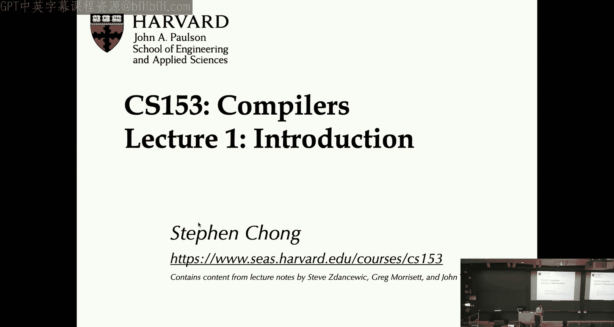
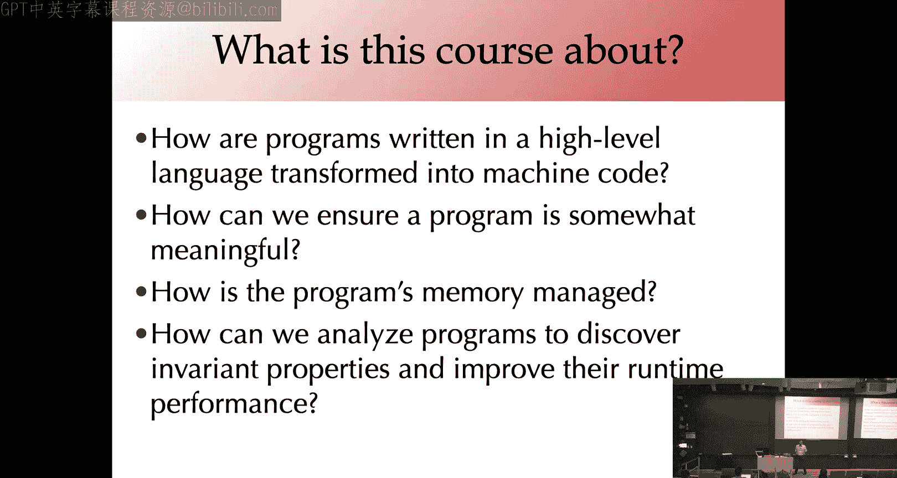
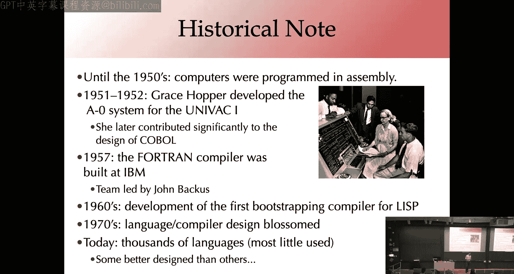
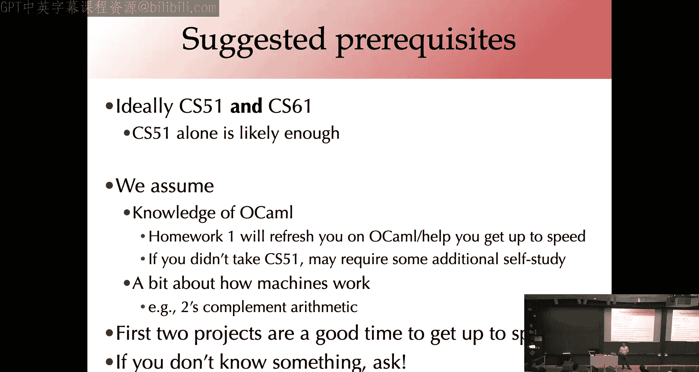
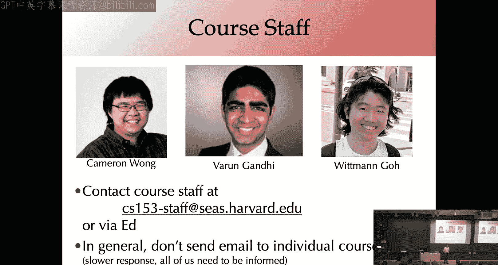
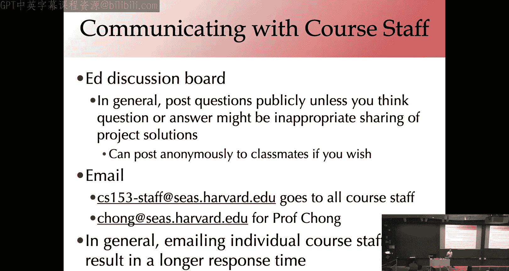
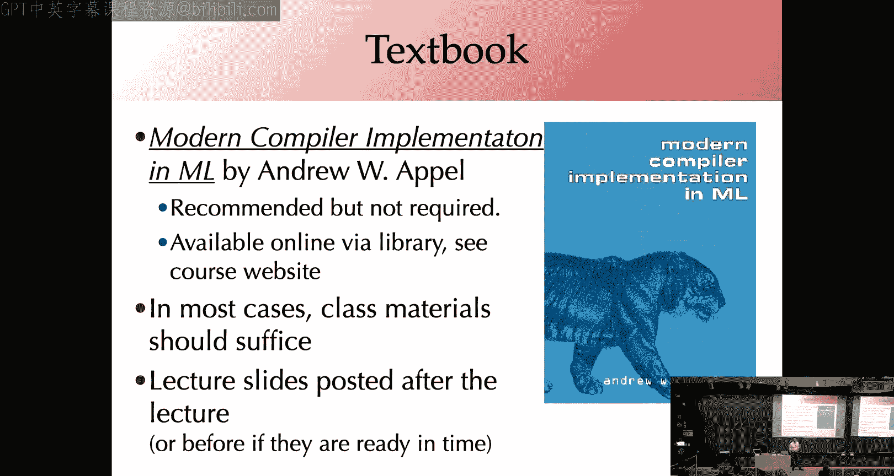
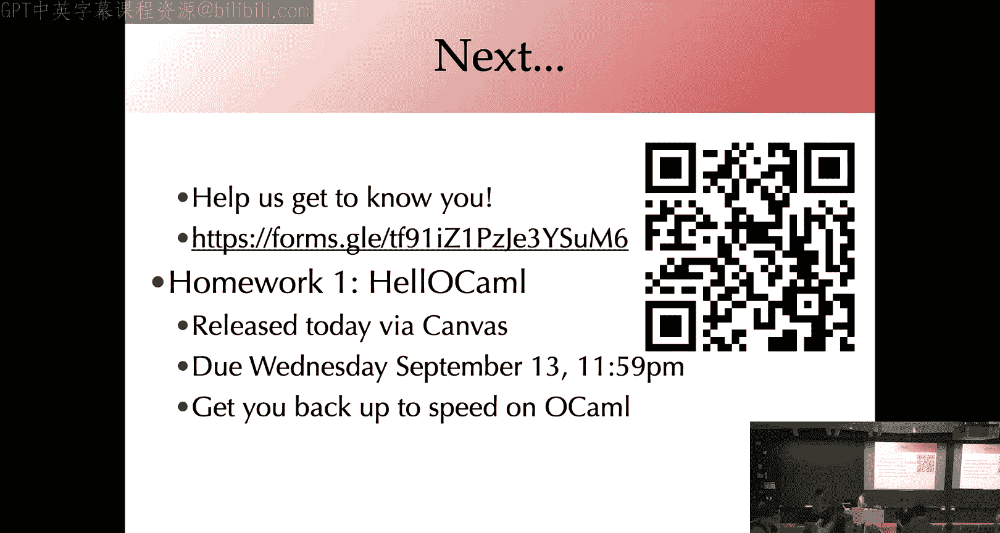

# 001：课程概述与编译器简介 🚀

在本节课中，我们将学习什么是编译器，了解其基本架构和主要工作阶段，并熟悉本课程的整体安排与要求。

## 什么是编译器？

我们编写程序时，从**源代码**开始。源代码是文本文件，通常是人类可读的。而计算机最终执行的是**目标代码**，这是一种低级、不易于人类阅读且表达能力有限的代码。

编译器就是将我们从高级语言（源代码）带到低级语言（目标代码）的程序。

## 编译器架构概览

上一节我们定义了编译器，本节中我们来看看编译器内部的基本工作流程。

编译过程通常分为多个阶段。下图展示了典型的编译器架构：

以下是编译器的主要工作阶段：

1.  **解析**：将源代码的字符序列转换为一种数据结构，即更结构化的程序表示。
2.  **精化**：主要为类型检查。为程序的数据结构添加更多信息，例如推断表达式的类型，并确保程序类型正确。
3.  **降级**：将高级语言逐步转换为一种或多种**中间语言**，使其越来越接近底层的汇编代码。
4.  **优化**：在中间表示上应用各种转换，旨在提高程序运行速度。这是一个迭代过程。
5.  **代码生成**：将中间表示转换为实际的、机器可执行的汇编指令。

编译器通常分为**前端**和**后端**。前端处理从解析到降级为某种中间表示的过程。后端则负责将该中间表示进一步编译，执行优化和代码生成等。例如，LLVM编译器允许不同语言使用各自的前端，编译到一个共同的中间表示，然后由一个共同的后端生成汇编代码。

## 编译器简史

了解了现代编译器架构后，我们简单回顾一下它的发展历程。

*   在20世纪50年代之前，计算机直接用低级汇编语言编程。
*   50年代初，Grace Hopper为UNIVAC机开发了A-0系统，并后来对COBOL语言的设计做出了重大贡献。
*   50年代末，IBM构建了Fortran编译器。Fortran是C语言的前身。
*   60年代，为Lisp语言创建了第一个**自举编译器**（即用Lisp语言本身编写的Lisp编译器）。
*   70年代，高级语言和编译技术真正兴起，许多核心思想在此时期及之后得到发展。

如今，我们正处于编程语言的黄金时代，有成千上万种语言，为特定目的快速创建和部署语言变得非常令人兴奋。

## 编译器各阶段详解

上一节我们概述了历史，现在让我们更深入地看看编译器每个阶段的具体任务。

### 前端：解析与精化

解析通常分为两个步骤：
*   **词法分析**：将字符串分解成称为**词法单元**的块。例如，识别`while`、`else`等关键字。
*   **语法分析**：接收词法单元流，并将其转换为**抽象语法树**这种数据结构。

精化阶段主要是类型检查，例如确定变量引用、推断子表达式类型、确保操作数类型正确，以及进行一些安全性和安全性检查。

### 降级与优化

降级是将高级语言特性转换为更简单的低级语言表示的过程。例如：
*   将各种控制流结构（如`for`、`while`循环）编译为只包含`goto`语句的语言。
*   处理作为值传递的函数等特性。
*   将数组越界检查等运行时检查显式化。

优化阶段将昂贵的操作序列重写为成本更低的序列。例如：
*   **常量折叠**：将表达式`3 + 4`在编译时简化为`7`。
*   **循环不变代码外提**：将循环内不变的计算移到循环外部。
*   **并行化**：如果循环迭代互不依赖，可编译为并行执行。

### 代码生成

代码生成阶段将中间代码转换为目标代码，涉及：
*   **寄存器分配**：将中间表示中的变量映射到处理器有限的寄存器上。
*   **指令选择与调度**：选择具体的低级指令，并可能调度指令顺序以提高效率。

## 课程介绍与安排

前面我们深入探讨了技术细节，现在把焦点拉回，看看本课程的具体情况。

### 为什么学习编译器？

*   **关键基础设施**：编译器是我们编程乃至整个世界运行的关键基础设施。
*   **理解语言特性**：帮助我们理解语言特性的设计与实现，以及为何添加某些特性可能困难。
*   **软硬件协同设计**：对于计算机体系结构感兴趣的同学，编译器知识至关重要。
*   **终极抽象**：编程语言是计算的终极抽象，编译器是实现这一抽象的核心。

### 学习目标与预备知识

本课程将学习词法分析、语法分析、解释器、以x86为编译目标，以及GCC、LLVM等编译工具。这将是一个实现密集型课程，通过编写复杂代码来提升编程能力。

建议先修课程为CS51和CS61。本课程可视为这两门课的结合：从CS51的高级抽象思想到CS61的低级系统细节。课程主要使用OCaml语言实现编译器。

### 课程工具与评分

我们将使用Canvas网站、Ed讨论板和Gradescope提交作业。主要编程语言为OCaml 4.14.1。课程无固定章节，但会有大量办公时间。

评分比例如下：
*   **项目作业**：70%（共6个项目，外加一个嵌入式伦理作业，权重不等）
*   **期末考试**：20%
*   **课程参与**：10%

项目作业通常有2-3周时间完成。请注意管理时间，尽早开始。我们提供了充足的延迟提交额度（共10天，单次作业最多用3天），但这并非用于应对特殊情况，如有特殊情况请直接联系教师。

### 学术诚信与合作学习

作业需独立完成，但鼓励通过**学习小组**进行高水平概念讨论和低层次细节调试（例如如何解决某个语法错误）。关键在于**用语言交流思想，而非共享代码**。

关于生成式AI工具（如ChatGPT）的使用，原则类似：可用于理解高级概念或查询低层次语法示例，但不应让其生成作业的核心代码部分。使用时请在提交的代码中注明。

### 学习支持与课堂期望

我们将随机组建学习小组（可自愿退出），以促进同伴学习。课堂环境力求包容与支持。设备使用方面，教室将分为“可使用设备”和“无设备”区域，请根据自身情况选择就坐。

期望大家能跟上课程进度、照顾好自己、积极参与，并妥善管理时间。

## 总结

本节课中我们一起学习了编译器的基本定义、核心架构与历史沿革，并详细了解了从解析到代码生成的各个阶段。同时，我们也明确了本课程的目标、安排、学术要求以及提供的学习支持。编译器是连接高级思想与机器执行的桥梁，希望本课程能帮助你揭开这层神秘面纱，并构建出属于自己的桥梁。

---
**附**：首次作业“Hello OCaml”已发布，请查阅Canvas网站。请在本周五前完成课程背景调查。一个展示如何使用OCaml数据结构和解释器表示简单语言的示例文件也已提供，供有兴趣的同学探索。