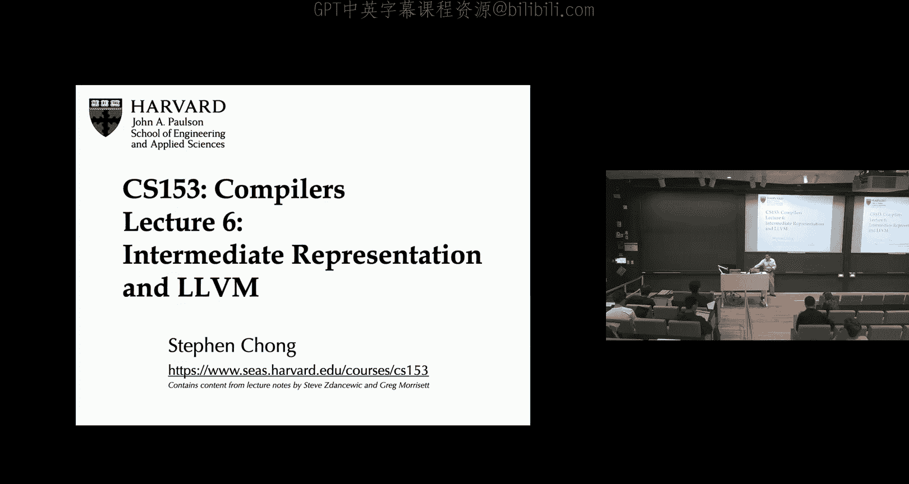
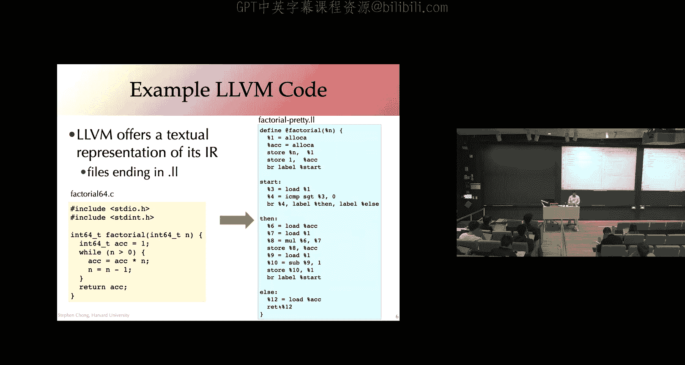
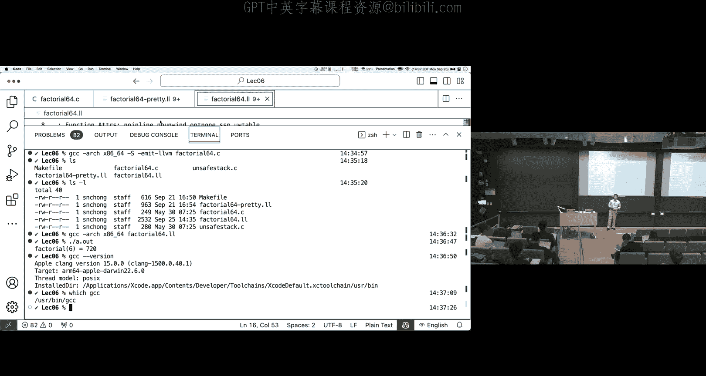
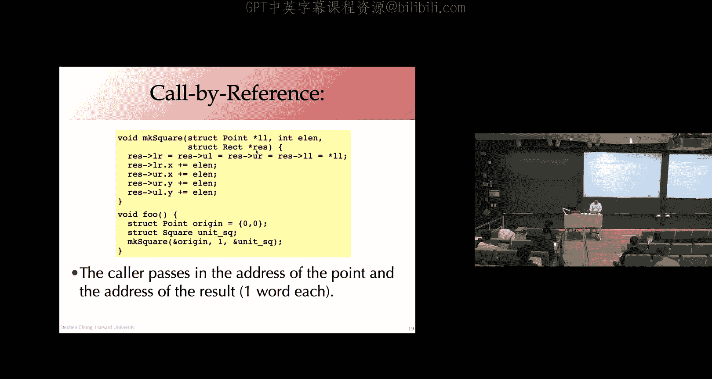
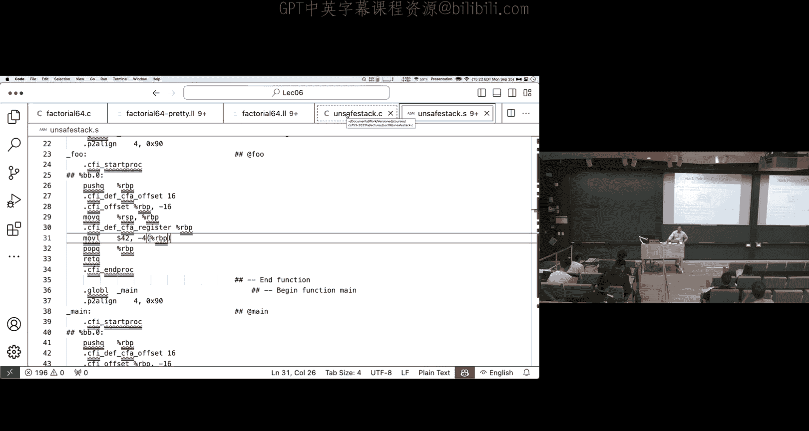
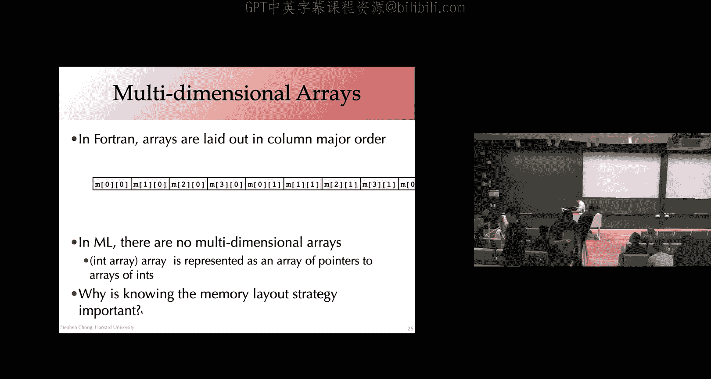

# 007：LLVM与结构化数据表示



在本节课中，我们将要学习LLVM（低级虚拟机）的基本概念，并探讨如何在机器层面表示高级语言中的结构化数据（如结构体和数组）。理解这些内容对于后续的编译器实现至关重要。

## LLVM简介 🐉

LLVM是一个开源的编译器基础设施项目。它最初由伊利诺伊大学香槟分校的Chris Lattner在其硕士论文中创建，现已发展成为一个被广泛使用的工业级工具。LLVM的核心是一个类型化的SSA（静态单赋值）中间表示，它连接了多种前端（如C、C++、Swift）和后端（如x86、ARM、PowerPC）。

LLVM的中间表示具有文本形式，便于人类阅读和理解。其设计理念与我们上节课探讨的中间表示非常接近。

## LLVM IR示例与解析

以下是LLVM IR的一个简单示例，它计算一个整数的阶乘。

```llvm
define i64 @factorial(i64 %n) {
entry:
  %1 = alloca i64
  %acc = alloca i64
  store i64 %n, i64* %1
  store i64 1, i64* %acc
  br label %start



start:
  %2 = load i64, i64* %1
  %3 = icmp sgt i64 %2, 0
  br i1 %3, label %then, label %else

then:
  %4 = load i64, i64* %acc
  %5 = load i64, i64* %1
  %6 = mul i64 %4, %5
  store i64 %6, i64* %acc
  %7 = load i64, i64* %1
  %8 = sub i64 %7, 1
  store i64 %8, i64* %1
  br label %start



else:
  %9 = load i64, i64* %acc
  ret i64 %9
}
```

上一节我们介绍了LLVM的基本概念，本节中我们来看看其代码的具体构成。

以下是该示例的关键组成部分解析：

*   **函数定义**：`define i64 @factorial(i64 %n)` 定义了一个返回`i64`类型、名为`factorial`的函数，它接受一个`i64`类型的参数`%n`。
*   **基本块**：代码被组织成带标签的基本块（如`entry`、`start`、`then`、`else`）。每个基本块以一条终结指令（如`br`或`ret`）结束。
*   **局部变量（虚拟寄存器）**：以`%`开头的标识符（如`%1`、`%acc`）是局部变量，遵循SSA形式，即每个变量在其生命周期内只被赋值一次。
*   **内存分配与访问**：`alloca`指令在栈上分配内存，返回一个指针。`store`和`load`指令用于向该内存写入和读取值。可变变量需要通过内存位置来实现。
*   **显式类型**：LLVM IR是强类型的，每个值和操作都有明确的类型注释（如`i64`表示64位整数，`i64*`表示指向`i64`的指针）。

## 控制流图与存储类别

LLVM IR中的基本块序列构成了一个控制流图。为了确保图的良构性，需要满足一些约束，例如每个标签必须唯一，且跳转目标必须在同一函数内定义。

在LLVM中，有多种存储类别：

*   **局部变量（`%uid`）**：也称为虚拟寄存器，通常最终会被分配到物理寄存器。
*   **全局变量（`@name`）**：具有全局作用域，通常存储在内存的数据段。
*   **栈分配存储**：通过`alloca`指令创建，其生命周期与函数调用一致。
*   **堆分配存储**：通过类似`malloc`的调用创建。

`alloca`指令的典型用法如下，它分配指定类型的内存并返回指针：
```llvm
%ptr = alloca i64          ; 分配一个i64大小的栈空间，地址存入%ptr
store i64 153, i64* %ptr   ; 将值153存入该地址
%val = load i64, i64* %ptr ; 从该地址加载值到%val
```

## 结构化数据的低级表示

理解了LLVM的基本结构后，我们接下来看看编译器如何将高级语言中的结构化数据（如C语言中的`struct`和数组）映射到低级的内存表示。这有助于理解LLVM中相关操作的由来。

### 结构体的内存布局

一个C语言结构体在内存中被表示为一段连续的区域。例如：
```c
struct Point { int x; int y; };
struct Rect { struct Point ll; struct Point lr; struct Point ul; struct Point ur; };
```
`struct Point`占用两个连续的`int`（假设为4字节）空间。`struct Rect`则包含四个`Point`，因此连续存放，总共占用8个`int`的空间。

访问嵌套字段（如`square.ul.y`）时，编译器会根据基地址和各个字段的偏移量计算出目标地址。**计算这个地址本身不需要任何内存访问**，它只是基地址加上一个编译时确定的常量偏移量（例如，跳过`ll`和`lr`两个`Point`，再跳过`ul`的`x`字段）。

### 对齐与填充

为了性能，数据在内存中需要满足特定的对齐要求。编译器可能会在结构体字段之间插入“填充”字节，以确保每个字段都从其类型所需大小的倍数地址开始。例如，一个包含`char`和`int`的结构体可能需要填充，以使`int`对齐到4字节边界。这会影响结构体的总大小和字段偏移量。

### 结构体赋值与参数传递

在C语言中，结构体赋值是“按值复制”，即复制所有字段的内容。这同样适用于将结构体作为参数传递或作为返回值，这可能导致大量数据的拷贝。作为优化，通常可以传递指向结构体的指针（按引用传递），以避免复制开销。



**需要注意的是，返回指向栈上局部变量的指针是危险的**，因为该内存会在函数返回后失效，后续访问属于未定义行为。



## 数组的内存布局

数组在内存中也占据连续的空间。对于一维数组`arr[i]`，其地址计算为`基地址 + i * 元素大小`。

对于多维数组，C语言采用**行主序**存储。例如，一个`int m[4][3]`的数组，在内存中先连续存储第0行的3个元素，接着是第1行，以此类推。因此，访问`m[i][j]`的地址计算公式为：`基地址 + i * (3 * sizeof(int)) + j * sizeof(int)`。

其他语言可能采用**列主序**（如Fortran），或者使用**指针数组**（如OCaml中数组的数组）来实现多维数组。不同的布局策略对缓存友好性和某些操作（如交换行）的效率有显著影响。

## 总结




本节课中我们一起学习了LLVM中间表示的基本语法和设计思想，包括其SSA形式、类型系统、基本块和控制流图。随后，我们探讨了高级语言中结构体和数组在机器层面的内存表示方式，涉及连续布局、对齐填充、地址计算以及不同的多维数组实现策略。理解这些底层表示是后续进行编译器代码生成和优化的基础。下节课我们将更深入地探讨LLVM如何具体处理这些内存访问操作。