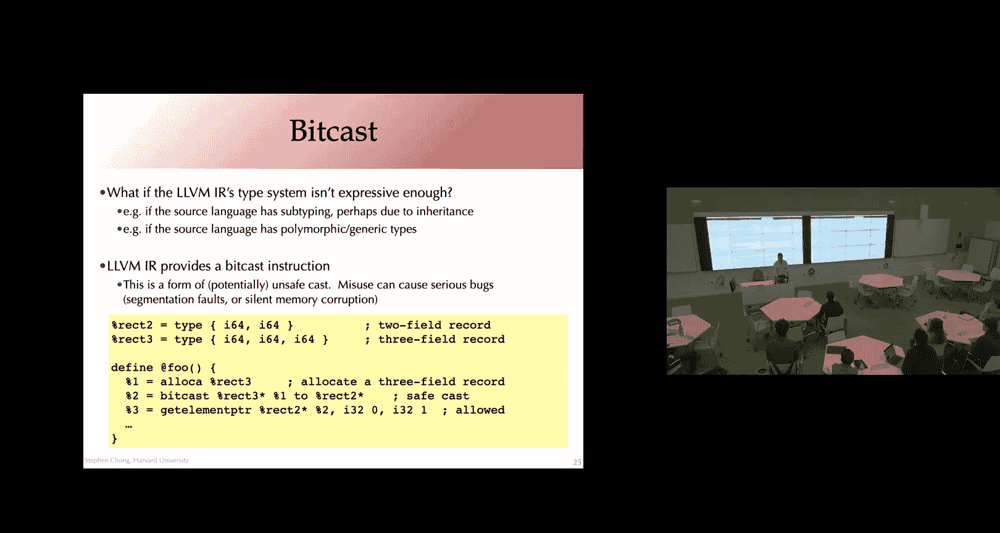
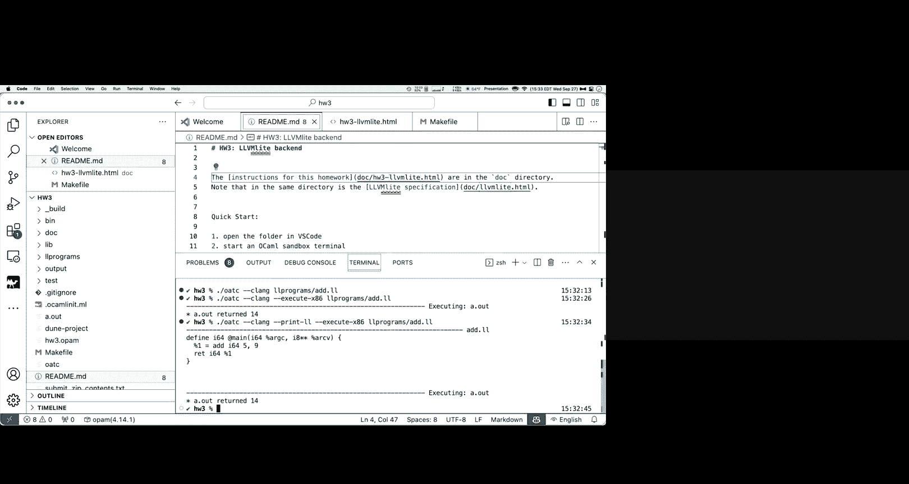

# 008：数据结构的编译与LLVM表示

在本节课中，我们将学习如何将C语言和类似语言中的高级数据结构（如数组、字符串、枚举和结构体）编译成汇编代码。我们还将深入了解LLVM中间表示（IR）如何对这些结构进行建模，特别是通过`getelementptr`指令进行地址计算。理解这些概念对于完成作业3（将LLVM IR编译为x86汇编）至关重要。

## 数组边界检查的实现

上一节我们讨论了数组在内存中的布局。本节中，我们来看看如何实现安全的数组访问，即边界检查。

在像ML、Java、C#这样的语言中，运行时需要检查数组访问是否越界。C和C++则不强制执行此类检查。对于需要边界检查的语言，一个关键问题是如何实现。

一种常见方法是将数组的大小存储在数组内容开始之前的一个字（word）中。这种设计有几个优点：
*   兼容性：数组的值仍然是一个指向内容起始处的指针，与C语言的表示兼容。
*   局部性：大小与数组数据存储在一起，可能带来更好的缓存行为。
*   计算简便：索引计算保持直接。

以下是实现边界检查的伪汇编思路。假设`RAX`寄存器持有指向数组基地址的指针，`ECX`寄存器持有要访问的索引`i`：
1.  从`RAX - 8`（前一个字）加载数组大小到`RDX`。
2.  比较`ECX`（索引）和`RDX`（大小）。
3.  如果索引超出范围，跳转到错误处理例程。
4.  否则，继续正常的数组访问计算：`有效地址 = RAX + i * 元素大小`。

当然，这比直接访问增加了开销（一次额外的加载、比较和跳转）。现代编译器和硬件通过以下方式缓解：
*   **循环优化**：编译器可以将循环内的边界检查外提（hoist）到循环开始处。
*   **分支预测**：硬件会预测`边界检查通过`是常见路径，并推测性地执行后续指令。

然而，这种推测执行也导致了像 **Spectre和Meltdown** 这样的安全漏洞，在追求性能和安全之间产生了权衡。

## C语言中的字符串

字符串在C语言中表示为字符数组，并且是**空终止（null-terminated）** 的，即最后一个字符是`\0`字节。

字符串常量通常作为全局数据存储，常被放在只读的文本段（text segment）。这带来一个需要注意的行为：指向字符串常量的指针指向的是只读内存。

```c
char *p = "foo"; // p 指向只读内存区域
p[0] = 'b';      // 错误！尝试修改只读内存，会导致段错误（Segmentation Fault）
```

若要修改字符串，必须先创建副本，通常使用`malloc`在堆上分配内存并进行复制：

```c
char *p = malloc(4 * sizeof(char)); // 为"foo"和空终止符分配空间
strncpy(p, "foo", 4); // 安全地复制字符串
p[0] = 'b'; // 现在可以修改
```

对于局部变量声明的字符数组，无论大小是否静态已知，通常都会在栈上分配。

## 标签数据类型与枚举

许多语言支持标签数据类型。在C或Java中，这体现为**枚举（enum）** 类型。

```c
enum day { Sun, Mon, Tue, Wed, Thu, Fri, Sat };
```

常见的实现方式是为每个标签关联一个整数（例如，Sun=0, Mon=1...）。在C语言中，程序员可以指定这些整数值。

在ML等语言中，代数数据类型（Algebraic Data Types）的构造器可以携带数据：

```ocaml
type foo = Bar of int | Baz of int * foo
```

这类类型的典型实现是一个**对（pair）**：
*   第一个元素是**标签（tag）**，一个整数，指示使用的是哪个数据构造器（例如，Bar=0, Baz=1）。
*   第二个元素是**数据**。其解释取决于标签。例如：
    *   `Bar 3` 表示为 `(0, 3)`
    *   `Baz (4, f)` 表示为 `(1, (4, *f))`，其中`*f`是指向之前创建的`foo`类型值的指针。

在ML中，一个`foo`类型的值总是一个指向`(tag, data)`对的指针。

## Switch语句的编译

标签数据类型的一个关键用途是`switch`语句（或ML中的模式匹配）。我们先看C语言的`switch`。

编译`switch`语句有几种策略：
1.  **级联if语句**：将每个`case`编译为一个比较和条件跳转。实现简单，但对于大量`case`，效率低下（最坏情况需进行O(n)次比较）。
2.  **跳转表**：如果`case`值密集（例如，枚举值从0到n-1），可以创建一个地址数组（跳转表）。执行时，直接用开关值作为索引查找跳转地址，只需O(1)时间。
3.  **二分查找/哈希表**：对于稀疏但大量的`case`值，可以构建一个（值，地址）对表，并使用二分查找或哈希表。

实际编译器中常使用启发式方法混合这些策略。

## 模式匹配的编译

ML中的模式匹配比C的`switch`更强大，允许嵌套匹配和变量绑定。一种编译策略是**扁平化**：将嵌套模式转换为一系列只检查顶层构造器的`switch`，并在匹配后继续匹配内部数据。这本质上产生了嵌套的`switch`语句。

优化模式匹配编译是一个深入的研究领域，许多优化可以在源码级别或高级IR上进行，例如重排匹配顺序以提升效率。

## LLVM IR 中的类型

现在，让我们回到LLVM IR，看看它如何表示这些结构化数据。LLVM IR是强类型的。

以下是LLVM中一些核心类型：
*   `void`：类似C中的`void`，用于表示不返回值的函数。
*   整数类型：`i64`, `i32`, `i8`, `i1`（用于布尔值）。
*   数组类型：`[<N> x <ty>]`。例如，`[42 x i64]`。数组大小`N`用于地址计算，**LLVM本身不插入边界检查**。未知大小用`[0 x <ty>]`表示。
*   函数类型：`<ret_ty> (<arg_ty>, <arg_ty>, ...)`。参数不能是`void`类型。
*   结构体类型：`{ <ty>, <ty>, ... }`。**注意**：LLVM结构体类型只有字段类型列表，没有字段名，访问时通过索引（0, 1, 2...）。
*   指针类型：`<ty>*`
*   命名类型：允许定义递归类型，如链表节点：`%Node = type { i32, %Node* }`

## GetElementPtr (GEP) 指令

这是LLVM中最关键也最易误解的指令之一，用于计算结构体或数组内部元素的地址。**必须牢记：GEP只进行指针运算，不访问内存。**

语法是：
```
<result> = getelementptr <ty>, <ty>* <ptrval>, <ty> <idx>, <ty> <idx>, ...
```

其抽象含义是：给定一个指向类型`<ty>`的指针`<ptrval>`（可将其视为指向一个`<ty>`数组的指针），通过一系列索引计算出一个新指针，指向该结构内部的某个子元素。

关键点：
*   **第一个索引**：解释`<ptrval>`指向的是一个`<ty>`数组，并索引到该数组的第`i`个元素。即使你只有一个元素，通常也使用索引`0`。
*   **后续索引**：根据当前计算出的类型（可能是结构体或数组），继续索引到其内部。
*   **结果**：是一个指针，指向最终计算出的元素。

**示例分析**：
考虑C代码：`&s[1].z.b[5][13]`，其中`s`是指向结构体数组的指针。假设结构体定义已翻译为LLVM类型。
对应的GEP指令可能类似于：
```
%ptr = getelementptr %struct.ST, %struct.ST* %s, i32 1, i32 2, i32 1, i32 5, i32 13
```
解读：
1.  `i32 1`：索引到`s`数组的第1个元素（跳过第0个）。
2.  `i32 2`：索引到该`ST`结构体的第2个字段（假设`z`是第2个字段，索引从0开始）。
3.  `i32 1`：索引到`RT`结构体的第1个字段（假设`b`是第1个字段）。
4.  `i32 5`：索引到二维数组`b`的第5行。
5.  `i32 13`：索引到该行（一维数组）的第13列。

这个GEP指令的结果`%ptr`是一个指向那个`i32`元素的指针。要获取该元素的值，还需要一条`load`指令。

## 类型转换与 Bitcast

有时源语言特性（如子类型）无法直接用LLVM类型表达。LLVM提供了`bitcast`指令作为“逃生舱口”。

`bitcast`将值从一种类型转换为另一种类型，**不改变任何位（bits）**。它要求源类型和目标类型位数相同。

**安全示例**：将一个指向`{i32, i32, i32}`（三维点）的指针，转换为指向`{i32, i32}`（二维点）的指针是安全的，因为任何对二维点的操作（读/写前两个整数）在三维点上同样有效。
```llvm
%p1 = alloca { i32, i32, i32 } ; 在栈上分配一个三维点
%p2 = bitcast { i32, i32, i32 }* %p1 to { i32, i32 }* ; 安全地转换指针类型
```

**不安全示例**：反向转换（二维点指针转为三维点指针）则不安全，因为程序可能尝试访问或修改不存在的第三个整数所在的内存，而那部分内存可能被用于其他目的，导致数据损坏。

因此，`bitcast`需要由编译器开发者谨慎使用，以确保其安全性符合源语言的语义。

## 作业3简介

作业3要求你将LLVM Light（一个LLVM子集）编译成x86-64汇编代码。

提供的材料包括：
*   **LLVM Light规范**：详细说明了作业中需要支持的LLVM指令、类型和操作。
*   **参考工具**：
    *   `clang`：可以将LLVM编译成汇编，供你参考。
    *   `lli`（LLVM解释器）：可以直接执行LLVM代码，帮助你理解程序预期行为。
    *   一个驱动脚本，可以运行你的编译器、参考编译器或解释器。

**强烈建议尽早开始作业3**，因为它具有挑战性。请仔细阅读文档，并随时在课程论坛上提问。

## 总结



本节课我们一起学习了：
1.  **数组边界检查**的实现策略及其性能与安全的权衡。
2.  **C语言字符串**的表示（空终止）及其只读常量带来的注意事项。
3.  **标签数据类型**（如枚举和代数数据类型）在内存中的表示方式（标签+数据）。
4.  **Switch语句**的多种编译策略（级联if、跳转表等）。
5.  **模式匹配**编译的基本思路（扁平化为嵌套switch）。
6.  **LLVM IR的核心类型系统**，包括数组、结构体、指针和命名类型。
7.  **`getelementptr` (GEP) 指令**的核心概念：它仅进行地址计算，不访问内存，并且总是隐式地将指针视为数组的起始。
8.  **`bitcast`指令**的用途与风险，它用于处理LLVM类型系统无法直接表达的转换。
9.  **作业3**的总体目标和可用资源。




理解这些数据结构的低级表示和LLVM的建模方式，是构建编译器后端（将IR映射到机器代码）的基础。