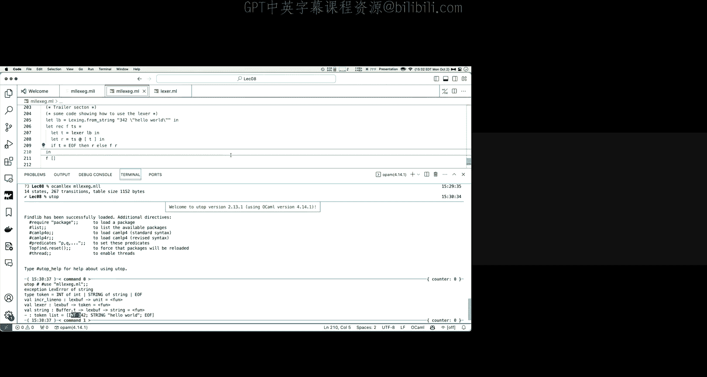

# 009：词法分析入门 🧠

在本节课中，我们将要学习编译过程中的第一步：词法分析。我们将了解如何将人类可读的源代码文本，转换成为编译器可以处理的、结构化的数据单元。

---

## 课程概述

上一节我们介绍了代码生成，即如何将中间表示转换为汇编代码。本节中，我们将跳回到编译器流水线的起点，开始学习**词法分析**。

词法分析是**解析**过程的一部分。解析的任务是获取源代码文本，并将其转换为机器可以操作和使用的数据结构。解析本身又分为两个主要部分：
1.  **词法分析**：将字符序列转换为“词法单元”。
2.  **语法分析**：将词法单元序列转换为数据结构（通常是抽象语法树）。

今天，我们将重点探讨第一部分：词法分析。

---

## 什么是词法分析？

当我们拿到一个源程序时，它本质上是一个字符序列。例如：
`if (price > 500) then tax = 0.0`

词法分析的作用，就是将这个字符序列分解成被称为 **“词法单元”** 的块。每个词法单元都对应于语言语法中有意义的基本单位。

在上面的例子中：
*   `if` 是一个关键字词法单元。
*   `price` 是一个标识符词法单元。
*   `>` 是一个运算符词法单元。
*   `500` 是一个数字词法单元。

语法分析则接收这个词法单元序列，并将其转换为树状数据结构，以展示程序的嵌套和分组结构。

---

## 词法单元类型

一种语言会将不同的词法项分类为**词法单元类型**。常见的类型包括：

以下是主要的词法单元类型：
*   **标识符**：变量、函数等实体的名称，例如 `price`, `last_in_14th`。
*   **数字**：表示整数常量，例如 `73`, `0`, `82`。
*   **实数**：表示浮点数，格式多样。
*   **关键字**：例如 `if`, `then`。
*   **标点符号和运算符**：例如 `,`, `!=`, `(`。

我们使用术语 **“保留字”** 来指代那些不能用作标识符的词法单元。例如，在 C、Java、C++ 中，`if`, `void`, `return`, `while` 等关键字有特殊含义，不能用作变量名。

---

## 非词法单元内容

当词法分析器遍历字符序列时，有些内容并不会被转换为词法单元，而是会被丢弃。

以下是不被视为词法单元的内容：
*   **空白字符**：如空格、制表符。它们通常用于分隔词法单元，但本身不构成词法单元（Python 等语言除外，其缩进具有语法意义）。
*   **注释**：会被词法分析器直接忽略。
*   **预处理指令**：例如 C/C++ 中的 `#include`、宏定义。这些通常在词法分析开始前，由预处理器处理。

需要注意的是，像括号 `()`、花括号 `{}` 和分号 `;` 这样的符号，虽然最终在抽象语法树中可能不直接体现结构，但它们在**语法分析**阶段至关重要，用于确定程序结构，因此它们**是**词法单元。

---

## 词法分析示例

让我们通过一个具体例子来理解词法分析的期望输出。

对于程序：`if (price > 500) then tax = 0.0`
词法分析会将其转换为以下词法单元序列：
1.  `IF` (关键字)
2.  `LPAREN` (左括号)
3.  `ID("price")` (标识符，附带数据 `"price"`)
4.  `GT` (大于号)
5.  `NUM(500)` (数字，附带数据 `500`)
6.  `RPAREN` (右括号)
7.  `THEN` (关键字)
8.  `ID("tax")` (标识符)
9.  `EQ` (等号)
10. `REAL(0.0)` (实数)
11. `EOF` (文件结束符)

这个序列清晰地展示了如何将文本“块化”为有意义的单元。

---

## 词法分析中的挑战

并非所有字符序列都能成功转换为词法单元流。

**情况一：非法字符序列**
例如：`1XAB`
如果语言规定标识符不能以数字开头，且 `1XAB` 也不是有效的数字格式，那么词法分析将在此处失败并报告错误。实用的词法分析器还会报告错误发生的行号和位置。

**情况二：拼写错误**
例如：`if (price > 500) thn tax = 0.0`
这里 `thn` 是一个有效的标识符。因此，**词法分析会成功**，输出 `ID("thn")` 词法单元。这个错误（缺少关键字 `then`）将在后续的**语法分析**阶段被捕获，因为词法单元序列不符合语言的语法规则。

这说明了词法分析和语法分析的分工：词法分析只关心能否将字符分组为有效的词法单元类型，不关心这些词法单元在语法上是否构成有效程序。

---

## 从概念到实现：识别词法单元

从概念上讲，词法分析是一个黑盒，输入字符串，输出词法单元序列。但如何实现呢？让我们从一个简单问题开始：如何判断一个字符序列是否是“数字”？

这本质上是一个**集合成员判定**问题：给定所有可能数字的集合（一个无限集），判断一个字符串是否属于该集合。在计算机科学中，我们使用**正则表达式**来有限地描述这样的无限集合。

---

## 正则表达式

一个**正则表达式**表示一个字符串的集合。这是核心思想。

**基本语法与含义：**
*   `∅`：空集，不匹配任何字符串。
*   `ε`：只匹配空字符串。
*   `a` (字面量)：匹配单个字符 `a`。
*   `R1 R2` (连接)：匹配一个属于 `R1` 的字符串后接一个属于 `R2` 的字符串。
*   `R1 | R2` (选择)：匹配一个属于 `R1` **或** 属于 `R2` 的字符串。
*   `R*` (克林星号)：匹配零个或多个连续出现的、属于 `R` 的字符串。

**扩展语法（便捷表示）：**
*   `[0-9]`：字符类，匹配 `0` 到 `9` 的任意一个数字。
*   `R?`：等价于 `ε | R`，匹配零次或一次 `R`。
*   `R+`：等价于 `R R*`，匹配一次或多次 `R`。

**示例：**
*   `(0|1)*0`：描述所有以 `0` 结尾的二进制字符串。
*   `(b*(ab+)*a?`：描述所有不包含连续两个 `a` 的、由 `a` 和 `b` 组成的字符串。
*   `(a|b)*aa(a|b)*`：描述所有至少包含连续两个 `a` 的、由 `a` 和 `b` 组成的字符串。

---

## 使用正则表达式定义词法单元

我们可以用正则表达式来形式化地定义词法单元类型：
*   关键字 `IF`：正则表达式为 **`IF`**。
*   标识符：以字母开头，后跟零个或多个字母数字字符。正则表达式为 **`[a-zA-Z][a-zA-Z0-9]*`**。
*   整数：一个或多个数字。正则表达式为 **`[0-9]+`**。
*   实数：至少包含一位数字和一个小数点。正则表达式为 **`([0-9]+”.”[0-9]*)|([0-9]*”.”[0-9]+)`**。

**“最长匹配”原则：**
考虑字符串 `IFFY`。它既匹配关键字 `IF`，也匹配标识符模式。词法分析器应采用**最长可能匹配**，因此 `IFFY` 应被识别为一个标识符，而不是关键字 `IF` 后跟标识符 `FY`。这个原则对于处理像 `7<x` 这样没有空格分隔的序列也至关重要。

---

## 实现匹配：确定有限自动机

正则表达式定义了集合，但我们如何高效地判断一个字符串是否匹配某个正则表达式呢？答案是使用 **DFA**。

一个 **DFA** 由以下部分组成：
1.  一个有限的状态集合。
2.  一个起始状态。
3.  一组接受状态。
4.  一个转移函数：给定当前状态和输入字符，决定下一个状态。

**工作原理：**
DFA 从起始状态开始，逐个读取输入字符，并根据转移函数改变状态。当输入耗尽时，如果 DFA 处于某个**接受状态**，则字符串被接受（匹配）；否则被拒绝。

我们可以为每个词法单元类型的正则表达式构建一个 DFA。但更有效的方法是，将所有词法单元类型的 DFA **合并**成一个大的 DFA。这个合并后的 DFA 在读取字符时，不仅能判断是否构成有效词法单元，还能通过最终所处的接受状态来**区分是哪种词法单元类型**。

---

## 从正则表达式到 DFA

如何自动从正则表达式得到 DFA 呢？这个过程分为两步：

1.  **正则表达式 → NFA**：首先将正则表达式转换为**非确定有限自动机**。NFA 允许从一个状态通过同一个字符转移到多个状态，也允许不消耗字符的 `ε` 转移。正则表达式的每个操作符（连接、选择、星号）都有对应的 NFA 构造规则，可以递归地组合。
2.  **NFA → DFA**：然后通过“子集构造法”将 NFA 转换为 DFA。DFA 的每个状态对应 NFA 的一个**状态集合**。这个算法可以消除不确定性，得到一个确定性的自动机。

最终得到的 DFA 就可以用来高效地实现词法分析器。

---

## 词法分析器生成工具

在实际开发中，我们很少手动构建 DFA。而是使用 **词法分析器生成工具**，例如 **OCamlLex**。

我们只需要：
1.  编写一个 `.mll` 文件。
2.  在其中用正则表达式定义各种词法单元模式。
3.  为每个模式指定匹配成功时要执行的 OCaml 代码动作（例如，返回某种词法单元）。
4.  运行 `ocamllex` 工具处理该文件。

工具会自动完成以下工作：
*   将所有正则表达式合并。
*   构建 NFA 并转换为优化的 DFA。
*   生成对应的 OCaml 代码，实现一个高效的、基于 DFA 的词法分析器函数。

生成器还帮助我们处理诸如跳过空白字符、跟踪行号、报告错误位置等繁琐但重要的细节。

---

## 课程总结

本节课中我们一起学习了编译器的第一个关键阶段——词法分析。我们了解到它的任务是将源代码字符流转换为有意义的词法单元序列。我们探讨了如何使用正则表达式来形式化地描述词法单元，并引入了确定有限自动机作为高效实现匹配的机制。最后，我们介绍了如何使用词法分析器生成工具来自动化这一过程，这将在我们后续的作业和项目实践中发挥重要作用。

下一节课，我们将进入语法分析，学习如何将词法单元序列组织成结构化的抽象语法树。