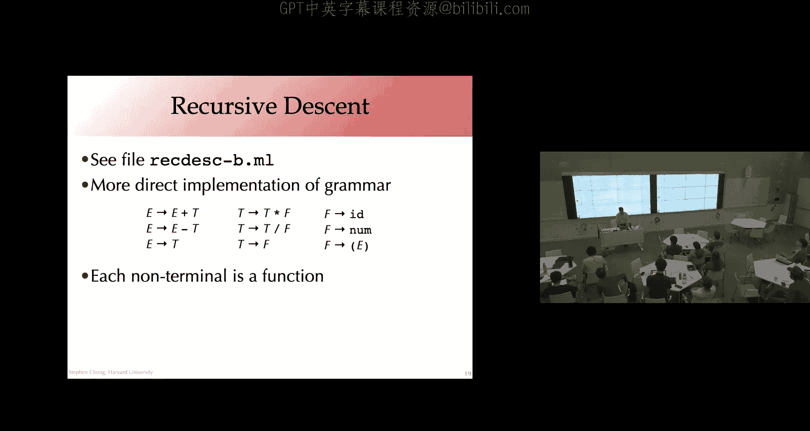
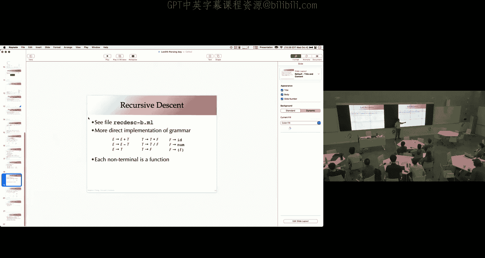
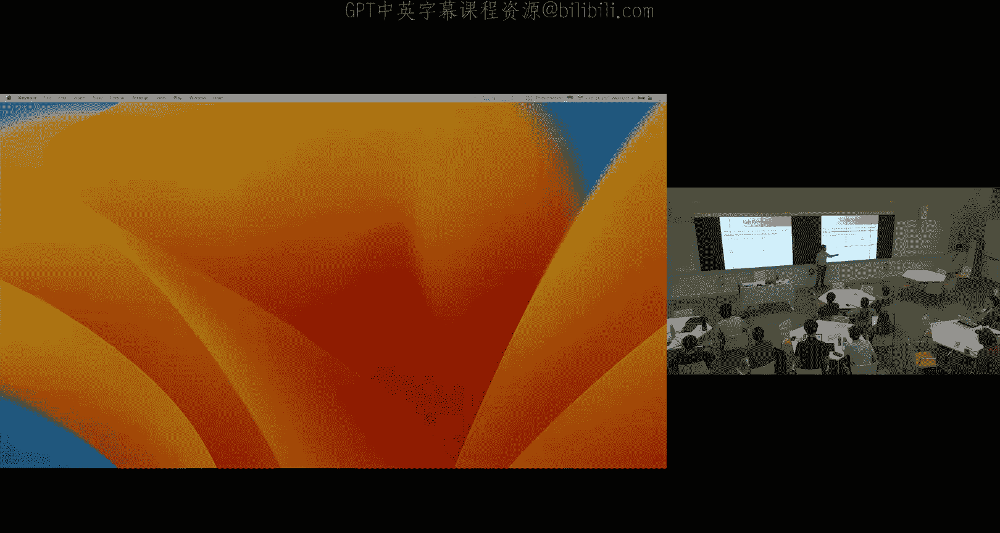
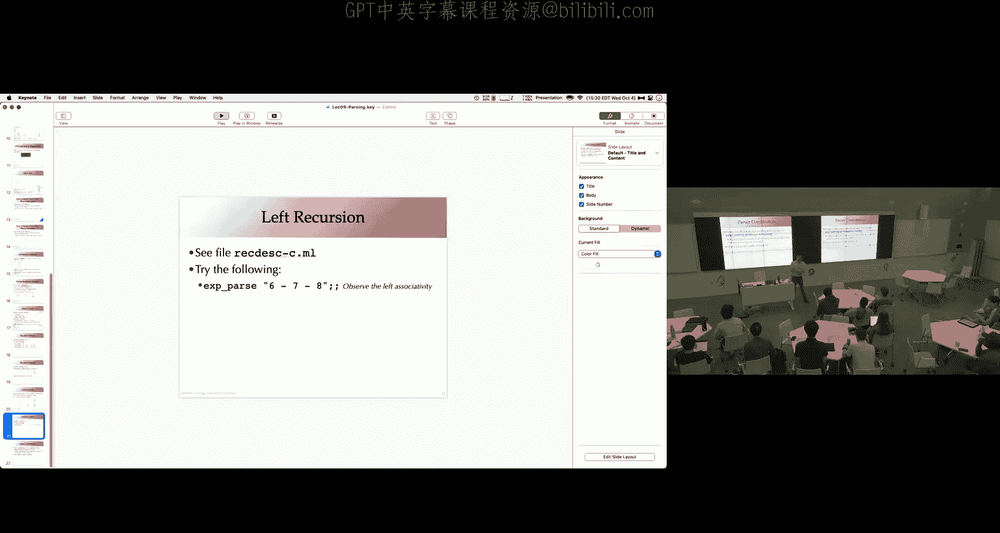
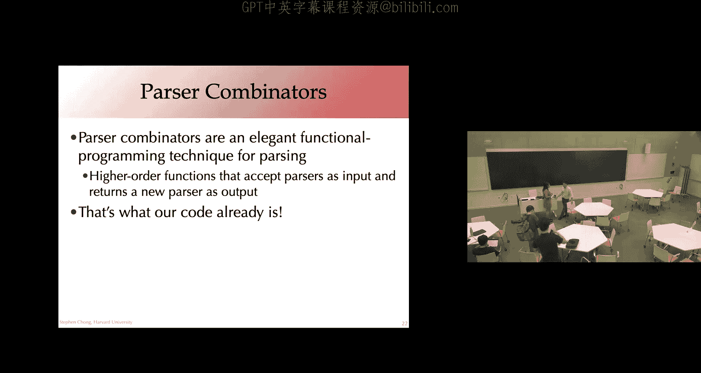
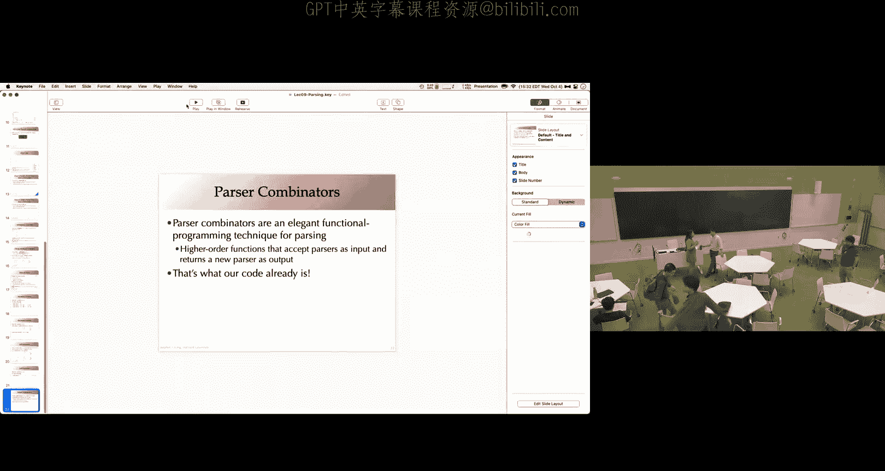
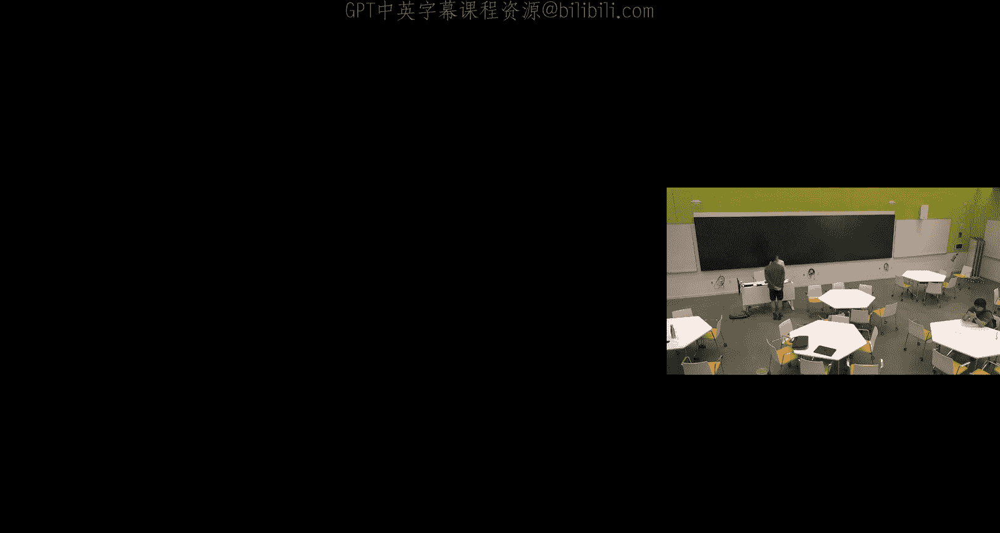

# 010：语法分析（Parsing）与上下文无关文法（CFG）

在本节课中，我们将学习如何将词法分析（Lexing）得到的令牌（Token）序列，转换为表示程序结构的抽象语法树（AST）。这个过程称为语法分析或解析（Parsing）。我们将重点介绍上下文无关文法（CFG）的概念，它是定义编程语言语法的核心工具，并初步探讨递归下降（Recursive Descent）解析的实现方法。

## 从词法分析到语法分析

上一节我们介绍了如何通过词法分析器将字符流转换为令牌流。本节中，我们来看看如何进一步处理这个令牌流。

语法分析的核心任务有两个：
1.  **判断有效性**：确认令牌序列是否符合编程语言的语法规则。
2.  **提取结构**：根据语法规则，构建出能反映程序层次和含义的结构化表示，通常是抽象语法树（AST）。

这类似于分析一个英文句子：我们既要判断“The cat caught the ball”是否符合语法，也要提取其含义——主语是“The cat”，动词是“caught”，宾语是“the ball”。

## 正则表达式的局限性

我们可能会问：能否像词法分析一样，使用正则表达式来定义整个语言的语法？对于简单的模式，例如“数字之和”，这是可行的。

**公式**：`digits (‘+’ digits)*`

然而，当语言结构包含嵌套或配对元素时，例如带括号的算术表达式，正则表达式就无能为力了。考虑以下尝试定义表达式（`expr`）的规则：
*   `expr -> digits`
*   `expr -> ‘(‘ sum ‘)’`
*   `sum -> expr ‘+’ expr`

如果我们尝试将 `sum` 的定义展开到 `expr` 中，会得到 `expr -> expr ‘+’ expr`，这导致了无限递归，无法用有限状态自动机表示。问题的关键在于，正则表达式缺乏表达**递归**结构的能力。

## 上下文无关文法（CFG）

为了描述具有嵌套结构的语言，我们需要更强大的工具：上下文无关文法。CFG 本质上是**允许递归的正则表达式**。

一个 CFG 由一组**产生式**（Productions）组成。每个产生式将一个**非终结符**（Non-terminal）映射到一个由**终结符**（Terminals，即令牌）和非终结符组成的序列。

**公式**：`Non-terminal -> sequence of (Terminals and Non-terminals)`

以下是定义一个简单语句和表达式语言的 CFG 示例：
*   `S -> S ‘;’ S`
*   `S -> ID ‘:=’ E`
*   `S -> ‘print’ L`
*   `E -> NUM`
*   `E -> ID`
*   `E -> ‘(’ S ‘,’ E ‘)’`
*   `E -> E ‘+’ E`
*   `L -> E`
*   `L -> L ‘,’ E`

其中，`S`（语句）、`E`（表达式）、`L`（列表）是非终结符；`ID`、`NUM`、`‘:=’`、`‘+’` 等是终结符。`S` 是**开始符号**。

## 推导与语法分析树

我们如何用 CFG 证明一个令牌序列是有效的？通过**推导**（Derivation）。
1.  从开始符号 `S` 开始。
2.  重复以下步骤，直到字符串中只包含终结符：
    *   在当前字符串中选择一个非终结符。
    *   找到一个以该非终结符为左侧的产生式。
    *   用该产生式的右侧替换这个非终结符。

推导过程可以直观地表示为**语法分析树**（Parse Tree）。树根是开始符号，叶子节点是终结符（输入令牌），内部节点是非终结符，子节点代表用于替换该非终结符的产生式右侧。

语法分析树直接体现了程序的层次结构，是连接语法和语义（程序含义）的桥梁。构建语法分析树既是语法验证的过程，也是语义提取的过程。

## 歧义文法

一个重要的问题是，同一个句子是否可能对应多棵不同的语法分析树？答案是肯定的，这样的文法称为**歧义文法**。

考虑简单的算术表达式文法：`E -> E ‘-’ E | NUM`。对于输入序列 `6 - 7 - 8`，可以构建出两棵分析树：
*   `(6 - 7) - 8` （左结合，结果为 -9）
*   `6 - (7 - 8)` （右结合，结果为 7）

这导致了语义的不确定性，在编程语言中通常是不希望的。我们可以通过改造文法来消除歧义，强制规定运算符的结合性和优先级。

## 消除歧义：优先级与结合性

以下是改造后的无歧义算术表达式文法，它明确了乘除优先于加减，且所有运算符都是左结合：
*   `E -> E ‘+’ T | E ‘-’ T | T` （表达式）
*   `T -> T ‘*’ F | T ‘/’ F | F` （项）
*   `F -> NUM | ID | ‘(’ E ‘)’` （因子）

这个文法通过引入额外的非终结符（`T`, `F`）来分层级地定义运算符的优先级。`E` 的产生式确保了 `+`/`-` 在最后被组合（优先级最低），并且是左结合的（因为 `E` 在产生式左侧递归）。

## 语法分析方法概览

给定一个令牌序列，如何构建其语法分析树？主要有两大类方法：
1.  **自顶向下分析**：从开始符号出发，尝试用产生式进行推导，逐步匹配输入令牌。
2.  **自底向上分析**：从输入令牌出发，尝试反向使用产生式（将右侧归约为左侧），最终规约到开始符号。

在实现上，编译器编写者有几种选择：
*   **手动编写递归下降解析器**：为每个非终结符编写一个递归函数。优点是错误信息容易定制，缺点是代码冗长，且难以处理左递归文法。
*   **解析器组合子**：在函数式语言中流行的高阶函数方法，用于组合和生成解析器。
*   **使用解析器生成工具**（如 ANTLR, Yacc）：输入文法描述，自动生成解析代码。这是最常用、最高效的方式。

## 递归下降解析初探

让我们通过代码看一个简单的递归下降解析器框架。其核心思想是定义一个“语法”类型，它接收令牌列表，并返回所有可能的解析结果（值 + 剩余令牌）列表。

**代码**：
```ocaml
type ‘a grammar = token list -> (‘a * token list) list
```
解析器函数会尝试所有可能的解析路径，并过滤出那些消耗完所有输入令牌的成功结果。



我们可以为文法定义构造子，例如：
*   `char`：匹配特定字符。
*   `epsilon`：匹配空字符串。
*   `alt`：两个语法的选择（`r1` 或 `r2`）。
*   `concat`：两个语法的连接（`r1` 然后 `r2`）。
*   `star`：零次或多次重复。





然而，直接实现类似 `E -> E ‘+’ T` 这样的左递归产生式会导致无限递归和栈溢出。为了解决这个问题，通常需要先将文法改写为无左递归的形式，例如引入新的非终结符 `E’`：
*   `E -> T E’`
*   `E’ -> ‘+’ T E’ | ‘-’ T E’ | ε`


这种改写能消除立即的左递归，但可能会使生成的语法分析树结构不那么直观，需要后续处理才能转换成理想的 AST。







---



本节课中我们一起学习了语法分析的基本目标，认识了上下文无关文法（CFG）作为定义语言语法的强大工具，理解了推导、语法分析树和歧义性的概念，并初步了解了通过改造文法来强制运算符优先级和结合性。最后，我们概览了不同的语法分析方法，并探讨了手动实现递归下降解析器的基本思路及其对左递归文法的处理挑战。在接下来的课程中，我们将深入探讨更高效的解析算法和工具。