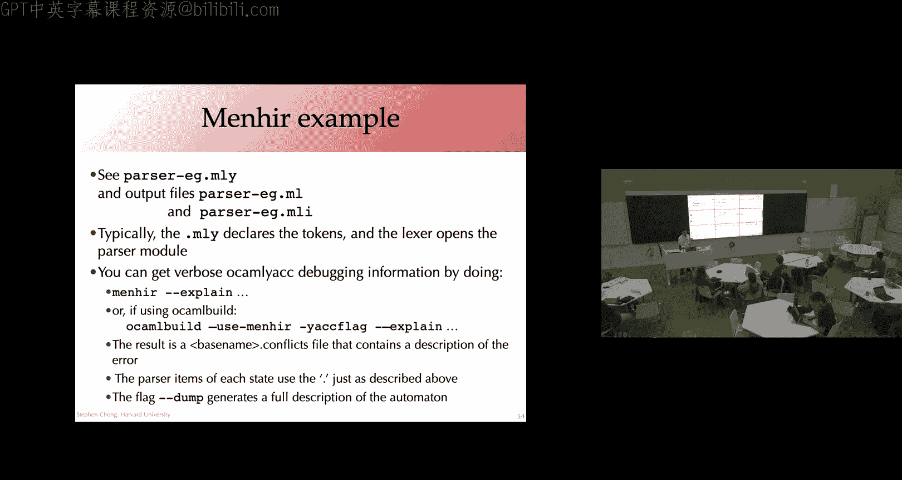
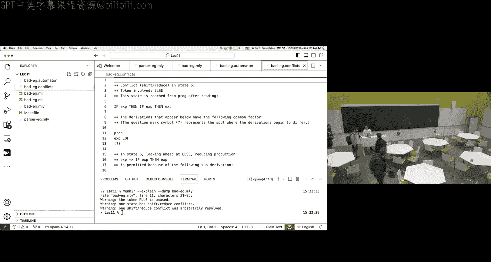
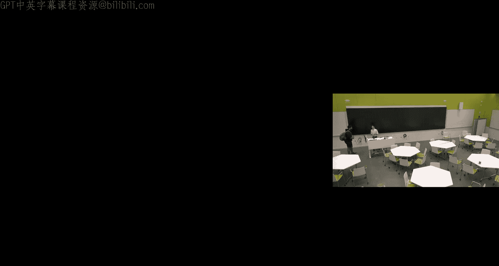

# 012：LR语法分析

在本节课中，我们将要学习LR语法分析，这是一种自底向上的语法分析技术。我们将了解其核心概念、工作原理，并通过一个具体示例来理解如何构建和使用LR分析器。

## 概述

LR语法分析是一种强大的自底向上分析方法，广泛用于编译器构建。其名称含义如下：
*   **L**：从左到右扫描输入。
*   **R**：构造一个最右推导。
*   **k**：向前查看k个输入符号以做出决策。

本节课我们将重点学习LR(0)分析，即不进行向前查看。我们将学习如何构建一个确定有限自动机（DFA）来指导分析过程，理解“移进”和“归约”操作，并了解分析过程中可能出现的冲突。

## 支持资源与课程安排

在开始之前，请注意课程提供的支持资源。如果你在课程中遇到困难，请随时联系我或你的宿舍管理员。社区中有很多人可以提供帮助。

关于课程安排，请注意周三将有一场关于开源编译器伦理问题的嵌入式伦理讲座。讲座将以讨论为基础，鼓励亲自参加以更好地参与互动。讲座前有一些建议的阅读材料。

作业三已发布，一周后截止。考虑到这是学期的繁忙时期，我们提供了灵活性。同时，我们今天将涵盖作业四所需的所有材料，因此作业四也将很快发布，你将有大约三周时间完成。

作业四要求你实现一个简单的类C命令式语言Oat的编译器，将其编译到LLVM Lite。在作业五中，你将处理功能更丰富的Oat v2。由于LLVM Lite与LLVM兼容，你可以使用`clang`将其进一步编译到x86，或者将你在作业三中编写的后端直接用于作业四，从而构建一个从高级语言到x86的完整编译器链。

## LR语法分析简介

上一节我们介绍了自顶向下的LL(k)语法分析。本节中，我们来看看自底向上的LR语法分析。

LR分析的基本思想是使用一个栈和一个输入序列。分析器在每一步可以执行两种操作：
1.  **移进**：将输入中的一个符号移到栈顶。
2.  **归约**：当栈顶的符号序列匹配某个产生式的右部时，将这些符号弹出，并将该产生式的左部非终结符压入栈。

LR分析器实际上是以逆序构造最右推导。分析过程从底部的词法单元开始，通过归约操作逐步向上，直到得到文法的开始符号。

## LR(0)分析器构造

为了决定何时移进、何时归约以及按哪个产生式归约，我们需要预先构建一个DFA和一个动作表。DFA的状态由**项**的集合构成。

一个**项**是一个产生式，并在其右部某处加上一个点“·”，用以指示分析进度。例如，项 `E -> E · + E` 表示我们已经识别了`E`，并期望接下来看到`+`和另一个`E`。

以下是构建LR(0)自动机的步骤概述：

### 构建LR(0)自动机

我们通过一个具体文法来演示构建过程。考虑以下表示S表达式的文法：
```
S' -> S $
S -> ‘(’ L ‘)’
S -> x
L -> S
L -> L ‘,’ S
```
这里，`S‘`是新的开始符号，`$`代表文件结束符。`S`可以是一个括号括起来的列表`L`，或者是一个标识符`x`。列表`L`可以是一个单独的`S`，或者是由逗号分隔的`L`和`S`。

**1. 初始状态与闭包**
我们从初始状态开始，它包含开始产生式对应的项，且点在最左边：`S' -> · S $`。然后，我们计算这个状态的**闭包**：如果项中点后面是一个非终结符（例如`· S`），我们就需要加入所有该非终结符产生式对应的新项，且点都在最左边。因此，我们加入`S -> · ‘(’ L ‘)’` 和 `S -> · x`。

**2. 状态转移**
对于状态中的每个项，我们查看点后面的符号（终结符或非终结符）。对于每个这样的符号`X`，我们创建一个新状态（或转移到已存在的状态）。新状态包含原项中点在`X`后移动一位得到的新项，然后同样计算其闭包。

例如，从初始状态（状态1）出发：
*   对于符号`x`，我们转移到新状态2，包含项 `S -> x ·`。
*   对于符号`‘(’`，我们转移到新状态3，初始包含项 `S -> ‘(’ · L ‘)’`，计算闭包后，会加入`L`的所有产生式对应的项（`L -> · S` 和 `L -> · L ‘,’ S`），进而又需要加入`S`的所有产生式对应的项。

重复这个过程，直到没有新状态产生。最终我们会得到一个完整的DFA。

**3. 构建动作表**
根据DFA的状态，我们可以定义分析动作：
*   **接受**：如果状态包含形如 `S' -> S · $` 的项，且输入已耗尽，则分析成功。
*   **归约**：如果状态包含形如 `A -> γ ·` 的项（点在最右端），则动作是按产生式 `A -> γ` 进行归约。
*   **移进**：如果状态有一个标号为终结符`t`的 outgoing 边指向状态`j`，则对于下一个输入符号为`t`的情况，动作为移进`t`并转移到状态`j`。

在我们的示例文法中，最终构建的DFA和动作表能够无冲突地指导分析过程。

## LR分析过程示例

让我们使用构建好的DFA和动作表来分析输入字符串 `( x , x )`。

分析过程维护一个栈和剩余输入。每一步，我们都**从DFA的初态开始，将栈中内容（从底到顶）作为输入流过DFA**，最终到达的当前状态决定了下一步动作。

以下是分析步骤的简化演示：
1.  栈空，在状态1。动作：移进 `(`。
2.  栈为 `(`，在状态3。动作：移进 `x`。
3.  栈为 `( x`，在状态2。动作：按 `S -> x` 归约。弹出`x`，压入`S`。
4.  栈为 `( S`，在状态7。动作：按 `L -> S` 归约。弹出`S`，压入`L`。
5.  栈为 `( L`，在状态5。动作：移进 `,`。
6.  栈为 `( L ,`，在状态8。动作：移进 `x`。
7.  栈为 `( L , x`，在状态2。动作：按 `S -> x` 归约。弹出`x`，压入`S`。
8.  栈为 `( L , S`，在状态9。动作：按 `L -> L , S` 归约。弹出 `L , S`，压入`L`。
9.  栈为 `( L`，在状态5。动作：移进 `)`。
10. 栈为 `( L )`，在状态6。动作：按 `S -> ( L )` 归约。弹出 `( L )`，压入`S`。
11. 栈为 `S`，在状态4。输入为空，动作：**接受**。

这个例子清晰地展示了LR分析器如何利用预先计算的DFA，通过移进和归约操作，自底向上地构建语法树。

## 冲突与LR(k)分析

在构建动作表时，一个状态可能指示多个动作，这就产生了**冲突**。主要有两种：
1.  **移进-归约冲突**：一个状态同时要求移进某个符号和按某个产生式归约。
2.  **归约-归约冲突**：一个状态要求按两个或多个不同的产生式进行归约。

LR(0)分析由于没有向前看能力，容易产生冲突。例如，考虑加法表达式的两种文法：
*   左递归文法：`E -> E + num | num` （通常无冲突）
*   右递归文法：`E -> num + E | num` （可能产生移进-归约冲突）

右递归文法在分析到`num`时，栈顶为`E`，分析器无法确定应该立即将`E`归约为表达式，还是移进`+`继续构造更大的表达式。

### 解决冲突

为了解决冲突，我们可以：
1.  **改写文法**：消除歧义。例如，著名的“悬空else”问题可以通过重构`if-then-else`的文法来解决。
2.  **使用LR(k)分析**：通过向前查看k个输入符号来帮助决策。LR(1)分析器项的形式是 `(产生式， 点位置， 向前看符号集)`。这大大减少了冲突，但增加了自动机的体积。
3.  **指定优先级和结合性**：在语法分析器生成器（如Yacc/Bison）中，可以为运算符声明优先级和结合性。这些声明会在内部被转换为冲突消解规则（例如，“遇到移进-归约冲突时，若下一个符号是`*`则优先移进，若是`+`则优先归约”）。

在实践中，**LALR(1)** 分析器最为常用。它通过合并LR(1)自动机中相似的状态来减小体积，虽然表达能力稍弱于LR(1)，但对于大多数编程语言文法已经足够。

## 语法分析器生成器

手动构建LR分析器是繁琐的。实践中，我们使用**语法分析器生成器**。一个著名的例子是**Yacc**及其各种变体（如GNU Bison， OCamlYacc）。

这些工具允许你以声明式的方式指定文法的产生式，以及每个产生式对应的语义动作（用于构建AST或执行其他操作）。生成器会自动构建LR分析表（通常是LALR(1)），并生成分析器代码。

例如，在`menhir`（一个OCaml的语法分析器生成器）中，你可以这样声明运算符的优先级和结合性：
```
%left PLUS MINUS
%left TIMES DIVIDE
```
这声明了`+`和`-`是左结合的，且优先级低于同样是左结合的`*`和`/`。当发生冲突时，生成器会利用这些信息来消解。

## 总结

本节课中我们一起学习了LR语法分析的核心内容。我们首先了解了LR分析的基本原理，即通过移进和归约操作自底向上构建语法树。然后，我们深入探讨了如何为LR(0)分析构造关键的数据结构——一个基于“项”的DFA和相应的动作表，并通过一个S表达式文法的例子完整演示了构造和分析过程。



我们认识到LR(0)分析可能因缺乏向前看能力而产生移进-归约或归约-归约冲突。为了解决这些问题，可以引入向前看符号形成LR(k)分析，或者使用更实用的LALR(1)分析。最后，我们了解到在实际编译器开发中，通常会借助语法分析器生成器（如Yacc/Bison, menhir）来自动化这一复杂过程，并通过声明运算符优先级和结合性来优雅地处理常见的冲突。





LR语法分析是编译器前端中强大且实用的技术，为后续的语义分析和代码生成奠定了坚实的基础。