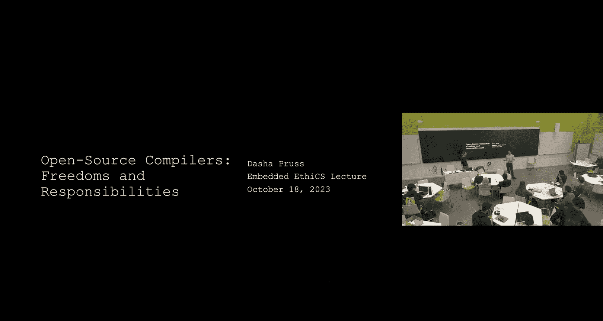
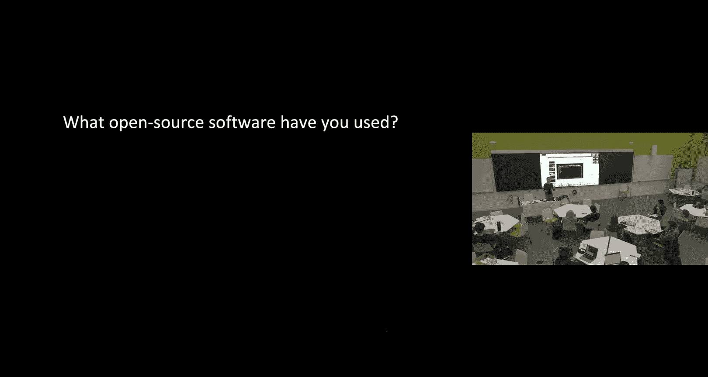
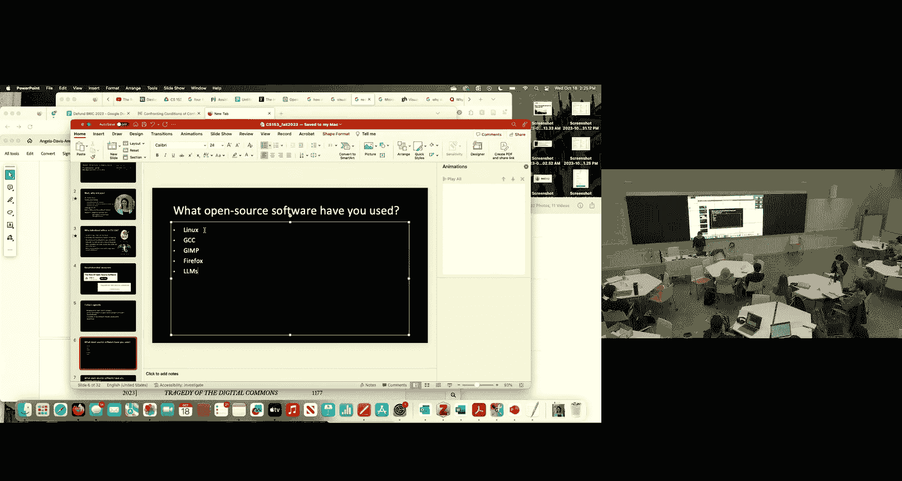
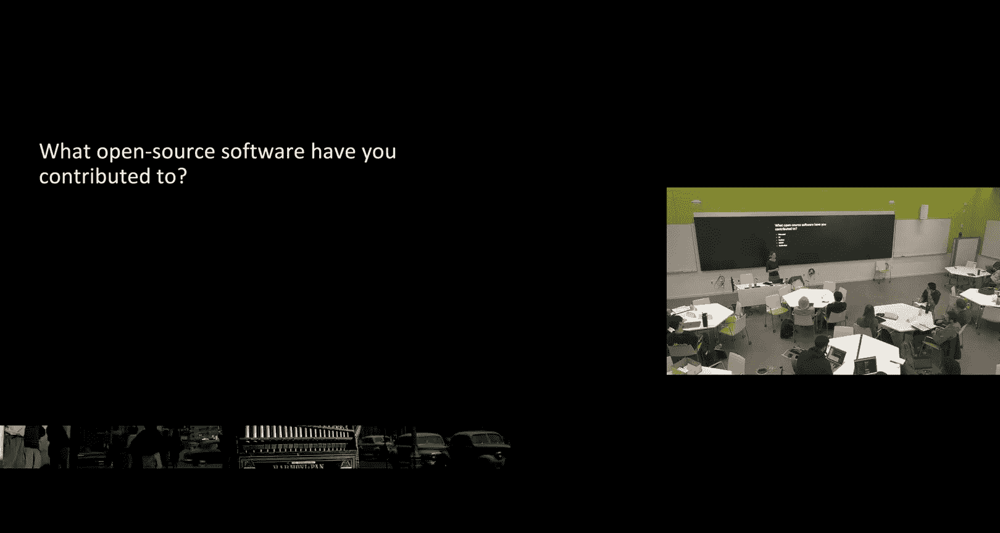
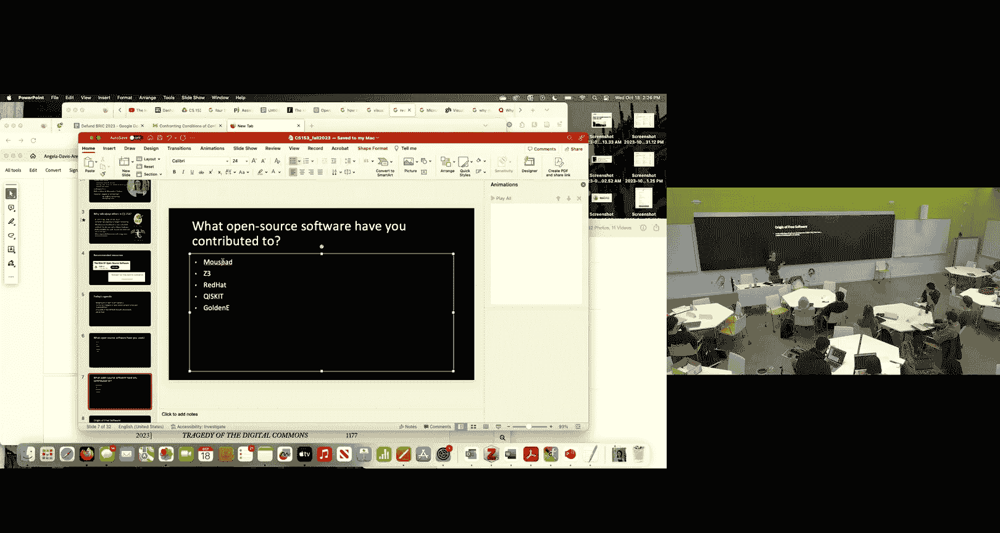
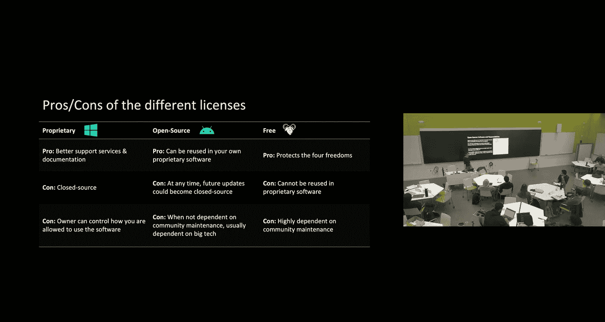
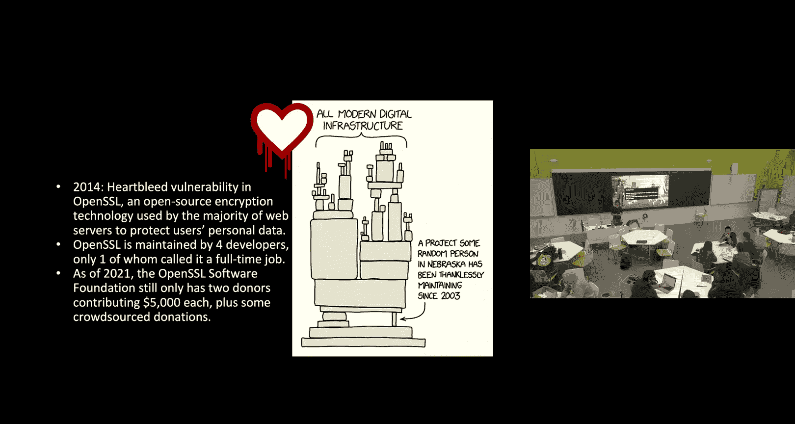
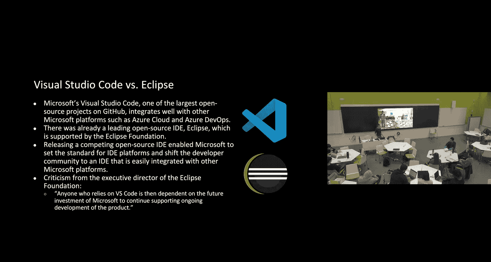
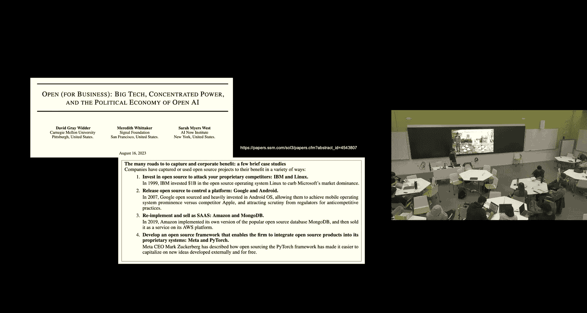

# 013：开源生态系统与责任 🧠

在本节课中，我们将学习开源软件的基本概念、其发展历史，并探讨作为用户和开发者，我们在使用和依赖开源软件时可能承担的责任。我们将通过思想实验和小组讨论，分析开源社区面临的挑战，例如“公地悲剧”以及大型科技公司主导的影响。

## 开源软件概述

开源软件是指源代码公开，允许用户自由使用、研究、修改和分发的软件。这种模式源于上世纪60-70年代的共享文化，旨在对抗大型公司的软件私有化趋势。

## 开源的历史与核心自由

上一节我们介绍了开源软件的基本概念，本节中我们来看看它的历史起源和核心原则。

1980年，美国国会通过了《计算机软件版权法案》，允许软件像文学作品一样被版权保护。同年，麻省理工学院程序员理查德·斯托曼因无法获取新打印机的源代码进行修改，创立了自由软件基金会和GNU项目，开启了自由软件运动。

自由软件的核心是“自由如言论，而非免费如啤酒”。以GNU通用公共许可证为例，它保障了以下四种自由：
*   **自由0**： 可以出于任何目的运行程序。
*   **自由1**： 可以研究程序如何工作，并修改它。
*   **自由2**： 可以重新分发拷贝，帮助他人。
*   **自由3**： 可以分发修改后的版本，让整个社区受益。

一个关键限制是“著佐权”：任何基于GPL软件的分发或修改版本，也必须以GPL许可证发布。这与“开源”许可证（如MIT、Apache许可证）不同，后者允许将开源代码用于专有软件。

## 开源生态的现状与挑战

了解了开源的理念后，本节中我们来看看当今开源生态的现状及其面临的挑战。

在课堂上进行的调查显示，几乎所有学生都使用过开源软件（如GCC编译器、Linux操作系统、Firefox浏览器），但只有少数人曾为开源项目贡献过代码。然而，据统计，**97%** 的软件都在某种程度上依赖开源组件。

这种广泛使用与有限贡献之间的不平衡，引出了“公地悲剧”的类比。在思想实验中，如果每个人都过度使用公共草场（开源软件）而不维护（贡献），资源最终会枯竭。

在软件领域，这可能导致：
1.  **安全漏洞**： 如2014年的 **Heartbleed** 漏洞，它存在于一个由少数志愿者维护的关键加密库OpenSSL中，影响了全球大量网络服务器。
2.  **维护危机**： 项目可能因维护者 burnout 或缺乏资源而停滞，导致依赖它的系统面临风险。

## 责任探讨：我们是否有义务贡献？

面对这些挑战，我们自然会问：作为开源软件的用户，我们是否有伦理义务进行回馈？

以下是几种可能的贡献策略：
*   **个人贡献**： 提交代码、修复bug、撰写文档。
*   **公司赞助**： 大型科技公司提供资金或允许员工投入工作时间。
*   **政府支持**： 将关键开源基础设施视同公共设施进行资助。
*   **基金会模式**： 建立非营利组织来管理项目和资金。

目前，企业赞助已成为主流。微软、谷歌、IBM等公司都是开源的主要贡献者。这种转变的原因包括：促进创新、节省成本、获取竞争优势以及推广自家的专有产品。

## “类公地悲剧”：企业主导下的新问题

企业深度参与解决了部分可持续性问题，但也带来了新的挑战，即“类公地悲剧”。

当开源项目主要由一两家大公司主导时，虽然软件本身仍是开源的，但其发展方向可能更倾向于与这些公司的专有生态系统集成。这可能导致：
*   **社区边缘化**： 独立开发者或小公司对项目方向的影响力减弱。
*   **隐性绑定**： 用户可能被引导至赞助公司的其他专有服务。
*   **创新方向偏移**： 开发重点可能服务于公司利润而非公共利益。

例如，微软开源的Visual Studio Code编辑器与其Azure云服务深度集成，这有助于微软建立开发者生态。

## 解决方案的探讨与权衡

那么，如何缓解企业主导带来的问题呢？在小组讨论中，同学们提出了多种设想。

以下是几种设想及其潜在利弊：
*   **建立民主治理委员会**： 由社区代表和公司代表共同决策项目方向。
    *   *潜在问题*： 决策可能低效；公司可能通过游说或占据多数席位施加过度影响。
*   **社区分叉项目**： 如果社区不认同主导公司的发展方向，可以创建独立的分支。
    *   *潜在问题*： 可能分散社区力量，且分叉项目同样面临可持续性挑战。
*   **政府监管与反垄断**： 防止单一公司对关键开源基础设施形成过度控制。
    *   *潜在问题*： 监管可能滞后于技术发展，并可能抑制创新。

这些方案各有利弊，没有完美的答案，需要在自由、效率、可持续性和公平之间取得平衡。

## 课程总结与作业

本节课中，我们一起学习了开源软件的核心自由与历史，探讨了其可持续发展面临的“公地悲剧”挑战，并分析了企业成为主要贡献者后引发的“类公地悲剧”新问题。我们认识到，在享受开源带来的自由与便利时，也需要思考个人与集体的责任。

**作业提示**：
请思考以下类比论证：为防止国家森林湖泊的过度捕捞（公地悲剧），政府会要求购买捕鱼许可并设定限额。将此类比应用于开源软件，结论是：政府应该限制个人或公司对开源软件的使用和贡献。你是否同意这个类比和结论？为什么？

请简要阐述你的观点，分析该类比的合理性，并说明你同意或不同意结论的理由。

---
*注：本教程根据哈佛大学编译器课程嵌入式伦理模块讲座内容整理，聚焦于开源生态的伦理讨论。*