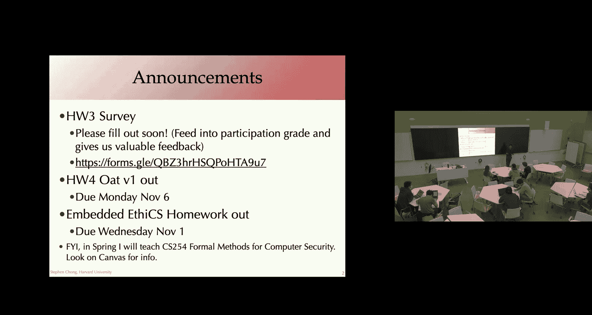
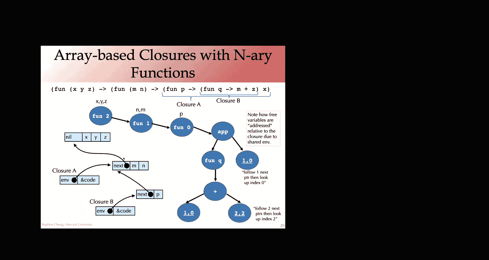

# 015：编译函数（续）

在本节课中，我们将继续学习如何编译函数，特别是深入探讨闭包转换和Lambda提升的实现细节。我们将了解如何通过使用德布鲁因索引等技术，高效地表示和访问函数环境中的变量。

---

上一节我们介绍了闭包转换和Lambda提升的基本概念。本节中，我们来看看如何具体实现这些转换，并优化其性能。

## 闭包转换与Lambda提升回顾

我们通过将函数值表示为一个对（代码指针，环境）来编译闭包。我们显式地让所有函数都接受一个环境作为额外参数，并通过该环境访问变量。

一旦我们将嵌套函数转换为这种形式，它们就不再直接引用外层函数的变量，因此我们可以将它们提升到顶层，这个过程称为Lambda提升。

## 实现细节与优化

现在我们已经掌握了闭包转换的高级思想，让我们思考如何高效地实现它。

### 变量存储优化

目前，在这种简单的闭包转换方法中，我们将所有变量都放入环境，这意味着变量本质上都存储在堆上。这并不理想，因为堆存储访问较慢，且难以优化。

好消息是，我们实际上不需要为函数内的所有变量都分配堆存储。我们可以通过分析来确定哪些变量可能“逃逸”，即可能被嵌套函数（未来会被转换为闭包）使用。

这意味着，在函数式编程语言中编写的许多变量实际上永远不会逃逸。因此，我们可以像处理非函数式语言中的局部变量一样处理它们，无需在环境中分配存储。我们只需要为那些可能被闭包使用的变量执行此操作。

### 环境的高效实现

我们之前给出的转换示例实际上效率很低。我们使用字符串作为变量名，并在运行时进行字符串比较或哈希计算，这会带来开销。

我们可以避免这种开销，采用一种巧妙的编码方式：使用自然数而不是字符串来命名变量，这被称为德布鲁因索引。

更重要的是，我们采用一种巧妙的方式为变量编号，使得很多时候我们根本不需要显式地提及变量名。

以下是转换为德布鲁因索引形式的方法：

我们有一个新的中间表示，它与我们的迷你语言相同，包含整数、函数定义（lambda项）、函数应用和变量。但变量不再使用字符串标识，而是使用整数索引。

转换过程使用一个递归函数，该函数接受一个将程序变量名映射到其德布鲁因索引的环境。对于整数，转换是直接的。对于变量，我们在环境中查找其名称以获取当前映射的索引。对于应用，我们递归转换子表达式。对于函数定义，我们扩展环境：新定义的变量获得索引0（最内层定义），环境中所有其他变量的索引增加1。

在这种索引方案中，整数索引指的是函数定义的词法深度。索引0的变量由最内层的函数定义绑定，索引1的变量由次内层的函数定义绑定，依此类推。这样，我们甚至不需要函数的参数名，只需通过索引就知道引用的是哪个参数。

### 处理多个参数

我们可以将德布鲁因索引扩展为允许函数接受多个参数。使用一个索引对，第一个索引表示引用哪个函数定义（词法深度），第二个索引表示需要该函数定义的哪个参数。

对于嵌套环境，我们可以使用数组链表来实现：每个函数定义对应一个数组（存储其参数），并通过指针链接到外层环境。

### 环境数据结构的权衡

实现环境主要有两种方法：链表和数组。

以下是两种方法的比较：

*   **链表环境**：
    *   **优点**：创建新环境成本低，只需创建新的头节点并链接到旧环境即可，可以共享大部分环境结构。
    *   **缺点**：遍历环境可能较慢（需要跟随多个指针），内存访问局部性可能较差。

*   **数组（扁平）环境**：
    *   **优点**：访问速度快（直接索引），内存局部性好（相关变量在内存中相邻）。
    *   **缺点**：创建新环境通常需要复制整个数组或大部分内容，无法像链表那样共享环境结构。

选择哪种方法是一个经验性问题，取决于程序中环境的使用模式（例如，环境共享的频率、变量访问模式等）。

## 总结

本节课中我们一起学习了编译函数的进阶内容。我们深入探讨了闭包转换和Lambda提升的具体实现步骤，并介绍了用于高效变量访问的德布鲁因索引技术。我们还分析了实现函数环境的两种主要数据结构（链表和数组）及其权衡。掌握这些技术对于将高级函数式语言特性编译到低级目标至关重要。