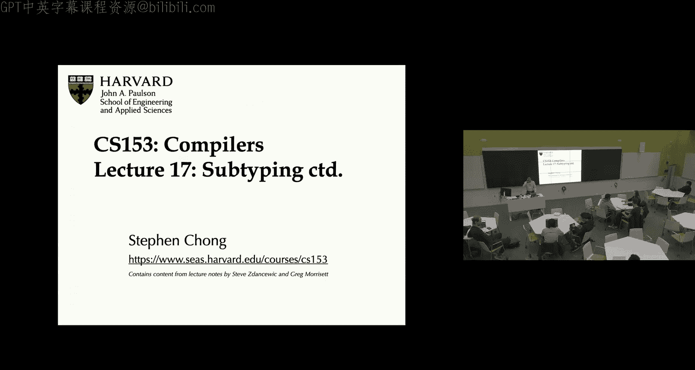
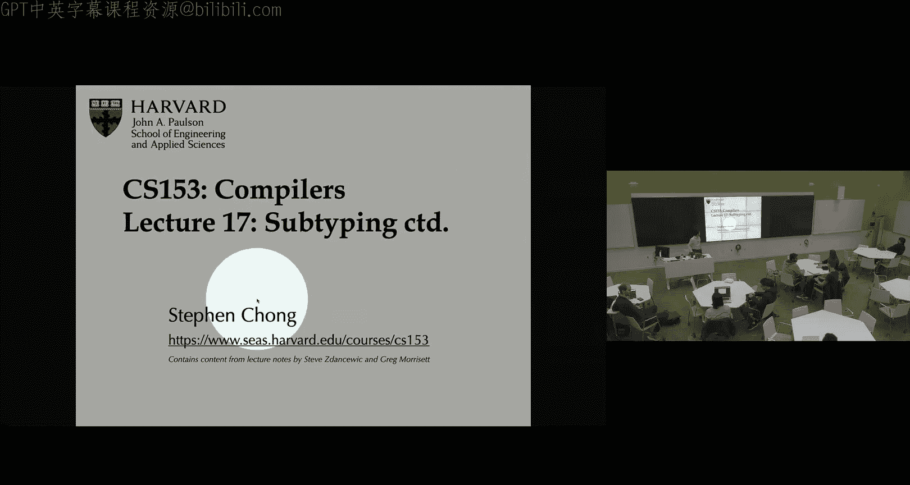
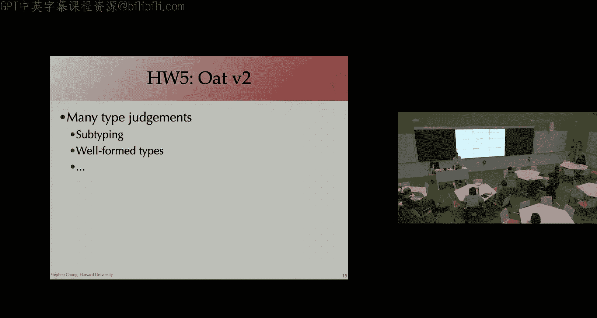
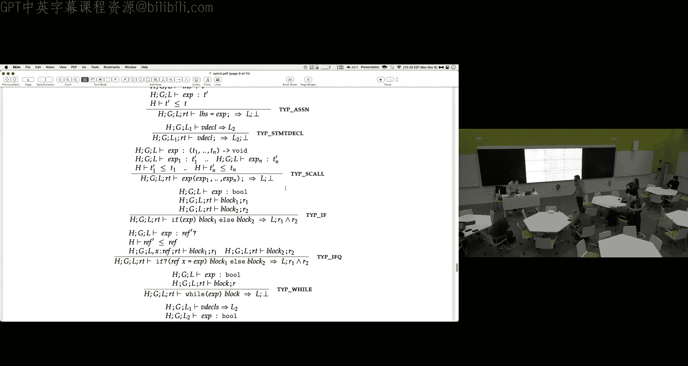

# 018：子类型化深入与作业5介绍 🧩





在本节课中，我们将继续深入探讨类型系统中的子类型化概念。我们将研究更复杂的语言特性，包括函数、记录和引用的子类型化规则。最后，我们将花时间介绍作业5，特别是其中的类型系统部分。

## 课程公告与作业安排 📢

上一节我们介绍了子类型化的基本概念，本节开始前，我们先了解一些课程安排。

作业4于今天截止。课程允许使用最多三天的延迟提交时间。如果有特殊情况，请直接联系我。

作业5今天发布。其截止日期是11月27日（周一），即感恩节假期后的周一。你可以选择在假期前完成并提交，或者使用延迟提交时间，最晚可于11月30日晚上11:59前提交。

关于作业5的通用建议是：在开始编写代码前，先花时间理清设计思路，明确各个函数的功能和实现方式，这有助于减少调试时间。

## 子类型化回顾与元组子类型化 🔄

现在，让我们回到子类型化的主题。我们曾将类型视为值的集合，并将子类型关系视为集合的包含关系。

一个思考子类型关系的有效方法是“子类型化基本原则”：如果程序期望一个类型为 `S` 的值，那么提供一个类型为 `T` 的值也是安全的，当且仅当 `T` 是 `S` 的子类型。

基于此，我们来分析元组的子类型化。假设程序期望一个类型为 `S1 * S2` 的二元组值。程序能对这个元组做的操作只有提取第一个元素或第二个元素。

因此，为了让类型为 `T1 * T2` 的元组成为 `S1 * S2` 的子类型，我们需要确保：当程序提取第一个元素（期望得到 `S1`）时，它实际得到的是 `T1`，而 `T1` 必须是 `S1` 的子类型。同理，`T2` 必须是 `S2` 的子类型。

由此得出元组的子类型化规则：
```
如果 T1 <: S1 且 T2 <: S2
那么 T1 * T2 <: S1 * S2
```
例如，`pos * neg` 是 `int * int` 的子类型，因为 `pos` 是 `int` 的子类型，`neg` 也是 `int` 的子类型。

## 函数子类型化 🔄➡️

理解了元组的子类型化后，我们来看看更复杂的函数子类型化。假设程序期望一个类型为 `S1 -> S2` 的函数，而我们有一个类型为 `T1 -> T2` 的函数。何时 `T1 -> T2` 是 `S1 -> S2` 的子类型？

我们需要考虑程序将如何使用这个函数：程序会向它传入类型为 `S1` 的参数，并期望得到类型为 `S2` 的返回值。

为了让我们的函数 `T1 -> T2` 能在此处工作，我们需要能够将传入的 `S1` 类型参数转换为 `T1` 类型（以供我们的函数使用），并将函数返回的 `T2` 类型结果转换为 `S2` 类型（以满足程序期望）。

这要求：
1.  `S1` 必须是 `T1` 的子类型（参数类型是“逆变”的）。
2.  `T2` 必须是 `S2` 的子类型（返回类型是“协变”的）。

因此，函数子类型化规则如下：
```
如果 S1 <: T1 且 T2 <: S2
那么 T1 -> T2 <: S1 -> S2
```
注意参数类型的子类型关系方向与返回类型相反。

## 记录（结构体）子类型化 📋

接下来，我们讨论不可变记录（类似OCaml中的记录，字段创建后不可修改）的子类型化。记录是元组的泛化，使用字段名而非位置来访问。

对于记录类型，主要有两种子类型化方式：

**深度子类型化**：两个记录类型具有完全相同的字段标签。子类型关系要求每个对应字段的类型都是协变的。即，如果对于每个标签 `i`，都有 `Ti <: Si`，那么记录类型 `{l1: T1, ..., ln: Tn}` 就是 `{l1: S1, ..., ln: Sn}` 的子类型。这很直观，因为程序只能访问这些已知字段，而子类型记录的每个字段值都是超类型对应字段值的子类型，因此是安全的。

**宽度子类型化**：子类型记录包含了超类型记录的所有字段，并可能拥有更多额外字段。例如，`{x: int, y: int, z: string}` 可以是 `{x: int, y: int}` 的子类型。这也是安全的，因为程序对超类型值所能做的操作（访问字段x和y），同样适用于子类型值。额外的字段不会被程序访问到。

## 实现考量与可变性 🛠️

以上讨论的是不可变记录。当我们考虑实现时，编译策略会影响语言的设计。

如果我们采用类似C结构体的连续内存布局方式，**宽度子类型化**是兼容的：子类型结构体开头部分的字段布局与超类型完全一致，额外的字段放在后面即可。然而，**深度子类型化**要求子类型字段与超类型对应字段占用相同空间，否则字段偏移量计算会出问题。**同时结合宽度和深度子类型化**在连续内存布局下会带来挑战，因为字段宽度可能不同，导致偏移量计算困难。

另一种实现方式是使用更灵活的数据结构（如字典）来表示记录，通过字段名来查找值。这种方式可以支持更复杂的子类型化（包括字段重排），但通常会带来额外的内存开销和访问成本。

当引入**可变性**（如可变引用、可变数组）时，子类型化规则需要更加严格。考虑一个例子：假设 `nonzero` 是 `int` 的子类型。那么 `ref nonzero` 应该是 `ref int` 的子类型吗？答案是否定的。

请看以下问题代码：
```
let r: ref nonzero = ...
let a: ref int = r  // 如果子类型成立，此赋值合法
a := 0              // 合法，因为 a 是 ref int
// 现在 r 和 a 指向同一内存位置
let x = 1 / !r     // 错误！对 r 解引用得到 0，导致除零错误。
```
因此，对于可变引用，我们通常需要**不变性**：即 `ref T` 只能是 `ref S` 的子类型，当且仅当 `T` 和 `S` 是相同的类型。可变数组等也是如此。

值得注意的是，Java 在数组类型上错误地允许了协变，为了补偿这一点，它在每次数组更新时都加入了运行时类型检查，如果类型不匹配则抛出异常。这是一个在语言设计（表达性）和实现效率之间的权衡。

## 空值与非空类型 🎯

许多语言（如Java、C#）的引用类型允许 `null` 值。`null` 可以赋值给任何引用类型变量。为了保持类型安全，在解引用时必须检查是否为 `null`（例如Java抛出 `NullPointerException`）。

一些现代语言（如Rust、TypeScript、Go）引入了**非空类型**系统来静态地区分可能为空的引用和绝对非空的引用。这既能消除运行时空指针异常，也能提升性能（避免不必要的空值检查）。

## 结构类型 vs 名义类型 🏷️

这是语言设计的另一个选择：
*   **结构类型**：类型的等价性和子类型关系由类型的实际结构决定。例如，OCaml的类型缩写（`type dollars = int`）是结构化的：`dollars` 和 `int` 在结构上相同，因此等价。
*   **名义类型**：类型的等价性和子类型关系由类型的声明名称决定。例如，Haskell的 `newtype` 或Java的类和接口。即使两个类有完全相同的方法，如果没有显式的继承或实现声明，它们也不构成子类型关系。



“鸭子类型”常见于动态类型语言，其思想类似于结构类型：“如果它走起来像鸭子，叫起来像鸭子，那么它就是鸭子”。

## 作业5：Oat V2 类型系统介绍 📚

最后，我们简要介绍作业5。作业5将扩展Oat语言，主要新增特性包括：
1.  **可变结构体**：类似C的结构体，字段可修改。
2.  **函数指针**：支持C风格的函数指针，但不支持闭包。
3.  **增强的类型系统**：区分可空引用类型（`T?`）和非空引用类型（`T`）。这是本次作业的核心。

为了支持这个类型系统，语言增加了新的结构：
*   **Checked Downcast** (`if?`): 将一个可能为空的引用安全地转换为非空引用。
*   **数组显式初始化器**：用于创建元素类型为非空的数组，要求为每个元素提供一个非空的初始值。

作业提供了详细的语法和类型规则PDF。类型判断包括子类型判断、类型良构判断、表达式类型判断、语句类型判断、函数声明判断和程序类型判断。类型检查过程分为多个阶段：首先收集所有结构体类型定义，然后收集函数声明，接着收集全局变量声明，最后利用这些信息进行全面的类型检查。

此外，类型系统还包括一个**返回分析**，用于确保每个函数在所有路径上都有明确的返回语句。

## 总结 📝




本节课我们深入探讨了子类型化。我们回顾了子类型化的基本原则，并分析了其在元组、函数、记录和引用等不同语言构造中的应用规则。我们了解到，可变性要求更严格的（不变）子类型规则，而语言设计（如结构类型 vs 名义类型、是否支持非空类型）与编译实现策略密切相关。最后，我们介绍了作业5中将要实现的Oat V2类型系统的主要特性，包括非空类型、结构体和函数指针。理解这些概念对于完成作业和深入理解编译器中的类型系统至关重要。