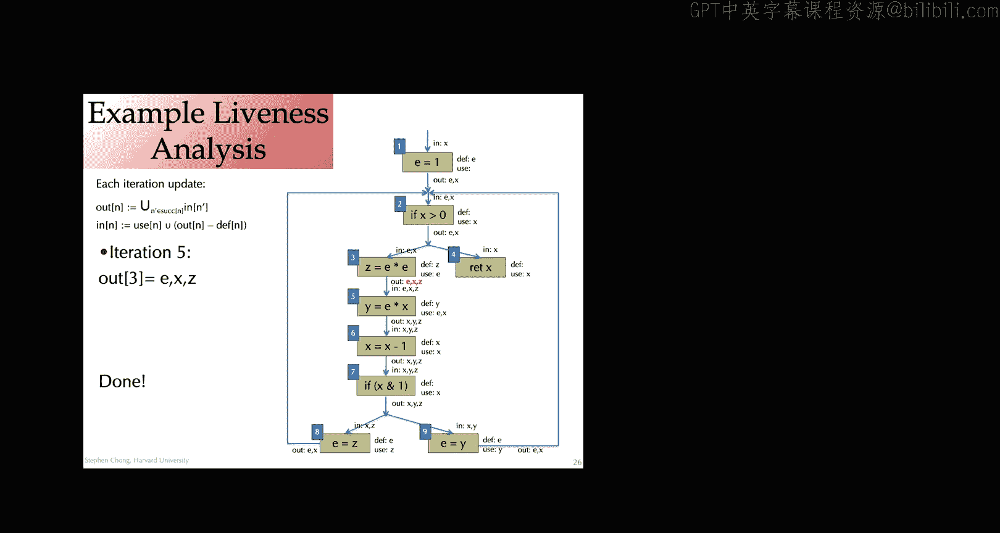

# 020：优化与数据流分析概述

在本节课中，我们将学习编译器优化的最后几个概念，并开始探讨数据流分析的基础知识，特别是活跃变量分析。这是理解后续寄存器分配等高级主题的关键。

## 课程概述与作业提醒

以下是关于课程管理的一些提醒。作业五已于今天上午发布，相关文件可在Canvas作业页面下载。完成作业的期限为两周。作业六，即最后一次作业，将于一周后发布，截止日期为12月5日。请注意，作业之间存在时间重叠，因此需要合理安排时间。请记住，你有最多三天的延迟提交额度，建议在规划时也考虑这一点。如果你觉得延迟额度不足，请随时联系。

关于课程管理方面有任何问题吗？很好。今天，我们将首先完成上一讲未讲完的优化概述，然后开始学习数据流分析。

## 优化概述（续）

上一节我们介绍了一系列优化转换，理解了不同类型的转换需求。这些优化大多是启发式的，我们并不总是能确定它们是否能真正提升性能或其他指标。

接下来要介绍的优化是**循环展开**。其基本思想是，如果你有一个包含循环体的循环，我们可以用循环体的多个副本替换原来的循环体。例如，原始循环 `for i from 0 to 100` 对数组元素求和。我们可以创建一个新循环，其循环体包含原始循环体的两个副本，并修改循环条件，使循环只执行50次。这样，我们就在一次迭代中完成了多次迭代的工作。你可以想象将循环展开2次、3次、4次或更多。

这个优化主要试图改善哪个性能指标？通常是时间。它通过减少分支跳转和循环条件检查的次数来提升性能。例如，在展开后的代码中，只有50次跳转，循环条件检查的频率也降低了。现代架构在分支预测方面做得很好，但循环展开仍然可能有益。当然，它也会导致循环体变大，可能影响指令缓存。因此，进行此优化时需要考虑展开哪些循环以及展开多少次。常用的启发式方法包括：只展开包含直线代码和简单循环控制的循环，并且通常使用性能分析运行来实际检查此优化是否有用。

循环展开的另一个好处是，它可能启用其他优化。例如，通过在一个循环体中包含多个迭代的代码，可能会发现一些可以消除的公共子表达式，从而将两次迭代的工作量减少到少于单次迭代工作量的两倍。

关于循环展开有任何问题吗？很好。

下一个优化是**函数内联**。其思想是，如果我们有一个函数调用，我们可以用函数体替换该调用。这需要进行一些重写，例如将形式参数替换为实际参数，处理局部变量等。

例如，如果有一段代码调用 `pow(x)`，并且有 `pow` 函数的代码，我们可以用函数体的内联副本替换该调用。在这里，我们声明了一个局部变量 `a` 来代表形式参数，复制了循环体，并将返回值放入临时变量 `temp` 中，然后使用 `temp` 代替函数调用。

这种优化的好处是消除了函数调用的所有开销，例如栈操作、跳转到另一段代码等。当然，它还使我们能够针对特定参数重写或特化函数体，并启用其他优化，如公共子表达式消除、常量传播、常量折叠等。

执行此优化可能需要一些谨慎的代码处理，例如重命名变量以避免变量捕获。此优化通常在编译器流水线的较高层级进行，例如在源AST级别或较高的中间表示级别，因为此时函数的概念清晰且易于操作。

从高层次看，这是一个好主意。但对于递归函数呢？假设有一个函数 `f(x, y)`，在其实现中再次调用 `f`。如果我们内联它，实际上只是展开了一次调用。如果我们有表达式 `f(z, 8+7)` 并内联它，我们仍然有这个递归函数调用。显然，我们不能一直内联对 `f` 的调用，因为每次用函数体副本替换对 `f` 的调用时，仍然会有一个对 `f` 的调用。仅仅执行一次展开似乎没有太大好处，因为递归调用可能被执行数十次、数百次，内联似乎作用不大。

然而，我们可以通过一个技巧来获得内联的部分好处。我们可以在内联之前重写递归函数。例如，我们可以重写函数体，使用所谓的**循环前置头**。假设我们有一个递归函数 `f`，我们可以将其重写为包含一个局部函数定义 `f_prime`，`f_prime` 只是 `f` 的副本，做完全相同的事情，而 `f` 是根据 `f_prime` 定义的。从语义角度看，这似乎没有提供任何价值。但让我们看看内联时会发生什么。

关键点在于，我们注意到在调用 `f_prime` 时，参数 `y` 是不变的，因为 `f_prime` 是局部的。我们能够对 `f_prime` 进行一些转换。在这里，我们实际上可以提取出 `f_prime` 中冗余的参数 `y`，这类似于循环不变代码外提。我们意识到参数 `y` 在每次调用中都是相同的，因此我们实际上不需要每次都定义它，可以将其提取出来，让它从封闭变量中捕获。然后，当我们进行内联时，我们实际上得到了一个特化的函数，其中 `y` 被替换为常量 `5`。这就是针对特定调用的递归函数特化，可能启用额外的优化。然后，我们的闭包转换、lambda提升等正常编译过程将处理这个新函数，使我们基本上获得内联的好处：针对此特定函数调用进行特化（`y` 被替换为 `5`），减少调用开销等。

如果我们没有将 `f` 重写为使用局部函数 `f_prime`，那么重写的用处就会小一些。我们可能会传播常量 `5`，但对于递归调用，将失去该值的任何好处。

关于这个重写递归函数以实现特化的技巧，有任何问题吗？是的，在这个特定例子中，似乎如果我们不进行重写，`if` 语句实际上可以进行常量折叠，意识到 `4 < 1` 为假并替换它。这有点像展开。在某种程度上，我们已经展开了递归调用，可以将其视为一个循环并进行特化，但我们失去了在函数 `f` 的调用中提取公共表达式和进行常量传播的机会。

内联提供了减少函数调用开销的好处，也可能允许对该函数调用进行特化，从而启用进一步的优化。对于递归函数，你可能无法消除所有的函数开销，但你仍然通过能够特化这个递归调用以及该递归调用的所有迭代（例如，针对常量参数 `5`）而获得特化的好处。

根据你的编译器对于函数式语言的智能程度，你可能能够将一些递归函数转换为循环。我们将在稍后的另一个优化中简要讨论这一点。在这里，你希望的是允许函数式语言程序员享受编写递归程序的便利和乐趣，同时获得与编写没有所有函数调用开销的命令式程序相同的性能。有一些编译器技术可以实现这一点，这通常需要对函数进行局部推理，即拥有整个函数体及其调用点，并可以适当地进行转换。因此，拥有函数的本地副本可能允许更强的推理，因为你可以进行这种转换为循环的转换，而不用担心它是一个单独的编译模块，其中内容可能会改变等。

内联函数的缺点是可能增加总代码大小。如果一个函数从四个不同的地方调用，并且你将所有这四个调用点都替换为函数体，那么你的代码现在可能有四个相同的代码副本。即使经过优化可能减少一些，总代码大小也可能变大，从而导致更差的代码缓存性能。

通常，函数内联的一些启发式方法包括：只内联频繁调用的函数调用。也就是说，如果你内联一个函数，而该函数调用点实际上只执行几次，那么减少该函数调用的开销帮助不大。这可以通过使用执行性能分析来查看各个调用点的调用频率，或者使用静态分析来近似估算代码片段的执行次数。常用的启发式方法是：假设每个循环都执行常数次（例如10次），这样你就能意识到最内层的循环是执行最频繁的，这通常是正确的，代码大部分时间都花在深层循环中。

另一个启发式方法是只内联函数体较小的函数。这样，复制后的函数体不会比调用代码大很多。与“只内联频繁调用的函数调用点”相反的是，实际上，如果一个函数在代码中只有一个调用点（不一定是动态执行一次，而是静态只有一个调用点），这也是一个很好的内联候选，因为这样你可能有一个优化可以移除不再被调用的函数，从而使总代码大小不会变大。

关于函数内联还有问题吗？很好。

接下来，我们讨论列表中的最后一个优化：**尾调用消除**。假设我们有两个递归函数，都实现加法 `add(m, n)`，返回 `m` 和 `n` 求和的结果。它们非常相似，但在第一个版本中，有一个对 `add` 的递归调用，两者都有对 `add` 的递归调用，但在这个版本中，在 `a` 返回后，这个函数还有更多工作要做。也就是说，`a` 需要取递归调用的结果，然后加1并返回该结果。相比之下，第二个函数在进行递归调用后，没有其他事情要做。该函数调用的结果就是该递归调用的结果。这被称为尾调用。

尾调用可以非常高效。其原因是，我们通常能够消除尾调用。让我们看看这个在命令式语言中的等效程序（第二个版本，带尾调用）。你可以想象一个优化，在命令式语言中消除尾调用，并将其转换为循环。也就是说，不是进行递归调用，而是直接跳转到函数的开头。

很酷的是，我们通常能够实现尾调用消除。对于一个递归函数，其思想是用参数的更新替换递归调用，然后直接跳回过程的开头，并删除返回语句。这里发生的是，通过跳转到函数的开头，我们正在重用栈帧。我们拥有函数体的栈布局，不需要为同一个函数创建新的栈帧，而是只更新参数，跳回开头，布局仍然完全相同。另一个好处是参数的值将保留在寄存器中。如果有很多参数，我们不需要将它们放入栈中；即使只有几个，我们也不需要担心调用约定，它们可以留在寄存器分配决定放置它们的任何寄存器中，而不是调用约定所需的寄存器。

当你将尾调用消除与内联结合时，这就是我之前提到的，我们可以使递归函数像 `while` 循环一样廉价。这样，程序员可以专注于高级别的正确性，而编译器足够智能来处理性能方面的问题。

尾调用消除的思想甚至可以用于非递归函数。如果函数的最后一条语句是函数调用（即使不是调用同一个函数），你也可以重用栈帧。基本上，这种转换意味着你可能需要一些栈操作，可能需要与调用者进行一些协调，但基本思想是，当你最终返回时，可以避免函数调用的部分开销，或者至少避免中间栈帧的开销。

关于尾调用消除有任何问题吗？是的，这超出了范围，但例如 OCaml 的最新版本，它们有 `cons` 和 `@`（连接）运算符，在非尾递归版本中，直到现在的 5.x 版本。实际上我没有跟进 OCaml 的最新动态，但 Ed 上有一个很好的帖子链接，核心工作人员和其他人可以分享以帮助我们理解它实际在做什么。你可以想象它做的事情类似于我们看到的转换。想象你保持相同的接口，但实现一个不同的版本，例如使用累加器向下传递累加器或类似的东西。然后你得到一个使用尾递归的递归函数调用实现。这样你就获得了尾递归的好处，你可能能够通过内联获得那种局部性，但即使不能，你也避免了递归调用并重用栈帧。这可能只是 `append` 的一个实现细节。

我们在上一讲和本讲中实际上涵盖了很多内容，介绍了一系列优化以及它们倾向于在代码的高级、中级或低级哪个阶段进行。

哦，对了，还有一点我想说：编写快速程序。老实说，无论你的编译器有多好，如果你想编写运行得快的程序，你能做的最好的事情实际上是找出正确的算法。因此，无论我们把编译器做得多么智能，你可能仍然需要学习 CS124 或其他课程，或者只是了解算法在做什么以及该算法的成本。同样，选择正确的数据结构将对你大有帮助。这些通常比编译器优化对性能的影响更大。所以，在你完成了选择正确算法、最小化间接性（例如，最小化获取数据所需的跳转次数）等高级工作之后，使用编译器优化来提升性能是很好的。然后，在你完成这些之后，实际上使用性能分析器运行你的程序，找出热点所在。这听起来事后看来很明显，但你想做的是花时间改进程序实际花费大部分时间执行的代码。为了找出这些代码，你需要知道程序运行或可能运行的工作负载，并实际进行分析以查看瓶颈在哪里。很容易陷入几个陷阱：一个是所谓的**过早优化**，即反复思考并认为“哦，如果我这样做，我可以让它更快”，然后花费大量时间修改代码，而那可能实际上并不是瓶颈，可能不是实际占用大部分执行时间的东西。与此相关的是“在灯亮的地方找钥匙”的想法，而不是在你丢钥匙的地方找。同样，如果你看着某些东西想，“哦，这很容易，我知道如何优化它”，然后花时间去让它更快，但如果它实际上不是你的程序花费时间的地方，那么无论你让它多快，都可能不会对你的程序性能产生显著影响。

## 数据流分析简介

在我们讨论这些优化的过程中，我们意识到对于其中的许多优化，为了确定是否实际有机会应用它们，以及如何确保我们安全地应用该优化或转换，我们实际上需要了解程序的信息。我们需要知道，例如，一个表达式是否不变，以便进行公共子表达式消除；相同的语法表达式在运行时在这些不同位置是否实际会计算为相同的值？知道一个表达式是否有副作用，知道变量在哪里定义（即变量被赋值），知道变量在哪里使用，知道这些如何关联，因此对于变量的给定使用，哪些定义点可能流向它？知道两个引用值是否可能是彼此的别名？

因此，我们今天剩下的讲座内容（可能会延续到周三的课程）将着眼于用于回答这些问题的算法和数据结构。

我们将研究一些特定的分析。首先，让我们通过讨论寄存器分配来激发我们要看的第一个分析：**活跃变量分析**。

目前，在我们的 Oat 编译器中，我们只是生成所需数量的临时变量（UID），然后简单地将它们映射到栈上。对于这个 UID，我们将它存储在这里的栈上。这样编译起来简单方便，但当然效率低下。任何时候我们想定义一个 UID，我们计算该临时变量的值，将其放入栈中。任何时候我们想使用 UID，我们从栈中加载它，放入寄存器并使用它。理想情况下，我们希望做的是尽可能多地将这些 UID 映射到寄存器中，完全避免将它们放入栈中。

问题是我们只有有限数量的寄存器。在 64 位 x86 中，有 16 个可用寄存器。很可能我们编写的函数将拥有超过该数量的临时变量。当然，在这 16 个寄存器中，有些是保留的，具有特殊语义。这意味着我们不能简单地将一个 ID 分配给一个寄存器并在整个函数期间保持不变。相反，我们需要做的是让一个寄存器代表多个临时变量、多个 UID。这样，我们就能在保持程序正确性的同时高效地使用寄存器，而无需将东西存储在栈中。

当然，这就引出了一个问题：什么时候这样做是安全的？什么时候我们可以说这两个临时变量可以分配给同一个寄存器，并且一切正常？这个问题的答案依赖于**活跃性**的概念。

关键的观察是：如果我们有两个临时变量 UID1 和 UID2，如果这两个临时变量的值永远不会在同一时间被需要，我们就可以将它们分配给同一个寄存器。这里“被需要”的意思是：如果一个临时变量的内容（即它的值）将在未来的某个操作中作为源操作数使用，那么它就是被需要的。因此，这种“被需要”的概念是针对特定程序点的。一个临时变量在给定的程序点是**活跃的**，如果该临时变量的值将在后续操作中作为源操作数使用。如果我们有两个变量，使得当我们遍历函数中的每一个程序点时，没有哪个程序点这两个临时变量（或变量）都是活跃的，那就意味着这些变量的值从不需要在同一时间被需要。如果情况如此，那么我们可以使用同一个寄存器来表示这两个变量。

这个直观上说得通吗？这个想法是：如果我们有两个变量，它们在同一程序点从不同时活跃，那么我们可以为它们使用同一个寄存器。

那么，我们如何找出这种活跃性信息呢？显然，我们可以通过查看变量的作用域来获得一些粗略的活跃性信息。在 Oat 级别，如果我们看这个程序，变量 `b` 在这个块内部声明。因此，`b` 只在这个块的作用域内。当我们到达这里时，`b` 不在作用域内，永远不能被使用，并且我们声明了变量 `c`。由于作用域规则，变量 `b` 和 `c` 永远不会同时活跃，因为它们的作用域不相交，没有程序点可以同时引用 `b` 和 `c`。或者更准确地说，当 `c` 活跃时，`b` 已超出作用域，因此不活跃。这意味着我们可以将 `b` 和 `c` 分配给同一个存储槽，甚至可能是同一个寄存器。这很好。

但老实说，仅仅使用变量的作用域信息太粗糙了。除了变量作用域之外，还有更多机会可以高效地使用栈槽和寄存器。让我们看看这个程序。局部变量 `a`、`b`、`c` 和参数 `x` 的作用域都重叠，它们在这个块结束前都在作用域内。但是，`a`、`b` 和 `c` 从未同时活跃。让我们看看：`a` 在这里定义（`x + 2`），在这一行被使用。但在使用之后，`d` 用结果定义。从那时起，`a` 再也没有被使用。所以一旦 `b` 被定义，`a` 就不活跃了。类似地，`b` 在这里被使用，但这次使用之后，`b` 就不活跃了。`c` 在这里定义，并在这个返回语句中使用。但在这一点上，`b` 不活跃。变量 `x` 也一样，它在这里使用，也在这里使用。但这次使用之后（即在计算 `b + x` 之后），`x` 就不活跃了。总之，因为 `a`、`b` 和 `c` 从未同时活跃，这意味着我们的编译器最终可以为它们使用相同的栈槽，或者更激进地，为它们使用相同的寄存器，而不会产生任何问题。没有程序点其中 `a`、`b` 或 `c` 中有多于一个是活跃的。

因此，我们将在接下来的几讲中深入探讨寄存器分配，但寄存器分配的一个关键部分是活跃变量分析，即知道哪个变量在哪个程序点是活跃的。所以我们将开始深入研究活跃变量分析的思想、如何实现它，以及我们如何推广它。

一个变量 `v` 在一个程序点是活跃的，如果 `v` 在该程序点之前定义，并在该程序点之后使用。因此，活跃性是根据变量在哪里定义和在哪里使用来定义的。在我们的活跃变量分析中，我们将计算每条语句之间的活跃变量集合。这可能有些保守，因为我们可能声称一个变量是活跃的，而实际上它不是。这可能是因为，例如，一个变量只在 `if` 语句的 `then` 分支中使用。也许 `if` 语句的 `then` 分支从未执行（守卫条件最终等价于 `false`，但由于复杂的计算），这意味着该变量从未被使用，但我们的分析无法发现这一点。我们的分析将保守地说：“嘿，看起来这个变量将来可能会被使用。”我们希望分析有用，所以我们将使其比仅仅作用域规则更精确。

我们将介绍这个分析，它是数据流分析的一个例子。还有许多其他数据流分析，其中一些我们将深入研究，如可用表达式、到达定义、常量传播等等。

我们将深入研究活跃变量分析的细节。我说过，我们将计算每条语句之间的活跃性信息。这有点模糊。我们实际将用来计算活跃性信息的是一个**控制流图**。

回想一下，在控制流图中，这是一个在基本块上的图，其中基本块是一个指令序列，使得该指令序列被完整执行。也就是说，程序执行总是从基本块的开头开始，没有跳转到基本块中间的情况。基本块上的所有指令依次执行，然后基本块的最后一条指令是某种控制流指令：跳转、条件跳转或返回。因此，在我们的控制流图中，节点是基本块，如果 B1 的出口可能跳转到 B2 的开头，则我们有一条从基本块 B1 到 B2 的边。没有悬空的边。即使在 LLVM IR 中我们使用标签，我们也会检查以确保它是一个格式良好的图，如果我们跳转到一个标签，该标签确实定义了一个基本块。

在我今天剩下的关于数据流分析的幻灯片中，我将对“指令”的确切含义有点模糊。控制流和数据流分析的思想适用于汇编代码、LLVM IR、高级源程序等，但你需要小心确切的细节，比如什么是语句、什么是基本块、什么是合适的终止指令等等。但总体思想是成立的，所以我会在这方面稍微宽松一些。

举个例子，在我展示的内容中，我们可能有同一个局部变量被多次定义。这在具有临时变量的 LLVM 中不会发生，因为 LLVM 是 SSA（静态单赋值）形式。事实证明，SSA 形式使数据流分析之类的事情变得更容易一些。因此，当你最终为 LLVM IR 实现数据流分析时，你的框架会比为 Java 源代码做分析时简单一些。

我们将在控制流图上进行活跃变量分析。而且，我们不是在基本块上进行，而是将图的节点视为指令，这样思考起来会更容易一些。也就是说，图的节点不是一个完整的基本块，而是一条指令，我们将有这些贯穿边。从这里到这里的边只是基本块内指令间的顺序执行。

一般来说，在我们的控制流图中，节点将是一条指令。我们可能有多个入边，显示进入该指令的控制流；我们可能有多个出边，显示指令执行后的控制流去向。

我们将计算活跃性信息。我说过我们将在语句之间进行计算。实际上，我们将把它与边关联起来。这样，我们就可以让同一个寄存器用于同一条语句中使用的不同临时变量。例如，如果我们有赋值 `a = b + 1` 在这条指令处，我们可能有 `b` 在进入这条指令的边上活跃，因为 `b` 被使用；`a` 在这里被定义；`a` 在这里活跃，因为它被定义并在以后使用；但 `b` 不再活跃。假设 `a` 活跃是因为它在以后被使用。关键点在于，通过在边上而不是节点上跟踪活跃性信息，这允许我们说对 `a` 和 `b` 使用同一个寄存器。因此，即使同一条指令使用了 `a` 和 `b`，但将活跃性与边关联的想法意味着我们可以为这条指令使用同一个寄存器。对于这条指令 `mov a, b`，如果我们对那个移动指令使用同一个寄存器，那就变成了 `mov eax, eax`，我们可以直接从代码中删除它。因此，以正确的粒度跟踪活跃性信息的思想使我们能够更好地利用寄存器，这可能使我们能够删除整个无操作指令。

我在这里也稍微绕了一下。根据你正在做的分析，你可能实际上希望将事实与边关联。对于我们这个活跃变量分析，结果证明将信息关联在指令之前和之后是可以的，我们可以为所有这些边使用相同的活跃性信息。当我们深入研究分析细节时，希望这会变得更清楚。

接下来，在介绍分析之前，下一个概念是变量的**使用**和**定义**。这是我在上一讲讨论优化时一直在谈论的内容。其思想是，对于任何给定的指令或语句，它使用一些变量集（读取它们的当前值），并且每条指令也定义（写入）一组可能为空的变量。

因此，对于一个节点 `s`，我们将使用以下符号：`use(s)` 表示该语句使用的变量集合，`def(s)` 表示该语句定义的变量集合。例如，对于 `a = b + c`，它使用变量 `b` 和 `c`，所以 `use(s) = {b, c}`，它定义变量 `a`。对于 `a = a + 1`，它既使用又只定义 `a`。

现在，我们可以给出活跃性更正式的定义。一个变量 `v` 在边 `e` 上是活跃的，如果存在控制流图中的一个节点 `n`，使得 `n` 使用变量 `v`，并且存在一条从边 `e` 到节点 `n` 的有向路径，使得变量 `v` 在该路径上的任何节点都没有被定义。

这意味着，对于给定的边 `e`，条件一说明存在一个节点，`v` 在那里被使用。条件二说明在该路径上，`v` 没有被重新定义。因此，在边 `e` 处的变量 `v` 的当前值，将是未来在节点 `n` 处将被使用的变量 `v` 的值。

很好，这就是根据控制流图、根据给定节点的使用和定义集合，对活跃性相当具体、相当正式的定义。现在，我们面临的问题是：给定这个活跃性分析的定义，我们如何实际计算它？一旦我们有了它，我们将面临如何将其用于寄存器分配的问题，这将在接下来的两讲中详细讨论。实际上，一旦我们理解了分析，中间表示语言的选择将影响我们进行分析的方式。

让我们开始思考如何计算活跃性信息。首先，让我们使用一个非常低效的算法来理清思路。这是活跃性的定义。这里有一个简单的算法：对于每个变量 `v`，找到 `v` 的一个使用点，然后沿着控制流图向后遍历，直到要么在该路径上找到 `v` 的定义点，要么回到一个已经访问过的节点。因此，我们基本上是在为变量 `v` 的一个使用点，沿着边向后探索图，当到达 `v` 的定义点或已经访问过的节点时终止搜索。我们访问过的每个节点、遍历过的每条边，`v` 在其上都是活跃的，因为对于我们遍历的每条边，都存在一条到 `v` 的使用点的路径（这是我们开始的地方），并且没有中间的重定义，因为我们在到达定义点时截断了搜索。

这显然是一个我们可以用来计算边上变量活跃性的算法。这绝对是一个可计算的问题，我们可以使用一些非常简单的图算法来解决它。

这个简单的算法是正确的，但效率低下。我们将为每个变量和每个使用点进行向后搜索，可能会多次探索相同的路径。

我将要介绍的数据流分析的思想是，我们同时为所有变量计算活跃性信息。我们将通过定义必须满足的方程来实现。这些方程，当我呈现它们时，应该是“显而易见”的。我们将从一个非常差的近似开始，然后使用这些约束来改进我们的解，得到一个更好的近似。我们将继续这样做，用这个更好的近似，再使用约束得到更好的解，依此类推，直到无法再进行改进，即方程不再给我们任何改进。此时，我们达到了所谓的**不动点**。对于那些上过 152 课程的人来说，这是一个不动点计算的例子，我们从结果的差近似开始，逐步变得更好，直到最终稳定下来。这是计算程序属性（数据流分析）的一般框架的一个实例。

让我们深入探讨这些方程是什么。我们的节点将是指令或语句，因此对于每个节点 `n`，我们将使用以下集合：`use(n)` 和 `def(n)`，我们已经讨论过，分别是节点 `n` 使用的变量集合和定义的变量集合。我们想要计算的是这两个集合：`in[n]` 和 `out[n]`。`in[n]` 是进入节点 `n` 时活跃的变量集合，`out[n]` 是离开节点 `n` 时活跃的变量集合。这些 `in` 和 `out` 集合本质上将收集入边和出边上的活跃性信息。

因此，`out[n]` 将是所有出边上的活跃性信息的并集。这就是我所说的，我们实际上不会显式地表示边上的活跃性，而是表示语句之前和之后的活跃性，即语句的 `in` 和 `out` 集合。

我们有这四个集合：`use(n)`、`def(n)`，我们想要计算 `in[n]` 和 `out[n]`。我们将通过设置约束（方程）来实现。

首先，我们要确保节点 `n` 的 `in` 集合必须包含 `n` 使用的所有变量。考虑到活跃性的定义，在进入 `n` 的任何边上，什么变量是活跃的？记住，如果存在一条到变量 `v` 的使用点的路径，且中间没有 `v` 的定义，那么 `v` 就是活跃的。任何被 `n` 使用的变量都将满足这一点：存在一条从这里到这里的非常简单的路径，其中 `n` 被使用而没有定义。这是因为从概念上讲，对于一条语句，我们使用变量来计算将要放入新赋值变量的值。

我们还有一个约束：节点 `n` 的 `in` 集合将包含 `out[n]` 中的所有内容，减去任何被 `n` 定义的变量。让我们思考一下：如果变量 `v` 在 `out[n]` 集合中，意味着存在一条从这里到 `v` 的使用点的路径，且没有经过 `v` 的定义。如果 `v` 没有被 `n` 定义，那么 `v` 也应该在 `in[n]` 集合中活跃，因为仍然存在一条从这里到使用点且不经过定义的路径。然而，如果节点 `n` 定义了变量 `v`，那么这就是 `v` 的重定义或定义，因此 `v` 在这一点上不会活跃。

我们还需要一个连接不同节点的方程。对于节点 `n`，如果 `n'` 是 `n` 的后继节点（即存在从 `n` 到 `n'` 的边），我们希望 `out[n]` 包含 `in[n']`。直观上这是因为，如果有一个变量 `v` 在 `in[n']` 中，意味着存在一条从刚好在 `n'` 之前到 `v` 的使用点的路径，且没有经过中间的定义。因此，也存在一条从刚好在 `n` 之后到 `v` 的使用点的路径，且没有经过定义。

就是这样。我们需要为所有节点 `n` 和 `n'`（如适用）实例化这些约束。但我们需要的所有约束都将是这三种形式之一。

让我们思考如何进行迭代数据流分析。正如我所说，思想是从一个粗略的猜测（结果的非常差的近似）开始，然后迭代地改进它。我们最初的猜测是将所有东西设置为空集：对于每个节点 `n`，`in[n]` 和 `out[n]` 为空。这个解并不满足所有约束，可能满足一些，但会有约束不满足，比如 `in` 集合必须包含 `n` 的所有使用等。

因此，我们将迭代地重新计算 `in[n]` 和 `out[n]`，当我们有不满足的约束时。你可以想象我们做的是：在每次迭代中，我们遍历所有约束。如果一个约束不满足，我们向 `in` 集合添加一些东西。如果这个约束不满足，我们将 `use(n)` 添加到 `in[n]`。如果这个约束不满足，我们取 `out[n]` 减去 `def(n)` 并将所有这些添加到 `in[n]`。对于这个约束，如果 `out[n]` 不包含这个 `in[n']`，我们取集合 `in[n']` 并将其添加到 `out[n]`。因此，在每一轮遍历中，我们通过增加 `in` 和 `out` 集合的大小来修复每个被破坏的约束。我们继续这样做。每次迭代我们遍历每一个约束，找到任何不满足的，并适当增加 `in[n]` 或 `out[n]` 的大小。如果我们遍历所有约束发现它们都满足了，那就太好了，我们就停止。这意味着我们能够遍历所有约束，它们都满足，没有告诉我们增加任何集合的大小。结果证明，当 `in` 和 `out` 满足这些方程时，它们实际上将等于这些东西：`in[n]` 将等于 `use(n) ∪ (out[n] \ def(n))`，`out[n]` 将等于所有后继节点 `in` 集合的并集。这些包含约束，当我们最终找到最小不动点时，实际上会得到这个等式条件。

我粗略地介绍了这些，让我继续粗略地给你一些伪代码。对于所有 `n`，我们将 `in[n]` 和 `out[n]` 设置为空集，然后我们遍历所有节点 `n`，确保将内容添加到 `out` 和 `in` 集合中，直到没有变化。这等价于遍历每一个约束。

这个算法保证会终止。为什么？每次通过算法，如果没有变化我们就停止。所以如果有变化，意味着至少有一个集合增加了至少一个元素。我们操作的实际实体是变量的集合，对于每个节点 `n`，我们有 `in[n]` 和 `out[n]` 两个集合。在每次迭代中，我们至少增加其中一个集合的至少一个元素，这就是有修改的含义。程序中只有有限数量的变量和有限数量的节点。这意味着我们实际上只能增加一个集合有限次，直到该集合达到其最大可能值。因此，我们将在某个时刻终止。

为什么我们从空集开始？如果我们从所有节点的所有集合都是全集开始，它可能第一次就满足约束，但那将是一个非常糟糕的解。对我们来说，活跃集合越小越好，那将是最精确、对寄存器分配最有用的信息，因为我们希望变量不在同一程序点活跃。事实证明，从空集开始，我们将找到满足方程的最小可能集合。

这是一个一般性问题：对于纯函数式语言，我认为这足以进行数据流分析。但如果我们有一个变量定义有副作用，但其他方面是死的，我们是否需要增强这个过程，或者我们会有一些变通方法？这个分析是找出程序点上变量的活跃性。我暗示过这样一个事实：类似的分析对于死代码消除是需要的，用于意识到这段代码实际上对程序的计算没有用。因此，你可能能够发现，我有一个变量的定义，并且该定义在任何地方都没有被使用。这是否意味着它是死的并且可以被消除？不完全是这样。正如你所说，这取决于副作用。如果语句有副作用，我们可能需要保留它。这完全没问题。也许我们调用了一个函数并将结果存储到一个变量中，但我们从未使用它。所以我们不需要定义该变量，但如果函数有副作用（例如打印某些内容），我们可能仍然需要调用该函数。因此，活跃性可能是死代码分析的一个组成部分，但不是分析的全部。

我们还有大约两分钟。我将开始讲解一个例子，准时结束，下节课继续。

这里有一个未指定语言的程序。这是该程序的控制流图，每个节点是一条语句。`x = 1`，这是 `while` 循环的守卫，这是 `while` 循环的出口，转到 `return x`，这是 `while` 循环的主体，这是嵌套在 `while` 循环内的 `if` 语句，等等。

我将向你展示每次迭代我们在做什么。思想是，我们最初这些集合是空的，然后我们将根据这些方程遍历并更新它们。在第一次迭代结束时，像节点 8 的 `in` 集合等于 `{z}`，因为 `z` 在那里被使用；节点 9 的 `in` 集合等于 `{y}`，因为 `y` 在那里被使用，等等。实际上，在第一次迭代中，我们基本上找出了长度为 0 的活跃路径。下一次迭代，我们将传播更多信息，例如从 `in` 向上传播到一些 `out` 集合，以及增加 `in` 集合的大小。这里我只显示发生变化的节点。下一次迭代我们做同样的事情，遍历每一个，执行赋值，我将用红色高亮显示发生变化的集合。我们看到这些集合继续增长，实际上每次迭代就像在探索更长的路径。变量的使用信息沿着路径向后传播，直到到达定义点。本质上，我们正在做那个简单直观的算法，但我们在每次迭代中同时为所有变量和所有使用点进行计算。

在第四次迭代中，只有几个变化。第五次迭代也一样，此时我们已经稳定了。在第六次迭代中遍历时，没有任何变化。这意味着幻灯片上显示的是活跃变量分析的结果。对于每个节点，我们有一个 `in` 集合和一个 `out` 集合，你可以检查它满足这些方程。

我们刚好超时了，所以我就讲到这里。在周三的讲座中，我们将继续思考活跃变量分析，思考如何改进这个算法，然后如何将其推广到活跃变量分析之外的其他数据流问题。

非常感谢。希望你们喜欢作业五，祝好运。

## 总结

本节课中，我们一起学习了编译器优化的最后几个关键概念，包括循环展开、函数内联和尾调用消除，并深入探讨了数据流分析的基础——活跃变量分析。我们了解了如何通过定义和使用集合、控制流图以及迭代不动点计算来求解变量的活跃性信息，这是后续寄存器分配等高级主题的基石。