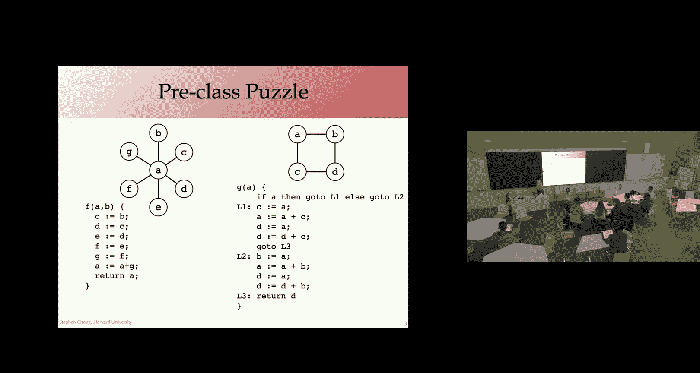
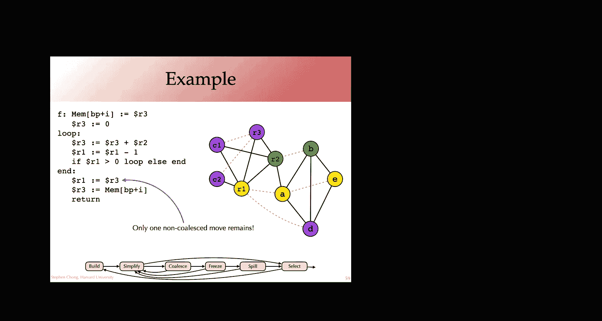

# 022：寄存器分配与合并

在本节课中，我们将继续学习寄存器分配，特别是如何通过一种称为“合并”的技术来优化分配过程，以消除不必要的复制指令。我们还将探讨如何将机器特定的调用约定（如参数传递、返回值、调用者保存和被调用者保存寄存器）整合到寄存器分配算法中。

---

## 概述

上一节我们介绍了基于图着色的寄存器分配基本算法。本节中，我们将看看如何扩展这个算法，通过合并（Coalescing）来优化那些包含复制指令（如 `x = y`）的程序，并学习如何处理预着色节点以满足实际的机器调用约定。

---

## 寄存器分配算法回顾

首先，让我们简要回顾一下上节课介绍的基本寄存器分配算法，即“通过简化进行着色”。

该算法包含四个主要阶段：
1.  **构建干涉图**：利用活跃性分析信息，为程序中的每个临时变量（虚拟寄存器）创建一个节点。如果两个变量在程序的任何一点同时活跃（即它们的活跃范围重叠），则在它们之间添加一条边。
2.  **简化**：重复寻找并移除图中度数（邻居数量）小于可用寄存器数量 `k` 的节点。将这些节点压入栈中。这个操作是安全的，因为我们可以保证在后续阶段能为这些低度数的节点找到可用的颜色（寄存器）。
3.  **潜在溢出**：如果图中只剩下度数大于等于 `k` 的节点，则必须选择一个节点进行“潜在溢出”。通常使用一个**溢出优先级**公式来决定：`spill_priority = (use_count + def_count) / degree`。选择优先级最高的节点（即使用频繁但度数高的节点），将其从图中移除并压入栈，然后返回简化阶段。
4.  **选择**：当图被清空后，开始按出栈顺序（即与压栈相反的顺序）为节点分配颜色（寄存器）。如果为某个节点分配颜色时，发现其所有邻居已经占用了所有 `k` 种颜色，则此节点**实际溢出**。需要重写程序，将该变量的值存入内存（栈帧），并在使用时重新加载，然后**从头开始**整个分配过程。

这个算法能有效地将虚拟寄存器映射到有限的物理寄存器上。

---

## 合并寄存器分配

然而，基本算法没有专门处理程序中常见的复制指令（如 `a = b`）。像复制传播这样的优化虽然能消除这些指令，但可能会延长变量的活跃范围，从而增加寄存器压力，导致更多的溢出。

更好的方法是让寄存器分配器本身尝试将复制指令的源变量和目标变量分配到**同一个物理寄存器**。这样，复制指令 `a = b` 在最终代码中就会变成 `R1 = R1`，成为一个空操作，可以被安全删除。这种技术称为**合并**。

### 合并的核心思想

如果两个变量 `x` 和 `y` 之间存在复制关系（即 `x = y` 或 `y = x`），并且它们在干涉图中**没有边相连**（即它们的活跃范围不重叠），那么理论上可以将它们分配到同一个寄存器。

在算法中，合并操作意味着将两个节点 `x` 和 `y` 合并为一个新节点（例如 `xy`）。新节点的邻居是原 `x` 和 `y` 节点邻居的并集。

### 安全合并的启发式方法

盲目合并节点可能会将一个原本 `k` 可着色的图变得不可着色，从而引发不必要的溢出。因此，我们只在确定安全的情况下才进行合并。以下是两种常用的启发式方法：

1.  **Briggs 启发式**：合并节点 `x` 和 `y` 是安全的，如果合并后的新节点，其邻居中**度数大于等于 `k` 的节点数量少于 `k` 个**。
    *   **原理**：在简化阶段，所有度数小于 `k` 的邻居最终都会被移除。如果合并后节点的高度数邻居少于 `k` 个，那么它本身最终也能被简化掉，因此不会引起新的溢出。

2.  **George 启发式**：合并节点 `x` 和 `y` 是安全的，如果对于 `x` 的每一个邻居 `t`，都满足以下条件之一：
    *   `t` 已经与 `y` 干涉（即 `t` 也是 `y` 的邻居）。
    *   `t` 的度数小于 `k`。
    *   **注意**：这个条件是针对 `x` 的邻居。在实践中，为了对称性，通常也会检查 `y` 的邻居是否满足类似条件（即交换 `x` 和 `y` 的角色）。
    *   **原理**：这确保了合并操作不会显著增加新节点的有效度数，因为要么邻居本来就与两者都干涉，要么邻居是低度数节点，可以被简化掉。

只要满足其中任何一个启发式条件，就可以安全地进行合并。

---

## 合并着色算法流程

整合了合并功能的寄存器分配算法流程如下，它比基本算法更复杂，但步骤清晰：

1.  **构建**：构建干涉图，并标记哪些节点是“移动相关”的（即作为复制指令的源或目标）。
2.  **简化**：重复移除**非移动相关**且度数小于 `k` 的节点，压入栈。**只移除非移动相关节点是为了给合并创造机会**。
3.  **合并**：检查所有移动相关的节点对。如果根据 Briggs 或 George 启发式判断合并是安全的，则将它们合并为一个节点（继承所有的边和移动关系），然后**返回简化阶段**。
4.  **冻结**：如果无法继续简化或合并，则选择一个低度数的移动相关节点，**冻结**它（即移除其移动相关标记，使其变为普通节点），然后返回简化阶段。这相当于放弃对这个节点进行合并的尝试。
5.  **潜在溢出**：如果上述步骤都无法进行，则像基本算法一样，使用溢出优先级选择一个节点进行潜在溢出，移除它并压栈，然后返回简化阶段。
6.  **选择**：当图中只剩下预着色节点（见下文）或变为空时，开始按出栈顺序分配颜色。如果分配失败，则实际溢出，重写程序并回到第1步。

---

## 处理机器约定：预着色节点

实际的编译器必须遵守目标机器的调用约定，例如：
*   函数参数通过特定寄存器（如 x86-64 的 `RDI`, `RSI`）传入。
*   返回值需放入特定寄存器（如 `RAX`）。
*   被调用者保存寄存器（Callee-saved）在函数开头需保存，结尾需恢复。
*   调用者保存寄存器（Caller-saved）在函数调用后可能被破坏。

我们可以通过引入**预着色节点**来整合这些约束。将物理寄存器（如 `RAX`, `RDI`）也视为干涉图中的节点，并预先为它们“着色”（即固定其寄存器分配）。

### 具体方法

以下是整合调用约定的技巧：

*   **函数参数与返回值**：在函数开头插入从参数寄存器到虚拟寄存器的复制（如 `arg1 = RDI`），在返回前插入到返回值寄存器的复制（如 `RAX = result`）。这些物理寄存器节点是预着色的。寄存器分配器会尝试通过合并来消除这些复制。
*   **被调用者保存寄存器**：对于每个被调用者保存寄存器 `R`，在函数开头插入 `t = R`，在函数结尾插入 `R = t`。这里 `t` 是一个新的临时变量，`R` 是预着色节点。
    *   **好处**：`t` 和 `R` 是移动相关的，分配器会尝试合并它们。如果成功，则 `R` 未被使用，节省了保存/恢复。如果失败，`t` 是一个极佳的溢出候选：它全程活跃（与所有变量干涉），但仅定义和使用一次，将其溢出到栈帧是高效的做法。
*   **调用者保存寄存器**：在构建干涉图时，将每次函数调用视为**定义了所有调用者保存寄存器**。这意味着任何在函数调用后仍然活跃的临时变量，都会与这些预着色的调用者保存寄存器节点产生干涉边，从而阻止分配器将该变量分配到这些寄存器中。

**关于预着色节点的算法调整**：
*   在简化阶段，不能移除预着色节点。
*   不能溢出预着色节点。
*   算法终止的条件变为“图中只剩下预着色节点”。

---

## 栈槽分配

寄存器分配不仅适用于寄存器，也适用于栈槽（Stack Slot）。当变量被溢出时，我们需要在栈帧中为它分配空间。同样地，我们希望复用栈空间：如果两个虚拟栈槽（溢出的变量）的活跃范围不重叠，它们可以共享同一个物理栈槽。这本质上也是一个图着色问题，其中颜色代表不同的栈帧偏移地址。一个设计良好的寄存器分配器可以泛化，同时处理寄存器和栈槽的分配。

---

## 总结

本节课中我们一起学习了寄存器分配的进阶主题。我们首先回顾了基本的图着色分配算法，然后引入了**合并**技术，通过将复制指令的源和目标分配到同一寄存器来优化代码。我们讨论了确保合并安全的 **Briggs** 和 **George 启发式方法**，并梳理了整合合并功能的完整算法流程。最后，我们探讨了如何使用**预着色节点**来优雅地处理目标机器的调用约定，包括参数传递、返回值和调用者/被调用者保存寄存器，使得寄存器分配算法能生成符合实际硬件要求的代码。理解这些概念对于构建一个高效、实用的编译器后端至关重要。