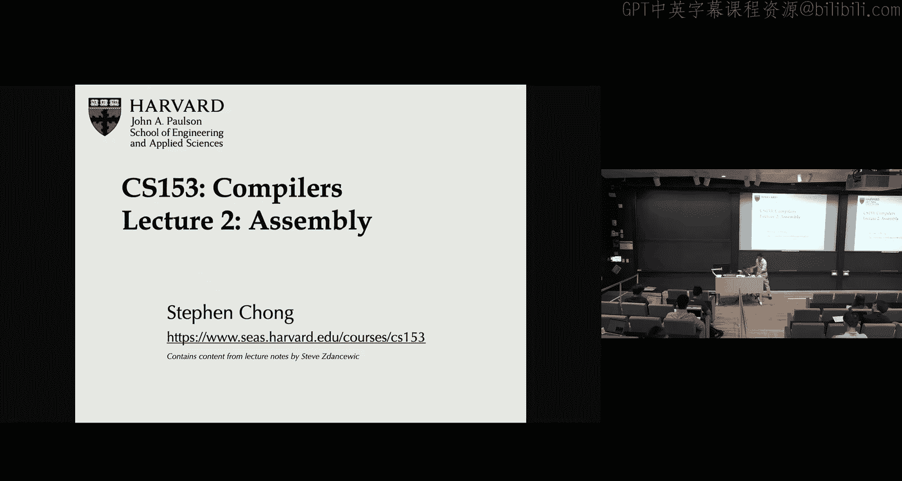
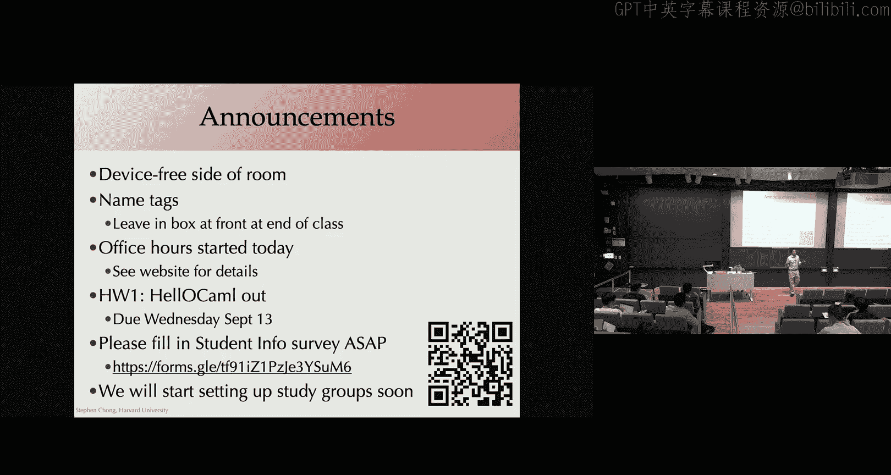

# 编译器课程：第1章：课程介绍与编译器概述

在本节课中，我们将学习编译器课程的基本介绍，包括课程规定、工具使用以及编译器在计算机科学中的核心作用。

## 课程规定与工具

上一节我们进行了简单的开场，本节中我们来看看课程的具体规定和所需工具。

教室分为两个区域。一侧允许使用电子设备，另一侧是设备禁用区。请根据个人学习习惯选择座位。

为了帮助我尽快认识大家，教室后方提供了姓名牌。请用大字清晰填写，课后可将其放回后方盒子中。

办公室时间已于今日开始。课程网站（Canvas）上提供了包含办公室时间的谷歌日历。每周一至周五均设有办公室时间。

## 编译器的作用与重要性

现在，让我们进入核心主题：编译器。

编译器是一种将高级编程语言（如C、Java、Python）编写的源代码，翻译成计算机处理器能够直接理解和执行的**低级机器代码**的程序。

我们可以用一个核心公式来描述编译器的基本功能：
**编译器(源代码) → 目标代码**

这个过程对于计算机科学至关重要。没有编译器，我们用人类可读的语言编写的程序将无法在机器上运行。

## 编译的主要阶段

以下是编译器工作的几个主要阶段，每个阶段都将源代码逐步转化为更接近机器码的形式。

1.  **词法分析**：将字符流（源代码）转换为有意义的**词素**序列。
2.  **语法分析**：根据语法规则，将词素序列组合成**语法树**。
3.  **语义分析**：检查语法树是否符合语言规范（如类型检查）。
4.  **中间代码生成**：将语法树转换为一种与机器无关的中间表示形式。
5.  **代码优化**：对中间代码进行优化，以提高最终代码的效率。
6.  **代码生成**：将优化后的中间代码转换为特定目标机器的**机器代码**。

## 总结

本节课中我们一起学习了编译器课程的基本框架和规定，并初步探讨了编译器的定义、重要性及其工作的主要阶段。编译器作为连接高级编程思想与底层机器执行的桥梁，是理解计算机如何运行程序的关键。在接下来的课程中，我们将深入探讨上述每一个阶段。