# 编译器课程：第4讲：X86汇编深入与OCaml表示

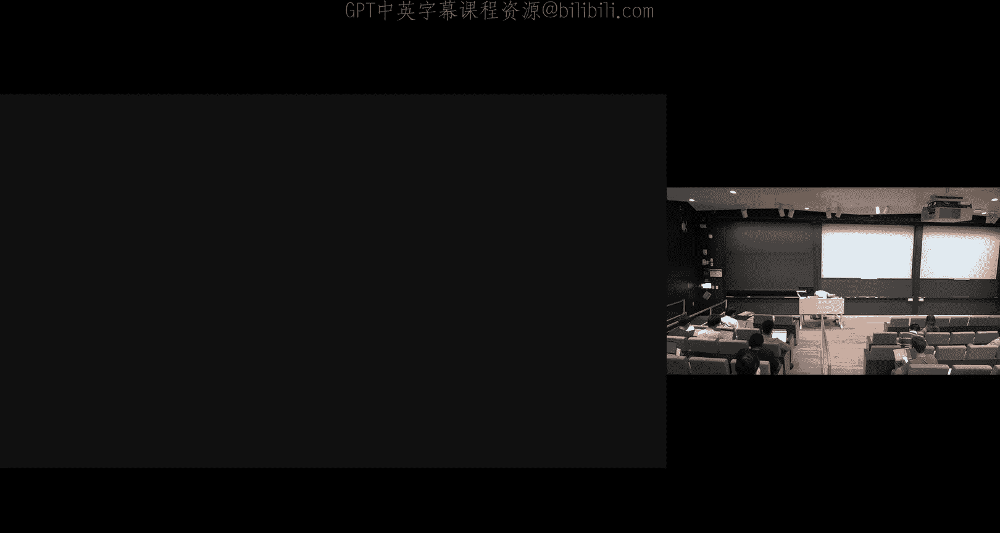

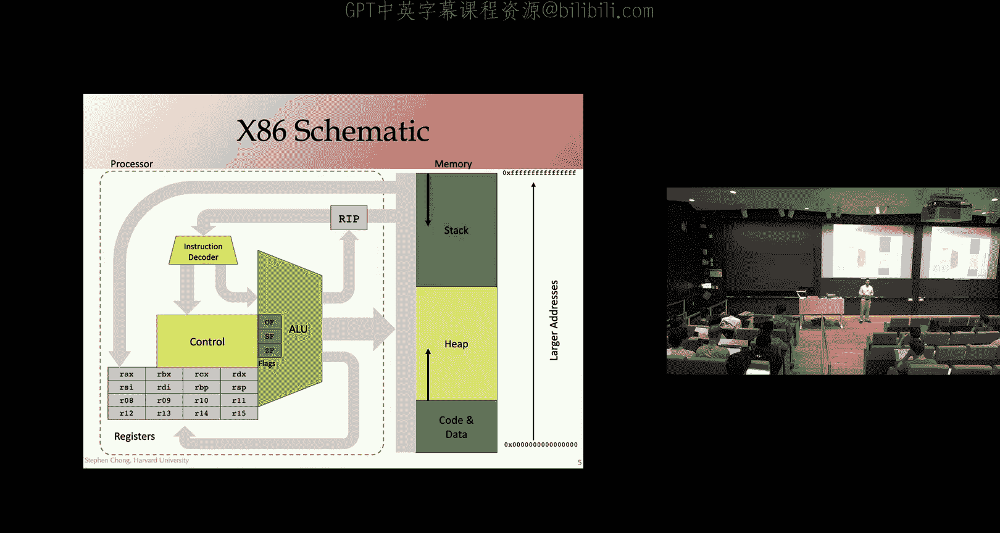

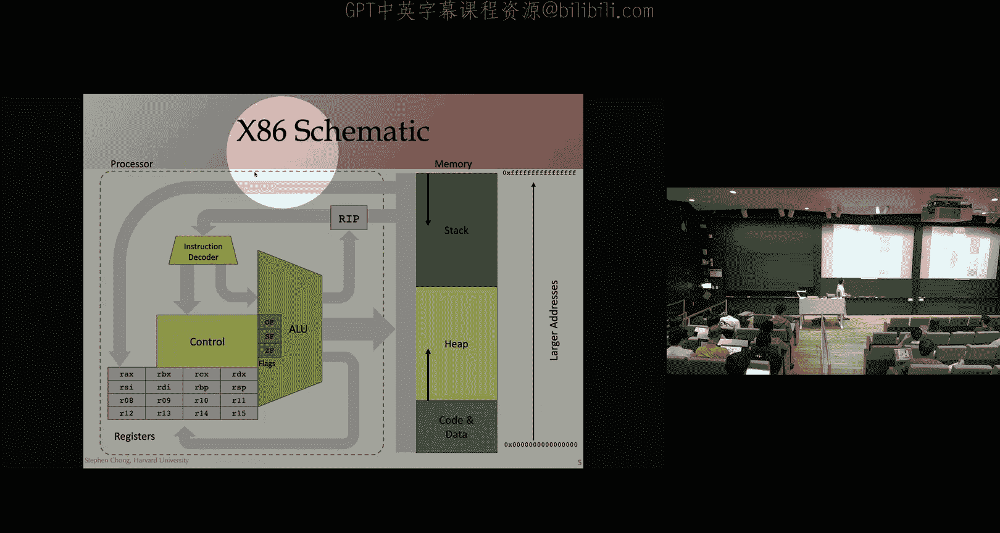

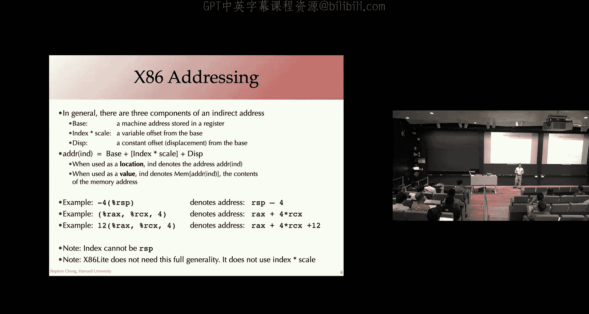

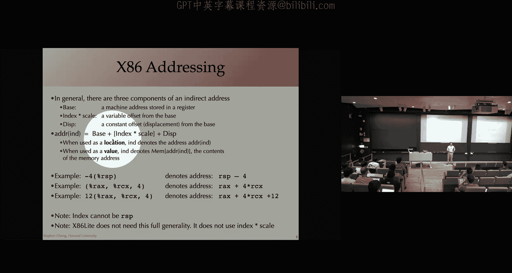

在本节课中，我们将继续深入学习X86汇编语言，特别是其简化版本X86 Light，并探讨如何在OCaml程序中表示X86代码。我们还将介绍函数调用约定，这是后续学习的重要基础。

## X86 Light内存模型与寻址

上一节我们介绍了X86处理器的基本架构。本节中，我们来看看X86 Light的内存模型和寻址方式。

X86 Light使用64位地址，可寻址的内存总大小为 `2^64` 字节。内存是字节可寻址的，但在我们的模型中，要求所有指针都是四字对齐的，即内存地址必须能被8整除。这意味着每次读取8个字节（64位），下一个可读地址是当前地址加8。

一个有用的机器指令是**加载有效地址** `LEAQ`。其语法为：
```
LEAQ IND, DEST
```
`LEAQ` 并不实际访问内存，它只是根据间接操作数（如 `基址 + 位移`）计算内存地址，并将计算出的地址（一个指针）存入目标寄存器 `DEST`。

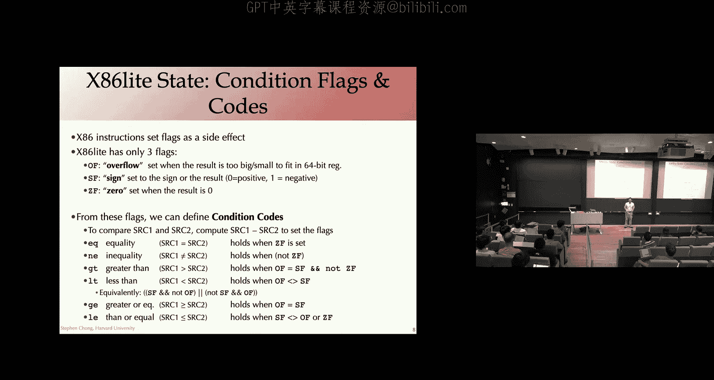

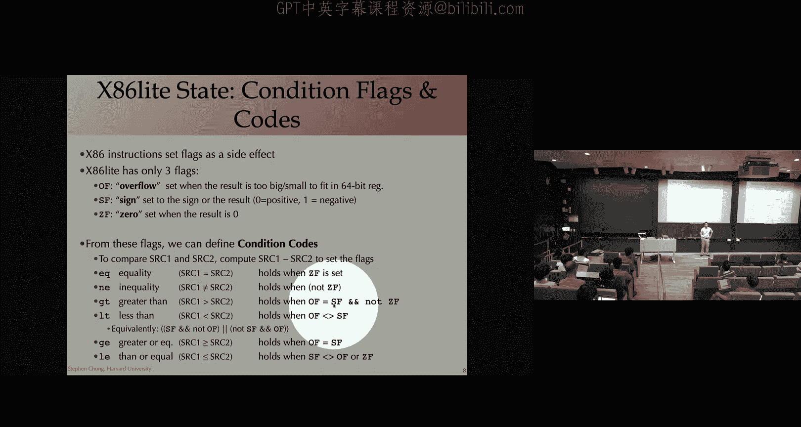

## 栈操作指令

X86架构中，栈从高内存地址开始，向低内存地址增长。栈指针寄存器 `RSP` 指向栈顶。

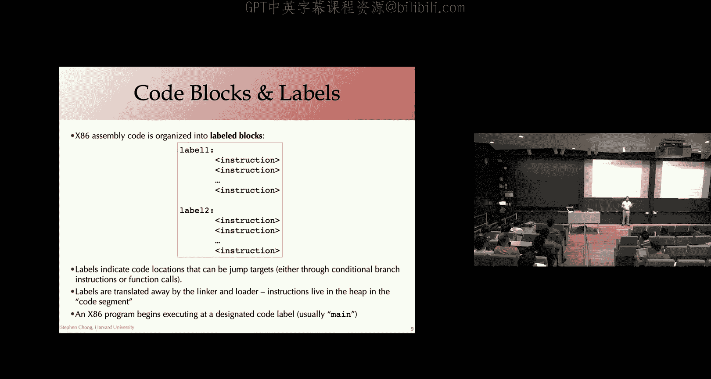

以下是直接操作栈的两个指令：

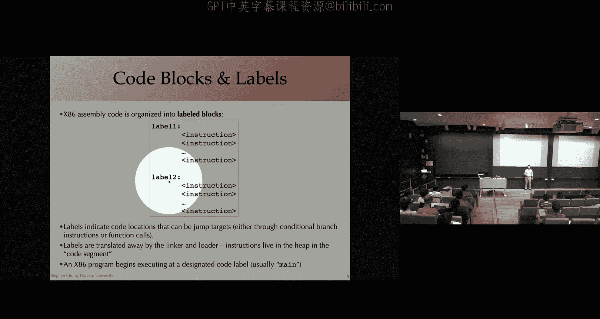


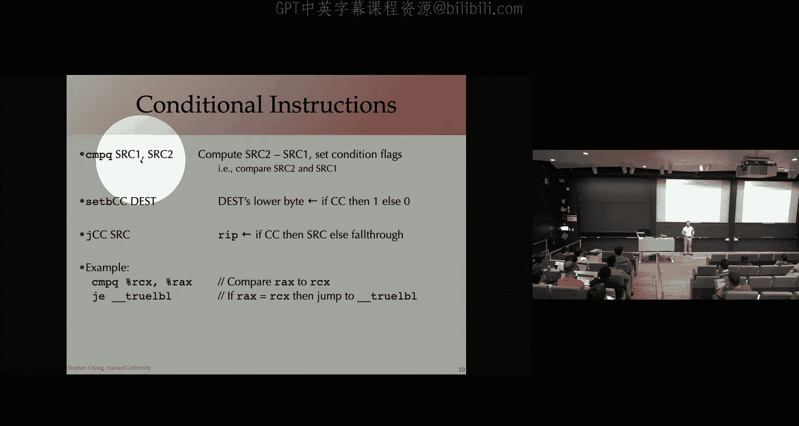

*   **PUSH SRC**：将栈指针 `RSP` 递减一个四字（8字节），然后在新的栈顶位置存入源操作数 `SRC` 的值。
*   **POP DEST**：从栈顶读取值，存入目标操作数 `DEST`，然后将栈指针 `RSP` 递增一个四字。

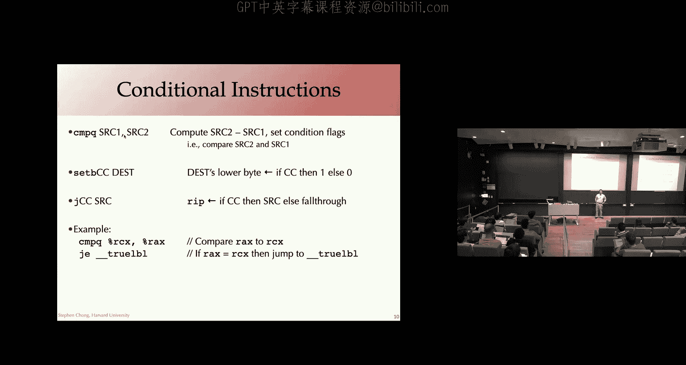

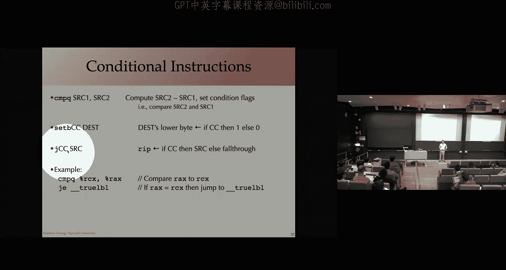


## 条件标志与控制流

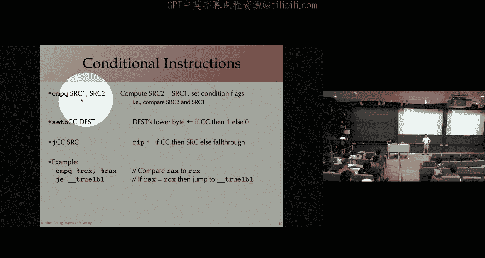

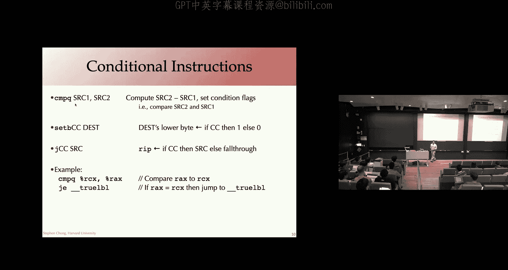

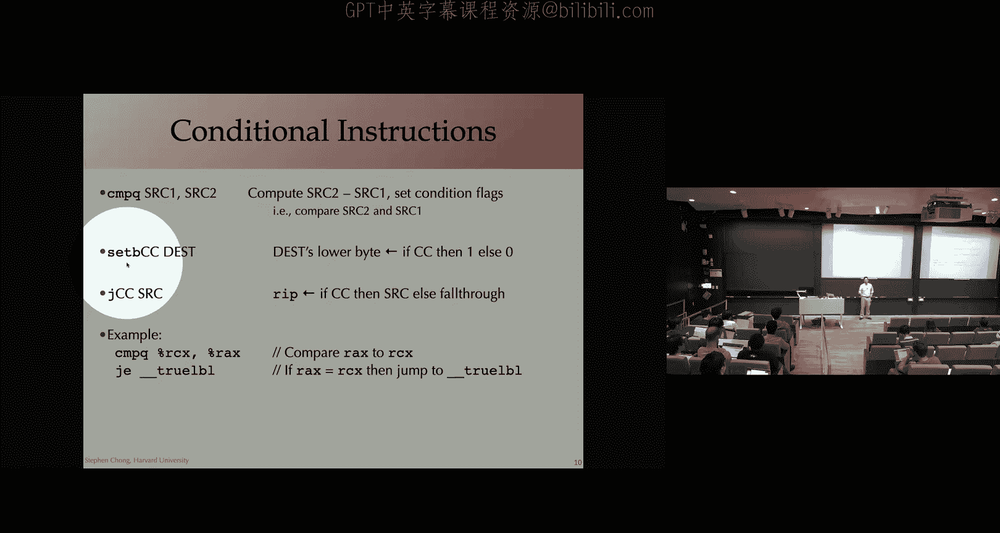

处理器包含多个标志位，在X86 Light中我们主要关注三个：
*   **溢出标志 (OF)**：当有符号整数运算结果超出64位寄存器表示范围时置1。
*   **符号标志 (SF)**：当运算结果为负数时置1（等于结果的最高位）。
*   **零标志 (ZF)**：当运算结果为零时置1。

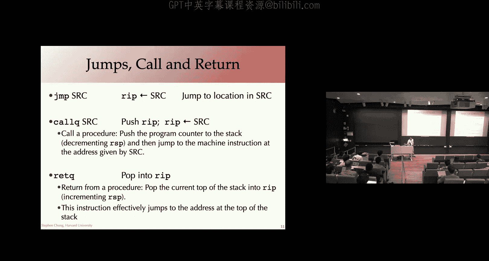

通过比较两个操作数 `SRC1` 和 `SRC2`（计算 `SRC1 - SRC2` 并设置标志位），我们可以根据这些标志判断它们的关系。

以下是基于标志位的条件判断逻辑：
*   **相等 (SRC1 == SRC2)**：`ZF == 1`
*   **不相等 (SRC1 != SRC2)**：`ZF == 0`
*   **小于 (SRC1 < SRC2)**：`SF != OF`
*   **小于等于 (SRC1 <= SRC2)**：`(SF != OF) OR (ZF == 1)`
*   **大于 (SRC1 > SRC2)**：`(SF == OF) AND (ZF == 0)`
*   **大于等于 (SRC1 >= SRC2)**：`SF == OF`

X86汇编代码由**带标签的代码块**组成。标签代表代码位置，可作为跳转目标。

控制流指令分为两类：
1.  **无条件跳转**：`JMP LABEL`，总是跳转到指定标签。
2.  **条件跳转**：通常是一个两步过程。
    *   首先使用 `CMPQ SRC2, SRC1` 指令进行比较（注意顺序：计算 `SRC2 - SRC1`）。
    *   然后根据条件跳转，例如 `JE LABEL`（相等时跳转）、`JNE LABEL`（不相等时跳转）、`JL LABEL`（小于时跳转）等。

此外，`SETcc DEST` 指令（如 `SETE`）可以根据条件码，将比较结果的布尔值（1或0）设置到目标操作数 `DEST` 的低字节中。

对于函数调用，有两个特殊指令：
*   **CALLQ LABEL**：将当前指令指针 `RIP` 压入栈中，然后跳转到标签 `LABEL` 处执行。
*   **RETQ**：从栈顶弹出返回地址，并跳转到该地址，从而返回到调用者。

## 在OCaml中表示X86代码

了解了X86指令后，我们来看看如何在OCaml中表示它们。以下是核心数据结构的定义：

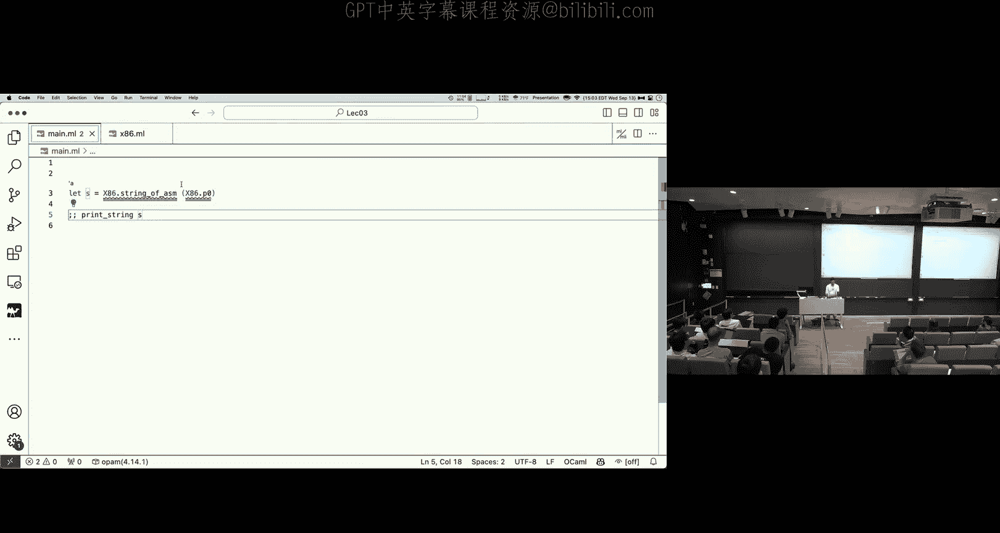

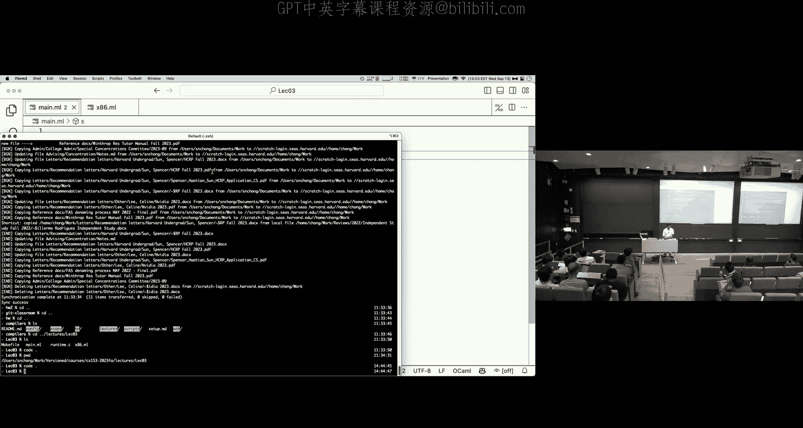

首先，定义标签和四字类型：
```ocaml
type label = string
type quad = int64
```

定义操作数类型，包括立即数、寄存器和间接寻址：
```ocaml
type arg =
  | Imm of imm (* 立即数 *)
  | Reg of reg (* 寄存器 *)
  | Ind1 of imm (* 仅位移：Imm *)
  | Ind2 of reg (* 仅基址：Reg *)
  | Ind3 of imm * reg (* 基址+位移：Imm(Reg) *)
```

定义寄存器类型，包括特殊寄存器和通用寄存器：
```ocaml
type reg =
  | RIP | RAX | RBX | RCX | RDX | RSI | RDI | RBP
  | RSP | R8 | R9 | R10 | R11 | R12 | R13 | R14 | R15
```

定义X86 Light支持的所有操作码：
```ocaml
type opcode =
  | Movq | Pushq | Popq
  | Leaq | Incq | Decq | Negq | Notq
  | Addq | Subq | Imulq | Xorq | Orq | Andq
  | Shlq | Shrq | Sarq
  | Cmpq
  | Sete | Setne | Setl | Setle | Setg | Setge
  | Je   | Jne   | Jl   | Jle   | Jg   | Jge
  | Jmp | Callq | Retq
```

一条指令由操作码和操作数列表组成：
```ocaml
type instr = opcode * arg list
```

一个带标签的代码块包含标签名、全局标识和指令列表：
```ocaml
type 'a labeled = { lbl : label; global : bool; value : 'a }
```

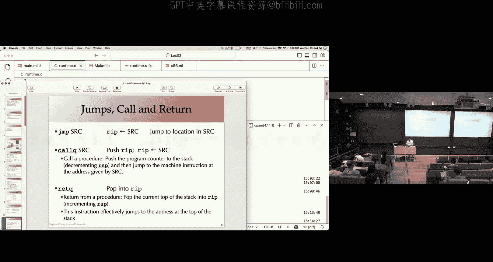

一个完整的汇编程序由代码段（文本段）和数据段组成：
```ocaml
type prog = { text : instr list labeled list;
              data : data labeled list }
and data = Quad of quad | Asciz of string
```

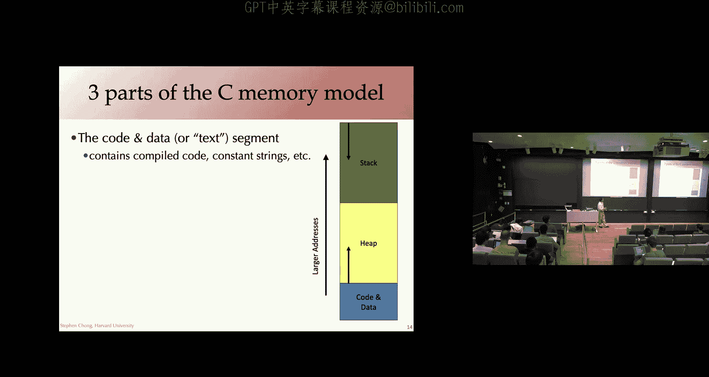

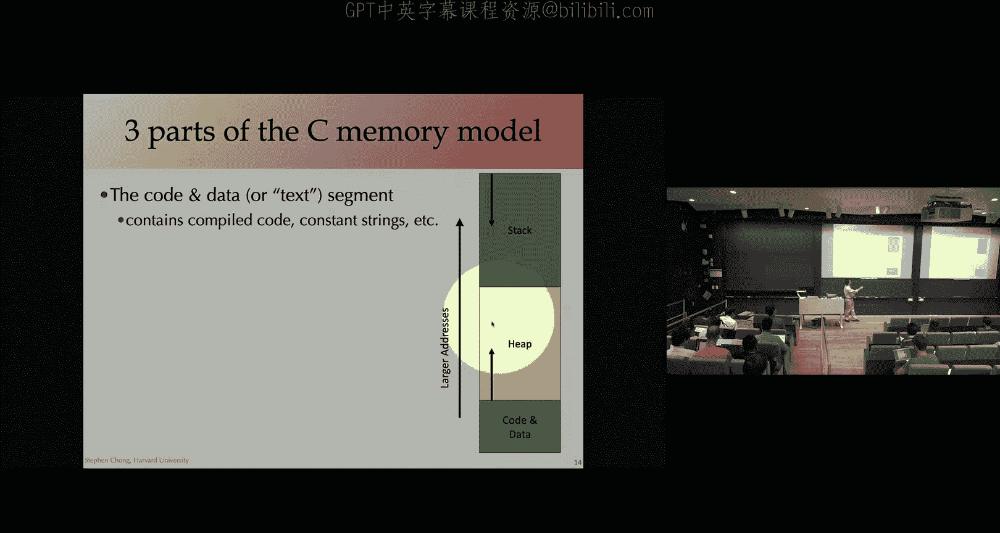

利用这些定义，我们可以编写OCaml代码来构建和打印汇编程序，甚至可以将其编译成可执行文件，正如课堂演示的阶乘计算程序一样。

## 函数调用约定与栈帧

最后，我们简要回顾函数调用约定。大多数现代语言使用栈来管理函数调用，存储局部变量和返回地址。

调用约定规定了：
*   **参数传递**：前几个参数通过寄存器传递，多余的参数按从右到左的顺序压入栈中。
*   **返回值**：通常通过 `RAX` 寄存器返回。
*   **寄存器保存**：分为调用者保存寄存器和被调用者保存寄存器。调用者在调用前需保存前者；被调用者若使用后者，必须在返回前恢复其值。
*   **栈帧结构**：每个函数调用都有一个栈帧，位于栈指针 `RSP` 和基址指针 `RBP` 之间。典型布局如下（从高地址到低地址）：
    1.  调用者的栈帧
    2.  参数构造区
    3.  返回地址（由 `CALL` 指令压入）
    4.  旧的 `RBP`（被调用者压入）
    5.  被调用者保存的寄存器
    6.  局部变量
    7.  当前栈帧（`RSP` 指向此处）

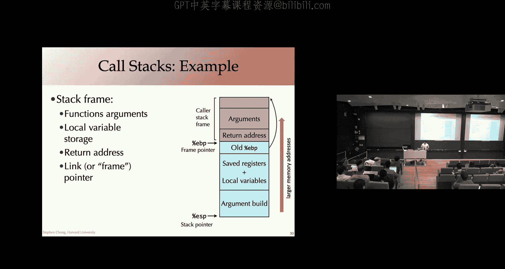

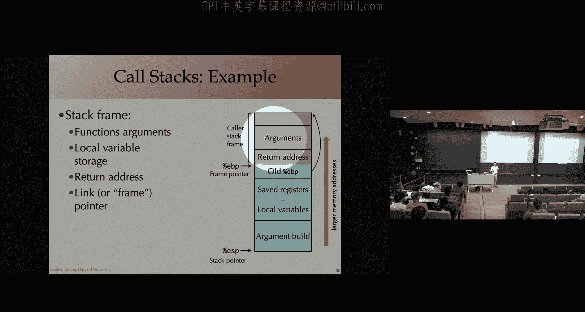

64位X86（System V AMD64 ABI）调用约定与32位类似，但细节更多，例如栈对齐要求和“红区”概念。

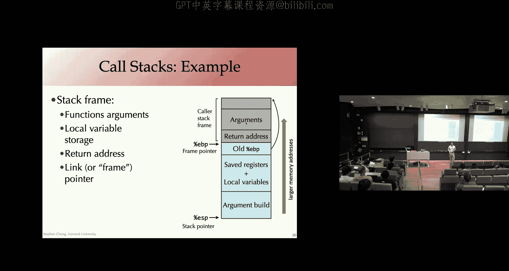

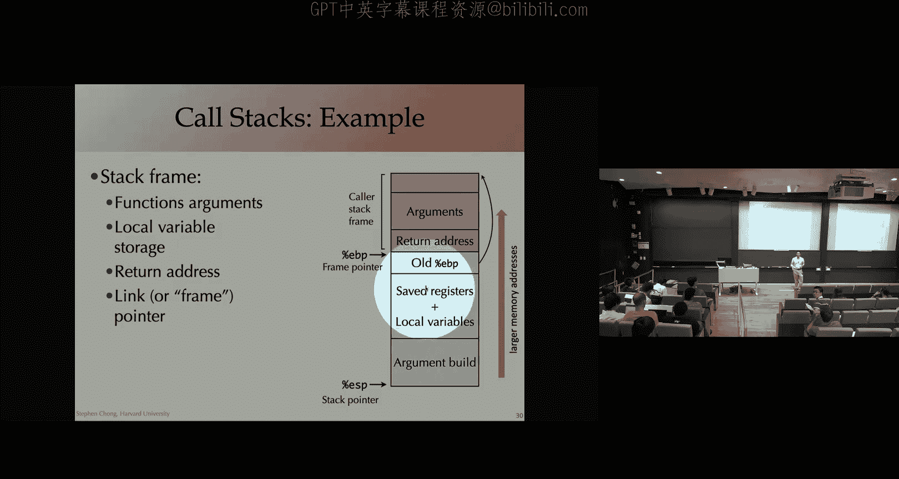

## 总结

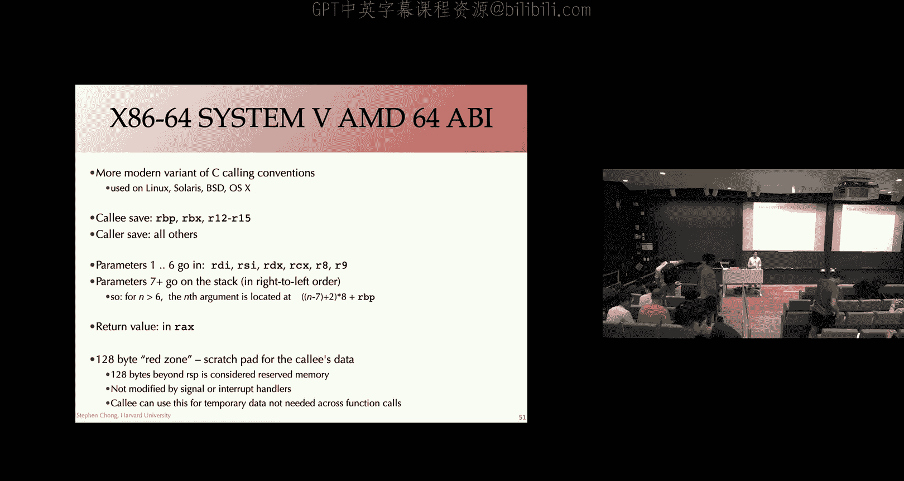

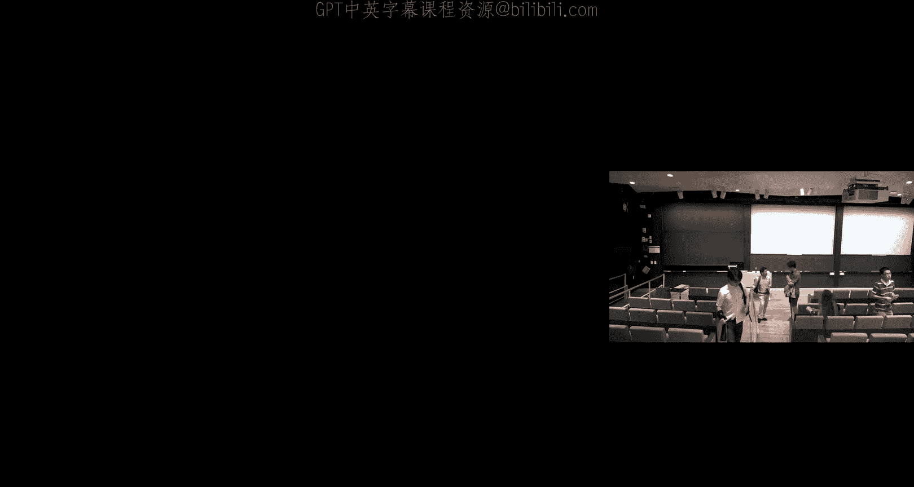

本节课中我们一起学习了X86 Light汇编语言的几个关键部分：内存寻址方式、栈操作指令、条件标志与控制流实现。我们还深入探讨了如何在OCaml中用数据类型表示X86指令和程序结构，并通过实例看到了从OCaml表示到可执行文件的完整流程。最后，我们回顾了函数调用约定和栈帧管理的基本概念，为后续实现编译器后端打下了基础。