# 哈佛大学《编译器｜Harvard COMPSCI 153 compilers 2023》中英字幕（claude-3.7-s p05 1695046500-Compliers_on_9_18_2023_(Mon).zh_en -BV14PAUejE98_p5-

这也吧。Welcome back， hope you had a good weekend。Ananouncements。

Thank you all for working on homework1 and submitting it。

I can't remember what I told you in the first lecture， but my goal in this class is to give you。对白ま。

The greater home goes back。One week。After the last。

David can be handed on so since news at almost three days with lay manager。

Since you can use the most three days worth of late minutes。

 that means 10 days after the due date of the assignment。 So what that means is by。

Friday of this week， hopefully sooner we'll get you back the graded homeworks。 and in general。

 will'll be trying to give you feedback on those and as timely away as we can。Homework  too。

 as you know， was out。 And that is due on Wednesday， September 27。 So about 9 days from today。

If you haven't started it， strongly suggest that you do。

 coding can often take a highly variable amount of time。

 And so in order to take account of that variance， starting sooner or rather than later helps。

And next week on Wednesday， September to 27th， we'll be releasing homework 3。

 We'll talk about homework 3 next week。For those of you that signed up to be in study groups， which。

 by the way， is everybody who filled in the forms， study groups have been assigned。

 you should have received an email。Friday。Friday， early afternoon that introduced you to each other。

 So hopefully you've had a chance to either meet or schedule a meeting soon for you all to work on that。

As I mentioned in the email， there's no particular structure for what you should be doing in the study group。

 As I mentioned in the email， I really do think it's actually beneficial for everyone involved in the study group to be part of it。

 as speaking of somebody who has been teaching here at Harvard for。Weirly， this is my 15th year。

 You really don't actually learn something until you teach it。

And so even if there's a range of understanding within the study group。

 even those who have the most understanding still benefit by engaging with and explaining or rewording the material to others。

 It really helps solidify your understanding。 And， of course， those with relative to a group。

 the least understanding can benefit by talking about it and asking questions。

 hearing other people's perspectives and triangulate their understanding for the material and also how to approach the homework。

There will be an evaluation that I'll be sending out at the end of homework too for those who participated in study groups to get an idea of how you're learning and how you're completing this assignment。

 who you've been learning from， be that from the Ed discussion board， study groups。

 office hours or other ways and also who you think that you've contributed to the learning of。

 which is I think one of the key ways this semester that we'll be looking at participation in the course contribution to the learning of others。

呃。I'll briefly remind you of the academic integrity policy， which is for both humans and AI。

 high level discussions are okay。 So talking in words about the concepts， totally fine。

Low level help is okay。 What is this error that I'm getting in the compiler。

 How do I use this particular library framework， API and so on。 Tot fine。

 It's the middle ground of say， showing large chunks of code or showing code at all。

 giving and receiving code be it from an AI or from a human and so on。 If you have any questions。

 feel free to reach out to me or to the other core staff。 And we can help clarify。Finally。

 also on the study groups， my intent at the moment is that for homework 3 will form some new study groups and the same for homework 4 with the goal being that this gives people in the class an opportunity to meet a number of others that they possibly haven't worked with。

I， as yet undecided， what will happen for homework 5 and 6。

 And I might take your feedback about whether that means。

Arrange study groups or let you self form based on the what you've been found finding is working for you over the previous assignments。

Any questions at the moment on any aspect of the homeworks， the administrative stuff， study groups。

Okay。So the last couple of classes， we looked at X 86 assembly。Right， and of course。

 you're in the middle of implementing a simulator for a subset of that， X 86 light。

What we're gonna be looking at over most of the next couple of weeks is intermediate representations。

That is something that's not the high level code。 This's not the low level assembly。

 but something in between。We're gonna find out we're gonna， first of all motivate why that's useful。

So to do that。What we're actually gonna to do first is。Think about compiling directly to assembly。

Right， we kind of know that if we can express the code in assembly， we can get the assembler。

 the link of the loader to turn that into executingum machine code。 and we can run a program， so。

Let's try going straight from our source language into assembly code。Let's take a look at some code。

 I've put this on the。

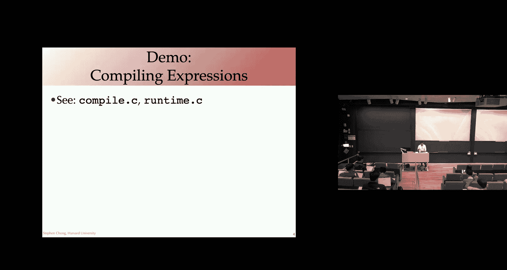

I put this on the canvasva web page， these files。like 4。嗯。take a look at compiled do M L。

 the idea of。Compile being that what we're going to do is take a simple expression language。

Compile it directly to X 86 assembly。Is this big enough to see。Thumbs up， fantastic， okay。嗯。

All right， so this。Language is pretty similar to the expression languages with you saw in homework 1。

 And then we saw and a fragment of the， of what we saw in class。

 We have expressions over 64 but intes。There can be either a constant。

A variable or addition multiplication or negation with one or two sub expressionions as appropriate。

I will say that for our variables， we're only going take 8 possible variables， X 1， x 2。

 x 3 up to x 8。 So this is really simple language。 Okay， fix set of variables。So our context here。

 that is the set of variable names that are in scope is really straightforward as just those8 variable names。

 X 1 through X 8。We will have a little function， static check that given an expression。

 just make sure that all the variables are in scope。 That is that the program is well formed。

 So this is a straightforward recursive function， which for a given variable X checks to make sure that X as a member of the context。

And for the other constructs， just recurs on the sub expressionions。Constant well form。

 They don't have variable names。O。We have a representation of X 86 machine code。

 This is very similar to the code that you have in homework to。 So I'm not gonna dig into it。嗯。

Too much。 we looked at it really briefly。嗯。A week ago， as well。Let me jump down to。Compile 1。So here。

 the idea is， we're gonna be compiling。A source expression。Directly into a next 86 program。

You might recall that we have our X 86 program is。Conists of a text or code segment。And then。

 a data segment。In this simple language， we don't need a data segment。 We don't。

 We're not gonna have any constant strings or constant data that we're going to be。呃。

That we're going to be using。The key idea。Is that。Given an expression in the source language。

 First of all， we're gonna compile it to a function。Undersco program， as you can see there。

A function is going have。The standard function prologue and function epilogue to set up the stack environment。

But then what we're gonna be doing is simply having。

Each variable mapped to a particular location to a register or somewhere on the stack。

And as we do our operations， we're gonna be accessing the variables in those places。

 And as we produce intermediate results， we're gonna be。Essentially， maintaining an invariant。

Where we going to。Push intermediate results onto the stack。

Have the immediate result of an expression。Being stored in the register RA X。

And using these invariants。Okay， current value of the expression is always an R X intermediatemedia results pushed on the stack。

To compute the expression。Okay， so let's dig into this。First of all。

 we have function prologue and function epilogue。 Let me just scroll up to。

Neith the top of the file to show you that in the function prologue。

All we're doing here is hitting up the new stack frame。嗯。

Pushing the old base pointer and moving the stack pointer to be the start of the。Sorry。

 moving the base point to now be the top of the stack。O。Really。

 really simple approach we're taking here。 We're not even saving。

 We're not doing any quality save registers， anything like that。Function epilogue。

 all we're doing is popping off the stored base pointer that we had to restore it。

And then returning to the， to the caller。嗯。So that is removing the stack frame。Returning。

The function that we're using to compile a source expression， compile X。Is。Pretty straightforward。

 It's straight here。If we have a variable。What we're going to do is read the contents of their variable。

 which is in one of the locations， a register on the stack and move it into R X。

 right So this is maintaining the invariant that the result of the expression is going to be stored in R X。

 The expression here is very simple。 just the variable。

 So we're taking the content of their variable， putting an R X。

Let's take a quick look at compile v to see where the。Variables are Okay， compile our。

 we take the variable and X1 is gonna be stored in the register RD I。

 X 2 in the register R S I and so on， E cetera in X 8， we're gonna be storing in in our stack frame。

So we had an offset from。Okay， moving back down to compiling our program。Okay。

 is there taking care of the compiling a variable？Compiling a constant， also straightforward。

 we essentially just do a move of that immediate value。That literal constant into R A X。

 the result of the expression， again， maintaining the invariant。

More interesting is the expressions that have sub expressions。Okay， so let's。First of all。

 take a look at negation with a single sub expression E。The first thing we do is compile。

The subexpression E。You can think about this as emitting a list of assembly instructions to compute E。

And from the invariant， we know that the result of E is going to be stored in the register RA A X。

To that list of instructions， that computes the sub expressionion E。

We're appending one more instruction。Which is taking the contents of R A X， the result of E。

Multiplying it by negative one。 that is negating it and putting it back into R X。Okay， so again。

 what this is doing is computing the result of the expression， negative E。

Making sure that the result is stored in the register R A X。Add and multiply。

These have two sub expressionions， and the code is really similar。

 except for the operation that we're gonna do on the sub expression。

 So we've actually factored it out here。Into this compile op。

Which takes the op code that we're going to apply to the result of the sub expressionions and the two sub expressionions。

 E1 and E2。Okay， so what we're going be producing is a sequence of assembly instructions to the computes。

The operation applied to the result of E1 and the result of E 2。We do that by， first of all。

 compiling E1。There's going to be a sequence of instructions。That puts the result of a1 into RAX。

The thing is， we're going to need RA X to compute the result of E2。

So what we do with the value in R E X， the result of E1 is we simply push it on the stack。Right。

 pushush Q R X。Within by calling compile X E2， this is going to produce a sequence of instructions that computes E2。

Puts the result into RA X。What we didn do is pop。呃。Pop from the stack。The result of E1。

And we're going put that into the register， R 10。R 10 is a registered。 We've carefully kept free。

 We're not using it to store any particular variable。We're going to use。So， now we have。

1 operate in R 10， the other one in RA X。We're going to apply the operation。

 either addition or multiplication。To those opera ends and store the result in RAX。So again。

 this is maintaining the invariant。That the result of the expression is being stored in R A X。

And that's it。Really simple compilation。Right。The key idea here is that when we were compiling these sub expressions。

 we had these invariants。Right， which registers were being used for what。

Where sub expressions were being stored。And we got to both assume that invariant was true。

When we invoked compile on our sub expressions， and we also had to make sure that those invariants held true as we were implementing it。

Right， long and short of it is。We're able to， we're able to produce code that computes these expressions。

Let's go through and see how this actually plays out over here in mean dot M， L。We have。

What we're gonna do is take a program。 I'll show you the source  one program， call。

 compile one on it to get the next 86 program。 and then simply。Output the result。嗯。Right。

 let's take a look at source 1。 Okay， straightforward program。 we're simply adding x 1， x 2 x，3 x。

4 x 5， x x， x 7， x 8， and the constant 42。Let's。Let's play around with us。Okay， so opening up U top。

Using the X 86 module。So I'm putting all those definitions。Using compiled on M L。

 the thing we just define we just walked our way through。No， loading up。嗯。Main do M。呃。

There's the program source one that we're going to be compiling。嗯。嗯。

Here's the result of compiling that So 1 program。This is， of course， the X86 data structure。

 We can see it printed out。A little more nicely， by。In our X 86 module。

 taking the string of the program。That we just produced。Printing it out。

 And we see some nice assembly code。Okay， so here's our program function。Function prologue here。

 setting up the stack frame。And then if you recall。

 what we're doing is x 1 plus x 2 plus x 3 plus x4 done right associatively。

 So with the first edition， the left sub expression was x1。Which is stored in R D I。

 putting them to R X， pushing R X onto the stack。And then， starting to compute。

The the second sub expressionion， X 2 plus x 3 plus x 4。Right。

 so you can work your way through and see how that recursive function producing the sequence of instructions as appropriate。

Any thoughts for why we chose to store X 1， x 2， x 3， and so on in the locations that we did。

Those are the order。argumentsrguments。By。That's right。 So for the calling convention。

 the first arguments put into RDI， the second argument and to R SI and so on。

And so this is gonna make it nice and easy for us to pass in the values of X 1 through X 8 when we invoke program。

And。And， let's take a look at。嗯。Runtime dot C。Which we're going to use as a。We're going to use as a。

A handle to do this。A sub to invoke our program。 So we're gonna have in our C program。

 we're gonna have a main function that takes in our eight arguments。

 We convert those  eight arguments into 64 bit ins。

 And then we're just gonna invoke our program function， passing in those 8 arguments。

 print out the result。And we've declared。Program to be an external。

Function with the appropriate signature so that when we compile runtime dot C and we compile our assembly。

 we're gonna be able to link them together and run it。Sir。😔，Let's see how we do。嗯。

This is compiling our。Main dot native is just the main dot M L。 So it's。

There it's just producing that same code。Printing out the same code for computing that expression。嗯。

Thats呃。Put that into an assembly file。Its compile。Tling GCC to make sure we're compiling for X86。

Given that， I am。Running on an arm based machine。嗯。Synchronous。

This is preventing GCC from putting in various annotations that are useful for debugging so that will produce some simpler。

Output。Let's take a look at。The result over runtime dot S。好。Okay， so。

Here on the right is runton Godess。 Here's our N 64 function， which is。

Converting our string into a 64 B representation。嗯。Primarily， by calling。String to long， long。

What else is useful here。Is our main function。Can to be。Taking our input arguments。

 converting them to strings。 And let's see where we're setting up the quarter program。

 Here our quarter program。What we're doing here is putting our arguments。

 setting up the arguments for that call， putting them into RDI， R SI， RD X， R C， X and so on。

AllRight。Any questions at the moment。他说下吧。Do something into R1ン。Al wait。Yeah。

 it moves something into R 10， and it moves into。Like two instructions stated。That just。

What is going on here。 So these are， you， remember R S sorry， X 7 and x 8 are stored in the stack。

 They are the。嗯。Two of the arguments to our functions， so。This is， this code is。You're right。

I believe， loading up the result of。嗯。Try to remember if that's X7 or recite。Growing downwards。

 this is X8。I believe it's putting it into R 10。 and then it's putting R 10 into。

With a stack pointer， the location that the stack pointer is pointing to， So top of the stack。

Putting in the next one，8 by offset to that。And then。Calling program。

Is there a reason why it needs to go like for the intermediate register？This is。Very inefficient。

 It is quite possible that I need to go check and refresh my memory about whether there's restrictions on those operations。

 But yeah， you could imagine that it could have done the。A more optimal compilation。

 where it's computing the result and putting it in putting the result in the right location。

Or being able to do it in fewer instructions。 minus-00 is。No optimizations。

Let's take a look at what happens when we do。- so2。呃。Alright， so。Let's pass our way through this。

I'm going to say。Okay， I think。I would need to double check。

 but I think these might be the things that are pushing the arguments on。 And so you see。

 is's choosing a different sequence of instructions。Based on the heuristics what's gonna work better。

 So yeah， definitely fewer instructions here。 there was doing a load to register and then。

 and to the thing。 And this was able to do a push directly。So。No， I think。

Not wrong we use some invari。I件。 but here we seem to。我说了。还0到。I have to a page of this backend。

 but I'm pretty sure that R10 is caller save。 right。 Yeah， so what that means is remember。

 this is the code for main， which is about to invoke program。

And so Maine didn't actually need that the value in R 10。

 so it didn't need to save it away before calling program。

 And the quarterly is free to do whatever it wants with that register。

 to leave that register in whatever state it wants。 So it all works out。

We are following the Qan conventions here。Okay， let's see。Let's go back and。Up with us。

 So we're going to take our runtime dot S that we just looked at calculated dot S。

 which was the result of our compiler running our M L program on the representation of the source。

And then we can call calculator。Gets told that we have to provide some inputs。So， let's see。

Let's do something simple，1，2，3，4，5，6，7，8 plus 42 should be 50。Great。Greatray， it works。

You can play around with us yourself。Trying some of these other programs that we have here。Soce 2。

 source 3。Soce 4， source 5， trying your own， ro your own ones in this painful form。

 ocal form and compiling to produce assembly and running it with the code。O。Cool。

 so we got at Wikio things， right。Course is done。 We took a high level language。

Expressions produce 6，86 code。Okay， so clearly。

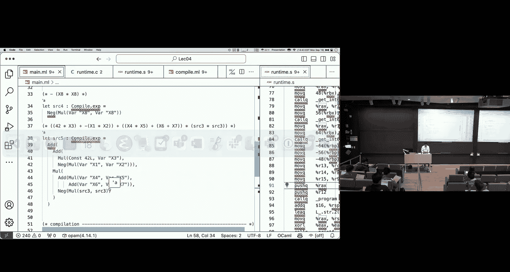

It's cool that we were able to do that。But。嗯。It maybe wasn't the most efficient。

Right our approach of doing this。I will say we were able to handle arbitrary length expressions。

 That's pretty cool， right， We were able to essentially use the stacked store intermediate results。

 And so no matter how big the programmer you wrote was。

 even though we have a small number of registers， we'd still be able to compute that。😊，嗯。

I emphasize the idea of maintaining invariance。In the completionation。 So that is， we always knew。

Where those local variables were being stored。And we always had this idea that the result of the expression was going to be an R A X。

And that was key to letting us。Make the whole thing work in a nice， clean， simple， compositional way。

The approach we were taking was really this idea of emitting instructions。The way it was written。

 we kind of saw that we were producing a list of instructions。But， actually。

Out producing of the list， what we would really be doing is compiling a sub expressionion。

 And that would give us the beginning of the list。Then we would depend on the next stuff we needed to do。

 So what we were actually doing when we were compiling these expressions was。Emitting the sequence。

 you could almost imagine that we could have。Printed out those assembly instructions directly。

 right as a side effect。 This idea that we didn't need to do a whole lot of manipulation of the data structure afterward produce it。

 We really were just emitting the right instruction as we went。

 the correct instruction as we went along。嗯。四。Thing also wan to mention。

 we wrapped it up to comply with the sea declarations。测完。So， this worked well。

For this simple language。 But there were， of course， some caveats。Right。

The code we produce wasn't great。Right， it was inefficient。You know。

We only had 8 variables that we hard coded， where they were。So you can imagine that， as we added。

A richer source language， even just more local variables， would need to change something。

Letttle alone handling， things likestructs， objects， functions as values， things like that。

It's a pain in the but to read， to read assembly。And so if we wanted to improve the assembly that we had writing a program to do that。

 it's actually also pretty tough。Right by the time we've got this sequence of assembly instructions。

It's actually pretty painful to try and optimize it by hand。We were able to get away with。This nice。

 simple compilation technique， in part because。There's no interesting control flow in the expression。

 right when we had this arithmetic expression， there was only one path。

We always knew exactly what the next thing for us to do was。 That is。

 we were always evaluating expressions left to right， evaluate the left of expression。

 evaluateate the rights of expression， perform the operation。对。But， of course。

A lot of the languages we're interested in dealing with。Have more interesting control flow with that。

 They have conditional statements。 They have loops， They have functions。So clearly。

 when we compile code， we need to be able to deal with that。

I guess we also baked the X 86 into this translation。 right。

 this compilation from the source language。Directly to X 86。 And what that means is that。

If we wanted to change to a new architecture， right， to Wam to risk 5。

A few these expressions on a GPU， it's gonna be。We're gonna essentially need to rewrite the entire compiler in order to change that target language。

So all of these are motivations for these intermediate representations。

For representation of the program that is not。The original source program。

 but it's also not the low level assembly level instructions。

The key idea of intermediate representations is that they can hide away。

The details of the target architecture， they're abstracting away from the particular machine。

This can help simplify。Geration of code in a machine independent way。

 So that is from a high level source program， say Python， Javascript， Ocal。We can compile it down。

 We can do a lot of the work， the challenging work of figuring out how to execute it without needing to know which particular machine we're targeting。

RightWe can have a low level intermediate representation where're capturing a lot of the low level operation。

 but we haven't chosen specific assembly instructions。

 We haven't committed to a particular architecture。At that level of optimization。

 it's also easier to perform optimizations。 There's more structure around。

 It's going to be easier for us to figure out alternate ways of specifying the computation that are more likely to run fast。

And it also allows us to have multiple different backends。 right。

 We can have a lot of the compile of the same。Getting down to this lower level intermediate representation。

 And it's really just the last part of the compiler that is committed to a particular architecture。

 So we could have one back in for X 86， one for one for risk 5， another one for Java byte code。

 whatever we were wanting。This diagram。Is also a little misleading， right， According to this diagram。

 we're going straight from the A S T into。

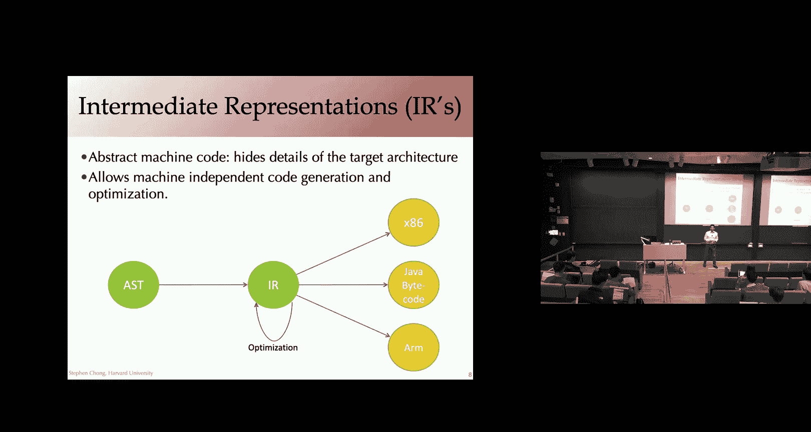

The intermediate representation， low level intermediate representation。

 where we can do some optimization and then sped out the machine specific instructions。

 So this addresses a lot of the issues that we saw in the previous slide。

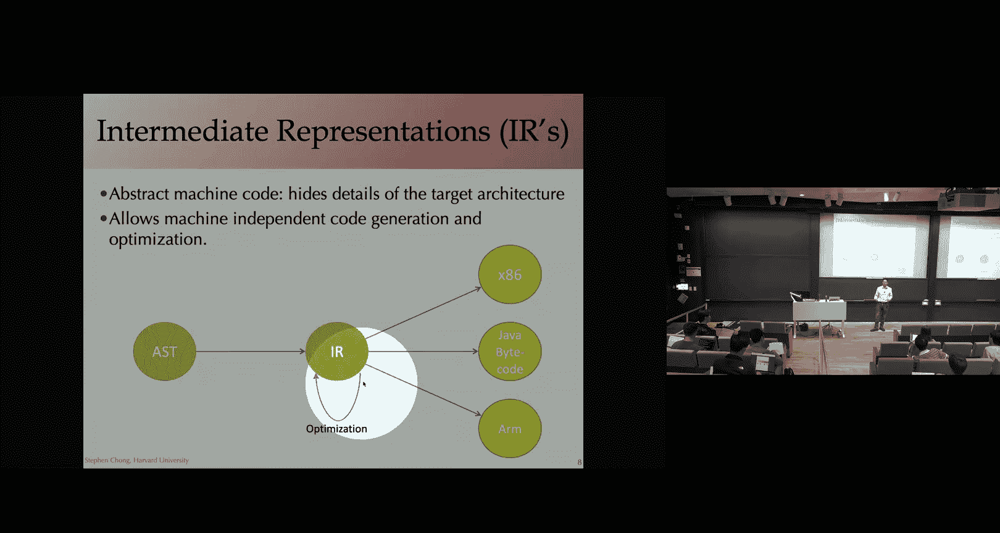

But going directly from the AS T to some low level code representation。

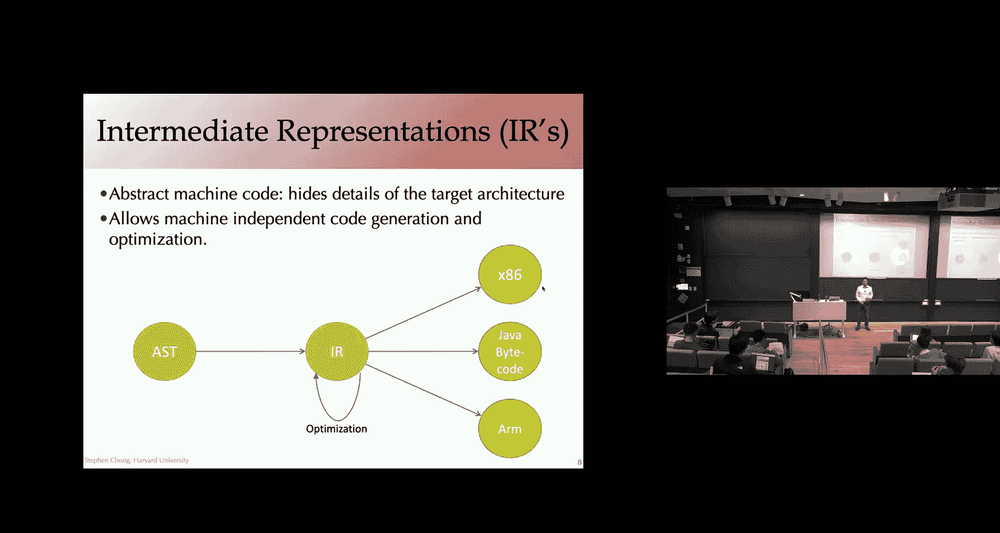

It's actually also really hard。

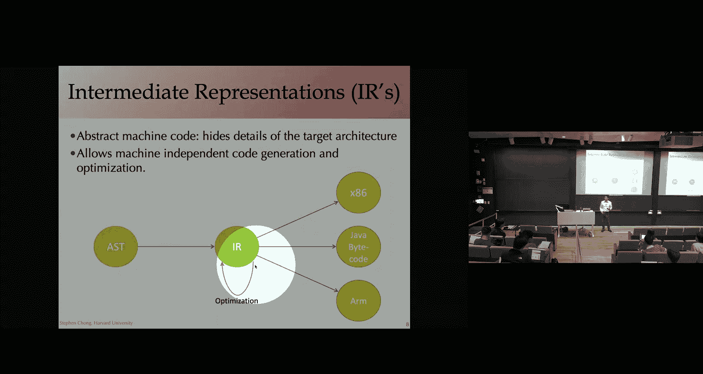

So what we're actually going do in a compiler， common way of architecting a compiler。

As though we have multiple intermediate representations。

A sequence of intermediate representations that get progressively lower level。

They get progressively closer and closer to the machine code。

So what this allows us to do is each pass of the compiler， which is going one step further down。

Or doing some operation within a particular intermediate representation can be relatively simple。

Right， so we might go from our high level source language。

 that is our A S T into some high level intermediate representation。

Then go into a slightly lower level one。And then a lower one and a lower one until we get to ultimately。

 to the assembly code。But having the sequence of intermediate representations makes each step along the way simpler。

To handle。不要。あとはそれ。But how much abstract？How much abstraction is too much abstraction， I agree。 It's。

It's a philosophical question that's hard to answer in the abstract。

I think you can kind of look at real code and talk about， well。

 what is the burden of this abstracttraction。And versus what is the benefit of it。嗯。

So towards that end， you know， we're gonna dig into some of the particular passes。

The particular intermediate representations。 And we'll be able to talk about why。呃。

We be able to argue about why a particular representation is a good one or not。嗯。

Maybe I can like to our projects like how we。What are some signs that we keep in mind for when we'？

Yeah， well， what I will say is。We're not gonna be designing our own intermediate representations in this class。

 What we're really gonna be doing is。嗯。Next lecture。

 maybe the lecture after I can't remember looking at L L VM。The L O VM compiler。呃。

Is an industry standard。 It has a particular intermediate representation。

That has a number of nice properties。It's a single intermediate representation。

 but it's actually treated as a sequence of different intermediate representations in the sense that which instructions are present。

In a particular program， at a particular stage， the compiler is essentially。

Changes as you get lower and lower level， ultimately getting machine specific instructions in the IR。

And so we'll talk about this idea that the invariance that hold at particular stages might change。

 even if the syntactic representation of the intermediate representation stays the same。

But I think that's actually a really challenging task of getting the right abstraction for the compiler。

Let's chat a bit more about it when we， when we get to L VM。 But it's thanks for the question。O。Well。

 that does actually bring us nicely into what is it that makes a good I R。In some ways。

It's an intermediate thing。So we need to both be an easy translation target。 So that is。

 we're gonna be compiling something to the intermediate representation from the abstractions from the levels further up。

 So it needs to be easy to translate to。It also needs to be easy to translate from。

As we go from their representation to the level below。Having a narrow interface that is， in general。

 having fewer instructions is typically better。Because that means。

This will definitely simplify the easier to translate to the level below。嗯。

Because there's fewer kinds of things that you need to translate。

 optimizationims are perhaps going to be easier。 Some of them are going to be easier。

 but it possibly means that it's a harder translation target。Because you need to remove more things。

And also， the choice of the constructs you have so that you're capturing the appropriate information at the appropriate stage of the compiler is kind of critical。

To give an example， in our high level source language。

 we might have a whole lot of different looping constructs。A while loop， a for loop for reach。

 Do while， do until。But in our immediate representation， we might only have wild loops。

Or at least at one level of intermediate representation。Okay， so this is kind of nice。

 We've reduced the number of constructs。 It's going to be easier to reason about while loops instead of all the other things。

 And while loops are expressive enough。To be an easy compilation target from all of those different kinds of loops。

So， for example， a for loop that you are quite likely familiar with from C， where four takes。

 in addition to the body， there's three parts to it。

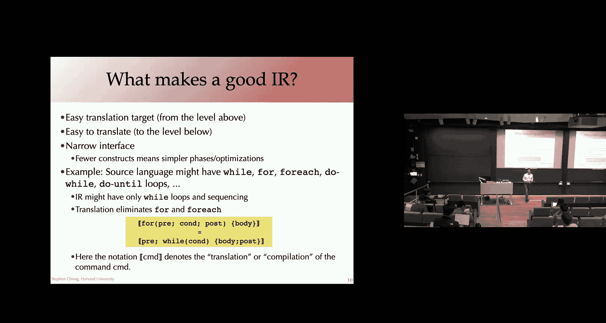

The pre statement might be initializing， you know， I equals 0。

 the condition to check I less than 10 and the post condition。 I plus plus something like that。

 This is easy to translate to， into a w statement。Pre happens before the wall loop。

 While the condition is true， you do the body followed by the post statement。

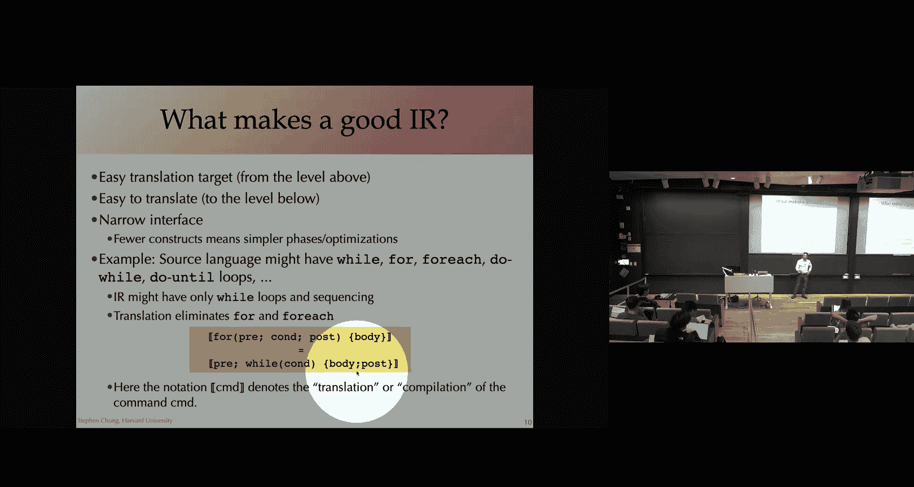

There's a little bit of care needed due to things like breaks and continues and， and so on。

 But this basic， this basic idea of translation would work。Here， the notation I'm using the。

Double brackets around a command means the translation or the compilation of the command。

 We'll touch a bit more on this later。 And for those from who've taken 1，52， you are very。

 very familiar with this kind of denotation notation。

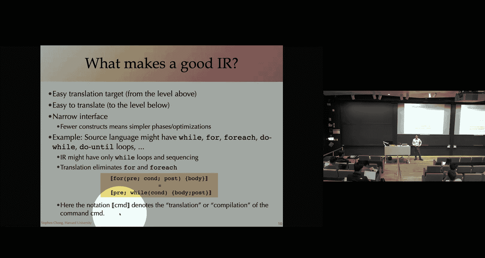

呃。But yeah， I'll point out that in terms of the choice of abstraction。Here in this。Very hypothetical。

 intermediate representation。We maybe chose that it did actually have a looping construct。

 that there was a wh loop。And this might make it easier to reason about the fact that， hey。

 we have a loop。 There's an idea of the loop body。 There's an idea of the thing that happens before the loop。

 And so we can talk about moving code in and out of the loop。

And that representation is going be much easier to deal with than if we simply had go to instructions。

Where the loop is not explicit， but just implicit in the structure of how instructions are jumping to each other。

So that is choosing the right level of representation is going to be key for reasoning about the program。

 performing optimizations and so on。 So it perhaps makes sense to have。

A representation where we do still have explicit loops with nested bodies。Even though ultimately。

 we're going to be compiling those away into jumps and conditional jumps。O。Alright。

 so we've got this range of intermediate representations from high level down to low level。啊。

The kinds of inter representations we might see at the high level。

Are close to the abstract syntax of the source program。

But we might have some additional node types and information that aren't generated by the Pser。

 So the most common one would maybe be type information。Right。

There's only a few type annotations in your source program。

 and your compiler is actually figuring out type information for every sub expressionion。

 So that's going to be going into some intermediate representation， maybe very close to the I S T。

Would deal with。Pasing very soon。After we've talked about intermediate representation。

 So in a couple of weeks。But it turns out passing is quite difficult。And when。

 even when you've paused in a program。China actually disambiguate or figure out。

What the program is syntactically talking about might require some passes。 So， for example。

 if you see a name。In the program， is it referring to a local variable to a type to a value that's defined in another module。

 This might actually require quite a bit of work to。To disambiguate this information。

 And so at some level of intermediate representation。

 we might have particular kinds of nodes representing the additional changes we've made to the program or information we've learnedt about the program。

The high level， the high level Is are typically preserving some of the high level language constructs。

 So structured control flow， like we were talking about。

 actually having a while loop as opposed to jumps， methods， functions and so on。

 And this is useful because it allows high level optimizations of the code。

 we talked about say reasoning about loops， moving code in and out of loop bodies as appropriate。

 but other high level optimizations might include deciding whether or not to inline small functions。

 It's going to be much easier to make that choice， if you actually have an notion of function around in your representation。

Yeah， Austin。Yeah， so I know from like a。ILike a back like。Compiler level。

 you might be interested in whether like your IR is easy to lift back to a higher level。

I'm wondering from like a forwardword compiler。Is there any reason or a scenario where we might be like moving back and forth between levels of an IR or are we just going purely in？

That is a really good question。Moving backwards。From lower level lis to higher level lis is。

Not common。嗯。I have a vague memory that there definitely are some LOVM passes that essentially do this。

That allow you to。You know。Passses that you would normally do to lower to closer to machine code。

 There are the inverse passes that would let you go backwards， but。

They're not typically used an a compcompation pass。 And in general， decompiling。is。

A completely separate area of study to compilation。 It often has different goals。

And different challenges。Compilation。Is typically loy in the sense that。

The assembly code you end up with。At the end。Does not contain the same information as your high level source program。

 And so doing something like just looking at the resulting assembly code， or even to be honest。

 at some of the low level I R。And trying to figure out。Okay。

 so what were the C+ plus classes that we used to generate this？Is actually really。

 really challenging。It's an interesting idea that a compiler might actually build an infrastructure to make it easier to go backwards in these things or provide enough information。

 But I'm not aware of a huge amount of work on that。

Are you interested in or from a security point of view in terms of， of disassembly and decompiling。

 Yeah， Yeah， yeah。呃。Yeah， we can。 we can chat more about that offline and。呃。But yeah。

 it's beyond on the scope of this course， sorry。Cool， but there other questions at the moment。

Alright， so those are characteristics of high level Is。By contrast。

 as you go lower in in these levels of intermediate representations。

 the lower level ones are going to be closer and closer to assembly code。

 and indeed you might end up having some machine dependent intermediate representations。

 that is intermediate representations that include constructs or instructions that are specific to a particular architecture。

 even if you haven't gotten into the choice of specific instructions。

You might in an intermediate representation， have what are known as pseudo instructions。

 So they kind of look like。A low level instruction。

 but they don't actually map directly to any particular assembly level thing。

 The kind of thing you might see are interfacing with the runtime system。So， for example。

 garbage collection， if you have managed memory or calls to an allocator to allow the allocator opportunity to say clean up its allocation pool in a regular way。

嗯。examplele on the slide there is an integer multiplication instruction that doesn't restrict the operarans in the way that。

 as you know， from reading the X 86 light spec， X 86 does restrict it。

 So you can imagine a pseudo instruction that lets you produce a multiplication in a nice easy way。

 not worrying about this particular restriction。 And then some very simple late level pass ends up taking care of that。

 Ta opera ans that can't be used there and using intermediate。嗯呃。

Pulling it out into a sequence of instructions。As we were just chatting about。

 by the time you get to these lower levels， a lot of the structure and the information of the source program has been lost。

And， and you can't recover the high level constructs。

 but it's really easy to go that last step or two to assembly code。

We do still need to be doing optimizations right through。

 but the kinds of optimizations that we're performing at low level is low level IRs is different to high level IRs。

 So some of the optimizations we might be looking at the low level are register allocation。

 So that is deciding how to map essentially local variables and to registers。

 we will be spending some time on that and that will be a homework assignment later on。

 you'll be implementing a register allocator。嗯。Memory layout within the Sac。

 instruction selection is something we won't spend a lot of time on。

 but particularly for complex instruction set architectures like X 86。

 there's a lot of different ways you could actually accomplish the same computation。

And so choosing which one to use or which sequence of instructions to use can actually have quite a big impact on performance。

And it's not necessarily easy to， to figure out。O， so those a。

Weve talked about characteristics of high level Is， low level Is。

 There are intermediate intermediate representations。 So somewhere in between。嗯。

So the sort of things that they might have in here are。

A representation where we've removed structured control flow like while loops and Fs。

 But we're not at the level of jumps and conditional jumps in the form of X 86 instructions。

 So there might be some other forms of representing the control flow at an intermediate level。

We might not be at the level of choosing specific registers and memory locations。

 but we might have abstracted away from local variable names that are used in the source code and now treating。

 let's say。In L of V M， as we'll be saying， they're called virtual registers。

 which you can think about as being local variables that don't necessarily have a name。

 They may be representing local variables， They may be representing intermediate results of the computation and so on。

O。Within these mid level Is， there's a number of common。Kinds of them。Qudrups， one。 These are。

Also known as three address form。

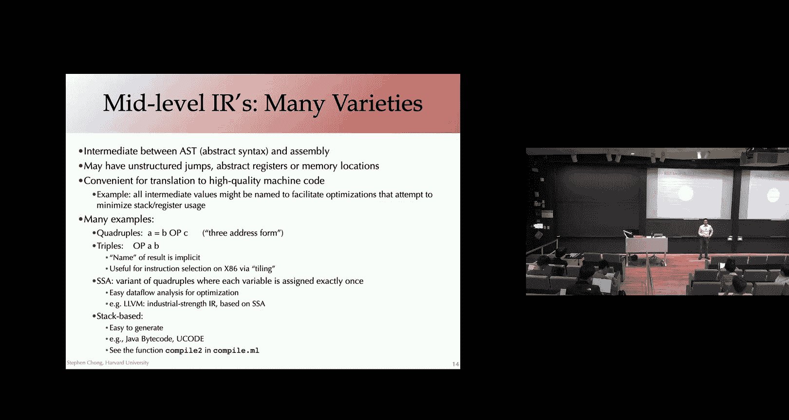

Because they have。The typically of the form。A， B Op C。

 so that has performed the operation on B and C。

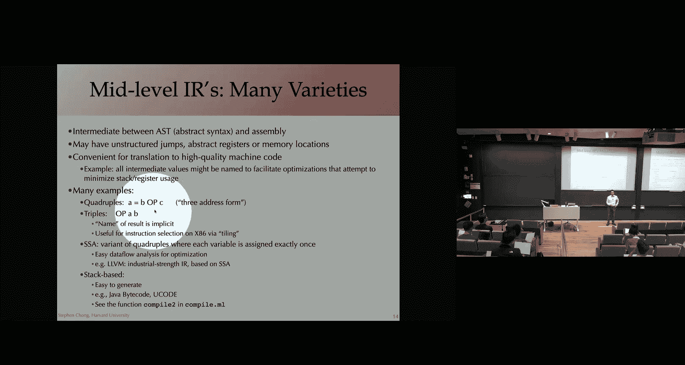

Which are， let's say， typically。Local variables。And put the result into a。对。嗯。Tris。Op A B， where。

The name of the result is implicit。嗯。It might be implicit because it's one of the opera ends。

 but more generally， it might be the result of the operation。 The name of it is op A B。

 right It is the instruction of A B。SSA is a variant of quadruples。

 SA stands for Sta S assignmentment。The idea is it kind of looks like the quadruples， except。

Any variable appears on the left hand side of the assignment exactly once。Right， so statically。

 when you look at the program， there's a single assignment to any variable。

It's called static because at runtime， dynamically， that assignment might be in the body of a loop。

 and so it might actually execute multiple times。 but at least with respect to looking at the program。

 there's only one place in the program and the intermediate representation where that variable is defined。

嗯。There's a number of nice advantages to SSA form。 It turns out that data flow analyses。

 something else we'll be digging into later in the course are a bit easier with the SSA form。

 We'll look at why when we look at those things。 I've already mentioned L of V M。

 which we're gonna be digging into for homework 3 and beyond。L O V M is an SSA form。theically。Sttic。

 single assignment。Another type of common representation is， sorry。

 common intermediate representation is a stack based I R。 the idea with this is that。

When you generate a result。Let's say you have a sub expression。 you push that onto the stack。

And then any operation you produce， let's say addition。

Is going to pop some number of elements off the stack。 say the top two elements。

Produce the result and push it back on top。So a stack based representation turns out to be pretty nice and easy to generate。

And it's possible to execute it pretty quickly。 It turns out that Java Bcodes or the Java virtual machine。

Uses a stack for its expression sub languagegu。Postscript is so postscript to precursor to P D Fs also is a stack based language pushes things on。

To use it。嗯。What we're actually going to do in the last 20 minutes is go back to the code and look at another way of compiling our expressions。

 We're actually going to use a stack based approach。

 a stack based intermediate representation to compile to see how that plays out。

But any questions at the moment before we jump back into looking at code。

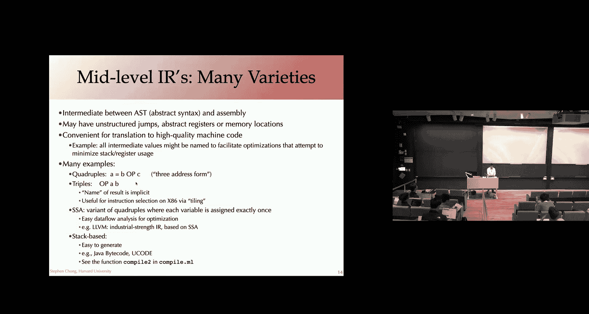

O。Second compation strategy。 So we're going to use a stack based intermediate representation。Soir。

In the same way that we use ocal data types to define our source language。

Use oam data types to define assembly programs。We're going to be using these Ocal types to define out intermediate representation。

 Okay， so we have a total of。5 different operations。Note that none of them。

That this is kind of a flat representation like X 86 code， right。

 We don't have any nested instructions here。 This is not a recursive data type。

We can push a literal value。64 bit constant onto the stack。

We can push the value of a variable onto a stack。So here you'll see we still have an notion of the variable。

 right， We're not at the level of deciding which registers and things these variables are going to be stored in。

And then we have these operations， multiply， add and the gate。

The idea in this stack based language is that when we execute a multiply instruction。

We're going pop the top two elements of the stack off。

 multiply them together and push the result back on。Okay。

 so what that means is that this multiply operation， it doesn't need to explicitly have operaran。

 toprans are the top two elements of the stack。Okay。嗯。So it's nice and straightforward。O。

Let's look out at our compilation。 We take a source language expression。

We're going to be producing X 86 code。But we're going to be getting there by using the intermediate representation。

Okay， so。First of all， we check our program to make sure it's using only well defined variables that's well formed。

Then what we're gonna do is call flatten on our source。

 So what this is doing is taking our source level expression。

And converting it into our intermediate representation。Okay， so what that means is。

This IR variable is going to be。A program in our intermediate representation which does the same thing as the source program。

We then， take that。Intermedia representation。And we're going to compile it down into X 86。Okay， and。

We're going to include our function prologue， function epilogue， same as we had previously。

 And the result of。Or compiling the IR down。We'll talk a little more about the compilation and why we need this instruction here in just a sec。

But first， let's look at compiling from our source expression into the I R。

 So that's the flatten expression。I will say。This is really straightforward， right？

This is a really simple function。 It taking our source expression。Producing。

A program in our intermediate representation， which is simply a list of these instructions。

To translate a variable， we convert to the。Push V instruction。

 P the value of the variable onto the stack。 Similarlyly， with a constant。

 push the constant onto the stack。Add multiply in the gate and nice and straightforward。

We kind of recursively compile the sub expressionpression。Flatteny 1。

This is going to produce a sequence of the instructions。 and the key idea。

Of the key invariant of this flatten function。Is Fledden E。

Is going to produce a sequence of instructions that computes the result of E。

And leaves to the result of E at the top of the stack。哎。

And that's all that's going to leave on the stack。哎。So here。

 Fl E1 will be a sequence of instructions。 that computes E1 and leaves that result at the top of the stack。

We then follow that with a sequence of instructions that is going to compute E2。

And leave that at the top of the stack。And then we simply call add。

Which is going to take those two things。 The result of V1， the result of V 2， add them together。

Push it onto the top of the stack。Right。And so this is maintaining the invariant。

We're producing a sequence of instructions that computes E1 plus E2。At the end。

 at the top of the stack is the result of that edition and nothing else。

And we're able to accomplish that by relying on the。

 that exact same invariant for the compilation of E1 and E2。😊，Multplication is the same。

 negation is also straightforward。 We compile the sub expressionpression E。

Fladeny is gonna have a sequence of instructions， the computes E and has the result of E at the top of the stack。

 And then we simply call the He the negate instruction。报什。So really easy way to。

To compile to the intermediate representation。Well。

 let's think about compiling that intermediate representation to assembly code。

It's actually also nice and straightforward。 We're gonna have compile instruction。

 which simply compiles a single intermediate representation。Into a sequence of assembly instructions。

Right， so this map is going to simply apply that。Compile instruction function to every。

Intermediate representation， instruction in our program。Cancatenate all those together into a list。

We'll see in just a second， but we are going to be using。The X 86 stack。

To essentially implement our intermediate representation stack。So what that means is when we finish。

When we finish executing the sequence of assembly instructions。

 the result of the expression is going to be at the top of the stack。哎。So as a result。

 we pop from the top of the stack to put the result into R X。R A X is the register that。

 according to the callon convention， we use to return the result of the function。

 and then on our function epilogue。 we're returning from this。 and thus。Returning。嗯。

Returning to the caller。So let's take a look at compile instruction。

Compiling push of a constant is straightforward。 We're simply pushing an immediate value。That is。

 we're putting it on the， we're pushing it on to the X 86 stack。Push V。

 we're actually going use the same variable locations。For our variables。

 So we get to reuse this compile var instruction。 And we're just pushing the result。

 the contents of that variable onto the stack。For multiplication addition。The intuition is that we。

For doing a multipier or an ad。The upper ends are the top two elements of the stack。

 So here we're going pop off the top element of the stack into R X。

 pop off the next element into R 10， then perform the operation on those things。

 put the result in R X。 and then to maintain the invariance， we push R X back onto the stack。Right。

The result of computing the expression is now at the top of the stack。Ngation。Similar。

 we pop the top of the stack into RA X， negate it and push the result back on。Okay。

 so we'll definitely go through and。嗯。Try evaluating it。嗯。嗯。Not update my Mac file。

So let's take a look at the result of our program of。Computing that x1 plus x 2 plus x 3 plus x 4。

 and so on。What we have here is a whole lot of pushes。Okay。

 so this is essentially pushing the value of x 1， pushing the value of x 2， x3， x4。

All the way up to X 8。 And then pushing the constant 42。And then， performing the ad instructions。

Okay， popping it up two elements off and adding it。

So different compilation strategy to the first one。Bitter or wh。I mean。

 in terms of the assembly generated， it looks very similar。So吧。We're still using Rx and RN。Okayly。

It very。Like you mentioned this method， the flattened function is easier to write。对。There we go。But。

 actually。I say the assembly is worse。 This code performance ways。 Let's sorry。

 there were two hands at the back yeah，They the sta。Yeah。

 so we're still using the same registers for the local variables。 But previously。

 when we wanted to say add a local variable， we were able to access the value in the local variable directly。

 which you know。Six of them were held in registers。With this representation。

Anytime you use a variable in order to maintain our stack andvari， we actually。

Put that value and push it on the stack。Even if we're sort of immediately doing something else。

 So here we see。You know， we're pushing the constant 42 on the stack， popping it straight into RA X。

Just before that， we pushed X 8。Onto the stack and popping it into R 10。嗯。

There are some other hands and comments about is this compation strategy better or worse than the first Austin。

 Yeah， I was going to see that It's certainly like simpler from a pilot perspective。

 which makes it better in some sense， but。Like this is going to be much slower where you're accessing memory every time you need to access。

A variable， even though you're cash。Because you're always。で stack。And also， you。Out of like。

 many functions that。Like calling each other。 And you have， like this long call stack。Okay。Great。

 so much more use to the call stack。M be bad， but you pointed out the。Worst assembly code。

 but maybe better on the easier to write a compiler。

 or at least parts of the compiler separating those two passes。Yeah。Now they're coming over there。

Representation。很是一点。Thats。Right。Let's say， with our。Your comment was that we can use as。

 we can have as many variables as our stack supports。

 And this is the idea that we're using the stack to be to be doing things。

 What's actually interesting is。And maybe as to William's point， in the old compilation strategy。

 we were also using the stack for nested sub expressionions so that as we got an intermediate result。

 we would push it on the stack。Both。The old comp strategy into this new one。

 we were limited in our source language to only 8 variables。

 And we used those eight local variables in。We just hard coded the locations that they were going to be in the registers and the registers are on the stack。

And both of them can deal with arbitrarily big expressions。

That is arbitrarily many sub expressionions。Through the use of the stack。

So we haven't tackled adding in richer source language features like。More local variables。Was。

 was that the thing you were pointing out that we can kind of have arbitrarily nested expressions or。

Did did I not understand。呃。How was was a towards group。Okay， yeah， we。

 we're still actually dealing with the same source language here。And。

I think we'd need to adapt both compilation strategies to deal with having more。

Variables at the source level。 just figuring out where to store them。Mainly， is the。Yeah， thanks。

I think we brought out some of the key ideas here that。You know， saying better or worse。

 at least typically involves thinking about a number of aspects or dimensions。 right。

 So one is the quality of the code that we're generating here。

Vus how easy it was to write the compiler。And I'll say that， in general。You're going to produce。

Will you have the potential to produce more efficient assembly。

By a kind of going straight to assembly。The one big hop。 Let's say the potential， because。

It might actually be hard to hold everything in your head and make sure the program is correct。

 But in general， the idea that you， instead of going through a sequence of abstractions。

You might be able to go from here to there and do some really。

 really cool assembly tricks that capture a whole lot of things at the high level。😊。

And this is along the lines of， you know。Hundred and assembly。

Has the potential to run faster than compiler generated assembly。 It's really hard to write。

 It's really hard to write correctly。But if you have a human thinking about the assembly that you're going to use to accomplish something。

 you're often able to do better than a compiler。Doesn't necessarily mean everyone should go out and start handwriting assembly for all their programs。

 right， because there are trade off and benefits。 You might take a hit on some of the performance。

 but you might end up with a compiler base that is。Easier to extend， easier to maintain。

 easier to add new language features and such as more source light， you know。Unlimited。

 now with unlimited local variables， for example。So part of what we're going to be doing in this class is actually seeing a whole lot of abstractions。

 And I think it's always going to be useful for you to think about。

 well why is this a good abstraction。What is it enabling？What does it let me do more easily？

What are the things that are actually harder。And I think this is。

 and we're gonna dig into L VM next class。 and it is。Industrial strengths compiler。 It's a。

If you will， a modern compiler representation， was developed。Late 90s。

 early 200s as a master's project。That then went on to become a real industrially used compiler。

 and it was essentially incorporating a whole lot of ideas from compiler construction that had been developed in the two or three decades since the previous main compiler。

 GCC， the canoei compiler was developed and has a very different intermediate representations。

 many of which are better for doing certain operations， but some things are harder as well。Okay。

 thanks very much， everyone。 good luck with as you continued work on homework 2。

 Good luck with those study groups， and I will see you on Wednesday。😊，絶対。在に在。

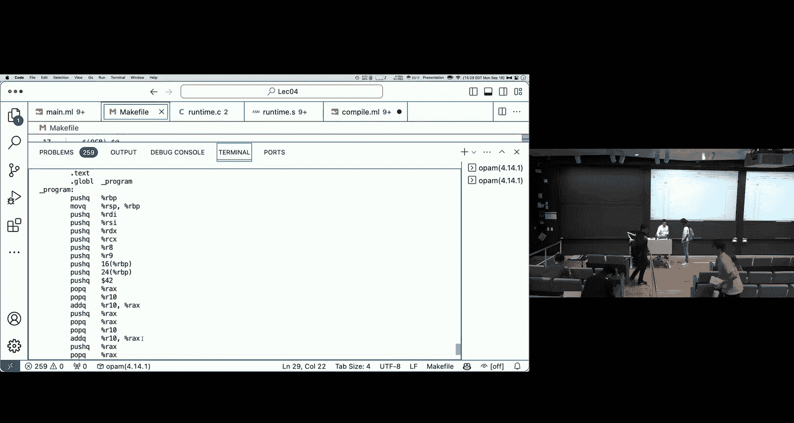

疫mail是。我全意てにやてやる。系 you好有上。あしも。そ。玩。そですか。to。レ十三。けをとして。I need you问。

It maybe with us coming from find I familiar with。第解机还的啲。最後。Liture one。

Po consumer tuneative AI can be really helpful for you if it's along line as well。

Here's what I want to do， how do I do something those。And just be careful that you can。

My advice is use it。Uses a separate window that doesn't have the context of the whole homework for you're just asking read。

Specific directive questions not say syntax will be useful library。

Ask her to explain a conceptt I think that might actually be a really。

Somebody to something to talk with。And help you for level。Have a lot of office hours。

 than mostly during business hours but。Since taking advantage。I was also wondering。

 would it be possible to post some sort of like on circuit for Home one。

 just like it's K orcal style？ますかね。嗯。The kind of code that's in there and the infrastructure there。

Style。So there's actually quite a bit of code's actually。So take a look at stafolding。

I don't think we were planning on releasing。There two else with a lot of time a lot of the very short church things。

Yeah， I'll check what we're talking about。You might be relationship。last couple。

 but you actually in the scan forming both got quite a bit of。Thanks so， Yeah you work。

Any me sick to take this afternoon。When meeting your office， why don't we woke up to my office？

Do anything okay。さなくてい。这是。Two things on my back。あちさのが。filling in the survey。

 but I don't think I got that email with a study group。case。

Should I just take two minutes successfully？设备？Let me get up to my office video。そそさん。十6次。

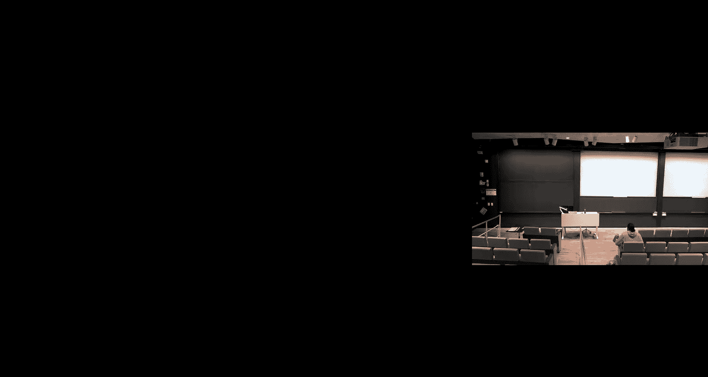