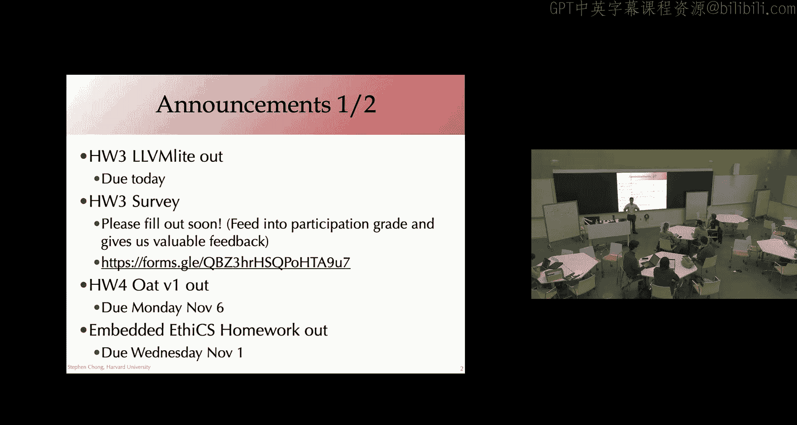
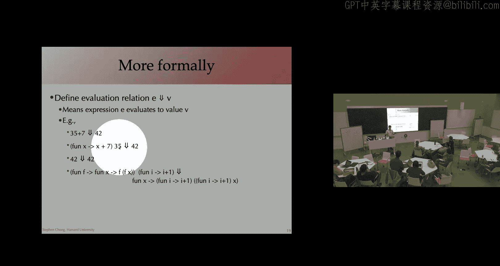
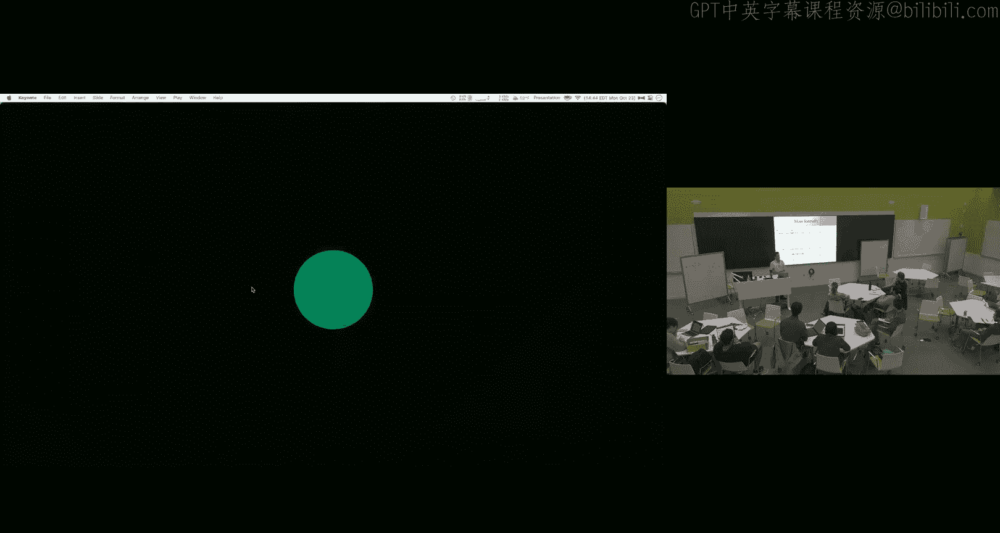
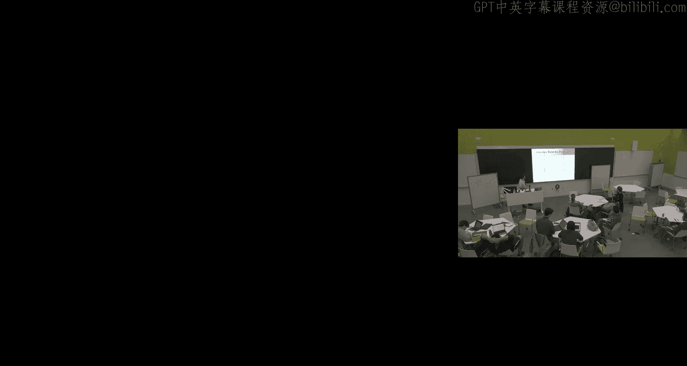
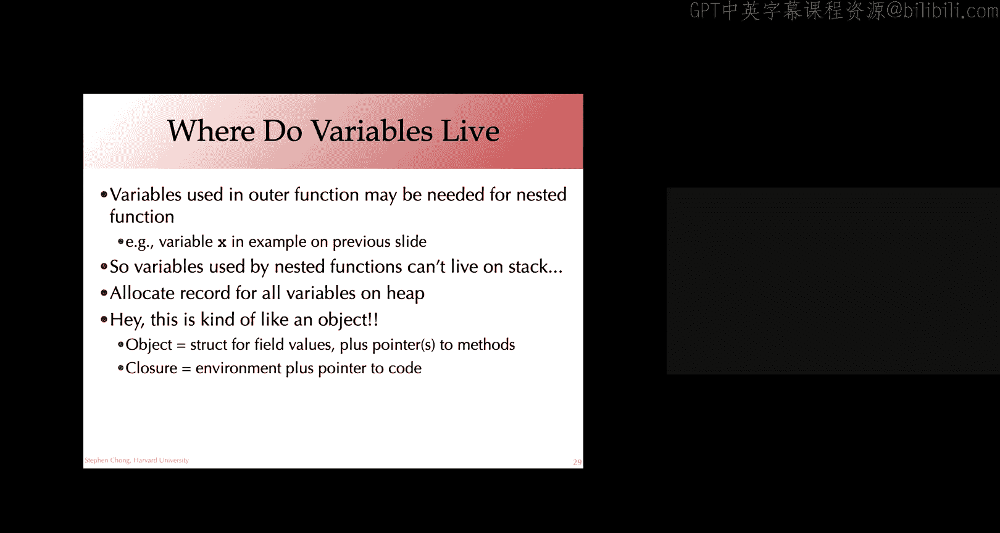
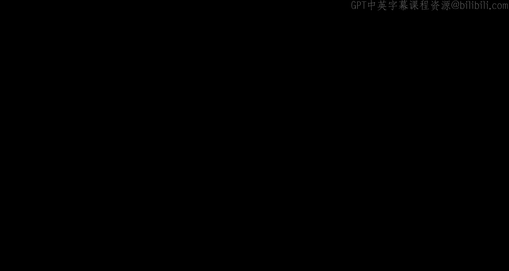

# 哈佛大学《编译器｜Harvard COMPSCI 153 compilers 2023》中英字幕（claude-3.7-s p14 1698070500-Compliers_on_10_23_2023_(Mon).zh_en -BV14PAUejE98_p14-

我要再。い个で。To the story。What's time is it。I slide。I just for like so we the video check that the actual address you reading you're writing writing。

But those are。Do that believe here is body， distort it and a brain。 the step through。

 like you see it writing it there as well， they don't the right or type the offer。And see time the。

 Yeah， sorry， it's wasnt touch。They should get started。な。Yeah， yeah。

Sucsively more complex test cases to get you there， I think is the。Let talk。Alright， welcome。

 everyone。 Hope you all had a good weekend。😊，嗯。Announcements， so homeworkook three due today。

 of course， up to three days worth of late minutes。But the nominal due date is the end of today。

 I emailed this morning the homework 3 survey so please take a look that filled that in while homework 3 is still fresh。

 this is valuable feedback for us both about how the homework went。

 its level of difficulty but also with this experiment about study groups that we're trying this semester so really appreciate hearing from you about how the study groups are going that is helpful for us as we think about patient and how you contribute to the learning of others and who contributed to your learning as well as just having an idea about how it's going your thoughts on how we could improve the study group process if there's any。

 for example guidance we could give at the beginning when we match up study groups so what's been effective for you in or not effective for you and that might help us if not in the rest of the semester then next time we try this。

Homework4 is out， as you know， and you in two weeks on Monday， November the 6。

And we also have the embedded ethics homework out the embedded ethics homework is relatively brief。

 it's just a 250 word 300 word response to a prompt in the sale of a blog post。

 It's due on Wednesday， November the 1s for simplicity we're just saying no late minutes for that but I appreciate that you've all got a lot going on some more than others midterms just。

World events as well are impacting a number of us on campus。

 Please feel free to reach out if there's anything we can do。To support you。

 if there's anything impacting you in this class， there's specific things such as the November 1s deadline for embeddedded ethics or any of anything else that's going on。

 please reach out， happy to chat。Any questions on kind of the large number of assessments that are out there at the moment。

Okay。Well， because you're looking a little too relaxed and comfortable。

 I thought that I would mention the final exam。Which is gonna to be coming up。 We have a date Friday。

 December 15 in the afternoon。 thankfully， just to give you a little bit of information about it。

 it's gonna be multiple choice。 maybe some short answer questions in there。 Open book。

 open laptop So please don't print out huge amounts of paper you are able to use the laptop。

 You can even do things like compile programs on your laptop and we'll be designing the exam。

 So that shouldn't hopefully that is not actually a massive advantage or anything in there。😊。

The fact that it multiple choice I'd suggest wouldn't actually change the way you I suggest that you study for this。

 this isn't like you know the SATs or anything。 really the way to study for it is to just be familiar with the course material。

 Def the material covered in lectures be familiar with the concepts from the homework you don't need to be able to be intimately familiar。

 be able to recall at a moments notice the exact structure of code and things that you wrote in the homework。

It's really the high level ideas and the algorithms so testing your understanding of this。

 perhaps seeing an instance of the ideas of the algorithms applied to a particular setting or taking the concept on employing them in a slightly novel setting。

 something like that。Any questions about？你am。Okay。Okay。So at the end of last week。

 we finished up talking about。paing。So we're starting something new today for the next couple of lectures。

 which is really talking about compiling functions。

And so this is going to take us towards being able to implement a functional programming。

 So where a language where functions are treated as first class values。To get there， though。😊。

We're going to first of all， talk a bit about。How to think about the semantics of functional programming。

Of a functional language。For students who have taken 1，52。The programming languages class。

 this will all be， I think， quite familiar。For those who have taken 51。

 did everyone implement a sort of mini M interpreter， Was that like a required part of 51。

 Did you use environment semantics or substitution semantics。Both。Okay， did everyone do both。Okay。

Hands up if you have taken 51。Almost everybody， but not everybody。 Okay。

 so for a lot of people in the class， as we kind of go over the idea of the semantics of a programming language。

 it'll be a review。 But I want to make sure that they're kind of at the top of your mind to refresh it for those who took it new information for me in the class。

 I appreciate。 And once we've got that clear， then we'll kind of see how to take those concepts and translate them into compilation。

 So beyond interpretation。😊，Okay。So as you all know， from your use and Ocal， from 51 and other ways。

 in a functional programming language functions of first class values。

 So that is you can pass them as arguments to other functions， you can return them as values。

And as you construct them， what's interesting is that these functions nest。So， here we have。

A partial application of a function， add。Sorry， here we have a function ad， which is actually。

 you can think of it as taking two arguments， but really， it's cur。

 We have a function that takes a single argument， X， and it returns a function。From y to Y plus X。

 So here we have this inner function， the function with the argument Y。

 And in the body of that function， it is actually referring to variables that are bound in the out of function。

 right， bound by fun X。And so we can see that with increment and decrement。

 we can actually partially apply that ad function。 So the result of add one。

Is actually going to be a function。Equivalent to。A function that takes an argument yn returns y plus1。

And that's in essence， because this x here is bound to the value 1。Similarly。

 for the decrement function， that third line， we're partially applying add and we get back a function that takes an argument y and returns y plus negative  one。

嗯。So， of course， when we have these functions as values， we， it leads us to higher order programming。

 right， We can think about， for example， this function compose that takes in。诶。

A first argument is a function。 second argument is a function。Third argument is， well。

 whatever it is。 And then the result of this is applying G to X and then F to the result。

 So composing the functions F and G。So then you can imagine partially applying this。

 composing increment and decrement。Which will be equivalent to the identity function。Forensages。

Although in actual implementation， this is equivalent to。

A function that takes an argument x and returns x minus1 plus 1。

So this should all be pretty comfortable and familiar from our functional programming experience。

But one of the questions is， how do we actually implement this， right。

 How do we take these notions of functions as values and make sure that， for example。

 function composition and partial application make sense。

We're going to first look at this in an interpreter and then use that insight to。

To think about compilation。Okay。So making sense of nested functions。First of all。

 we're going to look at simple semantics， substitution semantics。 In fact。

 build up to the correct substitution semantics and then。Go from there to environment semantics。

And then in in next class。Compilation。Who's familiar with the Lambda calculus？Okay， was。

 was it mentioned in 51。Kind of right。 The lambda calculus is。Essentially。

 really minimal functional programming language。 it's。In Lambda calculus notation。

 a function Fun X to E would be written in this notation。 Lambda X E。 So Lambda is kind of saying。

This is a function。 The function doesn't necessarily have a name。 The argument is x。

 The body of the function is E。嗯。The Lambda calculus has variables， X， Y， Z。

 it has functions which are defined using this Lambda notation like Lambda X E is a function。

 and it has function application。 given a function， you can apply it to an argument。

And that is the entirety of the lambmbda calculus。Okay， that's it， just those three syntactic forms。

Variables， function definitions， function applications。 So despite its simplicity。

The Lada calculus is actually tuing complete。 So anything you can express for your computation。

 you can express in a Lada calculus program。😊，And in the same way that a tuuring machine also tuuring complete is kind of the basis for how we implement computers。

The Lada calculus is the basis for。Functional programming languages。So in some ways。

 the Lambda calculus is a more programming friendly foundation for computation than the tuuring machines are。

Okay， I'm going be using this Lada calculus。 But to make things a little more concrete。

 we will add integers and addition into the language。So to see this in。

An abstract syntax are in no camel。 Our expressions， they're going to have five forms， variables。

Functions that contain the bound variable and the body of the function。Application。 and then。

 as I mentioned， integers and addition。嗯。If we were writing a grammar for it。

 we might express it like this。Verbal names X， anonymous function， definitions， function application。

 integers addition， and because it's concrete syntax and we need to be able to express nesting in the concrete syntax。

 we might have parentheses。But of course， by the time we get to an abstract and tax tree。

 we don't need those parentheses explicitly to indicate the structure。Okay， any questions。

At a high level about sort of the syntax of this language， where we're going。Yeah。

 So when you say turn complete。 and if you didn't have。Introgerries in addition。

 What would that actually Oh， you should take 152。 Very fun stuff。

 turns out you can actually encode natural numbers in using functions。 And so in the same way that。

 you know， we might encode integers using bits in a tuuring machine。

 We can encode natural numbers using functions。 once you've got natural numbers and like addition and subtraction and testing for0 of natural numbers。

 you can imagine encoding integers and operations over integers and many， many other things。

 So that's kind of how。😊，Lambda calculus， beautifully simple。

 ends up being a foundation that you can build， express any computable。Computable。Computation。咁。

Thanks。But yeah，152 goes into。Much more detail about it。Thanks。

 any other questions before we dig into semantics。Okay。So， let's think about。

Writing an interpreter for our language。 Okay， we're going write a function a vow to evaluate an expression。

 E， it's going to be a recursive function because we're going to evaluate sub expressions。

 get the result and use the result of sub expressionions to figure out the evaluation of the expression。

嗯。Let's go through and just look at some of these。 So to evaluate an integer， I。

 there's actually no interesting computation to do， right。

 So the result of evaluating an integer is simply the integer。For addition， if I have E1 plus E2。

 the idea is that we evaluate the two sub expressionions。 So here's a recursive call of R E1 of R E2。

嗯。We're expecting this to give us back each of these sub expressionions to give us back an integer。

 Okay， so we're writing this as matching the result of evaluating E1 and E2 with int I and J。

 if they are integers， we add them together a plus J and that's the result of of the computation for brevity here。

 I'm not writing particularly good code and obviously I'm not having all the cases here would get a compiler error and Ocal and for the other cases where E1 and E2 doesn't evaluate to an int。

 we should， of course do something reasonable like throw an appropriate exception。嗯。For functions。

 function declarations， functions are values。 So when we have a function definition， Lambda X， E。

Just like integers， there's actually no computation to do。

RightThat is already a value so we can simply return lambda X E。The semantics we're going to give。

 it turns out that if our original program doesn't have any what are called unbound variables or free variables。

 then as we evaluate it， it won't either。 So that explains the line Var X。

 If we encounter a bare variable， an unbound variable during evaluation， that's going to be an error。

And the reason why is that when we have application。When we apply E1 to E2。

What we're going to see is that we're going to substitute away。

A variable in the function definition for the actual argument。So let's talk our way through this。

 evaluateval an application。 E1 applied to E 2。 So just like with addition。

 we evaluate the sub expressionions， E 1， evaluateval 2。What we expect is that E1。

 the left upper end of application， is going to be eventually evaluate to a function definition。

 Lambda X， E。X is the formal argument， E is the body of the function。E2。

The right opera end of application iss going to evaluate to evaluate maybe an integer。

 maybe another function。Some value。Now， what we're going to do to evaluate Lada X E applied to V。

We are going to。Take the body of the function， E。E might contain uses of the formal argument X。

What we're going to do is substitute the uses of x for the actual argument V。

And that's what this expression is here。 Subs V， X， E。

 I'll show you the definition for the substitution function。

 But the key idea is it's going take the value V。Replace the curs of the program variable X in the body of the function E。

That's going to give us an expression。 The body that function with x replaced by V。 and then。

We evaluate that function body。Okay， so a vow of the substitution。Okay。

I'm going to look at the substitution in just a moment。 But do we have any questions。

About the semantics， about this idea of how we evaluate function application。Yeah。

 William we have to e E2 to be or can we just Oh， you really need to take 152 152 is presents different evaluation orders and presents some theorems about the equivalentvalence or non equivalence of them in Ocal。

 as we know the argument to a function is evaluated all the way down to a value before the function application occurs。

 There are alternate approaches where you don't evaluate the function argument immediately。

 We're not going to go into that in this class， but it's fun and interesting to look at。😊，Thanks。

Any other questions？Okay， so let's take a quick look at this substitution function。

It's a recursive function。 the arguments， as we mentioned as V。

 the value that we're going to replace the variable x with in the expression E。

And so we just go through and we have the different cases for an integer， nothing to do for addition。

 Very simple。 Just rehecursse on the sub expressions。A variable is a little interesting。

If the variable is the variable that we're trying to replace， that is y equals x。

 then we replace it with V， otherwise we leave it unchanged。😊，That is returned by way。

Let me jump down here to application， application E1 apply to E2。 Again。

 we just recursed on the sub expressionions E1 substitute within E1， substitute within E2。

A function definition is a little more complicated。 And to be honest with you， I'm gonna simplify。

 this is simplified。 We're gonna to assume that any time you have a function definition。

 the argument name is unique within the program。 that simplify substitution a bit， again， take 1，52。

 if you want more details to remove that simplification。 But the basic idea is if。

The variable here that is。🤢，The formal argument of the function Y， if that's the same as x。

 maybe because we have some kind of recursive function。 So we're seeing the function body inside。

The function definition inside， the function body， then we don't do anything。 right。

 We just return lambda Y E prime。The value that we're。

The expression that we're considering the moment。 But if they're different。

 then we recurse into the function body。So we perform substitution inside the function body E prime。

And return lambmbda away。Lambda Y of that substituted function body。嗯。This is a subtlety here。

I appreciate that。This will really make sense if you really only if you sit down and try stepping through the substitution function and see why we need this conditional here。

keyey point is。😊，The substitution is relatively straightforward。

 You just recursse through the expression， replacing occurrences of the variable X with the value of V。

We can write a mathematically， this is the notation used。😊，These curly braces。

 this is the expression E， but we were replaced。Occurrences。

 free occurrences of the variable x with a value v。

And this definition here is exactly the same as we expressed in the code。Okay。

 let me make this a little more concrete by siping through an example。

So here we have our audit function， fun X。To fund y to x plus y。Right。Apped to 3。

And then the result applied to4。So if we're representing this in our AST at the utermost level。

 it's an application。Where we have an expression as the left upper end。

 the right upper end is the integer 4。This left upper end is itself an application。Of。

This expression to the integer 3。And this is a lambda term， Lambda X， Fun X。

 and the body is lambda Y。Plus X Y。 Okay， so a pretty direct translation of that syntax into the A T。

So let's think about evaluating。This。Expression。So I'm not expecting you to remember thebatim。

 the evaluation function， but hopefully the high level intuition。Remains in your head。

 So to evaluate that application， we're going to evaluate the two sub expressionions。 Okay。

 so we're going to evaluate the left hand side。This subexpression。

And we're going to evaluate the right hand side of the application。And4。

To evaluate that left hand side， that is itself an application。So again。

 we're going to be recursively evaluating both the left upper end and the right upper end。 Okay。

 so evaluating the lambda term and evaluating the argument in three。All right。Well。

 to evaluate this function definition。A function definition， a lambda term， is a value。

So there's actually。Nothing that we need to do to evaluate it。Same with in 3， evaluating in 3。

 It's already。 It evaluates to in 3。 So this is the result。Of evaluating the left and the right。嗯。

EExpressions。If you remember， what we then do is perform substitution。Okay。

 so what we're going to do is take the body of the function， Lada y plus x Y。

And replace the occurrences of x with the argument。3。嗯。Right。

 so that's the substitution that we're going to do。嗯。And so that gets us。

The body of the function lambda Y plus v x way， we replace v x with the integer 3。

 that gives us this expression here。That's the result of substitution。And we wanted to evaluate that。

Right， evaluateval the function body。Where x was replaced with the argument  three。

Evaluating the lambda term。This is a function definition that's already a value。

So no interest in computation happens， the result of a vow is simply that term。Fantastic。

So now we've evaluated the left hand side of this application。This top level application。

 and we have a lambda term。Evaluating the right hand side in four。

What that just evaluates to n4 It's already a value。So now we're ready to do the same thing。

 We're ready to take。The body of the function substitute occurrences of Y with the argument  for and。

And then evaluate the result of that substitution。Okay， so substituting。

Substitute the variable Y with the value with the argument in4 in the function body that gives us plus in3 and 4。

 We want to evaluate that。That， of course， evaluates to the integer 7。

And that is the result of the entire computation。And intuitively， hopefully that makes sense。Right。

But we stepped through in painful detail。 And in particular， we saw this substitution。

Of function arguments， function formal arguments with the actual argument。

Any questions about the stepping through。I want us to be fairly comfortable with it。

Because I'm about to introduce some new notation。That's， again。

 going to be intimately familiar to people who' have taken 152， but might be。

Somewhat new to people who took 51。So this idea of evaluation。

 we can think about it as being a mathematical relation。A relation that over two things。

 over expressions and over values。And we write it as E down arrow V to mean that the expression E evaluates to the value V。

Right， so， for example， the expression 35 plus 7 evaluates 42。The expression。Function X， x plus 7。

 all applied to the integer 35。 that also evaluates to 42。诶。I'm sorry， what happened there？嗯。Okay。

42 evaluates to 42。More complex functions。Same idea。Works， right。

 We can talk about how an expression can evaluate down to a value。So this is。

We can think about this relation， telling us how expressions evaluate to values。

But we can actually define this。This relation， this evaluation relation。Precisely and concisely。

 using what are known as inference rules。嗯。Now I want to make sure we're comfortable with inference rules because we're going to be seeing it again later on in the course as we look at type systems and you will be implementing a type system in homework 5。

 so youll get very comfortable and familiar with reading and understanding inference rules。

 but so let's see。

So bear that in mind as we see this introduction。Okay。

So we've got this idea of an evaluation relation。An expression E evaluates to V。

We're going to define it using inference rules。And it turns out that。

These four inference rules that we have here completely define the evaluation relation。

So let me talk through what I mean by an inference rule。 We have four inference rules here。

 this horizontal line with something underneath it。

 And some of them have things above the horizontal line。

The things above the horizontal line are called premises。And so here in this inference row。

 we have three premises。One， two， three。The thing below the line is called a conclusion。 Now。

 The thing below the line is。Is in， if you will， an instance of the evaluation relation。

 it's saying this expression evaluates to this value。The intuition is that if the premises。

Of one of these inference rules are true。Then the conclusion is true。Okay。

 so we often read these inference rules from top to bottom。

 We say if the things above the line are true， then the conclusion。The thing below the line is true。

An axiom is an inference rule that has no premises。Okay。嗯。So let's go through these rules。

 What this one is saying is that the integer I， the expression I evaluates to the integer I。

So this is very compact。We're using I to range over integers。

 And I'll talk about what we mean by ranging over in just a moment。 But intuitive believe us say。

 an integer I evaluates to I。This rule says。If E1 evaluates to nteger i1。And E2 evaluates to an I2。

And if we add I1 and I2 together to give us the integer I。Then。The expression E1+ E2 evaluates to I。

Okay， so this is the reading from top to bottom。If the premises are true。

 then the conclusion is true。Something。Interesting and important to note with this inference rule。呃。

There's a plus symbol that occurs both in the conclusion。End up here in one of the premises。

They look really similar when I write them up on the slide， but they're actually quite different。

The one of the conclusion is actually part of the abstract syntaxt tree。

 It's saying if I have an expression， E1 plus E2。Whereas the one in the premise。

Up here is actually mathematical edition。 It's saying， hey。

 you've given me an integer I 1 and an integer I2。 And I'm going to add them together using mathematical edition to give me another integer。

Okay。So this is actually two different uses of the same symbol。 One is mathematics。

 One is the abstract syntax tree。 And this is because， of course， in our concrete syntax。

 in our abstract syntax for our programming language。

 we use that plus symbol because we mean it to denote mathematical edition。

 That's kind of why we're seeing the same symbol appearing again。Okay， the other two rules。

 if I have a function， fun X， R O E。Then that's already a value as we talked about。

 so it evaluates to F X ROE。And this rule。Handles application。

 If E1 evaluates to a function definition， E2 evaluates to evaluate value V。

 And when we perform substitution。That is taking the function body E。

 replacing the free occurrences of the program variable X with the actual argument V。

 and we evaluate that。 We get W within that entire application E1 applied to E2 evaluates to W。

Any questions at the moment about these inference rules？And you note that there's。

A correspondrespondence between these inference rules and the implementation that we had for Eal。

Right，And that's not a coincidence。 This mathematical notation flyinglaying it out。

Actually gives rise pretty easily to an interpreter。For this language。Okay。The next concept， I think。

 is actually one of the most subtle and hardest in when we think about inference rules。

 People who have taken 1，52 can tell me they， whether they agree。Yeah idea。

 when we have one of these inference rules。Robetor instantiate it by replacing the meta variables。

 So these I's， these E's， V's and W's and so on。Replacing those meta variables with actual expressions。

And actual program variable is an actual integerence。Right as appropriate。

 So replacing meta variableable I with an integer， replacing meta variablesables。

 that begin with E with expressions， replacing meta variabless， V and W with values and so on。😊。

The idea of instantiating these inference rules with specific expressions， variables。

 values and so on。Is so that we can build up what are called proof trees。

 that is we can combine the instantiated rules into proof trees。And。呃。

For a particular expression E and a particular value V。E evaluate， E evaluates to V， F and only if。

We can build a finite proof tree。By correctly instantiating the inference rules。And。

And each premise of an instantiated rule is itself the conclusion of a proof tree all the way。

 and the leaves of this tree are axioms， that is inference rules with no premises。

So let me give you an example of that。This is a proof。

This proof tree here is a proof that the expression。Fun X。Arrow X plus 35 applied to4 plus 3。

 that that expression evaluates to 42。So let's go through and take a look at this proof tree and make sure we understand how the inference rules。

Those four different inference ruless at the top are instantiated。

To help us construct this proof tree。Okay。So at the bottom here。This expression is an application。

Right， it applies fun x x plus 35 to the expression 4 plus 3， and it evaluates to 42。

And so there's actually only one inference rule whose conclusion is an application is that it's this one here。

So we can instantiate this inference rule by replacing E1 with。Fun X，arrow X plus 35。

Replacing E2 with4 plus 3。And replacing W with 42。And if we do that， if we take this inference rule。

 we' replace E1E2 and W as appropriately like that。

What we'll see is that we have three premises where the first premise。呃。

The left hand side of this evaluation operation is E1。 And he， look down here it is Fun X X plus 35。

Was E1。The left upper end of the application。We have another premise where the left hand side of the evaluation is E2。

That is 4 plus3。Look， that's this premise iniateated here。4 plus 3。嗯。

And then in this premise E1 evaluated to fun x， arrow E， E2 evaluated to V。

 we have another premise where the substitution of E with replacing V with x evaluates to W。

 the result of the whole thing。And that turns out to be the case here as well。

 But let's walk our way through it。So here we have the first premise， Fun X arrow x plus 35。

That was one of the premises。Of the roots of the tree。

The left hand side of this evaluation is a function definition。

 and there is one inference rule where the left hand side of the evaluation is a function definition。

 This one here。So we can instantiate this inference rule。Replace X and D with。

Here the specific program variable x and the expression E with x plus 35。

And if we instantiate that rules like that， then the right hand side of the evaluation is also。

The same function。And so we see that here， the right hand side of this evaluation， fund X。

arrow X plus 35。So right here is an instantiation of that inference rule for function definitions。

It's an exxiom， there are no premises。So there's nothing that we left to prove in this part of the tree。

Right， in a similar way。The second premise four plus three。That's in addition。

 there was only one inference rule whose left hand side of the evaluation relation was in addition。

This rule up here so we can instantchiate it with E1 being replaced by4， E2 being replaced by3。

 that gives us these three premises。诶。E1 evaluates to。Four。

 using an instantiation of the integer axiom。Three evaluates to three using that same inference rule。

 but replacing IA with three instead of four。嗯。I guess for completeness I should have actually written in that 7 equals 3 plus four as another premise。

 but3 plus four is indeed 7 and that's what。The expression 4 plus 3 evaluates 2。All right。

 that gave us。Let's see the function body。X plus 35。 It gave us the actual argument Y。

 when we replace x with。I'm sorry， give us the actual argument7。

 we we replace x plus7 in the function body， we get the expression 7 plus 35。

 that's the substitution and evaluating 7 plus 35， we again have a finite proof tree。

This shows us the result is 42。Hlejandra， we're writing our approved trees。

 do we do declare I equals I plus？Yes。In 152， we actually talk about this in quite a bit of detail。

I'd say normally conclusions and premises of an inference rule have the same form。

So they should be about the evaluation relation。And so this requirement that I equals I 1 plus I 2。

 This is what it's really doing is restricting how you're able to instantiate that inference rule。

 You can only replace I 1， I 2 and I with integers。

Such that the integer I is equal to the equal to a1 plus A2。

 Often we would actually write that on the side of the inference rule。 And indeed。

 it's known as a side condition because it's further restricting how you're allowed to instantiate the inference rule。

 I got a little sloppy and loose when I was type setting these slides。 And I wrote it as a premise。

And I'm sorry for the confusion where。It's a different kind of premise， right。

 It isn't a premise about the evaluation relation。 It's actually a premise about mathematical edition。

And really， it's just restricting how we can replace those meta variables。

 which is why often when you write a proof tree， you don't actually explicitly show。

How are you're satisfying those side conditions。Dis restrictstricting whether or audit it's an appropriate instantiation of the inference rule。

Does that help？ Yeah Okay， thanks for the question。 and apologies for the。Fossom loose hand weight。

 Yeah， William， how important is the word finite， Can you make false citizens with these correct trees that are。

Finite is very important here。Again， going beyond this， of course and even going beyond 1，52。

 But you can make sense of infinite proof trees。But the mathematics that underlies that is what's known as coinuction。

Versus induction。So I'm going to leave it of that。 You can make sense of infinite proof trees。

 but the mathematics gets a little complicated and interesting。

 and we're definitely not going to do it here。😊，Here， it's important that the proof trees are finite。

Go。Thanks， any other questions at the moment。Like I say。

 I think this idea of these inference rules and instantiating them。

 replacing these meta variables with actual expressions and。Expressions and variables and integers。

 and using those instants to build up a tree， that's actually really subtle。Right。

 it's this kind of mechanical， syn tactic thing。 But the ideas behind it。

 the idea that you can have this small finite set of inference rules。That allow you to build up。

An unbounded number of finite proof trees。And those proof trees are essentially showing you how to evaluate a program。

RightThere are one to one correspondence between these inference rules and lines in that evaluation Ocal code that we wrote that recursive function。

 it's not a coincidence and in some ways these inference rules can be thought of in various ways you can build up proof trees when you're actually implementing an interpreter what you're really doing is discovering。

Or constructing an appropriate proof tree to show that this expression evaluates to this value。

And the interpreter code we saw is actually really navigating its way through this proof tree and a kind of depth first search。

 First of all， we evaluate the left upper end of application。

 Then the right upper end of application， and then perform the substitution and evaluate the function body。

 And essentially that Ocaml function we wrote that interpreter is really constructing or exploring。😊。

This proof tree。We're proof to analogous to this。So it's a subtle concept and a really powerful one。

Okay。Any questions so far？So having told you about substitution semantics。It's not that great。Okay。

 it's a really nice way to think about how programs execute。

 But if we actually wanted to implement an efficient interpreter。😊，Letttle alone compiler using it。

It's not wonderful。What do people think some of the issues are way if you were sitting down to write an interpreter for。

An oldcal like language， functional programming language。

 Would you not go with the substitution semantics。Bden maybe speed。Like your'。

You can waste a lot of time in a place to do everything。Freshly than placing him。Right， so speed。

 in what sense， what are the expensive things to do？So you're right， you're right， by the way。Yeah。

 you're right。 So our evaluation， right， that's kind of crawling over the structure of the expression。

 But when we got up to a function application， we did substitution。😊。

And what substitution does is also crawl over that expression， replacing variables with the values。

So， yeah， it's not efficient at all。 right。 So a V of sub V， X， E subs。You know。

If the expression E is really big， really deep， we're going to be crawling all the way over E。😊。

Return some possibly new value as a result of substitution and then do the exact same thing。

 crawl over it again to evaluate。So if you were sitting and thinking， you know what。

 how could I make this interpreter run faster， You might say， well。

 why am I doing these two traversals of the expression of the A S T。

 Why don't I combine them together， Why don't we do substitution at the same time。

They were doing evaluation。Visit that expression tree once。So。

That is what an environment semantic says。 The idea is that we're going to modify the aval function to take an environment a mapping from variables to values。

 And as we traverse that tree， traverse the A S T。😊，When we encounter a variable。

It won't have been substituted away， because this is the first time we're visiting it。Instead。

 what we're going to do is use that environment to look up the value that we were going to have used to substitute。

Okay， so let's take a look at how we would do that。We're going to， we were a little lazy before。

 and we didn't explicitly declare a type for values。 But now we're gonna have a type for values。

 integers。And our environment now is going to be a map。

 an associative list from variable names to values。

And our valve function is going to take our expression E that we're evaluating and an environment。😊。

And the idea is that when we're evaluating E， when we encounter a variable X。

 all we do is look up X in the environment。 And that's the value that we're going to return。

 You might recall that previous previously in our substitution based of our semantics。

 This was an error。 The idea being that we would never see a variable by itself。

 with environment semantics， we're not substituting the variable away。

 So we might encounter a variable， but luckily， we have an environment round to tell us the value it should be mapped to。

Integer expressions evaluate directly to integer values， Lambdas hold your breath for the moment。

 but here it is evaluating to a lambda term application okay we evaluate E1 and E2 in the environment that's going to give us back a function and a value。

😊，And now we want to evaluate。The function body E prime。Where the variable x is bound to V。Plus。

 the rest of the environment。Okay， the environment that we had。Turns out that this isn't great。

 This is actually wrong。This doesn't actually quite capture the semantics that we want。

 our intuitive semantics for。For functions。 And what goes wrong is that。

The semantics as have written it up on the。Slide doesn't handle nested functions correctly。

So let's walk through an example。 Here we have our addition function， Fun X，arrow fun way。

 arrow Y plus X applied to one。So the problem is that when we evaluate this， it evaluates。2。

Fund Y arrow Y plus X， right， The binding from x to one。Gets lost。Okay。

 and that's because this aval of E prime， the function body， Fun Y， Y plus X。 Yes。

 X gets mapped to one。But when we evaluate the function definition。

 we're just returning that function definition。E contained。

Fund Y arrow Y plus X evaluates the fun Y arrow Y plus X， even though。

The function body contained variables that were defined in the environment， namely X bound to one。

So we didn't have the binding X goes to one around when we needed it， right。

 when we actually end up taking the result of this and applying it to another argument。And really。

 what was going wrong is that when we evaluated a function definition。Lambda X， E。

Which when in this case， was function y y plus x。The body of the function， E。

Might be referring to variables， might be using variables that are defined in the environment。

So what we actually want to do is。Instead of evaluating to Lada X， E。We're actually going to。

Evaluate to a value that includes the environment。Lambda Xie plus the environment that was around at the time。

We evaluated the function definition。 That is so that we have the bindings for any free variables that occur in the function body。

Such as down here。when we evaluated fun Y arrow Y plus X。

 we wanted to make sure we still had the binding round that X maps to1。Okay。

So here's our second attempt。At defining this environment based semantics。嗯。

The key thing is that we're going to。Well。Instead of evaluating lambda X E。Here's 100 approach。

 right。 We could take the function body E。And replace the three variables in it。 right。

 So make sure that we don't have X。In our example， substitute the program variable x with one。But。

 of course。We're now just back to the bad situation we were in。

 where we're doing substitution and evaluation separately。Okay， so this is。Not a great solution。

What we're going to do instead is， as I alluded to。

Instead of doing substitution on the nested function when we reach the Lada。

We're essentially going to say， here's the lambda term。X with the function body E。 And hey。

 I'm going to promise to do the rest of that substitution later。

When I actually end up evaluating the function body， when I start recursing into that function body。

 that's when I'm going to keep on doing the substitution that was represented in that environment。

And so what we end up doing is。In essence， when we see lambda x evaluating a function definition。

 lambda x E prime。We're going to say， you know what， when we get to the function body。

 I'm going to finish doing that substitution in the function body E primeme using the environment we have at the moment。

Right。This pair of a function definition。And the environment。

To bind free variables in the function body。That's called a closure。Right。

 it's the function definition， Lambda X E prime。Along with an environment that provides bindings for all the three variables。

 that is， it closes that function definition。 It provides definitions for all the three variables。

Which is why it's known as a closure。Any questions about this fundamental idea？Right。

 that we're going to evaluate a function definition to。To a pair。

 function definition and an environment。Does this mean if we inside evaluate， if we see a promise。

 we should evaluate it。Yes， I'm gonna right now jump into the evaluation rule。

 and we'll see this explicitly。 But we're gonna see that when we。

When an expression evaluates to a function， it's actually going to evaluate to a closure。

 function definition plus the environment to use for free variables in the function body。Read be。

The environment， remember， is mapping from program variables to values。

 and the environment used when we see a function definition， Lada X E prime， E prime might have。

Additional variables， more than just x。Right。And the environment is providing bindings for the free variables in E prime。

Okay， so let's take a look at the code for this。So now in our language， our values are going to be。

Inteagegers and closures， closures are going to be a pair record of an environment and the function。

A variable and an expression。嗯。Okay， when we evaluate a function definition， lambmbda X E。

 we're actually going to evaluate to a closure。Right， consisting of the environment。

That we had at this time when we were evaluating the function definition。And then。

 the function itself。X8。And so what that means is when we get up to application。

 you want to apply to E2。We evaluate E1。We evaluate E2 using the current environment。

E1 is going to evaluate to a closure。E2 will evaluate to value。Remember。

 this closure is the function。Lambda X E prime。And the closures environment seeing in here。

 which is bindings for all the free variables in E prime。

And so we're going to evaluate the function body E prime。Finding。X to V。

But using the closure environment， using the substitutions for the free variables in E prime。Right。

 so this is the subtlety about closures。 The idea that when we have application。

E1 evaluates to a closure， and we use that closures environment。To evaluate the function body。

Any questions about this code to implement？A semantics using closures。Okay。

We can express this evaluation relation using inference rules。

Just like we did with the substitution based semantics。So here are the inference rules。For。

Here are the inference rules for disclosure closure by semantics。

 So now it's actually a relation over three things。Environments。Expressions and values。

And what it says is under the environment gamma， this is capital Greek letter gamma。

 the expression I evaluates to the value I。For variables。Under the environment gamma。

 the program variable X evaluates to value V。 if it's the case that the environment maps x to V。

This is one of those things where that should be a side condition。Rather than a premise， right。

 You can only instantiate gamma， X and V。With a gamma that actually maps x to V。Okay。

Addition is pretty straightforward， it's again this recursive thing。

E1 plus E2 evaluates to I only if E1 evaluates to I1， E2 evaluates to I2。

And I is equal to I1 plus I2。The interesting rule is， of course， function definition。

Given an environment gamma， the function definition， fund X RO E evaluates to the closure。

 the pair of the environment gamma and the function definition。And then finally。

 for function application， you want to apply to E2。E1 should evaluate to a closure。

Environment and a function definition E2 evaluates to a value。

And what we're going to do is evaluate the function body E。

Using the closures environment extended with mapping X to V。And that should evaluate to W。

 which is the result of the entire application。Any questions about the notation。

 about the concepts of the closure？Yeah， that was。can all of recursive functions。Yes。

 it does handle recursive functions。In this very simple language that we've given。

 we don't actually have a way of giving names to functions。Other than just by using variables。

 But there are some tricks you can use to essentially。

Let's say implement a recursive function and have a variable that refers to the function you're in the middle of at the moment。

Yeah， so yes， this will handle recursive functions。Appropriately。Okay。So。

That's the semantics that we're going use for。嗯。For a functional programming language。

 this idea of functions as values。 essentially at runtime。

 they're going to be represented by closures。The function definition along with the environment。

So this leads us into。Well， how do we actually compile， right。

 How are we going to take this idea of the semantics of the functional programming language and instantiate it into。

You know， some low level thing that is that we can execute an assembly code。O。So the basic idea。

 ideas。Is that we're going to represent a closure。Function value as a pair of。A function pointer。

Right， so that is simply a reference to the code location。For the function body。

And you've already seen that， right， You've seen that as you translated L of VM into X 86， right。

 You simply just had a label。An appropriate label for a function。

 And when you translated that into assembly code， that really was just an address of the code right you were referring to it by a label。

 but ultimately you were jumping or calling。The address of the code， that's a function pointer。Right。

So we're going to represent it with these closures with simply a pair of a function pointer and an environment。

We're going to modify all the functions。To explicitly take an environment as an additional argument。

Right， so that is when we're compiling。From this。Nominal functional language。As we compile it down。

So from this functional language into a C like language。

We're going to add this additional argument to every function of an environment。

And when we're going to translate。Variable accesses。So reading a variable into。Looking up。

Some string in the looking up that variable in the environment。That we got past in。Okay。

So if we've done that， if we've modified， you know， representing function values as that pair。

 modified all our functions so that they take an additional argument of an environment。Well。

 one of the things we can do is actually move all of the function declarations。Up to the top level。

RightThese nested functions， we don't need them around anymore。 We've made the environment explicit。

 We're passing the environment around explicitly。We can actually lift all our function definitions up to the top level。

We'll see an example of this in just a moment。 I do just want to point out that these first two things。

 how we represent functions and making environments explicit， This is known as closure conversion。

 We're converting our program from this functional language into making these closures explicit and making the manipulation of environments explicit。

This third step， moving all function declarations to the top level is known as Lambda lifting。

 Remember， Lambda was the symbol we used for function definitions in the Lada calculus Lambda lifting is saying。

 instead of having any nested functions， we're lifting them all up to the top level。Okay。

 let's see an example of this。Tos make it concrete。

 So here is our favorite nested function definition， addition， fun X，arrow， fun Y， arrow Y plus X。

Okay， we're going to translate away from this functional program into something that C like。

And as you're in the middle of with homework 4， and you'll be doing with homework  five as well。

Straightfor， you know， it's a programming assignment and an undergrad compilerss course to take a CL language and put it and convert it into LOVM and thence to assembly。

Okay。So let's think about this nested function， right， Fun Y， arrow Y plus X。

 So turn that into a C like function。We're going to make the environment explicit。

 So we're going to take as an argument， the environment。

We're going to take that argument why as well。呃。We're going to do something that isn't particularly。

Efficient， but it is very clear on the ideas。 We're going take that environment。

 We got passed in and extend it to map the program variable way to the actual value that we got passed in。

 right， whatever variable way， whatever integer way is mapped to。

So E1 now includes bindings for not just Y， but for the variables in the function body。

 It should also include a binding for X。So to translate。Y plus x。

That is to access the value for the variable Y and the value for the variable X。

 We're going to look it up in the environment。So let's assume that we have some function that。

 you know， given an environment and given a variable name willll look up that variable in the environment and evaluate to。

Say the integer， right， So here we return。The value of y plus the value of x。

So now let's think about。This out of function。Function X， right？We're going to do the same thing。

 We're going to explicitly take an environment as an argument。Plus， the， the actual the variable x。

 we extend that environment with a binding for x。 And then we're going to evaluate to a closure because the thing we return is this function。

 Fun Y arrow Y plus x。So the closure that we'll evaluate two is well one。Create some memory for it。

 The closure。 We're gonna allocate memory on the heap for it。

 We can't put it on the stack because the closure is going to outlast the invocation of F1。😊，嗯。

The environment for。The closure is E1。Right where we。The environment with X。

Bound to whatever argument we got given， the function。Body is a pointer to F2。

So that is it's going to be the location of this code。And that's it， we return the closure。

When we end up wanting to invoke that function。We know that the result of this expression。

Is going to be a。the result of applying this whole function。

 let's say to 35 is going to be a closure。So we know that if we want to apply it， we will take。

The environment， C in， the function pointer will invoke this function at the pointer passing in the environment that was in the closure and passing in。

The argument to the function that we're wanting to apply。So at a high level， this is how。

This is how we can close， convert and lambda lift。These these functions and have these top level sea like declarations。

That correspond to the lambda terms in our functional programming language。Any questions so far？Okay。

 a little early， but I'm going to leave it here because the next thing we're going to do is look into a bit more detail about how we implement the environments。

😊，And I've already alluded to this idea that the。These variables that living the environment。

They have to live on the heap， right， That is we have to mallic space for them。呃。

They can't live on the stack， we're going to have to allocate。Space for them on the heap。

We were just talking before class started about object oriented programming。And。When we have this。

 this idea that， you know， our environments are。Living on the heap and their bindings from variables to values。

And more than that， are closures that we're passing around are a pair of an environment that is binding variables to values with。

A code pointer。Coode that's associated。With those values for variables。

That's actually a whole lot like object on internet programming。Right， so an object is really。

Astruct for field values。Right， bindingings for the fields of an object。Along with。

Pointters to methods for that object based on， let's say。

 the class of the object or prototype of the object。

 depending on the object or total language you're using and so on。And that's actually。

In pretty direct corresponds to a closure， which contains the environment。

Mappings of fields to values。 Plus， well， for a closure。

 you've got a single code pointer as opposed to， you know， typically an object oriented code。

 many code pointers to the different methods that you use。 But the ideas are actually the same。

 And it turns out that objects and closures are essentially equally expressive。And。Although。

 of course。Fctional programming versus object oriented programming。

 the patterns that you use there and the idioms that are involved。

 one might be more or less useful for the particular problem that you're working with。

 But least from a。Compilation point of view and an expressiveness point of view。

 they're actually really similar。There are some subtleties， a lot of my research is actually in。

Program analysis。 And so there's some interesting subtleties about the complexity of analyzing。

Object oriented codes and closures， functional code。

 And so it turns out that the way you end up constructing these things can often affect how difficult it is to analyze。

 So if you're interested in that or this idea of program analysis。

 feel free to come up and chat sometime， Im more than happy to talk about。

What's involved with program analysis and sort of the subtleties between these two things？Okay。

 on Wednesday's class， we're going to look more into the implementation of functions and in particular。

 representation of environments and more。😊，Okay， thanks very much， everyone。

 Good luck with finishing up homework 3 for those who haven't yet and continue on homework 4。

 See you in a couple of days。😊，Yeah。Most like。

