# 哈佛大学《编译器｜Harvard COMPSCI 153 compilers 2023》中英字幕（claude-3.7-s p16 1698675300-Compliers_on_10_30_2023_(Mon).zh_en -BV14PAUejE98_p16-

I like it I know I I。All right， welcome everyone。Holl heads。A relaxing and restful weekend chance to。

Catch up on what I'm sure have in many midterms and PSs and homework assignments。Announcements。

 nothing new， but please fill in the homework 3 survey。 If you haven't。

 really love to hear about your experience in homework 3， including in the study groups。😊。

Look for the email from me from about a week ago。 If you to do that， homework 4， as you know。

 was out due a week from today， Monday， November 6。And the embedded ethics assignment out and due on。

Wednesday， two days from now。We'll be releasing。嗯。Homework 5 in a week from now。

 and essentially over the next three lectures， we'll be covering the last material that's sort of needed to fully complete homework 5。

 So either later this lecture or next lecture， I'll be starting to look at some of the。

Look at some of the handouts and things that you'll be getting with Home 5。

Any questions at the moment。

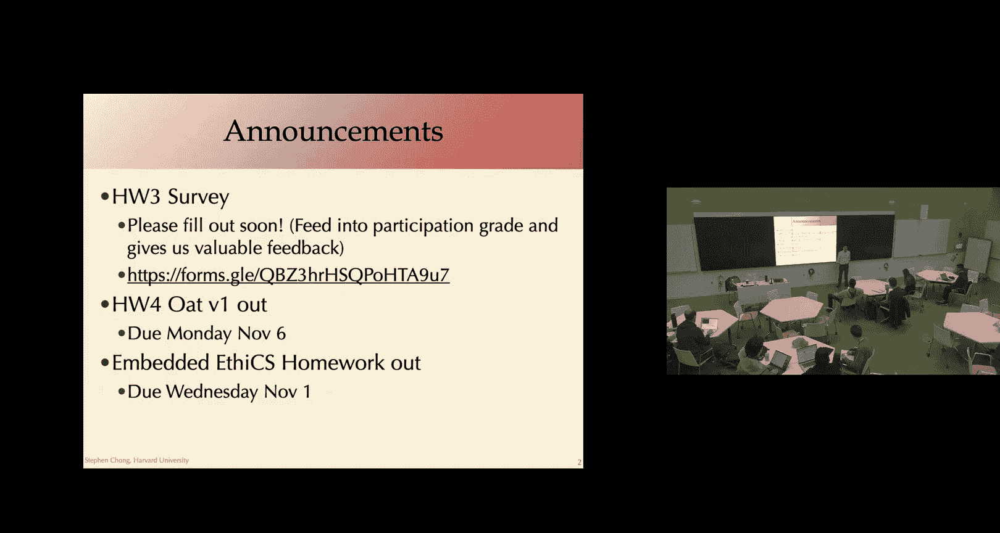

Okay。So， we。It feelsels like it's been a long time since last lecture。

Do we wrap up pasing last lecture？What we finish last lecture， functions， compiling functions。

 Thank you。 And knew we finished something。 We finished talking about compiling functions。😊，Today。

 for the next and next lecture as well， we're going to be talking about type checking。😊。

So we'll explain the concept of that。 And we're also gonna be。

Spending more time on getting comfortable with inference rules way of expressing typing judgments。

 which will be very useful as we get into。Into the work for homework 5。So。

Let's see this diagram that just keeps on coming up throughout this course。

 the basic architecture of a compiler。 We've covered actually quite a bit of this already， right。

 we've looked at。Most recently at paring at the beginning of the course。

 we were doing cogeneration into X86 you're currently working on lowering from L of VM intermediate language into X86。

We're going to be tape checking fos under this area。 Elaboration。

 really an area that we haven't touched on yet。 So the idea is that parsing has produced an A S T。

An abstract synttry， this unambiguous representation of the program。嗯。

What we're going to be looking at in elaboration is taking that initial abstract syn tax tree。

 the untyped one。And then turning it into a typed abstract syntax tree。

 So in putting in type information。U。Into that tree。

And this is a form of reasoning about the program。That happens quite early in the compilation process。

So the reason why I'll dig into what types are， but the reason why we're interested in types is as you know。

 the PAser， the grammar for a language is going to rule out various nonsensical sequences of tokens that really don't form meaningful programs。

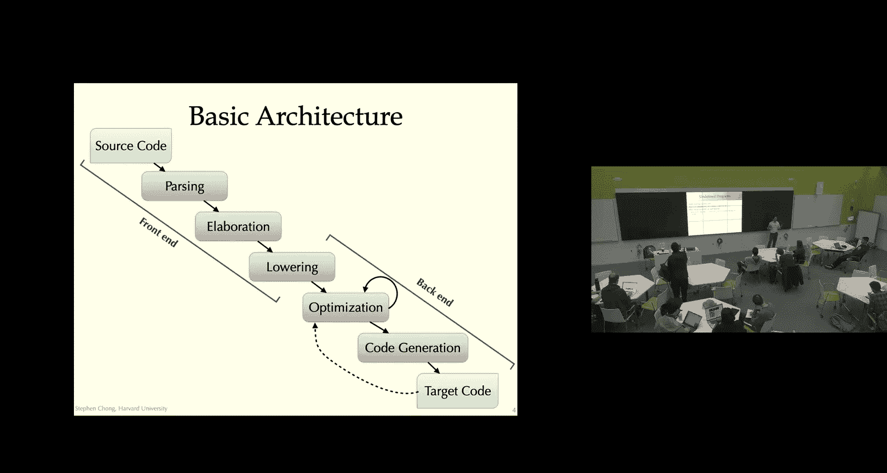

That said， there are going to be programs。That are syntactically valid。But they're not well defined。

So that could be things like3 divided by zero。D by zero is undefined。

Or maybe subtraction where the left upper end is a string， the right upper end is an integer。Hello。

-7。Maybe 42 applied to 19。Where。We're trying to use an nteger 42 as a foot were a function and apply it to an argument。

Using a variable that isn't in scope and so on。Okay。

So the idea of types is that they allow us to rule out。A lot of this undefined behavior。

Before we ever try to execute the program so that is during the compilation phase。

We're able to realize。For many programs， many programs that are not well defined realize that they are not well typed and reject them。

So。She。All of you have programmed and typed languages， Ocal， of course。

 but there are many other languages have types。One of the ways that you can think about a type is as being an approximation。

Of the computation that happens at runtime。So， for example， if you have an expression， E。

And E has the type int。You can think about that type int as being。

An approximation of what the computation E is going to do at runtime。What it means is that。E。

When it executes。If it terminates。And produces a value， that value is going to be an integer。

So at the type level， we don't know which integer it's going to produce。

But it's kind of this coarse approximation。 This computation will produce an integer。

And this approximation。To the runtime computation。Allows us。

To make sure that various ill defined programs are rejected at this type checking stage。

So for example， we're able to make sure that we never treat an integer as if it were a function。

 We never try and apply an argument to it。 We never treat a string as an upper end in subtraction。

So this type system being an approximation of the behavior runtime。

It's based on an idea that's known as type soundness， right。

 The idea that these types are a sound or a correct description of what's going to happen at runtime。

So we're going to dig in the into the details of type systems。

But the key idea of a type system being sound is that a well type program。When it executes。

 does not attempt to perform any undefined operation。

 so this is the key idea of designing a type system。

Is to make sure that we get this notion of type soundness。

 We're going to rule out entire classes of errors。Through the type system。

 and any well type program is gonna going to be guaranteed to be free of。Certain runtime errors。

Ty type soundness is actually really quite profound， right。

 Think about if you were writing a jascript program。And there was some magic。

Orracacle that could tell you， you know what， when you run this JavaScript program。

 you're going to be free。Of all of these classes of errors， right you're not going to ever try to do。

 you're never going to get a nody reference， you're never going to treat a string as if we' were an object。

 you're never going to invoke a message a method or an object that isn't defined。

There's so many kinds of runtime errors that you can get in a language like JavaScript。

That in a language with a strong type system is able to rule those things out。And if you。

 who's actually done development in ja。Full stacked developments。That stuff can be really painful。

To actually debug， right， you're generating jascript， seeing them go over to the client。

 Sometimes you might get an error on the client of some certain sequence of actions are taken in the browser。

 right， So imagine being free from those。Entire classes of runtime errors before you ever actually run the program。

So type soundness is like this really powerful idea。The way that we。嗯。

To take this idea of type soundness to kind of the next level of concreteness。

 the way that we normally reason about type soundness is we make a model of the source language。

So to be honest with you。Many real languages are actually very complex。

 difficult to reason about mathematically。So what we do a lot of the time is come up with a model of the source language。

 that might be a mathematical model。Were we， for example。

 expressing the meaning of a language using inference rules？

But you can also think of an interpreter for a language as being a model of that language。

About taking a program and doing something with it。

That model of the source language tells us which operations。mightight be udefined。

 so this might be in your interpreter where you'd end up throwing an error and saying this program doesn't make sense。

 or in your mathematical model， it might be places in the model that behavior is undefined。

 that you have a program that does not evaluate to a particular value。Now。

 this idea of which operations are partial， which operations might be ill definedfin in some circumstances。

 that's going to be different for different languages。So， for example， high plus world。Is。

 for example， not legal in Ocal。But in many languages， plus will work as an operation on strings。

And give you drink incatednation。In a smaller subset of languages。

 you can actually do some kind of multiplication on strings and NA time 16 is actually well defined in some languages。

 producing 16 copies of the string NA。So this idea of what what operations are allowed will differ from language to language。

 which is why it's important to have a model of the language that in some ways telling us what is and isn't well defined。

When we。Type checker language。 You can think of this in a relatively concrete way。As a function。

TT type check that takes as input， an AST so representation of the program。

And it simply returns a boolean， true or false， true if it is well typed。Falkse otherwise。

The idea being that if T C of E returns true， I。e。 the program is well typed。Vin。

To follow T soundness it means that when we interpret E。

We're not going to get any undefined operation。Now， ideally。

 what we want to do is actually prove that this function， this type checking function is correct。

We're not going to dig into that in 153， but in the class 152 spends a lot of time looking at type systems。

 looking at the idea of proving the type systems a sound。Okay。

 any questions at the moment about what are typers and this high level approach that we're going to take to type checking。

 Just a moment， we're going to see a simple language。And make this more concrete， see an interpreter。

 see a function TC。To wrap our heads around it but any questions at the moment？Okay。

So let's turn and look at。A simple language down here at the bottom of the slide。

 I'm showing the the type for the A S T for the program。 So we have variables， Integers， addition。

 we have function definitions。 Remember， we use the term Lada for function definition of a here's the variable to the function。

 Here's the body of the function。We have function application， let's throw on pairs as well。

 so we can have a pair of expressions。And then we have ways of getting of projecting an element of the pair。

 the first or the second element of a pair。At the top of the slide。

 I have the different types that we're going to use for this simple language。

This language is very simple。 We only have three different types。 We have ints integers。

 We have an arrow type， which is a function。So that is。

This is the type of the argument to the function， this is the type of the result of a function。

 and a function will have an arrow type。And we also have a type for pairs which is simply the type of the left element of the pair。

The type of the right element of the pair。嗯。I note that。For reasons I'll get into a bit later。

 we're going to have function arguments have a type annotation。

So that is we're going to require in the simple language when the programmer declares a function。

You know， this is a function whose argument is X。 They actually need to declare what the type of x is。

 X is an integer。 And here's my expression that uses。嗯。Uses their variable X。Okay。

 so given the simple language。We can have a model of it。

 We can have an interpreter that tells us how we evaluate it。

So here is an environment based interpreter， environment， mapping from variables to values。

 It's a recursive function to interpret the expression E。嗯。Let's see。For variable X。

 we simply look up in the environment and return whatever value is associated with it for an integer I that is。

The final result of the computation， we evaluate to int I or in underscore score V。

 we have which is a type of a value。For an addition。E1 plus E2。

 we recursively evaluate and interpret E1 and E2。IfThey both evaluate two integers。

We evaluate to the result of summing those integers INJ together。嗯。For lambmbda term。

This is a value we immediately evaluate to a closure。Just like we saw in the last couple of classes。

For application。E1 to apply to E2， we evaluate E1 and E2。

As if E1 is a closure and E2 is the argument， we。Essentially evaluate the function body E after we've extended the environment。

With the。Mapping for the， for the formal argument， X。I've highlighted in red here。

The operations that can go wrong。Okay， so if we are doing an addition。So plus。

 and either E1 or E2 doesn't evaluate to an integer。That's bad， right。

 we're trying to maybe add a function with a pair， something that isn't defined。In a similar way。

 if we're doing function application。And the left upper end is not a closure。

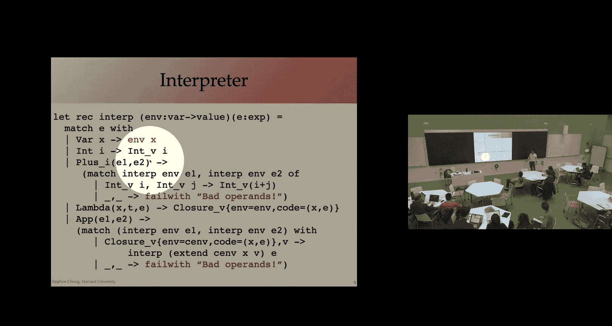

Not a function。 that's a problem。 We're not going to be able to keep on going。

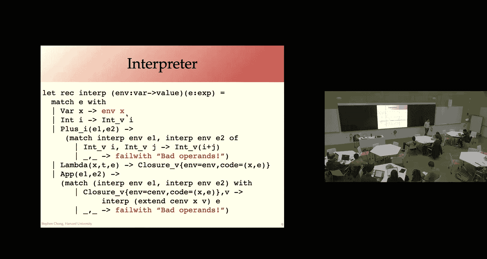

And also， I highlighted a coloran n applied to X looking up X in the environment。

 If we look up a variable that ist in scope， this could also fail at runtime。

I haven't shown you the rules for。Constructing a pair or projecting the first or the second element from it。

But they're relatively straightforward to implement as an interpreter。 You need a pair value。

So in the value type， so it's something like pair underscore V。诶。But otherwise。

 it's pretty straightforward。Any questions about the interpreter for this and this idea that。

We have a language。We have programs but even well form programs might encounter undefined operations。

Okay， so our goal is going to be to develop this type checker。

It's going to look at an expression at AST。And if it returns true。

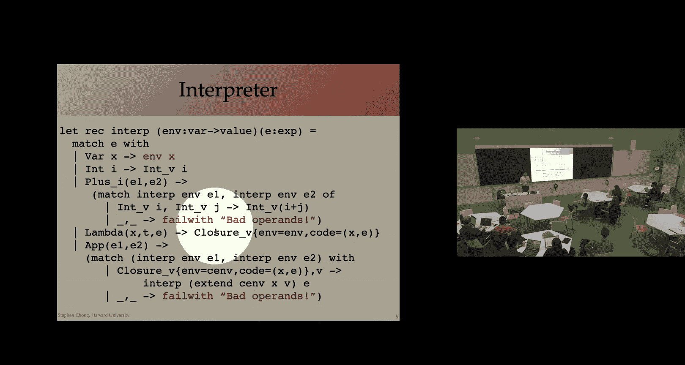

Then we're going to be guaranteed that when we。Interpret that expression。

We're not going to fail with any of these bad operaans or very out of scope。Erras。

So let's turn and look at a type checker for this language。So it's， again。

 going to be a recursive function。呃TC。嗯。We're going take an environment。

 but this environment is going map variables to types。

And the interpreter of the environment mapped variables to values。 Here。

 variables are mapped to types。But just like our interpreter。

 we're going to take an expression E and we're going to recurse on the structure of E。

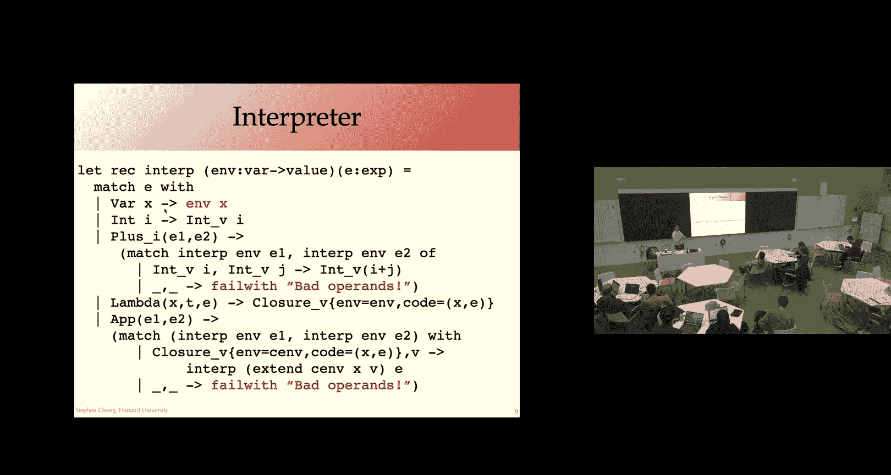

Okay。

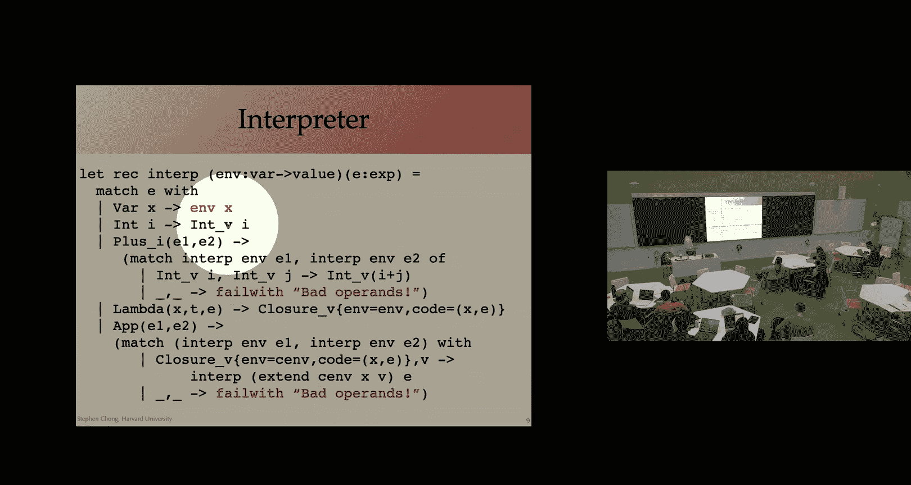

嗯。Our type check a function， you know， we're not actually going to return a boolean here。

What we're going to do is return the type of the expression E。

And this is going to help us with our recursive calls。More than just knowing something is well typed。

But at type check， it's going to be really useful for us。 No， Well。

 what type does this expression actually have。So the type of re verbal X。😊。

We simply look that up in the environment。Okay， whatever the environment x returns is the type of X。

If we have an integer expression。ItDoesn't matter which integer it is， hence the underscoresco。

 The type of that expression is int。And to underscore T。 So that's what we return。For a plus。

Operation。E1 plus E2。

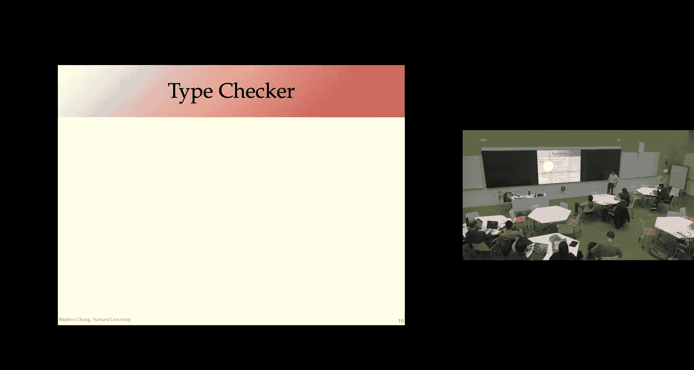

We're going to recurse and type check E1 and。E2， that should be a2 right there。Type checking E2。

And as long as E 1 and E 2 both have type int。Then we know that the addition operation is going to succeed and it's going to return an integer。

 So that is the type of the。E1 plus E2 expression is going to be int。For a lambda expression。

The type of it is going to be an arrow type。 right， The type all functions is an arrow。嗯。

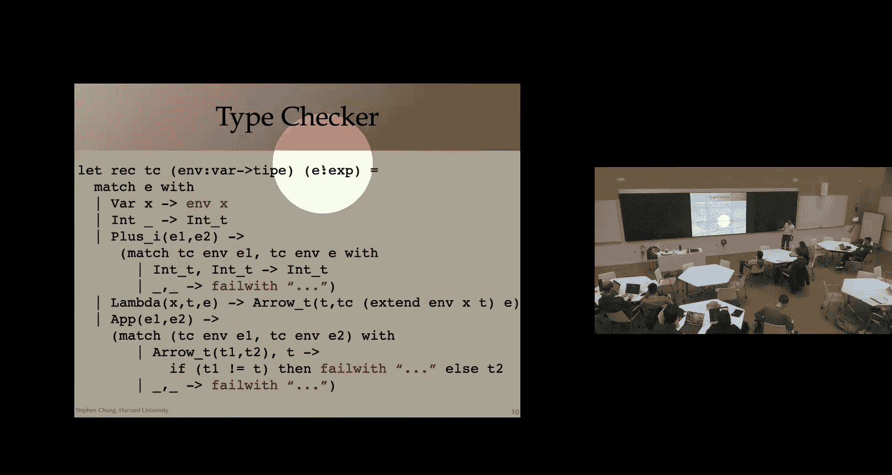

Type of the opera end is going to be T。Whatever the programme annotated。Sorry。

 the argument I said Irighted， whatever the programmer annotated the argument X with。X's of type T。

 that's the type of the source。The type， the result type of the function。Well。

 we actually get that by type checking the function body E。That's what we're seeing here。

 we're type checking the function body E。We're doing so in an environment that's extended。

Where the formal argument X is mapped to。

The type T。With that recursive call， we'll check the function body。

 make sure the function body is well typed that it type checks and is's going to return the type of the function body。

 which is the return type of the function。

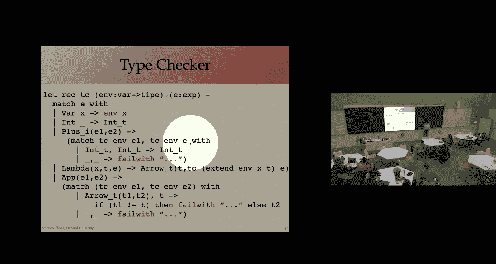

For an application， E want to apply to E2。We recursively tape check E1 and E2。

It better be the case that E1 is a function， that is that it has arrow type。A function from T1 to T2。

T is the type of expression E2， and it better be the case that that is the same as the argument type。

If it's not the case， we're going to fail。Otherwise。

 we the type of this application is going to be the result type of the function。 That is type T 2。

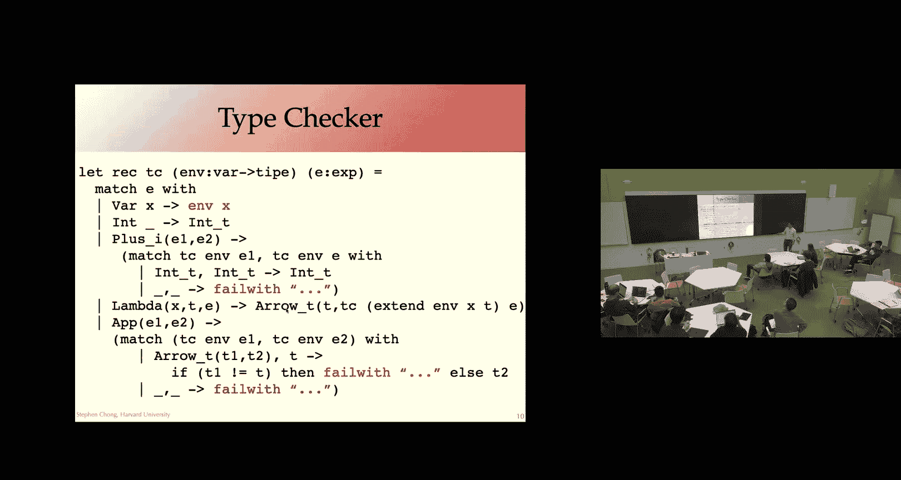

Yeah。So again， in this。In this piece of code， I've highlighted in red。

The places where type checking will fail。That is where type checking will not return the type of the expression。

And that's going to be if。For example， the opera ends of addition are not suitable if they're not integers。

 It's going to be if the。In an application， if the type of the first opera end is not a function or if the type of the argument type of the。

Function and the actual argument passed and don't agree。 Then we're going to fail。

Any questions about this type checker for this very simple language， right， this recursive function。

The checks to make sure it's well tapd。是。Why is， I'm sorry what？In the X。

 so remember what we're doing with this。With this type checking function is。

We're going to return the type of the expression。So if our expression is simply a variable x。

 what's the type of x。that's exactly what the environment tells us。

 The environment maps variables to the type of the variable。

But does that fail if the variable X is not in scope。That is。

 if it's not in this associative list that we're using to M implement the environment， then。

There is no type for that variable。 And moreover， the programme is not well typed。

 if you actually ran it。If you interpreted it。We' end up trying to look up a value in the runtime environment that isn't there。

So the point here is that the。The way that type checking fails。

 the way that it will not return a type for the expression。Corresponds to the ways that。

 the interpreter for the for an expression will fail will encounter undefined behavior。

A variable is not in scope。You try and do addition with things that aren't integers。

 You try and do function application with something that isn't a function。Or in this case as well。

 if the argument is not of the appropriate type。Mary and then William。Does't he going T2。

So the type of， so what do we mean not of the right type in function application？

 So we have E1 applied to E2。So intuitively， E1 should be a function， let's say。

 from integers to strings。And E2， the thing we're applying the function to。

That should be the same type as the argument。 So if I have a function from integers to strings and I apply it to a value。

 I better be applying it to an integer。If I apply it to something that's not an integer。

This function from integer to strings is not going to go well。Right。嗯。So let's say that。

 So the type of E1， the result of type check applied to E1 is going to be a function type。

 an arrow type， T1， arrow T2。 So T1 is the type of the argument that it expects。

 T2 is the type of the result of the function。Here， T is the type of the actual argument， E2。

 the thing we're applying the function to。And so this is why better be the case that T1 equals T。

If it doesn't， we're trying to apply a function to a value of the wrong type。

 to an expression of the wrong type。Does that clarify， great， thanks。

Regarding how the pet checker failures for sponsor。Is this true general？

Is it true in general that typeeer failures correspond to runtime failures。 Yes， in the sense of。

 remember what we're wanting to do is the typee is gonna be an approximation of the runtime computation。

And we want to make sure that if the type checker returns successfully says， yes。

 here's the type of the expression。That we have this type soundless guarantee。

That when we execute a well type program。If it terminates。

 then it's going to give us back a value of that type， meaning that it's not going to encounter。

In of these u definedfined operations， like trying to add together。A string and a function。

So in that sense， yes， the places that the type checker fails that we failed to type check corresponds to the cases where if we were trying to execute or interpret that program。

We would encounter bad things。So does this imply that every？

Every bad thing that can be encountered when you interpret the program can be Hol that thought for half a slide。

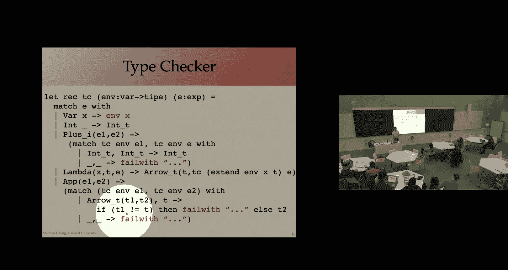

Okay。嗯。Okay。So as we've been talking about， there are these analogies between。The typepeer。

And the interpreter， right， they both。Essentially， recurse on the A S T。

 We've already seen how the type checker fails in places that are analogous to the interpreter failing。

 And that's deliberate to make sure we don't， we only this approximation of computation。

 This type checking only returns a type。When the interpreter would successfully return a value。

But there are some differences。So the interpreter would evaluate the function body only when the function was applied。

Right， so given a lambda term， a function。The interpreter evaluates the function body when the function is applied by extending the environment。

And so on。By contrast to our type checker， we recursed into the function body when the function was declared or defined。

not a function application。So the type checker always checks the body of the function。

 even if the function never ends up being applied。So this is one of the ways that。

The type checker is approximating the behavior。Of the interpreter， not exactly paralleling it。

Another difference was that we。Needed to assume that the input of a function had some type T 1。

 right， This is the programme or annotation。So actually， in the interpreter。

 we never actually used that type annotation on the function argument。

But it turns out that that annotation really helps us with our approximation， with our type checking。

Because it allowed us a nice， easy place to kind of say， hey， when you're using this function。

 when you're applying this function to a， to an argument， to to an expression。

Let's make sure that these things agree。So that approximation right there。

That's really what enabled us to type， check a program， even though。In general。

 if we saw E1 applied to E2， we don't know which closure， which function E1 is going to evaluate to。

And actually figuring that out is a really difficult job。But nonetheless。

 because of this type annotation。Because we know what the type of V1 is。

 what the type of the argument is meant to be that allowed us to type check an application site that we're passing an appropriate argument to a function。

 even though we may not know exactly which function。Is。Is being used。Is going to be used at runtime。

William， you question about undefined oppressions， I'm actually getting toed in a couple of slides。

 but don't worry， we'll get there。Any questions at the moment about this type checking algorithm？

Tpe checking function that we saw。Okay。So this is a very simple language， right， we had functions。

 integers， addition， we added pairs， but it didn't really show them to you。

We can extend the language with more language features， right。

 And we can also extend the type system appropriately。 So let's suppose we wanted to add Booleions。

Right， this is a new type of value。 It's not an nteger。 It's not a function。 It's not a pair。

 So we ended up extending the data type。The Declaration of possible typess to include a Boolean type。

Wed have various expressions that allow us to construct and use Booleans。So wed have constants。

 true and false。 These are the ways of constructing Boolean values。And then in this simple language。

 let's suppose the only way we have of using or destroying a boolean is with an if expression。

So think about this as being if E1， then E2 else， E3。And the intent， of course。

 is that their first expression is going to be a boolean。We need to extend our model of the language。

 our interpreter for the language to understand what operations are well defined and which ones aren't。

So here we could extend it。True and false。 simply evaluate to true and false。Tru false values。

 and for an if expression， the idea is that you'd evaluate E1。If it's true， you then evaluate E2。

 If it's false， you evaluate E 3， other ways you fail。

 That is if the first opera end of if wasn't a boolean。That's bad， right， it's undefined behavior。

We can extend our type checker。To suitably approximate this interpreter。In particular。

 we'll make sure that true and false have type pool。But， more interestingly。

If we have an enough expression， if E1， then E2， LC C3， well， we're going to type check E1。

 E2 and D3。And we're going to require that the type of E1， T1。Is a boolean。Right，If it isn't。

 we're going to fail。 You're trying to use if without a Boolean guard。

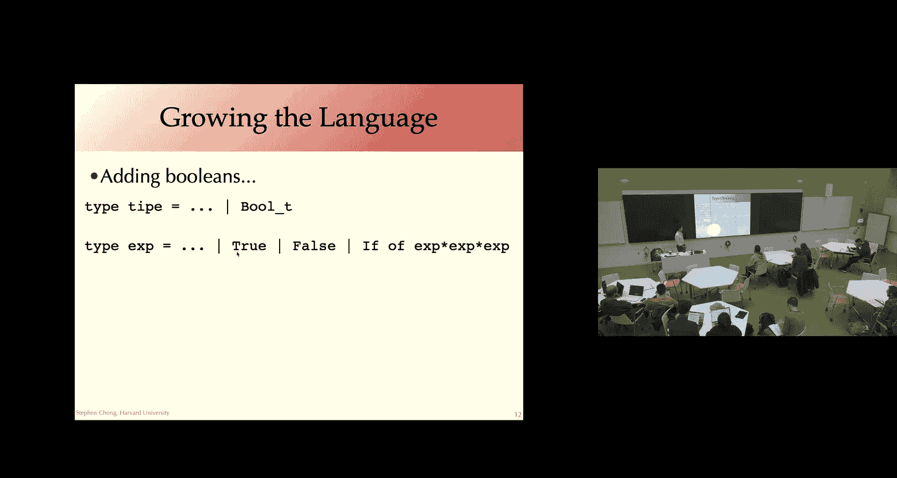

If it is a bull， then we're going to require that。The type of the then and the else expressions are the same。

Right，So that is regardless of whether you want to evaluate it to true or false。

 no matter whether you evaluate E to E 3， the type of the value you get back。Is going to be the same。

And so this is a requirement on our type system to make sure that essentially， we can。

That our approximation makes sense。Right， that we can kind of ignore the details of。

The F expression and just realized， hey， if it returns successfully， it's gonna return。

A value of type int。Which is regardless of whether it took the true with a false branch。

And we can do a similar thing for more language features， right， Ext the type system。

 extend the interpreter， Ex the type checker。Any questions about。Extending forboions。

Or anything else that you might have on your mind at the moment。O。So。And now。

 in this simple language。The typeeer nice and straightforward， right？

niceice simple recursive function， and I haven't proven it。

 but we get this really lovely guarantee that if the type checker returns successfully。

 that is returns a type， then we are guaranteed that the expression will evaluate successfully and return a value of the appropriate type。

😊，If it terminates。However， to do this， we actually required the programmer to provide these annotations on the function arguments。

嗯。What we can try and do is instead of having the programmer provide us。With those。

Type annotations on the function argument。We could actually try to infer those types。

So that is magically figure out。What those type annotations should be。

And if we could figure that out。Then， as we've seen from the implementation of our type checker。

 that would be enough for us to type check the whole program。And of course。

 you can imagine the benefits the programmer doesn't need to provide all those annotations and so on。

Now， it turns out that there are actually efficient algorithms to do this。 Heinley Muna is。

The the most common algorithm used for type inference for functional programming languages such as Ocaml。

嗯。This is covered in detail in CS， S 152 in lecture。

 But the key idea is you kind of end up building up constraints。Saying like， hey， if。

I see that you're using the variable X here as an opera end of addition。

 So that means that the type of the variable x are better be an integer because I know that the opera ends of addition have to be integers。

Hey， I see that you're applying E1 to E2。Well， that means that the type of V1 had better be a function。

And moreover， the。Argument of that function has to be the same as the type of V2。

So you can imagine actually going over this of a program， building up a set of constraints that says。

 if this is well typed， then these are the things that I know have to be true。

And then trying to solve that set of constraints。And solving that set of constraints is essentially the process of type inference。

With our compiler writers's hats on。We need more than just the fact that we have an efficient algorithm to do this。

 It actually needs to be useful。That is， when it fails to type check。

 you want to be able to tell the programmer that in a useful way。

And that's actually pretty challenging。There's been a lot of research on it。

 there's also a lot of common engineering approaches to try and make sure that error messages are meaningful and relevant。

And this is actually hard if a set of constraints aren't wealth are not satisfied。😊。

It might not be because there's just one place。That is wrong。

 It's really the combination of things that is wrong。

 So figuring out how to report it in a way that's useful is often。啊。

A human computer interaction problem rather than a crisply defined optimization problem。呃。

I do want to mention briefly polymorphism。Because you all are expert Ocal programmers。

 You know that Ocal has inference。But you also know that Ocal's type system goes beyond just ints and bulls and functions and tuples。

 right you can have these polymorphic functions。The idea of a polymorphic function。

Is that you're writing one function， but you can actually end up。Applying it， invoking it。

With arguments of different types。So for example， you might write a swap function that takes a alpha reference that is a memory location containing an alpha and。

A value of type alpha， a new value to put inside that location and returns the old value。

 So what you're doing is kind of。Give it a new value and it'll swap that new value with the old value and return the old value。

Now， this will work for integer references， string references， function references and so on。 right。

 You can just write one copy of the code， and it's going to work for all those different types。

And Oaml's type system is powerful not enough to express this through the use of polymorphic types。

Where alpha here stands in for any type that you want to use when you actually apply a dysfunction。

So it turns out that type inference。With polymorphic types， is undecidable。So。Were kind of。

 if we tried to do type inference。For。A language with full polymorphho types。

It's a losing proposition。 We're not going to be able write our type checker algorithm that is sorry。

 our type inference algorithm that we'll be able to infer types successfully if such types exist。

Yet when you use Oaml。You know， you've never had the Ocal compiler go into an infinite loop as it's。

 you know， trying to figure out type inference。So what's actually going on there is O Caml's type system。

Isn't using the full power of polymorphic types。It's actually using a restricted form of polymorphism that's known as let polymorphism or sometimes prenex polymorphism。

So。I won't go into the details of it， but essentially lead expressions can be typed polymorphically。

嗯。But it's the type system system is ruling out the possibility of you， for example。

 writing a function。The takes as an argument。A polymorphic type。Okay。

 so whether that means a Z can is actually giving up some of the possible expressiveness of a polymorphic type system。

In order to make sure that type inference is decable and efficient。Okay。

 any questions about polymorphism type inference before I move on？

And this is covering some really deep and interesting topics very， very quickly。

 just to give you a flavor of them。😊，Yeah， Mario。That uses organmorph types that you wouldn't be able to do。

Oh。So suppose I wanted to write a function。So here's an example of using polymorphic types in a way that Ocaml wouldn't allow。

Let's suppose I wanted to write a function that took。Three arguments。A function， F。An interteger。

X and a string Y。It applies f to x。The integer。And then it applies if to Y the string。Okay。

 so what we'd like is if to be a polymorphtic function。Let's say from alpha to alpha。

And then I apply F to x， an integer。 The result of F applied to x。 An integer should be an int。

And then I play F to Y， and I get back a string， and I take those two values。 and I don't know。

 print them out。Right now on Ocal's type system。You can't do this。

When if you try to pass on a polymorphic function as the first argument， you can do that。

 But as soon as I use that polymorphic argument on an int， it's going to say。

 this must be a function from in toent。And then you can' end up applying that function to a string。

You can use other places。 Yes， you can use that polymorphic function in different places。

 but you essentially。The key idea is that。The polymorphic functions you take in。

 all the polymorphism has to be at the beginning of。At the beginning of your type， essentially。

 you can't take as an argument a polymorphic function or the polymorphthism has to be moved out to the top level。

Yeah， question。I'm not sure which week types you're referring to sometimes you Oh right， right。

 right。Yes， this is related to。This is related to Ocael's weak types， which is。

Whether something is polymorphic or whether in some situations， it's。

A type that hasn't yet been inferred。As opposed to a polymorphate type yeah。

Thanks for bringing that up。Yes， you're right。Cool， any other questions。Okay。So。

Related to the idea of type soundness is the idea of type safety。

Type safety in a nutshell is the idea that well type programs do not go wrong。

If you have a world type program。嗯。Then that program is safe， it's not going to encounter。

Incorrect behavior。嗯。This is a really strong property。呃。As we talked about。

 the idea that we're never going to execute undefined code。Is。Is incredibly strong。

It turns out in the simply typed Lada calculus in the， So in the simple language that I presented。嗯。

It's a really， really strong property。 The type system rules out many， many programs。

 not just ones that have undefined behavior。But also。

 it conservatively rules out programs that might be well defined。

 but we can't prove they're well defined。It turns out that we end up。

Rejecting any program that might fail to terminate。The type system of the simply type lamb。

 the calculus is so strong。That only terminating programs can be well tagged。Ala。Wish。

I'm going to say yes， here I mean simply to mean not with a polymorphism。Yes。

 once you add polymorphism。哦。So definitely once you add full polymorphism。

 you can get non terminating programs。I can't remember if adding prenex polymorphism。

To the simply type language calculus gives you non terminating programs。Again。

 if anyone wants to post on Ed， I will look it up and respond。Betty， yeah。

 it was just different than we。Sound this。This is very similar。Type soundness。

Is normally a property of the type system。 That is the type system as sound if。呃。

If we have type safety， so they're often used pretty closely as synonyms。

 I probably should not have introduced both terms。嗯。嗯。Finally， getting to William's point。

 even if we have type safety， even if we have type soundness。

That is world type programs do not go wrong。This may not rule out all possible undefined behavior。So。

 for example。In the type system I presented， if we had a division operation。

There'd be nothing in there that would prevent the program encountering a division by zero at runtime。

Our type system is able to figure out， hey， this expression will evaluate to an integer。

But it doesn't know which integer and maybe that integer is going to be zero。In which case。

 if it's the upper end of。If it's the divisa， then we encounter a runtime error。In a similar way。

 in a language that has references and null。The type system may not be precise enough to rule out。

Nll values， meaning that at runtime， you might try to dereence null。嗯。

So depending on the language and depending on the type system is going to determine which operations are prevented by the type system。

 and it may not be all of them。It is possible。In general， to define stronger， more precise。

 more sophisticated type systems that can rule out more kinds of undefined operations。For example。

 you can imagine having。In addition to having a int type。You can imagine have a non zero int type。

 and you require that the second operaan to division is a non zero integer。

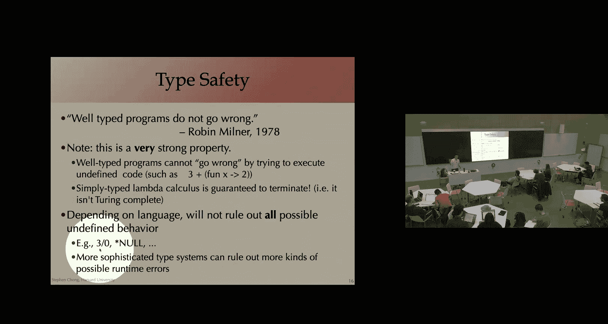

Okay， so you can imagine the typing rules for that and trying to figure out the typing rules to enforce that。

嗯。You can have a tape system that says。This reference is definitely not no。

V maybe another type that says here's a reference and a maybe null。

And you can imagine in your program that when you dereence something。

 it has to be of a definitely not null type。Indeed， that's what's going happen in homework 5。

In the O programming language， we're going to have a tape system that's powerful enough to reason about not null pointers。

And you're only going to be able to dereference pointers if they're guaranteed to be not nu。

 so you'll be implementing。Interesting type system for homework 5。Yeah，So mentioned hear that adding。

The line values here sort of reduced its inpressibility。

I this obviously the case that systems tend to produce reduce expressibility or is that So do type systems tend to reduce expressibility。

 Well， let me rephrase that as type systems reduce the set of programs that are accepted。 right。

 That's kind of the point of a type system。Right， so of all the possible syntactically wellform programs。

Many of them don't make sense， and the tape system rules out。Some of those。嗯。

Type systems in order to satisfy type soundness to get this type safety property。A conservative。

 right， They're going to reject many programs， including programs。That would be totally fine。

It would be okay and non encounter runtime errors。嗯。I'm not going to come up with examples for it。

 but there are。It's pretty easy to imagine， well， actually。How do， how about I had a program。

 If true， then 0 else。Some ill typed expression， you know， seven plus hello world。

so that program is not well typed。But any time I run it， you know， the expression was if true， then。

I'm only going to ever execute the true branch。 I'm never going to execute the false branch。

 So that program is syntactally well formed， never going to encounter about in the legal operation at runtime。

 but not well typed。 So the type system has ruled out。A program that was not well typed。

 but would not have encountered a problem at runtime。And in general， type systems are conservative。

Right， they are going to allow。They are going to throw out programs that are okay。

 but not well typed。Now。In the simply type Lambda calculus。

 the type system throws out so many programs that it turns out。

 it throws out programs that fail to terminate。 You know。

 even one that does not ever encounter a runtime error， but just goes into an infinite loop。

But there are many type systems that do allow。Ting complete languages。

So it's not always the case that type systems will reduce the expressiveness。

The computational will express on a of language， but it is always the case that a type system will reduce the set of programs that are accepted。

Because that's the point of a type system。Okay， thanks for the question。Any other questions。

About type safety， type systems。Okay。Am I moving too slowly or too quickly？

Hands up if this is kind of slow。Too fast。Okay。Allright。

 this means I'm approximately moving at the right pace。

 which is good because we're actually covering a lot of ground pretty quickly。

 I'm giving these ideas of a type system。 I think theyre actually really deep concepts。

 and I think we're familiar with them to some extent。

 And so to that sense I was worried I've heard like I was going too slowly。😊。

The reason why I wanted to make sure we were pretty comfortable。With this idea。

 this intuitive idea of a type system。🤢，It's because we're about to get mathematical。 Okay。

 so we're about to introduce some formalism。We saw a type checking algorithm in code。 this nice。

 simple recursive type checking function。But it turns out that we can express the type checking rules really compactly。

And unambiguously， very clearly， if we use inference rules。For a type judgment。So。

Let's introduce a typing judgment。This judgment。嗯。Has three elements。

 Capital E here is a typing environment or type context。

 This is simply a map from variables to types。 So you can think about it as just being a list of pairs of variables and types。

嗯。E is an expression。And T is a type。 So this judgment relates three things to each other。Right。

You can think about this judgment as being a set of triples of。Atyping context， capital E。

 expression E and type T。And if some particular。Context， expression and type are in the relation。

That is。If this judgment holds。Thenna means that expression E。Has type T。Under typing environment。

 capital E。Okay that is the expression he is well tapd in that tapping environment。

 typing context with type T。And as I mentioned， you can think about this as being a set of triples。

Or a relation over three elements。Typing context， expressions and types。So， for example。

 this judgment holds true。 Here is a typing context that maps the program variable X to nt。

 program variable B to ball。

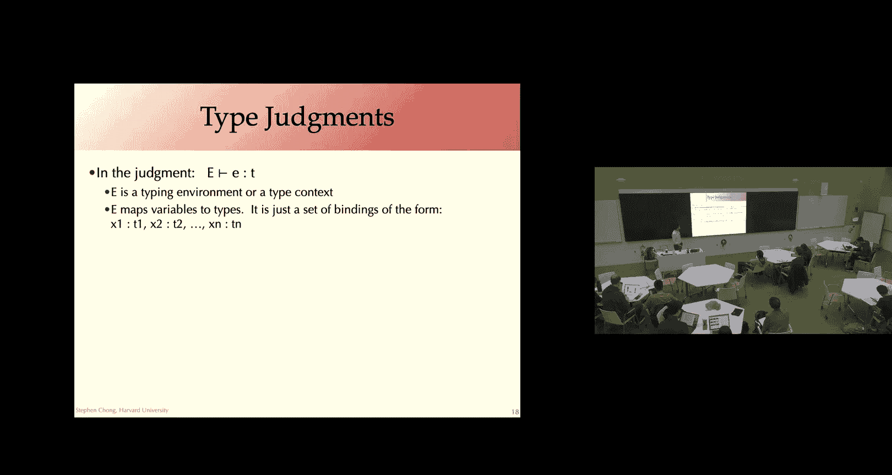

The expression， F B， then3 else X。And that expression has type in。intuitively， yeah。

 if we ran out type checking。Algorithm on this on the AST representation of this expression。

With this environment， the max X to ins and beat a ball， we would expect it to return。Saying， yes。

 this expression has type end。Okay。So what we are going to want to do。Is to define this judgment。

Using inference rules。Now， I want to get to the idea of influence rules by thinking about。

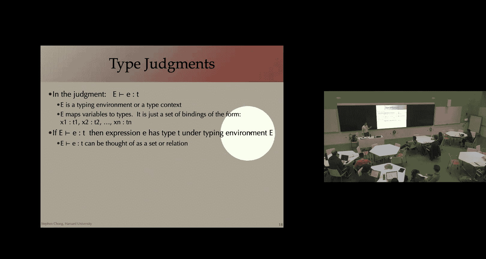

Well。If we wanted。To make sure this， how do we know that this judgment holds true， How do we。

When we're looking at FB， then 3 L X。What are the things that need to be true in order for us to realize that that expression has type in？

Okay， so if we looked at this expression， F B in 3 LC Cx。

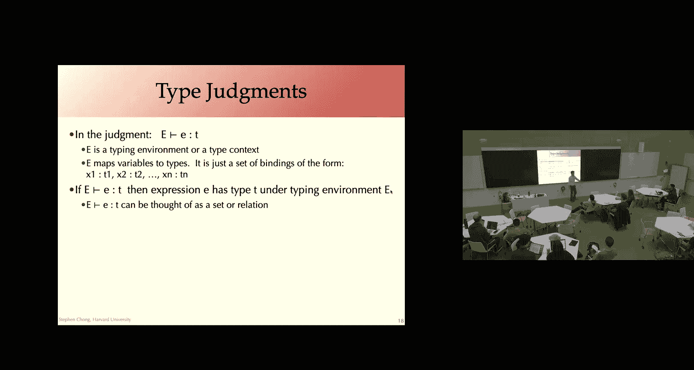

Well， what does B have to be？可以。Right， it has to be a bull end。So。

It better be the case that we're able to show that the expression B in the same typing environment has type bull。

We need this to be true in order for FB then3 LX to be world typed。Right。嗯。In a similar way we。

A're going to need。In order for this expression to have type n。And we know that the expression three。

Better havety end。So we know that we better be able to prove that the expression  three has type end。

Similarly， we better be able to prove that the expression X， the else branch。Has type end as well。

So if we know these three things， bes of type O， three is of type int， X's of type int。

There would be sufficient for us to say，ha， if B in 3 else X has type end。

So we're going be able to express that in an inference rule。Recall from a few lectures ago。

 this idea of influence rules that if。The premises of a rule that is the things above the line。

Are true， then the conclusion， the thing underneath the lane is true。An axiom was an inference rule。

 with no premises。And we worked through some examples with this idea that you could take an inference rule。

And you could instantiate it。By replacing the meta variables。For example， E E1， I。

X and so on with expressions， program variables， integers， and so on。So I think we've already。

We've introduced the concept of inference rules。 I don't know if I said it explicitly。

 but they turn out to be a really compact and precise way of specifying language properties。

For the Java programming language， I should have brought the Java programming language manual。

 it's about six or 700 pages written in English。嗯。Is very verebbo and redundant。

 It's one of the most well specified， well defined。Real programming languages。

So you can express all of those restrictions and requirements in about 20 pages of inference rules。

Versus 600 pages of text。So they turn out to be a really efficient way of doing it。

 and they're not subject to the same ambiguity。As English languages。

The inference rules that we're going to see turns out that they're going to correspond really closely to the recursive AST traveral。

 We've already seen this in the evaluation relation that we saw a few lectures ago where we had one inference rule for each syntactic form。

That is for each ASST constructor in our program， we're going to see something similar with the type system。

So it turns out that type checking and indeed， type inference is really。

Just trying to prove a judgment。By searching for proofs。By searching， hey。

 can I come up with a way of constructing a proof tree whose conclusion is this？

That turns out to correspond pretty much exactly to our type checking algorithm。

Can I find a proof for this， If I want to conclude this， what are the things。

 What are the premises that need to be true。So that's pretty cool。

 We can express something compactly and ambiguously using type inference sorry。

 using inference rules。😊，And there's this natural way of translating it into an actual algorithm。

Into an implementation that actually does that。Now。

 this is true not just for things like type checking。

Or for the evaluation relation that we saw a few lectures ago。

It turns out we can actually think about compilation。

The process of taking a source program and producing assembly code。

We could express this as inference rules。We could have a judgment that says， hey。

 you' given a context E and a source program source that produces this target program。

And we can define inference rules for this to kind of concisely and compactly say。

 here's how you translate an integer。 here's how you translate an addition。

 Here's how you translate a function。So on。In a way that lends itself in a pretty direct way。

To implementation， that is to writing the kind of recursive compilation functions that you've been doing in homework 3。

 homework 4， and so on。嗯。These inference rules。These type systems have really strong and interesting mathematical foundations。

This is covered in 152 in more detail。 but it turns out that。

We can think about types as being analogous to propositions。

 So types in a type programming language as being analogous to propositions and a logic。

And it turns out that a program an expression。Intertype programming language is analogous to a proof and logic。

And there's a very deep connection there that informs。Type systems。

Let me just jump to showing you the inference rules for the simply type Lambda calculus that we saw earlier。

 so this is。Essentially， that type checker code。But expressed as inference rules。 So it says that。

An integer I has type int。A program variable X well look up that variable X in the environment。

 if x maps to T to type T is in the environment， then the type of x is t。To type here condition。

 well， a bit be the case that E1 is an integer。And E2 is an integer。

 or rather the the type checking of V1 and the type checking of E2 returns integers。 And if so。

 E1 plus E2 is an integer。Similarly， for the other rules for function abstraction。Down here。

Function application。These very much correspond to。嗯。呃。

To the type checker implementation that we saw。We've already talked about this idea of a proof tree or a derivation。

 being a tree where nodes are instantis of the inference rules。

And edges connect a premise to a conclusion。So that is essentially the conclusion。

We sat our inference rules and for any premise we need a proof。

That is a proof tree that whose conclusion is the premise。So the leaves of our tree are the axioms。

As I alluded to， our type checker is really just trying to find to verify that a proof tree exists。

So let's walk through an example。Suppose we had the following program， function， Lada term。

 whose argument is x of type int。 The function body is x plus 3。 We're applying that function to 5。

We're wanting to prove that in an empty typing environment。

 that is there are no variables currently in scope。

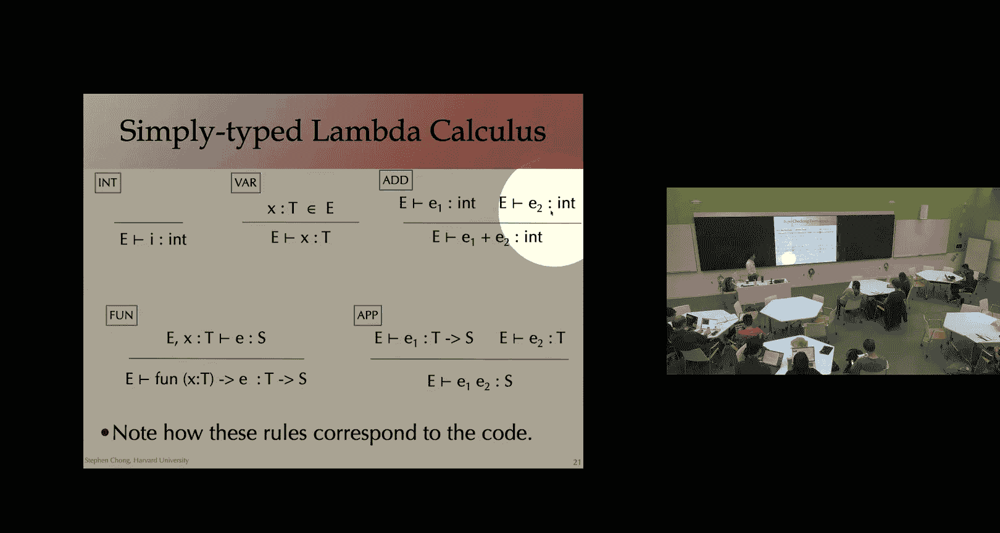

That this expression has type int。Okay， so this is what we're trying to prove。

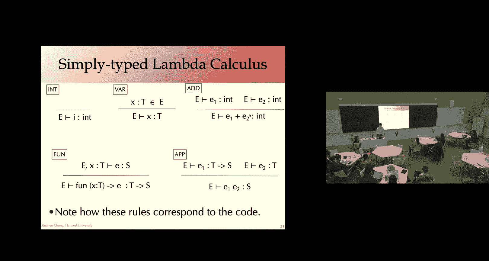

We're trying to type check that expression。Trying to find a proof tree for it。

Here at the bottom of the slide are the inference rules。So what we want to do is。At each step。

 we're going to instantiate and inference rule of these rules。So that it matches。

So that the conclusion matches this thing。So what kind of expression is this？

Function X goes to x plus3， applied to5。What kind of expression？Well's an application。

 It's an application， right？ And so there's only one of these inference rules whose conclusion is an application。

 the rule app。Its conclusion as application， E1 is the left Op R D2 is the right Op R。

So we're going to instantiate this application inference rule。Right here。

Expression E1 is going to be this function。 Fun X goes to X plus 3， expression E 2。

Is going to be the expression 5。The type S is going to be int。

And the environment E is going to be empty。Okay， so if we instantiate。This inference rule with that。

 What that means in this premise here。To iniate this premise。E is empty。

E1 is the function definition。 Fun X goes to x plus 3。Type S was int。We need some type T。

It turns out that E2。It has to be of type T。We're going end up instantiating T as int。

 So this premise here， E2 is the expression 5， S and T are int。So we've instantd that inference rule。

Appropriately。Okay。So any questions about that， The city of winds， we took the app conference role。

Instaniated it that is substituted in for capital E E1 E2 S&T in order to match this conclusion。

And this is what we ended up with。Is this clear？Okay， our next step in finding the proof is that we。

Want to see if we can come up with a proof tree whose conclusion is that fun X X plus3。

Is of type int arrow in。Okay， so what kind of expression is this？

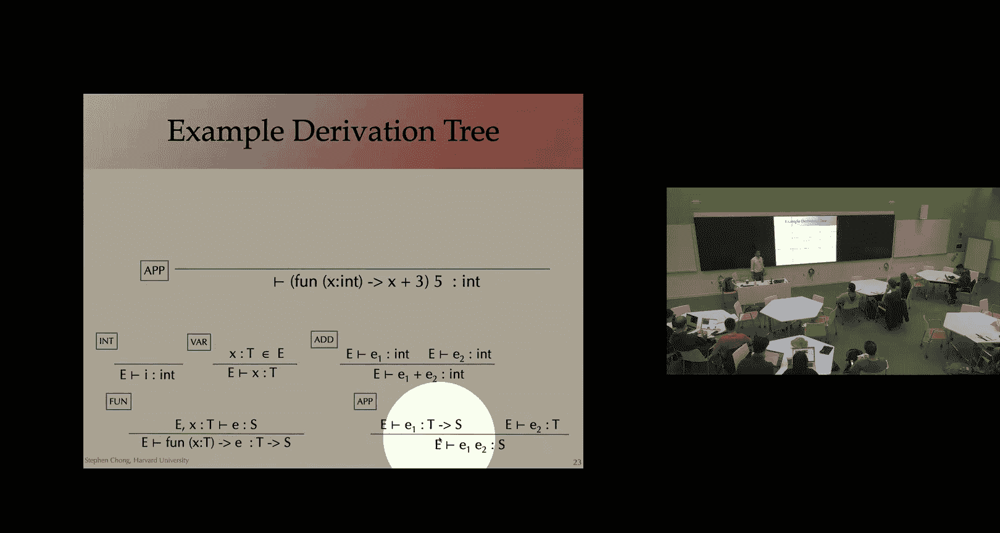

Just yell it up。Function， right。 And so there's one inference rule whose conclusion is a function。

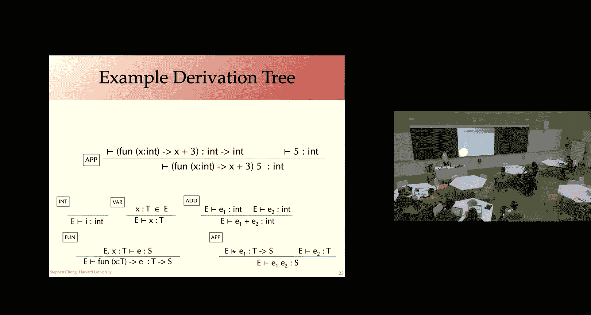

The fun rule。So we instantiate that。Meaning， and to iniate that， we end up with this premise。Right。

In the function inference rule， we extended the environment E with x going to T。

So here we extended the empty environment with x going to int。

 The function body X plus 3 has to have type int。In order for this whole thing to have type into  Arent。

So now we do the same thing。 We try and prove that the expression X plus 3 has type n。

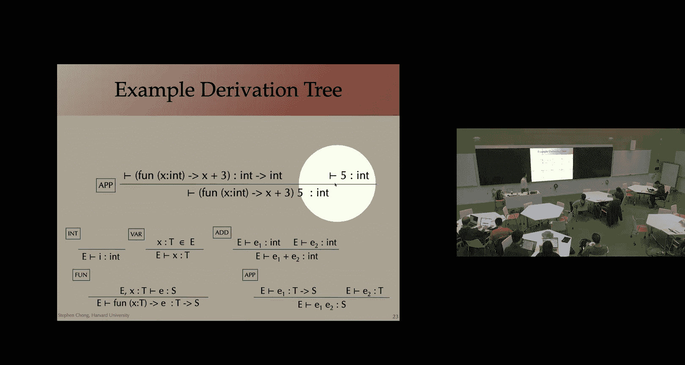

This is an addition。 So we take the rule for addition plus sorry add and instantiate it。

Meaning that we have these premises。 We need to prove that X is of type n and three is of type n。

To prove that x' is have  type end， we can instant the v rule。嗯。And this is an axiom。

 even though we've written this check that x of type end is in the environment。

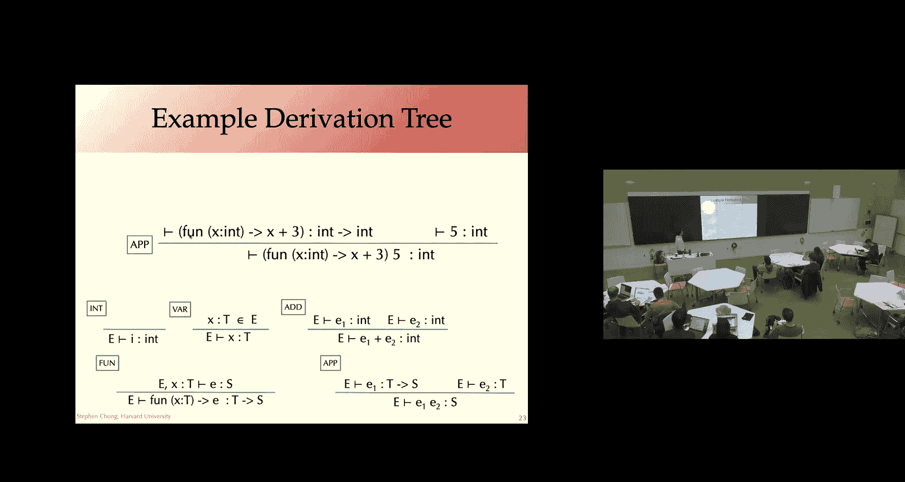

So we can kind of finish our search on that part of the tree there。

 right we've successfully shown the Xs of T end。We still need to prove， however。

 that three is of type end。And we can do that using the inference rule for int。You instantiate that。

 And that's an axiom。So there's no more premises that we have to prove。

So are we done with the proof tree。Call it up。No， we still have to prove that Five is of type end。

 so we can do that using the int。Inference rule andiated with IA mapping to five。报什么。

So what we have now is a complete proof tree。Every node， if you will。

 is an instantiation of an inference rule， a elegant instantiation， the leaves of the axioms。

 the conclusion is the thing that we were trying to show。😊。

Now the order that we actually did the proofing， this kind of depth first search。

 that was essentially the order that our Oamml type check function did。😊，To verify an application。

 we first of all， sorry to type check an application， you want to play to E2。

 we first type check D1 to type check this function declaration。

 we had to type check the body to type check in addition， we had to type check。The opera and so on。

Okay。So this is us revisiting this idea of inference rules。

 instantiating inference rules to come up with proof trees。

So this is a proof that this judgment holds， that this expression is well typed in the empty environment with type N。

Now， this idea of type safety。We can now phrase pretty precisely。

Now that we have these mathematical judgments。We can say that if expression E is well typed with type T in an empty environment。

Then there exists a value v such that when we evaluate E。It produces the value V。So again。

 I'm not going to prove it， but it turns out that this theorem is true。

For the simply type lambmbda calculus。Just like we were able to extend our language with Booleions。

 we can extend it with other language features， some ones that are going to be relevant to us in the language that we're dealing with are arrays。

so if we wanted to add as of values， we could add a new type。So。Tea。

 open and close brackets is the type of an array of tea。And we would add expressions。

Let's say for creating a new array and for accessing an array。

 So let's suppose that we create an array using new。New T E1 E2。

 the idea is that E1 is going to be the size of the array we're creating。

And E2 is going to be the initial value of every element of the array。

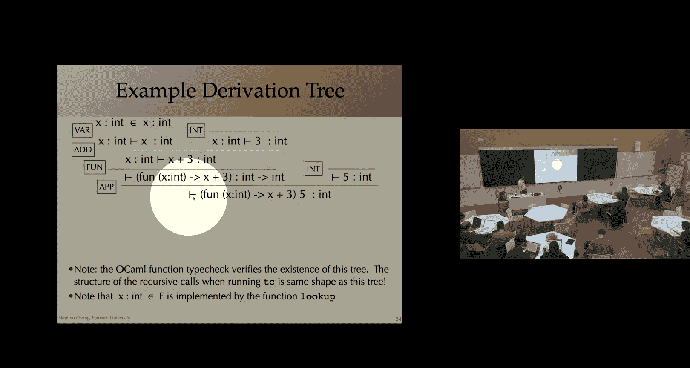

Okay， so here's a typing rule for it。 The type of new T E1 E2 is T array。 E1 had be be an integer。

 E2 had better be of type T， since it's the initial value of every element of the array。

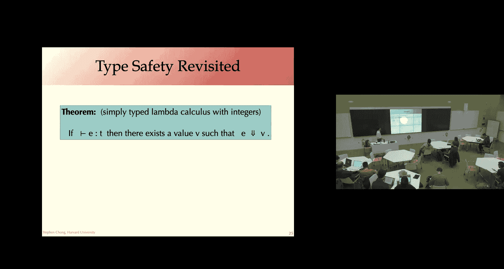

嗯。

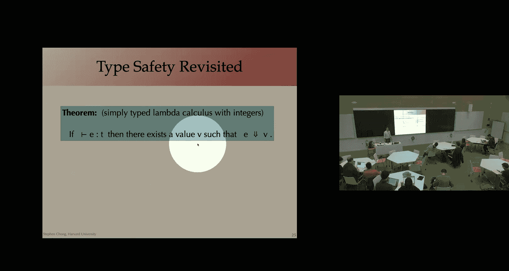

Accessing an array。So E1 index E2。E1 better be a an array for some type T。

E2 is going to be an index into that array。So an nt and the result of that expression is going to be a value of type T。

Okay， an element of the array。诶。Let's assume that array arrays are。Updable， mutable。

 So here's a rule for assigning into an element of an array。 E1 index E2 is assigned E3。

 E1 beta B an array of T， E2 bitta B an index， an integer， E3 B D bitta B。

 a value of type T expression of type T。um。I' point out that these inference rules are not checking that the index is in bound。

Right so this is an example of behavior that the type system is not ruling out。

So in order to make sure something bad doesn't happen。

 maybe it should be checked at runtime and an exception within the language raised that， for example。

 the program is able to deal with。Any questions about。Any questions about kind of this。

Quick sketch of adding a raise。

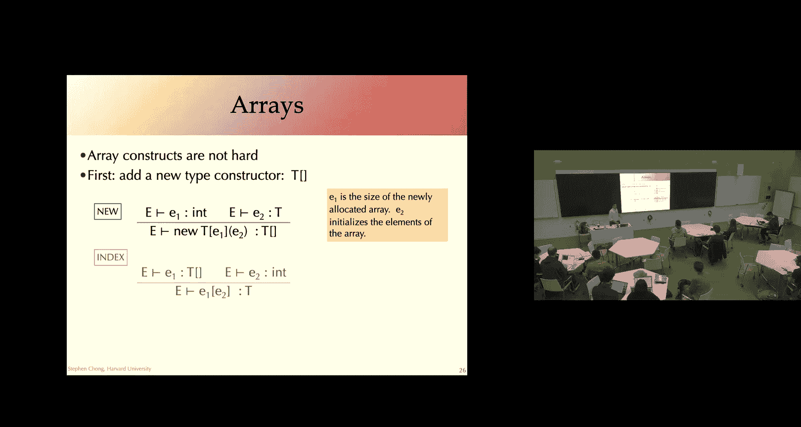

Okay。Let me in the last 30 seconds。Give you a new language feature。 Okay， tus。

 So a generalization of pairs， you're familiar with tus from Ocal。

 you've got some non number of elements of a tuple Thered be a new type constructor for constructing a tuple of size N。

And expressions to create a Tupple。Here's a  tapping rule for it， E went up to EN， E1 is of T T1。

 E2 is of T T2， E is of T E TN。The type of such a tuple is T 1 cross T 2 cross T 3， up to cross T N。

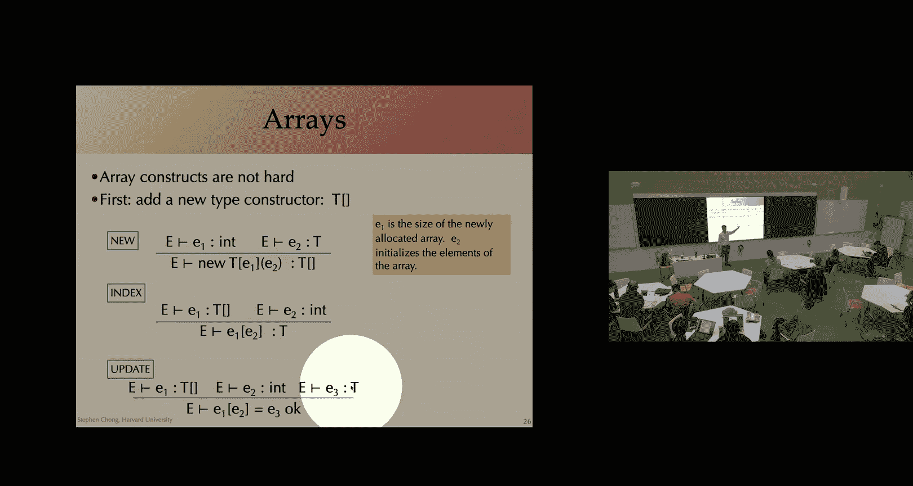

We can access the Ih element of a tuple with hash I Note that I here is not an expression。

 I has to be an actual integer constant between one and n inclusive。

 and that will give us back the I element。是。Okay， I'm gonna stop there because we're out of time。

 Next lecture， we're going to keep on going looking at how we can build up a type system to something closer to。

A real language that we'd want to use。 And then we'll also start digging into the typing。

 the type system that we're going to use for the next version of O。

 the next version that you're going to be compiling in homework 5。Okay， thanks very much。

 everyone else see you on Wednesday。这。没 show。好。あじ。啊。来的你看这边。ちしなと。呢个哋香港。还是。对，那个是。No。

If you still have to that check into。你这个。いやよ。it。系。

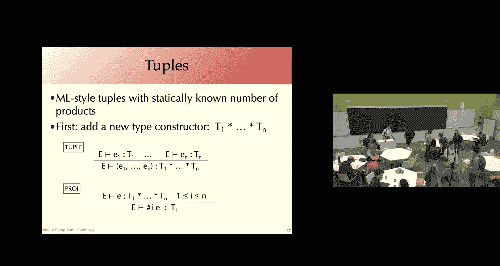

I just thinkBut I'm saying is like even if you are that practice。Right， like Cl might see that， okay。

 I'm one two it。Good year。This physicals a physical。でそ。the this possible every single week。

 the person who comes has the PhD in Harvard and has。😊，听讲。I' all complaining what is that Brown echo。

这个。You can change your seat you it。谢。是。我如果就跌方嘅。这个 dark。睇系真啊应该系系厉系。Oh，B eyes。

I didn't know know how to use。打看雨。我为。这你啊。also。Try to。I also try to。

Kind of looking at most like points。为观察。How I do not have like the advice to like be very about you。

紹か。嘛你。嗯那。Yeah， I don't know， hopefully this is late it similar level what were going to the last piece。

ButYeah， like I was like still， it was how it's still manageable。 Yeah，I like。At no point was a like。

Stuck in like corporate corporate。Especially because I have used Yeah。

 I'm going to talk a little bit。这首。Alright you you not gonna Okay work on this。是啊，所以三个肤要。不败。对不。

That's okay。 Yeah I right see you're you're not saying Im gonna bite Okay。

 yeah gonna gonna work on this。系啊，咩心有走。50。

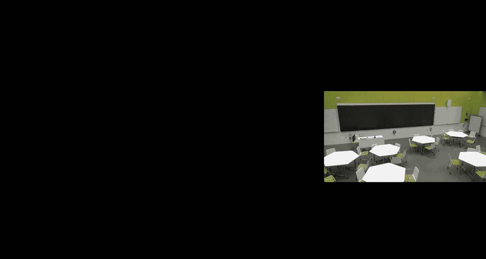