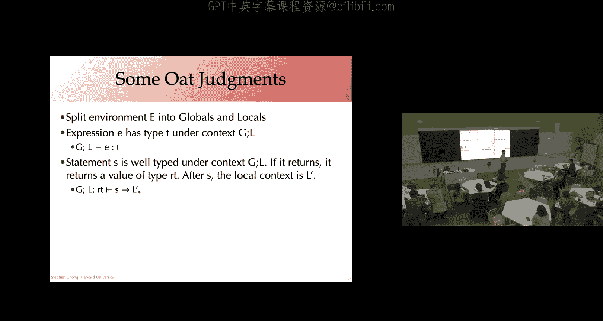
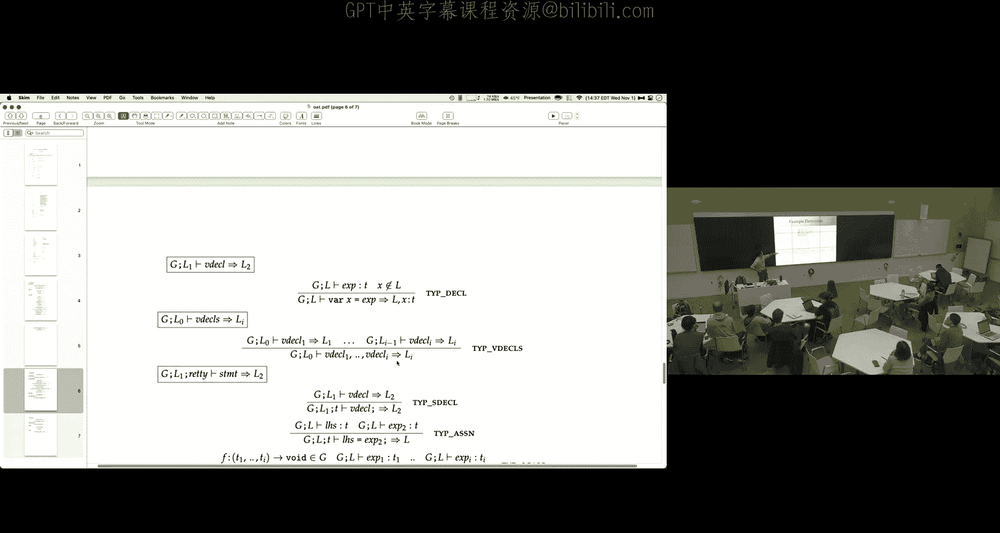
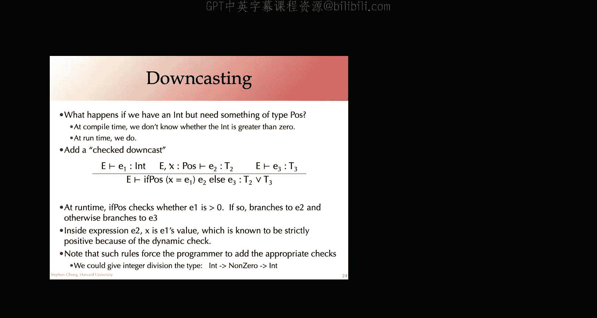

# 编译器课程：第17讲：类型检查与子类型


在本节课中，我们将学习类型检查的核心概念，特别是如何将其应用于Oat语言，并探讨子类型这一强大思想。我们将看到类型系统如何作为程序行为的近似，以及如何通过推理规则来形式化地定义和实现类型检查。

## 课程概述与作业提醒

首先，我们回顾一下相关的课程信息。

以下是需要关注的作业信息：
*   **作业3调查**：请填写作业3的调查问卷，目前已有约三分之二的同学完成。
*   **作业4**：截止日期为下周一，可以使用最多三天的延迟提交时间。
*   **作业3批改**：作业3的批改结果将于今天晚些时候返回。
*   **嵌入式伦理作业**：截止日期为今晚11:59，不接受延迟提交。
*   **作业5**：将于下周一发布。今天的课程内容与作业5高度相关，下周一我们会更详细地讲解作业5的说明文档。

## 回顾：类型检查与类型安全

上一节我们介绍了类型检查的核心思想：类型是对程序运行时计算行为的近似。我们有一个函数，它接收一个抽象语法树（AST），如果程序通过类型检查，则成功返回。



类型安全性的概念是：如果一个程序通过了类型检查，那么在执行该程序时，它将避免某些特定的运行时错误。

## Oat语言的类型系统

在今天的课程中，我们首先快速了解如何为Oat语言设计类型系统，下周一我们会进行更深入的探讨。

对于作业5，一个关键部分是向Oat语言添加类型检查功能，同时也会添加一些其他语言特性，如结构体（structs）。Oat语言的类型系统需要处理以下几个关键方面：
*   **命令式更新**：与之前学习的函数式语言不同，Oat这类命令式语言中的变量在执行过程中可以被修改。
*   **语句与表达式的区分**：语句（如赋值、循环）通常用于执行带有副作用的操作，而表达式则用于计算值。
*   **复杂的控制流**：包括`while`循环、`for`循环和`return`语句。
*   **全局变量与局部变量**。
*   **用户声明函数与内置函数**的使用。

为了在类型系统中处理这些方面，我们的判断（judgment）会变得更加复杂。例如，对于表达式`e`具有类型`T`的判断，其形式如下：
```
G, L ⊢ e : T
```
其中，`G`代表全局变量环境，`L`代表局部变量环境。

对于语句`s`，判断形式有所不同，因为语句不直接求值为一个值。其判断形式如下：
```
G, L, RT ⊢ s ⇒ L'
```
这个判断表示：在全局环境`G`、局部环境`L`和函数返回类型`RT`下，语句`s`是良类型的，并且执行后会产生新的局部环境`L'`。这允许语句引入新的局部变量，并使其在后续语句的范围内可用。

让我们看一下作业4文档中Oat类型系统的一些推理规则示例。

以下是表达式类型判断的一些规则：
*   **局部变量**：如果变量`x`在局部环境`L`中具有类型`T`，则表达式`x`具有类型`T`。
*   **全局变量**：如果变量`x`在全局环境`G`中具有类型`T`，则表达式`x`具有类型`T`。
*   **整数常量**：整数常量具有类型`int`。
*   **二元操作**：例如，加法操作`+`要求两个操作数都是`int`类型，结果也是`int`类型。



以下是语句类型判断的一些规则：
*   **赋值语句**：需要检查被赋值的变量具有类型`T`，并且赋值的表达式也具有类型`T`。赋值语句不改变局部环境。
*   **返回语句**：返回的表达式必须与函数的返回类型`T`相匹配。
*   **变量声明语句**：使用专门的判断来检查变量声明，确保变量名在局部环境中不存在（禁止遮蔽），并且初始化表达式的类型正确，然后将新变量添加到局部环境中。
*   **If语句**：条件表达式必须是布尔类型，然后分别检查`then`分支和`else`分支的语句块。在`if`语句之后，局部环境与之前相同，这意味着在分支内声明的变量作用域仅限于该分支。

这些推理规则简洁、明确地表达了语言的许多微妙之处，例如变量的作用域和遮蔽规则。更重要的是，这种表达方式非常自然地导向实现。实现类型检查器时，你编写的递归函数将直接反映这些推理规则的结构。

一个自然的问题是：全局环境`G`从何而来？它来自于对整个程序（即一系列全局变量和函数声明列表）进行类型检查的另一个判断。这个判断首先收集所有全局声明以构建初始的全局环境`G`，然后使用这个环境来逐一检查每个声明。

## 类型检查的证明树与编译即判断

使用推理规则进行类型检查，本质上是为具体的程序构造证明树，以证明该程序是良类型的。证明树可能会变得非常庞大，但其核心思想是：通过实例化推理规则并递归地为子表达式/子语句构建子树，最终形成一个完整的证明。

这个思想可以进一步延伸。我们可以将编译过程本身也视为一种“判断变换”。假设源语言有一个判断：在上下文`C`下，表达式`e`具有类型`T`。编译这个表达式时，我们不仅需要`e`本身，还需要上下文`C`和类型`T`等信息。

编译过程可以看作是：我们获取源语言中`e`是良类型的证明树，然后“遍历”或“变换”这棵树，将其转化为目标语言的代码（例如一系列指令）。这个变换过程需要保持一个不变式：生成的指令序列在执行时，会计算`e`的值并将其放入某个操作数中，并且该操作数中的值具有类型`TY`（即`T`在目标语言中的翻译）。

例如，编译表达式`37 + 5`时，我们递归地编译子表达式`37`和`5`，得到它们的结果和类型，然后生成一条加法指令来组合这些结果。

上下文`C`的翻译也很重要。在Oat中，由于变量是可变的，我们将所有局部变量和全局变量都翻译为指针。这样，在需要变量值（右值）时，我们通过指针加载值；在需要修改变量（左值）时，我们通过指针存储值。这种统一的处理方式简化了编译。

## 子类型：将类型视为值的集合

到目前为止，我们一直将类型视为计算的近似。另一种等价的视角是将类型视为标识了一个值的子集。例如，说`x`具有类型`int`，意味着如果`x`求值为一个值，那么这个值将属于整数集合。

基于这种“类型即集合”的观点，我们可以扩展类型系统，使其包含更精细的值集合谓词。例如，除了`int`（所有整数）类型，我们还可以有：
*   `pos`：正整数的集合。
*   `neg`：负整数的集合。
*   `zero`：仅包含零的集合。
*   对于布尔值，可以有`true`类型和`false`类型。
*   `any`：任何值的集合。

这非常强大，因为类型系统现在可以告诉我们更精确的信息，例如“这个表达式总是求值为一个正整数”。

添加这些新类型后，我们需要修改推理规则。有些修改很直接，例如：
*   整数常量`3`现在可以具有类型`pos`。
*   布尔常量`true`具有类型`true`。

对于`if`表达式，规则可以变得更加精确：
*   如果条件`e1`具有类型`true`，我们知道它总是求值为真，因此只需要检查`then`分支`e2`是良类型的，而可以完全忽略`else`分支`e3`。
*   类似地，如果`e1`具有类型`false`，则只需要检查`else`分支。

然而，大多数情况下，条件表达式的类型是`bool`（即可能是`true`或`false`）。那么整个`if`表达式的结果类型应该是什么？直觉上，它应该是两个分支结果类型所代表集合的并集。在我们的类型集合中，`pos`和`neg`的并集是`int`（所有整数）。`true`和`false`的并集是`bool`。

这引出了**子类型**的概念。当我们将类型视为集合时，集合间的包含关系自然诱导出类型间的子类型关系。如果类型`S`代表的集合包含类型`T`代表的集合，那么`T`是`S`的子类型，记作 `T <: S`。例如，`pos <: int`，`true <: bool`。

给定一个子类型层次结构，对于任意两个类型`T1`和`T2`，我们可以定义它们的**最小上界**（least upper bound, LUB 或 join）。LUB是包含`T1`和`T2`所有值的最小类型（在子类型层次结构中尽可能低、尽可能精确的类型）。例如：
*   `pos`和`neg`的LUB是`int`。
*   `true`和`false`的LUB是`bool`。
*   `int`和`bool`的LUB是`any`。

因此，对于条件类型为`bool`的`if`表达式，其类型规则可以是：分别推导`then`分支类型`T1`和`else`分支类型`T2`，整个`if`表达式的类型是`T1`和`T2`的LUB。这给出了对表达式可能结果值集合的最精确近似。

子类型关系应该是**可靠**的，这意味着形式化的子类型关系必须反映底层的集合包含关系。即，如果 `T <: S`，那么 `[T] ⊆ [S]`，其中`[T]`表示类型`T`所代表的值的集合。

## 子类型与归入规则

在包含子类型的类型系统中，一个常见的做法是引入一条**归入规则**：
```
    Γ ⊢ e : T    T <: S
    -------------------- (Sub)
        Γ ⊢ e : S
```
这条规则表示：如果一个表达式`e`具有类型`T`，并且`T`是`S`的子类型，那么`e`也可以被视为具有类型`S`。这意味着在任何期望类型`S`值的地方，都可以安全地使用一个类型`T`的值。

归入规则的好处是它将复杂的子类型关系隔离到一条单独的规则中，使其他类型规则保持简洁。然而，它带来了一个挑战：在寻找证明树时，对于任何语法形式，现在都有多条规则可以匹配（原规则和归入规则）。这可能导致搜索算法陷入无限循环（例如，反复应用自反的子类型关系）。

为了解决这个问题，许多实际的类型系统不采用显式的归入规则，而是将子类型关系直接内嵌到其他规则的 premises（前提）中，确保每个语法形式只有一条规则可以将其作为结论。这种风格被称为**算法类型系统**，因为它更直接地对应于可实现的类型检查算法。

## 向下转型与动态检查

子类型虽然强大，但在实际编程语言中，有时我们需要显式地将一个值从超类型“向下转型”为子类型。例如，类型系统可能只知道某个值是`int`，但程序逻辑需要它是一个`pos`（正整数）。

为了安全地进行向下转型，我们需要在运行时进行检查。有几种方式可以实现：
1.  **带检查的转型操作**：例如，一个操作`cast_to_pos(e)`，如果`e`的值是正数则成功返回`pos`类型的值，否则抛出异常。
2.  **类型测试分支**：例如，引入一种新的`if`结构：`if pos x = e1 then e2 else e3`。这里会动态检查`e1`的值是否为正数。如果是，则在`then`分支`e2`中，变量`x`具有更精确的类型`pos`；否则执行`else`分支`e3`，且`x`没有更精确的类型信息。

这种机制将静态类型系统的精确性与必要的运行时检查结合起来。程序员在无法静态证明属性时进行动态检查，而在可以静态证明时则无需付出运行时开销。例如，如果我们为整数除法定义类型 `int → nonzero → int`，那么程序员只有在能证明除数非零时才能使用它，否则就必须先进行运行时检查。

## 课程总结

本节课我们一起学习了以下内容：
1.  **Oat语言的类型系统**：探讨了如何为具有可变变量、复杂控制流的命令式语言设计类型判断和推理规则。
2.  **编译即判断变换**：了解了如何将编译过程形式化为对源语言类型证明树的变换，并保持特定的不变式。
3.  **子类型**：深入探讨了将类型视为值集合的观点，从而引出子类型关系、最小上界等概念。
4.  **子类型的规则**：介绍了归入规则及其带来的挑战，以及算法类型系统的替代方案。
5.  **向下转型**：讨论了在需要更精确类型时进行安全向下转型的必要性及实现方式，包括运行时检查。




这些概念为理解和实现作业5中Oat的类型系统（将包含子类型和检查转型）奠定了坚实的基础。下周一我们将进一步探讨作业5的类型系统细节。