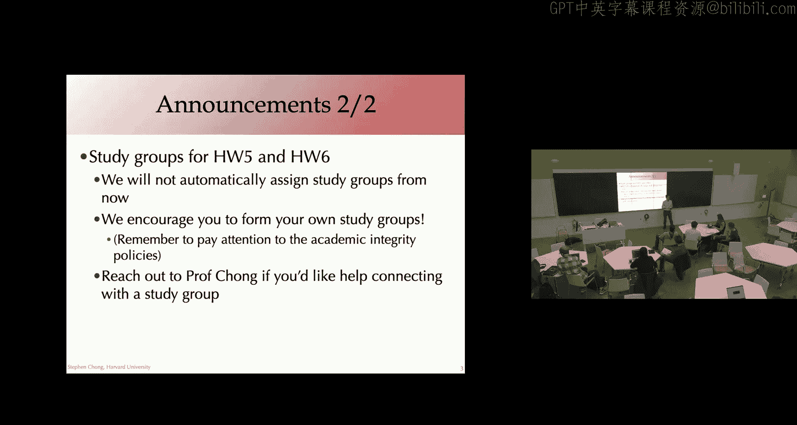
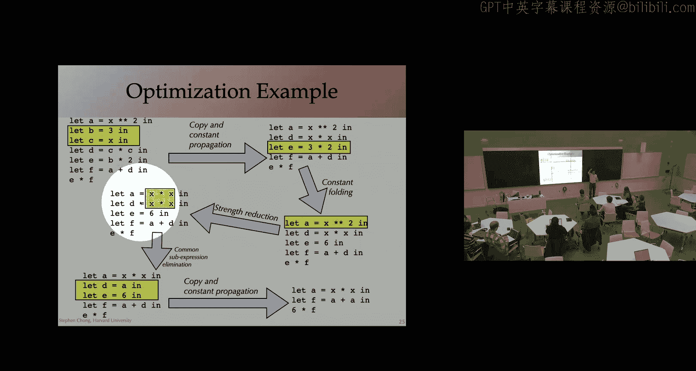
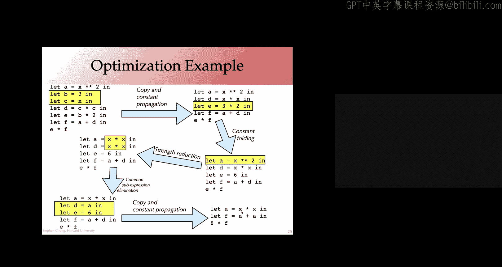

# 哈佛大学《编译器｜Harvard COMPSCI 153 compilers 2023》中英字幕（claude-3.7-s p19 1699452900-Compliers_on_11_8_2023_(Wed).zh_en -BV14PAUejE98_p19-

All right， welcome everyone。呃。Look like there's a very short turnaround time from people coming in to getting started。

 but let's just jump in announcement。嗯。Homework 4 was， of course， due on Monday， but three late days。

 and know up to three late days worth of late minutes means。

 and a lot of people are continuing to work。On it， so when you finish the homework。

 please fill in the homework survey， I will try and remember to email people of that so you have an easy link to it。

As you know， homework 5 is out and during in a bit less than three weeks， as I mentioned last time。

 the homework 5 scaffolding code contains most of the solution to homework 4。

 So we're not releasing the code yet。 if you want to get started let just send us a private message on Ed or email us。

And we'll get that to you。嗯。spiitta， okay。um。Finally， study groups for homework 5 and homework6。

 as I mentioned a few weeks back， for homework5 and homework 6。

 we weren't going to explicitly assign study groups， hopefully through homeworks 2， three and four。

 you've had a chance to meet some people in the course。

 hopefully of course some of the benefits of study groups within compile's class。

 hopefully have enough sort of social connections that if you're interested in doing that for the last two homeworks。

 you have the connections to form your own study groups。

If whatever reason。You feel like you don't feel free to reach out to me and I'll match up the people who reach out to me essentially giving a less formal。

 more opt in， rather opt out process for study groups for homework five and six。

Any questions on anything on the academic side？Okay。So。

Kind of getting towards the end of the course right in the sense of you know。

 Thanksgivings coming soon and then there's just a week or so of classes after that and we're actually starting a new topic today and we'll be jumping through a bunch of topics of the next couple of weeks。

Today， we're going to start looking at program optimization。

 And as you can see from the plan for today。Big part of it's actually just going to be going and giving you a bit of a flavor of many。

 many different optimizations。 So well。Jump in and we'll see how far we get today's class。

Before we jump into specific optimizations， though。What is an optimization？So as you know。

 the code generated by our O compileil compiler so far is pretty inefficient， right。

 We encourage you to store all arguments and local variables on the stack。

 and every time you need them， you pull them in。 So what that means is that there's a lot of redundant and unnecessary。

😊，Moves。From the stack， from memory into registers， and then again from registers back into memory。

There may be lots of unnecessary computation。Going on as well。So let's take a look at this O program。

 This function food takes an input W four lines of code R x equals 3 plus 5 R y equals x times W v equals y -0。

 return Z times 4。If we compile that using at least the version of the staff's code。

 we get assembly that looks like this。 It doesn't， even in relatively small font， it doesn't fit on。

 It keeps on going to I don't know where。 You can look at it and make sure you understand what it does。

 but lots of moves to and from the stack。嗯。There it is all of it up there。Now。

If you were trying to write optimized assembly code and you satAT down and thought， well。

 what is this function doing？Could I write it more efficiently？

How many instructions do you think you could get to？Does this include like a car allowed on love？

How many lanes do you think it would take to implement the function？

ThatSo that it would meet cool conventions。 So it needs to be usable。From other spaces。好先问。

LetSee the function sure， let's go back。Let's say hands up if you think itll take at least。5。

Assembly instructions。4。3。2。Wen。Whoa， some bold claims it's zero。 Yeah， okay。😊。

What it's actually computing is really just。Taking the argument。

And then multiplying it by two to the five， which we can end up doing with a arithmetic shift right so people who sit around three is。

3 is4ish is about right。😊，Note that this meets all of the requirements for a function right is taking the argument in the appropriate register。

 it's returning in the appropriate register， but because the function is so simple。

 it doesn't need to worry about things like doesn't need to do any saving of registers so the preamble and postamble doesn't really need to do much。

 it doesn't need to take care of storing away the old base pointer value and so on。And of course。

 the function food might then be unlined by the compiler。

 We'll talk about that a little more later in the class。 And if it did。

 this could actually end up being implemented just essentially in the one instruction， error。

 the logical shift。Yeah was I mean， inline seems better。

 but I was going to say if you did like a load effective address Q thing。

 you can maybe do a multiply by 32 with RBI and。Nice， yes。😊。

We aren't going to touch much on instruction selection， but X 86 has so many different instructions。

 so many different flavors and variants that actually figuring out the best possible instruction or the sequence of instructions to use is often really。

😊，Challenging， encounter counterintuitive。 Are you're right。

 this is not to say this is the best possible implementation。Go。So there's a big opportunity， right。

 a big opportunity to go from large amounts of the assemblyly code to。😊，Susinct amount of code。

SoBut why do we need them， what is the actual benefit of optimizations？In many ways。

 having a compiler that's good with optimizations allows this kind of separation of concerns。

It means that the programmer。When they're expressing the computation。Gets to write at a high level。

They get to write modular clean programs that don't need to worry about the low level implementation details。

We don't want to be thinking about。When youre writing a program at a high level。

 you don't want to be thinking about what it's going to look like an X86 assembly code。

It's kind of the wrong level of abstraction to be thinking about， and to be honest with you ideally。

 the programs you're writing are agnostic as to what architecture they're actually going to end up executing on。

So that it can be compiled for X86 or for arm or for risk5 or whatever other machine you want。嗯。

And so because of this idea that in general， with our human facing programming languages。

We want to hide away and abstract away low level details of efficient execution。It often means that。

诶。At the high level， you don't have a way of easily expressing code。That is going to be efficient。

 That doesn't involve redundant computation。 So， for example， here is。You know。

 a line of code that increments。An element of an array。

And you see here that you can anticipate that if you just。Compile this code in a straightforward way。

 you'd end up with a redundant computation， this array axis， a index I index J。

Is going to be computing a memory address using the base point of A， I and J。

 to compute a place to read from memory。Take that value， add one to it。And then。

 on the left hand side。It's the same address， right？The IJth element of the array A。Now。

 there's often not going to be an easy way at the high level programming language to actually factor out that redundancy。

Right。Or you might be able to。But it might make the code much harder to understand and to maintain。

And so for that reason。Having the compiler be responsible for making the code efficient。Or optimal。

Makes a lot of sense。We've already talked about architectural independence。呃。The way。

 we'll also mention that。We' already talked about the idea with modern architectures。

 the instruction set is kind of more like an interface。To the processor。

 which then implements that instruction set。Often in a very。

Com way essentially having itself having a compiler to implement it in low level operations and a lot of the time the processor is actually making assumptions about what what form that assembly will have it's assuming that various optimizations have been applied to it so that in that common case with the optimizations have been applied。

 its implementation will be working to。To make the code run even faster in those settings。

There's a few different reasons why we might want to be doing optimizations。

Maybe the most obvious is that we're trying to improve execution speed。

 We're trying to make it faster to perform the computation。

But we might also be concerned with optimizing the amount of space， the amount of memory required。

 This might be because we might be in a setting with constrained resources。

 but this might indirectly have impact on the。The speed of the execution， as for example。

 you have less memory pressure， more efficient use of cache lines and so on。

You might also be interested in optimizing for power consumption。

Lower power consumption to extend battery life， think about writing code。

 say for a sensor that's deployed， it's meant to operate for a year or two without a power supply and power is a very scarce resource。

 so the compiler may actually be explicitly optimizing for reduced power consumption rather than speed。

Some things to note about some warnings about optimizations， theyre code transformations。

We can apply them at any stage of the compiler this might be at the high level language representation。

 the intermediate levels， the various intermediate representations we have， or at the low level。

 the assembly level， we can provide these transformations。The transformations should be safe。

In the sense that when you apply a transformation， you are ideally not changing the meaning of the program。

You definitely wouldn't want to change the result。There's been computed。

But you may also not want to change various other characteristics of the program。

 such as how behaves on values。On certain values that are applied that might be given to a function。

 you might want to make sure that it behaves the same before and after the optimization。嗯。

In order to do that， in order to ensure that the optimization is safe。

 this might require program analysis。So that is analyzing the program， understanding what it's doing。

 understanding the opportunities to apply optimizations。

 and we'll be seeing this crop up in lecture today。

 but we'll be looking in more detail next lecture on some kinds of program analyses with the results of those analyses may it help us identify places to perform optimizations。

嗯。We might also want analysis to figure out whether a transformation is actually worth it。

And by that， I mean that we use the term optimization， but it's a bit of a misnomer。Typically。

 there's no guarantee that a transformation is actually going to improve performance。

And there's often。Not clear that there is a notion of the optimal version of the code。

 let alone that the transformations that we're applying is actually going to reach any form of optimality。

Instead。It's more heuristics about what optimizations tend to work。

 maybe program analyses to understand the impact of a transformation and whether or not that will be worth it。

We're really going to just scratch the surface of optimizations in this class we're going to take a look at some of the most common and valuable performance optimizations I have a textbook on my shelf muchn advanced compiler design and implementation I forgot to bring it down today it's thick it's a classic compiler textbook and about 10 of the chapters are devoted to various kinds of optimizations so would be easy for us to have a whole course on optimization。

But with that， we're going to get right now， a pretty whirlwind tour of I didn't bother the counting。

 but I think over 10 optimizations。Any questions at the moment？we jump in。

So our optimization typically done in like。The step from high where are optimizations typically done？

It varies depending on the optimization， I think many of them are done at the intermediate representation。

呃。And。Although some of them will get more benefit from either a higher level or a lower level transformation。

 And as we'll see， one of the things is that。A program might often benefit from the same transformation being applied multiple times。

 and this is because as you transform the program， if I perform optimization A。

That might change a piece of code so the now optimization B can be applied。

And after I done not optimization B， there might be now more opportunities to apply optimization A。

 So we might end up applying optimizations multiple times。

And then also the idea that we apply them at different levels of abstraction。

 so we might end up applying the same or similar analyses。

 say at the assembly level and at the intermediate representation level。But off the top of my head。

 it's a。Most optimizations are done， or many of the code transformations we'll be looking at are typical implement at the AR level。

Thanks。Any questions at the moment？Okay， let's jump in。 first optimization， constant folding。

So the idea of constant folding is if you have an operation。

And you know what those opera ends are at compile time？

We may as well do that operation at compile time。Instead of needing to pay the computation cost every time we encounter it at runtime。

So， for example。X is assigned 2 plus 3 times y， hey，2 plus3。

 the opera ends for the addition are known statically。

 so we may as well do it statically and convert this into five times y。B and false。

Here we know that this is going to evaluate to false so we can just。嗯。Immediately。

We can transform it to false。So let's take a look at this。First example， again。

 two plus three times y goes to five times y。So what are we actually trying to improve here with this transformation？

But the number of calls to maybe a multiple。Okay， well， this would get。

 this wouldn't be a call to a function eventually， right？How do I face it at6 instruction lines？

Like the number of times you see an air。Okay， so reducing the number of like assembly level instructions that we need。

That's good。 this is quite likely to do that。What else？Might this be good for？不려哎。

And also probably it will reduce time execution， especially if you do this like a lot。

And a wasting time attitude was three。Right， so by reducing the assembly instructions。

They will often reduce， not always， but often reduce the amount of of time needed to execute the instructions。

Great， Maddie， do you have another one， Yeah， like space， I guess you might need a right？有是。Oh。

 interesting so。Part of this is that when we actually implemented a low level。

 if we were executing this at runtime， we'd need registers to hold the values two and three and perform the operation。

And so by doing this statically， we're actually less use of registers， great？

Yeah I think if we do have our unopimized approach when this gets compared to all of the under UID for two plus three。

 which means when it gets compared to assembly would also have。ャ。right， bit of。Great。

 so depending on how we're compiling down through the various levels that having been an intermediate result may be taking up。

Memory and so on still on the line of reducing number of 7 expressions that also reduce the size of your excutable。

Right， reduce the size of the code and might help your code cache behavior。Great。Cool。

 so this relatively subtle transformation， you know。😊。

Has potentially a lot of impact on the way the program executes。Many of them are likely to be good。

But it's hard to actually tell。 So， for example， this idea， let's say， the latest one where。

We changed the size of the code。That we're using to represent the program and as a result。

Hand waved and said， oh， maybe this gives us better code cache performance。

 So that is when the machine pulls in the pieces of memory that's containing the code。That because。

The code in total is smaller， this should be good， right？

It might turn out that by having this line of instruction be represented in a certain number of bytes。

 other code， the placement of other code shifts a little。

And maybe that turns out that some piece of code is now actually over a cache line。

And so we might have actually made the code caching behavior worse。

Maybe it turns out that we now need to be doing， we're getting worse cash performance。

Just because of the way the execution pattern happens to be accessing the code。So， in general。

The question of whether a particular optimization is going to improve performance。

Is hard to figure out and indeed undecidable if you think about， you know。

 I could probably set up something where。Based on if this function returns true。

 then the subsequent execution of the code will be better off。If we made that transformation。

 if it returns false， then the way the program is going to execute。

 we'd be worse off with that transformation。And of course， in general， deciding whether a function。

 figuring out what a function is going to return。Will be undecidable， right？So what this means is。

It is about heuristics。So what step could we apply， Con folding。At like the AST level。

 because we can split a government bus two color three。Yeah， so we could do it at the。

 at the source language level。Previously， we' would also do it at the intermediate representation and these are typically more commonly done at the intermediate representation level。

嗯。It's a bit harder to do at the assembly level， it's possible。

The reasoning might be a little less local than in situations like this。

definitelyfinite possible this include if I like declare a variable？Here is is just like。

 what are you talking about？嗯。Yes。I'll push that off for a slide or too， but。

Many programming languages allow you to clear values as being constant。

 meaning that after theyre declared they won't be changed。

 and that actually enables some compiler optimizations normally that normally would refer to replacing。

A value a constant value with its sorry a constant variable with its value as constant propagation。

But the point being that。Once we've replaced。The use of a constant variable with the value that we know it's equal to。

 its's constant value that might enable constant folding。

So constant propagation and constant folding。Go hand in hand。Yeah。So。T to decide when。When is。

It's safe to apply constant folding。William， your hand went up first。 here William。

You have something like。In C you divide by and multi divide by。

 well maybe this is just a language court but because we have integer of four division。

 this is not a equivalent integer。Right。Taking a step back。

 you're absolutely right what we need in order to figure out whether it's safe to apply an application is。

In many ways， we need an understanding of the program semantics right We kind of said at a high level。

 we want to make sure that the transformation we're applying doesn't change the meaning of the program in order that we actually need to know what the meaning of the program is。

嗯。So the Boolean values。Pretty much yes， you can always do this for integers almost always。

 but there are some subtleties， one exception would be division by zero but overflow concerns may mean that something that in the semantics of mathematics would be allowed may not be possible when you're talking about machine inteagegers of I say 64 bits or specific representations。

嗯。For floating point numbers。It's really， really difficult。 The floating coin numbers。

 we often think of them as， they're kind of like rationals。

And so a lot of the time we might think that the transformations we apply to floating point numbers are okay as long as the transformation makes sense in the field mathematical of rational numbers。

Mathematics， it turns out that。It's actually pretty subtle about how errors propagate with floating point representation。

And also what the。What the precise meaning of a floating point computation is。And whether or not a。

A transformation might be acceptable with respect to。

The semantics of the floating point numbers or our intended use of them。Maybe it is okay。

That the transformation won't give us the exact bit equivalent value of a floating point number。

If we reordered some operations， for example。嗯。Right。

 so whether optimization is safe depends on the languagemantics。

What's interesting is that languages that provide weaker guarantees to the programmer often permit more optimizations。

嗯。The challenges that。In those languages， there might be some ambiguity about the behavior of the program。

And so by that， there's actually。One example of that is within the C programming language。

 if you actually read the programming language spec。

 there's a lot of situations where the behavior is undefined。Right， meaning。

That the compiler is free。To choose the behavior。Now。

 what's happened in the last few years is the compiler writers have been taking more advantage of that。

 They're saying like， oh， well， this is undefined behavior。So I can do anything I want。

And what that means is that there might be more opportunities to apply an optimization。

In the sense that the optimization does the correct thing where behavior is defined。

And it does something completely unexpected and counterintuitive from the programmer's perspective。

 when behavior is undefined。 But that's okay。 Beor is undefined， and there were no guarantees about。

The computation that is produced。Problem。Is that prior to those optimizations being applied。

 So go back 10， 20 30 years， the compilers were doing reasonable things on those undefined behaviors。

And programmers came to rely on them。Programmers were like， well， I read my program。

 I compiled it and it did what I wanted to do， so I wrote a good program， I wrote a correct program。

And then the compiler kind of changed its implementation。

So that what the programmer previously thought was correct turns out to have been relying on undefined behavior of the language that the compiler happened to implement in a particular way。

 when the compiler changes its implementation。Sudden。

 a whole lot of programs that had been around for 10， 15 years broke。

And this is really in part because there were relatively weak guarantees provided to the programmer。

When at runtime you get this value， it's undefined。And whatever the program does is fine。

Not enough coffee and not enough time to prep this lecture。Example of undefined behavior from C。

 anyone？Signed into overflow。 Great， That's a great one because it typically behaves in a really predictable way on most machines。

 Walden by0 shifting by0。 interesting。 So the language specs is it's undefined。😊。

And most compilers might well implement this by treating as a No opP or the identity function。

 but they don't have to， and there might be a situation where're like， oh， if this value is zero。嗯。

Then it would be really efficient for me to do this other thing to make this transformation。

 which works completely fine when it's non zero and zero you get some wacky thing。

 but that means this other line of code works really well。Great。Yeah。

 so there's a whole lot of subtleties in the language spec。😊，Of C。嗯。A small plug for CS S1。

52 and other kind of formal approaches。 So this can get really subtle and really unclear。

 So whether or not a transformation is safe might actually come down to， as we said。

 the semantics of language， which can be challenging to reason about。 So there are。

Some languages and some compilers， where there is actually formal proof。

Of the safety of the compiler， that there iss a clear definition of the meaning of a program。

 the idea that the compiler is preserving that， and that allows this actually well principled mathematical approach to figuring out a transformation whether an optimization is safe to apply。

Okay。Constant folding， we spent a while on it。But it was the first one and we brought up a whole lot of interesting issues。

Next optimization， algebraic simplification。 This is kind of a more general form of constant folding。

The idea is that you take advantage of mathematically sound simplification。 So， for example。

 replacing a times1 with a right， It's not constant folding。 the opera ends are not both constants。

But。嗯。We know that taking something and multiplying it by one just gives back the thing。 Similarlyly。

 a times 0 was 0。 A plus 0 was a a minus0 was a。Be or false is equivalent to be。

 B and true is equivalent to be。嗯。More suddenly， there might be reassociation and commutivity。

Given a plus B plus C， do we compute first A plus B add a result to C？Or the other way round。

Similarly， are we doing A plus B or can we swap the order and do B plus A？Now， for some types。

 for some kinds of values， this might be problematic。

 So we already talked about floats and the idea that reassociating。

Floats might actually give you a different answer if we're concerned about overflow。

The order that we do operations and might trigger an overflow。

 which based on the semantics of the language may or may not give us the expected answer。 So again。

 we need to know the semantics of the language to figure out whether these transformations actually make sense。

 whether they're safe the respect to the language。嗯。

Why might we want to perform algebraic simplification。

 so definitely sometimes it might make our reduce operations at runtime。But。

One other thing is that if we。By performing algebraic simplification may enable other optimizations。

 So a plus 1 plus 2。If we change the order of that and do a plus one plus 2。

 suddenly we can apply a constant folding and replace one plus 2 with three。嗯。In a similar way。

 providing commutivity and。Reassociating results allows us to transform2 plus a plus4。

 ultimately into a plus6 by。Swapping the order， reassociating， and then constant folding。Right。

 so as I've touched on this idea that iterating the optimizations can be useful。

 so you can imagine performing some algebraic simplification that enables some constant folding。

 once you've got that constant folding， maybe there's other simplifications that you can apply the workout。

One of the challenges is。How much？How many times should you iterate some sequence of optimizations？

And in general， this is heuristic。 you might say apply some sequence of optimizations。

 let's say two or three times。to try and take advantage of things。But again， another place where。

You know。We're using heuristics as opposed to。Trying to do anything that's specifically optimal。

Any questions about algebraic simplification？Okay。The next optimization。Strength reduction。

So this is the idea that you're replacing an expensive operation with a cheaper operation。

And the canonical example of this is if we're multiplying by a power of two， let's say a times 4。

It turns out that way down the assembly level， this is cheaper to do by a bit shift。

By shifting a2 bits to the left。Even if we're multiple and base something that isn't a power of two。

 it might actually be cheaper for us to transform an expensive operation， multiplication。

Into in this case， a times 7， transforming it into a lift shift， left shift。

 a shift by three that is equivalent to a times 8。And a subtraction。Minus a。And， of course。

You can get pretty complicated， right？And so again， this idea of taking an expensive operation。

 in this case， division。And turning it into addition of two bit shift results。Right。

Is going to require， essentially a。Cost model。Of the architecture。

 like how expensive are these operations。嗯。诶。How many cycles are they going to take to perform them and is the transformation worth it？

So， this is。I was going to say this is typically done at pretty low levels。

 so assembly or IR that's very close to being transformed into assembly so that you're making these transformations with knowledge of the architecture and which operations are going to make senseys question。

On the topic of like division， I don't know if anyone has seen like compilers。

 especially on like03 on' do for like division by constant， it's absolutely wild。

In divisionion by five or something it would be this crazy multiplication of the shifting garbage that's happening Basically。

 you're like multiplying by the two to the whatever divided by5 instead。takingYeah。被告。Thatscin。Yeah。

You do。 So one of the links， well， you know， obviously， you can be used， excuse me， excuse me。

 using the compiles one of the links and the resources page on the website just gives you an online approach to。

To get immediately the results of transformation， so that'll be a fun one to try up。

Thanks for sharing that。All right， next optimization。Constant propagation。

 so we talked about this already briefly， if the value of a variable is known to be a constant。

 you can replace the use of that variable by the constant。嗯。So this is essentially just substituting。

A value。 So here into x equals 5。 that is we know that5 that x is equal to 5。From this assignment。

Until x is reassigned， which in this coder it does not。

 So what that means is that we can replace the use of x in the subsequent line x times 2 with the value of x5 times 2。

 and then of course that allows us to perform what optimization。Sorry。Constant folding， right。

 and we can replace five times two with 10。And what does that then enable？Just yell it up。

Conant propagation， right， Y is equal to 10。 so we can replace the use of 10 of Y with 10。

And so yeah， as we already touch on constant propagation， constant folding very much go hand in hand。

 propagating the constants enables the folding。In order to figure out when it's safe to apply constant propagation。

 I already alluded to this idea that。You know， that value of x， we knew it to be constant。

 equal to5 until x gets overridden until the next definition。So in general。

 we're actually going to need a program analysis at what's known as a data flow analysis to be able to figure out。

 hey， at this point in the program。What呃。Is the variable equal to a constant value or not and appropriately propagate those facts around based on the definitions of variables？

嗯。What performance metric does it intend to improve？is basically the same thingがね。Cause。

You could argue that it solely exists to enable concepting。我明嘅嗯。

So if there was an opportunity to propagate a constant， but it did not lead to constant folding。

Does that mean we shouldn't propagate it？We should。Sot is actually a strong moral imperative。

Is it going to be worth it to do it， maybe？😊，Yeah， do you have a comment。

I guess if x doesn't get reassigned， that's somewhere down the line。

 then it saves the space that has been taken by variable。Right。Yeah， so。

That's we're going to see soon， this idea of deadcode elimination。

 the idea that by constant propagation， we you know。

 maybe we don't end up using the variable X at all。

 meaning we can get rid of the definition of X and so on。 So right， constant propagation can enable。

Not just constant following， but also other。Optimizations as well。Yeah。

 it's probably a bit silly would like。Have you got a program that doesn't depend on anything external to the program。

But our optimizer just like optimizer just a single line。

 is that even possible or it just somewhere computer？Yeah。Sure answer is， yes。

 it might be possible to。If there's a program that't produce' read that doesn't take any input。

Every time you run it， it produces the same result。嗯。You could， in theory， compile it。

To just be they constant just immediately return the result。

One of the questions is what kind of optimizations and analyses would you need in order to do that？

A lot of the optimizationizations that we're going to be talking about are essentially local。Right。

 so they're making these。Modifications are locally within code and the reasoning about the correctness of that transformation。

 say with。Constant folding。You really don't need to look anywhere other than that little line of code。

 place that you're performing the optimization to reason about its correctness。

We've touched on this idea of constant propagation where， okay。

 you do actually need some program analysis。In order to figure out at this line。

 this use of a variable is， in fact constant。And that's going to depend on。The definition site。

 where that is in the program， but also。A the code in the program and whether or not that might overwrite。

The definition， their constant definition before control flow reaches this use。

But it's still nonetheless local in the sense of its。Typically looking within the same function。嗯。

Some of the programs you might write， even if they're computing the same result every time you run it。

 might be doing relatively complex things， creating data structures and memory。

Writing into that data structure， reading from that data structure。

And so the reasoning that a compiler might need to do in order to figure out that， oh。

I know exactly what this read is might be hard Or， oh， hey， look。

 I've got a traversal of a binary tree summing up the elements。

And being able to realize that I can replace that with a constant value is actually really sophisticated。

Kind of analysis Yeah， that you be doing， I just it seems like all of the optimization you've done so far could be summed up as like。

 look for a block of code that is independent of everything around it and replace it with like。

A single line of code。Like why got you just use this as like your rule of thumb and like， okay。

 say IC assembly， I like mark things that are like dependent on Google somehow and anything any block that's being independent to like。

Ex things I just yeah， it。During conslation time that right。

 So maybe one of the this really nice idea that， you know， can I just。

Have an analysis that kind of tracks dependencies figures out when something depends on something external。

And then kind of simplify the things that don't depend on external things。One of the challenges is。

Is what do we regard as external。 So that is what do we。What are we considering at the moment。

 And so I talked about this idea that for a lot of this stuff， we can do it very locally， you know。

 a line of code by itself or a function at a time。So if I see。

A function that's reading from a memory address is that external or not。Right。

 it's external to the function in some ways， Right。

 because we ever put the value into that memory location that might have happened somewhere outside of this function。

 It might be internal to the program。 And the sense that。You know。

This didn't come from the environment。 It wasn't read from the file system or anything like that。

 and so kind of。Moving your lens outwards and seeing more of the context might allow you to figure out that it was。

You know， to resolve that dependency。Statically at compile time and understand what its value is going to be。

 But in general， those kinds of things can get really complicated to do。U。Right。嗯。Oh， I guess1。

 I got a bit distracted from performance metrics。 It's intended to improve。

 probably its biggest use is actually enabling other optimizations， but。

It might be reducing the reads of variables which might end up corresponding to memory accesses so by having a constant value there that is a literal value in the code as opposed to needing to go to some memory location。

 so we might be reducing the time efficiency。嗯。The use of memory and so on。嗯。

What compilation step can it be applied？Essentially all of them source level where。You might。

Based on the language feature that a variable is declared to be constant。

 have additional information， or it makes it very easy to perform the transformation at that stage。

 whereas the intermediate representation might have lost that information。

 but definitely at the intermediate representation。It might be。You can definitely do it。

 And even at the assembly level， it can be useful to。Attempt to apply that。

One of the things that we want to think about is also and maybe we touched on this when we talked about。

How much analysis we're going to do to perform a computation， the complexity of an analysis。

 like how much worker is it to figure out whether or not we actually want to apply this optimization。

So this might be something that you want to think about with respect to your compilation time。

 All right， You might actually be concerned about compiling in a reasonable amount of time。

 various languages， various compilers emphasize the importance of fast compilation differently。

 but you can imagine that if you're spending a lot of time on。呃。

I'm just trying to find opportunities for optimization。It might get。

It may not be the right balance of。Time spend during compilation versus potential improvements at runtime。

嗯。For constant propagation within a function， it turns out to be。

I believe cubic in the size of the function， which is pretty good。 is's reasonable。

 It's something that scales pretty well。 Fun don't tend to be huge。

 and the constantsonants are pretty small for the cubic analysis。O。Next optimization。😡。

Copy propagation。 This idea is that if one variable is assigned to another。

We can replace uses of the assigned variable with a copied variable。嗯。

Let's see an example of this to make it clear。X equals y。 So here y is copied into x。

 and then when' subsequently using x。So we could actually replace the uses of X。

Not the definition of x， but the uses of x with y。Giving us the following code。嗯。

Once we've done that。This first assignment to X。Is might be dead， assuming that this is。

 let's say the rest of this code doesn't use the variable X。嗯。Well， let me rephrase that。

Depending on what comes after this piece of code， this assignment might be dead。

 that is we're assigning into X， but we never actually use that value of x。

 meaning that we could remove that code。Copy propagation。

 you kind of need to know understand where copies of the variable propagate to。

 so from this assignment from y into X， we needed to know where X was used before it got redefined。

So there's a data flow analysis that you would need to perform and also of course。

 you need to be careful with the scoping rules of the language to make sure that。

Let's say that y is in scope when we're replacing it here or that we're replacing appropriate copies of X and not。

 let's say another variable that happens to go by the same name。Questions。Okay。

 that brings us to dead code elimination。The idea that， if we have。A statement。That's。

Side effect free。Meaning that it doesn't make。嗯。Certain changes to the machine。

And that statement can never be observed。 Then it's safe to remove that statement。So for example。

 in this code， if we had x equals y times y， and then some section of code where x is never used。

 followed by an assignment， x equals z times z。😊，This code is dead。 We performed a computation。But。

It didn't actually have any impact on。The behavior of the program or on。Any part of the system。

They're within the language semantics， you can observe。

Right so what that means is we could remove that assignment x equals y times y。Now， again。

 you need to be careful about the semantics of the language and the idea about what does it mean？

To preserve the meaning of the program， right？嗯。From a high level language perspective。

 this is likely okay， but you can imagine that let's say a language that raised an exception on overflow。

RightThere might be a side effect of the language， a side effect of the statement。

 if this expression could throw a exception。嗯。That might be。嗯。

That might mean that it's not safe to apply the transformation。Okay。

 we've already touched on this idea of definition and use of variables and so analyses。

 the compute kind of the definitions and uses of variables is kind of a key analysis that happens in the compiler and then using that definition and use information to enable these optimizations is kind of key。

I will say。It'll be pretty unusual for a programmer to write this kind of code。

 and I'm saying impossible but dead code elimination is really more enabled by other transformations。

 other optimizations， maybe we did some copy propagation。

 some constant propagation resulting in code being dead。

We've talked about the idea of when it's safe to apply。

 it should only be in situations where the code is pure。嗯。

That is it has no externally visible side effects， which might include， like I mentioned。

 raising an exception， but also other things， modifying global variables。

 failing to terminate right if we have some computation that might actually。

Going to an infinite loop， removing that computation will definitely change the observable behavior of the program。

Depending on your definition of observability。U，Pnting， standard output， sending a network packet。

 having side effects in the real world， like launching a rocket。And so on。

What's interesting is that some languages make it easier to reason about side effects than others。

 And it turns out in Haskell， who's familiar with the Hakell programming language。ACoup of people。

I know， more than。More than the number of people who raised their hands took 152 where there's a Hakell programming assignment。

 but essentially Haskell makes it really easy to reason about the purity of expressions and whether or not something might have side effects。

 which enable makes reason about the safety of optimizations easier。But in general in most languages。

You know， say if you invoke a function。You may not know what that function is going to do so you cant eliminate the call to it。

 even if that function turns out to be pure， you know。

 say calculating the enthfibonacci number without any other side effect。

Related to dead code elimination is unreachable code elimination。So a basic block is unreachable， if。

There's if it's not reachable by any trace from the starting basic block。🤢，嗯。

So this can be applied at the IR level or at the assembly level。

 where it's essentially relatively easy to reason about basic blocks。嗯。呃。

And one of the key things about。Unreachable code elimination。Well， actually， what would it improve。

 if the code's unreachable， it's never going to be executed。Right， so this isn't about making things。

 making some computation faster at runtime。So why is this a useful optimization？Right。

 size of the code， so in general， the code cache utilization is the key thing that we're getting here。

 making the executable smaller。😊，All right， next optimization。

Common sub expressionpression elimination。So this is the idea that if you have an expression that appears in multiple places。

That's going to evaluate to the same value we can replace。

Some occurrences of that expression were just the result of the previous computation。

So to make this clear， I suppose we have the following piece of code accessing an array with an explicitly computed index。

 a plus i times 4。A plus I times 4。 So here， a plus I times。For is the common sub expressionpression。

It's appearing in multiple places。 what's kind of key is that。When we compute it for the second time。

 we know that it's going to have the same result as the first time we computed it。

 That is the value of。Neither the value of A nor I changed in between these two computations。

 so common sub expressionpression elimination allows us to remove the redundant。Computation。

 so here showing you in the pseudocode， you explicitly compute that expression and then you get to use the result twice。

You do need to be sure that the shed expression always has the same value in both places。

 which for example may not be the case if A or I is modified or let's say it's reading a memory location that might have been changed in between。

Sa by。系诶。Say by a function call might have modified a global variable in between two reads of it。嗯。

Let's take a look at a situation where。We have an unsafe optimization。

 so let's suppose we have the following function F， it takes in three arguments。

 three integer arrays， and the key thing that it's doing here is reading the I indexex of a。

 adding one， putting it into B sub J。And then reading a subI again。So。We might be tempted to say。

 okay， we're reading from A sub I。There's nothing in there that in between those two computations of A sub I that I don't see A appearing here。

 this is assigning to B， so this looks good to。Do a common sub expressionpression elimination。

Turns out that it's not safe。Why is that？Give me a moment to think about it。Okay。Metdie。

 saw your hand。Maybe you might have a point and Jda points to。可。Somehow near Jays related to me。A法。

Right， what sort of situation could you imagine where？So you're on the right track。

 B sub J might alias A sub I。Right， meaning that this assignment to B sub J might actually change the value of a sub I。

Yeah， the same right？A&B could be the same array and J might be could weigh depending on these values and the safety of the language。

 maybe they were in pointers， maybe they were overlapping the race， essentially。That。

It might lead to problems。Great， so again， you kind of need this。

This notion of safety and the semantics of the language to figure it out important。

gramOr if your optimizers try to avoid using about global variables because even if there's nothing that changed that variable。

Because something about things like concurrency like programs at yeah。

 so concurrency is really interesting， so that is if you have multiple threads executing。

And various languages might make various assumptions about it。So， for example。

ICan't remember the exact details。In some languages。

 unless a variable is marked specifically as being volatile or transient or something like that。

 the compiler is allowed to assume that no other thread is going to be modifyifying its value。

 meaning that repeated reads with non intervening right， it's going to make the transformation。

And replace， you know， do common subexion and elimination replace the read？

So it's going to depend on language semantics about whether or not。

A concurrent thread is able to modify a value， and then there might be things about assumptions being made。

 So， for example， even if a variable isn't marked as volatile。

A program might be unsafely modifying a value。So I think this is the case in Java。

 you can explicitly mark variables as volatile or fields as volatile。

And then it'll compile it differently， it will compile it assuming that other threads might be modifying the value。

 and as a result there's going to be more synchronizations。

 more fences put in to make sure that values propagate from cause so that your reads are the correct value。

But then it gets into a whole big problem of what's the memory model you're using and how to concurrent accesses to memory locations。

What are the semantics of them？So typically modern architectures do not want to go with total store order。

 meaning that operations on a memory location have a total order。

 they instead want to go with something weaker because it enables better concurrency。So anyway。

 long story short is that concurrency in a programming language leads to very complex semantics。

And can be difficult to reason about from the programmer's perspective。

 which is one of the reasons why over the last 10， 15 years and continuing。

There's kind of these new high level。High level programming language structures。

For helping reason about concurrency。 So look at the go language， right， really。

 one of the key things about the go language was a way of presenting concurrency that's easier to reason about in the rust language。

 one of the key things about the a listing rules is really to enable。

Knowing when concurrency is safe and thus allowing the compiler to perform the sorts of optimizations that you want to compile that you want to perform but may not be able to if in the presence of unrestricted concurrency。

嗯。Other languages， X10 was about scientific computing and has some interesting notions of concurrency。

Concurrence operators。But really kind of going beyond the sort of fork join shared memory parallelism that is sort of the。

The classic C。Approach to concurrency is kind of a needed to be able to write correct concurrent programs that programs couldn't reason about easily。

嗯。Okay， a bit of itss tangent， but concurrency is really interesting。

A lot of these optimizations do rely on。Essentially， threat local reasoning。O。Common sub expression。

 elimination almost always improves performance， but。

Sometimes it's cheaper to recompute an expression。And this gets back to the register pressure that Maddie brought up with an earlier optimization。

 this idea that if I'm holding a value。In a register or in a local memory that's going to be used later。

 will that？Is a cost， maybe I'm needing to store it into a stack location and read it back in。

 maybe I'm taking up a register that could be used for something else in order to hold that value because it's going to be used later and it might turn out to be cheaper as simply recompute。

 do an addition and a multiplication to recompute the value。All right。Next， optimization， loop。

 invariant code motion。 So the key idea of this transformation is。If I have a loop。

 let's say this one will be do the following， and I have some code that's inside the loop。

But that code is invariant， that is every time through the loop。

That computation is always producing the same result。

 So here z equals y times x and y and x are not modified in the loop body。Well。

 then instead of computing Z every single time through the loop。

I can hoist that code out of the loop。Into this transformation， compute Z before the looppi executes。

 I get the same result。嗯。Without the cost going through every time。So this is trying to improve。

The performance。嗯。When might it fail to improve the performance？Austin。If B is false， right。

 if we execute the loop zero times， we've now just transformed our program so it performs their computation once instead of zero times。

Great， yeah， I guess on that point like， kind of think to make this correct。

 what do you have that path？😊，ButWe have to put the statement in like a if statement say like we only do it if these is true。

Oh， that's interesting。 So you're saying that。In order to protect performance。

 maybe we could have enough statement so that if B is true， then z equals y to vta B x， otherwise。

 do nothing。Well， what are the things we need to do to make sure it's safe。

Is to make sure that the computation is side effect free。Because if the computation has side effects。

 then we're seeing those side effects every time through the loop， how many times the loop executes。

 by hoisting it out， we're seeing it exactly once， regardless of how many times that loop executes and so if we're concerned about the side effects that would change the meaning of the program。

嗯。So for safety， we couldn't hoist it out if it was side effecting in general。

 but having a conditional up there。Might help protect performance， maybe， I don't know。

Yeah scoping is an issue， you need to make sure that when you hoist it out that the values are available。

 that the variables are in scope， that the meaning of the expression is the same where it's being computed ahead of the loop and after and that's part of the idea that Y and X are not updated and not modify inside the loop body。

 not just after the computation but also before it。

Yeah I guess I was also referring like if you already defined the scene outside the around。呃。

You do need to be careful about the definitions and uses and which definitions flow to which uses variables。

 but if Z was defined up here before the while loop，If this is。If all uses of Z。

A usingsing this definition。Then a previous definition of Z is unimportant。And we can hoist it out。

We're not changing which definitions are being used at which locations。Yeah。

 questions Warden first is false Oh， wind be is in the case， windby is false。Yes。

 I see what you mean。Yeah， so they would。Again， you need to be careful about de use。

 and in that case， the uses。After the wild loop。So you're right， hoisting it out。Would change。

If Z is used after the well loop， you're right， it would change the。The di use chains。

Thanks for pointing it out， thanks for the clarification。Same thing， thank you。Right。

 so a number of points that we need to be careful about with with the safety。诶。Oh。

 a subtlety as well。Yeah。Maybe if。So one side effect here in this particular one would be division by zero。

Right， if that's going to raise an exception or something， in which case。Maybe it's the case that。

If b is true， x is nonze。😡，Right。But it could be the case that if B is false， the x might be0。

 So this might be， again， something to。Figure out whether this hoisting is safe or whether we want some modified version of it。

 such as F B。Then and so on or something to say effects is not zero then or something like that。

 although that would also change the site effects。Yeah。嗯。Three minutes。

Left more optimizations than I'll get through。嗯。Let me give you sort of intimate as a。

Wrap up this lecture by just talking through an optimization example。So here we have some code。

 it's something that's intermediate representation like。Right and this。

This was one of the forms that we saw leadinging up to LOVM。U。

We can perform a whole bunch of optimizations on this in sequence。

One of them is that if we look at B and C， we can provide copy and constant propagation。

Replacing the uses of B and C with3 index appropriately。giving us the resulting code。

What's another optimization we could apply on that code？So far。Conant fold three times two， great。

So that will give us the following code。What's another。Optimization we could perform。Thereio。Great。

 we could propagate E equals6 to this one here。 That is correct。 It's not the next letter。

 Its not the next thing in my animation。 So let me ask a more specific question。

 What optimization could we apply That's the next one in my animation。😊，Wills， I think you can。Okay。

 let's take a look at this first one， What can we do with this first one？

And this is not to say your suggestion was wrong more just you know。

 this isn't a choose your own adventure。 it's a linear animation。So again， sorry， right。

 the strength reduction， so we can replace that raise into the power of two with。诶。

We could have done it with shift。What's interesting here is we're doing it with x times x。

Which enables what optimization。Common subexpression elimination， right。

 we see x times x appearing twice so we can perform common subexpression elimination。

And here we get to replace the second X by X with A。诶。Now once we've done that。

 we could do the constant propagation that Mariio suggested。

 as well as copy propagation of d equals a now， giving us the following code。Right。

A equals x times x and let f equals a plus a and6 times F。So this idea that。嗯。

Optimizations enable other optimizations。And that we kind of need to apply them in sequence and iteratively。

 So we here ahead。So we use copy and constant propagation twice in here。

 you can imagine that we in our strength reduction choosing to use x times x。

 maybe we would have made this a bit shift and replaced X times x with a bit shift as well。

 probably we could still do that down here maybe and we' need a cost model of the architecture。Yeah。

 sorry， it was a does the Port。あったでぞ。Does the order affect the result？

dependss on the semantics of the programming language。嗯。呃。So in this program。Dealing with integers。

 no， I don't think so。Yeah， awesome there between thes one disables another one yes。えつるの。Yes。

 absolutely。 it could be that by doing you can have a piece of code where multiple optimizations are possible。

 and so doing one will disable another。It's a very good observation of top my head。

 I cannot think of， I can't give you an example， top my head， yeah。But yes， absolutely。

 you've kind of got this massive space of programs that are equivalent。Alright。

 some of them are going to perform better than others。 We have these transformations。

 which are in some way， kind of like a local search， given a program we're making。

A small transformation to it to get us somewhere slightly different in the space。

But we're hoping to get to a point that might be very far away。

The result of many small steps that we're hoping to run faster。Typically。

 we don't even have an objective function， an explicit objective function that we're trying to use。

Let alone understanding the， the。The space that we're dealing in。

 but absolutely we could take one step over here that makes it impossible to reach something over there and be unaware of it。

Okay， I'll wrap it up there in。Wednesday's class， I'll go through some more optimizations and just to make sure you're exposed to the basic ideas of it。

I will say HomeX will be part of Home X will be you'll get to perform some optimizations and we'll also open it up as a leaderboard where you can go crazy and apply all the optimizations that you choose to。

Thanks everyone， I'll catch you on Wednesday。ここは？そなで。あって。呃这个我觉。至于那个。

You're going to read me in entire about optimization。MyHe's at six of my dad。

Thanks's clearing its calendar。不是。

