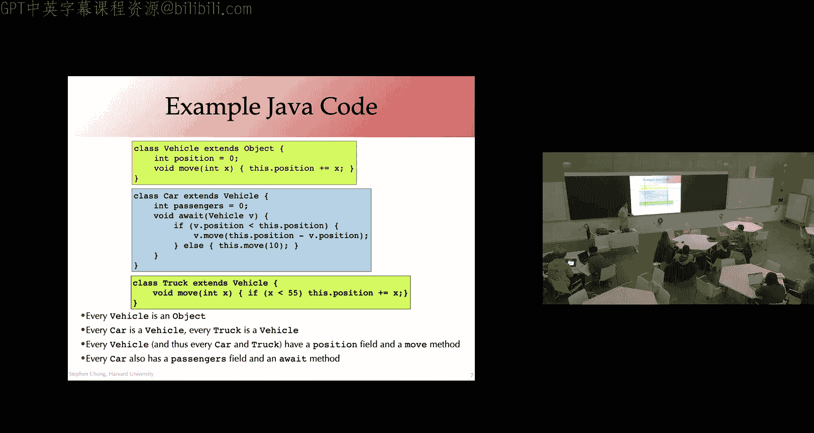
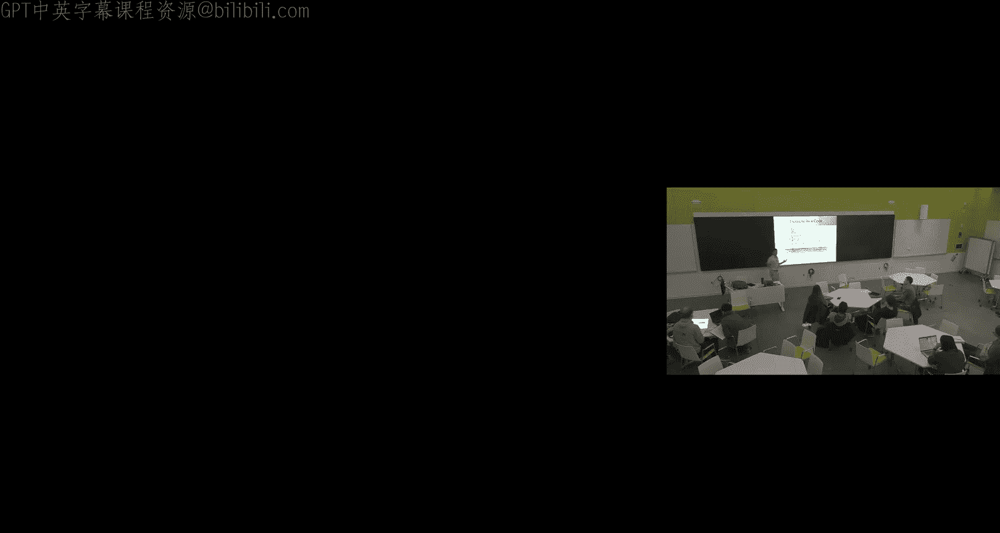
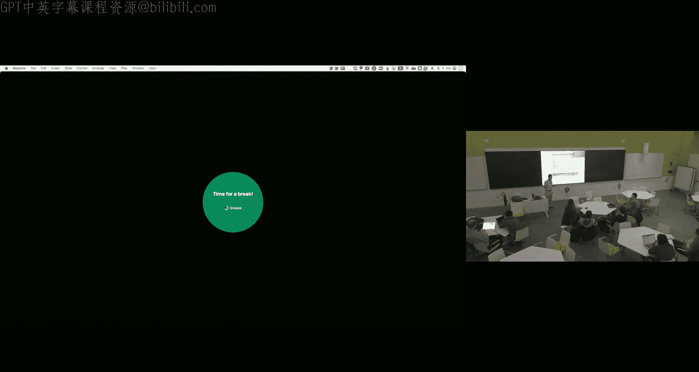
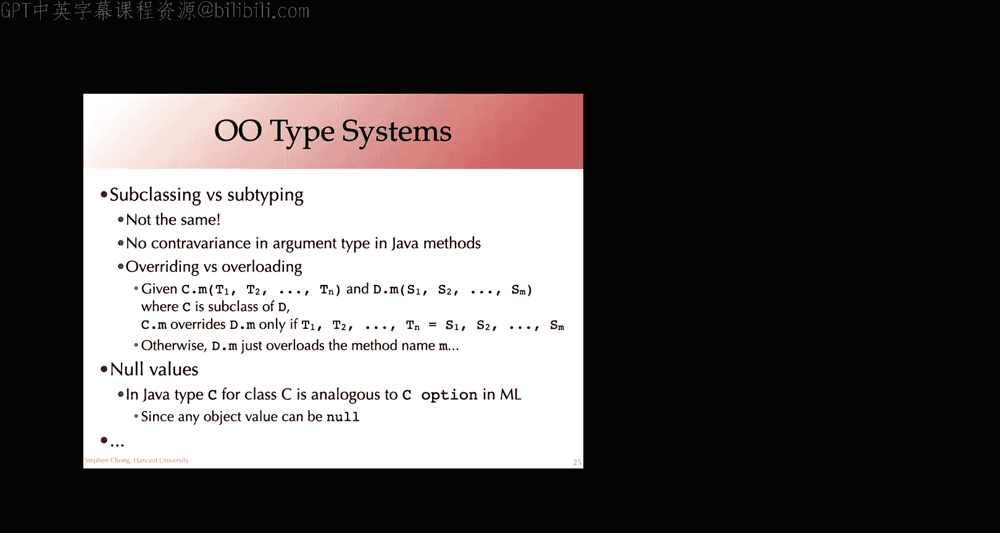

# 编译器课程：第23讲：面向对象编程编译 🧱

在本节课中，我们将要学习如何编译面向对象编程语言。我们将探讨类、对象、继承和方法调用的核心概念，并了解如何通过虚方法表等技术在底层实现这些高级特性。

---

## 概述

面向对象编程是一种将代码和数据封装在“对象”中的编程范式。它通过类、继承和多态等机制，为构建大型软件系统提供了强大的抽象能力。本节课我们将深入探讨如何将面向对象的代码（以Java为例）编译成底层的机器指令，特别是如何处理动态方法分派和内存布局。

---

## 面向对象编程简介

面向对象编程的核心思想是将数据和对数据进行操作的代码捆绑在一起，形成一个“对象”。这与非面向对象语言（如C语言）不同，在C语言中，数据（结构体）和操作它们的函数通常是分离的。

面向对象语言通常支持以下特性：
*   **封装**：将对象的实现细节隐藏起来，只暴露必要的接口。
*   **继承**：允许一个类（子类）复用另一个类（父类）的代码和数据。
*   **多态**：允许子类对象以父类类型被引用，并在运行时调用正确的方法实现。

面向对象语言主要分为两大类：
*   **基于类的语言**：如Java、C++、C#、Python。它们使用“类”作为创建对象的蓝图。
*   **基于原型的语言**：如JavaScript、Lua。它们通过克隆现有对象（原型）来创建新对象。

本节课我们将重点讨论基于类的面向对象语言的编译。

---

## 类、对象与方法

上一节我们介绍了面向对象的基本概念，本节中我们来看看其核心构件：类、对象和方法。

**类**是创建对象的蓝图或模板。它定义了：
*   **字段（实例变量）**：每个对象独有的数据。
*   **方法**：所有对象共享的操作代码。

**对象**是类在运行时的实例。每个对象都拥有其类中定义的字段（值可能不同）和方法。

以下是一个简单的Java类示例：
```java
class Vehicle {
    int position = 0; // 字段
    void move(int x) { // 方法
        this.position = this.position + x; // ‘this’指代当前对象
    }
}
```
`new Vehicle()`表达式会在运行时创建一个`Vehicle`对象。

**继承**允许一个类（子类）获取另一个类（父类）的字段和方法。子类可以：
*   **继承**父类的方法。
*   **重写**父类的方法，提供新的实现。
*   **添加**新的字段和方法。







以下是继承的示例：
```java
class Car extends Vehicle { // Car继承自Vehicle
    int passengers; // 新字段
    void await(Vehicle v) { ... } // 新方法
    // 继承了Vehicle的position字段和move方法
}

class Truck extends Vehicle {
    @Override
    void move(int x) { // 重写了move方法
        if (x < 55) {
            this.position = this.position + x;
        }
    }
}
```
由于继承关系，`Car`和`Truck`的对象都可以用在任何期望`Vehicle`类型的地方，这体现了**子类型**关系。

---

## 方法调用与动态分派

上一节我们看到了方法可以被继承和重写，本节中我们来看看方法调用是如何在运行时确定执行哪段代码的，即**动态分派**。

考虑以下场景：
```java
interface IntSet { void insert(int n); boolean contains(int n); int size(); }
class IntSet1 implements IntSet { ... } // 一种实现
class IntSet2 implements IntSet { ... } // 另一种实现

IntSet set = foo(); // foo()可能返回IntSet1或IntSet2对象
int s = set.size(); // 关键：调用哪个size()实现？
```
在编译`set.size()`时，编译器无法知道`set`运行时具体是`IntSet1`还是`IntSet2`的对象。因此，不能静态地决定调用哪个函数地址。

解决方案是**虚方法表**（VTable，或Dispatch Table）。

---

## 虚方法表（VTable）的工作原理

以下是虚方法表如何实现动态分派的核心机制。

**核心思想**：
*   每个类都有一个**虚方法表**，它是一个函数指针数组。
*   表中的每个条目对应类的一个方法，指向该方法的实际实现代码。
*   每个对象在内存布局的起始位置都有一个指针，指向其所属类的虚方法表。

**方法调用过程**（例如 `o.move(10)`）：
1.  通过对象指针 `o` 找到对象的虚方法表指针。
2.  从虚方法表中获取对应方法（如 `move`）的索引（该索引在编译时根据方法声明顺序确定）。
3.  通过索引找到函数指针。
4.  通过该函数指针调用正确的实现代码，并将对象自身（`this`）作为隐含的第一个参数传递。

用伪代码表示这个过程：
```
// 假设 move 方法在 VTable 中的索引是 1
function_ptr = o->vtable[1] // 1. 通过对象找到VTable，2.&3. 通过索引找到函数指针
call function_ptr(o, 10)    // 4. 调用函数，传递‘this’和参数
```
同一个类的所有对象共享同一个虚方法表。如果方法未被重写，子类虚方法表中的条目直接指向父类的实现；如果被重写，则指向子类自己的实现。

---

## 处理继承与VTable布局

上一节介绍了单个类的VTable，本节中我们来看看在继承层次结构中，如何安排VTable的布局以保证动态分派的正确性。

关键要求是：**子类的VTable必须与父类的VTable布局兼容**。这样，当子类对象被当作父类类型使用时，方法索引才能对应到正确的实现。

**解决方案**：按类层次结构中的声明顺序排列方法。
1.  首先放置根类（如`Object`）的方法。
2.  然后放置直接子类**新声明**的方法。
3.  依此类推。

例如，对于类 `A` (有方法 `foo`), `B extends A` (新加方法 `bar`, `baz`), `C extends B` (重写 `foo`, 新加方法 `qux`)：
*   `A`的VTable: `[A.foo]`
*   `B`的VTable: `[A.foo, B.bar, B.baz]` // 继承的方法在前，新增在后
*   `C`的VTable: `[C.foo, B.bar, B.baz, C.qux]` // 重写的方法替换指针，新增方法追加

这样，无论对象是`B`还是`C`，通过`B`类型引用调用`foo`（索引0）、`bar`（索引1）或`baz`（索引2），都能通过其各自的VTable找到正确的实现。

---

## 字段访问与对象布局

除了方法，对象还包含数据字段。编译字段访问与编译结构体字段访问类似。

**对象内存布局**：
1.  第一个字段通常是指向类信息和VTable的指针。
2.  随后依次排列从最顶层父类继承下来的字段。
3.  最后排列子类自己定义的字段。

例如，一个`Car`对象（继承自`Vehicle`）的内存布局可能是：
```
[ VTable指针 | Vehicle.position | Car.passengers ]
```
字段偏移量在编译时可以根据其声明顺序计算出来。因此，访问 `car.position` 就是访问对象起始地址后的一个固定偏移量。

**对象创建**涉及：
1.  在堆上分配足够大小的内存块。
2.  初始化VTable指针，指向正确的类信息。
3.  调用构造函数（如果有）来初始化字段。
4.  返回指向新对象的指针。

---

## 编译到LLVM IR

了解了核心机制后，我们来看看如何将面向对象的概念映射到LLVM IR这样的低级中间表示上。

编译过程大致如下：
1.  **类型检查阶段**：构建类层次结构信息。
2.  **生成LLVM类型**：
    *   为每个类创建一个LLVM结构体类型（`struct`），用于表示对象的内存布局。
    *   为每个类的虚方法表创建一个LLVM结构体类型（存放函数指针数组）。
3.  **生成LLVM函数**：
    *   将每个方法编译成一个独立的LLVM函数。该函数的第一个参数是显式的`this`指针（对应接收者对象）。
4.  **初始化VTable**：
    *   为每个类创建一个全局常量，即其VTable，其中填充了指向对应方法实现的函数指针。
5.  **生成代码**：
    *   `new`表达式：转换为堆分配和初始化。
    *   方法调用（`obj.method(arg)`）：转换为通过`obj`的VTable指针查找函数指针，然后进行间接调用。
    *   字段访问：转换为对结构体指针的`getelementptr`指令，计算字段偏移。

---

## 高级主题与挑战

面向对象编程的编译还涉及许多高级主题和工程挑战。

以下是其中一些重要的扩展和挑战：
*   **多重继承**：一个类继承自多个父类。这会导致复杂的对象布局（需要包含多个父类的子对象）和VTable查找（需要多个VTable或更复杂的索引方案），并引发“菱形继承”问题。
*   **接口**（如Java）：类可以实现多个接口。通常的解决方案是为每个接口生成一个独立的VTable，对象通过其类信息来查找特定接口的VTable。
*   **单独编译**：如何在不重新编译子类的情况下修改父类？这要求VTable布局和字段偏移等信息在链接时或运行时才能最终确定，或者强制要求父类的某些修改必须触发子类的重新编译。
*   **运行时类型信息（RTTI）**：支持`instanceof`这样的运行时类型检查。每个对象的类信息中需要存储继承层次信息，以便高效地进行子类关系判断。
*   **基于原型的语言**（如JavaScript）：没有类的概念，对象直接继承自另一个对象（原型）。实现上通常采用类似的VTable共享和写时复制技术来优化性能。
*   **类型系统**：Java中，子类化即子类型化。但方法重写要求参数类型严格不变（不支持参数逆变），某些版本支持返回类型协变。这与函数式语言中的子类型化规则不同。

---

## 总结

本节课中我们一起学习了面向对象编程语言的编译原理。
*   我们首先回顾了面向对象的核心概念：类、对象、封装、继承和多态。
*   我们深入探讨了**动态方法分派**的关键问题，并引入了**虚方法表**这一核心解决方案。VTable使得运行时根据对象实际类型调用正确方法成为可能。
*   我们了解了如何通过精心安排VTable的布局来支持**继承**和**方法重写**。
*   我们讨论了对象的**内存布局**和**字段访问**，这与结构体编译类似，但需考虑继承。
*   我们简要概述了如何将这些概念映射到**LLVM IR**上。
*   最后，我们提及了多重继承、接口、单独编译等高级主题和挑战。




面向对象编程通过将数据与操作绑定，并利用动态分派，为构建模块化、可扩展的大型软件系统提供了强大的范式。理解其底层编译机制，有助于我们写出更高效的代码，并深入理解这些抽象背后的成本。