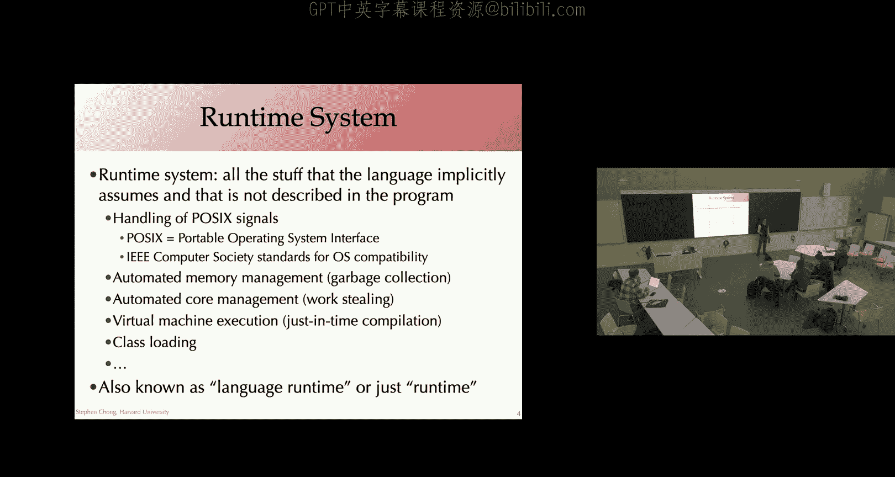
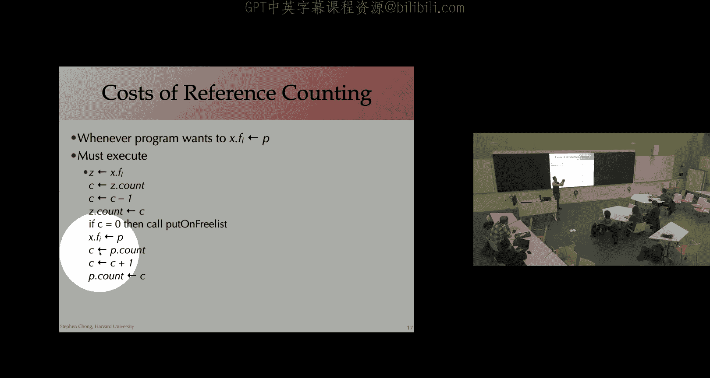
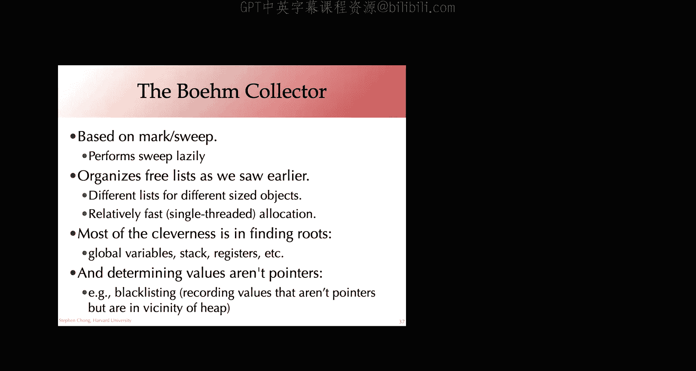

# 哈佛大学《编译器｜Harvard COMPSCI 153 compilers 2023》中英字幕（claude-3.7-s p24 1701267300-Compliers_on_11_29_2023_(Wed).zh_en -BV14PAUejE98_p24-

Using late minutes。Have put it in their past。Looked on to the better and brighter future of homework 6 and the final exam。

就。Any。Any other questions？Okay， so today we're going to be turning to a topic。

The topic of garbage collection， which。Is really。Focusing on an area we haven't paid a huge amount of attention to in this compilers course。

 And that's the question of the runtime system。So when we think about implementing a programming language。

 there is， of course。The design of the language， how we compile it down into something the machine can execute。

But more than that， the， there's a whole lot of stuff that the language is implicitly assuming is going to happen at runtime。

 That is not in the program itself。But somehow needs to happen。

 So this is typically referred to as the runtime system。

 It's the stuff that gets implemented once by typically you know。

 the language implementer maintainer that is there at runtime and supporting the execution of the program。

That was originally written in the source language。

 so this might be the handling of Possic symbols signals， sorry。

 so essentially related to interacting with the operating system or parts of the operating system。

 it might be parts of automated memory management， garbage collection。

 which is what we'll be focusing on today。

But there might be other aspects going on as well， if the language supports concurrency or parallelism in some form。

 then the language runtime might be doing a lot of the management of that。 So for example。

 launching a thread might at the language level be something quite nice and simple and easy。

 but actually implementing that might require runtime support。嗯。No。

 we're not going to have time to talk about work dealing。It's a。诶。

Sayve part of the runtime system for effective use of cause。Depending on the language sitting。嗯。

Many languages are actually compiled not to machine instructions， but actually to Bitcode。

 some low level representation。And then that byte code might be either interpreted at runtime。

Or what's increasingly common。The interpreter that is interpreting the bycode will do what's known as just in time w compilation。

That is rotate the byte code。 It'll translate that into。machine code and execute the machine code。

 But it's doing this at the time that it's actually executing the code。

This gives rise to various optimizations that can be applied that are difficult or impossible to apply。

At normal compile time， which happens ahead of execution。So。😊，If you're compiling down to byte code。

 the implementation of the virtual machine is essentially part of the runtime system with all the services that offers。

Including for example， in the Java。Programming language， class loading。

 so that is loading of the classes of the code that is going to be executed runtime。

 This actually happens dynamically as part of the runtime system of automatically finding loading into the virtual machine。

The code。So this runtime system is also known as the language runtime or simply runtime for the。

Grammar geeks out there， runtime is a single noun， so it's written without a hyphen there as opposed to run being a modifier of time。

 in which case it might be done with a run dash time。

 but runtime is just the noun for part of the system that handles it。

We're going to jump into automated memory management。

 but any questions at the moment about this sort of high level idea that part of the language ecosystem includes this runtime system？

Okay。So。Automated memory management is， of course， by contrast with manual memory management。

 So manual memory management is when the programmer is explicitly allocating and delocating memory。

 So in the C programming language， typically through calls such as Malck to allocate memory from the heap。

 free passing an pointer to free that memory。😊，嗯。automaticmatic memory management is when the runtime looks after the allocation of memory as needed。

And in terms of freeing the memory that's used。This is called garbage collection。

So the idea is that memory that is no longer in use can be freed。 right。

 The programmer doesn't need to explicitly say。Free this piece of memory instead the runtime system is somehow figuring out。

Aha， this piece of memory is no longer in use it garbage。

 let me collect it to allow that memory to be reused。Of course。

 one of the key challenges is how do we figure out when？A piece of memory is no longer in use。Now。

Ideally。No longer in use， what we'd like to do is identify any piece of memory that is not going to be used in the future of the computation。

of course， this problem is in general undecidable。It's going to require knowing the future of the computation。

 whether or not some particular line of code will be executed。So instead of this ideal definition。

 which is unobtainable。Runtime systems use something that's more conservative。In practice。

Any piece of memory that is not reachable。😡，That is。

 they can of be accessed through some chain of pointers。Given the current state of the program。

That memory is regarded as or that memory definitely cannot be used in the future。

 right if you can't actually reach that piece of memory to use it。

There's no way you're going to be able to use it and as a result。It can be freed。But this is。

 of course， conservative， right， It's a subset of the memory。

That is are not going to be used in the future。 and there might be other pieces of memory that are reachable。

 but the program's never going to touch it。嗯。But our garbage collection will not be able to collect it。

Okay。So let's go and expand on some of these ideas about reachability and so on。

 So the basic idea of garbage collection。As though we're going to start from。What are known as roots。

 So these are locations that the program has access to。These include the stack。Rissses。

And global variables。Okay so from these roots。We're going to follow the pointers to determine which objects in the heap are reachable。

So for example， if we started off， let's suppose this is a register a0。

 it's containing a pointer into the heap， we can follow that pointer into the heap。A。

So we know that that object in the heap is reachable。😊，That object。😡，Might be astruct。

And one of the fields might be a pointer。To another object， so it'd follow that pointer。And Mark。

 that object is reachable。And so on， we could continue to follow the pointers from the roots into the heap。

Following that to， for example， here， here there are no more pointers。

 so there's nothing else to do there。We can kind of， if you will， backtrack。

To hear and follow this other pointer。Marking that object as。Reachable。From a root。

So that's actually exhaustively found all the objects reachable from this route， A0， the register。

But there are， of course， other routes， other places that the program now or in the future might access。

 so this global variable is going to be accessible at any time。

So following this pointer into the heap could， for example， mark that as。As reachable。

The stack is of course where we are recording local variables that aren't in registers。

 maybe things like coolly and Coer saved registers as well。So the stack is also a source of。

Pointters into the heap that the program is able to get to。 So roots。

 So we follow pointers from the heap into memory。Into the heap marking objects as reached。

And the search for objects。Essentially， each we're doing this sort of depth first traversal。

 typically。 So when we follow this link。When we follow this node here to the subject that's already been visited。

 we don't need to revisit it， right we know it's already reachable from the route。Okay。At this point。

From the roots we've visited every single object on the hip that is reachable and marked them as reachable。

 so that means anything that hasn't been marked。Is not reachable from one of these routes。

 meaning that the program in the future is not going to be able access them。So we can reclaim it。

 we can get rid of all of these objects。They were not marked。Okay。

And that's the basic idea of garbage collection， figuring out what is reachable。

Reclaiming the things that aren't。There are some subtleties some details to what's going on。

 but this is the key concept。What I've kind of sketched out for you is what's known as a mark and sweep garbage collector。

The idea of Mark and sweep is there are two phases， the mark phase and the sweep phase。

When in our object， when we allocate a space for memory， we're going to use one bit in that object。

To indicate whether or not it's been marked。Okay， in the mark phase， what we do is。For each route。

We do a depth first search from that route。And this is the idea of we're going to mark every object that's reachable。

So if x is a pointer into the heap。And the record X has not yet been marked。

 What we do is we mark X that is we set the bit from zero to1。😊。

And then for each field of the record。We recurse， we do a de search。On that field。

So at the end of this。Let's performing the step for search。

Every object that's reachable from a root has been marked。And we can enter the sweep phase。

In the sweep phase， what we do is we sweep through the entire heap。

Starting the first address going through the last one， if the record is marked， are we unmark it？

Getting it ready for the next time through the through the mock phase。 But otherwise we。

maintainingintain a free list of free objects。 And what we're essentially doing here is adding。嗯。

Adding the object P to the free list。And then。Advancing the point of P to continue our sweep。

Through the heap。Okay， so this is cicode， high level details， but a bit more。

A bit more details about the smart and sweep garbage collection。

Any questions at the moment about the basic algorithm？Yeah， Andrew。

 to the run time keep in track of every object the delegate。嗯。

Is there own time keeping track of every object that's allocated？So。

They I't I getting 10 objects I keeping some infrastructure where I keep track of point for every object。

Well， in this， so typically there's some。Meter information at the。

At the beginning of an allocated object， so when you're allocating on the heap there's some。

So that's。For example， P here。Being put into the beginning of record。

 having some way of knowing what the size of P is。As useful。

 But then you don't actually need an explicit list of all of the records that you've allocated。

 You are， in fact， able to this。This initial algorithm。Yes， you do in fact。

 sweep through the entire heap from the beginning of your allocated heap to the end。

 and there is this assumption that we are able to。P is pointing to the beginning of an object and the heap。

 we know where the markbe is of that object， so in the first word or two words or whatever。

 we also know the size of that record， maybe because part of the meta information is say what type it is or if nothing else。

 the length of the the size of it， so there's no non and explicit data structure of the allocated objects。

But there is。But there is a way of actually going through all of the objects there。

 the way we're setting this up is having a free list of the freed objects。

 So this is not doing any sort of compacting or anything like that。 allocated。

 you're free to them and you now got this free list。😊，That you could use for allocating later on。And。

We're not gonna to dig a huge amount into。Really into allocation strategies。

 you covered some of this in 61 right， with next fit， best fit， sort of algorithms， first fit。

No more。I' sorryrry in the last two years of the first piece I was changed like build an allocator instead of just adding the bug info Oh okay。

 thanks。Okay， so 61 might cover。 you may have encountered some information about allocation strategies so。

Here were just handwaving saying look， you've got a free list of objects and you could of course have more structure on this。

 like many different free lists based on the size of the record or something like that。Okay。

 so this is the high level algorithm marking and sweeping。嗯。One of the problems， though。

 is that if we take a look at the step first search algorithm。It's a recursive algorithm。

 so if you actually kind of tried to implement your mark phase using this， you'd have a function。DFS。

 and you'd allocate a stack frame for every time you invoke DFS。What's the？

How many stack frames could you get here？With respect to the structure and the heat， right。

 how big could you？Your stack yet。系。要。Yeah， so essentially because you're doing the step first search in some ways it's going to be the deepest part of the heap based on the connector structure。

 which worst case。You know， if you have essentially a linked list or something and you're just using all of your he。

 you could have a stack frame per he node。So that's not great。😊，We could do a bit better than that。

 of course， by instead of using the stack。Stack frames to record our stack for the depth first search。

 We could do an explicit stack instead， right so have implement our depth first search function by having an explicit stack。

 maintaining that stack。 So this would be more efficient。

 We're not using an entire stack frame for each because of coal， but nonetheless。

 we still have the stack， which。To be honest。Could get pretty big。Whis case is as big as the。

Heap itself。So there is actually a trick that we can do during this mark phase。

 and this is pointer reversal instead of explicitly using a stack。And thus。

 needing to use up an amount of memory for our mark phase that might be as big as our allocated heap。

What we're going to do is when we're visiting。A pointer， so a field of a record。

 field F of the record X。What we're going to do is use that field。😡，To store an element of the stack。

In particular， we're going to use that field to store where we came from。To visit the snow。

So essentially what we're doing is we're encoding the stack in our traversal of the nodes。

And then when we pop the stack， we're gonna。Restore the original values of those fields。

Sketch it out。With some graphics in case this helps。

Imagine that what we're doing is we're visiting the field F I of the record X。 right。

 So that's the next thing we're wanting to visit。 We're coming here from the field F K of the object Y。

😊，The kind of thing that we might do is， you know， we might have some temporary pointers to maintain our state。

 Okay， so we're advancing our current pointer to this field X。 What we're going to do is。Well。

 remember we were going to after this。Reverse this pointer and in the field if I record the fact that we want to come back to here。

To the record way， maybe to the field FK of the record way。

And then we can continue on with our traversal。Right。

So the insight that's really going on here in this case is。We know that we're going to need。

Order in space to do depth first search of the heap of size N。

And instead of needing to allocate order in more memory for that in the form of stack frames or an explicit stack。

We already have order in memory allocated， the objects themselves。

So if we're able to use those objects themselves to record the state of our traversal。

 we're not going to run into problems of。Running out of space during our mark phase。

 So that's the key idea between behind， for example。

 putting the mark bit on the object itself using something like pointer reversal as a way of encoding our stack into the existing space。

 There are details that are involved。 you need to have additional information around to know。

 for example。Which field of the object you're up to in your processing of it？

Which might be encoded in a variety of ways。 but the key idea is that we're able to use the existing allocated。

Objects。To record our。The information we need for marking。Now， part parle of that is。One。

 we might have metadata around with the object， so there might be some inefficiency this there of needing to allocate some additional memory with our objects。

 and two， particularly if you're doing something like point of reversal。Clearly。

 you can have other code that is using。Expecting to find correct values in those locations。

So a lot of the time Mark and Sweep is actually done。By。What's an on as synchronously。

 so essentially stopping any other computation if it's happening concurrently and then doing。

This mark and sweep face or in a single threaded system。You'd be doing this。

You've be doing this mark and sweep in its entirety before going back to executing the program。

Any questions at the moment？Okay。So。This seems in some ways like a simple idea for garbage collection。

For figuring out what stuff is no longer used。But the market sweep seems kind of onerous， right。

 You've got this process where you're。Ting a look at all of the heap traversing。

Lots of the heatap and then sweeping over it to clear it out。

So are there other approaches that we could use for garbage collection。

 for automatically reclaiming memory？So that brings me to another key way of doing garbage collection。

This approach is known as reference counting。Okay， so the idea of reference counting is that we're going to track how many pointers there are to each object。

 that's going to be the reference count of an object。

We're actually going to store that reference count with the object itself。嗯。So the idea is that。

When we emitm the code that is creating pointers。And so on。

 the compiler is actually going to emit code to increment and decrement those reference counts。

So if you end up decrementing a reference count。Maybe because you。A changing the value of a pointer。

 so the thing that it used to point to now has one less thing pointing to it。

 you would decrement that count and if that count ever reaches zero。

It means that nothing is pointing to it anymore。That object is unreachable。

There's nothing pointing to it until so it can be reclaimed。

So let's walk through a quick example to see how this might work。

Maybe from this register or local T0， we create an object， we're pointing to it。So it has。

One thing pointing to it， a reference count of one。 We might create another object。

And in pointing to it from a field here， this would also have a reference scan of one。If we end up。

Pointing to this subject from somewhere else， say from T2。

Now there are two things pointing to the object the reference count is two。

 so as the program continues to evolve， we're continuing to make sure that the reference counts are okay。

If we end up removing a pointer， let's suppose we overwrite。

This field of the objects are no longer points here。That means we need to decrement。

The reference count。If we end up overwritingiding this pointer here we decrement the reference count to0。

 we now know that this object is unreachable。As you can kind of see visually， and so at that point。

 as soon as we remove that point to it， as soon as that reference account goes down to zero。

 we can reclaim the object。😊，Okay。The idea seemed clear。Good idea or bad idea。

 What are some of the problems that you from this。Presentation of reference counting。

 what do you think would be problems with this approach？Many。

You might like free and make an application at the same place I guess。And because of that。

 that's a lot of calls。质量。So when you say you might free and allocate it the same sort。

 you mean at the same location in the heap。 Yeah， Okay， that doesn't seem too bad。

 doest it like if I。If I end up freeing an object， great， I decate it。

 and then pretty soon after I end up allocating I I get to reuse that piece of memory。嗯。

ThatThat doesn't seem an issue about。justRefer counting。

 that seems like just memory management in general。

 the idea that I'm freeing something and I'm allocating。Maybe those way where。

I didn't need to have the overhead of the memory management at all， is that what youre？

I was like time wise。Oh， time wise。Definitely time wise。

 Ref counting as a pain because every time you。Store。

Let's say every time you overwrite a point of value， you need to look at the。

 the old value of those in that pointer。Go and fetch that object。Derement the reference count。

Before you overrrate it， so one of the things， so definitely performance ways with reference counting。

 there's a lot of overhead。嗯。As you just kind of maintaining these things and it you know。

pottentially does not nice things to your data locality as well because just removing a pointer from on an object。

 you didn't want to touch the object at all， you weren't interested in it。

 but nonetheless you have to pull it in and overwrite and update the reference count。And。Yes。

 you do need to be concerned about issues of overflow and so on in your reference count。😊，That's。

 yes， that's something you need。Care about Abe。Sychronization can also be a pain terms。

Synchronization and automatic memory collection in general is a problem yes so if you have a concurrency。

 if you have other threads executing， how do you make sure that things are operating appropriately as long as you're synchronizing on your reference counts though。

😊，嗯。Let me think that。You're right， you maybe need to be a little careful about how you update these。

This counts to make sure it doesn't temporarily drop down while you are。And incorrectly reflect it。

 so what you want is that if it goes to zero and you free it， it really is unreachable。Yeah。

Are there any problematic data structures for reference counting？Yeah。

 Max Max well have like a linked list。And then you edit a pointer that initially pointed to the head。

You have to sort of like。Free。Oh， that， that's actually not a downside。

 That's actually a benefit of of， of reference counting。 The idea that。When I free an object。

 like if an object， if its reference counts goes to 0， I can free it now。 and by freeing it。

 now a field that pointed somewhere else， that is。I'll decrement the reference count of the thing that was pointed to because this thing got freed up。

 The pointer no longer the。 And so the reference count gets decremented。 And so you're right。

 This actually might lead to a cascade of freeing。 like if you。Have a linked list。

 every element in the list has one thing pointing to it， including the head。

 and now I overrite the pointer to the head。Then yes。

 my reference counting will magically zip down the list， freeing each element in turn。

 but that's actually a pretty cool thing。😊，That the the reference count that yeah。

 you'll get this kind of cascade。Yeah，Like a simpleic。Yeah。

 so doubly linked list is really interesting and in general cycles in the object graph。Or a problem。

 So let's think about。Creating some objects。Wonful。

 they all have a reference count of one and then we create a cycle， so we point from me here here。

 this now has a reference count of two。😊，And now we overwrite this pointer。

The cycle of objects is not reachable from any root。So from this point forward in the program。

Assuming you don't do terrible things like you know。Point to arithmetic or buffer overflow。

 Nowhere in the program is going to be able to access this， but。They have a non zero reference count。

Soir。Reference counting by itself would not end up claiming this， what would you do about that？

You as a language designer。You think somebody told me reference counting was a good idea。

 I want to do it。Ah，How do I deal with cycles？What approaches would you take？Yeah， Max one。late。

Martin sweet。That is indeed what Python does， Python does reference counting garbage collection。

 with the occasional mark and sweep to deal with cyclic data structures。Yep。

 so that is one way to do it。Yeah， just lot cycles。 That is another way to do it。

 So some languages would actually say， you know， if you want this to be garbage collected。

 you make sure there are no cycles and。😊，Yeah， debugging that can be kind of painful。So yes。

 And so as， as I mentioned， reference counting is actually used in practice。 Python is， you know。

 pretty。😊，popular language， and it does use reference counting to do its garbage collection。

 but of course， occasional mark and sweet。😊，Python of course。

 is at least initially was not aiming at high performance， and indeed as we talked about。

 there is a big cost to reference counting but if you want to overwrite X。FI。

 you actually need to read XdoF first see what it's pointing to decrement that count。

 put it on a list to be freed if needed，Update it to update a pointer。

 You actually need to de reference the pointer to get to the object to increment the count and so on。

 So this ends up being a lot of memory accessors。Now， of course。

 you all are in the process of becoming experts at data flow analysis， so you could imagine。

It's some representation of the program looking at this and trying to。

Reduce the costs by aggregating updates like if you look at your code， you might realize， oh。

 this is definitely the same object that I'm accessing I'm incrementing and decrementing it。

Fantastic， no need to modify it at all。Or I'm creating two point to it。

 so I'm going to increase it by two in one single operation。But in general。

 it is pretty expensive to be doing reference counting。

Any questions at the moment on reference counting？ok。Let's consider some other approaches。

To garbage collection from this point in onwards， there'll be mostly some variant of markck and sweep。

Of some kind。Well， one of the issues that came up that Andrew brought up with Mark and Sweep is that in that sweep phase。

 you're going through the entire heap。To kind of say， well， what am I freeing up？

Depending on how if your heap is big， this is kind of a linear process going through that heap。

And you may or may not be freeing many things up。上。Here's a。Variant called stop and copy collection。

嗯。This is essentially。It's modifyifying。Both the mark and the sweep face。

But some of the ideas are the same。 The key idea is we're going to split the heap up into two pieces。

We're going to allocate。Initially， we're going to allocate new objects only in the first piece。

Until the first piece fills up。At that point， what we're going to do is。Copy。The reachable data。

From the first。Part of the heap into the second part of the heap。

 So this is kind of similar to a mark phase in the sense that from these roots we're going and we're going to be traversing this graph。

 finding everything that's reachable。 But instead of just marking it is reachable。

 what we're going to do is copy it over into the second part of the heap。Right。And so。

At the end of that copy phase。We've got everything over here in the heap。

 we've also had the chance to compress it in the sense that because we're copying it over。

 we be there's not going to be any gaps between them。Right。Now。

After we've finished that copying phase， everything reachable from the root has been copied over into the second half of the heap。

Anything that's left in the first piece？Can be freed， right， It's no longer reachable。

So we can just in one fell swoop， say everything in that first half of the heap。Is no longer there。

 we can just start allocating memory。Again。At that point， we continue by。

Allocating into the second part of the heap。嗯。Until the second part of the heap falls up。

 then we copy back into the first half。All right。So。This is a nice idea， right。

 It allows us to free up。We don't have the sweep phase anymore。

 we can kind of free in an entire part of the heap。😊，Of course。

 there's some subtleties involved with。Copying， right。

 about moving things from one part of the he to the other。 just in a little more detail。呃。

Here's a way of thinking about it graphically。 We have these roots。 So， again， the Sac registers。

 global variables and so on。Pointing into the from space， one half of the heap in our two space。

 we're going have two pointers scan and next， next is going to be。

Where we're copying a new object to。And scan， we're actually going to need to process the objects that we copy over。

So， for example， we move。One object that was reachable。嗯。We。A going to need to mark。🤢。

The old part of。The from space。We're going to need to indicate where it got moved to。

And that's in case other parts of the heap are referring to this subject。嗯。

And as we'll see in the scan phase， we might need to update them。We'd keep on copying over。

 so from this route now we'd move this object。Copy it over。嗯。Put in forwarding information。

In from the from space。Now， I mentioned we have this other point a scan。

 The idea is that records between scan and next haven't been processed yet。

 So what we're going to need to do is process one of these records and see if there's。

Other there objects in the from space that are ritualable that have to be brought over to the two space。

So this is kind of how we're doing the search through everything reachable。

 moving it over into the two space， and then we're scanning through it。

To figure out what else is reachable so we can scan through。

There's no pointers here in this first object as we go through the second object， though。

 there is a pointer to the subject and the from space， so that needs to be brought over。Like so。嗯。

And then we would scan the rest of the object and when。

Scan and next are the same and we're finished processing all the roots。

 then our copy collection is complete。And at that point， that's when we can free the from space。

Like so。Keep on allocating from next until。Until we're full and then do the same thing with。

The from and the two spaces reversed。嗯。I got some pseudocode on here。

 but I'm not sure this actually adds a huge amount of。呃。From the intuitive understanding。

 so I'll leave it to few to look at on the notes。If you're wanting to。U。Okay， so with that sketch of。

Of the copying collection that I've shown you。We wind up。

Copying over from the from space to the two space， essentially in a breath first manner。

We are copying over an object from given root and then we're going through all the fields and that object and copying those things over and that gets added to the next。

 but we're not going to scan those until much later。So that doesn't tend to give good locality。

And what do I mean by that？W doesn't it give good locality if we're doing breakfast copying？

He we've got like five linked lists， see linked list that all'll have a rough pointing to that。

Cllated。Entry basically it's going to hold right。That's right if I have like linked lists that are。嗯。

Right。Lingists that I'm copying over I'll copy。In a breath first manner。

 even if it's not five separate list， even if I have a tree， so a single data structure。

 what' will end up happening is I have each。Nodes within a layer are contiguous to each other。

But we typically traverse a data structure， a linked list by going through the list。

 or traverse a tree by going from the root to something closer to the leaves。

And what that means is that whenever you follow a pointer， whenever you traverse the data structure。

You're not going to be going anywhere somewhere Jason。

 you're going to be going quite likely far away。Depending on the size of the data structure。Right。

 so with breakfast cocking。ItDoesn't tend to give us good locality because it isn't the way that we typically traverse structures when we're using them when we're not copying them over。

The problem is that if we did depth first copying。Then we'd be in a situation like we were with Mark and sweep where we need。

Additional data structures to be recording the depth first traersal so using something like an explicit stack or sort of point a reversal trick。

That we use some implementations of。Copy collecting。Do some depth first copying。

But don't try and do everything depth first so some sort of a limited form of getting the locality benefits。

Okay， any questions about。Copy collection。O。So next variant of garbage collection。😡。

This is something called generational collection。So， the insight。嗯。Is that in a lot of programs。

Newly created objects。likely to big garbage pretty soon that as most objects that are created have a very short lifespan。

 meaning that。The ones that are most likely to be collected are the ones that were created recently。

By contrast。Rather conversely， objects that have survived many collections are likely to be long lived。

They're likely to be around for a long time。And so。From this。

A reasonable thing to do might be to focus our garbage collection efforts more on the young data。

The data that's been recently allocated。And less frequently。On the older data。

And so this gives rise to the idea of。Dividing the heap into generations。The idea being that。

When we create a new object， we allocated it into generation。G0。And G0。

 the section of the hip we garbage to collect really frequently。

If an object survives two or three collections in a level。In G0， it gets promoted， copied。

Over to a different area of the heap。Ziwan。Now G1 is going to be garbage collected less frequently than G0。

Right。And you could have additional layers on this。

 So some number of generations and the key idea being that the younger generations get garbage collected frequently。

 things get promoted if they survive into a higher generation where they get garbage collected less frequently。

嗯。So this is cool， right， the idea being that。诶。Most objects have a short lifetime。

And if and commercial if an object survives for a long time， then it's likely to continue to survive。

 that means we get the benefit of we're focusing our time on garbage collection on the newly allocated objects and the objects that have been around a long time。

 we end up checking them much less frequently， we're not spending time traversing them。And checking。

There are some complexities to this when we think about the roots of garbage collection of a generation。

 let's say G0， we need to think about not just the registers stack global variables。

 but we also need to think about points from older generations into G0 into younger generations。

 Those are with respect to garbage collection of G0。

 It's a way that the program could get to an object in G0。

 so we need to treat it as a root with respect to garbage collection。

 So we do need a bit of extra mechanism in there to to。To be able to remember。

We point from older de generations pointing to a younger one。

The good news is that long lived objects often don't tend to be hot。

 that is they don't tend to be changing super frequently in general， not always true。

 but a lot of the time an object that's around for a long time。呃。

May not be having a huge amount of churn on it。Any questions about generational。Gavage collection。

So this is actually what Ocal does， Ocael has two generations。

 they call it a major heap and a minor heap， and so objects are allocated into the minor heap garbage collected frequently promoted to the major heap。

 and they just have the two levels there。嗯。呃。Okay。Yeah， Mari you。

Is there usually an optimal garbage collection strategy？No languages in general。

Is there an optimal garbage collection strategy for functional languages？That's a good question。

Or is there a consensus？Is there Rick？That is another good question。

 Is there a consensus on what they use， I don't actually know I will say。I don't know， for example。

 what Haske uses。And so on but。I will say one of the things about。O cameel and。

Let's say other high level typea languages is that they do often allocate a lot of objects。

 so if you think about Ocal。呃。Anytime you have a pair。

 anytime you have anything other than a pointer or a primitive value like an integer。

 a channel or something， then it's being stored in the heap， so you're allocating memory for it。U。

Anytime you use a data constructor， right， Con value， you're allocating memory in the heap。

Same in a language like Java， every object is allocated in the heap。

 and so you have this high overhead， and so you are often going to be having a lot of objects in the heap。

And。And going to many of them are going to be short loved， right？嗯。I think that's a good question。

 I will again encourage somebody to post on Ed。Just this question as a gathering point for information about garbageb collection and Roaml。

 but other languages like Haskell。Python we've talked about briefly。

 but other ones as well are kind of interesting to see what they tend to do。

 I don't know what various JavaScript engines tend to do。For example。U。呃。Yeah。

 my understanding as generational garbage collection was the。嗯。I is the most common which。

Is a form of copying collection。But。Buttter don't know。Thanks for the questioner。Okay。

So we've talked about the idea that。As garbage collection is happening。

You know it's messing around with the state of objects， maybe it's using point reversal。

 maybe it's moving objects from one place in memory to the other or needing to update pointers that are all over the place So what this means is that。

The collector often interrupts the program。For some period of time， often a long period of time。

 this turns out to be an issue for real time programs and。

Definitely like early versions of the Java programming language， this was really noticeable。

 the garbage collector would run and a lot of Java programs were interactive。

 they had like user interfaces。And the user interface would hang while what garbage collection happened。

So a noticeable user lag。嗯。So there's a couple of approaches to。To address this。

 one is to use what's known as incremental collection。So the idea is that。嗯。

You can do a bit of work on garbage collection， but you don't have to complete it。So imagine that。

When the program requested or various times， you make a little bit more progress on。Youre mark sweep。

Or something like that。呃。But you don't have to hang the program for a long period of time。

And of course， this will limit things you need to make sure that the incremental steps you're making don't leave things in a bad state。

 Everything needs to be usable by the program when you。

When you're finish with your increment of work on garbage collection。So that's great， but。

Most languages these days are concurrent， that is they can have multiple threads of control executing。

If you imagine。Even if you're doing incremental collection。

 if this requires you to pause all of the threads that are currently running while you do a little bit of work。

On garbage collection。That's not going to be good， right。

 you're going to really slow down the program。So concurrent collection performs garbage collection concurrently with the program。

So this would be， for example， being able to mark things， sweep things or copy things over。

In a way that's safe while other threads are continuing to execute。On the data。嗯。

So taking one of these approaches can end up hugely reducing the the latency。

 the pause time for garbage collection to the point where it often becomes you know。

 unnotable with respect to。The user interface or。With a task that's running。But of course。

 the implementation of these is much more complicated than if you get to assume everything is waiting on you to finish。

Your collection。Okay。When we think about actually implementing garbage collection as opposed to the nice high level concepts。

 there's actually a huge amount of opportunities to improve performance on this。So for example。

Copying objects from one space to another。For large objects。

 like if you had an array that was megabytes。Big， you。Don't actually want to physically copy it。

 move it from one place in memory to another one so there are ways of。

 for example virtually copying them， so making an operation that's much cheaper。

 possibly by interaction at the operating system level or otherwise to make that effective。

As we've already talked about， some systems end up mixing these approaches。

 so say mixed copy collection。诶。Together with Mark and Sweep。And maybe markets sweep with compaction。

嗯。Do。As they already touched on interacting with the operating system actually is。

Quite important here。The idea of。Garbage collection。

 even though this might sound like a really expensive thing。

 copying things over or marking and sweeping， it may turn out to be cheaper to be doing garbage collection on memory that's at some level of your cash。

And able to do it。Be relatively cheap to do garbage collection there and then get to reuse the memory you just feedd up rather than getting the operating system to say start paging or to extend the he and be。

Incurring overheads at lower levels of the memory hierarchy。I think we already talked about。O camels。

Garbage collection， hybrid generational， minor heap and the major heap。

 the major heap is collected with Mark and Swweep， the minor heap uses stop and copy。Collection。

A few years ago， they modified their allocation algorithm actually， instead of。

 I think they were using a first fit algorithm that is when somebody requested memory。

They would go through the free lists。And find the。First， object that fit。

 Now they're finding the best fit。 And this apparently improved performance immensely。

 So with respect to memory management， it's more than just about。The garbage collection。

 there are other aspects as well， there's some interesting blog posts and articles about Ocal's new。

Memory allocation， but that will take you into some of the details of garbage collection as well if you're interested。

U。呃，哎。Think the latest version of Java users generational garbage collection with multiple threads。

 although this might be a couple of years out of date。Any questions at the moment？Okay。

So we've been talking about one aspect of the runtime system， this automatic garbage collection。

And I kind of introduced this by talking about the idea of it's part of the language ecosystem。

 right part of designing and implementing a language is what the runtime services are going to be around and available。

So part of that means that the compiler， the thing that's producing the code。

 is going to be needing to interact with that runtime system in some way。

With the case of garbage collection， it might be。When you're generating code from your compiler。

HowWhere are you placing calls to invoke or interact with that garbage collection runtime？嗯。

So one of the ways this might happen is。嗯。One pretty common thing is actually to run garbage collection when you allocate。

Not necessarily every time you allocate an object。But that being the only time when garbage collection will actually kick in at the time where you request allocation of a new object。

RightAnd this is by contrast with maybe stopping the program randomly at various points。啊。

And invoking garbage collection to free up memory。But more than that， you actually need。😊。

It's going to be really helpful if the compiler is able to do things like describe the layout of records such as。

😊，诶。So knowing which fields of the record are pointers and which one's non pointer values。

 that's going to be incredibly useful in the traversal to figure out reachable objects。

And also in describing the locations of the roots， you know。

 we talked about registers and the stack and global variables。

But which slots on the stack are actually pointers that need to be followed。

 which registers are containing point of values。So these turn out to be actually relatively complicated things。

 if we think， first of all， about describing the layout of records。嗯。

The garbage collector needs to know the number of fields in a record， whether a field is a pointer。

One of the typical ways of doing that is to when you allocate a record on the heap to have the first word。

Contain essentially type information about the record。

which might be a descriptor for the layout of the record and so on and indeed in last class we already saw that with objects from an object oriented language right we needed some pointer to point to the class information so that's kind of nice we have an object oriented language that has this class with its virtual dispatch table and things。

We've already got the layout information available essentially for free。

 There's no additional overhead required， but other languages or other kinds of languages。

 you might be having this higher runtime overhead。Interestingly， Ocael doesn't do this。

Ocael does not use。When it allocates an object on the hip。

 it does not use the first word to describe type information Ocal has what's known as type erasure。

 so during the compilation process on Oaml， actually all type information ends up being removed。

Do you know what Ocamo does instead？Abe。Everythings a point some ins。

Everything's a pointer except some integers。No。Kind of， in some ways。

Has anyone taken a look at what the max int？Max 30， yeah。

 the max integer that you can represent are no cameras。It's2 to the 30，-1。For a signed integer。

 so OConll actually uses 31 bits to represent integers。

And the reason for that is every word that Ocamel uses。It uses one bit to be the tag bit。

Where it's either。诶。A one for an integer or a zero for a pointer。

So what that means is that in the garbage collector， when it looks at a 32 B word。

It knows whether it's a pointer or not， right by just looking at the bit。嗯。

So it uses the low bit to distinguish the least significant bit， where the low bit。

 why not the high bit。I see your hand up。Anyone else。

W would Ocall use the least significant bit for this tag bit？Why would you。

Why don't we reimplement this using the most significant bit？Mtdie。我不行就是。O nice attempt。

 but the Indian representation is really just about how it's。

How those that word or then bite is going to be laid out in memory。So no。

 that doesn't turn out to be the reason why Andrew， maybe an assembly。

 like the high is like if you want to add into。Right。

 that's the main reason that in the hybrid is actually significant for when we're dealing with integers and signed inteages and a lot of the machine instructions treat that hybrid specially for example when you're testing for whether a value is negative or not as you know the shift operations will treat that hybrid differently you know so arithmetic shift versus logical shift are going to be paying special attention to that hybrid because we're using twoth complement representation the architecture is assuming we're using twoth complement representation So that's why we use the low bit Of course this incur some overhead for you know masking and things。

 but it turns out that this compact representation。

 this type eras and having things compact turn out to be nice for the representation allows us to do garbage collection we know which values of pointers in a clean way。

😊，Okay， so。Describing the layout of record and knowing which things are pointers and which aren't。嗯。

Also， a challenge is describing the locations of the roots。

So the idea that registers and stack slots are roots， but we actually need to know。

When garbage collection happens， which particular registers and which particular stack slots are containing pointers。

😊，And this is challenging because the set of live temporaries could be different at each program point。

 so in some ways it's not just enough to the garbage collector to maybe start looking in register and stack slots because some of those values could be dead right they might just be an old value even to register that's not actually going to be used and if we treat that as a live route and start traversing the heap from there we're going to be finding more things reachable than actually are。

嗯。So what often happens is that the compiler is being very careful about the places where garbage collection can begin。

 as I mentioned， having call to AllO is one of the places transitly when you're looking at a function and thinking about whereabouts could garbage collection occur？

Well， any way that。Within the code that we're calling Aec， but also if we。

Cooling some other function。That might end up calling Ac and thus invoking garbage collection。

 That means that during that call garbage collection might happen。

 So the compiler might actually be producing what are known as pointer maps for any of these places So call to aEC or do any function that might transtively call AC。

嗯。Produce a map from a call site that is the return address to the set of live pointers。

That is the registers and the stack slot that are going to contain pointers that are alive after the call returns。

So what that means is that。Garage collection can go through the stack。Look at the return address。

Of the core Lee， that is where is I going to jump back to in the core lure。

That is identifying a program point in the core lawre， like a particular invocation。

And then it can go to a pointer map and realize， aha， when control flow gets back to the core air。😊。

These are the temparies， the stack slots that they're going to be live。

 and so those are the relevant routes for me to start using for garbage and collection。

It's a little more complicated。😊，Because of cool save registers。If there was a cool saved register。

The core Lee。Once you use that register， it doesn't know what value is in there。

 it doesn't know whether it's a pointer， it doesn't know whether it's an integer， it doesn't matter。

 it just needs to store it away。So what that means is the core Li needs to， in its map。

 indicate where it's putting core Lee save registers。And then the core low will be indicating， hey。

 for that register。What kind of value isn't it， right， is it a pointer is it a live value and so on？

So the garbage collector might， when it's looking at the core Lee。

 finding out where a core Lee register is saved， and then it has to look at the core lus。

 point a map to figure out is that a value that should actually be a root or not？

So there's a number of subtleties going on in here。Okay。So this is the case where we。

 the language designer and implementer， has been thinking very carefully about garbage collection and thinking about how we can make it work and work well and how the compiler is working with the runtime system to make things work out。

This is I think where we can see garbage collection really shine and languages like Ocal and like Java definitely in the last 10。

 15 years or so。😊，Have this full automatic memory management， automated memory management。

 but are nonetheless really quite high performance and reliable enough consistent enough to be able to use。

However。If we think about trying to implement garbage collection on a legacy language。

 So take existing C and C plus plus code。And try and have automated memory management on it。

We're in a different ballpark， right， we compiler the compiler is not cooperating with us。

Which means that we can't actually determine which values are point us right。

 we don't have Ocals runtime tagging system， we don't have the compiler telling us the layout of data of records and things instead。

We just have a whole lot of data in registers， stack slots， and in the heAP。Nonetheless。

 there are actually conservative collectors， garbage collectors that people have written to work on things like legacy C code。

嗯。The way that they work is essentially anything that looks like pointer。

It has to conservatively treat as a pointer。Maybe it's just an integer that happens to be in a value that is。

Pointing to a valid space of memory in the heap。But maybe it's actually your pointer。

So it's going to have to be treated as a pointer and followed。And so on。嗯。

It is possible to rule out some values if you have something pointing into。呃。

Not putting into valid memory， you know their value as an a pointer。

Maybe you want to make some assumptions and say if it isn't appropriately aligned。

 if maybe you require full by alignment or something。

 you can take a value and say it's not a pointer， but that might be risky depending on what the program is doing。

U。呃。So what happens if we do have a value and we're not sure whether it's a pointer or not？

Unfortunately it's a bad thing， theres one of two possibilities。One is that。嗯。It is not a pointer。

It's just a value， you know， it's an integer， for example， that happens to look like a pointer。

What it means is we've conservatively marked a region of memory as reachable and in fact that region is not reachable。

And that means we're going to have a memory leak， right。

 there's going to be a region of memory that is not reachable， but we weren't able to reclaim it。嗯。

Or it might mean something like where。诶。If we're using some sort of copying collection。

In a legacy language。If we have a value that we're not sure whether it's a point or not。

It means that that piece of memory is pinned to that location。Right。

If we couldn't move that memory because if we updated that value。

 maybe it was an integer that we just changed。But if we move the memory without changing that value and it was a pointer now it's pointing to some。

Garbbage piece of memory。So we're going to have。So it's going to be a problem。

If we're not sure of this。The main implementation of a conservative garbage collector for a legacy language is the Bo collector。

 it's based on Mark sweepep， performs the sweep lazily。嗯。And it organizes free lists。Sorry。

 I copied the slide from a different presentation， we did not see free lists earlier。呃。

what it's doing is using different lists for different sized objects and what this means is that。

It's able to do pretty good allocation pretty fast in the sense that if the program requests via Malik a particular size of memory。

 it can go to the appropriate free list and just take the first element off that free list。

 which means it's going to be a pretty good fit， meaning that there's not going to be a huge amount of wasted space in the heap。

And allocation is really fast， it didn't do a big search trying to find a good fit。

Most of the complication in the B collector is actually in finding the routes。

 global variable stack and registers when you don't have the support of the compiler to help you with that。

😊，But also， the bone collector has some really nice insights into determining when values aren't pointers。

 right if you can figure out that a value isn't a pointer。You get a big win， right。

 you don't need to follow that， you don't need to mark that region of memory as reachable。

And essentially it's able to do that in some settings based on the way that those values are used。

Yes， it is able to end up recording some values that might look like pointers。But in fact。

 guaranteed not to be pointers and thus able to make sure those aren't followed。And the。

In the mark phase。Okay， that was a bit of a quick tour of garbage collection。

 a number of aspects of it， any questions over anything we've covered today？Okay。

 this is I think one of those fun places where you get some nice theories， some nice algorithms。

 meeting practical systems， engineering， and little little things。

 feel free to post on it and there's a lot of interesting information on how various language you're interested in end up implementing this stuff。

😊，Thanks very much。 Good luck as you finish up homework 5， work on homework 6。

 and I'll see you on Monday for the last class。😊，要来一下嗯。暑いしか。

