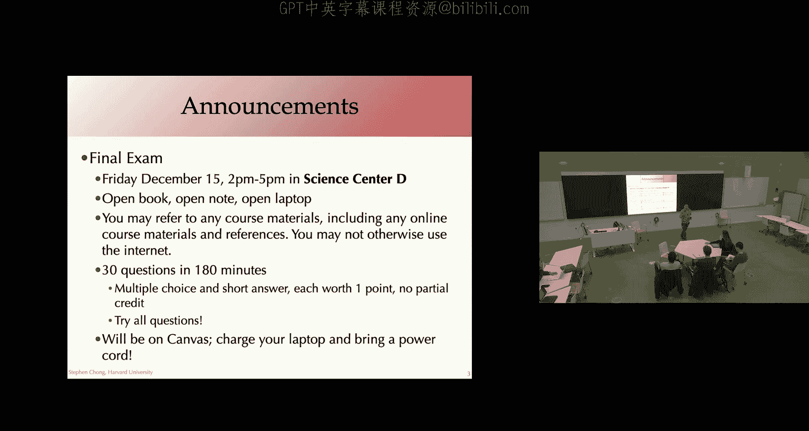
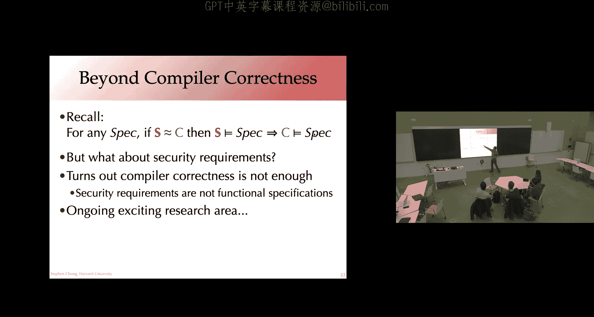
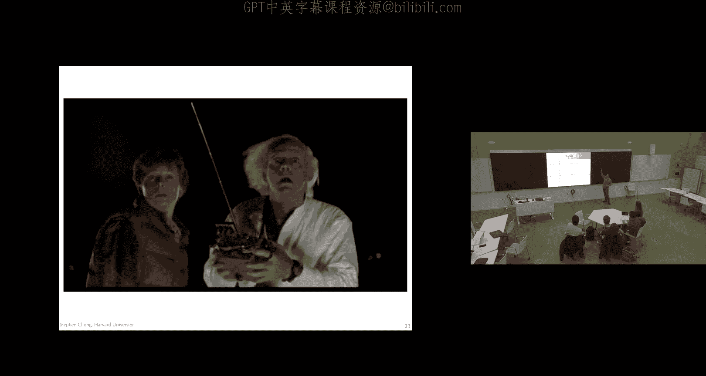
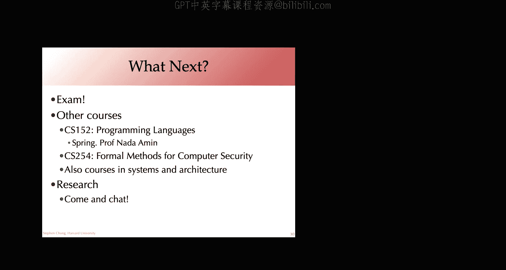
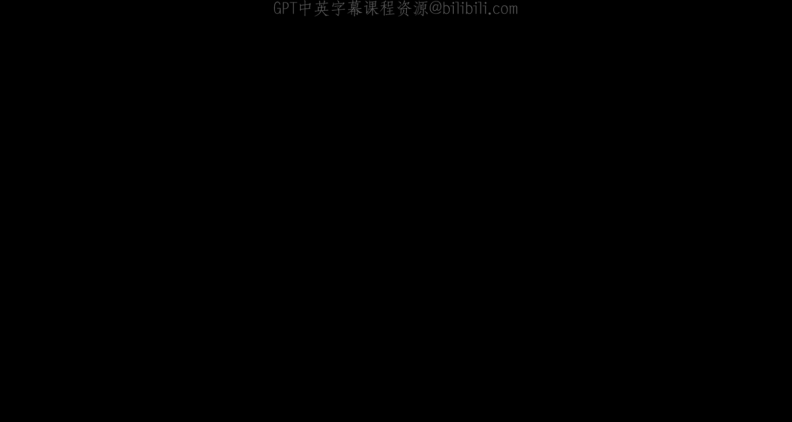

# 编译器课程：第25讲：已验证编译与课程总结

在本节课中，我们将要学习一个与之前不同的主题：已验证编译。我们将探讨为什么需要已验证的编译器，理解编译器正确性的定义，并了解如何构建一个带有机器检查证明的编译器。最后，我们将回顾本学期所涵盖的全部内容。

## 期末考试安排 📅

上一节我们介绍了课程的整体框架，本节中我们来看看本学期的期末考试安排。

期末考试将于12月15日星期五下午2点在科学中心D举行。考试时长为3小时（180分钟），包含约30道选择题和简答题，每题1分，无部分扣分。

考试形式为开卷、开笔记、开笔记本电脑。这意味着你可以参考任何课程材料，包括讲义。我们鼓励你在线查阅笔记，而不是打印大量纸质材料。你可以在考试期间编写和运行程序，但考试内容旨在测试概念，而非实际运行代码的能力。

以下是关于考试的重要规定：
*   禁止使用生成式人工智能（如ChatGPT）参加考试。
*   除访问个人存储在云端（如Dropbox或Google Drive）的文件外，不得使用互联网进行通信或搜索答案。
*   请确保笔记本电脑电量充足，考场会提供电源插座。

## 为什么需要已验证的编译器？🤔

上一节我们明确了期末考试的要求，本节中我们来看看为什么编译器需要被“验证”。

编译器是复杂的软件，可能存在错误。最严重的情况不是编译器崩溃，而是它成功编译出一个行为与源代码语义不符的程序。这种错误在航空、汽车控制、核电站管理等关键系统中是灾难性的。因此，确保编译器输出的正确性至关重要。

你可能会认为，像GCC和LLVM这样经过广泛使用和测试的主流编译器应该足够可靠。然而，一项使用名为**Csmith**的模糊测试工具的研究发现，即使在成熟的编译器中，依然存在大量错误。该工具通过生成随机但精心构造的C程序，并比较不同编译器（如GCC和LLVM）的输出行为来发现不一致。研究发现GCC中存在约79个错误，LLVM中存在约202个错误。

这强烈表明，即使是广泛使用的编译器，其正确性也无法仅通过测试来完全保证。这构成了对“已验证编译器”的需求动机。

## 已验证编译器的愿景 🎯

上一节我们看到了编译器存在错误的现实，本节中我们来看看学术界如何回应这一挑战。

2003年，计算机科学家Tony Hoare提出了一个“重大挑战”：让计算机科学界共同努力，构建一个被形式化证明正确的编译器。这个挑战旨在团结研究社区，完成一项具有革命性、可测试且可行的宏伟目标。

仅仅三年后，**CompCert**项目发表了相关论文，实现了这个目标的绝大部分。CompCert是一个为C语言子集到PowerPC汇编的编译器，并附带了一个机器检查的证明，确保其语义正确性。

令人印象深刻的是，当Csmith工具被用于测试CompCert时，在其已验证的编译阶段中**没有发现任何错误**。这与在其他编译器中发现数百个错误形成了鲜明对比。这强有力地证明了在证明框架内开发编译器优化具有切实的好处。

CompCert是第一个此类已验证的编译器，现已在航空工业等领域商业化应用。此后，也出现了其他已验证的编译器和中间表示（如Vellvm）。

## 定义编译器正确性 ✅

上一节我们看到了已验证编译器的成功实例，本节中我们深入探讨“编译器正确性”究竟如何定义。

直观上，我们希望编译后的程序`C`能保留源程序`S`的语义。为此，我们需要一种方式来形式化程序的“含义”或“行为”。

一种常见的方法是通过关系 `P ⇓ B` 来定义，表示程序`P`可以产生可观察行为`B`。行为`B`可以是一个事件序列，例如输入/输出、程序终止、崩溃、甚至无限循环（发散）。

基于此，我们可以定义**语义等价**：源程序`S`和编译程序`C`语义等价，当且仅当它们能产生完全相同的可观察行为集合。用公式表示为：
`∀B. (S ⇓ B) ⇔ (C ⇓ B)`

然而，这个定义对于实际编译器而言**过于严格**。源语言通常包含未定义行为或非确定性（例如，表达式求值顺序），编译器可以安全地消除某些行为或选择一种确定性的实现方式。此外，目标机器的资源限制（如有限内存）也可能导致某些源程序行为无法实现。

因此，我们需要一个更实用、更弱的正确性定义。

## 适用于已验证编译的正确性定义 🛡️

上一节我们指出了严格语义等价的局限性，本节中我们引入一个更适合已验证编译的、更弱但足够强的正确性定义。

我们只关注**安全的**源程序，即那些不会出现未定义行为（如崩溃）的程序。对于这类程序，我们要求编译后的程序`C`的行为是源程序`S`行为的**一个子集**。用公式表示为：
`∀B. (C ⇓ B) ⇒ (S ⇓ B)`
这意味着，编译程序能做的任何事情，源程序也允许做。但源程序可能允许更多行为（例如，不同的非确定性选择），而编译器可以固定其中一种。

如果源语言和目标语言都是**确定性的**（即对于给定输入，只有唯一行为），那么这个定义等价于：
`∀B. (S ⇓ B) ⇒ (C ⇓ B)`
即，所有源程序的安全行为，编译程序也必须具备。这个方向在证明上通常更容易处理。

为简洁起见，我们将这种关系记为 `S ≈ C`。

这个定义之所以“足够好”，是因为它能保证**规约的保持性**。如果源程序`S`满足某个功能规约（例如，“正确排序列表”），并且`S ≈ C`，那么编译程序`C`也必定满足相同的规约。这正是我们最终关心的事情。

## 验证与验证：两种证明策略 🔧

上一节我们定义了编译器正确性，本节中我们探讨两种实现证明的策略：**验证**与**验证**。

设 `comp(S)` 是一个编译器函数，它要么成功返回编译代码`C`，要么失败。

*   **已验证编译器**：指编译器程序 `comp` 本身附带一个证明，表明：
    `∀S, C. (comp(S) = OK C) ⇒ (S ≈ C)`
    这需要对编译器自身的逻辑进行全局证明，难度较大。

*   **已验证验证器**：指一个验证器函数 `validate(S, C)`，它检查给定的`S`和`C`是否满足 `S ≈ C`。它附带一个证明，表明：
    `∀S, C. (validate(S, C) = true) ⇒ (S ≈ C)`
    验证器可以保守地返回`false`（即使两者等价，但无法确定）。这种方法只需针对给定的程序对进行验证，通常比验证整个编译器更容易。

关键洞见是：**我们可以用一个已验证的验证器轻松构造出一个已验证的编译器**。
新编译器 `comp'(S)` 的工作流程如下：
1.  用原始（未验证的）编译器 `comp` 编译`S`，得到`C`。
2.  用已验证的验证器 `validate(S, C)` 进行检查。
3.  如果验证通过，则输出`C`；否则，报错。
由于`comp'`只在验证器确认正确性后才输出代码，因此它本身就是一个已验证的编译器。

这种方法的好处是**组合性**。编译器通常由多个阶段（翻译过程）组成。如果我们为每个阶段都构建一个已验证的验证器（或编译器），那么将它们串联起来，就能得到整个编译流程的验证。这大大降低了构建大型已验证编译器的复杂度。

## CompCert 架构剖析 🏗️

上一节我们介绍了验证器的强大作用，本节中我们以CompCert为例，看它如何运用这些理念。

CompCert编译器是用Coq证明辅助工具编写的。其架构体现了分阶段验证和验证器策略的思想。

以下是其编译管道的主要阶段：
1.  **非验证前端**：C源代码被解析并简化为**C light**中间表示。此阶段的代码未经形式化验证（早期Csmith在此发现了错误）。
2.  **已验证翻译**：从**C light**到**C#minor**，再到**Cminor**，然后到**RTL**。这些阶段是已验证的。
3.  **寄存器分配（关键案例）**：从**RTL**到**LTL**需要进行寄存器分配。图着色算法非常复杂，难以直接验证。CompCert的解决方案是：
    *   使用**未经验证的**启发式图着色算法生成一个寄存器分配映射。
    *   然后，使用一个**已验证的验证器**来检查该映射是否有效（例如，无冲突分配）。
    *   最后，用一个已验证的步骤，根据这个已验证有效的映射来转换程序。
4.  **后续已验证阶段**：从**LTL**到**Linear**，再到**Mach**，最后到**PPC**抽象语法，这些步骤都是已验证的。
5.  **非验证后端**：一个未经验证的代码打印器将PPC抽象语法转换为实际的PowerPC汇编代码。

这种架构展示了如何将难以验证的复杂优化（如寄存器分配）通过“未验证生成 + 已验证检查”的模式纳入已验证编译框架，是验证器策略的完美体现。

## 课程总结与回顾 🎓

上一节我们深入了解了已验证编译器的构造，本节中我们将回顾整个学期在CS153课程中所涵盖的广阔领域。

让我们将思绪拉回到学期初，我们首先认识了编译器这个将高级源代码转换为低级机器码的“黑盒”。随后，我们打开这个黑盒，系统性地探索了其中的每一个阶段：

以下是本学期我们学习的主要内容：
*   **基础与后端**：我们从目标架构开始，回顾了x86汇编、内存布局和调用约定，并实现了汇编解释器。这引出了对**LLVM中间表示**的深入探讨。
*   **前端**：我们学习了词法分析和语法分析，包括递归下降、LL和LR分析算法。
*   **语言、法律与伦理**：我们探讨了开源软件对编译器生态的重要性及其相关责任。
*   **函数与类型**：我们研究了如何编译函数（包括一等公民函数），深入学习了类型检查、判断、推理规则和子类型。
*   **中间表示与优化**：我们接触了大量优化转换，并学习了**数据流分析**这一理解程序行为、支撑优化的关键静态分析技术。
*   **寄存器分配**：我们深入探讨了寄存器分配的挑战，并学习了图着色等算法与启发式方法。
*   **高级特性实现**：在课程后期，我们探讨了如何编译**面向对象**的特性以及**垃圾回收**机制。
*   **前沿主题**：最后，我们今天学习了**已验证编译**，如何为编译器提供形式化正确性证明。

通过一系列作业，你们亲手实践了从高级语言到x86可执行文件的完整编译流程，构建了一个真正的编译器管道。这是值得骄傲的成就。

编译器技术与编程语言理论、计算机体系结构、操作系统和安全性等领域紧密相连。希望本课程为你打下了坚实的基础，并激发了你在这些相关领域进一步探索的兴趣。

感谢大家一学期以来的投入、思考和精彩的互动。祝大家在期末考试以及其他所有期末项目中好运！

**本节课中，我们一起学习了已验证编译的概念、动机、正确性定义以及实现策略，并以CompCert为例分析了其架构。最后，我们全面回顾了编译器课程的核心知识体系。**