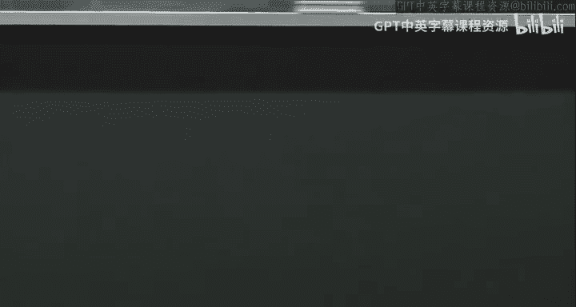

# 025：随机符号的力量 🎲


在本节课中，我们将学习如何利用随机符号矩阵（Random Sign Matrices）这一强大工具，来解决流式算法（Streaming Algorithms）中的几个核心问题。我们将重点探讨L2范数估计、快速线性回归、点查询以及降维技术。这些技术允许我们在仅使用少量内存的情况下，处理大规模、动态更新的数据流，并支持数据的插入和删除操作。

---

## 流式模型与线性草图 📊

上一节我们回顾了流式模型的基本设定。本节中，我们将正式引入**线性草图**（Linear Sketch）这一核心概念，它是支持数据删除操作的关键。

在流式模型中，我们有一个巨大的向量 **x** ∈ ℝⁿ。我们无法存储整个 **x**，只能接收一系列形如 `xᵢ → xᵢ + v` 的更新。我们的目标是，在流结束后，能够回答关于 **x** 的某个函数 `f(x)` 的查询。

线性草图的思想是：我们选择一个 **m × n** 的矩阵 **Π**（其中 `m << n`），并始终在内存中维护一个压缩后的向量：
**y = Πx**

初始时，**x** 是零向量，所以 **y** 也是零向量。当我们在流中看到更新 `xᵢ → xᵢ + v` 时，我们只需执行：
**y → y + v · Πᵢ**
其中 **Πᵢ** 是矩阵 **Π** 的第 **i** 列。无论 `v` 是正（插入）还是负（删除），这个更新操作都有效。

接下来的问题是：如何为不同的查询函数 `f(x)` 设计合适的矩阵 **Π**，以及如何从草图 **y** 中估计出 `f(x)`？

---

## L2范数估计 📏

我们首先考虑如何估计向量 **x** 的 **L2范数的平方**，即 `||x||₂²`。我们将看到，使用随机符号矩阵可以高效地解决这个问题。

### 算法描述
我们选择矩阵 **Π**，其每个元素 **Πᵢⱼ** 独立地随机取 `+1/√m` 或 `-1/√m`，概率各为1/2。
我们维护草图 **y = Πx**。
当查询到来时，我们输出 `||y||₂²` 作为 `||x||₂²` 的估计值。

### 算法分析
我们需要证明，以高概率，估计值 `||y||₂²` 是真实值 `||x||₂²` 的 `(1 ± ε)` 近似。

我们使用切比雪夫不等式进行分析。首先计算期望：
```
E[||y||₂²] = E[∑ᵣ yᵣ²] = ∑ᵣ E[yᵣ²]
```
对于固定的 `r`，`yᵣ = (1/√m) ∑ᵢ σᵣᵢ xᵢ`，其中 `σᵣᵢ` 是随机符号。
因此，
```
yᵣ² = (1/m) (∑ᵢ σᵣᵢ² xᵢ² + ∑_{i≠j} σᵣᵢ σᵣⱼ xᵢ xⱼ)
```
由于 `σᵣᵢ² = 1`，且对于 `i≠j`，`E[σᵣᵢ σᵣⱼ] = E[σᵣᵢ] E[σᵣⱼ] = 0`（独立性）。
所以，
```
E[yᵣ²] = (1/m) ||x||₂²
```
进而，
```
E[||y||₂²] = ∑ᵣ (1/m) ||x||₂² = ||x||₂²
```
期望是正确的。

接下来分析方差 `Var(||y||₂²)`。由于 `yᵣ` 是独立的，方差可加：
```
Var(||y||₂²) = ∑ᵣ Var(yᵣ²)
```
通过计算 `E[yᵣ⁴]` 并利用随机符号的奇次矩为零的性质，可以证明：
```
Var(yᵣ²) ≤ (2/m²) ||x||₂⁴
```
因此，
```
Var(||y||₂²) ≤ m * (2/m²) ||x||₂⁴ = (2/m) ||x||₂⁴
```

现在应用切比雪夫不等式：
```
Pr[ | ||y||₂² - ||x||₂² | ≥ ε ||x||₂² ] ≤ Var(||y||₂²) / (ε² ||x||₂⁴) ≤ (2/m) / ε²
```
如果我们设置 `m = O(1/ε²)`，那么失败概率可以降至一个常数（例如1/3）。

### 提升成功概率
为了将成功概率提升到 `1 - δ`，一个标准的技巧是并行运行 `k = O(log(1/δ))` 个独立的草图，得到估计值 `Y₁, ..., Yₖ`，然后输出它们的中位数。利用切尔诺夫界限可以证明，这能将失败概率指数级降低。

### 空间与时间优化
*   **空间**： 直接存储稠密矩阵 **Π** 需要 `O(mn)` 空间，这是不可接受的。但分析表明，我们只需要 **Π** 的条目是 **4-wise独立** 的。我们可以使用仅需 `O(log n)` 位种子描述的哈希函数族来生成这样的矩阵，从而将空间降至 `O(log n * log(1/δ))`。
*   **更新时间**： 上述稠密矩阵的更新需要 `O(m) = O(1/ε²)` 时间，因为要更新 **y** 的所有 `m` 个分量。为了加速，可以使用 **稀疏化** 的随机符号矩阵（例如，Thorup-Zhang 草图），每列只有一个非零元。这可以将更新时间降至 `O(1)`，同时保持相同的空间和精度保证。

**结论**： 我们可以在 `O(ε⁻² log(1/δ) log n)` 的空间和 `O(log(1/δ))` 的更新时间内，以 `1-δ` 的概率获得 `||x||₂²` 的 `(1±ε)` 近似估计。这对于检测网络流量中的突发（例如DDoS攻击）非常有用。

---

## 快速线性回归 🚀

上一节我们看到了如何估计单个向量的范数。本节中，我们将把随机符号矩阵应用于**线性回归**问题，显著加速求解过程。

### 问题回顾
在线性回归中，我们有观测矩阵 **A** ∈ ℝⁿˣᵈ（`n >> d`）和观测向量 **b** ∈ ℝⁿ。我们希望找到参数向量 **x** ∈ ℝᵈ，最小化残差平方和：
```
x* = argmin_x ||Ax - b||₂
```
经典解为 `x* = (AᵀA)⁻¹ Aᵀb`。计算 `AᵀA` 的瓶颈时间复杂度为 `O(nd²)`。

### 子空间嵌入（Subspace Embedding）
关键思想是使用一个随机符号矩阵 **Π** ∈ ℝᵐˣⁿ（`m << n`）来压缩数据。我们称 **Π** 是子空间 `V = span(A, b)` 的一个 **ε-子空间嵌入**，如果对于所有 **v** ∈ `V`，都有：
```
(1 - ε) ||v||₂² ≤ ||Πv||₂² ≤ (1 + ε) ||v||₂²
```
这意味着 **Π** 近似保留下子空间 `V` 中所有向量的范数。

### 算法与保证
如果我们有这样的 **Π**，我们可以求解压缩后的回归问题：
```
x̃* = argmin_x ||ΠAx - Πb||₂
```
可以证明，这个解几乎和原问题的最优解一样好：
```
||A x̃* - b||₂ ≤ √((1+ε)/(1-ε)) * ||A x* - b||₂
```

**计算优势**： 原问题的瓶颈 `AᵀA` 需要 `O(nd²)` 时间。压缩后，我们需要计算 `(ΠA)ᵀ(ΠA)`，这只需要 `O(md²)` 时间。如果我们能构造一个 `m` 仅依赖于 `d` 和 `ε`，而与巨大 `n` 无关的子空间嵌入，就能实现巨大加速。

### 构造与效率
可以证明，使用类似 Thorup-Zhang 的稀疏随机符号矩阵作为 **Π**，只要取 `m = O(d²/ε²)`，它就以高概率成为子空间 `V` 的嵌入。
*   **计算 ΠA**： 由于 **Π** 极度稀疏（每列一个非零元），计算 **ΠA** 的时间与 **A** 的非零元数量成正比，通常非常快。
*   **总时间**： 因此，总运行时间从 `O(nd² + d³)` 降至 `O(nnz(A) + d³/ε²)`，其中 `nnz(A)` 是 **A** 的非零元个数。这对于大规模回归问题至关重要。

---

## 点查询（Point Query）🔍

现在，我们考虑流式模型中的另一种查询：**点查询**。即，用户询问特定坐标 `i` 的值 `xᵢ`。我们允许近似回答，形式为 `xᵢ ± ε||x||₁`。

### 算法思路
我们希望找到一个矩阵 **Π**，使得其列向量 **πᵢ** 具有以下性质：
1.  `||πᵢ||₂ = 1`。
2.  对于任何 `i ≠ j`，有 `|⟨πᵢ, πⱼ⟩| ≤ ε`。

如果我们有这样的 **Π**，并维护草图 **y = Πx**。那么当查询 `xᵢ` 时，我们计算：
```
x̃ᵢ = πᵢᵀ y = πᵢᵀ (Πx)
```
展开可得：
```
x̃ᵢ = xᵢ + Σ_{j≠i} xⱼ ⟨πᵢ, πⱼ⟩
```
由于 `|⟨πᵢ, πⱼ⟩| ≤ ε`，所以 `|x̃ᵢ - xᵢ| ≤ ε Σ_{j≠i} |xⱼ| ≤ ε ||x||₁`。这正是我们想要的近似保证。

### 如何构造这样的 Π？
这可以通过 **约翰逊-林登斯特劳斯引理（Johnson-Lindenstrauss Lemma, JL引理）** 直接得到。
我们将JL引理应用于一个包含 `0` 和 `n` 个标准基向量 `e₁, ..., eₙ` 的点集。
JL引理保证，存在一个映射（例如随机符号矩阵投影）到 `m = O(ε⁻² log n)` 维空间，能近似保持所有这些点对之间的距离。
*   保持 `eᵢ` 到 `0` 的距离，意味着 `||Πeᵢ||₂ ≈ 1`（可后续归一化）。
*   保持 `eᵢ` 和 `eⱼ` (`i≠j`) 之间的距离，因为原距离为 `√2`，而 `||Πeᵢ - Πeⱼ||₂² = ||Πeᵢ||₂² + ||Πeⱼ||₂² - 2⟨Πeᵢ, Πeⱼ⟩ ≈ 2`，结合范数约等于1，可推导出 `|⟨Πeᵢ, Πeⱼ⟩| ≈ 0`，实际上可以 bounded by `ε`。

因此，用JL引理构造的矩阵 **Π** 的列，就近似满足我们所需的正交性条件。

---

## 降维（Dimensionality Reduction）📉

最后，我们简要探讨随机符号矩阵在**降维**方面的经典应用，即JL引理本身。



### JL引理陈述
对于任何 `N` 个点组成的集合 `X ⊂ ℝⁿ`，存在一个映射 `f: ℝⁿ → ℝᵐ`，其中 `m = O(ε⁻² log N)`，使得对于所有 `u, v ∈ X`，都有：
```
(1 - ε) ||u - v||₂ ≤ ||f(u) - f(v)||₂ ≤ (1 + ε) ||u - v||₂
```
即，`f` 近似保持了集合中所有点对之间的距离。

### 证明思路
我们使用**随机投影**作为 `f`，具体来说，`f(x) = (1/√m) Π x`，其中 **Π** 是 `m × n` 的随机符号矩阵。
证明的关键是，对于任意固定的单位向量 `z`（例如 `z = (u-v)/||u-v||`），我们需要证明：
```
Pr[ | ||Πz||₂² - 1 | > ε ] 非常小（例如 < 1/N²）
```
一旦对单个向量成立，再对 `X` 中所有 `C(N,2)` 个点对对应的向量进行**联合界（Union Bound）**，就能得到全局结论。

对单个向量的分析，与L2范数估计类似，但需要比切比雪夫不等式更强的尾部分析（例如使用矩生成函数或更高阶矩），才能得到 `exp(-Ω(ε²m))` 形式的失败概率，从而反推出 `m = O(ε⁻² log N)` 的维度足以使联合失败概率小于1。

---

## 总结 🎯

本节课我们一起探索了**随机符号矩阵**在流式算法和降维中的强大力量：

1.  **L2范数估计**： 通过维护随机投影草图 `y = Πx`，可以用 `O(ε⁻² log(1/δ))` 的空间估计 `||x||₂²`，并支持流式更新和删除。
2.  **快速线性回归**： 利用随机投影作为子空间嵌入，可以将大规模回归问题的计算瓶颈从 `O(nd²)` 降至与 `n` 无关的量级，实现显著加速。
3.  **点查询**： 通过设计列向量近似正交的投影矩阵，可以从草图中近似恢复单个坐标的值。
4.  **降维（JL引理）**： 随机投影可以将高维空间中的点集嵌入到低维空间，同时近似保持所有点对之间的距离，这是许多机器学习算法的理论基础。

这些技术背后的共同点是**线性草图**的抽象、**随机投影**的度量保持特性，以及通过**概率分析**（期望、方差、尾界限）来证明其有效性。它们构成了处理大规模数据算法的核心工具箱之一。