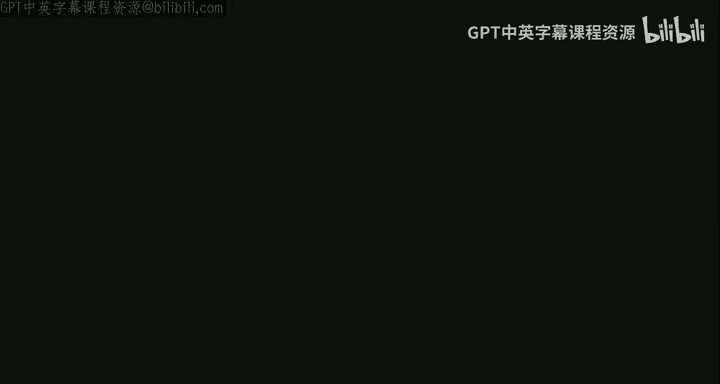

# 高级算法：11：对偶拟合、整数性间隙与多项式时间近似方案



在本节课中，我们将要学习三个核心主题：首先，我们将完成对加权集合覆盖问题贪心算法的对偶拟合分析。接着，我们将探讨线性规划松弛在近似算法中的一个根本性限制——整数性间隙。最后，我们将介绍一种更强大的近似算法框架：多项式时间近似方案。

## 集合覆盖的对偶拟合分析

上一节我们介绍了对偶拟合的基本思想，本节中我们来看看如何将其应用于加权集合覆盖问题。

加权集合覆盖问题的输入是：一个由元素 `1` 到 `n` 组成的全集 `U`，以及 `m` 个集合 `S`，每个集合 `S` 是 `U` 的子集，并有一个成本 `C_S`。目标是找到一个子集族，覆盖所有元素，且总成本最小。

贪心算法如下：当存在未被覆盖的元素时，选择 **成本/新覆盖元素数** 比值最小的集合。

**定理**：贪心算法是 `H_n` 近似算法（`H_n` 是第 `n` 个调和数），这意味着其近似比约为 `log n`。

我们将通过分析其对偶线性规划来证明这一点。

**原始线性规划（松弛）**：
```
最小化： Σ_S C_S * x_S
约束条件：对于所有元素 i ∈ [1, n]， Σ_{S: i ∈ S} x_S ≥ 1
          对于所有集合 S， x_S ≥ 0
```
其中 `x_S = 1` 表示选择集合 `S`。

**对偶线性规划**：
```
最大化： Σ_{e=1}^{n} y_e
约束条件：对于所有集合 S， Σ_{e ∈ S} y_e ≤ C_S
          对于所有元素 e， y_e ≥ 0
```

现在，我们使用对偶拟合技术。在算法运行过程中，当我们选择一个集合 `S` 时：
*   在原始解中，设置 `x_S = 1`。
*   对于 `S` 新覆盖的每个元素 `e`，在对偶解中设置 `y_e = C_S / (S 新覆盖的元素数)`。

**观察**：原始解的成本等于对偶解的值（因为我们按此方式构造）。

然而，这样构造的对偶解 `y` 可能不满足对偶约束（即对于某些集合 `S`，`Σ_{e ∈ S} y_e` 可能超过 `C_S`）。但我们可以证明，将 `y` 按比例缩小 `H_n` 倍后，将得到一个可行的对偶解。

**证明关键步骤**：
对于任意集合 `S`，设其大小为 `k`。将其元素按首次被覆盖的顺序排列为 `e_1, e_2, ..., e_k`。考虑元素 `e_i` 被覆盖的时刻。在那一刻，算法本可以选择集合 `S`，其“单价”为 `C_S / (k - i + 1)`。由于贪心算法选择了当时单价最低的集合，因此分配给 `e_i` 的 `y_{e_i}` 至多为 `C_S / (k - i + 1)`。于是，对于集合 `S` 有：
```
Σ_{e ∈ S} y_e ≤ C_S * Σ_{i=1}^{k} (1 / i) = C_S * H_k ≤ C_S * H_n
```
因此，`y / H_n` 是一个可行的对偶解。

根据弱对偶定理，任何原始可行解的成本至少等于任何对偶可行解的值。因此，贪心算法的成本（即原始解成本）至多是对偶最优解的 `H_n` 倍，从而至多是原始整数最优解的 `H_n` 倍。这就证明了 `log n` 近似比。

## 顶点覆盖与对偶拟合

上一节我们分析了集合覆盖，本节中我们来看看一个更简单的例子：无权顶点覆盖。

在顶点覆盖问题中，给定一个无向图 `G=(V, E)`，目标是选择一个顶点子集 `S`，使得每条边至少有一个端点在 `S` 中，并最小化 `|S|`。

**注意**：顶点覆盖是集合覆盖的一个特例（将每个顶点视为一个“集合”，包含其关联的边作为“元素”）。

贪心算法如下：当存在未被覆盖的边 `(u, v)` 时，将 `u` 和 `v` 都加入覆盖集 `S`。

我们将通过构造原始解和对偶解来分析它。

**原始线性规划（松弛）**：
```
最小化： Σ_{v ∈ V} x_v
约束条件：对于所有边 (u, v) ∈ E， x_u + x_v ≥ 1
          对于所有顶点 v， x_v ≥ 0
```

**对偶线性规划**：
```
最大化： Σ_{e ∈ E} y_e
约束条件：对于所有顶点 v， Σ_{e: v ∈ e} y_e ≤ 1
          对于所有边 e， y_e ≥ 0
```

**对偶拟合过程**：
当贪心算法覆盖一条边 `e = (u, v)` 时：
*   在原始解中，设置 `x_u = 1` 且 `x_v = 1`。
*   在对偶解中，设置 `y_e = 1`。

**分析**：
*   原始解和对偶解都是可行的。
*   每次将对偶解的值增加 `1`（通过设置 `y_e=1`），原始解的成本最多增加 `2`（可能只增加 `1`，如果某个顶点已被覆盖）。
*   因此，原始解的成本至多是对偶解值的 `2` 倍。
*   根据弱对偶定理，对偶解的值不超过原始整数最优解的值。
*   所以，贪心算法是 `2` 近似算法。

## 整数性间隙

我们一直在使用线性规划松弛来设计和分析近似算法。但这种方法存在一个根本性的限制：松弛后的线性规划最优解与原始整数规划最优解之间可能存在固有的差距，这被称为**整数性间隙**。

对于一个最小化问题，设 `OPT_IP` 为整数规划的最优值，`OPT_LP` 为其线性规划松弛的最优值。整数性间隙指的是 `OPT_LP` 与 `OPT_IP` 的最大可能比值（对于最小化问题，`OPT_LP ≤ OPT_IP`，我们关心 `OPT_IP / OPT_LP` 的上界）。如果存在一个实例使得这个间隙是 `β`，那么任何基于与该 LP 最优值比较的分析方法，其近似比不可能优于 `β`。

### 顶点覆盖的整数性间隙

考虑一个 `n` 个顶点的完全图 `K_n`。
*   **分数最优解**：给每个顶点分配 `x_v = 1/2`。这是一个可行的 LP 解，总成本为 `n/2`。可以证明这是最优的，所以 `OPT_LP = n/2`。
*   **整数最优解**：任何顶点覆盖必须包含至少 `n-1` 个顶点（否则会有一条边未被覆盖）。所以 `OPT_IP ≥ n-1`。

因此，整数性间隙至少为 `(n-1) / (n/2) ≈ 2`。这意味着，使用这个特定的 LP 松弛，我们无法设计出优于 `2` 近似的算法（通过比较 `OPT_LP` 的分析框架）。

### 集合覆盖的整数性间隙

我们可以构造一个实例，使得集合覆盖的整数性间隙为 `Ω(log n)`。
构造如下：设 `n = 2^q - 1`。将全集元素对应于 `q` 维二元向量空间 `F_2^q` 中的非零向量。对于每个向量 `α ∈ F_2^q`，定义一个集合 `S_α`，包含所有满足点积 `α·e = 1 (mod 2)` 的元素 `e`。
*   **分数最优解**：每个元素恰好被一半的集合包含。因此，设置每个 `x_S = 2/(2^q) = 1/2^{q-1}` 是一个可行的 LP 解，总成本为 `2^q * (1/2^{q-1}) = 2`。所以 `OPT_LP ≤ 2`。
*   **整数最优解**：假设存在一个大小仅为 `q-1` 的集合族覆盖了所有元素。这意味着存在 `q-1` 个线性方程（对应 `q-1` 个集合），其解空间（满足所有方程 `α_i·e = 0` 的 `e`）至少是 `1` 维的，必然包含非零向量，这与“所有元素被覆盖”（即没有非零向量同时满足所有 `q-1` 个方程为 `0`）矛盾。因此，任何整数解至少需要 `q` 个集合，`OPT_IP ≥ q ≈ log2(n+1)`。

因此，整数性间隙至少为 `Ω(log n)`。这从另一个角度解释了为什么贪心算法的 `log n` 近似比是紧的，并且提示我们，使用这个标准 LP 松弛无法获得更好的近似比。

## 多项式时间近似方案

前面我们看到的近似算法具有固定的近似比（如 `2`, `log n`）。但有时我们希望对于任意给定的精度要求 `ε > 0`，都能得到一个近似比 `1+ε`（对于最小化问题）或 `1-ε`（对于最大化问题）的算法，同时运行时间关于输入规模是多项式级的（尽管关于 `1/ε` 可能是指数级的）。这类算法被称为**多项式时间近似方案**。

以下是相关定义：
*   **PTAS**：对于每个固定的 `ε > 0` 和问题规模 `n`，算法能在时间 `n^{f(1/ε)}` 内实现 `(1+ε)` 近似（最小化）或 `(1-ε)` 近似（最大化）。这里 `f` 是某个函数，运行时间关于 `n` 是多项式，但关于 `1/ε` 可以任意增长。
*   **FPTAS**：**完全**多项式时间近似方案。算法运行时间关于 `n` 和 `1/ε` 都是多项式级。
*   **FPRAS**：**完全多项式时间随机近似方案**。这是一个随机算法，运行时间关于 `n` 和 `1/ε` 是多项式级，并以至少 `2/3` 的概率返回一个 `(1+ε)` 近似的解。

### 背包问题的 PTAS

我们以经典的 **0-1 背包问题** 为例展示一个 PTAS。问题定义如下：给定容量 `W`，`n` 个物品，每个物品 `i` 有重量 `w_i` 和价值 `v_i`。目标是选择物品子集，使得总重量不超过 `W`，且总价值最大。

首先，我们回顾两个基础知识：
1.  **分数背包最优解**：将物品按单位价值 `v_i / w_i` 降序排列，并依次尽可能多地放入背包，直到装满。最后一个物品可能只取一部分。
2.  **修改的贪心算法**：运行上述贪心算法（但只取整件物品），同时单独考虑价值最高的单个物品。取这两个解中较好的一个。这个算法是 `2` 近似的。

**关键引理**：设贪心算法依次考虑了物品 `1, 2, ..., k`（按单位价值降序），并且第 `k` 个物品因空间不足而无法完全放入。那么，前 `k` 个物品的总价值 `Σ_{i=1}^{k} v_i` 至少等于**分数背包**的最优值，从而也至少等于**整数背包**的最优值 `OPT`。

基于此，我们可以设计一个 PTAS。核心思想是：在最优解中，价值很大的物品数量是有限的。

**算法思路**：
1.  **猜测**：枚举所有大小不超过 `t = ⌊1/ε⌋` 的物品子集 `S`。`S` 将作为我们猜测的“大物品”集合（即最优解中价值超过 `ε * OPT` 的物品）。由于 `t` 是常数，这样的子集数量为 `O(n^t)`，关于 `n` 是多项式。
2.  **验证与填充**：对于每个猜测的 `S`，检查其总重量是否不超过 `W`。如果超重，则跳过。否则，从剩余物品中移除所有价值大于 `S` 中任何物品的物品（因为它们也应该是“大物品”，但不在我们的猜测中，说明猜测有误，但算法会继续尝试其他猜测）。
3.   对剩余物品（都是“小物品”，价值 ≤ `ε * OPT`）运行上述贪心算法。
4.  输出所有尝试中得到的最高价值解。

**正确性分析**：当算法恰好猜中了最优解中的“大物品”集合 `S*` 时，设 `OPT = V(S*) + OPT'`，其中 `OPT'` 是最优解中小物品部分的价值。我们的算法得到了 `V(S*) + GREEDY`。根据引理，`GREEDY + v_k ≥ OPT'`，其中 `v_k` 是贪心算法第一个放不下的物品的价值。由于所有小物品价值 ≤ `ε * OPT`，所以 `v_k ≤ ε * OPT`。因此，`GREEDY ≥ OPT' - ε * OPT`。最终，算法获得的价值至少为 `V(S*) + OPT' - ε * OPT = OPT - ε * OPT`。

**运行时间**：主要开销是枚举大小为 `O(1/ε)` 的子集，共 `O(n^{1/ε})` 种可能。对于每个猜测，运行贪心算法需要 `O(n log n)` 时间。因此，总运行时间为 `O(n^{1/ε + 1} log n)`，对于固定的 `ε`，这是关于 `n` 的多项式时间。

本节课中我们一起学习了如何用对偶拟合分析加权集合覆盖和顶点覆盖的贪心算法，理解了整数性间隙对基于线性规划的近似算法设计带来的根本限制，并初步了解了更强大的多项式时间近似方案的概念及其在背包问题上的一个经典构造。