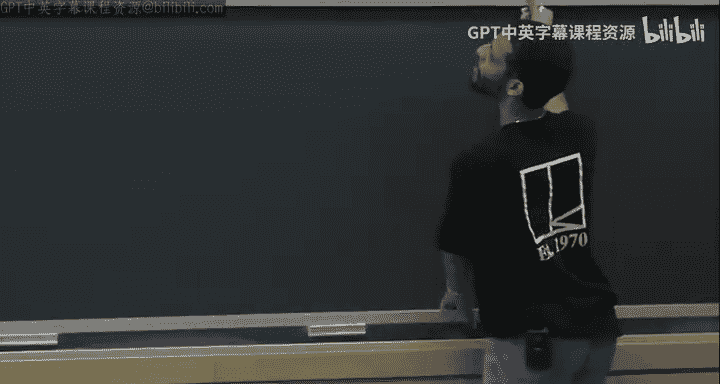
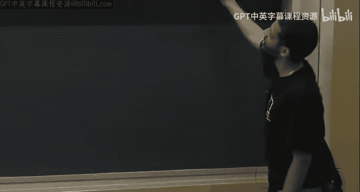

# 哈佛大学《高级算法｜Harvard Advanced Algorithms (COMPSCI 224) 2016》中英字幕（deepseek） - P14：-14-Advanced Algorithms (COMPSCI 224), Lecture 15.zh_en - GPT中英字幕课程资源 - BV1cDJGziELP

No I guess I'll just get started。

So a couple things one is。I think I sent an email about project proposals， which are due next week。

 Thursday。 I don't think the website has a time。呃。If it does have a time， you should stick for that。

 I think it doesn't。 So that means anytime Thursday， which means， I guess。11，59 PM。Thursday evening。

嗯。Yeah， and you know the primary purpose of this product proposal is。

To just make sure that you're looking into potential projects， right。

 So the project is due sometime in December during， I guess the last day of reading period。

 whenever that is。And I just wanted to make sure that。

You knowt don't start thinking about project ideas the week before or something， right。

This date is here to force you to think about project ideas。嗯。And yeah， so you shouldn't。

Even if you think you might want to change your project later。You still have to do this。

 And if you do want to change， you can。 but you would have to like submit a new proposal。

 And these things aren't that long anyway。 But I just want to make sure you have some project idea。

By next week。AQu about anything related to the project。Good。Yeah。

 so I guess last week you had a couple of guest lectures。And before that， I think I ended with。嗯。

FP ta， F Pra and。SDPs， Inity apps and SDPs， right， So， okay， so good。 So for a while now。

 we've just been talking about linear programming and saying there is some magic machine that can solve linear programs。

 And we never really got into how you would actually do it。😊，Okay。

 so it's about time that we actually give algorithms to solve linear your programs。

So today I'm going to start off with the simplex。I'm also going to prove strong duality。

 and you'll see that kind of the proof that simplex works。Implies like。

 it just gives you strong duality for free。 Okay， so like at the end of simplex running， you'll like。

 you'll be able to read off a dual， feasible solution。Which achieves opt， okay。

 so that implies strong duality。嗯嗯。And then if I have time， I'll say a little bit about。

So one issue with Sx is that it works well in practice。

 I'll cite something during lecture that gives some evidence for why。But in the worst case。

 all known implementations of simplex， in the worst case， take exponential time。

So then I want to tell you a little bit about how to get polynomial time in your programming algorithms。

Okay， so today。So one， is going to be let's say solving LPs。So one is going to be the simplex。

Algorithm。And two is going to be， we'll see， for example， certain things like strong duality。

And complementaryary slackness。And three。🤧。We'll see a little bit about ellipoid。

 just like what it is。Or what it's roughly about。Okay。So。First of all。So LP is linear programming。

So far， I've been saying that we want to do minimize。C transpose X， such that。And then。You know。

So many linear inequalities。Okay， so for example， it could be that a dot x is equal to B。

Or is that most be or is that least be， there are many different types of inequalities you could have here。

Okay， so I want to put everything in what's called standard form。Okay， which is men。C transpose X。

 such that。AX is equal to B， and x is at least 0。Okay， where。This is a vector。

 So what I mean here is that coordinate wise， it's at least zero。Okay， and here。嗯。

X is an n dimensional vector。A。Is M by N？And。N is at least M。Okay， so I claim that any。嗯。

Any LP of this form can be written as in this form， and I'll say why。And， you know。

 if you have a maximization problem like max C transpose X， that's the same thing as。

LikeSo this could be Max Orman， right？But you could。

 without loss of generality say it's min because if it's max， that's just minimizing the negative。

 So you can put a negative sign on all the entries of C。Okay。

 so how can I write anything in this form？So first of all。So getting to standard form。

 how do I do that？Becauseuse as I'm going to describe the simple algorithm。

 it assumes that your LP is written in standard form。 So that's why I want to put it。Like that。

So how do we do that？ Well， if I have a constraint。Imagine this is like a row of A。

 if I have a constraint that says AI dot X is equal to B。Okay。

This is the same thing as having the two constraints。AI dot X。Is that least B as well as？AI。X。

Negative A dot x is at least B negative B。Is that what I wanted to say， so I wanted to say yes。

 I believe so， okay？And similarly。AI dotx。Is at most， BI is the same thing as negative AI dotX。

Is at least minus B？So this already says that the only constraints we have to deal with are grid than are equal to constraints。

Okay。And then we can define Slack variables。For each constraint I。We define。A slackck variable。SI。

 which we and we write a constraint that S has to be at least  zero。

And the point is S is going to represent the difference。 So if this is greater than equal， it's B。

Then this means that we can write AI dot X as B I plus S I。 So S I is just the gap between these two。

 between the left and the right hand side， Okay， so。So replace。AI dotx。Is at least B？With。AI。x。

Plus minus Si。Equals B。Okay。Very good and then so that already。

That already says we can turn everything into this form that A X equals B。But there's one more thing。

 which is this x greater than equal to zero business。And actually， let me just write that here。

 actually。So。We can write， for example。X。X to be X plus minus X minus。Where。Xi plus is at least0。

 and Xi minus is at least 0。any number， whether positive or negative。

 can be written as the difference of two non negative numbers。O。Good。

 so once we do all these transformations， then all the variables that appear in our LP。The slacks。

 as well as these plus minus variables， are all non negative。 Okay。

 so all the variables in the LP are non negative， and all the constraints are equality constraints。

Okay。And the reason that n is at least M is because for each of the constraints。

 we have a slackck variable。Plus we have all the variables we have before。

 so the number of variables in this LP is at least the number of constraints。Questions about that。

Yeah。I mean， I I haven't I haven't told you why any of this is important， right， Like why。

 why did I put it in this form as opposed to some other form。

I'm just putting in this form because Sx is going to operate on LPs in this form。

Or at least the way I'm going to present S。Okay。

Okay， so simplex。Is going to be a greedy algorithm。Well， first of all， let's。

Let's look at what an LP is geometrically。Okay， so let me draw one in 2D。We have。嗯。

So let's say we have these x gradient equals0， y gradientd equals zero constraints。

Then we have some other constraints as well。So one constraint might say you're on this side of the space。

 another might say you're on side of you're in this half space， et cetera。So at the end of the day。

Your feasible region is。Is this polygon？Okay。And。The basic way that simpleimpx starts。😡。

The basic way that it proceeds is it starts at some， Oh and then there's going to be the C vector。

 right， So C， let's say C。This is C right here。不认。Let me also， okay good， so that's fine。So。

The basic way simplex starts is or that it goes and it starts at some vertex。😡。

and then it like greedily walks to neighboring vertices that do strictly better。Okay。嗯。So。

First it might walk here。And then we walk here， and then it's done。So there's an issue of like。

 how do you get an initial vertex， How do you prove that there's always。

A better vertex that's adjacent to you。And if there are many adjacent verses that are better。

 how do you choose one？Or does that matter， and also how do you even know that the optimal solution is obtained at a vertex？

maybe vertices aren't always optimal。Okay， so。So simplex。It's by Dan Zig。

 oh do I have ascribe for today？Okay，Dodsley in 47。嗯。Start at some vertex。嗯。Greily move。Two vertices。

 two adjacent vertices。To adjacent verticies which do better。I improvemve the objective。Stop。

When at the optimal vertex。And how do you know that you're at the optical vertex well？呃。

As I say more about how Splex works， we'll see exactly what the stopping condition is。Okay。

 so first of all， let me。So that's all nice in pictures。

Well let me be a little more precise about stuff。So definition。嗯。So let's say。

 before I give the definition， let me define P。Is the set of all points？X， such that。

AX is equal to B。And x is greater and equal to  zero。

So it's the polytope over which we're trying to minimize this objective function。And then。

 definition。Okay。We say。X and P。Is a。Vertex。What do I mean by something being a vertex？

There exists a y， a vector y， which is not zero。Such that。

X minus y is in P and also x plus y is in P。All。So that's what I mean by vertex。🤧Yeah。对。So。

First of all， I want to say。What？Question。施別のある。Oh yeah， yeah。

 we say is a vertex if there does not exist away。呃。F yeah。Okay。😊，You're to that。

If there does not exist a Y such that， if there exists such a Y， then it's not a vertex。Yes sorry。

All right。Okay， good。 So now I want to just immediately tackle the first one。

 so start at some vertex。Now， how do we get the initial vertex？That seems a little so。

It's easy to maybe confuse yourself on this one because of the following。 So I claim that。

Feaasibility， meaning checking， checking that there is a solution to these constraints。

 Forget about the objective function。 Just suppose you want to check some that some X satisfies those constraints。

I claim that that's equivalent。To actually solving the minimization problem。whyhy is that？

Because I can sort of guess the optimal value and then do a binary search。

So suppose that I guess the optimal value is R。😡，Okay。Then I can have another constraint。

Which says that C transpose x is at most R。I can move the objective into the constraint。

 and then I can just ask， is there an X which achieves at most R， and if not。

 I'll move on in my binary search。Okay， so even finding a point。

So we reduce we can reduce the minimization problem to finding a point in this P。And yeah。The binary。

Right， so okay， so I didn't really。That's a very good point。 So why would it terminate。

 So you would get more and more precision， more and more bits of precision as you go through these iterations of binary search。

And。We're going to see this suit， and I'm skipping ahead a little， but。Okay。

 so there are N variables and M constraints。 right， So what does it mean， What is a vertex exactly。

We're going to see that a vertex is basically a point where。M of the constraints。Matter are tight。

 and then the others。 It's like the intersection of M constraints。Okay。

 and all the other variables that don't correspond to those constraints don't matter。Okay。嗯。So。

Like how many vertices are there， they're going to be at most N choose M of them。Okay。

 and given the M constraints that define the vertex。

Figuring out what that vertex is is solving a linear system。Okay。

 so if you assume that all the entries in A and B and C are bounded precision integers。

 let's say they all take some number of bits B。Well。

 then you can bound the number of bits that are necessary to write down a vertex。

So to write down a vertex， you have to take some sub matrix of a and then solve a linear system。

And in terms of the precision of the input bits， you can write down how many bits are needed to solve the system。

Right。So you know that。The optimal X is a rational number of bounded precision， and you can write。

 you can write a bound for that precision。 So you know that。

You know that this optimal value is a rational number of a certain precision。

 So your binary search doesn't need to go beyond that precision。A。Yeah， so I skipped ahead。

 but we'll see basically， I mean， you know， you know a priori like an upper bound on the number of bits of precision you need to actually represent。

Oct。Or to represent the X， which achieves opt。So you only need to binary research that number of times to get that level of precision。

 Does that make sense。It was based on。Yeah， yeah。 So assuming that vertices are optimal and also assuming that vertices are obtained by solving linear systems on sub matrices of A。

Then。Yeah， you can bound the amount of precision you need to write down a vertex to write down optt。

And you only need to binary research that number of iterations。Yeah， thats a good question。

 Any other questions？Okay， so what I was trying to say， I guess， is that like。

It seems maybe a little weird that we're able to get a starting vertex。Because even finding a point。

If in general， you could find a point in a polytopap given the polytope。

 given the hyperplanes that define it， the half spaces that define it。

If you could solve that problem in general， you would be able to solve arbitrary linear programming because you could。

You could binary search on the objective and put that as a constraint。

But that's only if you could solve general LPs。Fasibility。

 but we're going to write down a particular LP。 Okay。

 so we're going to reduce finding a starting vertex。To。To。Another LP。Okay。

 but that LP will have a very clear starting vertex so we run we're going to run simplex twice basically。

 we're going to run Sx on another LP to find a starting vertex。

 and then we're going to take that as our starting vertex for the original LP。😊，Okay。

So what's this new LP that I'm talking about？To get。Starting vertex。We're going to minimize T。

Such that。AX。Is equal to。1 minus t times v。And also。X is greater than equal to0。

0 is less than equal to T is less than equal to1。Okay， so this is not in。

This is not in standard form because we have this constraint that t is at most one。 this right here。

 So you can write T is at least 0。And then T is at most one。

So this constraint here is not the kind of constraint we like。Okay。Well。

 we could fix this by just saying that。Some slack SMT plus T is equal to1。

And the slack is also not negative。Okay， so now we're in standard form。Great。

Whats's some vertex give me just any point or vertex in this that's feasible for these constraints。

Yeah， x is zero and what？T is1， S T is 0。Okay， great。So。This point does satisfy those constraints。

And why is it a vertex？Right so I didn't give you simplex yet， but it starts out of vertex。

 So we're going to run simplex on this。So we need to make sure that we have a starting vertex。

 not just a feasible point， but a vertex for this。 I claim that this is a vertex。

 do people believe that under that definition of vertex？Right so the point is。

 suppose you have a why。うん。So say it's not a vertex。 So that means there is a y。

 so that x minus y and x plus y are both in P。 And by the way， when when we say x。

 we mean all the variables。 So x here means。This concatenated with that variable。

 concatenated with that variable。So。If you look at why。

 it's not allowed to have any nonzero mass on these variables on the X variables。😡，Right， because。

If you add y and subtract Y， one of these is going go negative if you have a nonzero mass there。

And we have a constraint that the variables are not negative， so we can't have any mass here。

It also can't have any mass on the slack。RightBecause similar to the same reason。

 and also it can't have masks on T because。One of them is going to be positive。

 And when you add to T， you're going to violate this constraint。Yeah， it seems great， Yeah。

 but that doesn't mean， but you're allowed to， that's okay。T is greater than equal to 0。

 but T or t is 1。Okay。Right， and the point is。

You're trying to minimize T， so what you hope is that the optimal T will be zero。😡，And when t is 0。

 what do you have， You have A X is equal to B。Zou。So you have a feasible point now。ok。And actually。

 the point you get will be a vertex for the original thing。🤧。Okay， good。

so we know how to get a starting vertex。But。I want to say more about vertices， like for example。

 why are they optimal？Okay so。First， let me give some more definitions。

So I guess I've been using this word， but I never really defined it， so X is feasible。

If x is in P and an LP is feasible。If there exists a feasible X。两咩。And also。An LP is。Infeasible。

If there doesn't exist one。And an LP is bounded。If this min of C transpose X。Such that x is in P。

Is not minus infinity， if you can't make it arbitrarily small。 so claim。Is that if。An LP is bounded。

Then for all feasible X。There exists a vertex。A vertex x prime。Such that。

C transpose x prime is that most C transpose X。So I just want to say that any vertices do as well as any other thing。

So proof。Okay， so x prime is equal to if x is already of vertex， then we're done。So effects prime。

If x is a vertex。And we set。X prime to equal x。Else。Okay， what does it mean， So now， I mean。

 we don't have anything other than the definition， right， So if x is not a vertex。Else。

There exists a y， which is not equal to0， such that x plus y is in P and x minus y is in P。ok。

So in particular。This implies。So what does it mean to be in P。

 but one thing it means is that a times x plus y is equal to B。

 So a times x plus y equals a times x minus y is equal to B。And then if you take this constraint。

 if you take this expression。And subtract this。This implies that。AY is equal to0。Right。

 I just took these two equalities。 This is equal to B。 That's equal to B。

 And then I subtracted those two equalities。 It implies that y isn' in the kernel of a。Okay。Okay， so。

Okay， so now without loss of generality。C transpose y。Is less than equal to0。Okay， so why is？

Why is that the case？I just want to make sure people are with me。So we had this y such that AY is0。

And also， x plus y and x minus y R and P。 And I claim that we can assume that C transpo y is nonpo。

 Why is that。Yeah， so if， if y doesn't give it to you， then minus y will， right。嗯。If not。

Replace y with minus y。Okay。Also。If C transfers y actually equals 0。Can assume。

ThatThere is an index J， such that。Such that Yj。Is strictly negative。For the same reason， right。

 so y is a non zero vector？😡，So if C transpose y is 0。

 then one of y and minus y will have a negative entry somewhere。当然。

And it will still satisfy C transpos y is 0。Okay，So case1。Case1 is that there exists to J。

Such that Yj。Is less than zero。嗯。So。🤧K。Okay。Remember what I want to do is I want to。

I'm going to give you a procedure that's going to gradually change X until we finally have a vertex。

有人。So what am I going to do in this case。I'm going to， I guess， gradually increase that variable。

I mean， Yj is negative。Not CJYJ， but just YJ。Okay， so what I'm going to do is I'll look at。X plus Ty。

Okay，4 bit than0。Okay。And I claim， so first of all。Let me only say one thing。If Yi is equal if X。

If Xi is0。I claim that then。Yhy I has to be zero。Okay。

That's just true because I know that x plus y and X minus y are both in P。 And if X I had been 0。

 then if X I were 0 and y I were not 0， one of these would make that coordinate。Negative。

 which would violate my non negativity constraint in the LP， wherever that is。

I have this constraint that everything in the LP is non this constraint。So that implies this。🤧う。

So what's going on here？As I increment T， so imagine T starts at zero。As I increment tea。嗯。

The JF coordinate。Of this vector here， the J coordinatet is decreasing。Right。

And as I make T bigger and bigger， eventually the Jth coordinate of this vector will be0。Right。And。

If I pick J so that。嗯。Such that Yj is the most negative out of all of them。Well。

 not the most thing about all of them， but let's say。So as I increased。As I increase T。嗯。

X plus T Y sub J。Goes down。Toward zero。For all。For all J， such that Yj。I's less than zero。Great。

And there is some。I am going to do this for some positive T， not a zero T。

 I'm going to do this for some positive T。Before one of the constraints becomes tight。

 before I get a new zero component， right。There is some。T star， let's say， bigger than 0。

 strictly bigger than 0， such that。X plus T star Y。呃。It's still in P， it's still feasible。Right。And。

I'll pick。T star。As large as possible。So， that。X plus T star Y is in P。本人。Okay， good。

 And notice that。This case one。Can happen。At most end times。Because。Each time it happens。Our U X。Has。

At least one more。Zero coordinate。Oh good， so here's the problem。Let's write X。Let's say x is 1，5，0。

3，2， whatever or something okay。And let's say why is。0，1。Minus2，0，1 or something。Okay。

So this is a problem because I want to be able to add t times y for some positive amount T。

But notice that。I can't add T times Y for any positive T here because。Immedia。

 this coordinate would become negative。😡，Right。existence。Right， so I mean， in particular。

So you know why does this so you can ask is， so maybe I should have said this little clearer why does T star？

You know why。Is T star strictly positive？Okay。So the point is just。So proof。If Yj。Is less than zero。

Then。Well， then it means it's not 0。 So that means x J is not 0 either。

 but x is X J X is is a feasible point， right， where go， X is a feasible point。

 So it means it's positive。 that X J is strictly positive。Right。So that means that。

There we can adjust。 We can add T times y and still keep this thing positive， right， So， for example。

This implies that t times Yj。呃。Plus X J。Is still strictly positive。

If now you just write an E quality T。Is at least minus xj over yj？Okay。呃。Right。

 it seems a little TJ T1 point of those extras。Good。But Yj is a negative number。😡。

So when I divided Yj in this inequality， I flipped this。Direction of the inequality。 That。

 it seems a little weird。 T should not be bigger than something。

 It should have been less than something。 So as long as T is less than minus x J over Y J。

I'm guaranteed to keep this non negative。22。say then I'm guaranteed to keep non negative。

So for each J， there's an upper bound on T that works。

 So I'll choose the smallest of all those upper bounds。That's T star。

 so maybe I should have just said this to begin with。So T star is just the min。Over all J。

 such that Yj is negative。Of minus xj over Yj。 if you choose T star like that。

 then you'll still be feasible。And you'll have at least one more zero component。In your vector。

Does that make sense？系啊。So that can happen at most n times Okay， why。

 because therere only n coordinates that we can we can't increase the number of zero coordinates indefinitely。

So that's case1。Case1 was that there exists to J such that Yj is less than 0。 so case 2。

Is that for all J？Yj is bigger and equal to zero。The opposite of case one， and in particular。

 one of these inequalities has to be strict。😡，Right。But now what can I do？Now， I notice。

Now we have that。A of x plus ty。s well， that's still equal to A X plus T times A Y。

 which is equal to B。And also。We also have that x plus Ty is bigger than equal to 0 for all t bigger than 0。

So x plus TY is always feasible。😡，Okay。But。C transpose x plus Ty。🤧。Is equal to。C transpose x。Plus。

 T times C transpose y。 This is a positive number。 And what did I say， I said that。

I said that this is true。Right。But case1 handles all the cases when we have equality。

 when C transpos y is 0。 So if we're， if we're in case 2， it means that this inequality is strict。

So it means that this thing here。Is strictly negative。Which means that we can send t to infinity。

 and this goes to minus infinity。Which means that this LP is unbounded。Right， but。In our claim。

 we said if the LP is bounded， so this violates， this is a contradiction。

So this case too can't happen if the LP is bapted。And then when we're done when we're done。

 case1 can only happen a certain number of times， case2 can never happen。

When we're not in any of these cases， we're finally at a vertex and we're done。Okay。

Other questions about this？How do I get that this inequality has to be strict？So what do we know。

 we know that C transpos y is less than equal to 0。

And we also know that if it were actually equal to zero。

Then there would be a J such that Yj is strictly negative。😡，Right？You can see how that was written。

So what does this mean， It means it's either equal to0 or it's strictly less than 0。

And what I'm saying is if it's equal to0。Then there is a J such that Yj is strictly negative。

In other words， if it's equal to zero。We're in case one。So if there is such a J if there is such a J。

 then。嗯。There are two cases， right？Either this thing is strictly negative， plus they's such a J。

Or this thing is equal to0。😡，And they're such a J。But when it's equal to 0， there's always such a J。

 So like this this case one here covers。A superet of the cases when C trans was y equals0。

Like if we're in case2， that means there is no such J。Right， but if there' is no such J。

 then that's the contra positivesitive of this。 If there's no such， J。

 that means it's not true that C transpose y equals 0。

But if it's not true that C transpose y equals 0， well。

 the only other possibility left is that it's strictly less than 0。Does that make sense。Okay。

 so yeah， so so for us to be in case2， this thing has to be strictly less than  zero。

 If we're equal to zero， would there would be a J。And then we would be in case one。

Any other questions？O。ほれ。Okay， so。So the corrollary here。Is that if the LP is finite？

There exists a vertex。In P。Achieving opt。And here's another corollary。If P is not empty。Then。It has。

At least one vertex。Why is this true？There's， there's no objective function here anymore， right。

 So achieving opt means that C transpose X is minimized at some vertex。If P is not empty。

 then why does it have at least one vertex？Better for there's no objective function here。

I'm just saying， if I give you constraints of the form A X equals B， X is at least 0。

 there's no objective function。 I'm saying that this set has at least one vertex。

 right vertices are defined in terms of P。 They're not defined in terms of objective functions。Yeah。

 but I mean。Yeah， okay， I mean， yeah， geometrically， it makes sense。 But， I mean。

 you have to be careful， right， Like if I， if I allowed you other types of。

If I allowed you other types of constraints。You could imagine a picture in an LP where one constraint is that you're below this line and the other constraint is that you're below this line。

Right？So now your feasible region is like everything in this range， right？

This does not have a vertex。RightBut the problem with this to create this。

 this is not in standard form。 So I claim that an E LP in standard form。Has a vertex。 Y。 Well。

 we know that。We know that for any objective function。

There is a vertex achieving opt for that objective function。 So just make up one。 Okay。

 consider the objective function， minimize 0 transpose x。Subject to X and P。

That has a vertex achieving opt， so that's a vertex that's in P。Yeah。Okay。

 so before I finally write simple in some precise form。I want to。Say one more thing about vertices。

So， definition。Given。Some X。In our N。Define。A sub X。As the sub matrixtri。Of a。Corresponding。

To the indices J such that xj is strictly， well， let's say x is in P。Is strictly bigger than zero。

Okay。So x can have some zero coordinates。 I just want to look at the nonzero coordinates。And claim。

The claim is that。X is a vertex。If and only if。The columns of a。Are linearly independent。Yes。

 thank you。🤧。So let me， let me just write。Let me just call this set B of X， okay。So first of all。

If this claim is true， what does it tell you about the size of B subX？Potentially。

 B sub x could be N， right。Okay， so。So and I told you n is at least M if we're in standard form。

 So can it actually be N。喂。It can be M， right， so。The column this is linear algebra now。

 the column rank equals row rank。We only have M roses in A。😡。

So the column rank of a sub x cannot possibly be more than M。Okay， so if it has full column rank。

 being linearly independent means that has full column rank。

 it means that a sub x has it most M columns。 So this matrix is M by something which is at most M。

Okay。Okay， good。 And by the way， I claim a， I claim a does have full rank in standard form。

 The column rank of a is at least M。So first of all。Why is that the case， Look at the rows of A。

If any of the rows are linearly dependent， that means there are redundant constraints。

So you can justs， toss them out。Okay， so these these rows that are linearly dependent。

 they're either redundant constraints or they're constraints that obviously violate another one。

RightLike if I have a contraint that says x plus y equals 5 and I have another linearly dependent constraint which says x plus y equals 7。

That's an obvious violation， and I can just forget it and say this is an infeasible LP。Yeah。Also。

Yeah， yeah， I guess I didn't say that。 but yeah， let's just assume。

 let's just assume that I I take out all those redundancies。So I remove redundant rows。

So now I have linear independent rows。唔。And now for a given vertex， I know that A sub X has。

Linearally dependent columns， and there are at most M of them。😡，If there are strictly less than M。

 I can then pad them with more columns to make it equal M。😡。

I know that the full column rank of A is M。😡，So if this thing has rank less than M。

 I'll just add more columns to make it equal M and now have a square matrix。Well， no。

 because I know that。All right， let me， maybe I'm getting too far ahead of myself。 me。

 let me prove this theorem， but no， I don't have to change X。Which。Jayary。

And changing which J are in。 Yeah， I am。 I'm adding more of them。I mean， I'm changing the set。 Okay。

 let me。Okay， let me， let me prove this theorem and then I'll get to what I want to say because I think I'm trying to say too much without writing anything。

 And it's confusing。 So okay， so let me， let me prove this claim。

So the way I'm going to prove this claim is I'm going to prove the contra positivesitive twice。

I'm going to prove that not this implies not this and also not this implies not this。So。So。

 I want to show。Not vertex。Implies not。Linenially independent。Okay， so again。

 I'll use the definition of vertex。If x is not a vertex。Implies that there exists why。

Not equal to zero。Such that。Again， x plus y。And x minus y are both in P。And， I know that。

 this implies。Which implies that， first of all， it implies that A y is 0。嗯。And it also implies。Well。

 A sub Y。It's a sub y of Y。0。Right。It also implies that if X i is 0， it implies that y I is 0。

 Remember we saw this last time。Okay。So what does this mean， This， this means。

That the columns of a sub Y are dependent。Right？But a sub y is a sub matrix of a sub x。

Because of this。The place where y puts mass is a subset of the places where x puts mass。So this。

Implies that AY。Has dependent columns。And which implies that AX。It has dependent columns。Since。

A sub Y is a sub matrix。I a x。嗯。I don't think so because。Nos。No， no， no， the fewer wise can be zero。

 right？If Xi is 0， that implies Y I is 0。Which means。The contrapoitive， if Y I is not 0。

 that implies Xi is not 0。你老师。代理人。Okay， so two。Is we want to show the contra positive in the other direction。

Which is that not linearly independent。Implies x is not a vertex。Okay。So。Not linearly independent。

Implies that there exists a why。Such that。A sub x。Y is equal to0。喂。Now， what can we do。

 we can extend， so this y。Is not an n dimensional vector。

 Its dimension is equal to the number of columns of a of x。But we can extend why。To n dimensions。

By making all other coordinates zero。😡，And this y is not zero。Making all other coordinates zero。

Slies that there exists a y， which is not equal to0， such that A Y。Is equal to0。Okay。And again。

 I claim that， so what do we need to do to show that x is not a vertex？We need to show that。

X plus y and x minus y are both in P。So。The claim。I claim that。For some。Strictly positive T。

X plus T Y。And x minus ty。Are both in。They're right。So why is that？Do people believe that？Oh， I mean。

 I'm afraid I I don't want to be in a situation where this has negative， right， So to be in P。

 I want to make sure that all the entries of these vectors are non negative。Right。

So the point is that。Why only has。Mass in places where x also has mass。Right， so if Y I is not 0。

That implies that X is also not zero。Which implies that we can add or subtract a very tiny amount there and still make it positive。

Right， so。Yeah， so Y is now TY。😡，Yeah。就。Yeah， so this implies that x is not a vertex。Very good。

 So now I can finally tell you what the simplex algorithm actually is。🤧嗯。Okay。For each。Vertex。

X and P。We have。Sam。Let's call the basis。Our base， actually， it's usually called bases or base。Basis。

 yes， thank you。We have some basis， B。Which is the set of all j， such that xj is bigger than zero。

And B。Is that most M？Okay。So。Let me just remind people of basic linear algebra effect。

 which is that if you have a matrix vector product。 So let's say you have。C Z， where C is， let's say。

 a matrix of columns， C1。Up to。CM。This implies that CZ。You can verify this yourself。

 if you want C is just the sum over I from1 to M of Z I， C I。 So Z I are scalarrs， right。

 So whenever you have a matrix vector product， it's just a linear combination of columns。Right。

What do I know？I know that。I know that A x is equal to B because this x is in P。

So this thing here is just the sum over I of XI AI。But Xi is only nonze。For I that are in B。

So this is equal to the sum I and B。Of XIAI。Which I'm going to write as A sub B， x sub B。

So A sub B is a restricted to the columns in B。Now。If b is equal to M， the size of b is equal to M。

Then A sub B。Is M by M？And it's full rank。Remember， the theorem we just proved said that at vertices。

 the columns are linearly independent。 So here we have an M by M matrix with linearly independent columns。

 which means it's full rank。 So it's invertible。So this implies that。So we have。We have A， B， X， B。

Is equal to。B。Which implies that Xb。Is equal to A， B inverse。B。Right。So what this tells us is。

What this tells us is that if we have a vertex。Whose basis has size exactly M。Then。

We can figure out what that vertex is just by solving this linear system。😡，Right。

If we know which basis it is， which set of columns it is， we'd get it。 Now。

 this is what I was trying to say earlier。 What if this thing is less than M in size。

Then A sub B is not a square matrix anymore。 It's M by something less than M。Okay。

But the point is that even it has less than M columns。

I could have extended the definition of B to add more columns to make it exactly M while maintaining linear independence。

Then this would still equal that。😡，Because the extra things would just have a zero here。😡。

So I would still have。A B being a linear， being a full rank matrix times X B would equal B。

 And I would still solve to get this。 And this would still be true。Okay so。

So this I wanted to say is like a linear algebra effect。So what we'll do is。For every。Vtex V。嗯。

Extend its base。To have。Size M。While still being。Linenially independent。So now we can rewrite。

You can rewrite the LP。As follows， min C transpose for any base for any base。

 we can rewrite the LP as min C transpose X B plus， let's say C B transpose X B plus C。

 N transpose X， N。Where。N is just。The vertices are the coordinates that are not in the base。

Such that。AB。X， B plus A and XN。Its equal to B， and X b， Xn are both non negative。Yeah。から。Okay。

And also notice that。嗯。Good。If I apply A B inverse。To this equality here。

 this here implies that for all X and P。X，b。Plus。A B， inverse， A， XN。Is equal to AB inverse。B。Yeah。

Show that A。Yeah， so okay， so here's what I'm saying。Take a vertex， take its base。Okay。

 and now what I'm saying is。We can write。So B is sub base for some vertex。Yeah。

 so every x- so what I'm saying is fix a vertex and fix its base。😡，Right。

And now you can rewrite the original LP in this way。😡，Okay。So this is a base for some vertex。

 B is a base for some vertex， fix it。Rewrite the LP in this way。

 Just break the coordinates into two and partition the coordinates in  two。

 the ones in the base and the ones that are not in the base。So you can rewrite it this way。

 we haven't lost anything。And now I can just multiply this equality by AB inverse on both sides。

Okay AB is a full rank matrix。So I know that for any X and P， write I can write。😡，That this holds。

So in particular。Xb is equal to A B inverse， B minus A B inverse。AN X N。For any X and P。

Which implies， for example， that。嗯。CB transpose X。Or let's say C transpose X。

The objective is equal to。CB transpose Xb。Plus。Well， CN transpose XN。And then I can expand X B。

So this is equal to。CB transpose。A， B， inverse B。Us。Plus。C，N。CN gets XN。嗯。

There's too many variables here。呃。CN transpose。CN transpose。Minus。CB transfose。A， B， inverse。呃。

secret。B。I'll see in transpose XN， let me write it slowly so I don't confuse myself more。

This is minus C transpose。AB inverse。AN XN。Plus， CN transpose XN。And then this thing here。

Is equal to。CN。Plus or minus。AN transpose。AB inverse。Transpose。Transpose。Transpose Xn。是。😀Yeah。Okay。

So I just wanted to rewrite， So using the fact that I can write X B in terms of something that's a constant。

 basically， right， this is a constant that doesn't depend on X at all。

And then something that depends on XN。And then now I want to rewrite this objective。

After I make the substitution for XB。So here's my C N transpose XN。Okay，h？Cb is here。Oh。

 is there a CB there as well？Yeah， there's a CB here， yes。Right， and then there's my CB transpose。

 blah blah， blah， so okay good。So this。This thing here。Inside here， I'm going to call c sub n Tilde。

Okay。So here's now finally I can write simple simplex。Maintain。Herurt。Vex X。And it's base B。ok。

Rewrite the LP as above。In terms of。You know， like Xb and XN。Et cetera。If。If C Tilda。And。

Is a non negative vector？Then halt。And return X。If。There exists J， such that。

If there existed J and N。Such that C tilde J is strictly negative。Then， increment。

Xj as long as we can。So that。We maintain feasibility。The max。So this is the simplex algorithm。

There's one annoying detail， which I'll tell you right now。あた？So I mean。

 I haven't proven that this works yet， but is it clear what the algorithm is？Right。

And the initial vertex I told you in the beginning how to get that by solving another LP。

Using simplex。Okay。So。What do I mean by increment it as long as we can so that we maintain feasibility？

Well， the point is that。嗯。Xb。Actually depends on XN， right？

So if you take some coordinate that's in XN， if you take some J。

 that's in n and you start changing it。You'll actually change what XB is。😡，Okay。

And one of those things in XB might start decreasing。And then eventually become 0。

And then you can't change xj anymore because then that coordinate will become negative。😡。

You change it as long as you can。 so that X B maintains that it's non zero。Okay。

 so by this thing here， what I mean is。Keepap。Incrementing。It's J as long as。Xb is not negative。

 and remember XB depends on XG， it depends on the x ends over there。Okay。

 so here's the annoying thing now。Remember， we did this business of augmenting B to make sure it has size exactly M。

Okay， if it actually had size M， always， we're happy because what does it mean for B to have size exactly M without augmentation？

It means that all of XB is strictly positive。😡，W which means that there's some amount we can increment X J by。

There's some nonze amount we can actually increment Xj by。😡，Before we violate feasibility。However。

 if we augmented it to become size M， but it actually had size less than M before。😡。

That means that some people in XB were already zero。😡。

Which means that you might not be able to actually increment Xj at all。😡，Right。So。

What you do in that case is you put J into the base into the basis and you kick someone out。

One of the people who's already zero？😡，But then now there's the question of。

Which zero coordinate do I kick out to make room for J？And if there are multiple Js。😡。

With negative cost here， which one do I put in？Okay。So。If XB is strictly positive。Can increment。Xj。

A strictly positive amount。To keep。Xb at least0。If。嗯。Some J， if some， let's say K and B。

Has x K equal to 0。We might not。We might not be able。To increment X at all。At all。Well。

 maintaining feasibility。Replace。K and B。With J。ButWhen I say replace one thing in B with another thing。

 I'm basically saying change your vertex。Because vertices are in correspondence with bases。

Same thing here。When I increment J and then eventually something in Xb becomes 0。😡。

That thing that became 0 gets kicked out of the base， and then J gets put into the base。

 I'm now adding a new vertex。Okay。So how do you deal with this？So if you're not careful。

If you just replace any K and B that's 0 with J with any J that's negative。

You could actually come up with examples where you get into an infinite loop。

You basically put someone in and kick someone out， and then the very next iteration。

 you'll do the opposite thing over and over again。So。There is。A pivoting rule。Basically。

 a way of choosing， a way of greedily choosing who gets kicked out and who gets put in。

Which provably。Has no。Infinite loops。This is called Bland's rule。And that's due to Bland。

And I guess the journalism is math operations research。In 1977。So maybe next time we're out of time。

 next time I won't prove that it has this property， but I'll just tell you what the rule is。

And then what I'll say is I'll， you know， I'll prove why this thing actually works。 It's。

 it's not gonna be too hard given what we've already done。 And then I'll show you why you can read。

 you can basically read strong duality off of the halting condition。 Okay。

 so when you're actually in this halting condition。You can easily say a dual feasible solution。

 which achieves the same cost as what the primal。Cost it。Yeah。Questions。So this is 77。😔，Yeah。So。

It it not realize that this was。I so definitely since bland。

 there have been other pivoting rules which also don't give you infinite loops， but I think。

I think even in practice today， people， people use sometimes use pivoting rules that they know can have infinite loops。

But they just don't care because they think that that's not going to arise in practice anyway。

 It's only like contrived cases。Yeah， so I think it's true that before Bland。

 like they all had infinite loops， I think that's true。

I don't they might have even known that it could， but they probably just didn't care， I'm not sure。

Yeah。I mean， anyway， this algorithm is not， by the way， Sx is still used a lot today， even though。

All known pivoting rules。 So right there's always。There's always。A choice here， right？

There might be many Js with negative tilled cost here。

So which one do you choose to actually implement in X J？

Or if you're in this case where you can't increment anyone。

 which one do you choose to put into the basin to take out？So these are called pivoting rules。

 and there are many pivoting rules that people use。

 some provably halt and some can get into infinite loops。

But there is no known pivoting rule that takes sub that takes less than exponential time。 Okay。

 there's definitely， there's no， there's none that takes polynomial time。

 So no implementation of simple is actually fast。Okay。Theoretically。

 but they are fast in practice on real LPs that people want to solve。 So people use simplex anyway。

 I will tell you more about algorithms that provably take polynomial time。

 But the first such discovered algorithm， the llipsoid algorithm is it's polynomial。

 but it's not practical。 And I think people don't really use it for that reason。系。

But there are faster polymer time algorithms， such as interior point algorithms。

 which I'll say something about。So。Any other questions？

