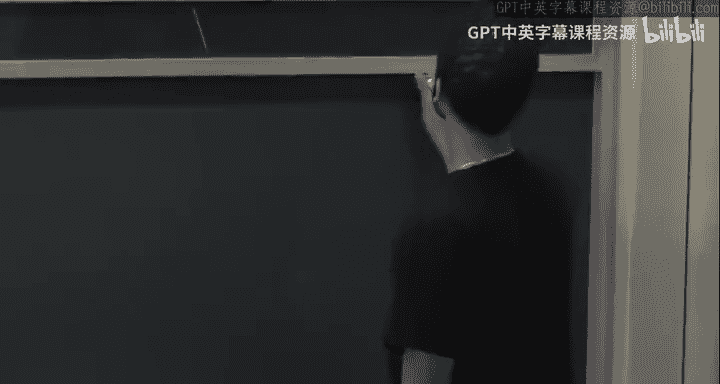

# 哈佛大学《高级算法｜Harvard Advanced Algorithms (COMPSCI 224) 2016》中英字幕（deepseek） - P16：-16-Advanced Algorithms (COMPSCI 224), Lecture 17.zh_en - GPT中英字幕课程资源 - BV1cDJGziELP

嗯。Yeah。hello。I'm not sure exactly where people are。I guess I'll wait one more minute。

Is there some event today， you know。No， let me make sure。Okay， well。I guess I'll just get started。

 So today， I promised you， we're going to cover。Interior point。Okay， so。This is。

 oh are you todayscribe？ Okay， good。 let me。I problem， so okay。

 so I just started like five seconds ago。嗯。So today we're covering the interior point method。

And this this is a method for solving。Solving convex programs， but。You。

 we're just going to look at it。We're just going to look at it for linear programming。And。

I think I mentioned last time at the end of last lecture。And this is introduced。As a method。

For solving LPs。By Carmarar。This is combatora 84 so Comatorica。Okay。And。

I said some very vague things last time， so our setup。Let me just remind you of the vague outline。

 our setup is we want to minimize。C transpose X。Subject to AX is at least B。Okay。

Where this is coordinate wise。嗯。As。Let's say it's an M by in matrix。And B。So and B is well。

 B has to now be in R。MAnd X is an Rn。Okay。So the basic idea of an interiori point method。

And I'm going to keep abbreviating the interior point method is IPM。Okay。The basic idea。Is。Minimize。

F of lambda of x， which I'll define to be lambda times C transpose x。Plus。Some barrier function。

Let's call it P of。I'll say what this is in a second P of S of x。Where。Sm X I。Is the slack？

AI dot x minus B。Right， so for any feasible solution X， we have that the eye throw of a。

 let's call it AI。 AI dot X is at least B。Okay， so AI dot x minus B is some non negative real。

For any feasible X。And the vector of all of these differences is called the slackla vector。Okay。

 I'm calling it the Slack vector。And。Where so S is defined as follows as this。P of。

 P of S of x goes to infinity。If any。S of X I。Goes to 0。ok。

So the point is that if any of the S of x size's are0。

 that means you're right upon the boundary of the feasible region。Right。And。

By penalizing the objective function in terms of this barrier。

 this P is called a barrier function because it keeps you away from。

It's a barrier preventing you from getting too close to the boundary， basically。Right。

 by penalizing with this barrier function， you're ensuring that the optimal X for this is not too close to the boundary。

 So it stays well in the interior of the feasible region。

 And that's why it's called an interior point method。 You have you basically keep track of。

Points interior in the feasible region，And the point is， as。Lambda goes to zero。嗯。Basically。

 C doesn't matter。And。The optimizer。Let me call it。X lambda。

So this is the optimal solution for this F of lambmbda， the minimizer。

This goes to what's called the Ananalytic center。Of the feasible region， the feasible region。

 let's call it P， which is the set of all points x such that ax is at least P。Meanwhile。

As x goes to infinity， or lambda goes to infinity。X of lambda goes to。嗯。X star where。

X star is the minimizer。Okay， and I'm not going to spend too much time on this， but。

You can assume that if this thing is feasible and bounded。That the minimizer is a unique vertex。

 There's only one vertex， which achieves the minimum。The basic idea to ensure that is。

 so we discussed earlier that there's some precision thats but that this LP obeys like all the entries have Ls of precision or some such thing。

 right， What you can do is you can create a new cost vector where you just add kind of random noise。

At the 10L bit of precision and beyond。Okay， so that random noise will ensure that there's a unique vertex that's optimal once you randomly pertuurrb this cost vector。

So I don't want to get into precision issues， but there are standard tricks that ensure that the vertex。

 which achieves the minimum is unique。Okay。I'll put a link in the notes to some of these because there are too many such minor tricks that I don't want to get to。

Okay。Okay， good。To actually implement this basic idea。 Well， I mean， who says that。

Who says that we can solve this problem either， right？So what are we going to do？So。

The vague outline。Of the algorithm。We'll look as follows。Step 1。Let me call this。This is our LP。

Modify。LP to LP prime。Such that。LP prime。Trivially has some trivial。Interior point。嗯。2。Okay。So that。

If the LP is bounded and feasible。Then， we can。Read off， basically。The optimal solution。To LP。

From the optimal solution to LP prime。好啊。Okay， so now we have this LP prime that we're trying to minimize instead。

What do we do there？So we start。So let's say。Let's say。X prime。Is initial。Interior point。

For LP prime。Everything I'm writing， by the way here is the vague outline。

I will start being a little more specific right after I write this。Okay。

 so let's say we have some initial interior point for Al Prime。

 I didn't tell you how we do this modification， but。I'll tell you later how we do this。

 but let's say that there is some LP prime that it suffice us to minimize that instead。

To optimize that instead。Okay， so then we'll。Step 4 from x prime。Obtain。嗯。X tilde lambda0。Which。

Approximately。Minimizes。F of lambda 0。对。And then the main work then happens here。

 So this is all initialization。 steps 1 through four， all initialization。Now， finally， step five。

While。K is smaller than some threshold， which we'll see in the analysis。Use Xtelda。Of Lambda K。As。

An approximate。Solution。To F lambda k plus1。So Lada k plus1。Is going to be something。

Slightly bigger than lambda K。And then iteratively。Re fine。To get。And even better。Solution。

For F lambda K plus1。Using some iterative algorithm like Newton's method。

I'll tell you more about that throughout the lecture。And then increment K。And continue the loop。Okay。

 so somehow。Somehow from an interior point。We're gonna get an approximate minimizer for lambda 0 being something very small。

 right， when Lada 0 is something very small。We basically don't care about the cost function at all。

 We just want to find something that's well well inside of the feasible region。Okay。

And then from lambda 0， we're going to just very slightly， you're going to see by how much。

 but very slightly increment lambda 0 to get lambda 1。And we're going to use this thing。

 this approximate minimizer of Lada 0 as a starting point。

For an approximate minimizer of F of lambda 1， F sub lambda 1。 So the point is。

 if we didn't increment lambda by much， if lambda 1 is very， very close to lambda 0。

 but slightly bigger， then， you know， by some continuity argument。

TheAn approximate minimizer for F lamb to 0 will still be。An approximate minimizer for F Lada 1。

 not as good an approximate solution， but still some level of approximation。

And then we can apply some iterative algorithm to gradually refine it and make it a better approximate solution to F Lada 1。

And then that will give us X till de lambda 1。And then we go back to the loop。

 and we use that as an approximate minimizer for F sub lambda 2。 and then we keep iterating。

Until finally。Lambda K is big enough。 And once Lambda K is big enough。Then。

This becomes the dominant term in the sum， not the barrier function。

And then you can show that one lambda is big enough。

An optimizer for this function basically is an can be easily rounded to an。

 an optimal solution for the original LP。 is there a question。

So everything I've said has been the vague outline。 I have to somehow make this more precise。

But are there questions about El least's strategy？Okay， so。

So this is the order the algorithm does things in。But this is not the order I'm gonna explain things in。

 Okay， so I'm gonna assume。That。We already have completed step4。Okay。

 we already have something that approximately minimizes FOM to0。

And then I want to talk about how to do this step five。And also， when do we finish。

And then once I explain that， I'll go back and talk about how to actually implement steps one through four。

Very。Okay so。We'll come back。So steps one through four。Later。So let's go to step five。

So we'll see this when we actually do steps1 through four， but lambda0。Will be something。That's。

 know， exponentially small。In the precision。So just a reminder， I think I mentioned this last time。

 But L is something like the max。Of log of。Be infinity。呃。And log of。

The maximum determinant of a sub matrix。As well as log。Of infinity。What is this term。

 So you remember from。When we were looking at the simplex algorithm。

verertices are specified by solving linear systems on sub matrices of A。Okay。

So how much precision do you need？To。So you basically have to invert some， some matrix。

 And then that gives you your answer， right， Invert a matrix and multiply it by the right hand side to get a vertex。

And the number of bits of precision。嗯。Involved in inverting that matrix is proportional to the logarithm of。

The determinants of that matrix。 So debt max is the maximum of all sub matrices of the logarithm of the determinant of the sub matrix in magnitude。

So this is just think of this， just think of this as precision。没人。So somehow in steps1 through four。

 we're going to end up with an approximate solution。

Approximate minimizer of f sub lambda 0 where lambda 0 is really tiny。And。Now we ask ourselves。

For what？Lambda K can we stop。Well。Okay。So for this。Basically， we can stop。When。

Let's say C transpose of x star of x lambda， sorry。Minus C transpose。Of X star。

So C transverse x star is the true minimum。C transpo of x lambda is。What is。

 if we used X Lada as a solution to the actual LP as opposed to this modified。

Paint penalized function。Then what would our cost be once this is less than。

 let's say epsilon and epsilon is also going to be something that's exponentially small in the precision。

OkaySo I'll put details in the notes for this。 I don't want to really get into precision issues。

 But the point is once， once the difference in cost is really， really tiny like like this。

 then you can easily round this thing to the closest vertex and get the actual vertex set that it achieves minimizing the minimum for the LP。

 Okay so if you're not comfortable with that， then let's just say that you're not actually going solve the LP。

 you're gonna。You're going to minimize it up to some very， very small error，Okay。

 so we can stop when this is the case。 Well， I want to understand when is that going to happen。

 How big does lambda have to be。So。One observation。Is that this function， this is now calculus。

 So F lambda。For lambda variance to0 is strictly convex。As a function of the x's from R into R。Okay。

So， there is a。Unique minimizer。X of lambda and。The gradient。F sub lambda of x lambda will be 0。Okay。

 so the minimizer of this function F of lambda is the x， which makes the gradient 0。Right， okay。

 so if， if people are forgetting their multivariate calculus。

 hopefully people at least remember an univevariate calculus， you know。

 you want to set the derivative to 0。 Okay， so just just think， think like that， okay。Okay， good。

We know that zero。I oh， and let me write actually what the gradient is。The gradient。

 if you calculate the gradient of athy lambda。Oh， and I didn't tell you。

 I didn't actually tell you this what barrier function we're going to use， right， Did I。

 I did not tell you。So the barrier function we're going to use。Let me just write this here。

We're going to use minus the sum i goes from 1 to M。Of log。Of S of X。嗯。I mean。

 the reason we're using this is because it has certain nice properties that will make our analysis work。

But it does， It does at least fit what I said， right， So if any of the slacks go to 0。

 then log of 0 is like minus infinity。 and there's a minus sign out there， which makes it infinity。

 so this function does go to infinity as you approach as the slack， as any slack goes to 0。

 which means you're approaching the boundary。反正。Very good。

 so now that we have an explicit function written there。We can compute。The gradient explicitly。

And the gradient is equal to。Lambda C。Minus a transpose。S of x lambda S of let's say then。

At the point X。Is SX inverse？Yi。Where。E is just the all ones vector。

 Actually let me just use all ones。So the all1s vector is， well， it's the all1s vector。And。S of x。

 this is the slackck matrix at x。Which is， this has the slacks on the diagonals， S of x 1。S of X M。

 so diagonal matrix。so the inverse is just。One over the slacks on the diagonal。Right。

And notice that if x is not up on the boundary。 if it's in the interior， none of these slacks are 0。

Okay。So。We can actually it actually has an adverse。Okay， good。So。What do we have here。

 so we have that。Well。0。Is equal to。Definitely zero， dotted with。X lambda minus x star。

And then now I will replace this zero with the gradient T x of lambda。Okay。

Because the gradient in x of lambda is 0， and this is equal to。The gradient。At F sub lambda。

 X lambda。Dotted with x lambda minus x star。Okay。And then now let me just write explicitly what that gradient is。

 We said that that gradient。Is。Lambda C。Minus a transpose Sx inverse， the all1s vector。

X Lada minus x star。

Okay， just remember that all of this is equal to zero。Which implies。That Lada C transpose。

X of lambda minus x star。Is equal to。And then so I just want to say that。So you have two terms here。

 you have Lambda C transpoposedse times this thing。

 and then you also have this vector dotted with this thing。So this thing is equal to。

The all1s vector。Transfos。Sx inverse。A。X lambda minus x star。Okay。So tell me though， what is。

A of x lambda minus a of x star。In terms of slacks anyway。Right。A of x lambda minus B。

 That's the definition of the slack vector for x of lambda。A times x star minus B。

 that's the definition of the slack vector for x star。And then we're just taking So when you。

 when you take the difference between them， the bees cancel。So this is just equal to。One transpose。

Sx inverse。And then now。Let's use little S for the actual vector of slacks。Little S of X lambda。

Minus a little less of x star。Okay。But in this thing。This dot product， right。

 we're taking the all ones vector。Dotted with this vector。😡。

So this is some diagonal matrix where each diagonal entry is one over the slack in some coordinate。

So this thing is equal to the sum。I going from 1 to M。OfS of x。This is all S of x lambda。

This is the gradient at X lambda， so this is the slack of vector at X lambda。So this is the sum。

Of S of x， lambmbda。Sub i minus s of x star， sub i over the slack of x of x lambda。So I。呃。Yeah。

 are people with me？Okay， and then now we'll use， I guess， the only inequality here， which is。

What's the only thing basically you can tell me about SFX star？

What's the only thing you can tell me about any slacklack vector。It's not negative。

 So this is certainly at most the sum over I of S of x lambda I。Over S of x lambda I。Which is just n。

Yeah。So overall， you know， this is exactly what we wanted。

 We wanted to understand C transpose of x of lambda minus c transpose of x star。 So this implies。

This implies that C transpose。X lambda minus c transposeive x star is at most。M over lambda。Okay。

Good。か。嗯。So what is this telling us？This tells us that。Once。Lambda is at least， say， M over epsilon。

And remember， Epsilon。I mentioned if you want to actually round to a vertex。

Epsilon can be as small as exponential in the precision。 exponentially small the precision。

 So this is roughly。Of Cel。Times。嗯。嗯。So that tells us how big Lambda needs to be in our step  five。

Before we， before we can terminate and have a really good solution。

That doesn't tell us how many iterations this takes because I didn't really tell you how much will increment Lambda by in each step。

Okay。But we will get there。So we will show。We will show。That you can take。

Lambda K plus1 to be something like。1 plus1 over root M。Of Lambda K。Okay， I haven't shown this yet。

 but we'll show that。Right， what， what's the constraint in choosing Lada K plus1。

 The constraint in choosing Lada K plus1 is we want to make sure that the approximate solution we have for Lada K still。

Is somewhat good for。The next function for F of lambda K plus 1。

So when we actually work out that calculation， we're going to see that if you don't increment lambda K plus1 by too much。

 if you just do it by this small， multiplicative factor。

Then your old solution here will still be a good solution will be。Roughly a good solution here。 Okay。

 I'm going to show that。So just given these two things。How many iterations in this loop？

Do we need to actually terminate？So did I tell you what the original lambda zero was， I think I did。

Yeah， oh good。 Yeah。 So the original a to 0 is that。So the question is。

How many powers of 1 plus1 over root M do we need to go from that kind of lambda 0 to this kind of lambda 0 M times exponential in C？

Log， yeah， so good。 So， yeah， so I want， I want to。I give me an answer in terms of log basedase 2。

 let's say， So so， one good you know， heuristic calculation， keep in mind。Is in general。

 if you have one plus。呃。1 plus 1 over x to the x。That's roughly E。Right。So if I do this step。

 root M times。😡，It means I've increased Lada by a constant factor。

Every rootM times that I go through this loop， I've increased Lada by a constant factor。

And then now I need to go from that value to this value。So that's log base E， let's say。

 or log basease a constant of the ratio。Right so。This implies。To get。

From lambda 0 to big enough lambda。Suffices。To go for。Well， root M。

RM steps just to get a constant factor increase in lambda times log of the ratio。

Which is going to be something like。L plus log n。Ittererations。Okay。So that's the kind of bound。

We're going to be getting。 in fact， I think if you go from paper to paper。

 people define L slightly differently。 So， for example， some papers。L is the max of many logs。

 They also put log n and log M in there， for example， in some papers。

 in which case L plus log M is basically L n so you'll often just see the number of iterations written as rootM times L。

And just a little bit of history before I continue。The original。Original。IM。For LP。Due to Carmar car。

Needed。Something like， oh of ML。Iterations。Okay。And this was improved。To O of。Root ML。Iterations。

By Renegar。嗯。This was in 1988。Okay， and recently。Improved。To。O of OTda。

 so OTilda is hiding like log factors。Oilda of square root rank of A。Times L。

And this was due to Lee in Sidford。Of this was this year， Fox of。This was well。

 this was not just this year。 This was like a week ago or two weeks ago or something。 I think yeah。

 a week ago。 this was a week ago， okay。And I think at some point I sent an email to this class saying。

 if you want to see something related to the class， go to this talk。So I'm not gonna show you this。

 I'm gonna show you basically this， but I'm gonna show you this using。I guess mostly notation。

 I mean the notation I'm going to use is this is like heavily borrowed from this paper， in fact。

Even the way I'm presenting it came from me。Getting Aaron Sidford and just forcing him to explain everything to me。

So。嗯。So thank you， Erin。Okay。Good， so I want to show you this and I guess you saw roughly how。

Where are the boundaries coming from， even though I didn't justify。嗯。And justify why you can do this。

 for example， yeah。Oh， good。 Yeah。 So you're saying that's the number of iterations。

 But what do we do inside of an iteration， right， So we're going to see that。

 But we're not actually going to compute， right， We're not actually going to compute minimizers of F lambda。

 Wheres F lambda。 Well era it。 We're not actually going to compute minimizer F lambda。

 We're going compute approximate minimizers。嗯。And the way I'm going to define a approximate minimizer。

 I I'm not even。 I mean， it's not going be。It shouldn't be obvious at this point how I will even define that。

 but I will give a definition of it， and I'll show that we can do that。

So we don't have x of lambda 0。 We have x totalde lamb lambda 0， and that's going to stay that way。

And in each iteration， basically what we're gonna have to do is we're going to have to。Compute。

A constant number of。Solutions to various linear systems。好。So that's。That's what's involved。

So linear systems on N by N matrices。Yeah， good question。 Any other， any other questions。Yeah。

 that is also something that differs。呃。From IPM to IPM， so。Right， the， so even this。

This vague idea here， so let me say another few words。Big idea。Outlineed。Above。Is called。

Kind of path following。Path falling into your point。It's called a path following theory point method。

 And where that name comes from is。We define a curve。Lambda。X of lambda。

For all lambda bigger than equals to 0。 So as we increment lambda from 0 to infinity。

 this traces out a curve。When lambda is equal to0， we're at what's called the analytic center of the feasible region。

 right when lambda is0， the cost function doesn't matter at all。

 We're just trying to stay as well inside the boundary as possible。And then as Lada goes to infinity。

 we arrive at some optimal vertex。And that curve。This curve is called。The central path。Tmeous K。

And what path following interior point methods try to do？

Is they try to start somewhere at the beginning of this curve。

 and then they try and follow the curve。Okay。But let me， let me draw some kind of。Picture。

 I'm not great at pictures， but let's say this is the feasible region。

And let's say we're trying to just minimize， let's say gravity。

 let's say that the cost function points upward and we're trying to minimize it。

 So this is the optimal vertex。So the analyticstic center is somewhere。

I don't know exactly where it is in this picture， but let's say it's here。

And there's some curve that goes from there。To the optimal vertex。Okay。And。So， this。This。

Is the central path？And what path following interiori point tries to do is it starts。

is let's say this corresponds to Lada 0， then lambda 1， then lambda 2， et ceter。

And all along the way， we never are actually exactly on this central path。

 but we always try to stay near it。Okay， so we have some。We have some。X tilde lambda 0。

 which is sort of near the true minimizer of F lambda 0。And then we refine it to get even closer。

 well let's say we refine it to get even closer。And then now we use that as the approximate solution for this thing。

 and then we iterate and try to get closer， and we just keep kind of staying near the central path。

We never quite get on it but。That's roughly what the algorithm does。And this。This is us。

So this is kind of a cartoon picture but'。Okay。So not all interior point methods are。

Described in this path following way， but at least the way I'm going to show you in class。

I will show you a path following version。Questions。So。🤧は。So。Diggression。Into optimization。

So before I can tell you。How we actually carry out the vague plan。I need to tell you。Right。

I I erad up five， I need to tell you， once we have a solution that's roughly good at minimizing something。

 how do we improve the error via some iterative approach？Okay。

 so that gets into the territory of optimization。 And I just wantan to。

Tell you a couple things that you'll need to know to be able to understand。

How we're actually going to do this， and this is going to come to your question of what do we do inside every iteration。

So。🤧。Yeah。So we're going to look at iterative procedures。For minimizing。Wellly for computing。X star。

Which is the Arg min。Over x and Rn。Of F of x。Where。F of x。F maps R into R。Okay。So。First。

 I want to tell you， before I tell you what Inter point well actually use。

 I want to tell you something that's。嗯。Kind of a precursor to that。So first order methods。We assume。

We assume that， first of all， one。There is some oracle。That， given。An x and Rn。

It tells us the Oracle tells us F of x。And the gradient of f at x。Okay。2。We have some control。

We have some bound given to us。On how。The hessian of F can behave。Okay， so let me remind you。

Remember。ThatVhesian。At any point， x。Is a matrix？Okay。It's an n by N matrix。Where。

The IJth entry dell squared of Fx。IJ is equal to。D squared。Dell X， dell Xj。嗯。Okay。嗯。

And what I mean by how it can behave。Is we're told。So this is back to two， in particular。

There exists， let's say， zero less than mu less than。L。Such that。Mux times the identity。

And I'll say what this means in a second。Actually let me is。At most。

 I'll say what this funny sququiiggle less than equal2 means in a second is at most。

The great Hessian。Is at most L times the identity？For all。Next in RN。And。

When I say that A is at most B。I mean。That。B minus a。Is positive semi definite。

And if you're not comfortable with what I mean there。That's the same thing as saying。For all X。

X transpose B minus a。X is L0。So really， what this thing is saying is that if you look at this matrix。

 right， So for any x， this is a matrix。 If you look at this matrix。

 its largest eigenvalue and magnitude。Is that most L？

And its smallest eigenvalue or the one that's closest to zero。Is still at least mu。

 None of the eigenvalues are too small。So this this matrix is somehow well conditioned。

It doesn't have any really big or really small eigenvalues in magnitude。Questions。This thing here。

The squiggly less than thing is usually called。The loner。Orordering。On matrices。Yeah。Oh。So， yeah。

 so okay， good。So I don't。 Okay， I'm not gonna get it。 So for this class， you don't need to know it。

 I'm not going to assume， you know it， I'll just just take it by faith。

 But the way you do it is by something called the real quotient。Okay， so the largest。

The largest eigenvalue is。😡，The soup overall x or the max overall x of x transpose Ax。Okay。嗯。So。

Right， if you。嗯。Right。I don't know， does that answer？So x transpose liX。

Is just L times the square norm of x。So sorry。 When I said it's the max of raw x of x transpose A X。

 That's where x has unit norm。 otherwise you have to normalize by the square number of x。

 You have to normalize by x transpose x。So if x is unit norm。

 the max of x transpose L X is just L times the squared norm of x。Which is just L if x is unit norm。

Whereas here it's。It's at most x transpose times the largest eigenvalue。

It's that most the largest eigenvalue times like transpose x。Which is。The largest second value。

 is is that most larger second value。So。That says the largest I can realize in Moscowstel。

Yeah maybe I'll put some pointers in the notes to more on more linear algebra stuff。

A there any other？I don't know， did I answer your question sort of or okay？呃。Yeah。

 but at least for what I'm gonna say from now on。You won't need to understand the proof of that to appreciate what I'll say I hope。

That interrupt me if that's not the case。Any other questions？Okay。So。So what do iterative methods do？

For minimizing。F of x。what do they do so？Start。With some。X not in Rn。Itteratively。Compute。嗯。Xk plus1。

From Xk。VSM。Update rule。And then stop after some number of iterations。

So the thing that we'd like to understand。Is。How well does iterating help us？Okay。So。We would。

Like to。Find an update rule。Such that。Let's say。If you look at F of。

X minus f of xk plus 1 minus f of x star。This is at most。Let's say alpha。Times。F of x。

0 minus f of x star。Where alpha is small。Oh， this should have been Xk。So yeah， so the point is。

 as you said， just by induction。This means that if you go from， say。

 x0 and iterate k times and get xk， then you've gone from you've multiplied your error by alpha to a K。

 and if alpha is less than1， it means you're kind of exponentially being your error。Okay。

So that's kind of the goal of。Of kind of first order methods。

 And you should do this in the update rule， your update rule is only allowed to depend on F of x and lambda and gradient of F。

Because that's all your Oracle gives you。And in your analysis。

 you're allowed to use the fact that you have control of the hessian。But the。

 the oracle doesn't let you compute the hessian。 Okay， if you could compute the hessian。

 that would be called the second order method。 So k order， I think。

 means you have information about kind of ca order partial removes。S Saian。Oh no。

 so actually the thing that interior point will use。It will use a second order method。

And we won't assume control on the third order partial derivatives。

 we'll assume some other kind of control， which I'll state when we get there。Just you。It just right。

 So I actually， I'm gonna， I'm gonna look。 I'm gonna gonna tell you about Newton's methods soon。But。

It's not going to be a pure first order of the method in the sense that we will actually need access to the Hessian。

Like the update rule will depend on the Hessian。Yeah。But there is a first order rule。

 which just needs information about the gradient， and it's called gradient descent，I'll tell you。

 I'll tell you about that。So。For one such update rule。Which is a first order method。

Is gradient descent。Okay， so let me just tell you what that is。

So who here has heard of gradient descent， Se curiosityity。Okay。

 who here has seen it actually analyzed rigorously with proofs of。Convergence and things like that。

Okay， well， definitely not as many。 Okay， good。 So you'll see some analysis now in particular。

When you have that kind of control， you can give some kind of band。So gradient descent。🤧う。Okay。

Before I tell you what the update rule actually is， suppose。We have some。

X0 and x1 that are two points in Rn。And define。X， T。To be equal to。X0 plus t。This should probably be。

X0 plus T。Times x1 minus x0。So。In particular， x0 is x0 and x1 is x1。So。I'm not going to prove this。

 this follows from Taylor's theorem。With an explicit remainder。Okay， if you want to see a proof？

It should be in pretty much any calculus book。F of x 1。

So the first two terms in the Taylor expansion are F of x0 plus the gradient at F of x 0。

Dotted with x1 minus x0。Okay， so those are the two first terms。

 the first two terms in the Taylor expansion of F of x1。And then there's an error term。

And you can write this error term explicitly， in some funny form。

And you write Taylor's theorem with remainder， this error term looks like the integral from 0 to 1。

 the integral from 0 and t。Of。X1 minus x0。Times the Hessian。At。Some x alpha。X y minus x0。D L 30 T。O。

So just to recap。呃。Just take it by faith at this thing here。

 or look at the notes later once I'll insert something for linear algebra。This。

Second inequality here。This loader ordering inequality means that the largest singular value。

Of this matrix is at most L。Okay。What does that tell you about？😡，Any one of these dot products。

 So this is a dot product between x1 minus x0 and the hessian times x1 minus x0。Yeah， exactly。

 So this thing。Is that most L times x1 minus x0？El to norm squared。Okay， good。

So what we have is that f of x1。Is that most？F of x0。Plus。The gradient at f of x0。Dotted with。

X1 minus x0。Plus L over two， because now we need to integrate。

We need to integrate this expression from alpha going from 0 to t and from T going from0 to1。

This doesn't depend on alpha at all。😡，So when you integrate alpha from 0 to T， you just get T。

And we integrate T。You get t squared over 2。That's going from0 to 1， that's one2。So this is L over 2。

Times。X 1 minus x 0。Hel20 squared。Okay。So。Given so now let me tell you what gradient descent does。

 what's the update rule？Given。Some iterate。let me call this。This inequ inequality star。

Given some iterate x0。Graadian descent。Updates。To x1。Which minimizes。The upper bound。

 it minimizes the right hand side。Of the star。Okay。And。

You can show just using calculus that this minimizer is x1 is equal to x0 minus。1 over 2 L。

Times the gradient of f of x0。I't see I expert。Okay。Questions。Yeah， X is a vector。2。

That is a very good。Point。That is not what I mean。And the upper bound that you'll get。

And this will imply that if you just plug this into the right hand side there。

That will imply that F of x1。Is that most F of x0？Minus 1 over 2 L。Times。The gradient of F at x 0。

I'll see it work。Okay， so we have some。Kind of explicit bound on progress。 right？ So remember。

 we're trying to minimize F。So before we were getting a value of x0。

 now we're getting a x0 minus something。Right。And。This is why you need to say that the Hessian never gets too small。

Because for all you know。嗯。Well。I mean， basically the problem is you don't want this thing to be equal to zero or something very tiny。

Okay。So we need to actually， you， what we actually want to say is where did I put that alpha business？

Did I just erase that？Hello。Right so。We wanted to say that。嗯。

If you look at F of x1 minus f of x star， this multiplicatively decreases from F of x0 minus f of x star。

So we're not there yet， we have to say something more to actually get that and here we're going to use the lower bound on the hessian。

🤧。Okay。So。On the one hand。We said that this thing is at most。Something。It's also at least something。

Right？Do you agree with me？Okay， so what changes if I wanted to put the inequality in the other direction？

Yeah， I'll change this to mu。So we also have that。In particular， let's say F of x star。

Is it at least？Well， you me any really。F of y。Forny， F of y。Is equal to。Or is that least？

F of x minus plus the gradient。Of F X。Y minus x。M。M over 2 times x minus y。Elsing norm squared。

This is true for all XY。So。Let's fix X。And let's take the minimum overall y。😡，对。

So what's the minimum of overall y of the left hand side？So that next star， have the next star。

Is at least the min overall why？Of。No the x plus。It's gradient。Why。Minus mu over two。

Times x minus y squared。And this thing， again， you can write down an explicit formula for when it's minimized。

Basically。🤧K。Think。Okay， well， I didn't。Have to reccalculate it。

 but you can show that this thing is when it's minimized， it equals。F of x。Minus 1 over2 mu。F of x。

 the gradient f of x。X squared。So this is just calculus to figure out which y minimizes this right hand side。

And actually， I want to fix。So I want to fix x to be， let's say xk or case iterate。Okay。

So now I want to combine these things。So。What do I know？I know that。F of x K plus1。

And let me actually write this。Let me actually bring。This thing over here。

 and let me just say that this implies that。The gradient。Is that least。To miu。

Times f of x k minus f of x star。So this looks sort of nice because we know that our。

Progress is measured in terms of subtracting off some multiple of the gradient。

 So we'd like to say that the gradient is big so that we made a lot of progress。

And this is telling us some lower bound on the gradient。So on the one hand， what do we know。

So summary。We know from up there that。F of x k plus1。Is that most， let's say， F of xk？

Minus 1 over 2L。Times。The squared norm of the gradient。

And we also know that the gradient is not too small。 This is the gradient X K。

 We also know the gradient X K is not too small。Okay。So this， so what we have here？This implies。

What do I want to look at， I want to look at F of x k plus1 minus F of x star。Right。

This implies that F of x。K plus 1。Minus f of x star。Is that most？Well。

tract I'm just subtracting F of x star from both sides。 I'm not doing anything fancy。

 Does that most F of X K minus F of x star。There's me subtracting from both sides。Minus1 over 2L。

Times this gradient squared。But now I have a bound on this。Right。Well， I haven't。

 I know that this thing is big。 So when I subtract it。

 I know that I have an upper bound on this right hand side。And when you just manipulate that。

 what you get is that this thing is at most。1 minus mu over L。Times。F of x k minus f of x star。

And so。This。I the thing I was saying was alphapha before。So in one step of gradient descent。

You have some promised reduction in your error。That depends on basically the singular values of the Hessian。

 as long as。As long as this ratio is small， you have some good bandwidth。

As long as this ratio is big， you have a good bound because you're taking one minus that。Okay， yeah。

W， sorry， can you say it again？Here， yeah， so this is right。 So this is basically my update rule。

 So xk plus1。Is Xk？Minus10 rex。Right。SoOkay， so what's your question？Im here。Oh， I mean so。

I just wanted to tell you where gradient descent comes from。😡。

So the place where gradient descent comes from is。嗯。Writing down。

Kind of writing down F of x1 in terms of F of x0 using Taylor's theorem。With an explicit remainder。

And then now upper bounding the right hand side， using the information you have about the Hessian。

So we said using information about the Hessian， this right hand side is at most that。

And then gradient descent just tries to minimize that。So really， really， I mean。

F of x for any x could be written in this way with Taylor's theorem。

 So the real thing we wanted to do is just minimize this whole right hand side。

 but this whole right hand side is complicated。 in particular， this integral part looks complicated。

So we just bound that thing。Using information about the Hessian。

 And then we just minimize the right hand side of this expression。

And that's what gradient Descent does。Oh， why didt I define that at all？Oh， I see。 You mean。

 the notations， the notations collide。 Is that what you mean。Yeah， okay。Yeah， I sorry。

 the notations do idea。Okay。So there's only a few minutes left。So okay， so that's。That's。

Gding descent。What's the punchline you should take away？

Suppose I have some initial iterate point x 0 that's that kicks off my gradient descent。

 And then I keep updating x 0 to get x 1， then x 2， etc cetera， right and。

I want to decrease my error by a certain multiplicative factor。 I want to go from error。呃。Delta。

To error epsilon times delta。Right。So you could ask。

 how many iterations do I need before I have that promise？So again， using that heuristic calculation。

 I told you where1， let's say1 minus1 minus1 over x to the x is roughly 1 over E。Okay。

How many iterations do I need to have my error？Sorry， just to have my arrow， let's say。Ever， right。

 yeah， but exactly as you said。To guarantee that I have I think as a verb is it hal with a V。

 to have my error？We need。O of L over mu。Ittererations。Because 1 minus mu over L to the L over mu。

Is that most one over E？Okay。嗯。This implies。And as you were saying， to reduce。Error。From， let's say。

Delta to Epsilon Delta。We need。Oh El。Times log of one of uppsilon。Iterations。

So you could ask yourself， I mean， so this is not going to be too relevant for what we're going to do with an interior point。

 but I just want to mention you could ask yourself， well in this model。

 in this model where I have an oracle for F and its gradient， and I have these bounds on the hessian。

 okay？What's the best bound I could get？😡，Is El ver Mu Law when Repson the best right。

 or like to have my error， do I really need El ver Mu。It turns out。This is not an optimal method。

There's another method。There's another method called accelerated gradient descent。Hows error。

In O of square root， L over Mu。Iterations。And this is due to Nesturov。And the exact reference。Is a。

Soviet math。And '83。So I'm not really going to cover。When I cover that。

 I just thought I'd make you aware of its existence。I mean， for us， actually， when we do this。

All our kind of control parameters will all be constants。

 so there's not really going to be a difference between bh and skirt root of bh。

But I just thought I would point out that。And later in the future， if you ever think， hey。

 how does gradientding descent work again for some other problem you're working on？

I want you to know that there is this that exists。 so you can go read about that， if you want to。

Okay， so we're basically out of time。So。Next lecture。Willal estate。Second order method。And bounds。

This is New Newton's method。I probably won't because we're， I don't want to spend too much time here。

 I probably won't actually go through the proof。Of what it achieves。

 but I'll just state it and you can read the proof in the notes。And then。

And then we'll finish off by showing。How to use。Newton's method。We'll show。

How to use Newton's method？To get。Kind of an X tilde。Lmbda。K plus1。From。X total the lambda K。

We're not going to be using gradient descent because we will actually need to。

Not just have bounds on the hesian， but actually explicitly compute the hessian in interior point。

Okay， but what you should have in your mind right now is kind of our Newton's method。

 which think of it as something like gradient to send to some iterative method。

 It's going to start off what what it's trying to do at every step is minimize F sub lambda K plus1。

Right。And what in the last what have we done previously， we've approximately minimized F of lambda K。

So since we've approximately minimized f of lambda K。We basically have this thing in our hands。

 X t the lambda K is an approximate minimizer。K。And this is going be our x 0 for Newton's method。

 It's going to be the initial， Well， it's gonna to be that X 0。

 The the initial point that we start off Newton's method with will be this。

And then we'll run the update rule many times until the error gets small enough。

That the new point we have with small error， that will be our x fold di lambda K plus1。Okay。

And then now we'll use that as the starting point in Newton's method to minimize or approximately minimize f of lambda K plus 2。

ok。So。Are there questions about where we're going to go in next lecture or about anything that I said in this lecture？

No。O。Well， I guess the Petss do tomorrow and。Also the project proposal。It was it last night。Really。

 oh great， okay， it was due last night，Right， something is due soon， right， project proposal。

Project proposalals do。Yeah， this Thursday at alone 59 PMm， I think。Yeah， I believe about 59 PM。Yeah。

Okay， well the pieceets's do whenever the website said it was due。I thought it was tomorrow night。

 but maybe I'm just。やたら終わり。The project， yeah， good that that I was more sure of。

 But the piece had to do whenever the website said it was due。 So yeah， okay。

