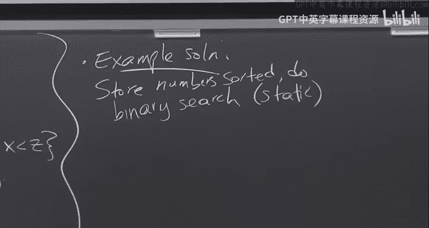

# 哈佛大学《高级算法｜Harvard Advanced Algorithms (COMPSCI 224) 2016》中英字幕（deepseek） - P1：-01-Advanced Algorithms (COMPSCI 224), Lecture 1.zh_en - GPT中英字幕课程资源 - BV1cDJGziELP

So this is CS224 Advance algorithms。My name is Glai Nelson。呃。And we have a Tf who's in the back。

 Jeffrey with his hand up。If you want to contact us？You should email CS224 F14 staff。At seas。harvard。

edu。Also， there's a yellow sheet of paper that's going around。Fill it out。

Let's see what else should I say， and there's a course website。

So I won't bother writing the UL of the course I' was sent on the board。

 just Google the course or Google my name， and it's on link from my website。

One thing I will say about the course website is。We have a mailing list。

So please go to the website and sign up， put yourself on the mailing list。

Before I get started with things， I guess I'll tell you some logistical things about the course。

And I'll tell you what the goals of the course are， and then I'll start on something， okay。

So logistics。Oh I completely did it backwards。So。There are three components of this course in terms of grading。

One is scbing。And this is 10% of your grade。Basically， you just do it and you get to 10%。

 so there's no textbook for this course。Students will take turns。

Taking notes on what I say in lecture and the course is recorded so you can go back over the lecture。

And see anything you missed and then basically write up some lecture notes。

In Lawte describing the lecture。And there's a template on the website， a Lote template to use。

Two is PSets。That's 60% of your grade。Okay， and the third one is a final project。

Which is the remaining 30%。And that's just written Okay。

 so there are details on the website about the final project。

 you do it the last day of reading period you submit your project。And。I read it， okay。

 so let's see final project so there's a proposal for your final project。Do。

 I think it's on the website， but I think it's October 30th。And then。Project。Do。

Last day of reading period。Okay。So yeah， I'll read through the proposals and make sure I like the idea of the project and give you feedback。

Regarding it， and then you spend the last six weeks working on the project。Let's see what else。PEets。

 all PSets should be lawteed。And you submit them by email， okay， and also PSs have page limits。

 meaning。Your pieceet should not be longer than the specified page limit。Okay。呃。

To avoid people just typing mindlessly if they don't know the answer to a problem， actually。

 brief solutions are appreciated。There's one part of the course。That。

So we'll see how many people actually stay in this class right now it looks like a lot。

 but you know it's shopping period。Depending on the final size of the class。

 or actually this will most likely happen。Students will also take turns being graders。

You probably only have to do it once during the semester。

 but a team of maybe three to four or some number of students together with the TF will meet once a week or once per Pet and do and grade that PSet okay so that's a required part of the class。

嗯。Students。Have to。Be graders。At least once。Okay， and these things are first come first serve。

AndYou have to describe at least once， possibly twice if the class gets very small。

 these things are first come first serve。If there's a date that you really want。

 you know you'll be available to scribe， for example， then sign up right away before it gets taken。

 also scribe notes are due the following day， so you have a little more than 24 hours toscribe your lecture notes they're due 9 pm on the following day。

And。Is there something I wanted to say about that？Yeah， I mean。

 I know it's a short amount of time to just do the best job you can then。

I might make a passover to myself and make some edits。Okay。Good。So。

I think that's all I want to say about logistics， any questions about that？Yeah。

I actually notes that some sort of gift repossitor。O。Like just putting here。I put them in， okay。

 maybe talk to me afterward because I't。Anything else？

Only a subset of students will be describingibing。嗯。

you know one person will be the scribe for that lecture， actually yeah I need a scribe for today。

 so who thinks that they're going to be in this class for sure and who's willing to describe today's lecture。

Okay。Good。Any other questions？Okay， so。呃。Okay， so this is advanced algorithms。

Who has taken CS124 or some form of algorithms course before this？Okay。A lot of most people， I guess。

So。I guess the main difference between CS124 and CS 224。 Well well， first of all。

 I guess algorithms is very broad。 so even though 124 was a whole semester of algorithms。

 we didn't see。All there is to know about algorithms even in terms of topics。So in 224。

 we'll see some models。For analyzing efficiency or some measures of efficiency or models of algorithms that we didn't see in 124。

Also， I guess it will be more。Theory focus， there won't be any programming assignments。

 although for the final project， you can do an implementation project that's described on the website。

 but the PSets will be purely just written PSEs， okay no programming。U。What else do I want to say？

So I guess the goals of this course。I guess they're what you would expect。呃。Increased ability。To。

Analyze。And create algorithms。We're going to see lots of different techniques in this class for analyzing algorithms。

Many of which were not in 124。And also modeling。You know， creating so。Looking at different models。

Or seeing inspiration from models， looking at different models。Within which。To analyze algorithms。

So in 124， we usually just looked at， say running time。And running time， we didn't， I guess。

 really ever define it， it was just the number of steps of the algorithm。

 and we also looked at memory， minimizing the amount of memory used by the algorithm。

 but here there will be other parameters that we'll look at as well。Okay。嗯。So。

I think I'm just going to get started。Now I use the drawing board first。So speaking of models。嗯。

So who here has seen sorting？Okay， good， that's what I expected。

Who here knows that you can't sort n numbers faster than N log N？Okay。嗯。So。

That's actually it's a lie to you。 you can sort I test and and log in Okay。

 so today and the next lecture。We're going to see something。

 we're not going to do the full sorting algorithm， but we're going to look at a related problem。

 a data structural problem， which is predecessor。We'll look at the。

Static predecessor problem iscs static。Predecessor problem。so this is a data structural problem。So。

The data structure。Represents。A set。S of items。X1 up to xn。Okay。And。We support。One kind of query。嗯。

Which is predecessor。Of X。Prodecessor of X。Is the max element？Which is less than x。

Or let me say predecessor of Z。Is the maximum X and S？呃。I right。Maxum。X and S such that。Is less than。

🤧。嗯。We want。Low space。And fast query。And this word so predecessor。

 you see why that's there static in data structure speak。

 static just means that the set S of items doesn't change。

If you had said a dynamic data structural problem like dynamic predecessor。

 you'd also support the insertion and deletion of items。We'll also look at。

So aesthetic versus dynamic。Static。No insertions。Dynamic。Consertion。Okay。So。

What's one way someone knows how to solve？Dynamic or static predecessor。Quickly。Using。

 say linear space。In a binary search Ill store the numbers and do binary search。Yeah。

 so an example solution that works。Store。Numbers sorted。And then do binary search。

Is this static or dynamic？Okay， so this is static and what's the queryery time？Log in okay。

 and what if you wanted login dynamic query time？

Yeah， so。Log in。So。Oh login dynamic。Query。Using a balanced BST。

 say like a red black tree or something。And the second solution also supports login for updates。

 for insertions and deletions。Okay。So if you use， I mean， this is not。Cn。呃。

This not usually the way people teach sorting algorithms at first。

I claim that if you have such a solution to dynamic predecessor。嗯。Then you can get。

And let's say all the numbers are distinct， okay？You can get can get a fast sorting algorithm， right。

 So what do you do to get a fast sorting algorithm using dynamic predecessor？You。

You first go through in linear time your input and find the maximum。

And then you go through the input again and just insert them all into a predecessor data structure。

and then now you output the Mac， you compute its predecessor。

 now you have the second biggest compute its predecessor， et ceter。

 and you'll retrieve all the items in sorted order。

 so you've just sorted the elements using a dynamic predecessor。Data structure。Okay。

And what I'm going to show you today and as well as Thursday is。A faster。

Dynamic predecessor faster than log N。So actually， I won't exactly show you that。Today。

 I'll show you。I'll show you。Two data structures。One of which is dynamic and the other I'll show you the static version。

 it can be made dynamic， but it's more complicated I'll just show you。

The basic ideas to get the static data structure。 But I promise I'll give you a reference that shows you it can be made dynamic and。

If you use those data structures， you can beat。You can be。And log in for sorting。Okay。

 but some people raised their hand when they said that they knew that sorting couldn't be done faster。

Then and log N okay， so for the people who said they know sorting can't be done faster than and log N。

What assumption are you making about sorting algorithm？it's comparison based sorting。

 which means you have n items。And in each step， your algorithm is allowed to choose two items and compare them。

 and based on the results of the comparison， it can make further comparisons。Okay。

But that's not how real computers work。So when you code in C。First of all。

 all the input numbers are integers， let's say， or floats， there's something that fit in some， say。

 32 or 64 bit word。And you can do bitwise XOR and bit shifting and all kinds of other operations。

 which are not just comparison and multiplication。So。That inspires the Word RAM model。So items。

Our integers。In。The range from 01 up to 2 to the W minus1。Okay。And W is the word size。

And the Uni size u is 2 to the w， this2 of w minus1 is 2 to the W minus1。Okay。And we also assume。

Also assume。That pointers。Itit in a word。Okay。So。So for the last assumption。

 if you have a data structure that's storing n items。Presumably。Presumably。

 your data structure is using at least end space to even remember what the items were。

RightSo we know that space。Is at least n？Okay。And if a pointer fits in a word。

 while a pointer is what an address into our space， So W。Should be at least log of the space。

Which we just said is at least log in。Okay， so we're always going to assume that our word size W is at least login。

And what I'm going to show you today and on Thursday are two different predecessor data structures。

That get different bounds。1 is going to be better when W is small。

 like closer to log n1 is going to be better when W is very large。So two data structures。So one。

Is the it's called。The van， well， that's the lowercase。Then and the Boa's trees。

This is from what year？Somewhere in sometime in the 70s。So。嗯。

I'll frequently put the conference or journal name in the year， so this were the scribes。

And this is due to Vanim de Boez。And if you Google it， you'll find a reference。

 so please put a reference in the subscribe notes。And what this gets。Is。Update。This is dynamic。

 so it supports updates， update and query。Are both going to be。Log W。Time。Okay。

And the second thing that I'm going to cover。And it's。

And we're going to show also that let me say something else。The unfortunate thing though。

 is going to be that the space。The space is going to be。You。

And you know I like linear space independent of the universe size。

 right imagine if you have a 64 bit machine， you is 2 to the 64。

 so I don't want to use 2 to the 64 space ever。嗯。And we'll see that。This。呃。Can be made。Theta n。

With randomization。And we'll also see a related data structure。Called。Why fast？Why fast trees？Tries。

Look at the same bounds。 and this is due to Willard。In IPL 83。So originally。

 Venom de Boez in his paper didn't get linear space。嗯。

But the move from use space to linear space is going to turn out to be pretty simple。

And the second data structure we're going to see。So this is the one that can be made dynamic。

 but I'm only going to present the static version in class， otherwise it gets too complicated。

These are fusion trees。And this is due to Fredman and Willard。I believe in JCSS 93。Okay。

And these support query。In time。Yeah。Log based W of N。对。And it's also linear space。

So already this beats binary search trees， if w is at least log n。LogRemember。

 log based W of N is the same thing as log n over log W。

So this is never going to be more than log in over log login。But of course。

 we could choose based if we know W， I mean we know the machine that we're coding on， if we know W。

We can choose the better of fusion trees and let's say van Duvo trees or whiteasst trees。

So that implies that we can achieve。The men。Of log W。And log。Base W of N。Right。And。

The myth of this is if we want to maximize this expression。

We'll do it when these two things are equal。Which means log W equals log n over log W。

Which means log n is the square of log W。So this will be always at most。Square root。Long end。Okay。

Okay， good。And I mentioned that this can be made dynamic。

 so in particular that means you can sort in time n times the square root of login。

Things that I won't cover in this class。This implies。With dynamic fusion trees。

O of and root log n sorting。Okay。Questions。So okay， so there's going to be an。Yeah。

 so there's an issue which I haven't discussed， which is the preprocessing time to actually create the data structure。

So in the dynamic case， when you start with an empty data structure， that doesn't come into play。

 but with the static case， we're going to spend polynomial time to actually create this fusion tree。

And that's going to be bad resorting。Any other questions？So you could ask， you。

 is N rootot log n the best sorting algorithm？In this model。And。You can actually get faster sorting。

So， you can get。Oh of and log log in。Deterministic。This is due to Han。In stock 2002。

You can also get O of N square root log log n。Expected time， randomized。This is due to Han。And Thor。

In Fox of the 2002。Which is about。Five months later。

And it's an open question whether or not you can get a linear time sorting algorithm in this model。

So it's possible。There's nothing saying that you can't do it。Okay， and。

Let me go back to the Word RAM model before I actually present the VanM de Boaz data structure。Okay。

 so。嗯。So I mentioned we can do more than just compare， so what can we do so in Word RAM？Assume。That。

Given。XY fitting in a word。We can do。Basically all the things that you can do in say C。

So you can do integer arithmetic， so plus minus， Im going divide times minus。

 and this is integer division so it rounds down。Okay。You can also do。嗯。Bit wise negation。Xor or。And。

呃。And。Can't write and。Properably。And you can also do bit shifting。

With some fixed constant or with each other。Okay， yeah。Yeah。So we'll assume that for multiplication。

 it fits in two words， so the upper bits will be in the second word。Okay。Any other questions？嗯。

But I think it's also。I think it's also accurate to say， I mean， we don't need to， I think。

 make that assumption。There could be integer overflow in which case we'll get the overflow of the correct answer but。

You can simulate multiplying bigger numbers using in the word RAM anyway。So。

Maybe I'll leave that as an exercise。You might need to use a couple of words yourself when you do the arithmetic。

Okay。So we can do these in constant time。So just out of curiosity， who's seen venom to go as trees？

So， when。Who's seeing fusion trees？Okay。Very good。Just making sure I'm not teaching you something you've seen。

Okay， so we're doing Vanom de Boes。Okay。So the basic idea。Is， well。

 I guess you guess that we're going to do something with。

Feddging with bits because we can't just do comparisons。

The basic idea is some kind of dividing conquer。Okay。So。嗯。So VEB tree。It will be defined recursively。

So。What a VB tree will look like？And it'll be parameterized by the universe size， so let's say。

This is on a university of size U。It will look like。

If I open up what it looks like inside of that data structure。It'll have。Square root U。

VEB data structures。Each on a universal of size square root you。And there will also be。

A top one on universe of size square U。And separately， we'll also store one extra。Element。

 which is the minimum of element。In the data structure， and I'm going to say more。就是。So， you know。

 let's say you're using some object oriented programming language and you wanted to declare the fields that your VEB。

Data structure has。So。The fields。A V EB。Let's say on a sizeu universe。You would have an array。

Of size root u a root U size array。Let's call this thing。V。V is our VEB data structure。

You'd have V dot cluster。Zero up until V dot cluster。Square u minus1。And this is。A V E B。

Square U data structure。What I mean is the elements in here are numbers between 0 and square u minus1。

We'll also store the Mac， maybe I'll say that too。Let's say we also store the Mac。

 so I'm going to write that down here。We also have a。V dot summary。Is a V， E B。

Square U instance as well。And。V dot min。V dot max。Our integers。And。The range from0 to u minus1。

Any questions？I haven't actually told you how you insert into the state。

 this will be a dynamic data structure， so I haven't told you how you query。

 and I haven't told you how you insert。So let's see that。So say we have an item that we want to。

Have living in this data structure。So X。It's some integer。So we can write。We can write x in binary。

And we can divide x into the upper the leftmost half of the bits and the rightmost half of the bits。

Let this C we call this I， so let's write x as C。And notice that。These numbers C and I。

Are in the range from 0 up to u minus1。Right。Okay。So we're basically writing X in base root U。

And the idea behind Vanom de Boaz' trees。Is that？We will store if X lives in the data structure。

Then we will store the number I。In this Cf cluster。Okay。In this picture。Okay。So。嗯。Now， tell me。

Given what I just said， how would you say do a query for the predecessor of X？

And hopefully people agree that you can extract。You can extract C and I each in constant time just by bitwise ending and shifting。

Okay。Okay， so how would you search for the predecessor of x in a dis recursive data structure as I've defined it？

Because I didn't tell you what the summary does。Let me tell you what the summary does too。

So I told you that I'll insert I into the。Cth cluster。Also。

If the Cth cluster happened to be empty when I did the insertion。

I'll also insert C itself into the summary。😡，So the summary keeps track of which clusters are not empty。

That's the point of the summary。Okay， so now how would you do a predecessor？Yeah。Yeah不 real。the。

Look at that plus。It's the lowest element。那年。Okay， yeah， so what you said works。

There's one recursive call you could save。Right， which is。We store them in explicitly。

So let me just say repeat what you said， but using that fact。Are you here for advanced algorithms？

Okay， so here' is the idea， right？I can extract CI each in constant time using shifts and masking with bitwise and。

And then what I do is I look into C of cluster。Okay。

And I look at the minimum element in the Cth cluster。😡，If I'm bigger than it。😡。

Then I know my predecessor lives in the same cluster as me。

 and I can just recursively do a predecessor in that cluster， a predecessor on I。And that cluster。

If there is no minimum element， if that cluster happened to be empty。

Or maybe I'm bigger than the min， bigger than equal to the min， then I know my predecessor。😡，Is not。

In my cluster。He's in the。He's in the largest cluster before me， that's not empty。

And how do I find that， I find that by doing a predecessor on C in the summary。

And then I return the max inside of that cluster，嗯。发几 it。I don't need to recurse on that cluster。

 I just returned the max。u。So let me write that down。So。呃。So predecessor。Tex is input V。

 as well as this X， which I write as CI。And I say the first if。Is。If， if x。I's bigger than V dot max。

So if x is bigger than everything in my data structure。I just returned V dot max。Okay。Otherwise。

I look at the CF of cluster of V。And I check its min and compare its men to me。Elsa V dot cluster C。

Dot min。Is less than x？Then I'll just recurse。Okay。Otherwise。Otherwise what。

 I have to look in the summary for the predecessor cluster。

So Cd prime will be my predecessor cluster。And then I return the maximum element in that cluster。

Okay。Okay， so the next thing。Is the insertion algorithm。Okay。So the first thing is。

We're going to see why in a moment， but I'm going to treat the minimum element as being special。

Its going so the minimum element will be stored in this minimum field where my fields。

The minimum limit will be stored in the minimum field。

But I won't also store it in its appropriate cluster。O。

So it could be that the V dot min is some non empty value。

And everything else in the data structure is empty。So if。V is empty。I'm going to say V dot。Min。

Gets assigned to。X。And then I'll return。Sorry for my pseudocode is like changing between C and Python。

But you know what I mean， I think。Okay。Otherwise， what do I do？Based on what I've told you。

And also with this constraint that the min only lives in V dot Minten。I I'll say one thing。

If the minimum lives up between V dot min， I'll do if。X is less than v dot min。Then I'll swap。

X with v dot min before I continue。So now I know that the X I'm actually inserting is not the minimum element。

 Think of this V dot min field as being like a buffer。

 So the minimum always lives in that buffer and it's not actually recursively stored。Okay。

So first I make sure that the thing I'm inserting recursively into the structure is not the minimum。

Okay。And then。Where do I have to put it？Okay， and let's pretend that when I do this swap。

 the C and I are for the new X， okay， so I don't want to write more code。嗯。So what I do is。Oh。

 and there's also this issue of。Before I recursively insert it into the cluster。

I should check the summary to see if that cluster was empty。

 if so I need to insert it into there as well。So how can I check？If the cluster is empty。

 I can just check its minimum element and check that it's empty。So。If x。If sorry， if V dot cluster。

C dot min。Is a null value？Then I need to insert C into the summary， then V dot summary， I'll insert。

And to Vdo summary。The value。C。And then I'll insert I into a cluster C。Okay。

And you can think about what you would do for deletion， it's not really that。Much different。

Conceptually。Okay， so let's just analyze the running time of。Of these procedures， so predecessor。嗯。

If。There's only ever， I guess。One recursive call。In any of the if cases。

 you'll have that most one recursive call。So。嗯。We have the recurrence， so for predecessor。Time。

We have the recurrence that T of。U， we start off with the universe of size U is。

Equal to t of u over two。Plus o of10 T of root use， sorry。And if you remember your occurrencecurnces。

 this implies that T of U。Is of log， log U。Okay， which。Is equal to。LawW。Remember you is。

Basically two to the W。U is due to the W。Okay， how about insertion？Yeah。呃。Oh yeah， so yeah。

That's right， so you can in constant time， you can follow a pointer and read the value in that memory address。

So how about insertion time？It looks a little worrisome， right。

 because this if doesn't necessarily return after the if。So if VDt cluster do min is empty。

 you insert it into the summary。And then you again do another。Insertion。

So it looks like it looks like。T of U。Is at most tune times T of root U？Plus， O of one。Right。And。

Do people know So another way of thinking about this is maybe this will make it more obvious is that T ofW is at most。

Two times T of w over2。Plusus so of one right so if we're saying that w is getting square rooted。

 that basically means this if we're saying you get square rooted。

 it's like saying w got cut in2 So what does this resolve to？It should。Yeah， W。Okay。Yeah。

 so this solves the W。So that's not great， we're trying to get logW here。

But I claim that this is overly pessimistic。Why。We did it。Yeah。The second。更是。

Yeah exactly right so what DRrg said is if this if actually happens。

 then the second if will be shallow and not recurse further。

 right because the second if will be in this case and will immediately return。So。Actually。

 this too really can be written as a one。You can think about this one as in that case you can think about。

Just moving this line here， and then this being another else， okay？嗯。And this implies。That T ofU。

Is also。Oh a wide on you。Okay。So that's the basic ven into de Boaz's tree data structure。

And that's also why we store the men kind of separately。Right。

To make the insertion cost log log U as opposed to W， which would be log U。

you actually if you treat them in as the same as any other object and start recursively in the data structure。

 then there will be times when you have to recursively insert into the summary and recursively insert into the cluster。

And that will cost you， that will make things w， yeah。Oh yeah， I keep forgetting about these maxes。

 yeah。You know， you don't have to。Yeah。But yes。That's a good point。

And where's that paper that where people are signing up， has it been passing around。

 everyone saw the paper， raiseise your hand if you didn't write your name down on that piece of paper。

So it's toward the front， I guess。🤧K。Okay， so how about the space？

What's the space of the venom as data structure？What's the recurrence anyway？S of u。Is equal to。

Square root of U plus1 for the summary， S of square root of U。Plus。A constant to store。

 say the midden。Okay。So this。I'm not going to solve it here。This implies that SU。Is theta of U。

So this is Uspace， which is not great。嗯。So we're going to get instead linear space。Okay。So what's？

What's something that。Intuitively seems a little bit silly about。This space requirement。

Youive a lot of empty clusters， right？Yeah， that's it。Okay，What could you imagine？Doing instead。

So we will see who here has seen hashing。Okay。So I gave you a hint what so you know that there's something called hashing。

嗯。What would you do with this hashing in order to improve the space？Yeah。So。Okay。

 so we're going to have a hash table， what is this hash table store？Sorry。

 like what are the keys in this- so in hash tables， there are keys and values。

So what are the keys that it will live in this hash table and what will the values be？

So we'll have a hash table。Keys will be。Yes， the keys will be these cluster IDs O keys。Keys are。

Cluster。Ids。C。And what will the value， so what will the value be？Yeah， a pointer to some。Value。

Is a pointer。2。Corresponding。No empty。Cluster。So for the empty clusters， they don't live here。Okay。

 and I claim that the space。OfNow this scheme is linear。It's theta n。Why is it theta n？

How would you account for all the space that's being used in a way that makes it clear its theta n？

Yeah。Yeah， each tree has a minimum element， right， so we can charge。嗯。This pointer and value。

 this is like two words， right？We can charge the cost of these two words of storing this cluster ID and pointer。

To the minimum element that's contained in that cluster。Okay。And now each minimum element。

 each element is stored as a minimum somewhere。😡，MaybeMaybe add a leaf cluster in this recursion。

 but its stored as a minimum somewhere。And each minimum element is charged exactly once。In this way。

It's charged in the parent VED tree that contains it。So。Charge。The cost。Of storing。Xi。

Pointer to cluster C。To the。Minimum。Element。OfC C。Each minimum。Is charged。So each item in this set。

 let's say he checks it。所呀。Is charged。Exactly once。Does that make sense， questions about？第二。

This assumes that。Yeah。I guess I haven't covered hashing yet。

 We will see hashing later in the course， but it turns out that it's possible to。 so first of all。

 let me say something about hashing。Maybe this if it doesn't answer your question once I say it。So。

You know， I think it's， it's good to think in terms of。Problems。

 and then there are algorithms or data structures that solve those problems。

 So let's forget about hashing。What's the problem that we want to solve。

 the problem we want to solve is what's called the dictionary problem。Short aside。

So we have something called the dictionary problem。Okay。And the goal of this problem is to store。呃。

He。Value。Pairs。I'm going to assume that the keys and the values each fit in a machine word。

And the semantics are as follows， so query。K。Okay。What should that do， it should return。Value。

Associated。With keyK。Or no。If K is not。Associated to anyone。And there's also insert。

 or you can think of as associate， so insert。A key with a value。Which associates。Value V。With keyK。

Okay。So you can look at both the static and dynamic versions of the dictionary problem。

So in the static version， you're told all the key value pairs up front and you never do future associations。

In the dynamic version， you can make updates to what keys are associated with。

 and you can also delete keys from the dictionary。And。It turns out。

I don't know if we'll see exactly this solution later in the course。

 but we'll see some solutions to the dictionary problem。嗯。Dynamic。Dictionary。Is possible。With。

Linear space。Okay。Constant。Query time， worst case query time。Worst case。Quary。As well as。Constant。

Expected。Insertion or updates。Insertion， and also deletion。Let me write， so this is from。

It's actually not that。It's fairly recent Jitzel Binger。I need to look back at the reference。

This is from。By diitzfel Bingger。And others。And yeah， I mean， it's some form of hash table。Okay。

If you know about universal hashing， that would get， it wouldn't get worst case constant query。

 or would get expected constant query。It turns out you can get worse case。So yeah。

 the point is that whether it's expected or worst or worst case。

 and actually you can even do better than expected constant time。

 you can do constant time with high probability。But the point is really what we need here is a dictionary。

 we need a dictionary that stores mapping， the keys are the cluster IDs and the values are these pointers to those non empty clusters。

And that's a solved problem， which we'll just take as a black box for now。

Did that answer your question？Any other questions？Yeah， I believe well。

I can even say you can even make this with high probability。So I guess the question is， can this。

I mean， the only thing you could hope to improve here is make it fully deterministic。

I don't know offhand whether。That's been ruled out as a possibility。

You so I have about a little more than 15 minutes left。

I mentioned that there's another data structure called a Whyfast Tree or WhyFst Tri。

Which also gets this bound。I'll sort of just sketch the idea。嗯。Which apparently is the。

Which apparently， I think is the original way。Vano Dubuz trees were made to support the bounds that I stated。

 and then much later other people came along and。Kind of。

Reinterpreted the data structural ideas and came up with what I showed you。But the why fast try。

 I mean， originally Venom du Boaz data structures were described in a way that got use space。

 and it wasn't as it wasn't as clear as change this to a hash table in the way that it was described to make it linear space。

 So I'll show you the。Another way that you can get the same bound。So。

What's one way that pretend you didn't care about query time and you were willing to use usespace？

What's a very， very simple data structure？For predecessor。I want you to use exactly U bits of space。

Yeah， a bit array。Okay so have a bit array of size U of length view。And the I bit is1。

 if I is in your set， otherwise the I bit is 0。So use a bit array。Another solution。

We can use a bid arrayray。Of length here。So let's say you is。16 or something。嗯。One， zero， one，1。0，0。

0，1。One10。0。1，1，0，0。Okay。So this corresponds to elements zero， one， two， three。Up to 15。

And so what's the running time of predecessor now？It's you。Okay。

 that's terrible So we're going to make one small tweak to to this。

 which is we're going to build a perfect。Binary tree。Over all of these leaves。And each internal node。

 each internal node is going to store the or。Of its two children。

And we end up with a tree that looks like this。Okay。Now。Suppose now someone gives me a0。U。

Suppose someone gives me a zero and asks for the predecessor。Okay。What， so let me also say this。

I'll do one more thing too。I'll store。All the ones。In a doubly linked list。Okay。

So suppose someone asked me for the predecessor of a one。What would I do？Yeah。

 go back one in the linked list， Conant time。Suppose someone asked me for a predecessor of a zero。

So for example， they asked me for the predecessor of this element。Okay。What would I do？Okay。

 and then what？Okay， so I go up， so I go up the tree until I find a one。And then I know that so here。

 I found when I transitioned into a1， I went up this way。Right， so then I know that。

I am bigger than everything on the left hand side， so I should just find the maximum element。😡。

In this subt， which I can do by going down to ones， for example。Okay。

 what if someone asked me for the predecessor of this element？I would go up。And here's the first one。

So now。You know， I don't go and find the minimum element here。 that's not my predecessor。

 but what is the minimum element here。It's my successor。The minimum volunteer is my successor。

And all the ones are stored in a wub linked list。So I can just go back one。

 and that will be my predecessor。ok。So I can just keep going up until I find a one。

And then either I will find the predecessor or the successor depending on whether I went up that way or went back that way。

And I can get the predecessor， okay？Now。So now there's still one problem though。

 which is the running time of this what's the height of this tree？Log of U。 So my running time。

 it seems like it would be log of U。Okay so。I'm trying to get log log you。😡。

So what does that suggest？Binary search。 Yeah， actually， I do want to do a binary search， but。

Can youSo justify why can I， where am I doing a binary search and why am I doing a binary search？

Okay。The lowest one， right？So the point exactly， so the point is on any。Leaf to root path。

The bits are monotone。Okay。Meaning that they're zero for a while。And then theyre one after that。

So I can binary search and find the first one。And that will give me log log view。

There's still a catch， though， which is， how do I binary search on following pointers， right。

 Like if I need to follow seven pointers。I need to actually I need to actually follow them。

 how can I just access the guy who's seven above me？right， you see what I mean？Any ideas on that？

Yeah。Yeah， so if it's stored the right way， so what's the right way？Yeah。

 so you could store this entire tree， so I don't know if people remember binary heaps。

You can store this entire tree as an array。This is index 0。 that's index 1， and that's index。

So in general， let me write this。Store tree。As an array。Okay。Root。Is that index zero？Noode。V has。

Left child。At 2 v plus one。And right child。At 2 v plus 2。

So if I want to find the ancestor who's K above me。What do I need to do？Divide by what？

By two of the K by integer division， right？ So that's a bit shift。

So I can find anyone who's capable of me in constantstantine。Okay。So there's that。So this。Implies。

Can。Find Kaith。Ancestor。In constant time。By doing。Bit shift to the right by K。That's a bit shift。

Another thing you could do。Which uses more space is to actually store the tree using pointers。But。

For each node。You don't just store its parent， but you store its two to the cath ancestor for every K。

So could also。For each node。Store。It's two to the KF。Ancestor。For each。K going from0 up to log。

 log U。Because the tree has height lo you。Now I'd make the space of the data structure u times log log U or u times log W。

🤧Okay， but there's still the dominant part of the space is you。Yeah。だれ。ぱ。What what do you mean？

My guarantee。自由で。Yeah。You mean the height of the tree is 16？Okay。Yeah。いがないだろ。Right。あ这说。i see。Is that？

Oh， I see。 you're saying I only need。But okay， so suppose the suppose， so suppose the 81 fails。

 So let's do a bigger power of2，1024。 Suppose 5，12 fails。 And now I have to go to 2，56。 That fails。

 and I have to go to 1，28。Won't I need all those， Oh， I could just use the ancestor of that node。

Okay， I have to think about it， maybe what you're saying is accurate。So he's saying。

So I'll elder the exact number。supposeupp the highest part of two divide your number is。

To to the end。Okay， your height of the trees to the L。s number okay？It a high start to the device。

Look at the。Okay。You start to the。Alva 2。Then。That follows you very a distance。Eva。

And the thing that precedeives you very dis。ないと。I see。Okay right。Maybe what you're saying。

 I have to think about what you're saying， but anyway I'm going to do better space right now because I'm still using use space。

 I'm still using more than U space， and I want to use linear space。嗯。So。So heres I mean。

 the main trick to getting linear space in the Venom goaz data structure was to use a hash table to store non empty clusters。

So I want to do something similar here。Okay， so any thoughts？Again， using hash tables。

So this one is a little trickier， so I'll just say it。It's a save space。Only store。The ones。

In a hash table。O。So at each level of the tree， there are most N1s。So this hash table contains。

N times W items in it， So I'm using n times W space。

Or you could imagine having W different hash tables， one for each level of the tree。

Which stores all the ones that occur in that level。 So for each level。Of tree。Hash table。Stores。

Locations of ones。Okay， so as I'm doing my binary search。If I want to know whether something is1 or0。

 I just look it up in the hash table and if it's a miss in the hash table。

 if it's not in my dictionary。Then。I know it's zero。This implies space。N times W。And this is called。

An X fast tree。So if you look at the paper by I mentioned that why Fast tries are due to Willard。

2083， it's like a four page paper， including the introim bibliography， and in the first page or two。

 he describes X fast tries。And then。And then he gives a wifeas tries in the very next section。

Whi eliminates that W。And the trick to eliminating that W。Is a trick that is good to know。

I I mentioned one goal this course was。Knowing the right techniques to apply to data structures and algorithms。

 so this is a technique that gets used a lot。So， from。X fast。To why fast。

Use what's called indirection。Okay， this is。So the basic idea is。I'll have my data structure。

I'll have my X fast try， and takes NW space。This is an X fast try。On。And over W items。

What do you know it uses end space？But what's each item？😡，So these are my N over W items。Each item。

If you open it up， it's actually like a super item。That contains roughly W items。

So approximately this contains like the first W items， the next W items， et ceter。

And one of them will be like the representative item that actually lives in the X fast try。ok。

And the way that I'll store these items。I I'll build a balanced binary search tree on them。Okay。Yes。

Theta L， let's say。So。🤧He。I mean， there's a problem besides the space。 You know， this， Okay。

 so I'm basically， there's one minute left。 Let me just say this。 I'll just sketch this。

 You've already seen a solution that gets this bound， so。

If you want to see the full details of the whyF try， you can。Read about it on your own。

 but I just want to give you a flavor of what's going on here。 So the space is NW。Okay。嗯。

But actually， the time is also W。Instead of log W， why is the time W？

The time is W because if you think about this tree。If I change。

 if I insert a guy and change him to one， I need to like or all the way up the tree。

 I need to change W things。 So the time is W and the spaces off by a factor of W。😡。

And this idea basically fixes both issues。 and the base So in terms of the space。

 this is now definitely using linear space。In terms of the query time。

 the query time is still log log U because I can search in an X fast try in log log U time。

 and then I reach the BST containing that super item and to search in that BST takes log W time。

 which is again， log log U。How about insertions？So the point is。嗯。These super items contain。

Somewhere。Between。Let's say W over2。And 2 W。Items。Okay。嗯。呃。So they're going to contain theta W items。

And the basic idea is going to be。When I do an insertion。

I'm not going to actually insert into the X fast try。

 I'm going to find where it goes and insert it into the balanced BST。

And only when this thing overflows， when it becomes size bigger than 2 W。

I'll split it into two super items。And then insert those into the above one。

 but approximately that only happens like every W steps。Okay， so in an amortized sense。

 it only cost me a constant to do that。 Well， it only costs me。Kind of。

 I only think do that once every W steps。 And then when I do it， it costs me log of log of W。

 So I know I didn't go into the full details on that。

 but that's I'm not going to get too deep into Y fast tries since they get the same exact bound as this。

 I think， simpler one。嗯。But that's the basic idea。Okay。So questions。

Clas is basically done Any final questions before next time we'll see fusion trees。And actually。

 I do want to say one thing， which is。So I told you the bounds for fusion trees and I told you the bounds for。

Vanom de Boas trees。 There's actually a paper that shows a matching lower bound。

 which shows that you can never do better than the min of Vanom de Boas and and fusion trees or a。

 a slightly tweaked version of Vanom Du Boas。So these are known to be optimal for nearly linear space data structures。

Okay。Okay， too。