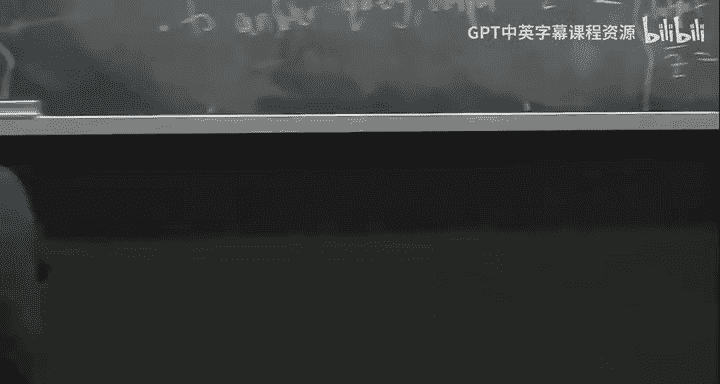

# 高级算法：第25讲：容斥原理与流式算法


在本节课中，我们将完成对“更快的指数时间算法”或“小空间算法”的讨论。具体来说，我们将深入探讨容斥原理、Zeta变换和莫比乌斯反演。之后，我们将转向我研究的一个领域：流式计算与草图技术。

## 容斥原理与Zeta变换

上一节我们介绍了容斥原理。对于所有集合 `R ⊆ T`，我们证明了以下等式成立：

```
∑_{R ⊆ S ⊆ T} (-1)^{|T| - |S|} = [R = T]
```

其中，`[布尔表达式]` 表示当表达式为真时值为1，否则为0。

我们定义了Zeta变换。对于一个将集合映射到某个环的函数 `F`，其Zeta变换 `F̂` 定义为：

```
F̂(S) = ∑_{R ⊆ S} F(R)
```

上一讲我们以K染色问题结束。我们定义函数 `F(S)` 为指示函数，当集合 `S` 是图 `G` 的非空独立集时为1，否则为0。我们有一个结论：图 `G` 是K可染色的，当且仅当：

```
∑_{S ⊆ V} (-1)^{|V| - |S|} (F̂(S))^K > 0
```

我们提到，这个公式可以让我们更高效地解决问题。这个结论的证明细节已包含在笔记中。接下来，我将展示这个结论的证明，并将其作为更一般原理的一个例子。

## 莫比乌斯反演

我们定义了莫比乌斯反演公式。对于函数 `F`，其莫比乌斯反演 `F̃` 定义为：

```
F̃(S) = ∑_{R ⊆ S} (-1)^{|S| - |R|} F(R)
```

Zeta变换和莫比乌斯反演的核心关系由以下命题体现：

```
F̂̃ = F̃̂ = F
```

这意味着，对 `F` 先进行Zeta变换再进行莫比乌斯反演，或者先进行莫比乌斯反演再进行Zeta变换，都会得到原始的 `F`。我们将证明其中一个方向，另一个方向类似。

**证明：** 我们证明 `F̃̂ = F`。对于任意集合 `T`，计算 `F̃̂(T)`：

```
F̃̂(T) = ∑_{S ⊆ T} F̃(S)
      = ∑_{S ⊆ T} ∑_{R ⊆ S} (-1)^{|S| - |R|} F(R)
      = ∑_{R ⊆ T} F(R) ∑_{R ⊆ S ⊆ T} (-1)^{|S| - |R|}
```

根据容斥原理，内层求和 `∑_{R ⊆ S ⊆ T} (-1)^{|S| - |R|}` 仅在 `R = T` 时为1，否则为0。因此，整个表达式等于 `F(T)`。证毕。

## K染色问题的推导

现在，我们来看K染色问题中的公式是如何从这个一般原理中自然得出的。

定义函数 `G(S)` 为：将集合 `S` 写成 `K` 个非空独立集之并的方式数。图 `G` 是K可染色的，当且仅当 `G(V) > 0`。

我们注意到，`Ĝ(S)` 恰好等于 `(F̂(S))^K`。这是因为 `Ĝ(S)` 计算的是所有包含于 `S` 的 `K` 个非空独立集的选择方式数，而 `F̂(S)` 是包含于 `S` 的非空独立集的数量，其 `K` 次方正好对应了有序选择 `K` 个独立集的方式数。

因此，根据莫比乌斯反演公式，我们有：

```
G(V) = Ĝ̃(V) = (F̂^K)̃(V)
```

这正是我们之前用于判断K可染性的求和公式的来源。

## 算法实现与复杂度

我们声称，可以顺序计算所有 `F̂(S)` 或 `F̃(S)` 的值，在 `O*(3^n)` 时间和多项式空间内完成。这里的 `O*` 记号忽略了多项式因子。

**朴素算法：** 对于每个集合 `S`，计算 `F̂(S)` 需要求和所有 `R ⊆ S` 的 `F(R)`，这需要 `2^{|S|}` 时间。对所有 `S` 的总时间是 `∑_{S ⊆ V} 2^{|S|} = ∑_{i=0}^{n} C(n, i) 2^i = 3^n`。空间上只需多项式开销。

**更快的算法（Yates算法）：** 该算法可以在 `O*(2^n)` 时间和空间内计算Zeta变换。这是一种动态规划算法。

我们定义辅助函数 `G(i, S)`，其中 `S_i` 表示集合 `S` 中大于 `i` 的元素构成的子集。`G(i, S)` 定义为：

```
G(i, S) = ∑_{R ⊆ S, S_i = R_i} F(R)
```

我们最终需要 `F̂(S) = G(n, S)`。`G(i, S)` 满足以下递推关系：
*   基础情况：`G(0, S) = F(S)`。
*   递推关系：`G(i, S) = G(i-1, S) + [i ∈ S] * G(i-1, S \ {i})`。

状态数为 `n * 2^n`，每个状态的计算是常数时间，因此总时间和空间为 `O*(2^n)`。莫比乌斯反演的计算有极其相似的动态规划算法。

**总结：** 因此，我们可以在大约 `2^n` 的时间（忽略多项式因子）内判定K可染色性。值得注意的是，通过约简，我们也能在相似复杂度内实际找到一个K染色方案。

## 流式算法简介

在接下来的课程中，我们将讨论一个完全不同的主题：流式计算与草图技术。

流式算法关注的是在数据流持续到达时，使用远小于数据本身大小的内存空间来维护一些信息或回答查询。

**模型：** 我们有一个高维向量 `x ∈ R^n`，初始为零向量。数据流由一系列更新操作组成，每个更新是一个元组 `(i, v)`，表示将 `x_i` 增加 `v`（在“严格递增”模型中，我们通常假设 `v = 1`）。在流结束后，我们需要回答关于 `x` 的某些查询。

**目标：** 使用远小于 `n`（存储整个向量）或 `m log n`（存储整个流，`m` 为流长度）的内存空间。

**示例问题：F0估计（不同元素计数）**
查询是向量 `x` 的支撑集大小，即非零坐标的个数。在IP流量监控的例子中，这对应于看到过的不同IP地址的数量。

*   **确定性精确算法不可能：** 任何确定性算法解决精确F0问题都需要 `Ω(n)` 位空间。证明采用编码论证法：如果存在一个使用 `S < n` 位空间的算法，那么我们可以利用它来构造一个将 `n` 位字符串压缩到 `S` 位字符串的单射，这与鸽巢原理矛盾。
*   **随机化近似算法可行：** 允许随机化和近似后，我们可以在亚线性空间内解决问题。具体来说，我们可以设计一个算法，以至少 `2/3` 的概率输出一个估计值，该估计值与真实F0的误差在 `ε` 倍以内。

## Flajolet-Martin算法思想



我们描述一个理想化的随机算法来直观理解为什么近似是可能的。

1.  假设我们有一个完全随机的哈希函数 `h: [n] → [0, 1]`，将每个坐标均匀映射到 `[0, 1]` 区间。
2.  算法维护一个值 `Z`。对于流中出现的每个索引 `i`，计算 `h(i)`，并令 `Z = min(Z, h(i))`。初始化 `Z = 1`。
3.  查询时，输出估计值 `1/Z - 1`。

**直观分析：** 假设有 `F0` 个不同的元素。将它们哈希到 `[0, 1]` 区间，我们期望这些值大致均匀分布。最小值 `Z` 的期望大约是 `1/(F0 + 1)`。因此，`1/Z - 1` 的期望大约是 `F0`。通过计算 `Z` 的方差，并应用切比雪夫不等式，可以证明估计值以一定概率接近真实值。

为了将误差控制在 `(1 ± ε)` 因子内并提高成功概率，我们可以并行运行 `r = O(1/ε^2)` 个独立的哈希函数和计数器，记录各自的 `Z_j`，最终输出 `(1 / avg(Z_j)) - 1`。取平均可以降低方差，从而满足精度要求。

**实际实现：** 上述是理想化版本。实际中，我们需要使用有限精度表示哈希值，并使用有限独立性的哈希函数族（如 pairwise independent hash）来替代完全随机的哈希函数，以节省存储哈希函数本身的空间。

## 总结

本节课我们一起学习了：
1.  **容斥原理、Zeta变换与莫比乌斯反演**的一般形式，并看到K染色问题如何作为其一个具体应用。
2.  计算这些变换的算法复杂度：朴素算法需要 `O*(3^n)` 时间和多项式空间；Yates动态规划算法可以优化到 `O*(2^n)` 时间和空间。
3.  引入了**流式计算模型**，其核心目标是用极小的内存处理大规模数据流。
4.  以 **F0估计（不同元素计数）** 问题为例，说明了确定性精确算法的空间下界，并介绍了随机化近似算法（如Flajolet-Martin算法）的基本思想，它利用哈希和概率估计在亚线性空间内解决问题。