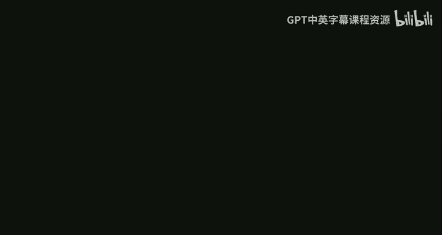

# 哈佛大学《高级算法｜Harvard Advanced Algorithms (COMPSCI 224) 2016》中英字幕（deepseek） - P7：-07-Advanced Algorithms (COMPSCI 224), Lecture 7.zh_en - GPT中英字幕课程资源 - BV1cDJGziELP

Describe， it。

Okay， so I think I'm going to get started。Today we're going to talk about display trees。

This's going to be another example of amortized analysis again for a data structure。Some sp trees。

I think I asked this before， but I can't remember how many people have seen play trades before。Okay。

 some number， okay， so display trains。These are due to slater andt。I think。It's 85。Okay。嗯。

And this problem。We have so it's comparison based data structure。And we support two operations。

 we support insert。Okay， so insert a keyK。As well as find。So let's say， I mean。Insert insert an item。

 which is a key together with a value and find。With a key。呃。Returns。Associated value。

And you can also imagine delete。So it deletes。Deletes item。With key K。And this。Inserts a new item。

With Ki K。And value V。So if we weren' in a comparison based data structure。

 how would we solve this problem？Yeah， this is a dictionary problem， so we can use hash tables。

But here we're giving。嗯。A comparison based solution to the problem。

Which could also be used to solve things like predecessor， for example。ok。And。You might be wondering。

 you know， in this class， we see some pretty hefty data structures like fusion trees。

 Does anyone actually care in real life， right， So this data structure。For this stage。

 there is this award called the Paris Conalocs Theory and Practice Award。And。

Spplay treeses wanted in 99 for creating one of the most widely used data structures invented in the last 20 years。

 so the authors wanted it for the S tree。Apparently， this is something that is not just the。

In theory land，呃。Okay， so what are display trees？People have seen， I hope。

 some form of balanced binary search tree， like maybe a red black tree， AVL tree。

 something like that。So a spplay tree is， again， some binary search tree。So s trees。

Are binary search trees？Okay。But after every operation， we do some amount of rebalancing。So， after。

Each operation。呃。The tree。Adjust itself。No so it's some rebalancing。Okay。Actually。

 I think the title of this paper is selflf adjustjusting something Re。Okay good。

 So what do I mean by。Adjusting itself， so this data structure operates in a model called the BST model。

So BST stands for binaryary Search tree。How does the BST model work？At the beginning。

Of each operation。We have a pointer。To the root of the tree。

And what can you do step at each step you can either walk to some child？

Or we'll walk to a child or to a parent， or do a rotation， I'll say what that means。At each step。

We can。Follow。A child。Or parent pointer。Or do a rotation。 rotations are used。

To rebalance the data structure。 Okay， so what's the rotation？So we have this big tree。The rotation。

I'll just say describe what it is via a picture。So somewhere in this tree， we have a node X。

We have a node Y， which is its parent。So this is going to be rotate X。

X might have some subrees hanging off it。Why also this could be the empty tree。 A。

 B and C could be empty trees， but this is， you know， in general， what the picture looks like。

 And if we do a rotate on X。The rest of the tree stays looking how it was but。This picture。

Turns into x now being the root。Y is now a right child of X。And then B and C and I live here。

And aam's here。Okay， so that's what I mean by rotation and。Well X could be the right child of Y。

 in which case you do， there is a symmetric looking picture。

 Okay so the point is that X now becomes the parent of its parent。Okay。

 and then these trees go wherever they need to go to keep the。Binary search reordering valid。O。🤧So。

I'll get right to it and tell you。How play trees work？So。To do a find。How do you implement find？

Search。4 x， as you would。In a BST， I mean， s tree is a BST， right。

 So you start at the root and you just keep going down the correct child to get to where X is。Then。

After。Reaching X。Spplay X， so S is a subrine。That I will describe。Soon， okay。

 it's going to do some number of rotations to bring X to the root of the tree。

So whenever you search for x， after all the rebalancing is done， x is the new root。

It's not just going to be rotate X over and over again until it's the root。

 It's going to be something just slightly。More involved in that， but not much more。And insert X。So。

Insert。As in any EBST， so you find where it should go and put it there。Then display X。Okay。

 and delete。🤧。嗯。There are several ways you can do delete one way is。Spplay X。Then remove x from tree。

Okay， well。When you display a node and it's the root， and now you remove it。

If it had things in both its subtes， now you have like two different trees and you want to make sure that you have one tree at the end of the day。

 right， one balance， one binary search tree。 So what do you do？嗯。If x had two children。Spplay。

The largest。Element。In the left subt。And make it the new route。Okay。

 so what does that mean just to draw a little picture？You have a tree。X was somewhere。

You splitplay X。Now x is the root。And then you deleted X。

And then now you find the largest element in this tree。AndThat's。到。And you bring that to the top。

And then， now you add。That so it becomes a new。 Okay， so that's how you do the。Okay， so。You know。

 at the minimum， we we know that with binary search trees。

 you can get log n time per operation using， say， red black trees， A VL trees。

 So S trees you know we'll show that can you get that with sp trees as well。

But one of the fascinating things about S trees is that they have all these other properties。Okay。

 so for example。I think I mentioned this last time。They have the。Static optimality property。

This was shown in the original paper by Slater andtin。Let me just say slater and Ta 85。Okay。So。

For any。Sequence。Of operations。And。Any。Fixed。Binary tree T。嗯。Say the time。To perform。All ops。

With a s tree。Is big O。Of the time。To perform。All operations。With tea。

So if you knew the entire sequence of operations ahead of time。Let me say。Let's see。Any sequence of。

Yeah。Lets find operations。So let's say the items are fixed。O。

And you know what all the fines in the future are going to be。

 you know what they are and what the order is。Okay， and now you want to。Build a binary tree。

 a binary search tree， which services that sequence of fines as fast as possible。So you can do this。

 I think I mentioned at the end of last class with dynamic programming， you can find such a tree。

If you're not familiar with that， I think it's in CLRS。

 it's definitely on the lecture notes from CS124 last semester。But。

Spplay trees don't know the future， right， I showed you exactly how find works。

It doesn't know what the future operations are going to be yet。

 the time that display tree takes to perform all these operations is within a constant of the best tree。

RightIt's within a constant of any tree， and particularly the best tree for that sequence。

So that's static optimality。There are other properties that s trees have。

One other one is called the working set property。This is also in slater inent。Okay。So， I need to。

giveive you some one piece of notation， one definition。Let。TJ。Be the number of items。Accessed。Since。

The last time。We saw。The Jth item in the sequence。The sequence of operations。So again。

 let's say we have a bunch of fines。Okay， so we have。Find on。You know，Some X1， XI2， Xi3。X IM。

 so we have M operations， a bunch of fines。And。Let's say here we have the item that we search for a7。

And。You know， five steps ago。We searched for seven in the past。Then what I'm saying is TJ will be5。

How many items were there in between the last access to this item？So that implies that s trees。

Achieve。Oh of。M plus N log n。Plus， the sum。J from1 to M。Of TJ。Time。Log of TJ。Okay。

So it's not just log in the number of nodes， it's log in how many nodes were there since the last access。

And it's called the working set property because if there's a stretch of time where you keep。

Searching for the same 10 nodes over and over again。

 then you're going to start spending constant time log of 10。Okay。

 so like those 10 nodes will be your working set。There are a bunch of other properties that satisfies。

 I think I'll just name。I'll just name a couple more。

 and then I'll state a conjecture regarding s trees， which hasn't been proven yet。呃。Another one is。

The static finger property。Also in the original paper。It says let。F。Be any。Fixed item。Okay。

 and I said so there are n items in this data structure。

 Let's just assume that the keys are actually 1，2，3 up to n。 Okay。

 since it's a comparison based data structure， all that matters is relative ordering。

 So let's just assume that they're all ordered like this。So I is actually the rank of the I item。

 but just assume it's the I item。大き。Let FB any fixed item。Then。The amortized。Cost。Of find。I。

 in a s tree。Is。O of log。F minus i plus y。呃。Let's say log f minus I。So this is true for all F。

 So you can pick F， you know， like for any given access sequence。

 The amortized cost per operation is this for a fixed F。

 So it's true in particular for the min overall all F。That's the static finger property。

 question people are puzzled by this property。No。So if you're spending a lot of time searching for keys that are near F。

I mean， you can search for anything， but if most of your searches are near F， then。

You're you're servicing this。Access sequence cheaply， yeah。Yeah， so F minus I is0。 So okay， so plus1。

So I mean， its， this part is always going to be at least 0。 but then there's one。 So your。

 your time is always going to be at least constant。But in general， let's log the distance to F。Yeah。

 I didn't mean to put log of 0。 I guess。 Okay， so there's also the dynamic finger。

This is actually not due to ster andt。嗯。And let me see who this is due to Cole is one of Cole M Ru Schmidt and Siegel。

So there are two papers， Cole， Mira。Schmidt。And Siegel。As well as Cole and by himself， they're both。

From PsCO 2000。What does this say？嗯。Suppose。Access sequence。Is。You， again， x。X1， x2， XM。Then。

Aortized。Cost。Of the ice operation。Is Big O of log。Of。X I minus X I minus1 plus one。So。

The reason it's called dynamicy finger is here your finger always stays on F and you're measuring distance to F。

 here your finger always moves to the item you last searched for。ok。And。The proof is。

 I think at least more than 100 pages。Okay， so。Yeah， we're not doing it any in class， worry。Yeah。

 so this yeah，I don't know。 this is very like， well， this paper is not by tarn。

 but I feel like this is very tarn style that the the data structures and the algorithms themselves are often very simple。

I didn't define displayplay yet。 It's going to be something simple。

 But then the analysis is the thing that。Take all the hard work， which is great for a programmer。

 right if you actually want to implement a data structure。Who cares how long the proof is。

 It only has to be proven once， whereas。With the implementation。

 you might have to implement it in different languages or change the implementation a little to have some other property or something。

 you don't want to implement really complicated data structures。That you can't later debug。

 et cetera。Well， okay， so I guess。It is nice to have short proofs too。

 because people can check it then and also people can build on it。对。Anyway， so that's dynamic finger。

嗯。I think I want to say。There's also something called the Unified Bo。Which tries to unify， I think。

 dynamic the finger property with the working set property。Which says that。嗯。Like。So。

Instead of paying log of。You basically play log of the sum of these two things。

 so there's the unified。This was introduced by Iakoo。In 2001。We want。The cost。Of Op J。

 the amortized cost。To be。So do the min。Over， I less than J。Of log。Of。呃。Let's say Xi。Minus X J。Plus。

 I guess， J。Minus I。Okay， so it's sort of it's called unified bound because it unifies。

The working set property and the。Finger property。So there should be some item beforehand。

Which you are close to。And it didn't happen too far in the past。So it unifies unify those two things。

Unfortunately， it's not known that。It's not known that display trees achieve the unified property。

Okay， it's。It's not known that any BST satisfies the unified property。

 but Icono then gives a data structure which does achieve the unified property， but it' not。

 it's not a binary search， some other。It doesn't operate in the BST model。Okay。

 but it's an open problem。The closest thing is we have。I think dairy berry。And。Slater。Wd09。Okay。

Services。M operations。In time。O of M log log n。Plus， the unified bound。

This is the unified bound on the sequence。So to really with some BST。Not with s trees。

 they give a different data structure， which achieves this bound。So what you really want here is M。

 not M log log n。嗯。But okay， that's what's the best that's known。

And before so I still haven't told you what displayplay is。呃。Before I tell you what display is。

I will state the。Granddaddy of them all or something。

So I defined for you what the BST model is so so at the beginning of every step。

 your finger is at the root， you can follow pointers。

 you can do a rotates okay you can rotate the node you're currently you currently have your pointer set to。

So。Then there's something called the dynamic。Optimality conjecture。This is， this was in。

hing in the original paper itself。And it's been open ever since。Which I guess is almost 30 years now。

So what does it say？Okay， so with static optimality， I guess static optimalities right here。

We just have。We're just comparing to a fixed tree。Okay。Dynamic optimality。😡，Let's the tree change。

Okay， so the tree that we're。There's a set of like BST algorithms right at every step you can choose。

 am I going to move this pointer， I'm going to move down or up am I going to rotate。

 So the dynamic optimality conjecture says that s trees basically do the best that anything can do okay so。

Let。Ot。Be the。Let's say， opt of。Opttive Sigma。Be the optimal。Cost。Of servicing。Access sequence。Sigma。

In the BST model。So pretend you know Sigma， you know the entire sequence。

And given that entire sequence， you're going to spit out to me what you do at every step。

So at every step you're going to tell me， either up point， go up。

 go down to some child or do a rotate， okay？But you need to make sure that you touch every you touch all the nodes in this access sequence。

In the order in Sigma。The conjecture。Is that for all Sigma？Display cost。Spplay tree cost。

Oserving Sigma。Is big O of Op Sigma？So there's a fixed constant independent of N or M。

Such that for all access sequences。Servicing that access sequence with a tree is at most a constant factor larger than the true optimal way to do it。

对。So are people happy with the difference between dynamic optimality and static optimality？Okay。Yeah。

So。Right， so the BST model says that。You have one pointer that's always at a node somewhere。

And at every step。You're allowed to either follow one of the children' pointers。

 go to a parent pointer， or do a rotate on the node you're currently pointing to。

And every time there's a。An access request， you need to make sure that your finger moves to where that note is。

不人。So rotations are the picture I drew。 Yeah， that's a rotation。 That's what rotation means。Okay。So。

So let me write this like at most C times。C times opt。啊。So。For some。Fixed。Constantancy。

So a question for you。Suppose that I didn't insist that this C were a constant。

 I allowed it to be a function of， let's say， n， the number of items。

What's one small value of C that。You know， is already known。啊。Would you log in， yes。

Any balanced binary search tree？We'll get you at most opt times log n， why。

 because for each operation， for each element in this access sequence。

 you need at least constant time just to touch that node and a balanced BST is spending at most O of log n。

So it's at most log n times optt。Okay。嗯。There was a data structure。😡，So tango trees。This is due to。呃。

I mean， domain。Harman。Ya Koo。And Peracheku。This is in 2004。Achieve。C being O of log login。Okay。So。

These are not s trees。Actually， these trees。These trees are not dynamically optimal。Okay。They。

 they were purely designed to see how low can we make this C， right。

 Because we know that log n is just follows from really old results in binary search trees。

 So can we get something closer to constant？ So they showed that there is a BST model data structure that gets log log n。

And later， there was also。Another paper by Wang， Derry Berry and Slater。In soda 2006。

 that also got big O of log log n while simultaneously having log n worst case or log n amortized time preparation and log squared and worst case。

 So this， this doesn't have any good guarantees on worst case。Or amortize bounds。

 at least not as good as the multiplay trees。By Wang and the others。Yeah， that's right。So， okay。

 so finally， I should， I should actually tell you what the data structure is by defining S。Okay， so。

I said that the purpose of display is to bring a node to the root。Okay。So。You know， the。嗯。

Just rotating X over and over again until it's the root is gonna you can create examples where that's not good。

 So， for example， suppose that you have a tree that that looks like。 So I mean。

 this this rotation is supposed to gradually keep the tree balanced somehow。

 right if we want amortized log n preparation。That sort of means on average， the tree looks balanced。

So suppose that we just kept rotating things up to the root。

 So let's say we have something that looks like 6，5，4，3，2，1。

Let's say that it's completely out of balance。And let's suppose that our fake display operation was just keep rotating till it's the root。

Keep rotating。s。So suppose that we did a find on six， and now we have to rotate it to be the root。

Then the picture is going to look like。嗯。6。Is up there。 And then I think it's going to be。One here。

And then two， three， four， five。If I didn't mess up， that's， I believe what it should look like。嗯。

So in other words， the depth needs to be an and installant， okay， so that's not good。Okay。

 so how does S work？So I'll just define it and it'll look like magic。And。You know。

 with Fibonnoic heaps， at least I could say。I can sort of say where they came from if you started off with binomial leavess。

With， with s trees。I never know。I've met both Slater and Tjn。

 I've never actually asked either of them why they did this。

 but a friend of mine who went to CMU where Slater is， he apparently asked Slater several times。

And Slater apparently gives different answers， depending on when you ask him。

 And one of the answers was just the math works。嗯。So yeah， it is somewhat magical。

 but it's a simple thing。Seems to come out of nowhere。 And even in hindsight。

 it's not obvious why it's so great。 So， so how does how does work。 So this is。

So this is not a good idea。So how does spplaying work？So。They're going to be so SplayX。Repeatedly。

Do the following。To x。So there are going to be three cases。It before I favor with three cases。

Suppose that。Why is the parent？Of x。And Z is the parent。Of why。Now， there may be， I mean。

 so we're done when X is the root。 So what X definitely has at least a parent。

 It might not have a grandparent， because。Maybe the parent of x is the root itself。

 so there are three cases。So case1。Why is the root？And I'll say what to do in that case。Case2。

Is that？X is the left child。Of why and why is the left child。Of Z。Or x is the right child of y。

And why is the right child of Z？So x and y or these child pointers are both going in the same direction。

 left， left or right， right， and then case3 is everything else。

OrSo x is left of y and y is right of z。Or。X is the right child of y， and y is the left child of Z。

So those are the three cases。What we do in the three cases is going to be different。Yeah， okay。

 that's right。So case1。So y is the root， we'll just do rotate X。And now X is the root。Case two。

We have left， left or right， right。We'll do rotate Y。Then rotate X。And then we have case three。

We'll do rotate X。Then rotate X。K。So that's。That's play。So we'll keep doing。We'll keep looking at x。

 we're in one of the three cases， we'll do the corresponding thing。

 and then we'll iterate this until x is finally the root。So maybe I'll draw a picture。

 We already said what rotate looks like， so there's not really much to show you for case1。For case2。

 case2 is like， say left left。So pictures。Case 2。Looks like z goes to y， goes to X。And then x hass。

A and B down here。CG。So when we rotate。Let's say we rotate Y。That's going to look like。Y， Z， D C。X。

AV。And then， now。We rotate X。And that's going to look like。X， Y， Z。And then， a。B。C利。

So that's case two。So case two will bring us from this picture to this picture。

Whereas case1 or case three， sorry， case three。Right， so this was， we went left and left。

 There's an analogous picture for going right and right。 I'm not going to draw it。Case3。

 things go in different directions， so we have Z up here， we go left to y， then we go right to x。嗯。

So here we have A， B， C， D。So I said the first thing we do is we rotate， we rotate x twice。

So the first rotate x。Looks like。Z X。嗯。Y is less than x here。And then。This is AB。CD。

And then we rotate x again。And then that brings- its look like this X z。Why。是。AB。Okay。And。Sort of。

 I mean， this is not going to be a proof of anything。But it's at least a hint that something is good。

We could ask ourselves。What does。Doing a s on the leaf of a path do。

So I drew a picture before that said if you just keep rotating X， it doesn't look that great。

So whatever we're doing now， hopefully it at least fixes that problem。

 so let's just look at S on one of these things。So。Suppose I have。嗯。6，5，4，3，2，1。And then， I。Spplay。

And6。Actually， in my notes， I don't know why I did this to myself， I just made it one different。

I don't want to have to think I'm to fly and draw a wrong picture。Okay， so。

So is there's stuff hanging off at the bottom here？I'm not going to label everything otherwise。

So if you display on six， what does that look like， I'll draw it for you。嗯。Wait a second。

Can someone tell me something that is wrong with this picture？Yeah。是吧。😊。

These are all negative numbers。hoops。Now， this picture is at least s。

I don't want to keep writing eight numbers。But。Alas。Okay。So。So six， minus6 has to be on the top。

 we know。嗯。And then we have。us1 hanging off。And 0。Oh oh， a， you're right。

So I really messed on myself。This should really be。嗯。Minus1 should be off the right。诶。And then now。

inus2， minus-3。-4，-5。Good。So what this looks like。啊。There should be one thing left。These trees。

Are still around？Okay， so。So yeah please in the lecture notes， I guess。Please don't have minor signs。

Yeah真真系。Okay， so。The main idea is if you do display on a path， basically half the path gets put here。

 and then each one has a node hanging off。Okay， so the depth decreased by about a factor of 2。

So that's at least promising。 It's not a proof of anything really， but。So promising that render。

Heading in the right direction。So let's actually prove something。So。Can。The amortized。Cost。Of。

An operation。Is what do we want it to be log at？So we're going to use the potential function method。

Okay。So before。Oh， is that from outside？Oh yeah had someone the hallway， okay。

 so before when we were dealing with Fibonacci heaps and binomial heaps。

Things were easy to picture in your head because we had this adding money to this bank account and taking it out later when we needed to spend it。

Now the potential function is going to look。A little more complicated。 And we're going to have to。

Use。One inequality at some point， namely。A GMM geometric mean is at most arithmetic mean。

 You'll see where that's going to come up。 But okay， so the strategy。Is going be the potential。

Function method。Okay， so。We're going to give。Every item X。Await。Wx。We're going to define。

S of x as being the sum。Over z in x's subt。Of the weight of Z。So this includes X itself。

To the sum of all the weights in its sub。And。R of x is going to be log。Of S of X。Okay。

And then now we can define our potential function。The potential at any given state。Is。

The sum I from1 to n。Of R ofI。Okay。It's the sum of all of these。I don't know what to call this。

 I think some people call this the rank of X。This is some of all the ranks in the data structure。

Okay。So that seems like it's out of thin air。It sort of is， yeah I'm sorry。

 that's sometimes things are magical。So。WeSo what we want to do now is bound。So first of all。

 let's look at findd。Right。So。The cost of find is basically the cost of。Display operation， right。

 because we walk down and then we splay back up and the cost of displaying back up is。

The actual cost， not the amortized cost。 the actual cost of sping back up is proportional to the height of the tree or to the height。

 not the height of the tree， but the length of the path down to X。

So we can charge going back down to。 We can charge going down to X to display。

 which brings it back up。So the amortized cost of。Of a find， for example。

 is just a big of the cost of displaying。So let's figure out what is the amortized cost of display operation？

Okay。So question。So the amortized。Call so the。The cost。Of a find。Is big O of。Of a find on x。

Is big O of the cost。Aortized cost。对。The cost display X。So what is？The amortized cost。Of display。

Okay。So let's figure this out。So remember how display works。 We just keep， we just keep doing one of。

Haha。😊，You know what。I。Do not want to erase this。So I will erase this。Okay。So。

Spplay has a number of like mini display operations inside where we're either in case 12 or three over and over again。

 right， So let's figure out the amortized cost of， let's say， a case2 operation。

And then we can just sum up。Everything as we display all the way to the top。

So I'm only going to do the advertise cost of S2。Everything else is very a case too， I mean。

 everything else is。Kind of similar。So otherwise， you have to look at， okay， what if it were right。

 right， What if it were left， right， right left is just。Pointless to do this in class， okay。

 so I'll just do one。So。Let's look。At case 2。Going left， left。So that picture up there。I mean。

Why is left Z Z Z。And x is left of y。Now。Remember。Amortized cost。

The definition we gave is the actual cost。Plus。嗯。The difference in potential。Okay。So the actual cost。

 we do two rotations。So， it's a constant。Let's say say rotation costs one following a pointer costs  one。

 So this is， let's say a cost of two。You can put mean whatever constant it actually is on your machine。

 put that there， you can make this proof work。 okay， it's not a big deal。Now， how about this thing？

This thing。嗯。We will show。Is at most。呃。3。Times r prime of x minus r of x。-2。Now。

 what's our prime of x？This is。The new。Rannk。Of x。After。诶。We do。The two rotations。So I mean here。

Here it has some rank R of x。And finally， after we do the two rotations。

 it has some new rank or prim X。Okay so notice this two is going to cancel that too。

And when we sum over all of the。These case operations going to the root， it's going to telescope。

And we're going to be left with。嗯。R of the root minus R of x to begin with。Okay。Remember。

 it doesn't matter who the root is， R of the root is always the same because you sum over everyone。

In the whole tree。嗯。In fact。Aortized cost。Of cases。2 and three。Are both。

At most three are prime of x minus R of x。For case one。It's at most。Three R prime of x。

Minus r of x plus1。Okay， so。This is the thing I'm going to show。 We'll show this。For case two。

But just take my word that you also get the same thing for case3 and you get an additive one for case1。

So that implies。嗯。This way。Wise two。So the Em。So yeah， ahead。感想。Oh， oh oh yeah， yeah， yeah。

 I see what you mean。No， so the amort the amort cost is defined to be the sum。

 the actual cost plus the change in potential。So， right。So。Let's see。That implies that。The cost。

 the amortized cost。Of SX。Is that most。O of1 plus。So one plus。Three times R of the root。Minus R of x。

Which， if you remember， R of x is the log of the sum of weights in the subt。

That's going to be at most。Of one plus log。Of W over。S of x。W is。over all weights。Right。

S of the root is just sum of everything。So now let's actually show this for case two。Okay， so。

Change in potential。 That's the thing we're trying to bound。So let's look at this picture。

If you look at all the nodes in the trees， A， B， C， and D。None of their。

F values actually nonene of there R values actually changed。

Nothing like the set of descendants in their subries all stayed the same。

So the only people who did change are X， Y， and Z。There are changed。

Because the people in their subies changed。So case two。The difference in potential。Is。

R prime of x plus r prime of y plus r prime of z。Minus R of x plus R of y。Plus， R of Z。Right。Okay。

 now。R prime of x。😡，Equals。R of Z。RightBecause the set of in its subt。

 the set of items in X of subre here is the same as the set of items in Z subt there。

Let me write some facts as we observe them。So this is equal to。So what got canceled。

 R prime of x will cancel R of z。 So this is equal to R prime of y。Plus r prime of z。Minus R of x。

Minus R of y。This is because。Our prime。Of x is equal to is this visible。

 I don't think this blue is very visible。R prime of x is equal to R of z。What else do we know？

We know that。嗯。R prime of y。Is less than or equal to R prime of x。Right， let me make sure I'm。

Not using bogus inequalities here。So we're also going to use the fact that let's see。是。Yeah。

How did I seem to have confused myself？ So this is at most， I want to say。I know that R of y。😡。

Is bigger than or' equal to R of x。So。R of Y。I's bigger than equal to R of x。

So this is at most R prime of Y。Tell us R prime of Z。inus2 R of x。

And then I know r prime of y is less than equal to r prime of x。And then this is less than equal to。

R prime of x plus r prime of z。Minus2 r of x。This is because。

Our prime of x is greater than equal to R of y。呃。Our prim why。Yeah。Okay。

So now let's do a little more。Now I want to bound this business here。So let's look at this thing。

 R prime of x。Plus， R prime。Of Z。Let's bound it。Lets's divide by two。Okay， what is this thing。

 This is log。呃。S prime of x。呃。Plus log of S prime of z。Over two。Which is the same thing as。

Log of the square root。Of s prime of x， S prime of z。Right。

And then now we use the fact that the geometric mean is at most the arithmetic mean。I that most？Log。

Of S prime of x。Plusress S prime of z。Over two。Do I。好。Why am I feeling。Not so happy。

This is not what I would actually。Yeah， I know why。 I actually want to bound this。Okay。

 so this is not exactly this， but we're going to see that this thing is going to pop out， okay。

What we actually want to do is we're going to bound our prime of Z。

So this work that I'm doing here is to eventually bound our prime of Z。I'm sorry。

Why can't we bound R prime of z with R prime of x？What do you mean， you mean right now。

So at the end of the day， remember the bound that I want， I just I want everything in terms of X。嗯。

Right， so yeah， I see。That actually seems to make a lot of sense。I'm sorry。So yeah， I think。Okay， so。

Yeah， what you're saying。Yeah， I think系 now系。Okay， so。

I'll do it this way and show you this won't matter that much for getting the log in。

But when I want to show like one of the other properties， such as， for example。呃。呃。

Working set or static optimality。I'm going to fudge my definition of like this potential fee a little bit and allow fee to be negative。

Okay， and then we'll go back and see what that means in terms of like bounding real cost in terms of amortized cost。

But once I do that， I'm going to allow these like our primes to be。Negative numbers。

So like I'm going allow， I'm going to allow。I'm going to allow yeah。

Things that are above you in the tree could be even more negative， potentially。Oh， I see。Oh yeah。

 it's good。So yeah， this is a very good point I'm。てない个。嗯。I promise Z is at most。P of X， Yeah。

 actually， what you're saying makes a lot of sense。 So I don't know why。I read this proof。No， no， no。

 that's not important。 but yeah， this makes sense。 So the point you're saying is。

This thing here we can replace pihi， so this is R prime of x plus r prime of x minus2 R of x。

I need the minus2。Yes， wella， yes， okay， thank you。 Okay， now I know why I need to do this okay。

I need to kill that too over there。Okay， does that So okay， Okay， so I completely forgot about that。

 too。 So let's go back to business。 So I want to bound good。 So I don't just want to bound。

I don't want to bound R prime of z by R prime of x and get I don't just want to get big O of R prime of x minus R of x。

I also want to get this minus2 to kill that two。Yeah， that was the key， sorry about that。Okay。

 so let's go back there and I want to bound R prime of Z。So this is that is equal to that。

 I applied AMGM。Okay。And now。So I actually， even with this， even what I said with negative numbers。

 I am going to maintain the property that as you go up in the tree。

 our ranks are only going to be non decreasing。Okay， so now。Let's look at S of x plus S prime of z。

S of X has all these nodes。S prime of Z。Has all these nodes。Okay。So if you take the sum of them。

You have everything except for why。😡，Whereas is contained， whereas everything is s prime of x。So。

This thing here。Is that most s prime of x？So this is at most log of。S prime。Of x over 2。

Which equals r prime of x minus1。And then now。You multiply by two。And you subtract off R ofx。

So now I can get rid of this picture finally， are people happy with？With me。

Are people happy with this inequality？So multiplying by 2 and bringing over the R of x。

 this all implies that r prime of z。Is that most？嗯。Two are prime of x。Minus R of x。Minus2。

Now we plug that in for R prime of Z there， we get3 R prime of x minus3 R of x minus2。

So this all implies that Delta fee。Is at most3 R prime of x？Minus r of x minus 2。Which。

 as I said before， implies that the amortized cost。Of display。And in case two， anyway。

 and it's also going to be true for case3 is at most three times R prime of x。Minus R of x。Yeah。

I mean， of just one。I mean， just doing yeah， sorry。

 so amortized cost of case2 is what I really meant to say。But if you did the same exact。

Thing for case three or a similar thing。 you would get the same bound。 if you did it for case1。

 you would get an extra plus one here。So you only pay that plus one once in the entire display。

 namely in the last step。Potentially the last step。Yeah。So I say it again。Can't you just like。Oh。

 so Delta B will be。So I mean， at the end of the day。

 this telescopes all the way up to the root and you pay。You pay R of the root minus R of x。

 so I don't know if maybe I misunderstood your question。か one。Oh， when you're in case one。

 where does the plus1 come from？嗯。Well。都到地下。I see。If Delta P had a minus term。

Maybe I'm not sure what you mean by that。Oh， I see。I see。呃。Right， you're saying。

RightSo I guess so the point is that the root you don't get to subtract stuff at the very last time。

I don't know if I'm answering your question。😀。😊，The cost of an operation is not negative if that that's。

Oh， yeah。关是。嗯。Okay， so， okay， so yeah， that's， that's a good question。

 And it's going to bring me to now。Proving the actual claim， which is that So So what， So okay。

 so once you do it for all the cases and do the telescoping thing I said above， what do we have。

 We have that。Okay， so we said that the amort cost。Of sp X。Is O of1 plus log the sum of the weights。

Over S of X。Okay， so to answer your question， why did we deal with all this like arbitrary weightings。

 right， It's because we want to prove different properties of s trees， for example。

 having the working set property or whatever。If we just want to prove an amortized bound of log n。

Okay。Then。How would you define the weights？Yeah， if you make all the weights one。

This implies amortized cost。Ofplay。X is o of log n y。Make。The weight of x。1。For all X。

Then the sum of all the weights is n。And then you're dividing by something which is at least one。

 so you have log n here。But what if you want to prove these other amazing properties of s trees？So。

What about？So I'll just do one before the end of class。What about static optimality？

Howd you define the weights there？So the items， let's say。A1 up to n。ok。Let's say。Some tree。Ti。Puts。

Item I。At level。Else why。I should mention。嗯。The way that I'm going to do the analysis now。

As a way that I saw done by David Epstein， so the way static optimality is originally phrased in the slater Tgen paper。

Is they show。How many people know what entropy is？Entroies like Shannon entropy。 Okay。

 so the thing about this static optimality。 So the way I phrase static optimality at the beginning of the class。

 as I said， for any tree T。For any fixed tree tea， your sple trees do as well as T does。Okay。

 on the access sequence。But for a given access sequence。

It's understood how well the optimal tree does。 This is Huffman coding。 Okay。

 and what it does is it gets you a bound and a running time bound。

 which is proportional to the entropy of。Of like if you look at the if you look at the fraction of times。

 you search for I as the probability of I， the Sha entropy of that quantity。Is。

Is the bound that the optimal tree achieves， and slater int showed that splay trees get the entropy bound。

So yeah。Does the sequence of accesses only？Right， so here yeah， there's a fixed tree。

So I'm assuming you have the set of items given to you。嗯。And like the items are one。

 there' are no insertions。 There's just like finds over and over again。Okay。

So slater and actually show that S trees achieve the entropy bound， but I don' want to talk。

 I don't want to have to define entropy and then show you that proof。嗯。

I think it's more natural to just say， look。For any treat tea， s trees。Do at least as good as tea。

Okay， and that was， so the proof I'm going to show you not avoiding mentioning entropy is a proof I saw by David Epstein。

 I think he just put it in his live journal at some point。

 I don't think it was even written in a paper anywhere。Okay， so the weight。And also。

 I'm not going to approve。Exactly，ll， you'll see what we prove。 Okay。

 I'm not gonna prove the strongest thing possible， but just to give you an idea of the flexibility of these weights。

I'm going to define the weight of I。As being one over three to the LI。Okay。

So before I analyze Sp trees。Sa。I is accessed is a。Say find I。Is called。NI times。Or MI times。

What's the cost of serving this access sequence using the fixed treeP？I mean。

 what's the time to do a fine on eye？LI right， so this implies that cost。With tea。

Is O of M plus the sum i from1 to n？Am I LI。Right。So that's the bound we want to say Sp trees also achieve。

So we'll show。Spplay trees。Get。Oh of。M plus n squared plus the sum over i from1 to n。M I L。

So as long as the sequence of operations is long enough。

 so no matter what initial configuration your display free was in。

So display tree in the beginning is an arbitrary binary search tree on these items。

No matter how you started off。After M operations， this is what the running time will be。

 So as long as the number of operations is big enough， it'll start like behaving as the optimal tree。

Okay。So with a very slight change of this weight， it's possible to make this n squared be n log n。

And in the actual slater tar paper where they just deal directly with entropy。

 this term disappears altogether。 and they really show that it's up to a constant what it should be。

 Okay， but just to give you an idea， I just wanted to show you。Something more intuitive。Okay， so。

So good， so remember。Remember that。Avertized。Time。Well the amortized time for an operation is the actual time plus the difference in potential。

So the amort time of everything of the whole sequence。Is the actual time。Plus。The final。Potential。

Minus the initial potential。Remember， we're not starting with the empty tree。Right。

 the tree started in some configuration， and then we kept running fines according to this access sequence。

 So this implies。That the actual time。Is equal to the amortized time。Plus， p initial。Minus phi final。

Okay。Now。I just want to say that this thing is bounded by n squared。

And then this is gonna to be bounded by M plus this thing。 So why is this bounded by n squared。

 I'm just gonna to say something very silly。if you look at any node and ask what its rank is。

The worst case is that the rank is。Well， this optimal tree T could be a path for all I know。

In which case some node can have depth n。And then。Log of。

What over3 to the LI is like basically minus n。So log of a weight in the worst case is minus n for a node。

And。In the best case， the depth could be at the root。 And then this will give you know。

 log of that log of 1 will be 0 or something。So contributions of nodes are anywhere from minus n to 0。

 so for the whole tree it goes anywhere from minus n squared to0。

So the potential is a number between 0 and minus n squared。

 So it definitely can't change by more than n squared。So this is u most。N squared。You can do better。

 I mentioned， but then the proof just becomes very slightly more complicated， not much。

How about the amortized time？Well， let's look at the amortized time of searching for I。Amortize time。

A fine eye。Is equal to。Well， I era the theorem， but it's log。

weights well some of the weights over S of x， S of I。Plus one。決は。Oh， it is up there。 Okay， good。

 thank you。 It is up there。And in the last 30 seconds， what's the sum of the weights？

So weights are whatever three to the LI。😡，How many different nodes can have a weight of 1 over3 to the LI？

Two to the Ly， right？Weight is sum over L。One over three to the ally times number。Well。

 a number of nodes。Yeah， yeah， like in 30 seconds。At Heidel。But this is at most 2 to the L。

So this is at most sum over L23 of the L。Which converges。It's a constant。

So you got basically log of1 over3 to the L。So this thing is going to be。O of1 plus L。

Which is exactly what we wanted。Okay， so。Sorry， I did a little rush at the very end。

 but this is just one property， the static optimality， but there are。

Lots of properties and you can prove many of them by just choosing your weight function appropriately。

Compression schemes。嗯。Yeah， I mean， so the reason that the static。

 the static optimal bound is entropy is related exactly to compression。Right。Right。Yeah， I guess。

 I mean， you can say that but。I think I see maybe what you're saying。

I haven't really thought about a coding application where you would want to use play trees to change your encoding。

Yeah， I I don't know。Oh yeah， problem sets upfront。

