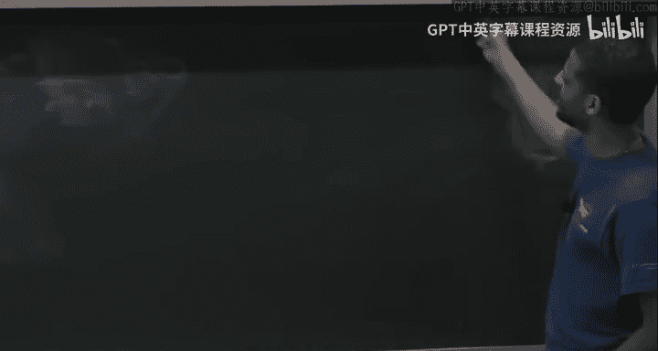

# 哈佛大学《高级算法｜Harvard Advanced Algorithms (COMPSCI 224) 2016》中英字幕（deepseek） - P8：-08-Advanced Algorithms (COMPSCI 224), Lecture 8.zh_en - GPT中英字幕课程资源 - BV1cDJGziELP

Okay， let'll get started。Yeah， thanks， I think it's good that this。Problem4。F yes。

State how much time you spent on the Pet。 It's good。

 I put that in there because I think next pieceet I have to make not as long。

 I was sming some of those answers and。

Yeah， sorry about that。Or 1 B is that？Yeah。I see， okay。うんうん。嗯。

actually there's a way to get a really short answer to 1B。hi诶。

I guess we'll put to the description section。😊，呃。对对。Okay， so。

Today I want to talk about online algorithms。Is this the right bro to be writing her yes。

and this is all about making decisions。You know， in the face of。Uncertainty。

So I'm going to imagine there's an input which is a sequence of requests。

 you're going to see some examples。And I don't know the future。

 I just know the requests I've seen so far。And based on。

And let's say there are many ways to satisfy this request。

 and I have to make a decision about how I'm going to satisfy it。Okay。

 and I want to make these decisions in such a way that。嗯。I don't regret the decision。

 like in the future， when I look back at what I decided， I don't want to regret things too much。

 Okay， so we'll see。We'll try to formalize this。嗯。Okay， so。There。Is some。costst。

To making your decision。Cost for paid。For making。Sa a certain decision。And at the。End of the day。

You have the sequence of requests。I do you have a scribe， by the way？在。

We want to make sure want to say。We didn't。Spend much more than some omniscient being who knew the future at the beginning。

Or much more。Then the best in hindsight。All right， so let's say you're。You know， you're working。

You're working。On Wall Street or something， or you're managing the。

Investment portfolio of Harvard or somewhere else。And。You know。

The amount of money you made this year is。呃。Much less than the amount of money that the person who had your job last year made。

 So now they want to fire you right and you want to say， look， it's true I made less money。

 but this year is a different year than last year。 you know， this year。

 the best anyone could have made， even if they knew the future。

Is much less than what you could have made last year。

 And I was competitive with the best I could have possibly done。 So， you know。

 you could use this kind of thing too。Save your job，So well okay。

 you can use it for also more real applications， you'll see that later in class。Okay。

 so let me let me。🤧嗯。Let's formalize this a little more。嗯。So。Weiren。Some algorithm A。

To make decisions。And opt。It is an algorithm。Making。The best decisions。While knowing the future。诶。

And definition。We say that。嗯。We say a is。Let's say are competitive。If for all request sequences。

Sequences sigma， which is Sigma 1， Sigma 2。Signant M， let's say。The cost。

Using A to serve Sigma is at most R times the cost。Of opt to。Survee signalma。

 maybe plus some additive term。嗯。Okay。And。です。This is called competitive analysis。Okay。

And it was introduced by none other than。It'sSlater in Ta。Totally different paper。Then s trees。

But the same year。We wish the journal versions are the same year。

ICan't remember about the conference versions？Okay， so before I。Look at。

 well so today we're going to look primarily at the paging problem。

 I'll define that later in lecture， but before I define that problem， I want to give you。

 I guess two toy examples。Okay。I think， if people were in CS 124 with me last semester。

 I mentioned one of them。I'll just refresh your memory。Yeah， don't。

It's okay if you weren't in their last semester， you'll see it again。

 So is one classic toy example so toy examples。So one is what's called the ski rental problem。

People always start off online algorithms with this thing。Because it's simple enough to demonstrate。

What's going on？So。诶。The only thing that's unknown in the ski rental problem is M。

 the length of the sequence。 So what's going on？ So you imagine that you and your friends are at a ski resort and they didn't tell you how long they want to spend on this vacation。

But you're willing to spend as long as they tell you， okay？嗯。And。

Each day they'll wake up and they'll either say， okay， we're done with this vacation。

 we're going home now。Or they'll say， we want to stay one more day。Okay， and ski。

And if they stay when we're day in ski， you have to have skis to go out skiing with them。

So you can either rent the skis for the day that costs a dollar。Or you can choose to buy skis。

 which costs B dollars。Each day。Must either。Rent skis。$1。Or buy skis。That's B dollars。🤧ううん。

And of course， once you buy skis， you never need to run them in the future。

 you can use them on all future days for free。Okay。So the question is， what do you do？

So if you want to look at。Opt Opt knows the future。

 What does that mean here means Op knows when your friends are going to say let's go home。Okay。

 so what would Op do？Yeah， otherwise rent every day， right， so opt。So Op says。

Different a number of days。Greateaer than B。Buy skis。Else， rent every day。Right。

But we don't know the future， and we want to be competitive with this。 So what do we do。Yeah。So us。

Rent for B days。呃。Buy skis。On B+ first day。If there is a be's first day。Okay。

If the number of days we spend at this resort is at mostB。Opt to paidid B。

 opt paid the number of days because it rented every day。

 and we also paid the number of days because we also rented every day。

If we stayed for more than B days， then off to pay B， we pay at most2 B。Okay， so this implies that。

We。Or。Too competitive。We never spend more than twice the amount of money that opt。

I think you might even do slightly better if I think if you rent for B minus1 days and buy on the Bth day。

I need to get very slightly under 2 B。If be as large， it starts looking like two anyway。

I that's one example， let me give you one more toy example before I get into。The main。

Parts of the lecture。So to example2。I'll just call this free pizza。Okay， I don't know。

 what's a building in Harvard that has a really long hallway。Are there any such buildings？Oh， that's。

Okay， so I don't know， so let's say that there's a building me has a really long hallway。And。

There are rooms on one side of it。Evenly spaced。There's room one， two， three up to n。And you're。

 you're standing here。 This is right in front of room。N over two。Okay认。

And you heard from one of your friends that there was free pizza。

You know there's some recruiting event， one of these rooms has free pizza。But。You know， you'。

 you don't have signal right now and you can't text your friend。 and there's no Wifi for some reason。

 So you just need to like find this pizza， okay。So。So I mean， you could。

You know it's in one of these end rooms， so what do you do right， Opt knows where the pizza is。

So off we just go straight there。You don't know， it could be to your left or to your right。

 but you want to make sure that you don't spend that much more time walking than opt spend。Okay。

 is the situation clear？Okay， so what would you do？Zigzag， yeah， exactly。 So when you say Zigzag。

 what do you mean？So check this room。Then go back， check that room。Okay。

 and then now go to this room and then go to that room like this。Like this。After you' checking that。

First right。外て。Oh， it city again。After chicken the。Yeah， after checking it's okay， let's go back。

I'll first check this room， that's my first thing to check， and then where I go， go left one。

And then。Okay。Pent。And then I go forward。So check this next， this is the fourth of my check。

So I guess is there a way to describe？You know， let me。Just to make this picture clear。

 let me just call this zero。And let me call this room。Minus n over two。

 and let me call this room n over two。Okay， so you're zigzagging， you're going back and forth。

And what's kind of what's the property you want from yourzagging like in the？Kith zigzag。

 roughly how。How far to the left or right are you going in the Cape Zigzag？

I don't know if I said that。So you're going to go left some number of steps。

 then you're going to zigzag and go write some number of steps。

 then you're going to go left some number of steps， right number of steps。

 So let's say you're in the K phase of this。So how far do you want to go？As a function of K。嗯。

Twice the amount forward， roughly2 to the K，Yeah， so let's look at that。呃。Visit。Rooms。One。

 then minus2， then four， then minus8， then 16， et cetera。Okay。So in reality。 let's just say that。

Let's say that the room we actually want to go to is T。 It could be minus T。

 The analysis would basically be the same。Pizza。Is in room tea。Then， you know how much？

How much walking do we do before we find room tea， First of all。

 opt will spend tea time walking there。Whereas we'll spend。So opt。Spends T time。We spend。Time。

Which looks something like one。So we pay one to go to one， then one to go back。

So we pay two to go to minus2 and then two to go back。Et cetera。Until finally。

 we pay2 to theM plus 2 to theM。And then finally， we get there in our T steps。Okay。

And the worst case。Is that this2 to the M here， I guess， will be something like at most 2 T。Okay。

 or maybe even T because we could be going in the wrong direction here。嗯。And I guess it would be。

So before we didn't hit T before， which means we were going less than T before。Yeah。

 so this2 to the M here is certainly at most2 T。Okay。And then we have this geometric series。

 which sums to something。So let's say this is at most t plus two times1 plus 2 plus4 plus。

Dot dot plus 2 T。Or you know， some power of two。That's at least t。This thing here。Is that most？40。

4 T times2 is 8 T plus T is at most 9 p。Okay。So opt spent T time。 We spent 90 time。

 So this is also this is a constant competitive algorithm， a non competitive algorithm。Okay。

Very great。So those are just two toy examples to。Make you feel comfortable with， yes。Just there。Yeah。

 so as you're walking there， you're going to peek into every room that's along the way。Yeah， so。呃。

But yeah， so you walk toward one then you walk toward minus two。

 but then you peak in every room along the way， then you walk to four。

 you peak in every room along the way， et cetera。Let's pretend peeking in a room once you're in front of it。

 you can just look into it without paying anything。Yeah。呃。Yeah， that could slow you down， I guess。

But。Let's say there's no police。To simplify the analysis。Okay， okay， good so laterlay and Taent。

 I said， introduce this competitive analysis。And they were not concerned with ski resorts or free pizza。

 So what what were。What are the things that Slater and Tarjn looked at？

So they looked at two problems， the first problem they looked at was。The list update problem。

 I'll define it。And two is paging。But I'll formally define these。But the basic idea behind them。

 I'll just say right now， with this problem， you imagine that you have a linked list。Okay。

 and you have repeated requests to access items that are in this linked list。Okay。

 so if the item that you're you're。You're told to access is the Ithe position in this linked list that costs you I steps to walk there。

But once you access it。I'm allowing you for free to move it anywhere earlier in the list。

 anywhere that you already walked past。😡，Okay。So you're allowed to change your。

You're allowed to reshuffle things in your linked list。

 There's also insertions into the linked list which just puts it at the end。

 but then also after you put it in the end， you can move it anywhere forward if you want to。

And there's also deletion。And paging。Paging is。Well。

 it's going to be about basically two levels of memory， so you have some fast memory。

 and then you have something slow like disk。Or you have say cash versus RA。And。Cash， let's say。

 has some bounded size。And when someone asks for some location， if it's in cache。

 you just fetch it if it's not in cash。You have to bring it in from memory。

 and you have to pay to do that。Okay， but if cash is full。

 you have to evict someone from cash and send it to memory。

So you'd like to minimize the number of evictions。好 right。Well， we'll see。

 know I'll more carefully go through both of these。 let me start now with list update。So list update。

嗯对。There are。And items。In a linked list。Three operations。There's access。X， insert X。And delete X。

Access X just means you have to touch item X。Okay， and your pointer starts at the beginning of the linked list。

 insert means put it at the end， delete means remove that node。After。Accessing an item。Allowed。

To move it。Anywhere。Closer。To the front。To the front of the list。And mean， let me say here。Accessing。

The I item。Costs。Hi。So I'm not going to mention all the things that。Came about before slater andcar。

But I will say。For a while， there are many papers analyzing various heuristics。For this problem。

 so let me listen some to the heuristics that people looked at。

There is the move to front heur a stick。I'll call that MF。Which says。Always move。The access item。

To the front。Of a list。There's also a transpose heuristic。Which says move。Well， transpose。

Accessed item。With the previous item。With the item before it。Immediately before it。In the list。

So it's a less extreme version of move to front。 right。

 Move to front jumps it all the way to the beginning。

 Transpose just gradually moves it toward the beginning， right， So if you keep accessing it。

 it gradually walks forward to the front until。When you access it enough times， it's at the front。

And then there is frequency count。Which says keep items。In sorted order。嗯。I'm。By frequency。

Of accesses。Most to least frequent。So for each item you keep track of how many times so far。

Has someone requested this item？Those are the frequencies of the items。

 and you make sure that the most frequent items are toward the front。Makes sense。And kind of pre。

So right before Slater and Targn， there was a paper by。

Bentley and I don't know to pronounce it MiGak， I think， but before that paper。

 there were lots of papers analyzing these heuristics。

Trying to explain why they might behave well in practice。

And those papers were all like probabilistic。 They tried to create probabilistic models for what sequences might look like。

 And then they showed that under this probabilistic model， such and centuristic does well。Okay。

 they proved theorems like that。The first worst case analysis。

That tried to understand these heuristics was by。The paper I mentioned， so worst case。

There was a paper by Bentley and McGak， I think。This was an 85。And they proved a theorem。They said。

First of all， they said there are no insertions， if there are no insertions。

And I think the items need to start off。嗯。Sored by order of first access， if no insertions and items。

Are initially。Sored。By time of first access。Then。The cost。So the cost of move to front。

I believe that most twice the cost then for all sequences， for all access sequences S。

The cost to move to front on s is at most twice the cost of frequency count on S。O。So that okay。

This says that move to front is not that much worse than frequency count。

 and they also did some experiments and they found that frequency count did well on their experiments。

 moved to front did usually just as well， sometimes better and transpose sucked。Okay。嗯。Now。

I want to say that。I want to compare this inequality to the static optimality bound we proved about s trees。

Right， so what was the static optimality bound saying for s trees。

 It said that splay trees do on any sequence of accesses， Splay trees does as well as any fixed tree。

Where that tree is not allowed to do rotations and adjust itself， okay？Now。

 this is basically the same thing for this list update problem。

So if you're not allowed to do any moves of items。So I said after accessing an item。

 you allowed to do some rebalancing， like in Sp trees。

 you allowed to do some movements in the link list， if you're not allowed to do any movements。

 then the best thing to do is frequency count。Okay。

 frequencyency count will minimize of the total time to serve the whole access sequence。

So this is like a static optimality theorem for move to front。So this is like static optimality。

move to front。But as we saw with s trees， there is this dynamic optim ohya。

Items are initially started by time of。Yeah。Keep them sorted。see without。嗯。Right， so actually。

 that's a good point。 So this is even。This is even better than a static optimality theorem。Right。So。

I think。Because certainly then I think we're better。Frequency。By the overall。反。いぱい？So yeah。

 that's a good point， so here a frequency count。Frequency count means we might move items if their frequency changes。

 Yeah， so here we are changing。So I have to think。The question is。

 do we do only better by updating the frequency count as things go along， right。

 So is this only better。So yeah， maybe。I understand your question， the question is。

If you do frequency count， where you're allowed to move around items versus frequency count where you're not allowed to move items。

Is the first always strictly better than the second？I'd have to think for a moment about that。

 I don't know。 If so， then yes， you would have the static optimality here。

 but we're going to prove something even better than static optimal melody anyway。So with Sp trees。

 there was the dynamic optimality conjecture which says not only are we better than any fixed tree。

But we're also competitive in this， well， I erased it。

 But in this competitive analysis notion of competitive ratios。

The conjecture is s trees are competitive even against trees that are allowed to rotate。

Trees that know the future accesses and rotate themselves to be just as fast as possible to serve everything。

So the question is， does move to front or anything else satisfy dynamic optimality？

And the answer is yes， so theorem。Due to。It'slater in Ta now。Is that。Move to front。

Is dynamically optimal。And by that， I mean that the competitive ratio。I is a constant。Independent of。

And， let's say。So。Let me one more me。So what do we need to prove？

We will approve the following so the claim。I'll write， and then I'll define some notation。

So first of all， actually。It's later in in their proof allowed even。More things to happen。

 So move to front doesn't take advantage of this， but they said。Look。

 even so after accessing an item， you can move it anywhere forward for free。

They also looked at a model where not only can you do that。

 but you can always pay one just to transpose items。Okay。

 so if I have an item and I want to transpose it with a person right before it。

 I can pay one to do that。Okay。Move to front doesn't take advantage of this。

 but you could ask yourself， well maybe if I could take advantage of this， I could do even better。

But no， they say， let a。The any。Algorithm。Then。For all access sequences， S。

The cost have moved to front。On S， is that most twice？The cost。 and let's say that。呃。S has。

M operations。The cost of A on S。Plus， the number of。They call this paid exchanges that A makes。

So paid exchanges means you pay one to do the transpose with the predecessor。

Minus the number of free exchanges。Minus M。So free exchanges look like this， paid exchanges。Ourre。不。

Sply your predecessor。Oh， and I should say I。If I don't say the next thing。

 then this is going to be trivially false。We assume。That。At the beginning。Of S。A and MF。Have。

All items in the same order。If you want to prove a theorem like this。Then。

The linked lists that A has and the linked list that MF has better start in the same order。

questions about the statement of the theorem。Before I prove it， like what anything means。Okay。

So we'll prove this using a potential function argument。B。Equals the number of inversions。In MFs。

List。Using。No ordering。Specified。By A's list。What I mean by that is if you have an item。So here's MF。

Whenever you have a pair of items such that。I appears before J and MF， but I appears after J in A。

 I call that an inversion。Okay。Okay， so now let's look at the cost of an access。

 the amortized cost of an access。And let's also remember that。Let's also remember that。Total cost。

Is equal to the amortized cost。Plus。The initial potential。Minus the final potential。对。Well。

 potentials here， as I've defined them， are always not negative。

So this is certainly at most the amortized cost。Poss the initial potential。

And the initial potential is zero。 There are no inversions in the beginning because they started with the same ordering。

So really， we just need to bound the amortized cost。ok。So。What's the amortized cost？Of。Of an access。

 say access X。So remember what amortized cost。Is actual cost？Mineus the potential difference。Okay。

 so let's bound this thing。Suppose。X is Ithe item。For a。And it's the case item。For move to front。

I mean， in their respective linked lists。So the actual cost。Is then K？

 to search for it and move to front。Now， how about the difference in potential？Suppose。嗯。There are。

Let me make sure I。Exfuse myself。Suppose there are tea items。That are before I。And。Before X。

In a Fs list。But。After X。An As list。Okay。And now what does MF do， MF takes X。

 and it moves it to the front of the list。So it changes the status of inversions。

 It creates some new inversions， and it kills some of the old inversions， right so。How many。

 just to make sure you' on the same page， how many inversions does it undo？Yeah， it undoes。

T inversions。And how many new aversions does it create？Right， K minus。似。嗯。Is it K minus。

K minus t minus1， I think。K minus t minus1 new inversions。

Because there were k minus1 items before it。And yeah。

 so T of those were inverted and the other k minus t minus1 aren't。So that implies that。

The change in potential。Is equal to。嗯。K minus。Let's see， so we。K minus t minus。1an。Minus t。

Is equal to。K minus2 T minus-1。So that's k minus2 t minus-1。So this implies that the amortized cost。

Is 2 k minus t minus-1。So what do we really want the amortized cost to be？

If we want to be competitive with optT。How much does opt pay。 So like， I mean。

 A to be competitive with a。 So we're imagining a is opt， right。

 We're saying this is true for all A's in particular， it's true against the optimal A。

So how much would would A pay。In terms of variables we've already set up there， how much would A pay？

To serve this request or does A pay to serve this request？I， it pays I。

So for us to say we're competitive。One way to do that is to say， look。

 the amortized cost of every operation is roughly high。All right。

So why is this thing at most roughly eye？Yeah。Yeah。Yes， there are minus one of them， that's right。啊。

That are not inverted。 Yeah， exactly that's exactly right， right， So what do we know， We know that。

These k minus t minus-1 items。Okay， R before I， I mean。

 are before x in both the MF list and A's list。😡，But how many spots are there in A's list before x。

 they're only I minus-1 spots。So then this definitely needs to be at most i minus1。

Which means this is at most i， so this is at most2i minus1。Okay。

 so when you sum up amortize costs across all operations。You're paying proportional to， what I mean。

 you're basically proving the theorem， right， So that's that's this factor of 2。

 And this -1 is that  M。嗯。Now， what about when you do a free exchange， So at some point。

 what is a free exchange that means after you touch an item， you move it forward one。Okay。Well。

 move to front， moved forward all the way。And move forward one。

 you're decreasing the potential by exactly one。What if you do a paid exchange？

Well you're at most create， you're at most increasing the number of。Inversions by one。Okay。

 so that's it， so that's the proof of the theorem。Okay。So that's moved to front。Now。

I mentioned they also looked at paging。Yeah。So paging is going to be an example of this list update problem。

With little啊。With a twist， I guess you can say。So。What if？Accessing。I item in the list。Costs。F of I。

And， not just I。F of I equals I is this problem we just looked at， but in general。

 there could be some other function of I。And the paging problem。F of I。Is equal to。Zero。

If I is less than or equal to k and it's1， otherwise。What does that correspond to for us？

And why would I want to look at this F function？Well let me show you what it's trying to capture。Oh。

 and paging also。🤧。🤧Comん。嗯。In the paging model。We require。That。When we access。嗯。Item。A。

If I is bigger than k。Then， we。Must。Transpose it。downown。To some position。Which is。

Which is at most K。So let me， I'll come back to this， but。Let me tell you where this is coming from。

So the setup is as follows。We have。As I mentioned earlier， we have this memory。So we have to say k。

Okay， cache lines。And this is memory。And then we have some。Disk， infinite disk。

Divide it up also into。Some blocks。Which are the size of a cash line？

And we have repeated requests for various pages。If the page lives in memory。I'll just give it to you。

If the page doesn't live in memory。Then it's on disk， I have to go fetch it。And bring it into memory。

And then I give it to you。 And then if you ask for it later， and it's still a memory。

 I can give it to you for free from then on。 So fetching from disk costs us one。Okay。

But sometimes when I fetch from disk， memory is full。

In which case I have to choose one of these K pages to evict。

And I'll evict it and then put my page in。 But I have a choice， right， So this is。

Where my decision making comes into play。And there were lots of heuristics out there。

For what to evict。So your cash replacement policy。Heuristics。So there was， for example。

AtLe leastast recently used。All right， so now that I've said the setup， right？

These first case spots are exactly memory， everything else is disk， so accessing memory cause zero。

Okay， so there's least recently used。Okay。So I have a choice of what to evict。

And I guess the name tells you what I'll evict the page that was least recently accessed。

What does that correspond to when you think about a voice that I guess or Li it？Did you。

Move to front。At least recently used exactly move to front。There's also least frequently used。

What does that correspond to， Well， I didn't tell you what it is， but it's what the name says。

 So you look at the page that's been less least frequently accessed。And that's what you evict。Yeah。

 up until this point。Up until this point， in history。Yeah。Okay。

 I guess maybe I'm asking questions that are boring you。 frequency count， this frequency count。Yeah。

Bu frequency count。Lots of pages， like lots of hot pages。This is one old page。

They make one of the hot pages we。Oh， because I have to bring it in。 Oh， I see。 That's true。

 It's not It's not frequency count。 That's good。I think I confused myself，Yeah。

 it's because because you have to bring pages into memory。 Yeah， I think you're right。

 It's not frequency account。There's also。FifO， so first and first out。So this is really called fiO。嗯。

So this one， you kick out the page that was。Brought into memory the farthest back in the future。

I guess it's also as the name suggests。And in this later in paper， there's one other one。

That they put in there， which。I'mNot sure。I don't know why people would use this heuristic。

 but it was something like evict the page that I most recently brought into memory。 Why would I。

 why would I do that， I don't， I don't understand， but。That was listed there。But anyway。Okay。

What I want to say？So。I want to say that。So the theorem that' later and chargege improved。Okay。

Is that LRU？And Fifa。Are both。K competitive。It sounds pretty horrible。If your memory is。

8 gigabtes or something。I mean， it's a huge number， okay？Unfortunately。

They also proved the lower bound。Any。Online algorithm。Is at least is a。Cannot。

So let me say no online algorithm。Just can have。Competitive ratio。Less than K。 Okay， so proof。

 why is that the case？So if I give you an algorithm。Right。And you're trying to construct a sequence。

 right， So what does it mean to have a good competitive ratio， it means that for all sequences。

 you behave well。So I'm saying that for any algorithm， theres a sequence that messes it up。

So what's that sequence， So I have some stuff， K things in memory。All， let's say let's say that。

Total number。Of pages。In the universe。Is K plus1。Okay， so I have K of those pages in memory。

Much should the next thing in the X sequence B。The one I don't have。

Then my policy will evict someone。And then the person I evicted， oh。

 it happens to be the next person in the sequence。 Okay， so I'm gonna have page falses nonstop。Okay。

Meanwhile。Meanwhile， so let's look at what OpT does， Op knows the future。Okay。

So what is Ops going to do for that sequence？I claim there's always a way to guarantee。

That you never have a page fault more than every K steps， every K pages。Okay， why is that？

Like there's a way to guarantee that if I have a page fault now。

 my next page fault will not be until at least K steps in the future。いで。Farthest in the future。

 right， if I， if I， if I evict the person。Who's farthest in the future？Then。

That means there had to be at least K things before him。Right。Meanwhile，呃。Always。Request。

So let's call this algorithm A， always request what A just evicted。Meanwhile， farthest in the future。

Only。Falox。At most。One in K steps， one in K Accesses。So we're paying K times more than aren。

Now you might think that this is trivial， can doesn't every algorithm achieve a competitive ratio of k。

 the memory in size K？In fact， though， no。You can show that some algorithms。Like for example。

Leas frequently used。You can come up with sequence where it has an unbounded ratio。Okay。For example。

嗯。You can come up with sequences where。Ot is something like one。And。

This thing makes an unbounded number of faults， that's basically the length of the sequence。

You can see the paper for that example。I don' maybe I'll give some of these things as homeworks at some point。

 we'll see。嗯。Okay。So it's not that great， but let's prove it。

 and then I'll talk a little bit about how to circumvent this lower bound right， I mean。

 we don't want to have an 8 billion competitive algorithm， what's the point。But。

It's not as bad as it sounds， it turns out。So what we'll actually show。Is that。

something I'll call one bit。LRU。Is。Kay competitive。What's one bit LRU？😡。

Let me describe it when abundant LRU is。Okay。All。So。Initially。So let's let me say one bit LRU。

Initially。All pages。Are unmarked。Okay。When an access comes in。When a request comes。If we must evict。

Then， evict。Then evict an unmarked。An unmarked page。Always， Mark。Accessed items。Okay， so。

Whenever we access an item， we mark it。 When we access a page， we mark that page。

And if we need to evict someone to make room， we'll make sure we evict an unmarked page。Right。Now。

 eventually everybody's going to be marked if we keep doing this。Right。And。

 and the way that you evict an unmarked page is just arbitrarily。 It doesn't matter which one you do。

 Just evict any unmarked page。eventually， everybody will be marked。

 There's no unmarked page to evict。So what do you do？If all pages。Are marked。One need to evict。

Clear all mark bits。Okay。And then now evict one of them and bring in the new page and market。

So once in a while， we forget about who's marked。So。One bit。LRU。Is K competitive？Implies， oh。

 and one thing I should say。I'm not going to prove it in class， but there was a paper。嗯。

So let me write this here， so I think it's beladi， maybe。

There was a paper so farthest in future it could be another one， I mean。

 you can't actually implement it because you need to know the future。

But you can show that this is always opt。So this was due to Belllati and。Some IBM。Journal。Of system。

66。I't think we need to use that fact here。But。So we know what opt looks like。

So I claim that one bit LRU being K competitive implies that LRU is K competitive。Why is that？

What's a one line proof of that？Yeah。しべ？Yeah， right。In particular so here in the1 bit LRU scheme。

 all I say is evict an unmarked page。 I don't specify to you which one to evict。

I leave that up to the implementer。LRU is a particular way of implementing this。Okay。So。Yeah。

Because when do I unmark a page？😡，basically， there had to have been。

I had to have brought in K you people。And then a K+ first person came。Right。

To make me clear all the mark bits。So the least recently used person is always at least K in the past。

which means he's always going to be unmarked， He's from the previous phase。Of clearing。Since。

LRU implements。A particular。Approach。A particular。Way of choosing。And unmarked。Page。嗯。Okay。

So let me call a phase。The point in time between。Clearing all the bits。

And the next time I have to clear all the bits。So we break。Sequence into phases。呃。Sa。

Is delineated the right word by。We are。All bit。Operations。So as we move from phase to phase。

What's a lower bound on the number of？嗯。Of page faults made by optt。Yeah。Listen。

 we don't you don't even use the fact that this is opt。How many distinct pages？

Had to have been accessed for us to start a new phase。I guess I said it a second ago。It's K plus1。

Because we brought in K marked people。And then the Cape's first person evicted one of them。

RightSo even Opt only has K pages in memory， so even Op has to have a page fault to satisfy to serve these K plus1 pages。

Meanwhile， how many？Paie false does LRU have？😡，In a phase。It has exactly K。

RightBecause every time I have a page fault， I bring the number of mark bits increases by exactly one。

 I bring a new person in and set his mark bit to one。Right。Within phase。LRU。Has exactly。K faults。Opt。

Has。At least one fault。那是。That's the end of the proof。So we're okay competitive。

I should have said one bit LRU， but as I said earlier。嗯。If one bin LRU works， so it does LRU？Okay。

 so as I said， you know， this lower bound is sort of。

You know what's the point if we can't beat K competitive and K competitive is not really that great when you have a big memory？

ItDoesn't sound too great。So I mean， one thing is。嗯。Usually memory is not， I think， yeah。Sorry。

Why it has exactly K faults。Okay， so how does a phase start， It starts with everybody being unmarked。

Now， what happens when I have a page fault？When have a page fault。

 I kick out an unmarked person and replace him with a new person who's now marked。

So every time I have。A page fault， the number of marked bits increases by exactly one。

 and a phase ends when I have K marked bits。And then the new person comes in， who's not there， right？

Oh oh， yeah， that's a good point。That's good point。That's a good point。 So the point was。

 if someone's already in memory from the previous phase and I touched them。

 oh and I guess you said you said it most K， O miss K is right。Oh yeah。Yeah。

 so if someone was already in memory just from the previous phase and you didn't have to bring them in Now they're touched。

 Yeah， that's a good point。Okay。Good。What's way around the lower bound。 So circumventing。Lower bound。

So let's say what three ways around it？The first thing you say is look。Oftentimes。

 when people implement。You know，Cs， et cetera， they're not fully associative。Okay。

 so they might only be partially associative where or not associative at all。

 if they're not associative， then there's really nothing for us to say。Partially associative means。

There's only for any given page， there's only like。A small number of places where it could live。

And we'll put it into one of those。Okay。嗯。So there。

The competitive ratio you get is like the associivity of your cash as opposed to the size of your cash。

Which might be smaller。 Okay， but aside from that， one way to circum this lower bound is to say to do what's called resource augmentation。

This was also。Introduced in Slater andtgein's paper。Compare， so。Give ourselves。K memory。

Or case slot in memory？And give opt。K prime， which is at most K。Slots and memory。

So maybe I'm not that competitive against OpP， which has exactly the same resources as me。

But let's say I have K slot of memory and optt only has k over two。And now I ask。

 what's the best opt could have done with K over two slots of memory on this sequence versus what LRU is doing with K？

Okay。Slater andt showed。That LRU。And FiO。Are actually。K prime over sorry over k minus k prime plus 1。

Competitive。So I'm not going to show that。Modified proof here。But the point is。If you say， look。

 Ops doesn't have case lots of memory that it has care over two， then I'm too competitive。

Against that kind of adversary。 so you limit the power of against that kind of。Omniciient being。

 So if you limit the power of the onicient being by a little bit。

You can get better competitive ratios。Another way to circumvent the lower bound。

Is to consider randomization。By that， I mean that the cache。Replacement policy。

Can make random decisions。Okay。If you think about， look at the proof that you can't beat K competitiveness。

Well。It is the adversary who's creating this hard sequence has to know what you're gonna to evict。

 But if， if the thing you evict is random in some way， then。You can't make that sequence in advance。

 So we have to talk about what can an adversary do so。Types of adversaries。The first is omniscient。

By that， I mean， he knows everything。 He even knows the random bits you're going to flip in the future。

If it even knows the random bits that you're going to flip in the future。

Then you're really just the deterministic algorithm。And randomness doesn't help you。Noose。

All random bits。Even in future。So randomness is not really going to help you against this kind of adversary。

There's also what I'll call an adaptive adversary。Which is a little more realistic。

So this is someone。Who maybe has？Some ability to measure performance or measure things on your machine。

And he knows the past， he knows everything that he's accessed so far。And based on that information。

 he decides what the next thing。To， to ask his。 Okay。

 so he knows the random bits he flipped in the past。

But he doesn't know the end bits he'll flip in the future。Say nose。Past randomness。

But not in the future。And then there's the oblivious adversary。

So this person is not trying to destroy your cash performance。 Okay。

 they have some set of pages that they actually just want to look at。 and。

They're not going to change their mind based on how things are going up to this point。Okay， so。

Choses。Access sequence。S， independent。Of。No， at the beginning。At the beginning。Before。

Any coins are flipped。So I think this lower bound。嗯。This lower bound。

Says you can't do anything against an omniscient adversary。

 but it also says you can't do anything against an adaptive adversary。

Because if the adaptive adversary knows the state of everything in the past。

Then he also knows what you don't have in your cash right now。

 and he can adaptively choose to pick that。But it doesn't say anything about oblivious adversaries。

Right。So。Theorem。This is due to let's say， Fiat 10 dimension of others。Fat。Carp。Louby。MGak。Slater。

And young。No， there's no tar。1991。And by the way， this I think I I mentioned Bentley and McGock earlier。

This is not the same MagGak。So。Maybe they're related or married， I'm not sure。

I think they're both at Amherst College， so they're probably connected to each other in some way。嗯。

But yes， so what did they show？We can achieve。There is。A randomized。Algorithm。With competitive。

Raceio。Two times。The K harmonic number。Against。Olivious。Adversaries。Remember， this thing means one。

One plus one over1 half plus one third。Plus14， plus dot dot plus 1 over K。Which is。

Equ to a long k plus up to some outitive constant。And also。Any。Randomized。Scheme。

Has competitive ratio。Which is at least omega log K。So。

Probably start trying to say something about this， but。Oh， how convenient I boxed that。 Okay。

 so algorithm I didn't know what the algorithm is。 they call it the mark algorithm。

 marking algorithm。Okay。And it's going to be。A very， it's going to be1 bit LRU。

But what do you think we're going to do to MLRU？Randomly what？Randomly evict， Yes。

 I'll just swapb the two order and two words。 evict a random on Mark page。Yeah。

 but maybe they mean the same thing。 I just want to make sure I'm。Yeah， okay， good。 So right。

 so one bit LRU doesn't specify how to evict the unmarked page。

 LRU did it according to being least recently used。The marking algorithm is going to choose a random。

😡，Unmarked Page。The mark。Marking algorithm。I'll just call it M from now on。Evict。An unmarked page。

In one bit。LRU。Chose in uniformly at random。Okay。And。How does this go？So the claim。Is that？

Is 2HK competitive？Okay。Now， first of all， I guess I should probably define what I mean by competitive ratio of a randomized algorithm。

Okay。Let me just define that， so definition。A randomized。Algorithm。A。

I mean not put H twice randomized algorithmm a is R competitive。If。For all。Sequences S。

The expected cost。Of A on S。Is that most R times？The cost of opt。On S。Pas。That's what I mean。

So how does the analysis go？Some number of minutes。嗯。Think。It'sSure enough that's possible。

So proof of claim。Or all these start。Okay， so maybe I'll just sketch how the proof will go。嗯。What。So。

So again， there are these phases。A phase starts。When't we unmark everything and bring in the new guy？

And a phase ends when it's about to happen again。So we'll break。The access。Sequence。Intophas。

Within a phase。我靠。A page。Kim。If。So let me let's say within a phase， but。At a given point。

So I'll give point in time。At a point in time。Page is。投影仪。If it was not。Accessed。In the last phase。

And also。Not yet。In this phase。Page。Sale。Pat a stale， on the other hand。If accessed。Last phase。

But not yet this phase。And the thing we're going to actually show。We'll show。That。If。There are。

We'll show that if there are。L， clean。Accessses。In a。Then， opt。Pys。At least all over two。And Mark。

Or M。Pas。At most， to L HK。In expectation。And then when you sum up over phases， you get that。呃。

Mark will be HK competitive。I slightly am lying because there's going to be something that has to be added and subtracted here。

But it's going to telescope over all the phases。 So this is really the thing that's going to matter。

But。We'll see that next time， I guess。