# 哈佛 CS50-WEB 8：L2- Python编程语言全解 2 (函数，面向对象，异常处理) 🐍

在本节课中，我们将要学习Python编程语言的核心进阶概念，包括如何定义和使用函数、面向对象编程的基本思想，以及如何处理程序运行中可能出现的异常。掌握这些知识是构建复杂Web应用的基础。

## 函数定义与使用 🔧

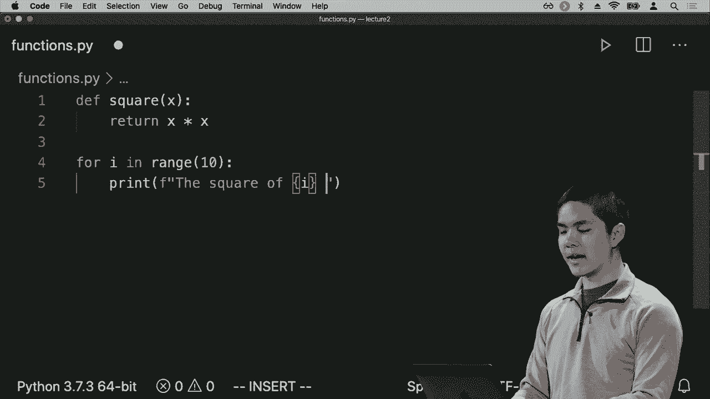

我们已经见过Python内置的许多函数，例如接收用户输入的`input`函数和打印信息的`print`函数。但更重要的是，我们可以定义自己的函数来封装特定逻辑。

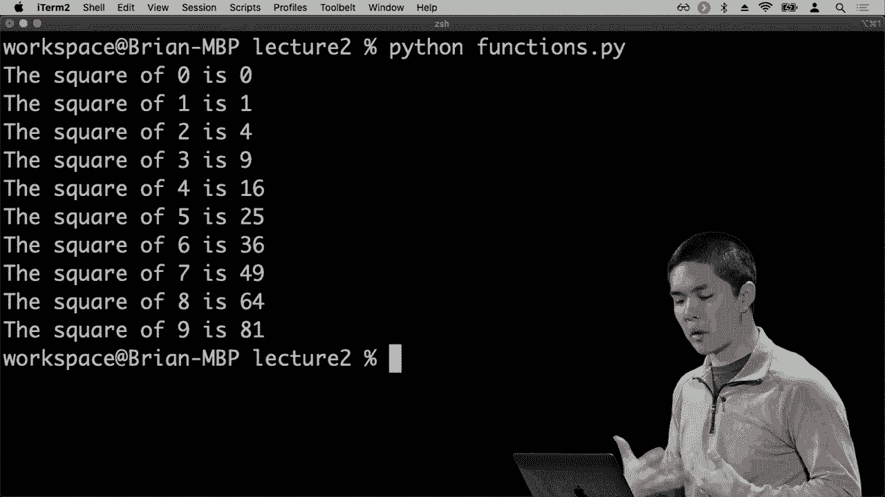

以下是定义一个简单函数的方法：

```python
def square(x):
    return x * x
```

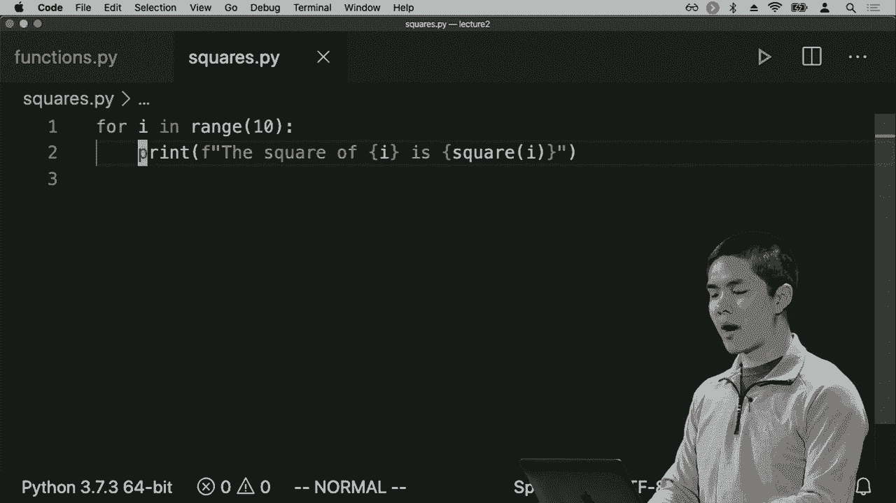

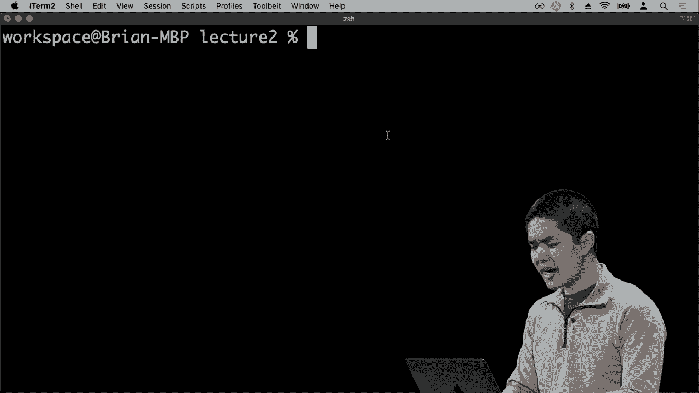

这个名为`square`的函数接收一个参数`x`，并返回它的平方值。我们可以这样使用它：

```python
for i in range(10):
    print(square(i))
```

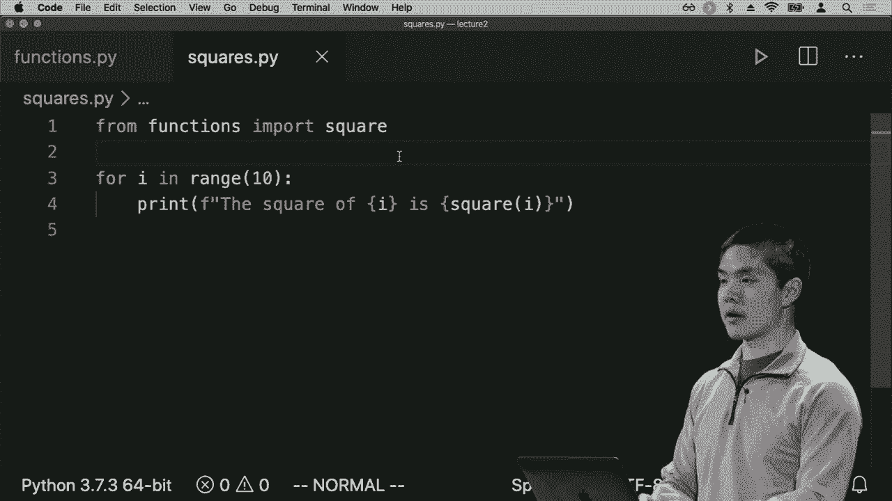

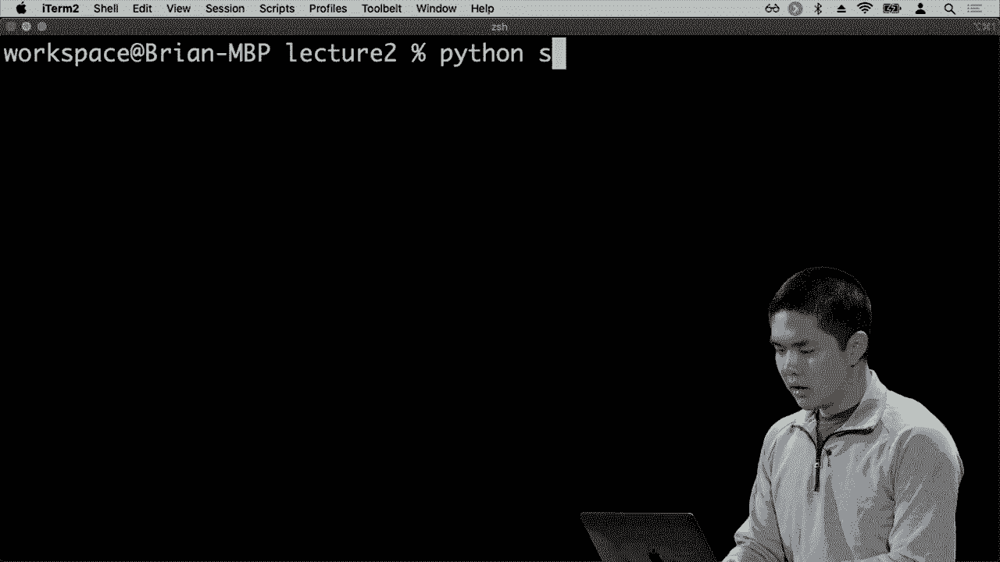

这段代码会循环10次，分别打印0到9的平方值。

## 模块与函数导入 📦

为了代码的组织和复用，我们通常将函数定义放在独立的文件中，然后在其他文件中导入使用。

假设我们在`functions.py`文件中定义了`square`函数。要在另一个文件`squares.py`中使用它，我们需要进行导入。

以下是导入函数的几种方式：

```python
# 方式一：导入整个模块
import functions
result = functions.square(5)

# 方式二：导入特定函数
from functions import square
result = square(5)
```

如果尝试使用未导入的函数，Python会抛出`NameError`异常，提示名称未定义。

Python本身也提供了许多内置模块（如`csv`、`math`）和第三方模块（如`Django`），我们可以通过相同的方式导入并使用它们的功能。

## 面向对象编程 🧱

面向对象编程是一种以“对象”为中心的编程范式。对象可以存储数据（称为属性），并定义操作这些数据的方法（即函数）。

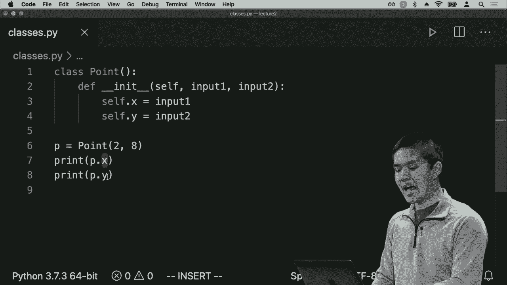

上一节我们介绍了函数和模块，本节中我们来看看如何创建和使用类。

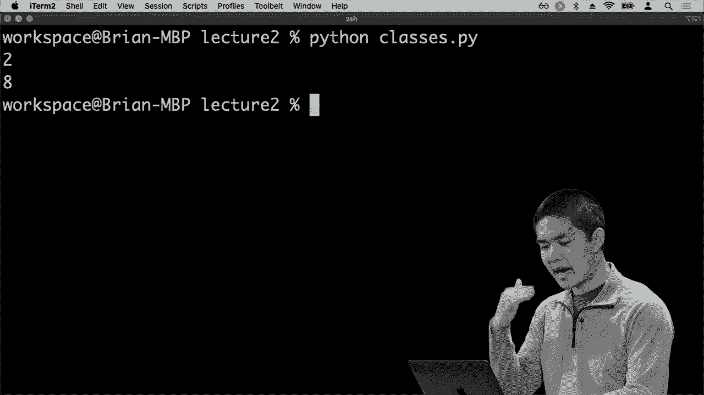

### 创建类

我们可以创建一个类来表示一种新的数据类型。例如，创建一个表示二维坐标点的类。

```python
class Point:
    def __init__(self, x, y):
        self.x = x
        self.y = y
```

*   `class Point:` 定义了一个名为`Point`的类。
*   `__init__` 是一个特殊方法（构造方法），在创建类的新实例时自动调用。
*   `self` 参数代表实例对象本身，用于访问该实例的属性和方法。
*   `self.x = x` 将传入的参数`x`的值，存储为实例的一个属性。

创建和使用`Point`对象的示例：

```python
p = Point(2, 8)
print(p.x) # 输出：2
print(p.y) # 输出：8
```

### 一个更复杂的类示例

让我们创建一个管理航班乘客的类，它包含容量限制和添加乘客的逻辑。

```python
class Flight:
    def __init__(self, capacity):
        self.capacity = capacity
        self.passengers = []

    def open_seats(self):
        return self.capacity - len(self.passengers)

    def add_passenger(self, name):
        if self.open_seats() <= 0:
            return False
        self.passengers.append(name)
        return True
```

以下是这个类的使用方法：

```python
flight = Flight(3)
people = ["Harry", "Ron", "Hermione", "Ginny"]
for person in people:
    success = flight.add_passenger(person)
    if success:
        print(f"成功添加 {person} 至航班。")
    else:
        print(f"航班已满，无法为 {person} 提供座位。")
```

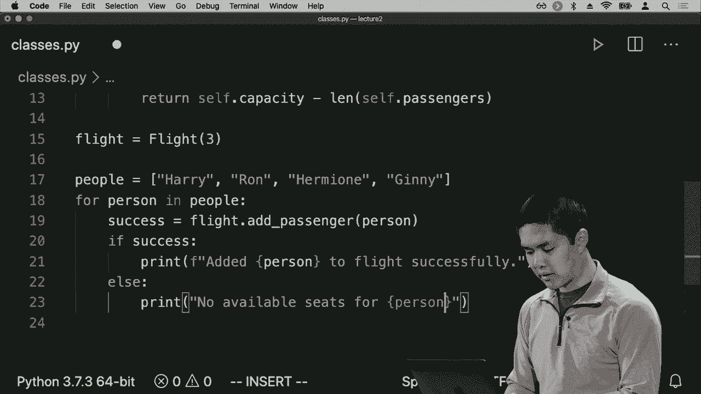

运行上述代码，前三位乘客会被成功添加，而第四位乘客会因航班容量已满而被拒绝。

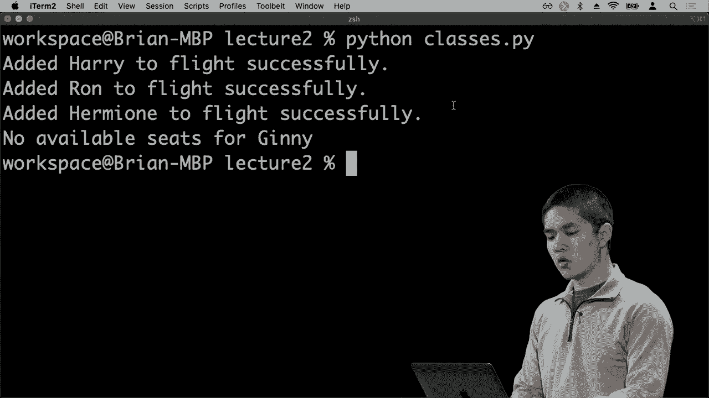

## 装饰器 ✨

装饰器是Python中一个强大的特性，它允许我们在不修改原函数代码的情况下，为函数添加额外的功能。装饰器本质上是一个接收函数作为参数并返回一个新函数的函数。

以下是一个简单的装饰器示例，它在函数执行前后打印信息：

```python
def announce(f):
    def wrapper():
        print("即将运行函数...")
        f()
        print("函数执行完毕。")
    return wrapper

@announce
def hello():
    print("Hello, world!")

hello()
```

运行`hello()`函数时，输出将是：
```
即将运行函数...
Hello, world!
函数执行完毕。
```

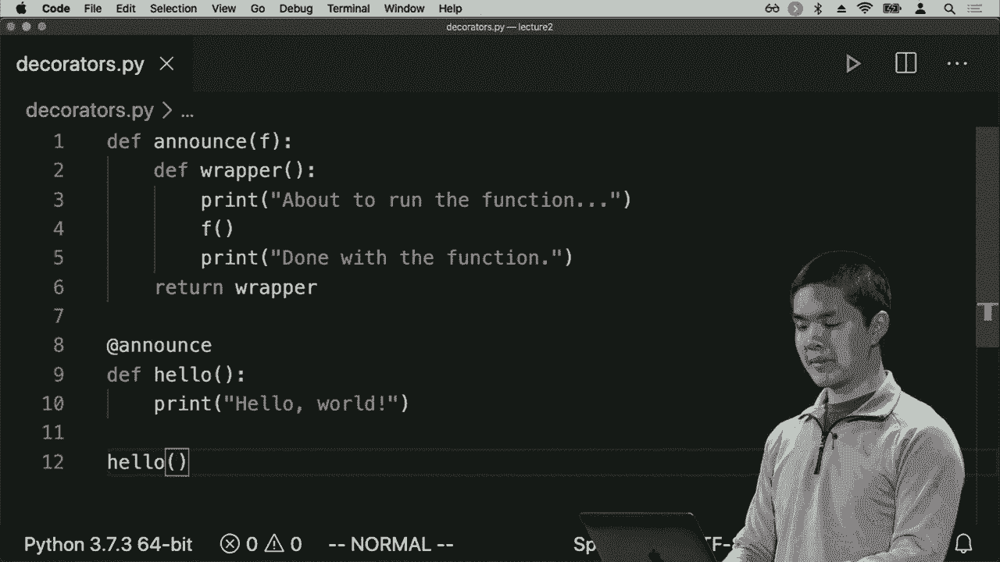

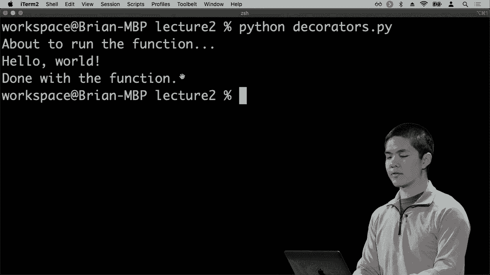

在Web开发中，装饰器常用于实现权限检查、日志记录等功能。

## Lambda表达式 λ

Lambda表达式用于创建匿名函数（即没有名字的函数），通常用于需要一个简单函数作为参数的场合。

假设我们有一个字典列表，需要按特定键进行排序：

```python
people = [
    {"name": "Harry", "house": "Gryffindor"},
    {"name": "Cho", "house": "Ravenclaw"},
    {"name": "Draco", "house": "Slytherin"}
]
```

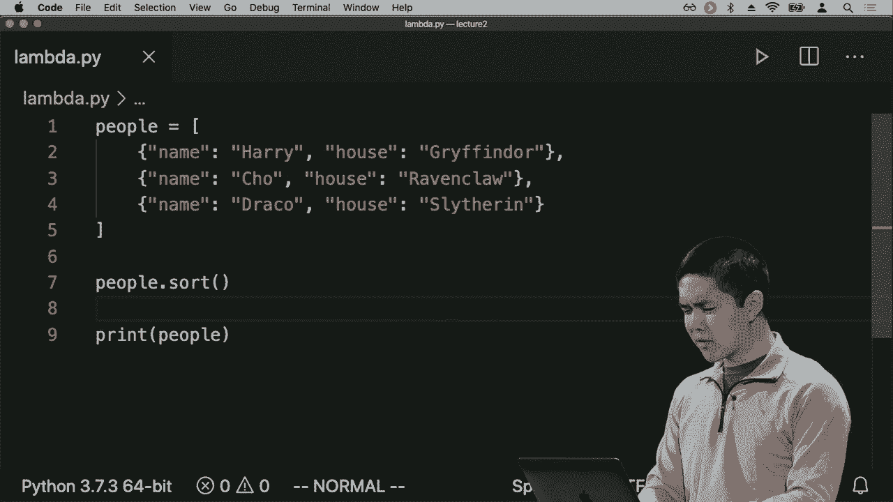

如果直接调用`people.sort()`，Python不知道如何比较这些字典。我们需要提供一个`key`函数来指定排序依据。

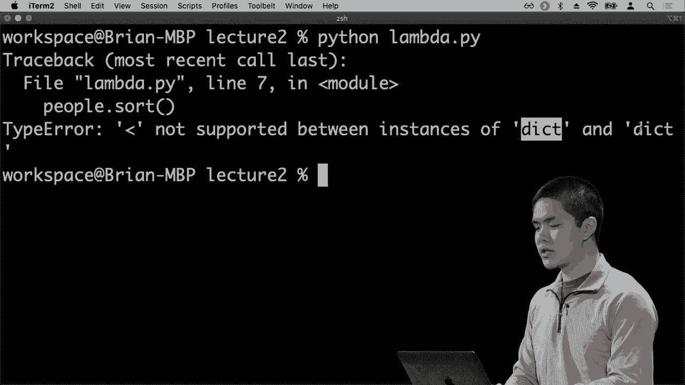

使用普通函数：

```python
def get_name(person):
    return person["name"]
people.sort(key=get_name)
```

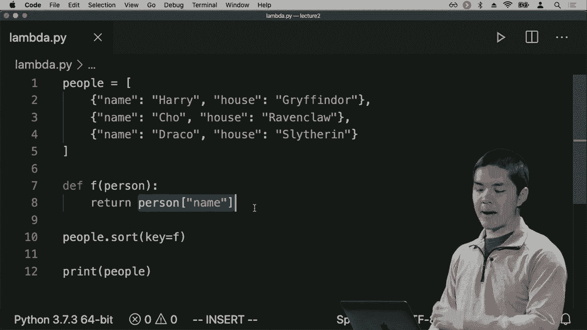

使用更简洁的Lambda表达式：

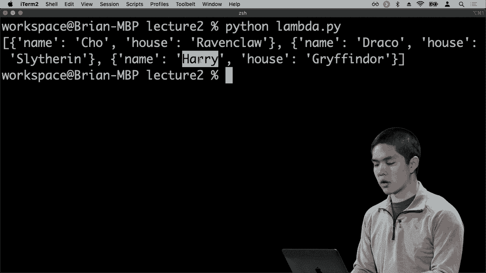

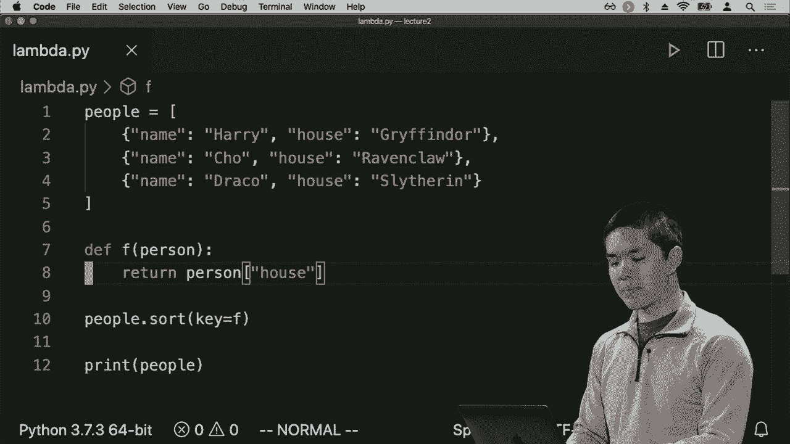

```python
people.sort(key=lambda person: person["name"])
```

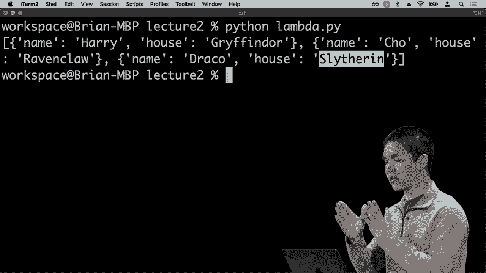

Lambda表达式`lambda person: person[“name”]`定义了一个接收`person`参数并返回`person[“name”]`的函数。

## 异常处理 🛡️

程序运行时难免会遇到错误（异常）。优雅地处理异常可以防止程序崩溃，并向用户提供清晰的反馈。

我们来看一个除法程序的例子，它可能遇到两种异常：用户输入非数字（`ValueError`）和除数为零（`ZeroDivisionError`）。

```python
import sys

try:
    x = int(input("请输入x: "))
    y = int(input("请输入y: "))
except ValueError:
    print("错误：输入无效，请输入数字。")
    sys.exit(1)

try:
    result = x / y
except ZeroDivisionError:
    print("错误：无法除以零。")
    sys.exit(1)

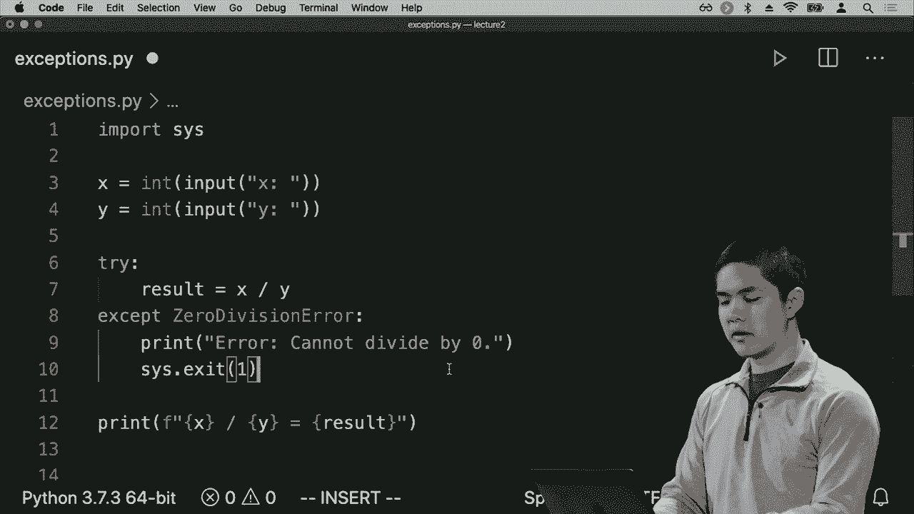

print(f"{x} 除以 {y} 等于 {result}")
```

*   `try:` 块包含可能引发异常的代码。
*   `except:` 块用于捕获并处理特定的异常。
*   `sys.exit(1)` 用于终止程序，状态码1通常表示程序因错误而退出。

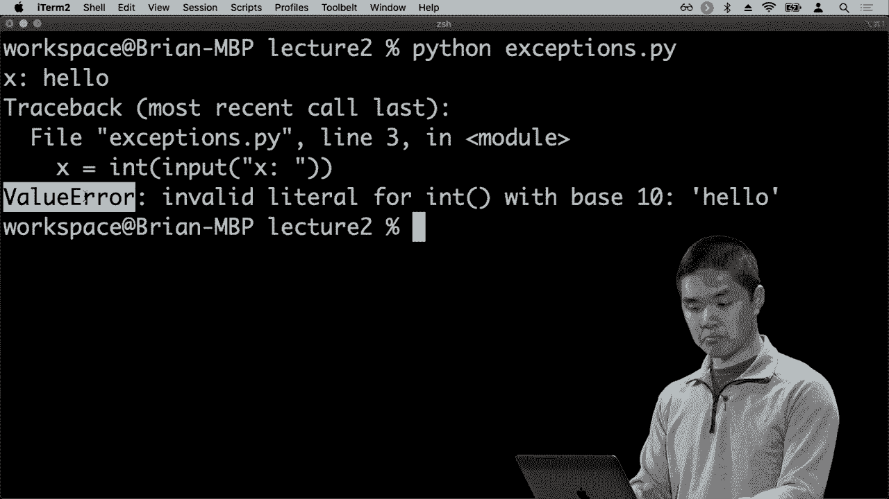

通过异常处理，我们可以引导用户提供正确的输入，并在出现数学错误时给出友好提示，而不是显示复杂的错误回溯信息。

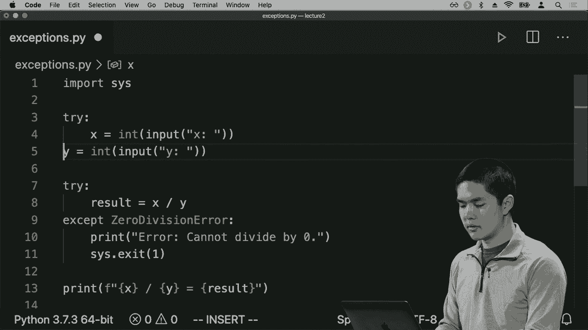

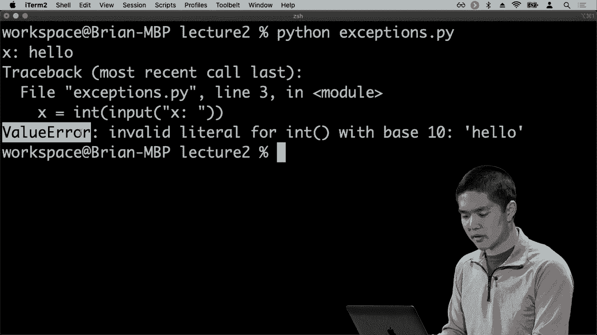

## 总结 📝

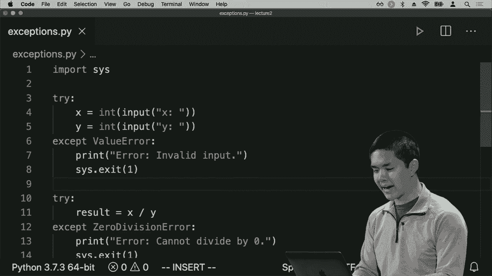

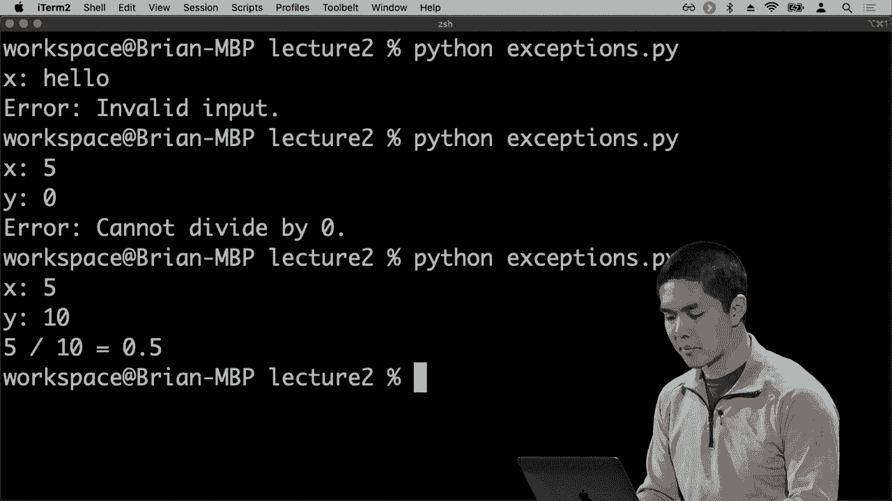

本节课中我们一起学习了Python的几个核心进阶概念。

我们掌握了如何**定义和调用函数**来封装代码逻辑，以及如何通过**模块导入**来组织和复用代码。我们深入探讨了**面向对象编程**，学会了如何创建类、定义属性和方法，从而用对象来模拟现实世界的实体。我们还了解了**装饰器**这一强大工具，它可以动态地修改函数的行为。对于简单的函数场景，我们学习了使用**Lambda表达式**来编写简洁的匿名函数。最后，我们学习了**异常处理**机制，使用`try...except`结构来优雅地捕获和处理程序运行中可能出现的错误，提升程序的健壮性。

这些概念是使用Python进行有效编程，尤其是构建复杂Web应用程序的基石。在接下来的课程中，我们将运用这些知识来开发动态的Web应用。