# 🚀 课程名称：哈佛CS50-WEB｜基于Python／JavaScript的Web编程（2020·完整版）- P9：L3- Django网络编程 1（web应用，http，路由）


## 📖 概述

在本节课中，我们将要学习如何使用Django框架构建动态Web应用。我们将从理解Web应用的基本工作原理（HTTP协议）开始，然后学习如何设置Django项目、创建应用、定义视图（View）和配置URL路由，最终实现一个能够根据用户请求动态生成内容的简单Web应用。

---

## 🌐 什么是Web应用与HTTP协议

我们已经学习了HTML和CSS，它们用于描述网页的结构和样式。我们还学习了Python，它是一种具备循环、条件、变量和函数等特性的编程语言。

今天我们要介绍Django，它将结合这两者。Django是一个Python网络框架，可以让我们编写能够动态生成HTML和CSS的Python代码，最终构建动态网络应用。

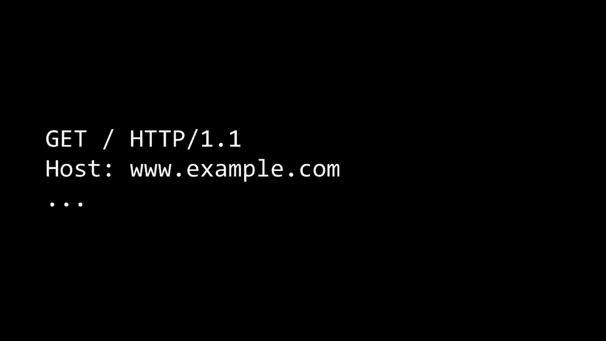

使用HTML和CSS时，我们创建的网页是静态的。每当你访问网页时，页面是相同的。但日常使用的网站（如新闻网站）内容会动态变化，这通常是由服务器上的程序（如用Python编写）动态生成HTML和CSS实现的。

Web应用运行在网络服务器上。客户端（如浏览器）向服务器发出请求，服务器处理请求并返回响应。这个过程基于**HTTP协议**（超文本传输协议）。

你可以将这个过程理解为客户端与服务器之间的请求-响应关系。

一个HTTP请求可能如下所示：
```
GET / HTTP/1.1
Host: www.example.com
```

*   `GET` 是请求方法，表示希望获取资源。
*   `/` 表示请求网站的根目录。
*   `HTTP/1.1` 是协议版本。
*   `Host` 指定了要访问的网站地址。

服务器处理该请求后，会返回一个HTTP响应，通常如下：
```
HTTP/1.1 200 OK
Content-Type: text/html


<!DOCTYPE html><html>...</html>
```

*   `HTTP/1.1 200 OK` 中，`200` 是状态码，表示请求成功。
*   `Content-Type: text/html` 表示返回的内容是HTML格式，浏览器应将其渲染为网页。

常见的HTTP状态码包括：
*   **200**：成功。
*   **404**：未找到（请求的资源不存在）。
*   **301**：永久移动（重定向）。
*   **403**：禁止访问（没有权限）。
*   **500**：内部服务器错误（服务器端程序出错）。

---

## 🛠️ 开始使用Django

Django是一个Web框架，它预先构建了一系列工具，使我们能够专注于应用逻辑，而无需处理通用功能。

### 安装Django

使用Python的包管理器pip进行安装：
```bash
pip3 install Django
```

### 创建Django项目

安装完成后，可以运行以下命令创建一个新的Django项目：
```bash
django-admin startproject lecture3
```
此命令会创建一个名为 `lecture3` 的目录，其中包含Django项目的初始文件。

重要的初始文件有：
*   `manage.py`：一个命令行工具，用于管理Django项目（如运行服务器）。
*   `settings.py`：项目的配置文件。
*   `urls.py`：项目的URL声明文件，就像是网站的“目录”。

### 运行开发服务器

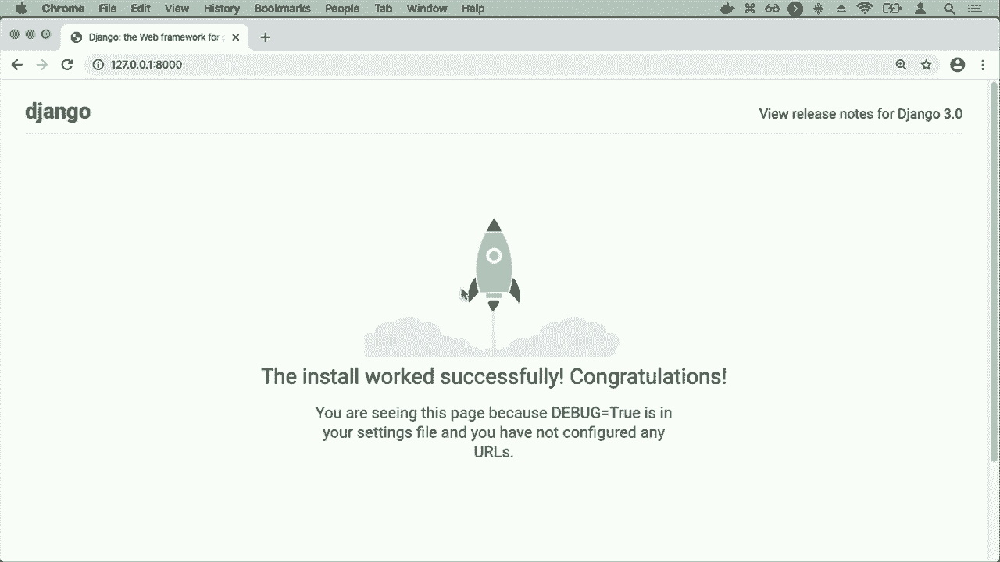

进入项目目录，运行以下命令启动开发服务器：
```bash
python manage.py runserver
```
服务器启动后，通常会提示在 `http://127.0.0.1:8000` 运行。在浏览器中访问此地址，可以看到Django的默认欢迎页面，这证明安装成功。

---

## 📁 Django项目与应用

一个Django**项目**（Project）可以包含多个**应用**（App）。这种划分有助于组织大型网站的各个功能模块（例如，一个电商项目可能包含用户、商品、订单等多个应用）。

### 创建Django应用

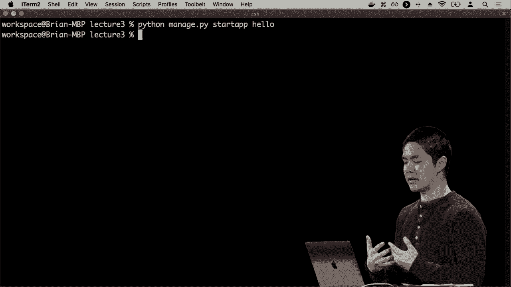

在项目目录下，运行以下命令创建一个新的应用：
```bash
python manage.py startapp hello
```
这将在项目中创建一个名为 `hello` 的目录，其中包含该应用的文件。

### 安装应用

创建应用后，需要将其添加到项目的配置中。编辑 `lecture3/settings.py` 文件，找到 `INSTALLED_APPS` 列表，添加应用名称：
```python
INSTALLED_APPS = [
    ...
    'hello',
]
```

---

## 🎯 创建视图（View）与配置URL

视图是用户访问特定URL时，服务器返回内容的处理函数。

### 编写第一个视图

打开 `hello/views.py` 文件。我们将创建一个简单的视图函数，返回“Hello World”响应。

首先，需要从Django导入 `HttpResponse` 类：
```python
from django.http import HttpResponse
```

然后，定义一个视图函数。按惯例，它接受一个 `request` 参数（代表用户的HTTP请求）：
```python
def index(request):
    return HttpResponse("Hello, world!")
```

### 配置应用级URL

接下来，需要告诉Django：当用户访问某个URL时，应该调用哪个视图函数。为此，我们在 `hello` 应用目录下创建一个 `urls.py` 文件。

在 `hello/urls.py` 中，我们定义URL模式：
```python
from django.urls import path
from . import views

urlpatterns = [
    path('', views.index, name='index'),
]
```
*   `path('', ...)` 中的空字符串 `''` 表示这是该应用的默认（根）URL。
*   `views.index` 指定当访问此URL时，应调用 `views.py` 中的 `index` 函数。
*   `name='index'` 给这个URL模式起个名字，便于在其他地方引用。

### 配置项目级URL

最后，需要将应用的URL配置包含到项目的总URL配置中。编辑 `lecture3/urls.py` 文件：
```python
from django.contrib import admin
from django.urls import path, include

urlpatterns = [
    path('admin/', admin.site.urls),
    path('hello/', include('hello.urls')),
]
```
*   `path('hello/', include('hello.urls'))` 表示：所有以 `hello/` 开头的URL，都交给 `hello` 应用下的 `urls.py` 文件去处理。

### 查看结果

1.  确保开发服务器正在运行 (`python manage.py runserver`)。
2.  在浏览器中访问 `http://127.0.0.1:8000/hello/`。
3.  你将看到页面上显示 **“Hello, world!”**。

---

## 🔗 创建更多视图与URL

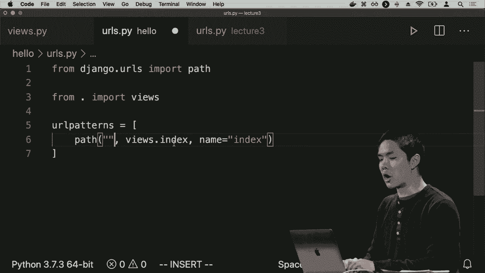

我们可以轻松地添加更多视图和URL。

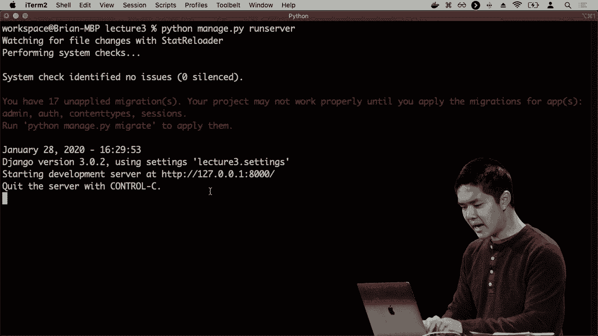

在 `views.py` 中添加新函数：
```python
def brian(request):
    return HttpResponse("Hello, Brian!")

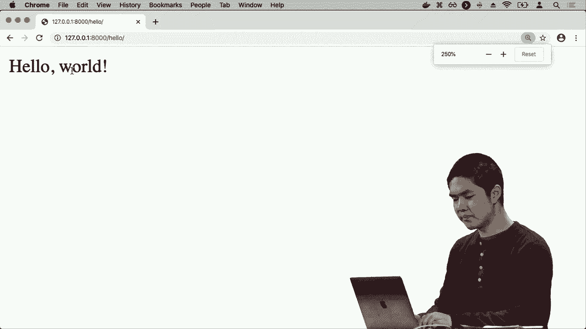

def david(request):
    return HttpResponse("Hello, David!")
```

在 `hello/urls.py` 中添加对应的URL模式：
```python
urlpatterns = [
    path('', views.index, name='index'),
    path('brian/', views.brian, name='brian'),
    path('david/', views.david, name='david'),
]
```
现在，访问 `http://127.0.0.1:8000/hello/brian/` 和 `http://127.0.0.1:8000/hello/david/` 将看到不同的问候语。

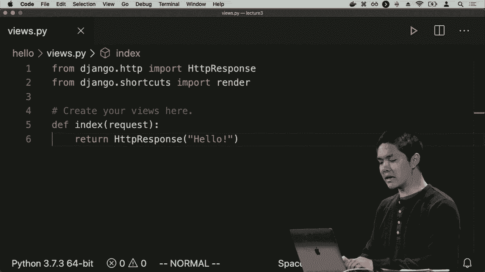

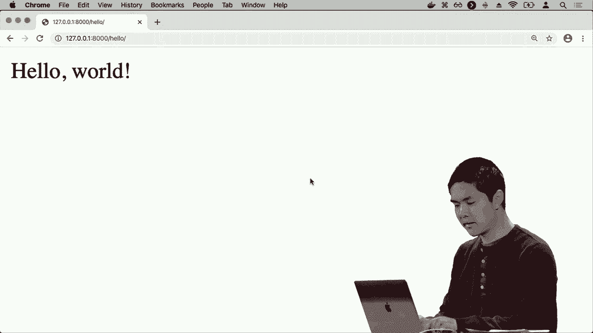

---

## 🧩 使用URL参数实现动态路由

为每个名字都创建一个视图和URL是不现实的。我们可以使用**URL参数**来创建动态路由。

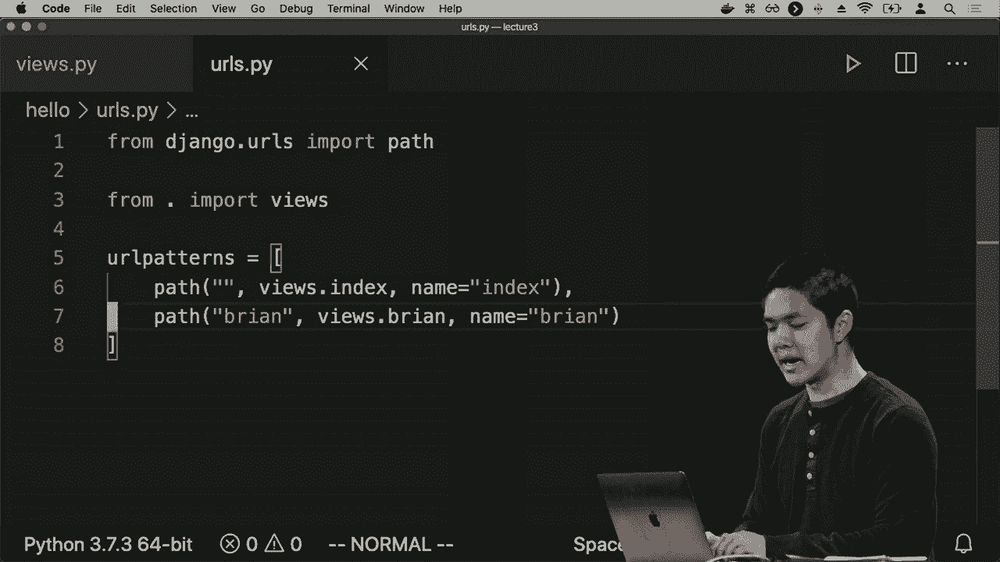

### 创建带参数的视图

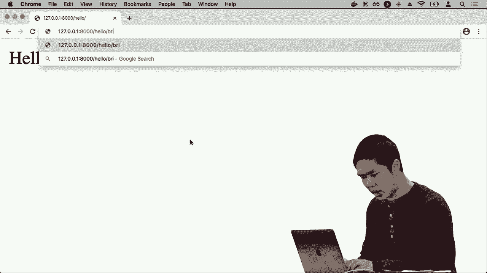

在 `views.py` 中创建一个新视图，它接受一个额外的 `name` 参数：
```python
def greet(request, name):
    return HttpResponse(f"Hello, {name.capitalize()}!")
```

### 配置带参数的URL模式

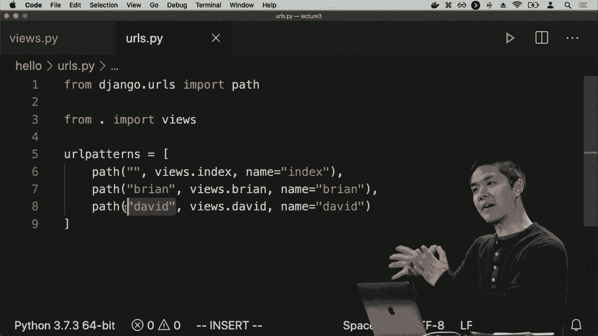

在 `hello/urls.py` 中，使用尖括号 `< >` 定义参数：
```python
urlpatterns = [
    ... # 其他路径
    path('<str:name>/', views.greet, name='greet'),
]
```
*   `<str:name>` 表示：匹配此位置的任意字符串，并将其作为名为 `name` 的参数传递给视图函数。
*   `str` 是路径转换器，确保参数是字符串类型。

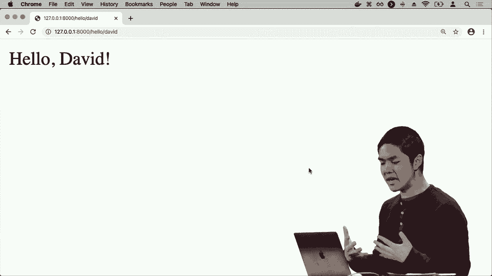

现在，访问 `http://127.0.0.1:8000/hello/alice/`、`http://127.0.0.1:8000/hello/bob/` 等任意路径，视图函数都会接收对应的 `name` 值，并动态生成问候语。

---

## 📝 使用模板（Template）分离HTML与Python代码

将大量HTML代码直接写在Python字符串中会很混乱，且不利于协作。Django使用**模板**来分离表现层（HTML）和业务逻辑（Python）。

### 修改视图以渲染模板

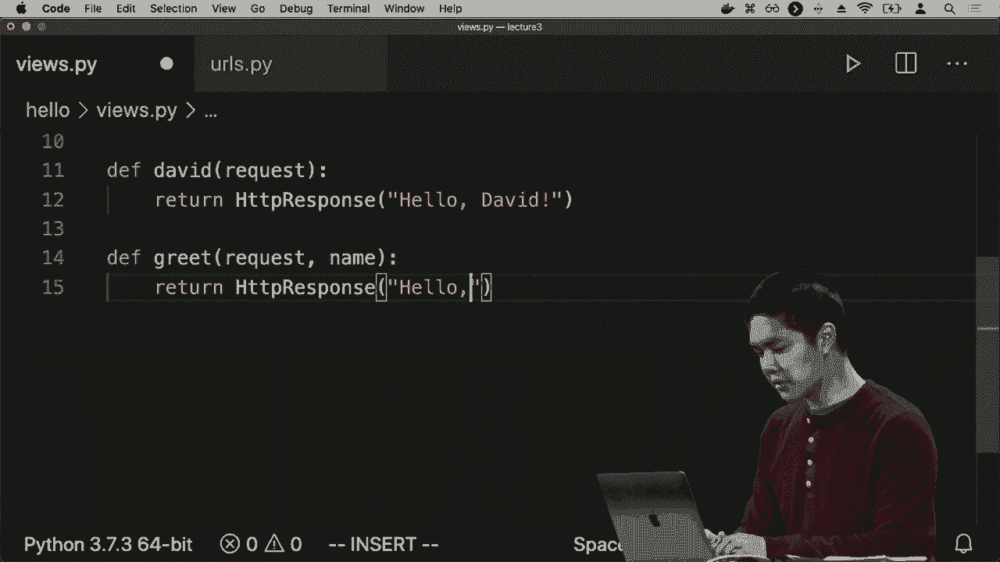

首先，修改 `views.py` 中的 `index` 视图，使用 `render` 函数：
```python
from django.shortcuts import render

def index(request):
    return render(request, "hello/index.html")
```
`render` 函数接收请求对象和模板名称，它会找到并渲染指定的HTML模板文件。

### 创建模板文件

1.  在 `hello` 应用目录下，创建一个名为 `templates` 的文件夹。
2.  在 `templates` 文件夹内，再创建一个与应用同名的文件夹 `hello`（这是Django的推荐做法，避免模板名称冲突）。
3.  在 `hello/templates/hello/` 目录下，创建文件 `index.html`。

在 `index.html` 中编写简单的HTML：
```html
<!DOCTYPE html>
<html>
<head>
    <title>Greetings</title>
</head>
<body>
    <h1>Welcome to the Hello App!</h1>
</body>
</html>
```

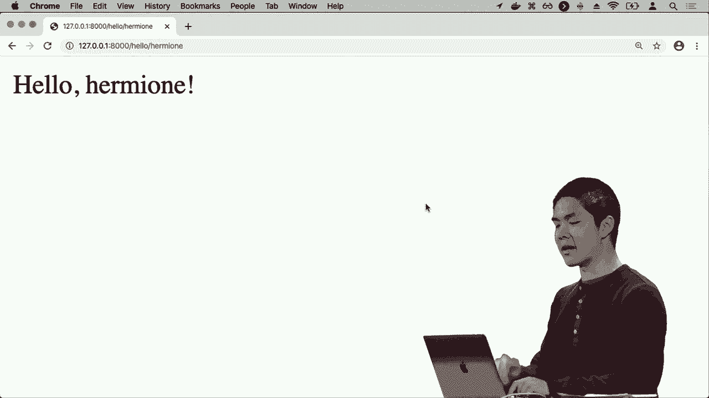

现在，当访问 `http://127.0.0.1:8000/hello/` 时，Django将渲染并返回这个 `index.html` 文件的内容。

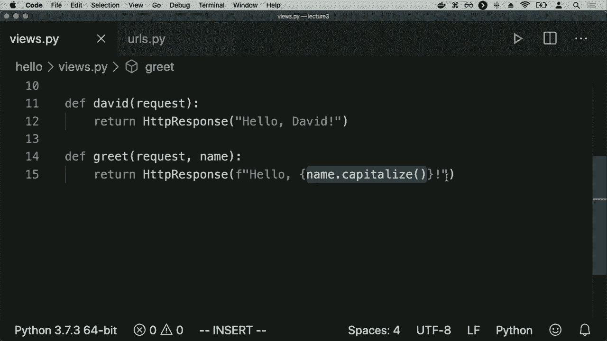

我们将在后续课程中深入学习如何在模板中动态插入数据。

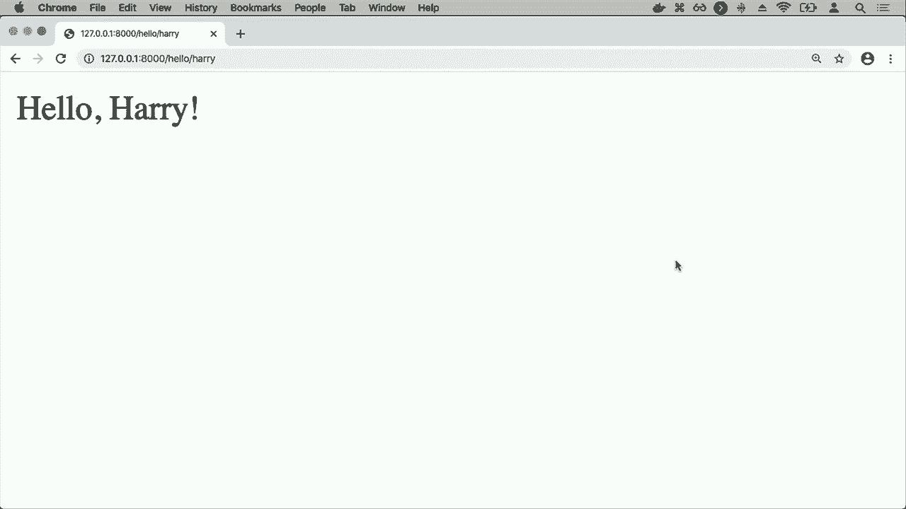

---

## 🎓 总结

本节课中我们一起学习了Web应用的基础和Django框架的入门知识。

我们了解了客户端与服务器通过HTTP协议进行通信的请求-响应模型。我们学会了如何安装Django、创建项目和应用程序。我们掌握了视图（View）的概念，并学会了如何编写视图函数来生成HTTP响应。我们深入学习了URL配置，包括如何将URL映射到特定的视图，以及如何使用参数创建动态路由。最后，我们接触了模板的概念，了解了如何将HTML代码与Python逻辑分离，以构建更清晰、更易维护的Web应用。

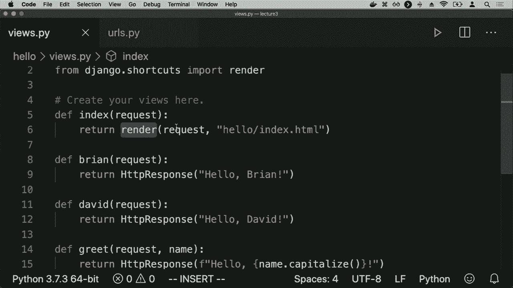

这些是构建任何Django Web应用的基石。在接下来的课程中，我们将在此基础上，学习如何处理表单、使用数据库以及构建更复杂的应用逻辑。