# 哈佛 CS50-WEB 10：L3- Django网络编程 2 (模板) 🧩

## 概述

在本节课中，我们将学习Django模板系统。我们将了解如何创建和使用HTML模板，如何在模板中插入变量，以及如何使用条件语句和循环来动态生成页面内容。通过构建一个简单的待办事项列表应用，我们将实践这些核心概念。

---

## 创建与应用关联的模板目录

上一节我们介绍了Django的基本视图和URL配置，本节中我们来看看如何创建和使用模板。

首先，需要在应用目录内创建一个名为 `templates` 的文件夹。为了给模板命名空间，避免不同应用间的模板文件冲突，最佳实践是在 `templates` 文件夹内再创建一个与应用同名的子文件夹。

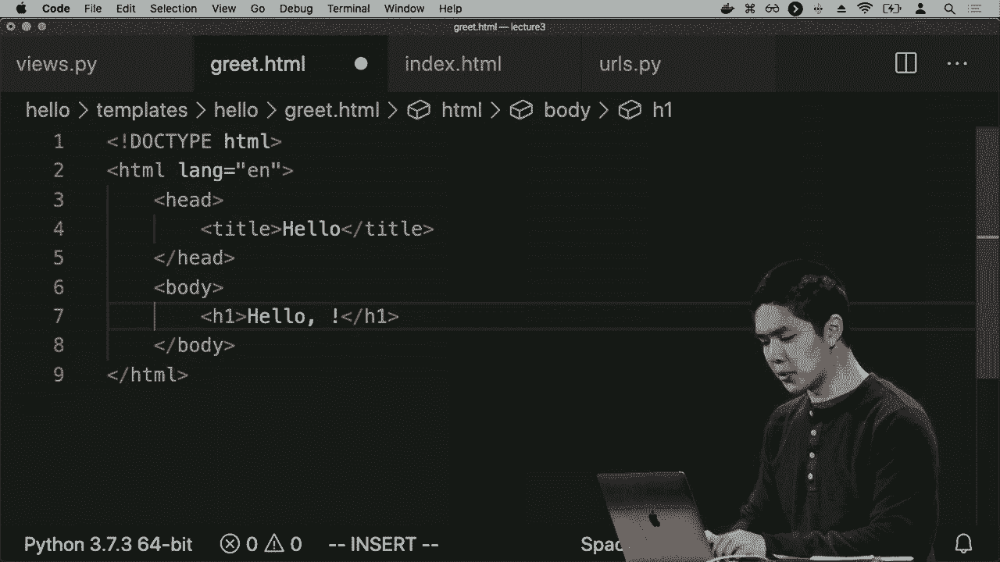

以下是创建模板目录的步骤：
1.  在 `hello` 应用目录内创建 `templates` 文件夹。
2.  在 `templates` 文件夹内创建 `hello` 文件夹。
3.  在 `hello` 文件夹内创建 `index.html` 文件。

在 `index.html` 文件中，可以编写标准的HTML代码。例如，可以创建一个显示“你好，世界”的页面。

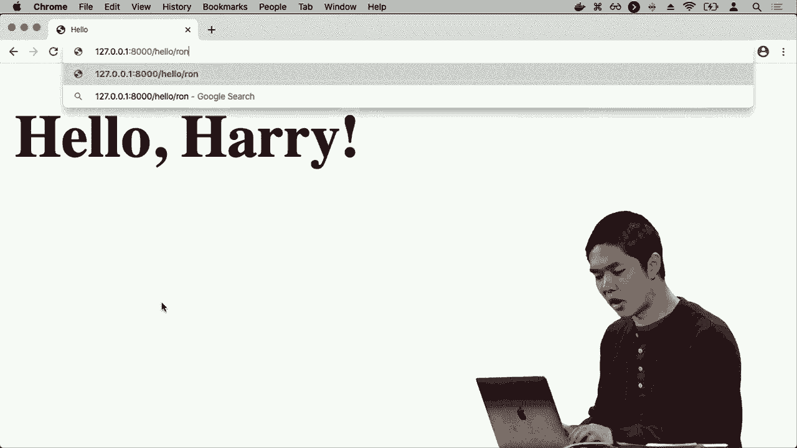

```html
<!DOCTYPE html>
<html lang="en">
<head>
    <meta charset="UTF-8">
    <title>Hello</title>
</head>
<body>
    <h1>你好，世界</h1>
</body>
</html>
```

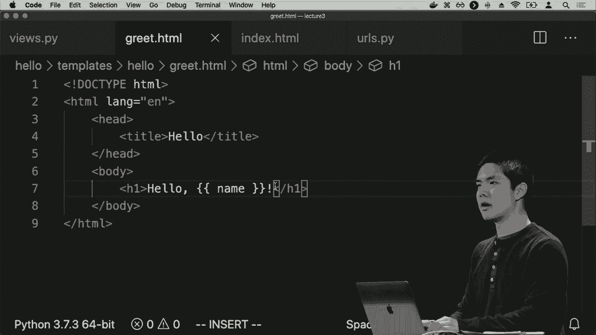

配置好视图函数返回此模板后，访问 `/hello` 路由即可看到渲染后的HTML页面。

---

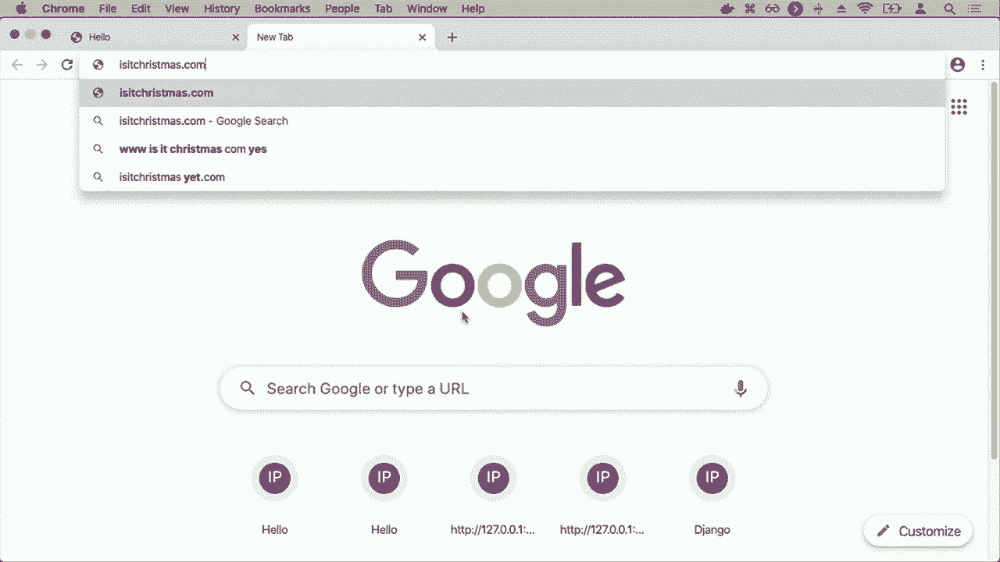

## 在模板中使用变量

静态HTML页面无法动态显示内容。Django模板语言允许我们将变量插入到HTML中，实现页面内容的动态化。

假设我们想实现一个路由 `/hello/<name>`，根据URL中的名字显示个性化的问候。这需要修改视图函数和创建新的模板。

首先，修改 `views.py` 中的 `greet` 函数，使用 `render` 函数并传递上下文（context）。

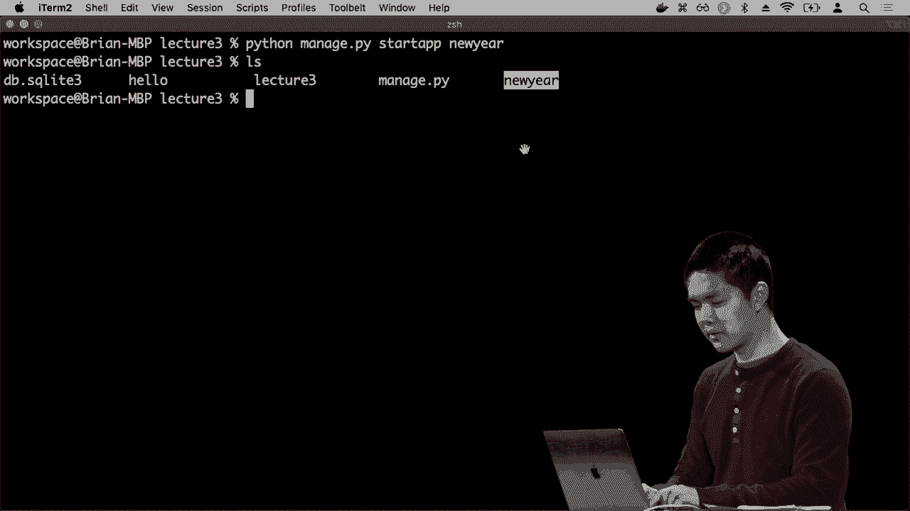

```python
# hello/views.py
from django.shortcuts import render

def greet(request, name):
    # 将名字的首字母大写后传递给模板
    return render(request, "hello/greet.html", {
        "name": name.capitalize()
    })
```

`render` 函数的第三个参数 `context` 是一个字典，它定义了模板可以访问的变量。这里，键 `"name"` 对应的值是经过 `capitalize()` 处理后的名字。

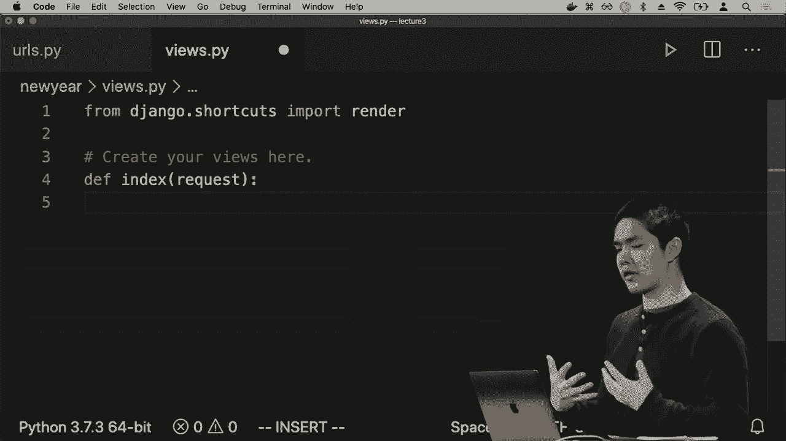

接下来，创建对应的模板文件 `templates/hello/greet.html`。在模板中，使用双大括号 `{{ }}` 来插入变量的值。

```html
<!DOCTYPE html>
<html lang="en">
<head>
    <meta charset="UTF-8">
    <title>Greet</title>
</head>
<body>
    <h1>你好，{{ name }}</h1>
</body>
</html>
```

当访问 `/hello/Harry` 时，Django会调用 `greet` 视图，将 `"Harry"` 处理为 `"Harry"` 并传递给 `greet.html` 模板。模板中的 `{{ name }}` 会被替换为 `"Harry"`，最终页面上显示“你好，Harry”。

这种设计实现了关注点分离：`urls.py` 负责路由，`views.py` 负责业务逻辑和选择模板，HTML模板文件负责页面展示。

---

## 在模板中使用条件逻辑

Django模板语言不仅支持变量，还支持条件判断等逻辑控制，这让我们能创建更智能的页面。

我们将创建一个新的应用 `newyear`，用于判断当天是否是1月1日（新年）。这个应用将演示如何在模板中使用 `if` 条件语句。

首先，创建新应用并完成基本配置（添加到 `INSTALLED_APPS`，配置项目级 `urls.py`，创建应用级 `urls.py`）。

在 `newyear/views.py` 中，编写 `index` 视图函数。我们需要获取当前日期，并判断是否为1月1日。

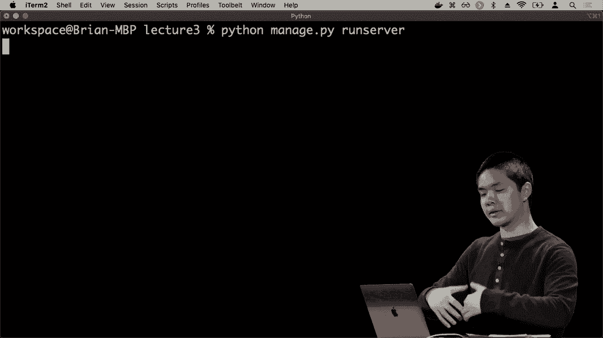

```python
# newyear/views.py
from django.shortcuts import render
import datetime

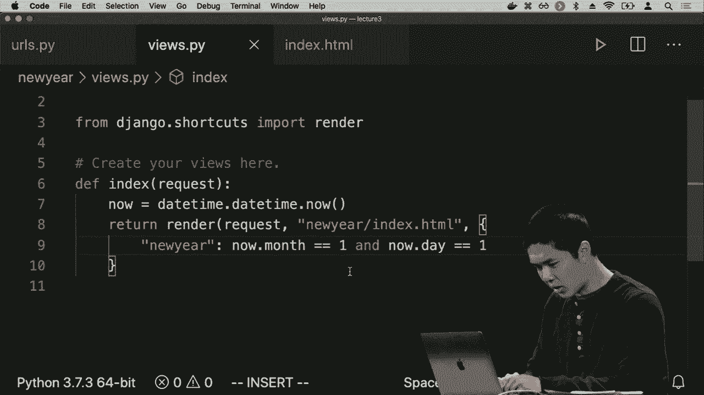

def index(request):
    now = datetime.datetime.now()
    # 判断月份和日期是否都为1
    is_new_year = (now.month == 1 and now.day == 1)
    return render(request, "newyear/index.html", {
        "newyear": is_new_year
    })
```

视图函数将布尔值 `is_new_year` 以 `"newyear"` 为键传递给模板。

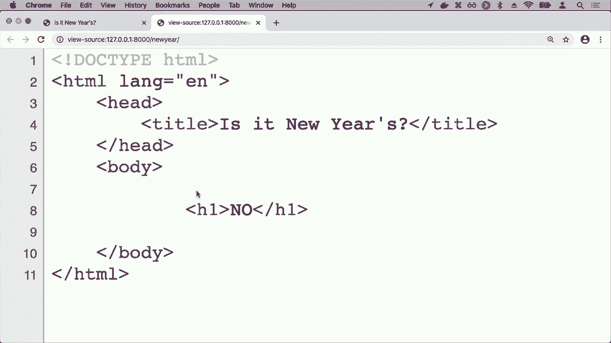

然后，创建模板文件 `templates/newyear/index.html`。在Django模板中，使用 `` 标签来包裹逻辑语句，如 `if` 条件判断。

```html
<!DOCTYPE html>
<html lang="en">
<head>
    <meta charset="UTF-8">
    <title>Is it New Year?</title>
</head>
<body>
    
        <h1>是</h1>
    
        <h1>没有</h1>
    
</body>
</html>
```

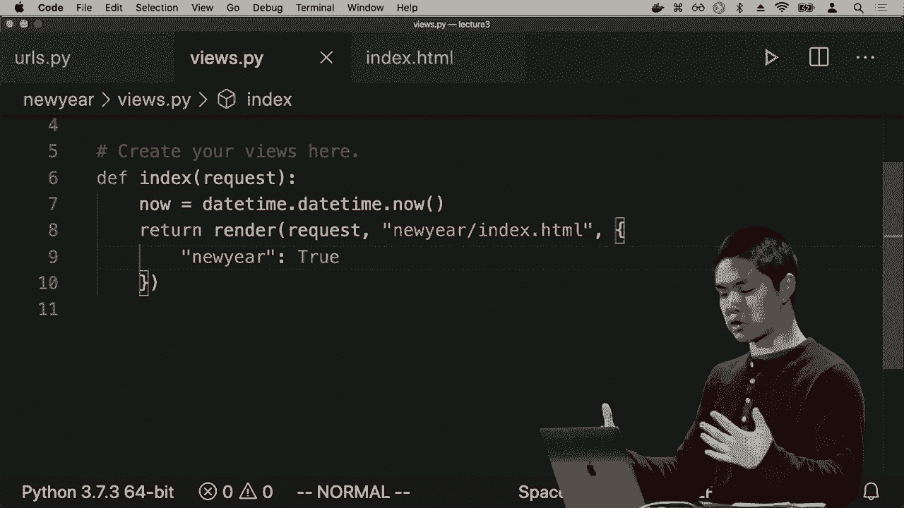

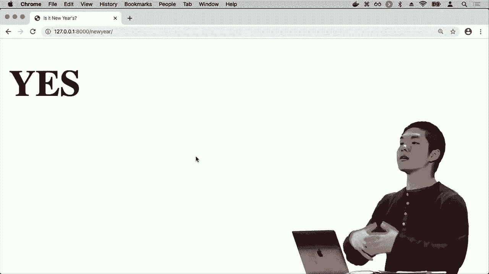

模板会根据 `newyear` 变量的值（True 或 False）来决定渲染“是”还是“没有”。用户最终在浏览器中看到的只是渲染结果，而看不到背后的模板逻辑。

---

## 加载静态文件（CSS）

为了使页面更美观，我们需要添加CSS样式。在Django中，不经常变化的文件（如CSS、JavaScript、图片）被称为“静态文件”。

Django提供了专门的方式来管理和加载静态文件。首先，在应用目录下创建 `static` 文件夹，并遵循类似的命名空间约定，在里面创建与应用同名的子文件夹。

以下是添加CSS的步骤：
1.  在 `newyear` 应用内创建 `static/newyear` 文件夹。
2.  在 `static/newyear` 文件夹内创建 `styles.css` 文件。
3.  在 `styles.css` 中编写样式。

```css
/* static/newyear/styles.css */
h1 {
    font-family: sans-serif;
    font-size: 90px;
    text-align: center;
}
```

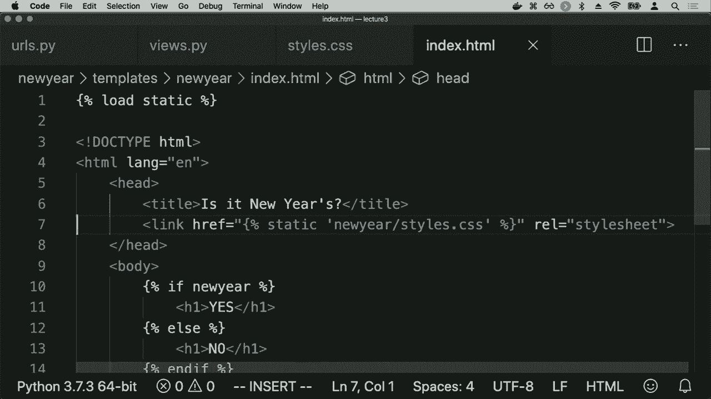

接下来，需要在模板中加载这个CSS文件。在模板文件顶部，首先使用 `` 标签加载静态文件模块。然后，使用 `` 模板标签来生成静态文件的正确URL。

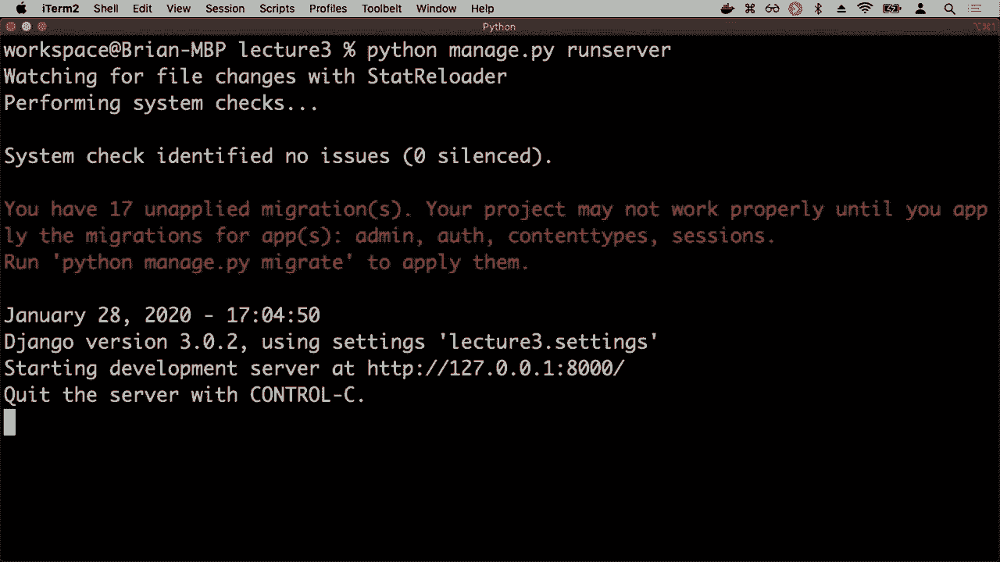

```html
<!DOCTYPE html>
<html lang="en">
<head>
    <meta charset="UTF-8">
    <title>Is it New Year?</title>
    
    <link rel="stylesheet" href="">
</head>
<body>
    
        <h1>是</h1>
    
        <h1>没有</h1>
    
</body>
</html>
```

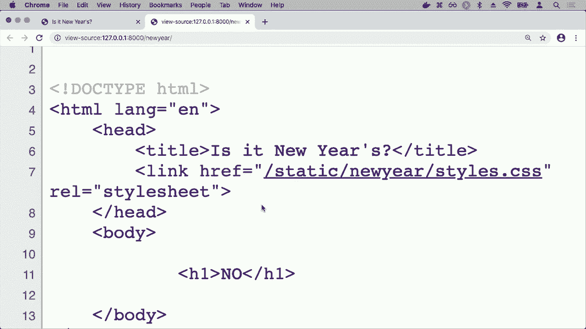

`` 会被Django替换为实际的静态文件URL（如 `/static/newyear/styles.css`）。这种方式比硬编码URL更灵活，便于后续维护和部署优化。

---

## 在模板中使用循环

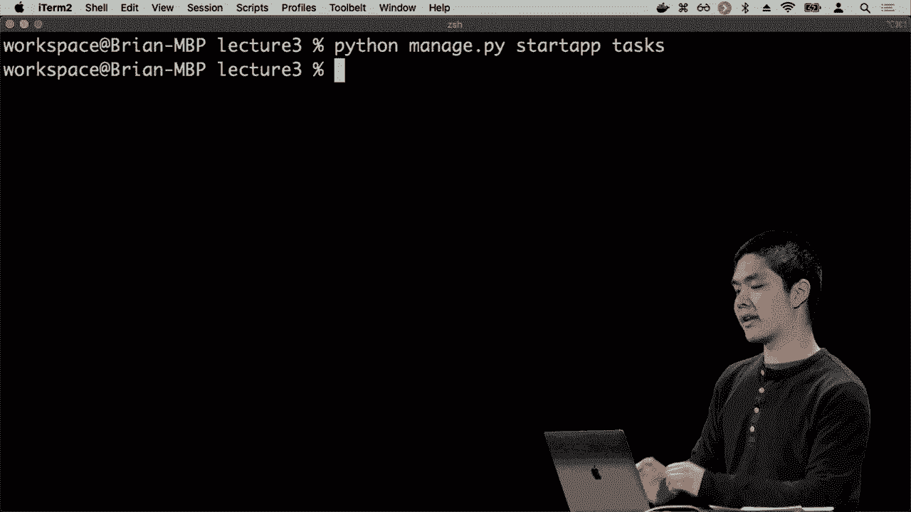

我们将创建一个更复杂的任务管理应用 `tasks`，来演示如何在模板中使用 `for` 循环动态生成列表内容。

首先，创建 `tasks` 应用并完成基本配置。在 `tasks/views.py` 中，我们暂时用一个全局列表变量来存储任务，并在视图中将其传递给模板。

```python
# tasks/views.py
from django.shortcuts import render

# 模拟的任务列表
tasks = ["foo", "bar", "baz"]

def index(request):
    return render(request, "tasks/index.html", {
        "tasks": tasks
    })
```

然后，创建模板文件 `templates/tasks/index.html`。在模板中，使用 `` 标签来遍历任务列表。

```html
<!DOCTYPE html>
<html lang="en">
<head>
    <meta charset="UTF-8">
    <title>Tasks</title>
</head>
<body>
    <ul>
        
            <li>{{ task }}</li>
        
    </ul>
</body>
</html>
```

`` 会遍历上下文中的 `tasks` 列表。对于列表中的每个元素，将其值插入到 `<li>` 标签中。`` 标记了循环的结束。

访问 `/tasks` 路由，页面上会动态生成一个包含“foo”、“bar”、“baz”三个项目的无序列表。通过查看页面源代码，可以看到Django已经将循环逻辑转换成了具体的HTML列表项。

---

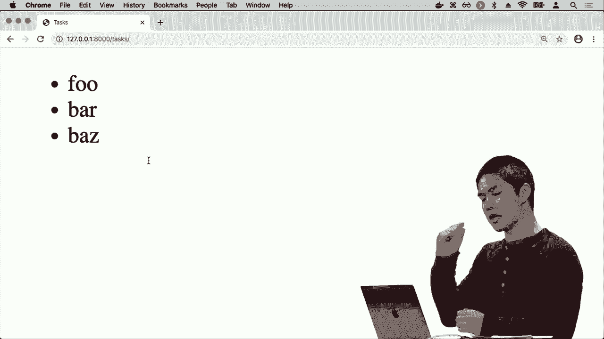

## 总结

本节课中我们一起学习了Django模板系统的核心功能。我们掌握了如何创建和组织模板文件，如何使用 `{{ variable }}` 在模板中插入变量，以及如何使用 `` 和 `` 标签进行条件判断和循环迭代来动态生成内容。此外，我们还学习了如何使用 `` 标签来正确加载CSS等静态文件。通过这些工具，我们可以将业务逻辑（Python视图）与页面展示（HTML模板）清晰地分离开，构建出动态且结构清晰的Web应用程序。