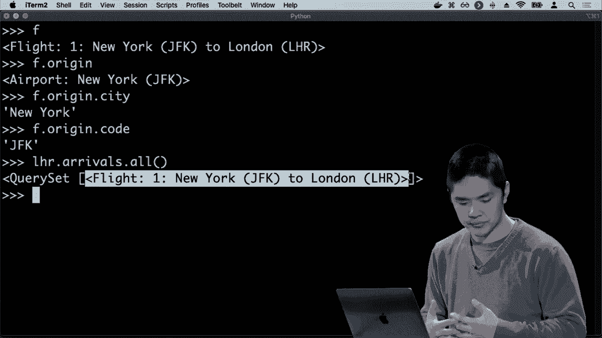
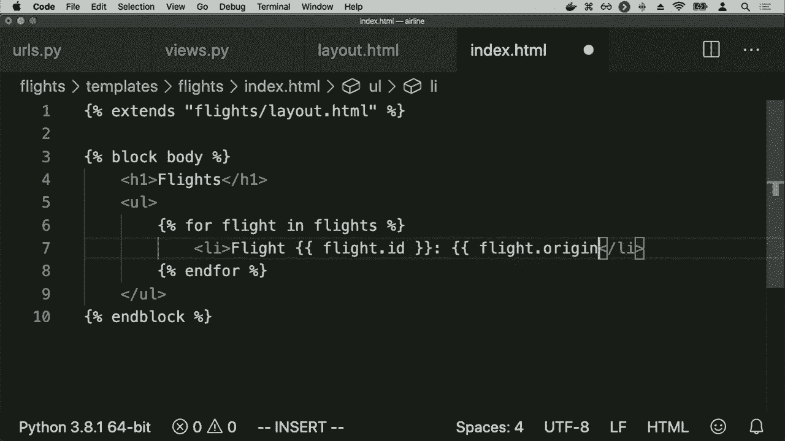
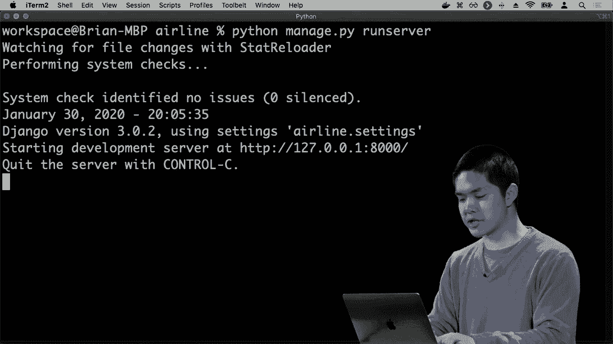
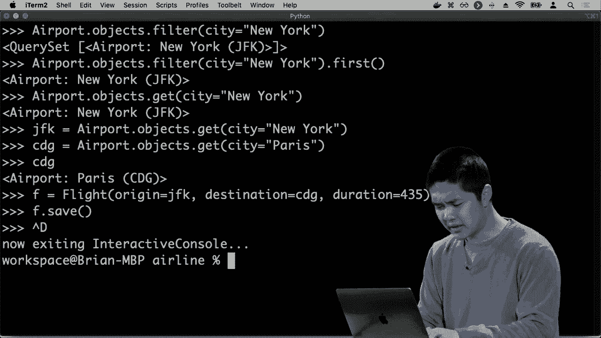

# 哈佛 CS50-WEB 13：L4- 数据库、SQL与集成 2 (表关联，django模型，集成) 🗄️➡️🔗

在本节课中，我们将要学习数据库的核心概念——表关联，并了解如何在Django框架中使用模型来优雅地管理这些关系，最终将它们集成到我们的Web应用中。

---

## 表关联与外键 🔗

上一节我们介绍了数据库和SQL的基本操作。本节中我们来看看当数据分布在多个表中时，它们如何相互关联。

数据中我们有多个数据表，这些表可能以某种方式相互关联。让我们看一个示例，看看这可能是如何产生的。我们将介绍一个概念，称之为**外键**。

这里再次是我们的航班表，它包含四列：ID、起点、目的地和持续时间。但是在纽约，当然有多个机场。因此，仅仅通过城市名称标记每个起点或目的地可能没有意义。可能我还想提供三个字母的机场代码。

那么我该如何在这个表中编码，不仅是起点，还有那个城市的机场代码，以及目的地城市的名称，还有那个机场的代码呢？

我可以添加更多的列。现在我们有这个表，包含一个ID、一个起点、起点代码、一个目的地、目的地代码和一个持续时间。但这个表开始变得相当宽，有很多列，尤其是我重复了一些冗余数据。这个数据的结构中存在一些混乱。

因此，当我们开始处理数据和越来越大的数据集，拥有越来越多的列时，我们通常会想要**规范化**这些数据，将它们分隔到多个不同的表中，这些表以某种方式相互引用。

所以与其仅仅有一个航班表，我们可能考虑的是，航班是一种对象，但还有另一种我关心的对象——机场。所以我可能只会有一个单独的机场表。

这个表有三列：一列是机场的ID（一个唯一数字可以识别特定机场），一列是那个机场的三个字母代码，还有一列是城市名称。

现在这是一个更加直接、简单的所有机场的表示。问题变成了我的航班表会发生什么？我的航班表在这里有一个ID、起点、目的地和持续时间，而起点和目的地的类型仅仅是文本数据。

现在我有了这个单独的机场表，其中每一行都有其独特的ID。那么在这种情况下，我可以做的是，避免存储冗余数据。我可以存储我们称之为**外键**的内容，即对另一个表中键的引用。

我将这些列重命名为出发地ID和目的地ID。而不是存储文本，而是存储一个数字。其中出发地ID 1意味着航班1的出发地是机场1。我可以查找机场表，找出哪个机场的ID是1，这将告诉我该航班的出发地。

因此，通过结合两个不同的表——用于表示机场的一个表和用于表示航班的一个表——我能够通过外键将这两个不同的表连接起来。我的航班表中的某些列，即出发地ID列和目的地ID列，使我能够引用存储在其他表中的信息。

你可以想象这个航空公司数据库的增长和存储更多不同种类的数据，将表之间的关系变得非常强大。

---

## 表关系的类型：一对多与多对多 ↔️

因此，你可能想象的是，除了存储机场和航班，航空公司可能还需要存储有关乘客的信息，比如谁在哪个航班上。

所以你可以想象，构建一个乘客表，其中有一个ID列来唯一标识每位乘客，一个名字列来存储每位乘客的名字，以及一个姓氏列来存储他们的姓氏，和航班ID列，以存储该乘客正在乘坐的航班。

在这种情况下，我可以说，哈利·波特在航班号1上。我可以在航班表中查找，以找出航班的出发地和目的地以及它的持续时间。

现在当我们开始设计这些表时，我们必须考虑这种设计的影响。在乘客表的情况下，确实似乎存在我创建的表设计的局限性。换句话说，如果你仔细考虑一下，你会发现这个表设计的局限性在于，任何特定行只能关联一个航班ID。哈利·波特只有一个航班ID列，并且只能存储一个值，这似乎使我们无法表示一个人可以有多个航班的情况。

这开始涉及到表中行之间不同类型关系的想法。关系的一种类型是**多对一关系**或**一对多关系**。在这种情况下，我可以表达一个航班可以关联许多不同的乘客。

但我们可能还想要一个**多对多关系**，其中许多不同的乘客可以与许多不同的航班关联。一个乘客可能有多个航班，一个航班可能有多个乘客。为此，我们需要另一个表，对于这种特定类型的表格有稍微不同的结构。

一种方法是创建一个单独的表来存储人员。我可以有一个人员表，每个人都有一个ID、一个名字和一个姓。但我不再在表中存储航班信息。然后我会有一个单独的表来处理航班上的乘客，并将人员与他们的航班关联起来。

这个表格可以看起来像这样。现在这是简化后的乘客表。这个表只有两列：一个是人员ID列，另一个是航班ID列。这个表的想法现在是，它被称为**关联表**或**连接表**，旨在将一个表中的一个值与另一个表中的另一个值关联起来。

这里的这一行 `(1, 1)` 意味着ID为1的人在航班1上。我可以在人员表中查找那个人，在航班表中查找该航班，弄清楚那个人是谁以及他们乘坐的航班。

因此，现在这使我们能够表示我们想要的关系类型。我们有一个机场表和一个航班表，任何航班都将映射到两个不同的机场。机场可能出现在多个不同的航班上，这是一种一对多的关系。

然后在这里，当涉及到乘客时，我们将人们存储在一个单独的表中，并且在人员和航班之间有多对多的映射，任何人都可以乘坐多个不同的航班，同样一个航班可以有多个乘客。

---

## 使用SQL连接查询合并数据 🧩

这种情况有些混乱，因为当我查看这个表时，不明显我在看什么数据。我看到这些数字，但不知道它们的含义。我已经将所有这些表分开，现在更难判断谁在乘坐哪个航班。

要查看人员表中的人员，在航班表中查找航班，并以某种方式将所有信息关联起来，以得出任何结论。但幸运的是，SQL使我们能够轻松地从多个不同的表中提取数据并进行连接。

我们可以使用一个**连接查询**，将多个表结合在一起。因此连接查询的语法可能看起来像这样：

```sql
SELECT passengers.name, flights.origin, flights.destination
FROM flights
JOIN passengers ON passengers.flight_id = flights.id;
```

这里我想选择每个人的名字、出发地和目的地。我将从航班表中提取信息，名字将从乘客表中提取。但通过使用连接查询，我能够从两个不同的表中提取数据，并将它们结合在一起。


我看到的是默认的连接，也称为**内连接**。我们有效地进行内连接，将两个表交叉比较，基于我指定的条件，仅返回在两侧都有匹配的结果。

有各种不同类型的**外连接**。如果我希望允许左侧表的某些内容与右侧表的任何内容不匹配，或者右侧表的某些内容与左侧表的不匹配。

---

## 数据库优化与安全考量 ⚡️🛡️

在处理序列表时，我们可以进行优化，使查询更高效。因此，我们可以在特定表上创建一个**索引**。你可以将其视为书籍最后的索引。索引是一个附加的数据结构，可以构建，确实需要时间和内存来构建并维护它。但一旦它存在，它就会使在特定列上的查询变得更高效。

以下是创建索引的SQL命令示例：

```sql
CREATE INDEX name_index ON passengers (last_name);
```

与这些技术相关的风险和潜在威胁，而在SQL中，关键是要意识到所谓的**SQL注入攻击**。这是一种安全漏洞，如果你不注意实际操作方式执行你的SQL命令，可能会出现这种情况。

例如，如果数据库中有一些用户信息，你可能会在数据库中存储这些用户。我们有一个看起来像这样的登录表单，你可以在其中输入你的用户名和密码。如果有人输入了他们的用户名，可能发生的情况是，网络应用程序可能会执行类似于 `SELECT * FROM users WHERE username = '这个特定的用户名'` 的查询。

但如果输入用户名的用户是一个黑客，可能会发生什么。似乎这个用户名有点奇怪，输入的密码无论是什么，结果可能就是他们输入的内容。用户名是 `WHERE username = 'hacker'`，然后 `--` 后面会出现的情况是，`--` 在SQL中表示注释，这意味着忽略其后的一切。这样就有效地绕过了密码检查。

那么，我们该如何解决这个问题呢？一种策略是**转义**这些字符。另一种策略是使用一个抽象层在SQL之上，这样我们根本不需要编写SQL查询，这正是我们接下来要做的。

另一点需要注意的是关于SQL的潜在**竞争条件**。竞争条件是指在你有多个事件在并行线程中同时发生时，可能会发生的事情。例如，如果两个人同时试图点赞同一条帖子，当我们尝试更新时就会发生冲突。

一个策略是对数据库进行**锁定**，表示我在处理这个数据库，其他人无法触碰这些数据，让我完成这个事务，只有在我完成后，我才能释放锁，让其他人去修改数据库。

---

## Django模型：用Python管理数据库 🐍🗃️

所以现在我们已经看过SQL的语法，理解这些表如何工作、如何结构化以及我们可以在这些表中添加什么，接下来我们就来特别关注**Django模型**。这是在Django应用程序中表示数据的一种方式。

Django在设计我们的网络应用程序时，真正强大的地方就是能够通过这些模型表示数据。因此我们将继续尝试创建一个网络应用程序，以代表航空公司可能希望在其自己的网络应用程序中存储的内容。

首先，创建一个Django项目：

```bash
django-admin startproject airline
cd airline
python manage.py startapp flights
```

然后，在 `settings.py` 中将 `flights` 应用添加到 `INSTALLED_APPS` 列表中。

接下来，在 `flights` 应用的 `models.py` 文件中定义我们的模型。每个模型将是一个Python类，代表我们关心存储信息的主表。

```python
from django.db import models

class Airport(models.Model):
    code = models.CharField(max_length=3)
    city = models.CharField(max_length=64)

    def __str__(self):
        return f"{self.city} ({self.code})"

class Flight(models.Model):
    origin = models.ForeignKey(Airport, on_delete=models.CASCADE, related_name="departures")
    destination = models.ForeignKey(Airport, on_delete=models.CASCADE, related_name="arrivals")
    duration = models.IntegerField()

    def __str__(self):
        return f"{self.id}: {self.origin} to {self.destination}"
```

`Flight` 模型中的 `origin` 和 `destination` 字段是**外键**，它们指向 `Airport` 模型。`on_delete=models.CASCADE` 参数表示如果引用的机场被删除，相关的航班也将被删除。`related_name` 参数允许我们从机场对象反向查询航班（例如，`airport.departures.all()`）。

为了在数据库中创建这些表，我们需要创建并应用迁移：

```bash
python manage.py makemigrations
python manage.py migrate
```

现在，我们可以使用Django的shell与这些模型进行交互，而无需编写原始SQL：

```bash
python manage.py shell
```

```python
# 导入模型
from flights.models import Airport, Flight

# 创建机场
jfk = Airport(code="JFK", city="New York")
jfk.save()
lhr = Airport(code="LHR", city="London")
lhr.save()

# 创建航班
f = Flight(origin=jfk, destination=lhr, duration=415)
f.save()

# 查询所有航班
flights = Flight.objects.all()
for flight in flights:
    print(flight)
```

---

## 将模型集成到Web视图 🌐



我们可以围绕这个想法设计一个网络应用程序。首先，在 `flights/urls.py` 中设置URL路由：

```python
from django.urls import path
from . import views

urlpatterns = [
    path("", views.index, name="index"),
]
```

然后，在 `flights/views.py` 中创建视图函数：

```python
from django.shortcuts import render
from .models import Flight



def index(request):
    # 获取所有航班
    flights = Flight.objects.all()
    # 将航班列表传递给模板
    return render(request, "flights/index.html", {
        "flights": flights
    })
```

最后，创建模板文件 `flights/templates/flights/index.html` 来显示航班列表：



```html




    <h1>Flights</h1>
    <ul>
        
            <li>Flight {{ flight.id }}: {{ flight.origin }} to {{ flight.destination }}</li>
        
    </ul>

```

运行开发服务器：

```bash
python manage.py runserver
```

访问 `http://127.0.0.1:8000/flights/`，你将看到一个显示所有航班的网页。数据是从Django管理的SQLite数据库中动态获取并显示的。

---

## 总结 📚



本节课中我们一起学习了数据库表关联的核心概念，包括外键、一对多和多对多关系。我们探讨了如何使用SQL的JOIN查询来合并多个表中的数据，并简要了解了数据库优化（索引）和安全（SQL注入、竞争条件）的考量。


随后，我们深入Django框架，学习了如何定义模型（Model）来映射数据库表，如何使用外键建立模型间的关系，以及如何通过Django的ORM（对象关系映射）来操作数据，而无需编写复杂的SQL语句。

最后，我们将Django模型集成到一个简单的Web视图中，创建了一个能动态显示航班列表的网页应用。这展示了Django如何将数据库逻辑、业务逻辑和展示逻辑清晰地分离开来，极大地简化了Web开发中数据驱动的部分。