# 哈佛 CS50-WEB 17：L5- JavaScript编程全解 3 (逻辑存储，API) 📚

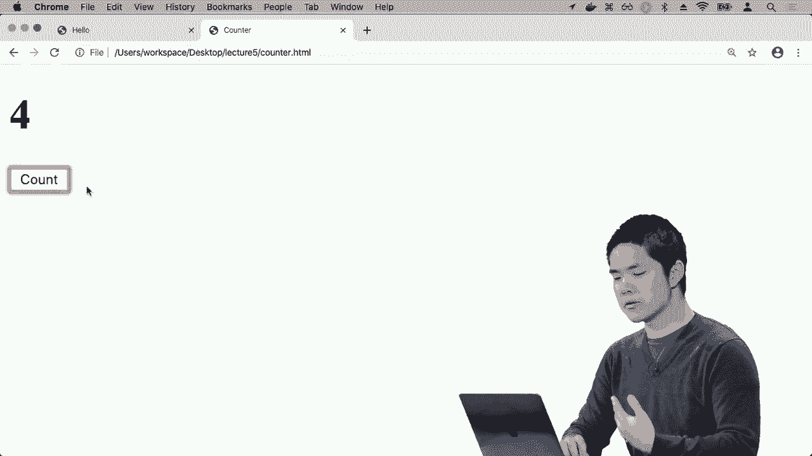

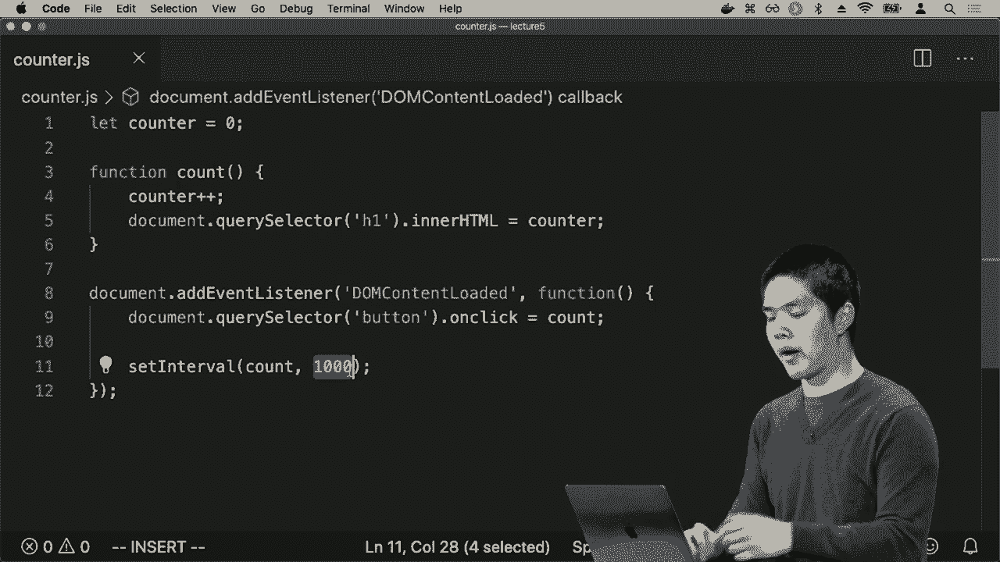

在本节课中，我们将要学习JavaScript中两个强大的功能：**定时执行**与**本地存储**，以及如何通过**API**与外部服务进行异步通信。我们将通过构建一个自动计数器和货币兑换应用来实践这些概念。

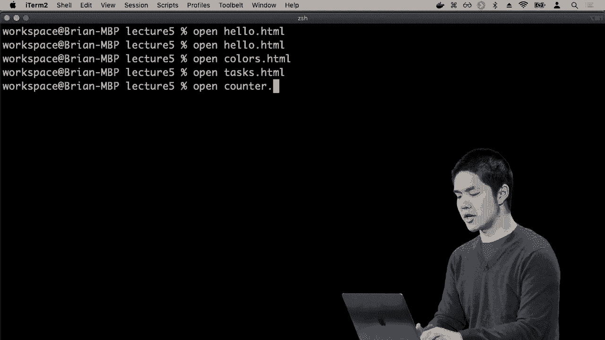

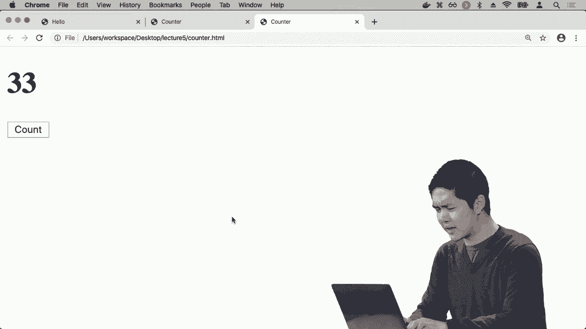

## 1. 定时执行：`setInterval` ⏱️

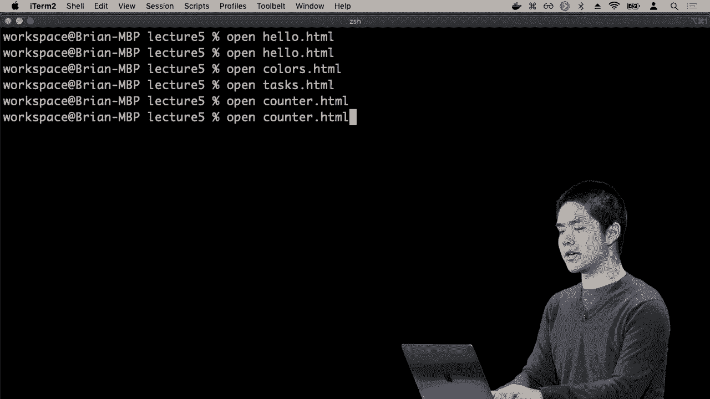

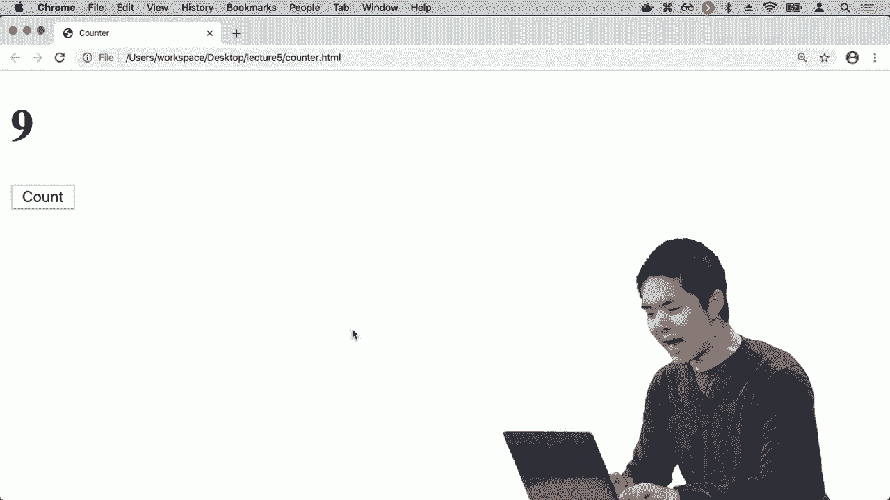

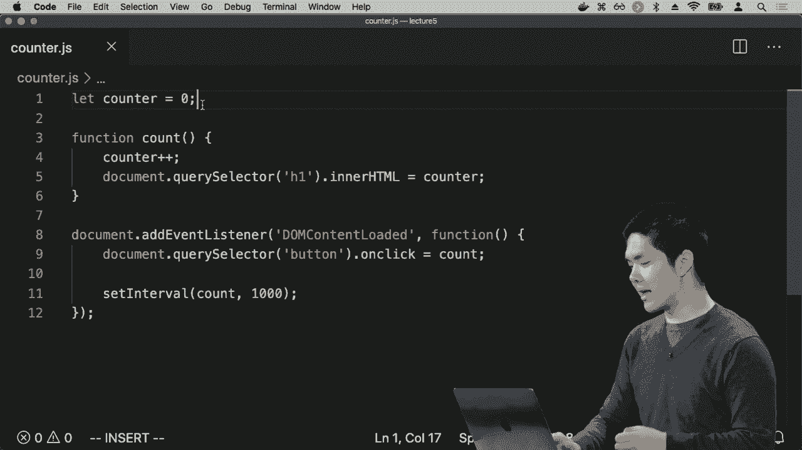

上一节我们介绍了如何通过事件监听器响应用户的点击操作。本节中我们来看看如何让函数自动、周期性地执行，而无需用户手动触发。

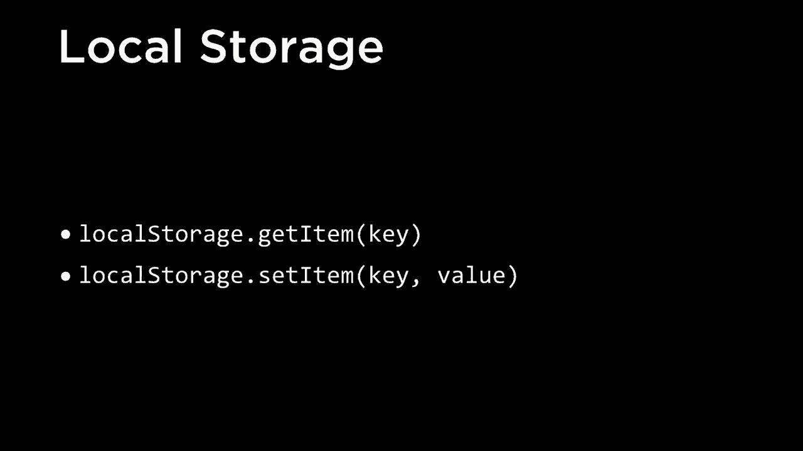

JavaScript提供了`setInterval`函数，它允许我们设置一个定时器，每隔指定的毫秒数就自动运行一次特定的函数。

让我们回到之前的计数器示例。原本我们需要手动点击按钮来增加计数。现在，我们可以使用`setInterval`让计数器每秒自动加一。

以下是实现自动计时的核心代码：

```javascript
// 设置一个间隔，每1000毫秒（1秒）执行一次count函数
setInterval(count, 1000);
```

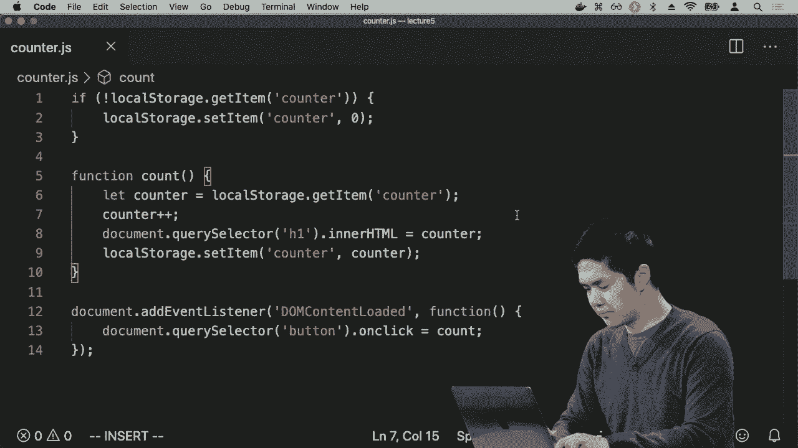

在这段代码中，`setInterval`是JavaScript的内置函数。第一个参数`count`是要周期性运行的函数名，第二个参数`1000`是间隔的毫秒数。这样，页面加载后，计数器就会每秒自动更新，无需用户干预。

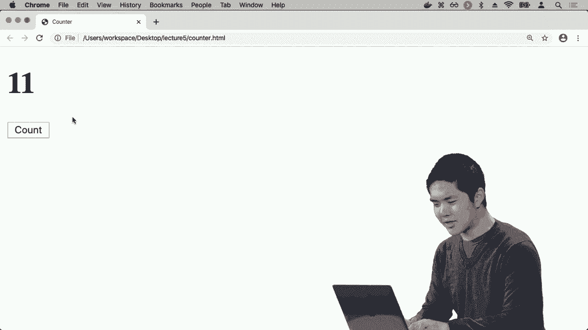

## 2. 数据持久化：`localStorage` 💾

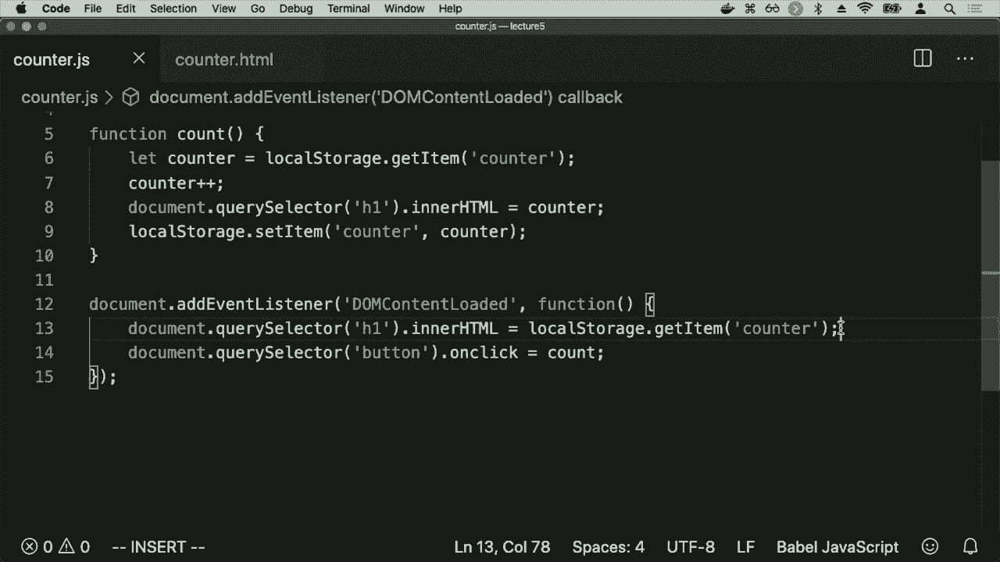

然而，上述自动计数器有一个问题：每次刷新页面，计数器都会重置为零。这是因为JavaScript变量在页面重新加载时状态会丢失。

为了解决这个问题，现代浏览器提供了**本地存储（`localStorage`）** 功能。它允许网页在用户的浏览器中存储键值对数据，并且在后续访问时能够读取这些数据。

`localStorage`主要提供两个方法：
*   `localStorage.getItem(‘key’)`: 根据键名获取存储的值。
*   `localStorage.setItem(‘key’, value)`: 设置一个键值对。

以下是使用`localStorage`改造计数器应用的步骤：

1.  **初始化检查**：页面加载时，检查`localStorage`中是否已有`counter`值。如果没有，则将其初始化为0。
2.  **更新显示**：将页面标题的初始内容设置为`localStorage`中存储的计数器值。
3.  **保存状态**：每次计数函数执行时，不仅更新页面显示，还要将新的计数值保存回`localStorage`。

核心逻辑代码如下：

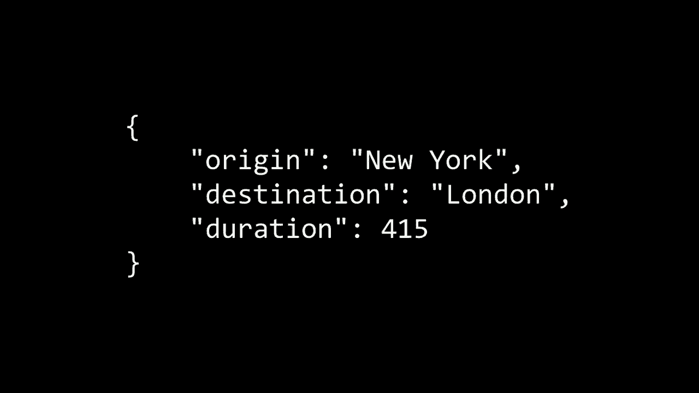

```javascript
// 1. 初始化检查
if (!localStorage.getItem(‘counter’)) {
    localStorage.setItem(‘counter’, 0);
}

// 2. 页面加载时更新显示
document.addEventListener(‘DOMContentLoaded’, function() {
    document.querySelector(‘h1’).innerHTML = localStorage.getItem(‘counter’);
    // ... 设置事件监听器等
});

// 3. 计数函数中保存状态
function count() {
    let counter = localStorage.getItem(‘counter’);
    counter++;
    document.querySelector(‘h1’).innerHTML = counter;
    localStorage.setItem(‘counter’, counter); // 保存新值
}
```

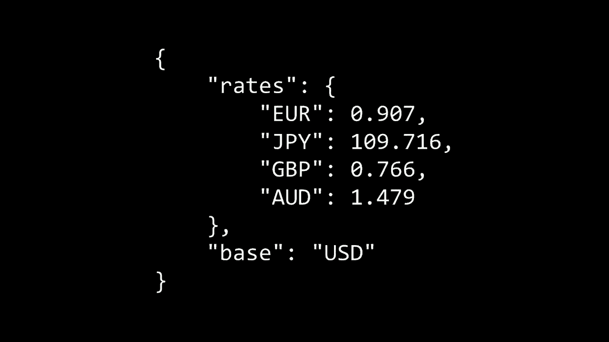

经过改造后，计数器的值会在浏览器刷新后依然保留。你可以在浏览器的开发者工具（Application -> Local Storage）中查看和操作这些存储的数据。

## 3. 与外部世界通信：API 与 `fetch` 🌐

到目前为止，我们的JavaScript都在浏览器内部运行。但网络应用的强大之处在于能够与其他服务交互。这通常通过**API（应用程序编程接口）** 实现。

API定义了服务之间通信的规则。许多服务（如天气、地图、汇率）都提供API，允许我们以结构化的格式（通常是**JSON**）请求和接收数据。

**JSON（JavaScript Object Notation）** 是一种轻量级的数据交换格式，易于人阅读和编写，也易于机器解析和生成。它看起来很像JavaScript对象。

例如，一个表示航班信息的JSON数据可能如下所示：
```json
{
  “origin”: {“city”: “New York”, “code”: “JFK”},
  “destination”: “London”,
  “duration”: 415
}
```

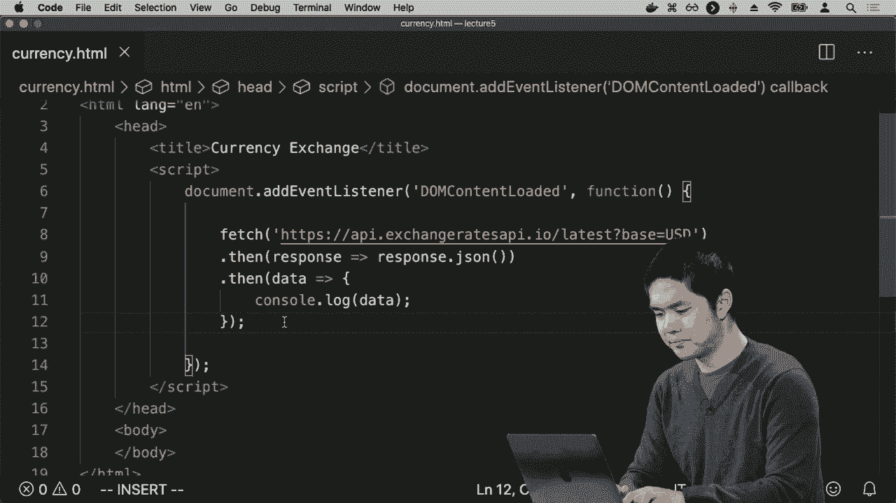

### 实践：构建货币兑换器 💰

我们将使用一个免费的汇率API来构建一个货币兑换器。这个API会返回以某种货币为基础的最新汇率JSON数据。

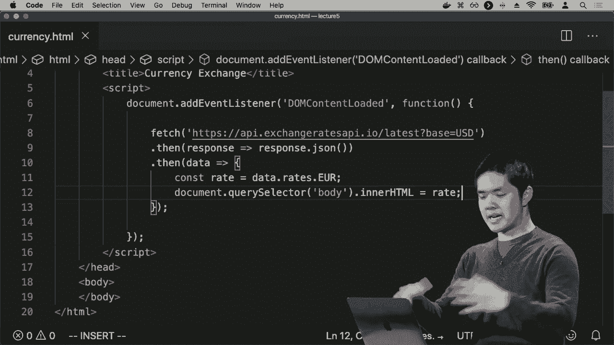

实现与API通信的关键是使用`fetch`函数，它用于发起异步网络请求。

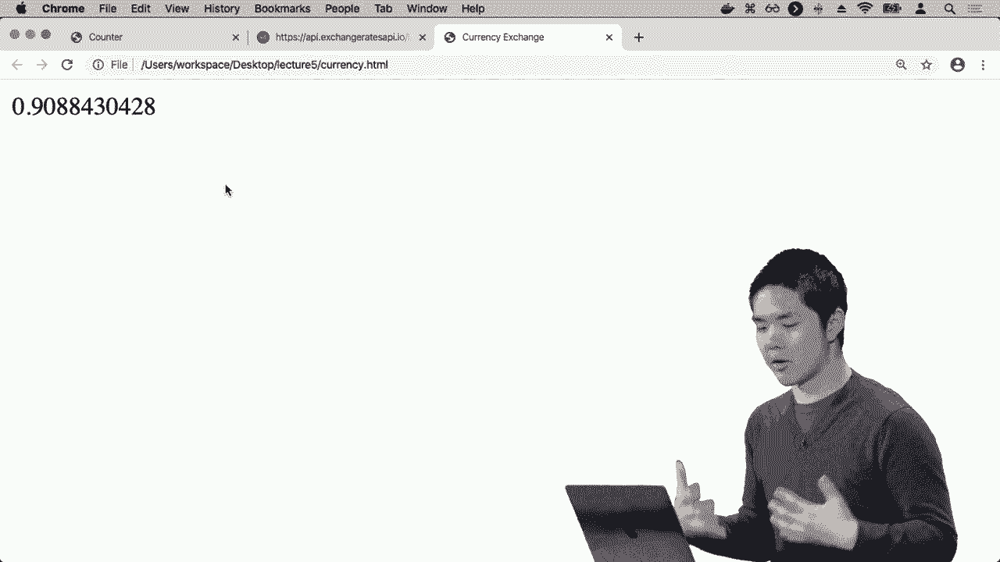

以下是构建货币兑换器的核心步骤：

1.  **发起请求**：使用`fetch()`向汇率API的URL发送请求。
2.  **处理响应**：使用`.then()`处理返回的“承诺（Promise）”，并将响应解析为JSON格式。
3.  **使用数据**：从JSON数据中提取所需的汇率信息，并更新到网页上。

以下是获取汇率并显示欧元汇率的简化代码：

```javascript
fetch(‘https://api.exchangerate-api.com/v4/latest/USD’)
    .then(response => response.json()) // 将响应转换为JSON
    .then(data => {
        // data 现在是包含汇率的JavaScript对象
        let rate = data.rates.EUR; // 获取美元对欧元的汇率
        document.querySelector(‘body’).innerHTML = `1 USD = ${rate.toFixed(3)} EUR`;
    });
```

为了使应用交互性更强，我们可以创建一个表单，让用户输入任意货币代码来查询汇率。

以下是增强版货币兑换器的关键逻辑：

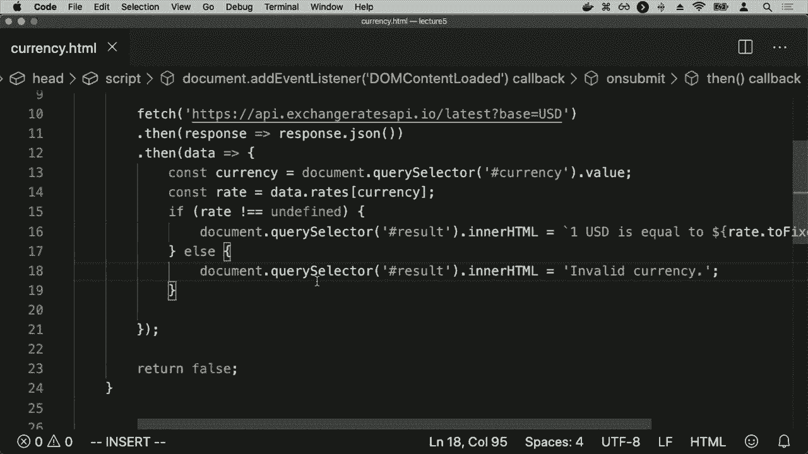

```javascript
// 监听表单提交事件
document.querySelector(‘form’).onsubmit = function() {
    // 获取用户输入的货币代码，并转换为大写（因为API键名是大写的）
    let currency = document.querySelector(‘#currency’).value.toUpperCase();

    // 发起API请求
    fetch(‘https://api.exchangerate-api.com/v4/latest/USD’)
        .then(response => response.json())
        .then(data => {
            let rate = data.rates[currency]; // 使用变量动态访问属性
            if (rate !== undefined) {
                // 显示结果
                document.querySelector(‘#result’).innerHTML =
                    `1 USD = ${rate.toFixed(3)} ${currency}`;
            } else {
                // 货币代码无效
                document.querySelector(‘#result’).innerHTML = ‘无效货币’;
            }
        })
        .catch(error => {
            // 处理请求过程中可能发生的错误
            console.log(‘Error:’, error);
        });
    return false; // 阻止表单默认提交行为
};
```

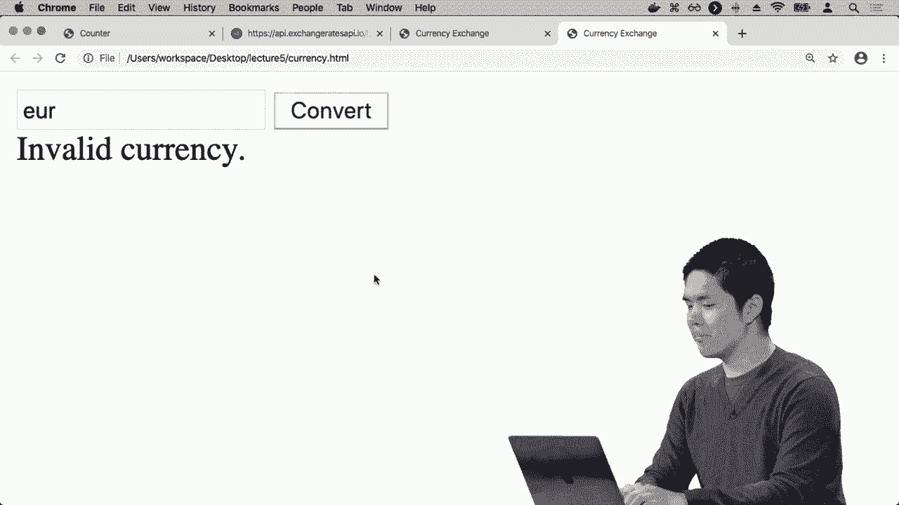

在这个应用中，用户输入货币代码（如`EUR`， `GBP`， `JPY`）后，页面会异步地向汇率API请求最新数据，并将结果动态地展示在页面上，而无需刷新整个页面。

## 总结 🎯

本节课中我们一起学习了：
1.  **`setInterval`**：用于设置定时任务，让函数周期性自动执行。
2.  **`localStorage`**：用于在客户端浏览器中持久化存储数据，提升用户体验。
3.  **API与异步通信**：通过`fetch`函数发起异步HTTP请求，与外部服务API交互，获取并处理JSON格式的数据，实现动态内容更新。

这些技术结合起来，使得我们能够创建出状态持久、能与外部服务交互、并且高度动态交互的现代Web应用程序。在接下来的课程中，我们将继续探索JavaScript的更多功能，构建更复杂的用户界面。