# 哈佛 CS50-WEB 21：L7- 测试与前端CI/CD 1 (测试与断言，单测) 🧪


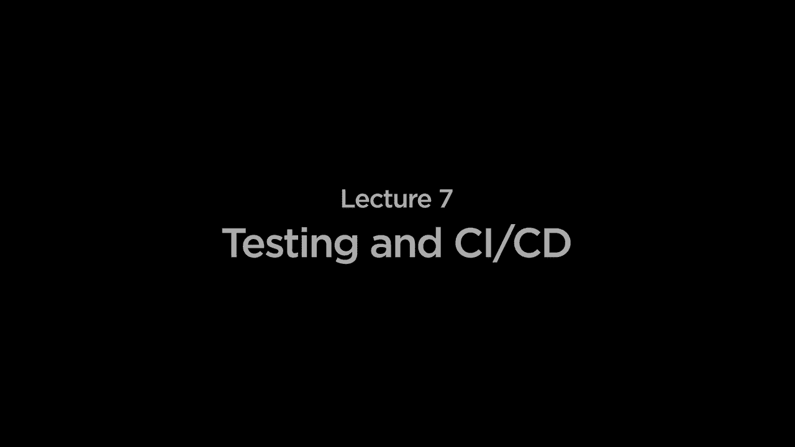


在本节课中，我们将要学习软件开发中的一项重要最佳实践：**测试**。我们将从最基础的断言开始，逐步了解如何编写自动化测试来验证代码的正确性，并初步接触单元测试的概念。这对于构建和维护日益复杂的Web应用程序至关重要。

## 概述：为什么需要测试？ 🤔

在之前的课程中，我们已经学习了使用HTML、CSS、Python（如Django框架）和JavaScript来设计和构建交互式Web应用程序。随着应用程序变得越来越复杂，确保代码按预期工作变得至关重要。**测试**就是验证代码正确性的过程。它能帮助我们高效地发现错误，并在添加新功能或修改代码时，确保不会破坏已有的功能。

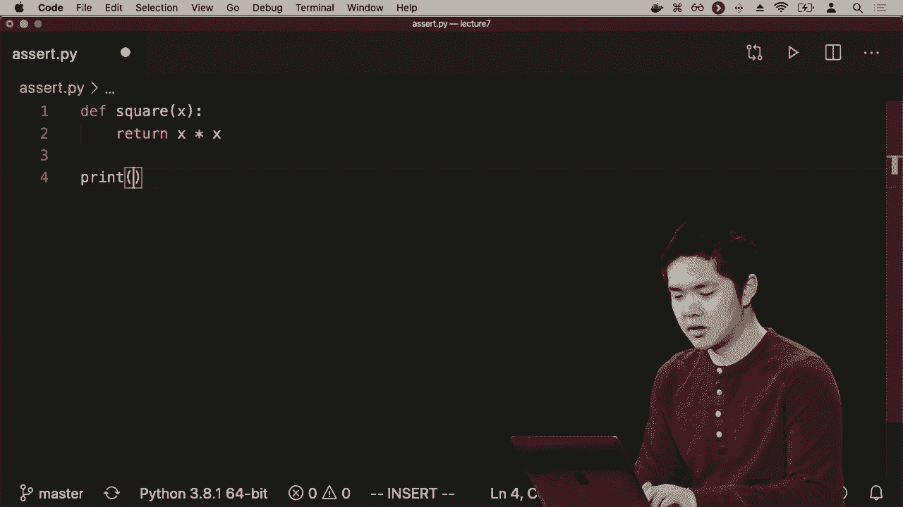

本节我们将从简单的Python函数测试开始，讨论断言（`assert`）的用法，并最终引入Python的`unittest`库来编写更结构化的单元测试。

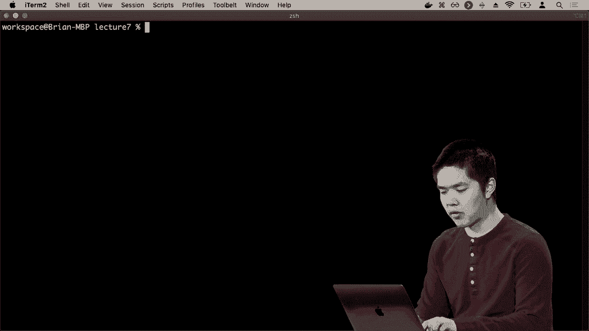

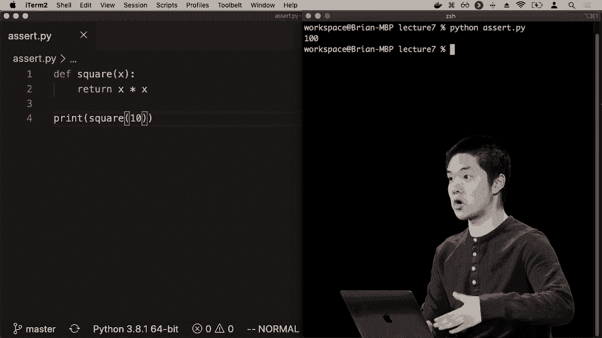

## 从简单的断言开始

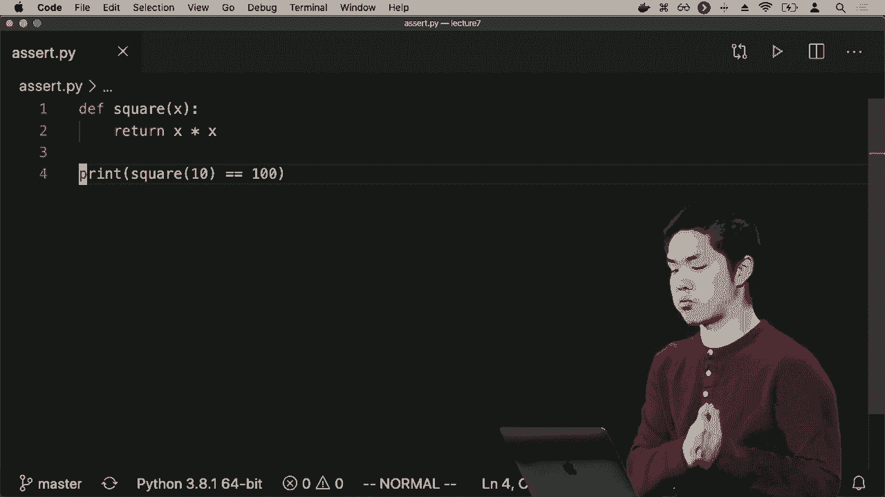

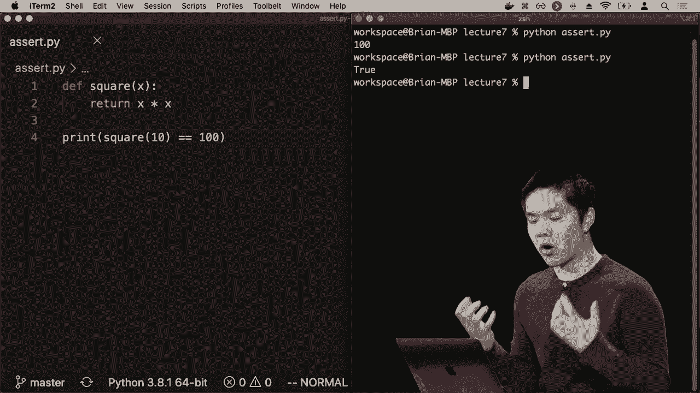

测试的核心思想是验证某个条件是否为真。在Python中，最基础的工具就是`assert`语句。它的作用是声明某事应为真；如果条件为假，程序会抛出一个`AssertionError`异常。

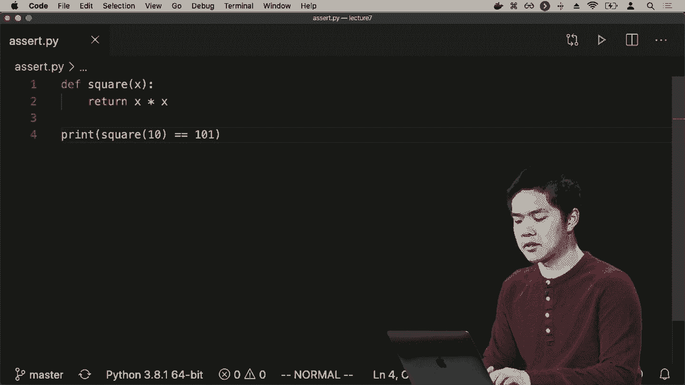

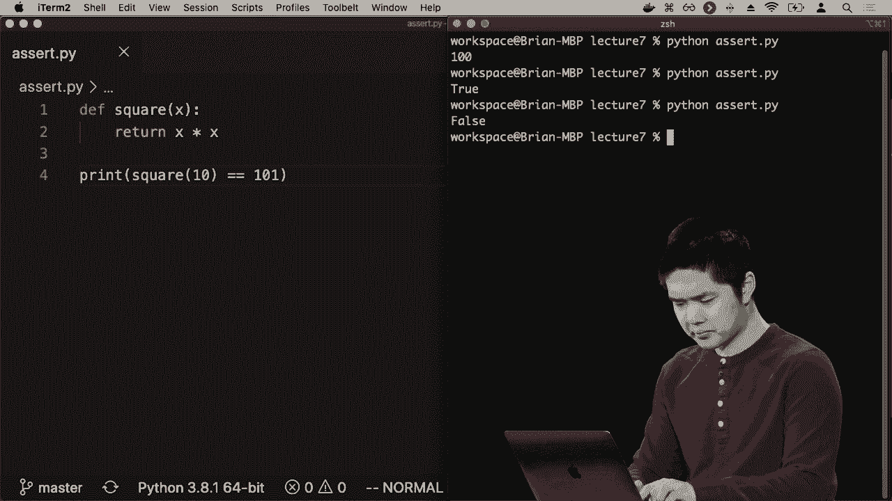

让我们通过一个简单的例子来理解。假设我们有一个计算数字平方的函数：

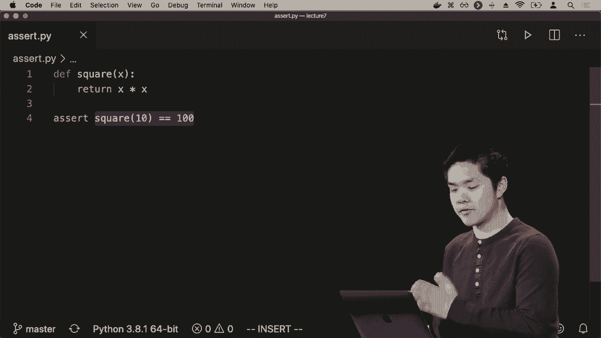

```python
# square.py
def square(x):
    return x * x
```

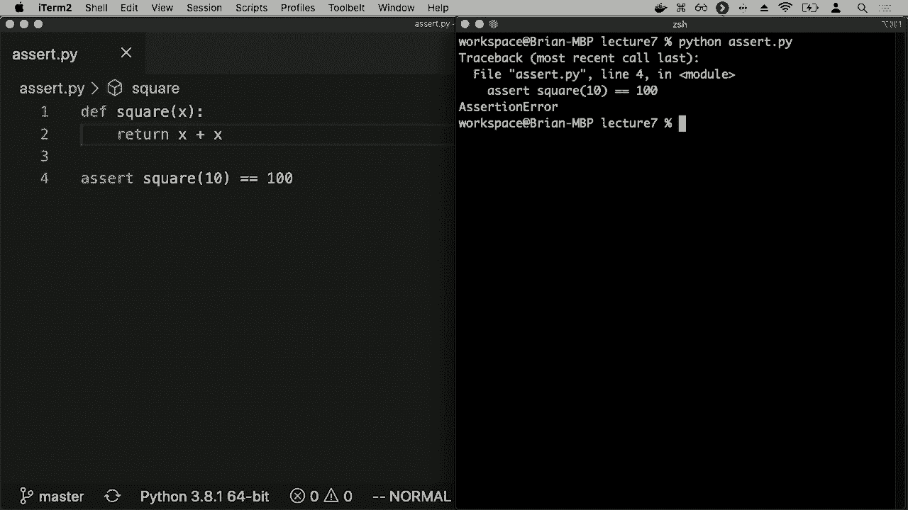

为了验证这个函数是否正确，我们可以手动计算并打印结果，但这不够自动化。更好的方法是使用`assert`：

```python
assert square(10) == 100
```

如果`square(10)`确实等于100，程序会静默通过。如果不等于（例如，我们在函数中错误地写了`return x + x`），程序会抛出`AssertionError`，立即告诉我们有错误发生。

上一节我们介绍了使用断言进行基础验证。本节中我们来看看如何为一个更复杂的函数编写测试。

## 测试一个更复杂的函数：判断质数

让我们考虑一个更复杂的函数`is_prime(n)`，用于判断一个数字是否为质数。这个函数有更多的逻辑分支，出错的概率也更高。

```python
# prime.py
import math

def is_prime(n):
    """Check if a number is prime."""
    if n < 2:
        return False
    for i in range(2, int(math.sqrt(n)) + 1):
        if n % i == 0:
            return False
    return True
```

我们可以手动在Python解释器中测试几个案例，但这很繁琐。为了自动化，我们可以编写一个测试脚本。

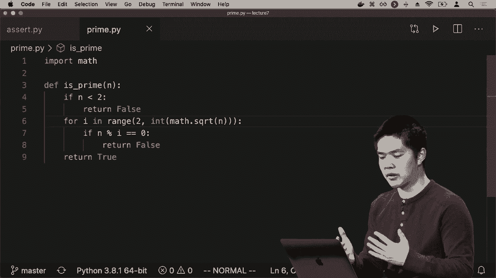

以下是手动测试的一种方式，它定义了一个测试函数来比较实际输出和期望输出：

```python
# test0.py
from prime import is_prime

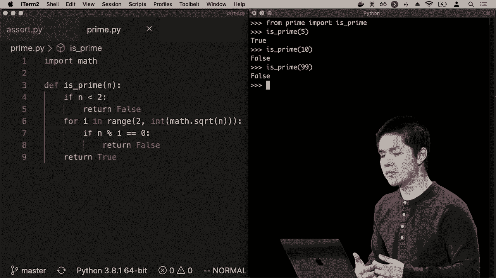

def test_prime(n, expected):
    if is_prime(n) != expected:
        print(f"ERROR: is_prime({n}) returned {not expected}")
```

然后，我们可以创建一个Shell脚本`test0.sh`来批量运行这些测试：

```bash
#!/bin/bash
python3 -c "from test0 import test_prime; test_prime(1, False)"
python3 -c "from test0 import test_prime; test_prime(2, True)"
python3 -c "from test0 import test_prime; test_prime(8, False)"
python3 -c "from test0 import test_prime; test_prime(25, False)"
# ... 更多测试
```

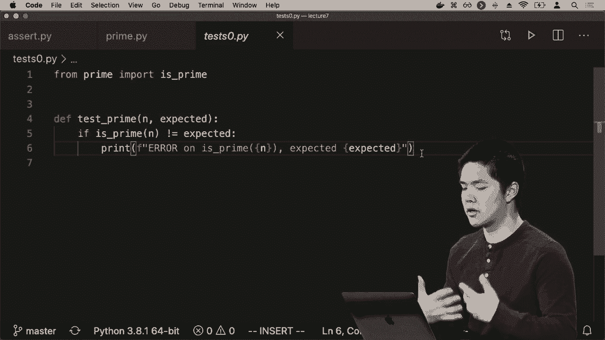

运行这个脚本会立即告诉我们哪些测试失败了。然而，自己管理测试框架仍然很麻烦。幸运的是，Python提供了强大的内置库来帮助我们。

## 使用 `unittest` 库进行单元测试 🧰

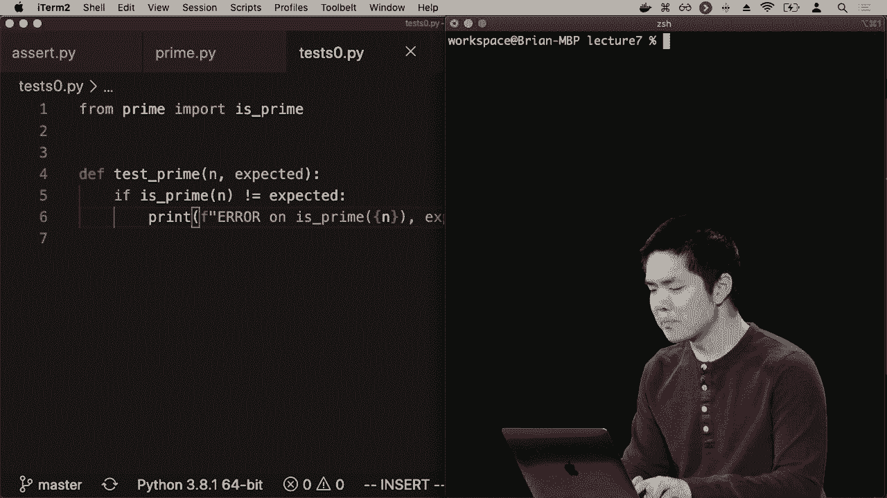

Python的`unittest`库提供了一个测试框架，可以自动发现和运行测试，并生成清晰的报告。它比我们自制的测试脚本更强大、更规范。

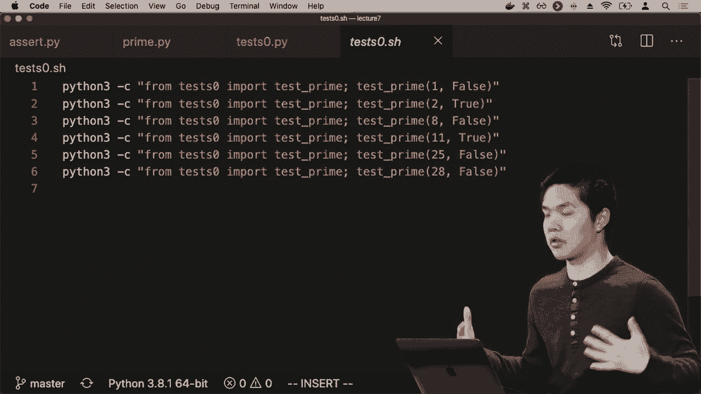

让我们将之前的测试用`unittest`重写：

```python
# test1.py
import unittest
from prime import is_prime

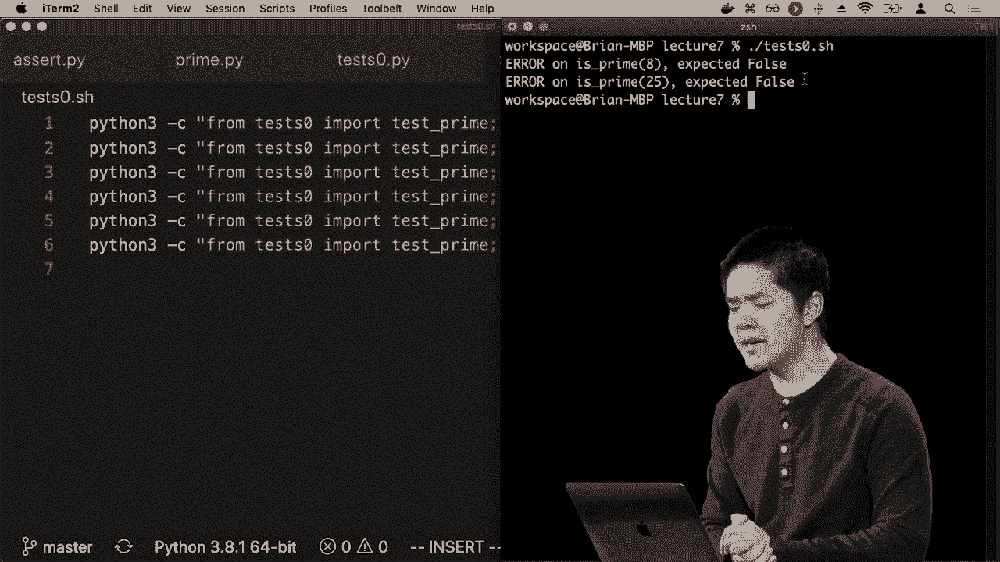

class PrimeTestCase(unittest.TestCase):
    """Tests for `prime.py`."""

    def test_is_prime_one(self):
        """Is 1 correctly determined not to be prime?"""
        self.assertFalse(is_prime(1))

    def test_is_prime_two(self):
        """Is 2 correctly determined to be prime?"""
        self.assertTrue(is_prime(2))

    def test_is_prime_eight(self):
        """Is 8 correctly determined not to be prime?"""
        self.assertFalse(is_prime(8))

    def test_is_prime_twentyfive(self):
        """Is 25 correctly determined not to be prime?"""
        self.assertFalse(is_prime(25))
    # ... 可以添加更多测试方法

if __name__ == '__main__':
    unittest.main()
```

在这个例子中：
*   我们创建了一个测试类`PrimeTestCase`，它继承自`unittest.TestCase`。
*   每个测试都是一个以`test_`开头的方法。
*   我们使用`self.assertTrue()`或`self.assertFalse()`来断言结果。
*   方法下的文档字符串（三个引号内的内容）会被`unittest`用作测试描述。

运行这个测试文件（`python test1.py`），`unittest`会自动运行所有`test_`方法。输出会显示每个测试的结果（点`.`表示通过，`F`表示失败），并总结通过和失败的数量。如果测试失败，它会清晰地指出是哪个测试失败了以及失败的原因，这极大地帮助我们定位问题。

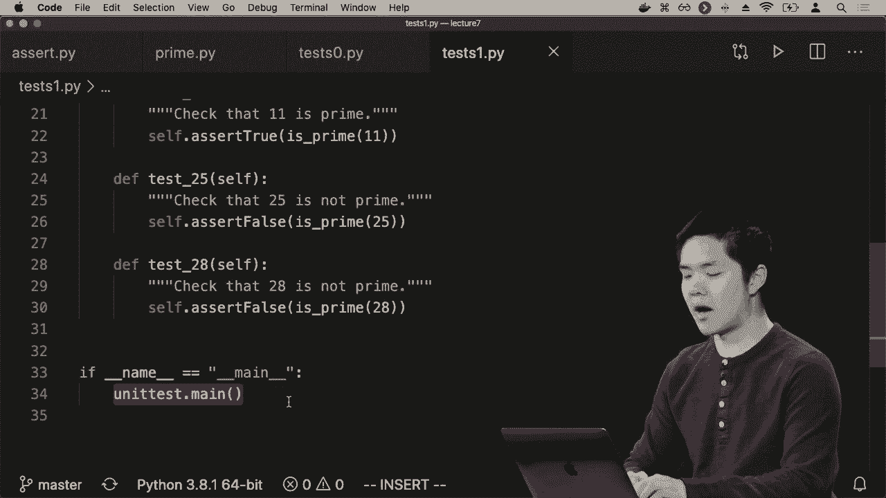

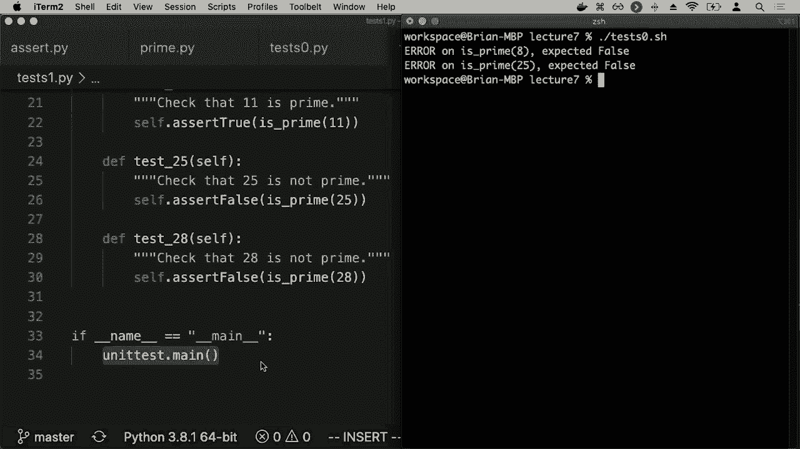

例如，如果`is_prime(25)`错误地返回了`True`，测试失败信息会直接指向`test_is_prime_twentyfive`这个方法，让我们能快速修复`prime.py`中的逻辑错误（例如，循环范围需要包含平方根本身）。

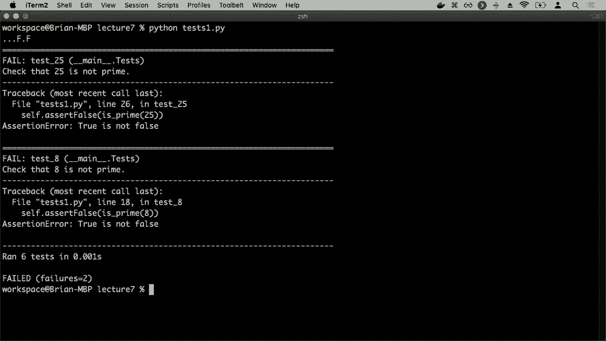

## 测试驱动开发与持续测试

编写测试不仅是为了修复已知的错误。**测试驱动开发** 是一种最佳实践，提倡在编写实现代码之前先编写测试。这有助于明确需求，并设计出更易测试的代码结构。

此外，随着项目增长，手动运行所有测试会变得不现实。我们应该将测试自动化，并集成到开发流程中。每次修改代码后都运行一遍完整的测试套件，可以确保新更改没有引入回归错误（即破坏了之前正常的功能）。这就是我们后续会讨论的**持续集成**理念的基础。

## 总结 📝

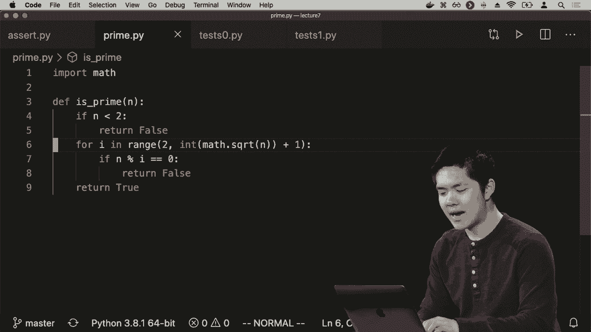

本节课中我们一起学习了软件测试的基础知识。

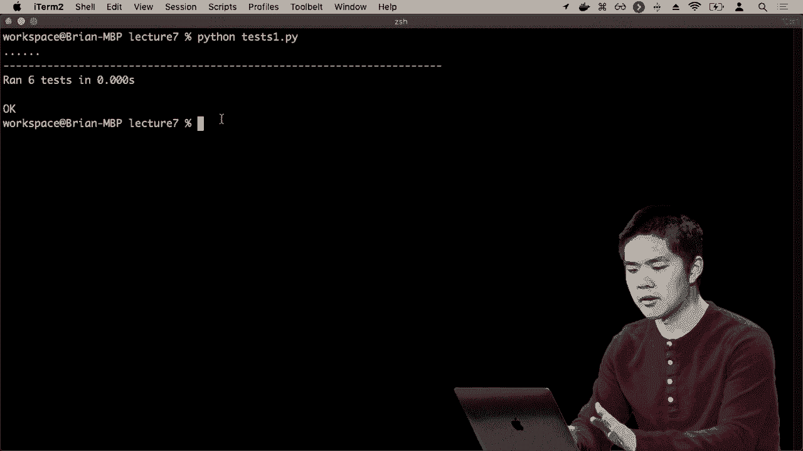

1.  **测试的目的**：验证代码的正确性，确保程序行为符合预期，这对于复杂项目的维护至关重要。
2.  **使用断言**：我们学习了如何使用Python的`assert`语句进行最基本的条件验证。
3.  **编写测试函数**：我们尝试了编写自定义函数来批量测试代码，并利用Shell脚本执行它们。
4.  **引入单元测试**：我们重点介绍了Python内置的`unittest`库，它提供了结构化的方式来编写和组织测试用例，并能自动运行测试、生成报告。

通过编写全面的测试，我们可以在优化代码、添加新功能或修复错误时拥有更大的信心。测试是保障软件质量、实现可持续开发的关键步骤。在接下来的课程中，我们将探讨如何将这些测试实践与前端开发和自动化部署流程结合起来。