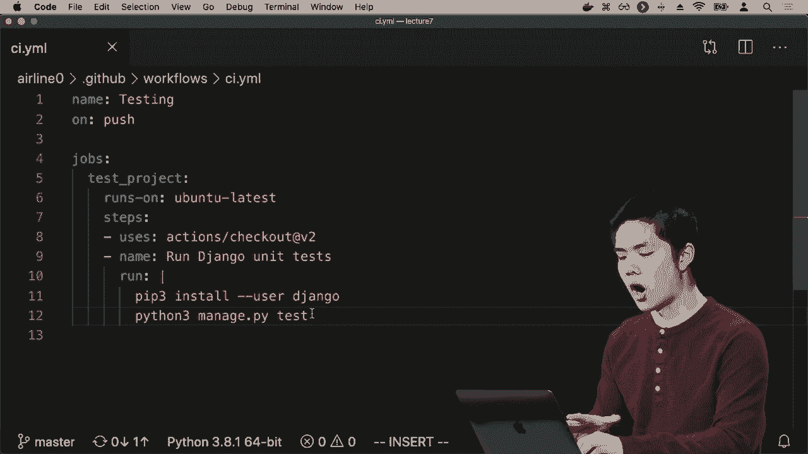
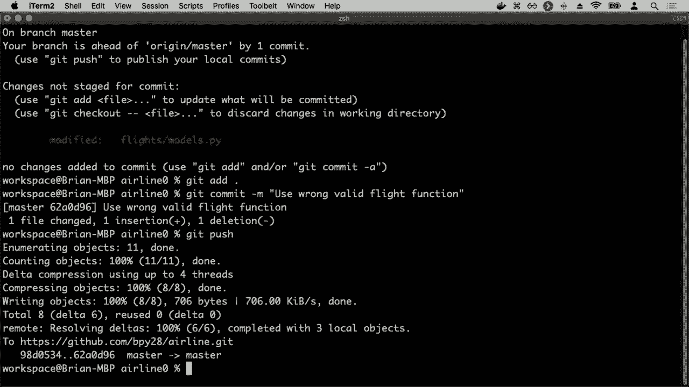
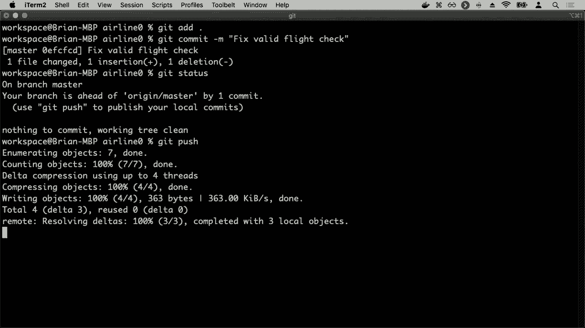
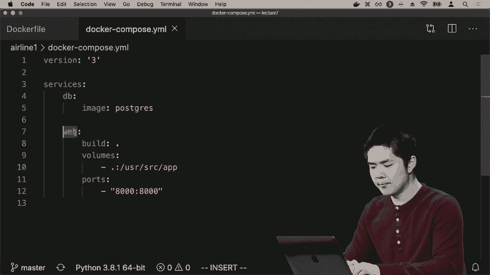
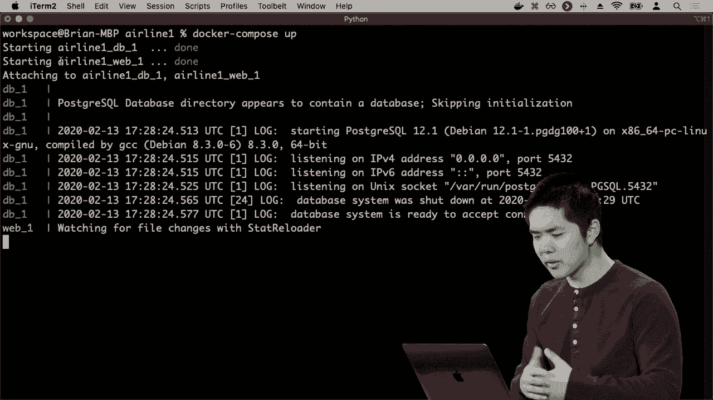
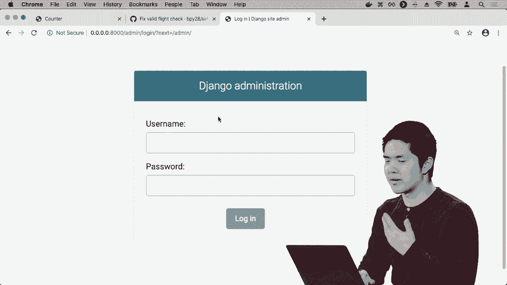
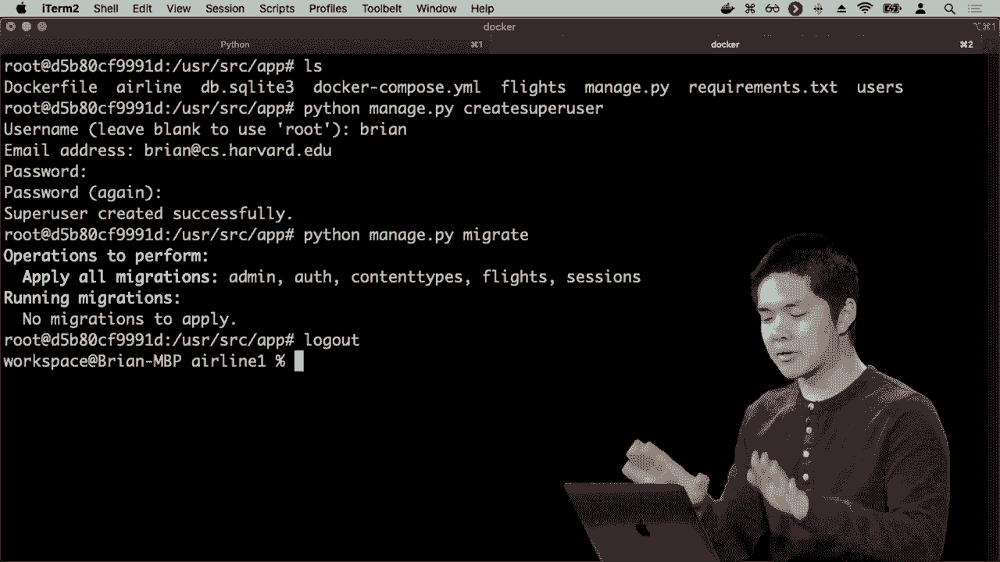

# 哈佛 CS50-WEB 23：L7- 测试与前端CI/CD 3 (GitHub Actions与Docker应用) 🚀

## 概述

在本节课中，我们将要学习如何利用自动化工具来提升Web开发的效率与可靠性。我们将重点介绍**持续集成（CI）**与**持续交付（CD）**的概念，并学习如何使用**GitHub Actions**来自动化测试流程，以及如何使用**Docker**来标准化开发与部署环境。

---

## 利用GitHub Actions实现持续集成

上一节我们介绍了自动化测试的重要性。本节中我们来看看如何利用GitHub Actions来实现持续集成，确保每次代码变更都能自动运行测试。

持续集成工具可以帮助我们自动执行代码检查与测试。GitHub Actions是GitHub提供的一项功能，它允许我们创建工作流。例如，我们可以配置一个工作流，每当有人向GitHub仓库推送代码时，就自动运行我们为该代码库设定的测试。



### GitHub Actions工作流示例

以下是一个GitHub Actions工作流的核心结构示例，它定义了一个在代码推送时运行的测试任务：



```yaml
name: testing
on: [push]
jobs:
  test:
    runs-on: ubuntu-latest
    steps:
      - uses: actions/checkout@v2
      - name: Run Django Unit Tests
        run: |
          pip install django
          python3 manage.py test
```

这个工作流被命名为`testing`，它会在`push`事件（即代码推送）时触发。它包含一个名为`test`的作业，该作业将在最新的Ubuntu系统上运行。作业的步骤包括：使用`actions/checkout`检出代码，然后安装Django并运行所有单元测试。

### 工作流执行与反馈

当工作流执行后，我们可以在GitHub仓库的“Actions”选项卡中查看结果。如果测试失败，对应提交旁会显示红色的“X”标记，并且我们会收到通知。这能帮助开发者快速发现问题并及时修复。

---



## 使用Docker进行环境标准化与持续交付

上一节我们介绍了如何自动化测试。本节中我们来看看如何利用Docker来解决开发与部署环境不一致的问题，并实现持续交付。

在团队协作或部署到服务器时，环境差异（如操作系统、软件版本）常导致程序运行异常。Docker通过**容器化**技术，将应用程序及其依赖打包在一个独立的、可移植的容器中，确保了环境的一致性。

### 编写Dockerfile

我们通过编写一个`Dockerfile`来定义如何构建应用程序的Docker镜像。镜像是一个包含运行应用所需一切（代码、运行时、库）的模板。

以下是一个用于运行Django应用的`Dockerfile`示例：

```dockerfile
FROM python:3
COPY . /usr/src/app
WORKDIR /usr/src/app
RUN pip install -r requirements.txt
CMD ["python", "manage.py", "runserver", "0.0.0.0:8000"]
```

*   `FROM python:3`：指定基础镜像为包含Python 3的官方镜像。
*   `COPY . /usr/src/app`：将当前目录所有文件复制到容器的`/usr/src/app`目录。
*   `WORKDIR /usr/src/app`：设置容器内的工作目录。
*   `RUN pip install -r requirements.txt`：安装`requirements.txt`中列出的所有Python依赖包。
*   `CMD ["python", "manage.py", "runserver", "0.0.0.0:8000"]`：指定容器启动时运行的命令，即启动Django开发服务器。

### 使用Docker Compose组合多服务

在实际项目中，应用可能依赖其他服务，如数据库。Docker Compose允许我们通过一个YAML文件定义和运行多个相互关联的Docker容器。

以下是一个`docker-compose.yml`文件示例，它定义了一个Web应用服务和一个PostgreSQL数据库服务：

```yaml
version: '3'
services:
  db:
    image: postgres
  web:
    build: .
    ports:
      - "8000:8000"
```

*   `version: ‘3’`：指定Docker Compose文件的版本。
*   `services`：定义要运行的服务。
    *   `db`：基于`postgres`官方镜像的数据库服务。
    *   `web`：基于当前目录`Dockerfile`构建的Web应用服务，并将容器的8000端口映射到主机的8000端口。

运行`docker-compose up`命令即可同时启动这两个服务，它们将运行在独立的容器中并能相互通信。

### 在容器内执行命令

有时我们需要在正在运行的容器内执行命令（例如创建超级用户）。可以使用`docker exec`命令：

```bash
# 1. 查看运行中的容器
docker ps



# 2. 进入指定容器的交互式bash shell
docker exec -it <容器ID> bash



# 3. 在容器内执行命令，例如创建Django超级用户
python manage.py createsuperuser
```



---

## 总结

本节课中我们一起学习了现代Web开发中两项至关重要的实践：**持续集成（CI）**与**持续交付（CD）**。



我们首先了解了如何使用**GitHub Actions**来自动化测试流程。通过编写YAML格式的工作流文件，我们可以在每次代码推送时自动运行测试，快速获得反馈，确保代码质量。

接着，我们探讨了如何使用**Docker**来解决环境配置问题。通过编写`Dockerfile`定义应用环境，并使用`Docker Compose`管理多服务应用，我们能够确保开发、测试和生产环境的一致性。这大大简化了部署流程，并使得团队协作更加顺畅。

结合CI/CD与容器化技术，我们可以实现快速、可靠且可重复的软件交付周期，这是构建和维护高质量、可扩展Web应用程序的关键。