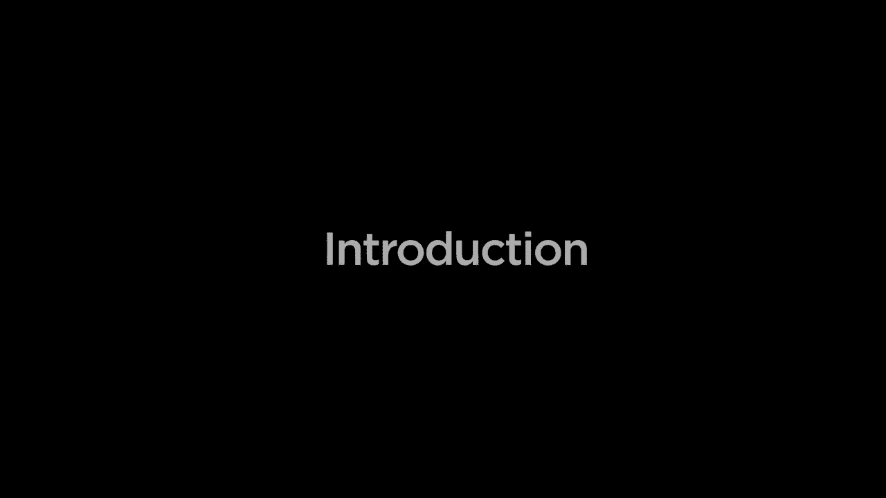
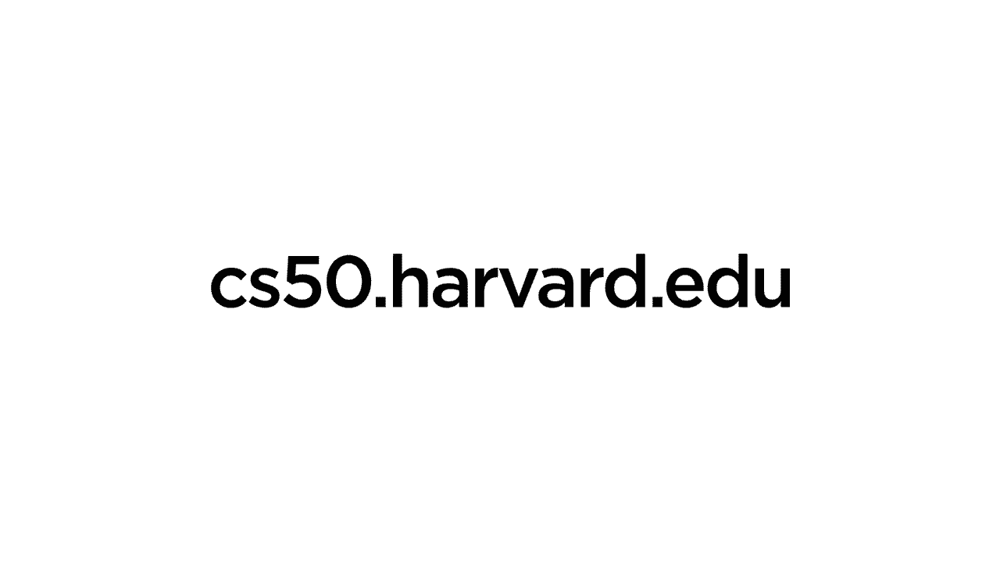

# 🧠 哈佛CS50-AI 1：课程内容介绍

在本节课中，我们将要学习哈佛大学CS50人工智能课程的整体框架与核心内容。这门课程由Brian老师主讲，旨在使用Python语言，带领我们探索现代人工智能的基础概念与关键技术。

我们将从人工智能如何解决问题开始，逐步深入到知识表示、优化、机器学习以及自然语言处理等核心领域。课程不仅讲解理论，更注重实践，会提供机会让我们亲手构建自己的人工智能程序。

---

上一段我们了解了课程的整体目标，接下来，我们来看看课程将要涵盖的具体技术模块。以下是课程的核心内容大纲：

*   **搜索算法**：人工智能如何寻找问题的解决方案，例如玩游戏或规划行车路线。
*   **知识表示与推理**：人工智能如何表示信息（包括确定性和不确定性的信息），并利用这些信息进行推理和得出结论。
*   **优化问题**：人工智能如何解决最大化利润、最小化成本或满足特定约束的优化问题。
*   **机器学习**：人工智能如何通过访问数据和经验来自主学习执行任务，而无需被明确告知具体解决方法。
*   **神经网络**：作为现代机器学习中最受欢迎的工具之一，我们将重点学习受人类大脑启发的神经网络如何学习和推理。
*   **自然语言处理**：人工智能如何学习理解、解释并与人类进行语言交流。

---

本节课中我们一起学习了哈佛CS50人工智能课程(Python版)的宏伟蓝图。我们了解到，本课程将引导我们系统性地掌握从基础搜索到前沿自然语言处理的人工智能核心知识，并通过实践项目巩固所学。接下来的课程将逐一深入这些激动人心的主题。