# 哈佛CS50-AI 5：L1- 知识系统与逻辑推理 🧠

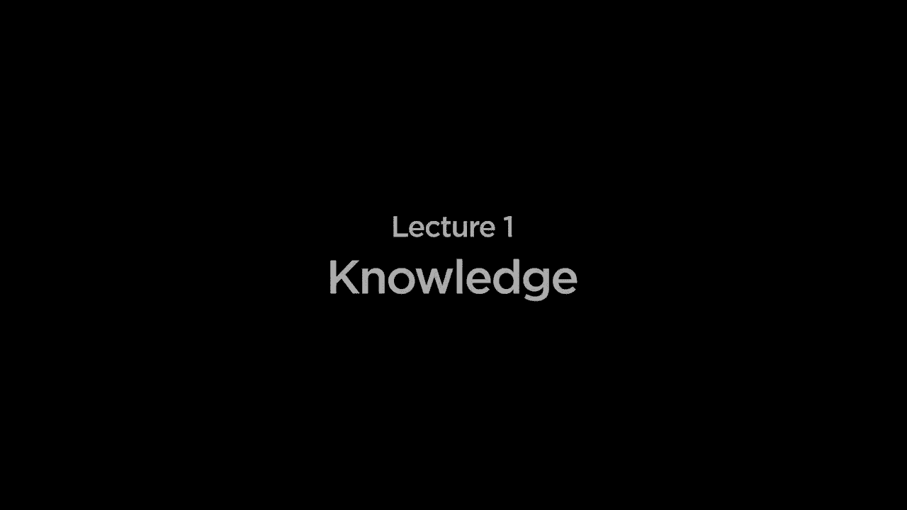

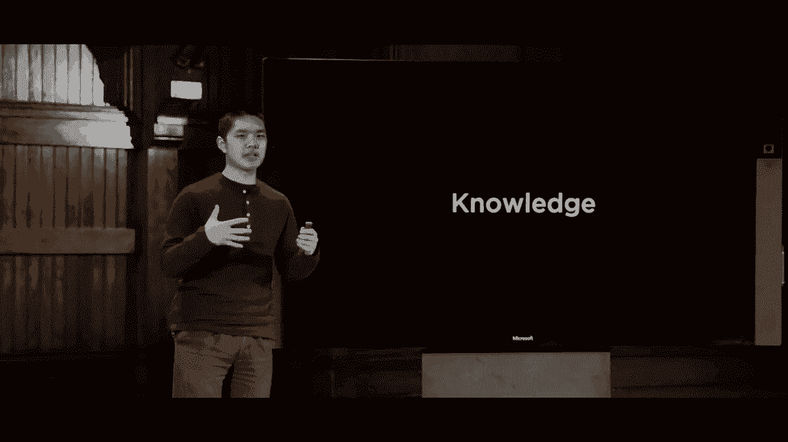

在本节课中，我们将要学习人工智能中一个核心概念：**知识**。我们将探讨如何让AI像人类一样，基于已知的事实进行推理，并得出新的结论。这涉及到一种称为**命题逻辑**的形式化语言，我们将学习其基本构成和推理规则。

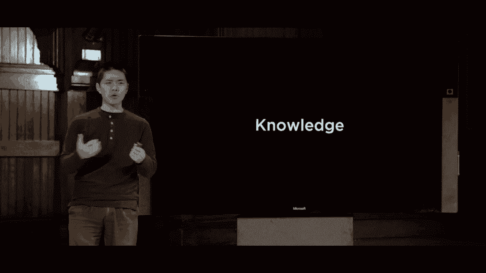

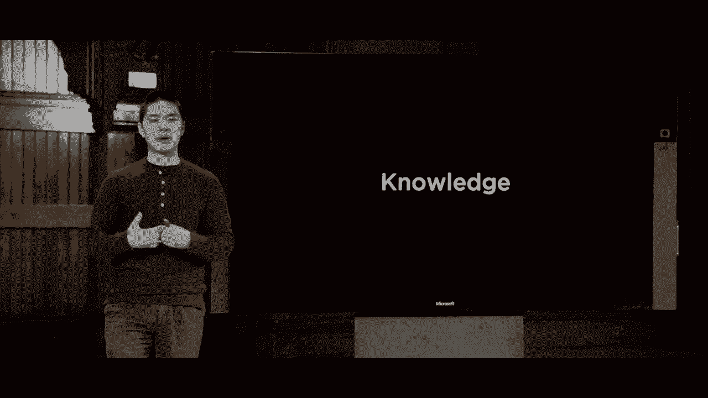

上一节我们讨论了搜索问题，AI代理在环境中通过行动来解决问题。本节中，我们将关注一个更普遍的概念：**知识**。许多智能行为都基于知识，我们人类知道关于世界的事实，并利用这些信息进行推理，从而得出结论或指导行动。

我们希望AI也能做到这一点。我们将要构建的AI被称为**知识型代理**，它能够在内部表示知识，并基于这些知识进行推理和行动。

## 从例子开始：基于知识的推理

让我们看一个简单的例子，理解什么是基于知识的推理。假设我们知道以下三个事实：
1.  如果今天不下雨，哈利就会去拜访海格。
2.  哈利今天要么拜访了海格，要么拜访了邓布利多，但不会同时拜访两人。
3.  哈利今天拜访了邓布利多。

作为人类，我们可以进行推理：
*   根据事实2和3（哈利拜访了邓布利多，且只能拜访一人），我们可以得出结论：**哈利今天没有拜访海格**。
*   再结合事实1（如果不下雨，哈利就会拜访海格），既然哈利没有拜访海格，我们就可以进一步推断：**今天下雨了**。

这种基于已知信息，运用逻辑推导出新结论的过程，就是**推理**。本节课的目标就是让AI学会这种推理。

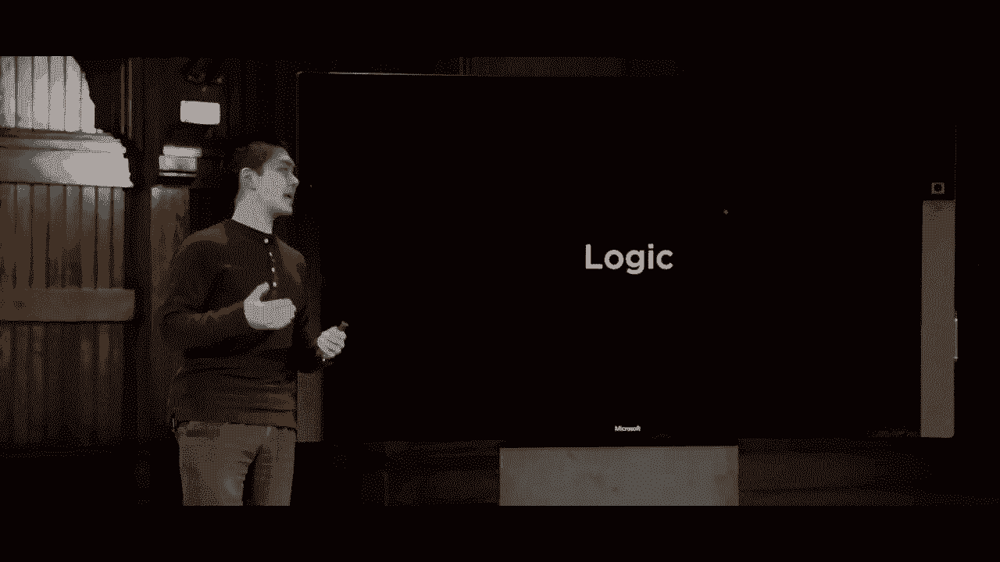

## 🔤 命题逻辑：AI的推理语言

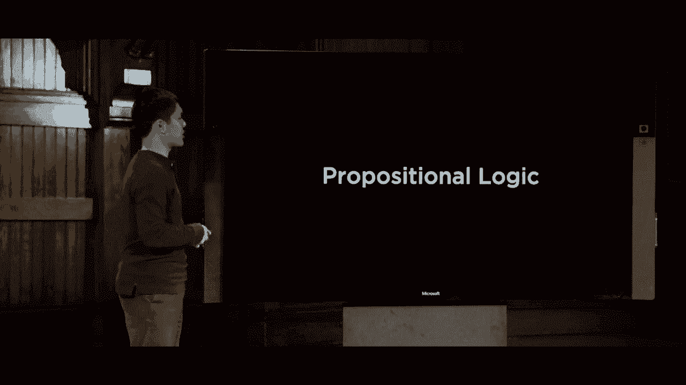

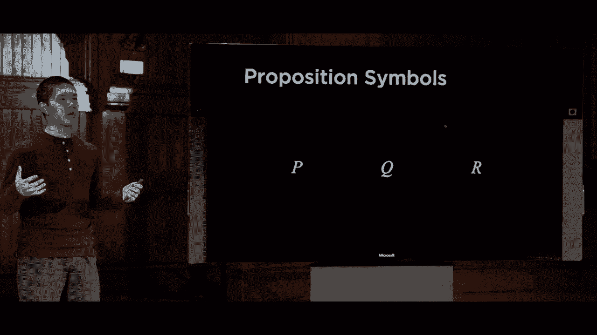

为了让计算机进行逻辑推理，我们需要一种形式化的语言。我们将使用**命题逻辑**。它基于关于世界的**命题**（即可以判断真假的陈述）。

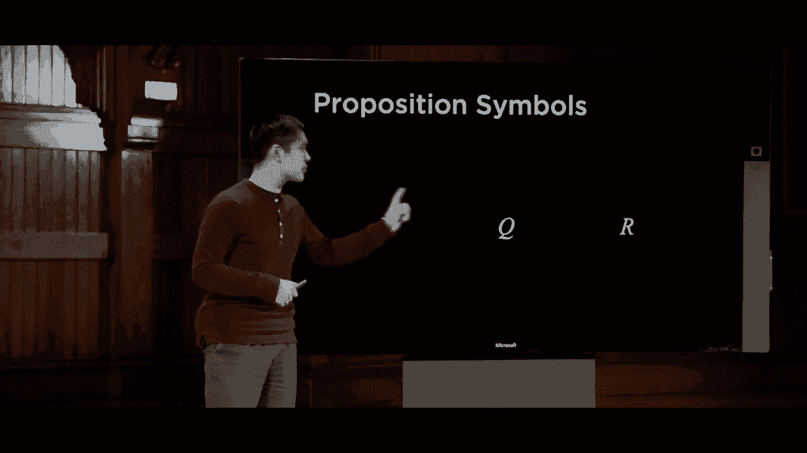

以下是构成命题逻辑的核心要素：

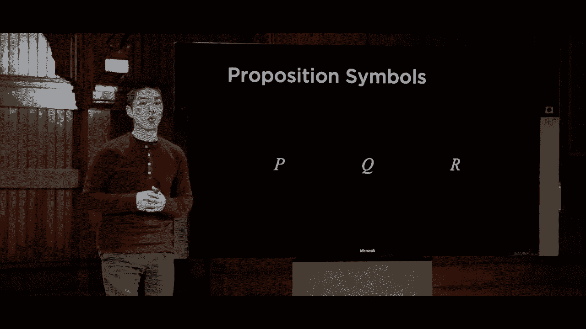

### 命题符号
命题符号通常用大写字母（如 `P`, `Q`, `R`）表示，它们代表一个基本的事实或陈述。
*   例如：`P` 可以代表“正在下雨”，`Q` 可以代表“哈利拜访了海格”。

### 逻辑联结词
单独的命题符号不足以表达复杂关系。我们需要**逻辑联结词**将它们组合起来。以下是五个最重要的联结词及其含义：

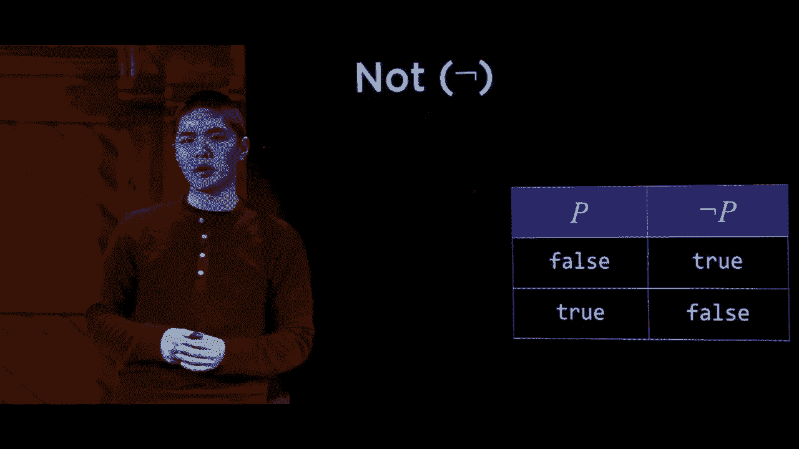

1.  **非 (Not)**: 表示为 `¬`。它取反一个命题的真值。
    *   公式：`¬P`
    *   真值表：如果 `P` 为真，则 `¬P` 为假；如果 `P` 为假，则 `¬P` 为真。

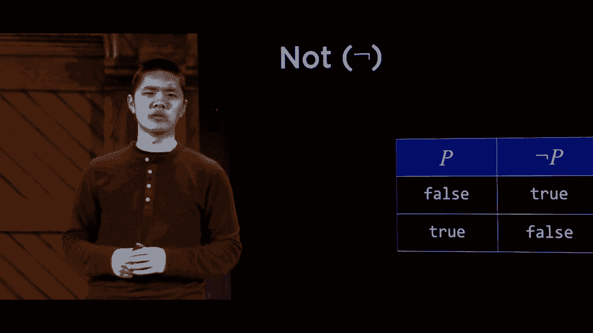

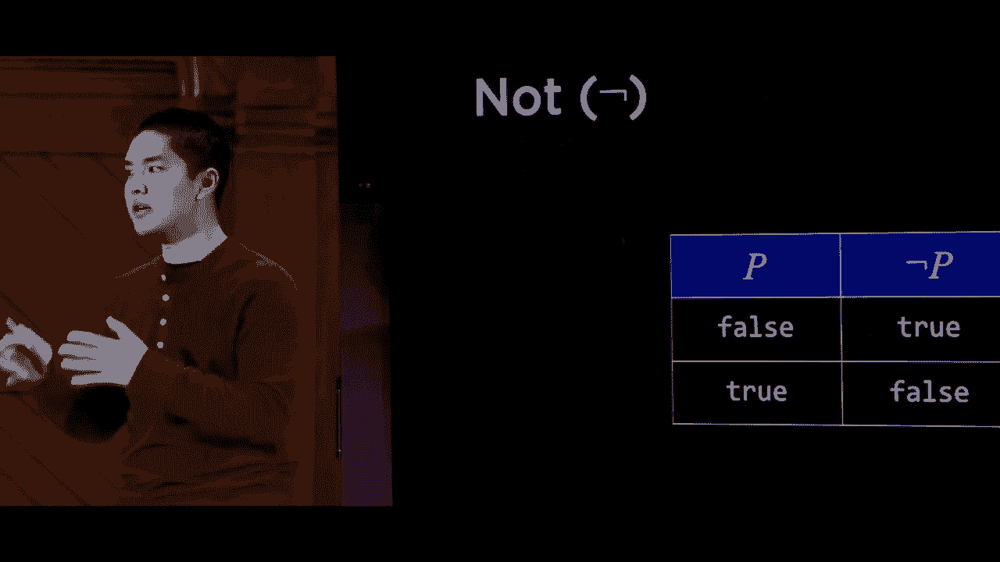

2.  **与 (And)**: 表示为 `∧`。仅当两个命题都为真时，整个句子才为真。
    *   公式：`P ∧ Q`
    *   真值表：仅当 `P` 为真 **且** `Q` 为真时，`P ∧ Q` 为真。

3.  **或 (Or)**: 表示为 `∨`。只要至少一个命题为真，整个句子就为真（包含两者都为真的情况）。
    *   公式：`P ∨ Q`
    *   真值表：只要 `P` 为真 **或** `Q` 为真（或两者），`P ∨ Q` 就为真。

4.  **蕴含 (Implication)**: 表示为 `→`。读作“如果P，那么Q”。它声明：如果前提 `P` 为真，则结论 `Q` 必须为真。
    *   公式：`P → Q`
    *   真值表：只有当 `P` 为真而 `Q` 为假时，`P → Q` 才为假。如果 `P` 为假，则无论 `Q` 真假，`P → Q` 都被视为真（因为前提未发生，承诺未被打破）。

5.  **双条件 (Biconditional)**: 表示为 `↔`。读作“P当且仅当Q”。它意味着两者必须同真同假。
    *   公式：`P ↔ Q`
    *   真值表：当 `P` 和 `Q` 同时为真或同时为假时，`P ↔ Q` 为真。

## 🌍 模型与知识库

有了表示知识的语言，我们还需要定义什么是“真实的世界”。

*   **模型**: 一个模型为每个命题符号分配一个真值（真或假）。它代表了一个**可能的世界状态**。
    *   例如，对于符号 `P`（下雨）和 `Q`（周二），一个模型可能是：`{P: 真, Q: 假}`，表示“正在下雨且今天不是周二”。

*   **知识库 (KB)**: 这是AI所知道的所有信息的集合，由一系列用命题逻辑写成的**句子**构成。
    *   我们会将关于问题的初始事实告诉AI，AI将其存储在知识库中。

## ➡️ 蕴涵与推理

AI的目标是利用知识库中的信息进行推理，得出新结论。这涉及到**蕴涵**的概念。

*   **蕴涵 (Entailment)**: 表示为 `⊨`。`KB ⊨ α` 意味着：在所有使知识库 `KB` 中所有句子都为真的模型中，句子 `α` 也一定为真。
    *   换句话说，如果 `KB` 的描述是真实的，那么 `α` 也必然是真实的。`α` 是 `KB` 的一个逻辑结论。

**推理**的过程，就是找出知识库所蕴涵的那些句子（即新知识）。

## 💡 推理实例演练

让我们用命题逻辑重写开头的例子，并进行一次推理演示。

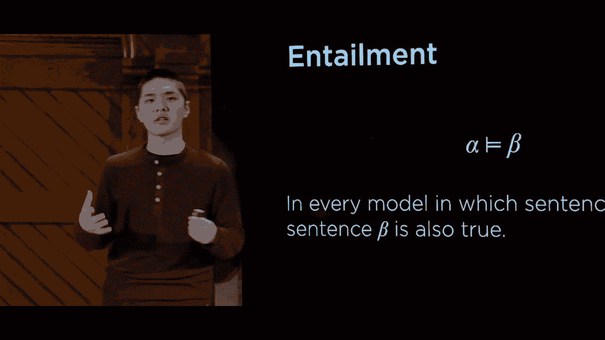

定义命题符号：
*   `P`: 今天下雨。
*   `Q`: 哈利拜访海格。
*   `R`: 哈利拜访邓布利多。

将知识输入知识库 `KB`：
1.  `¬P → Q` （如果不下雨，则哈利拜访海格）
2.  `(Q ∨ R) ∧ ¬(Q ∧ R)` （哈利拜访了海格或邓布利多，但非两者）
3.  `R` （哈利拜访了邓布利多）

现在，AI可以从 `KB` 进行推理：
*   从句子2和3可知，既然 `R` 为真，且不能同时为真，则 `Q` 必须为假。所以推导出：`¬Q`（哈利没拜访海格）。
*   将 `¬Q` 与句子1结合：句子1 `¬P → Q` 只有在前提 `¬P` 为真时，才要求 `Q` 为真。但现在我们知道 `Q` 为假，因此前提 `¬P` 不可能为真（否则会矛盾）。所以推导出：`P`（今天下雨）。

通过这个过程，AI得出了 `¬Q` 和 `P` 这两个新的结论，它们都被 `KB` 所蕴涵。

---

本节课中我们一起学习了知识型AI的基础。我们介绍了**命题逻辑**作为表示知识的语言，包括命题符号和五种逻辑联结词。我们理解了**模型**如何定义可能的世界，**知识库**如何存储AI已知的信息，以及**蕴涵**如何定义逻辑结论。最后，我们通过一个实例演示了如何基于知识库进行逐步推理。在接下来的课程中，我们将探讨让计算机自动执行这种推理的算法。