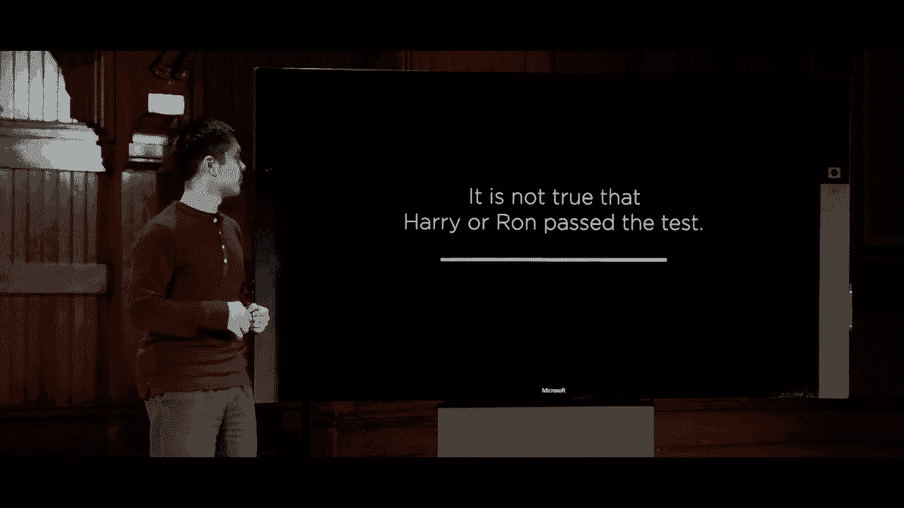
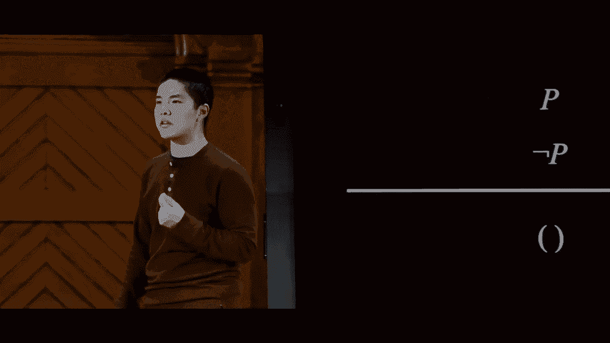
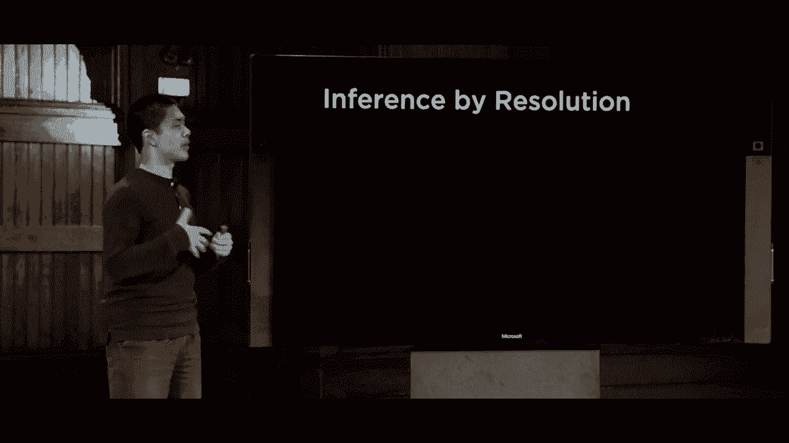
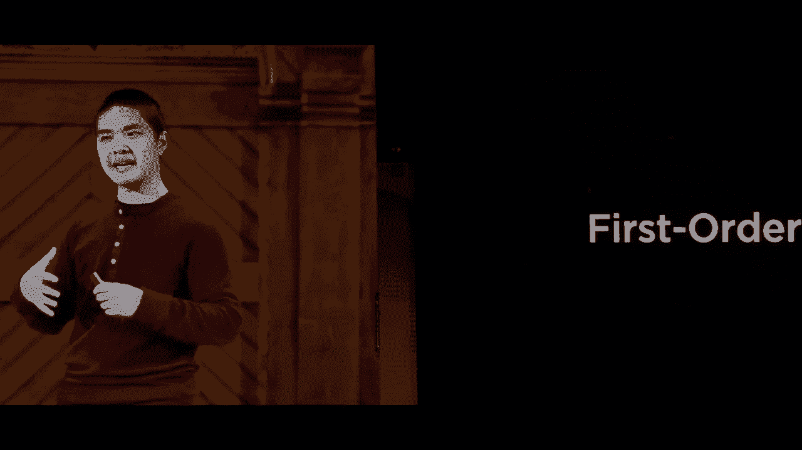
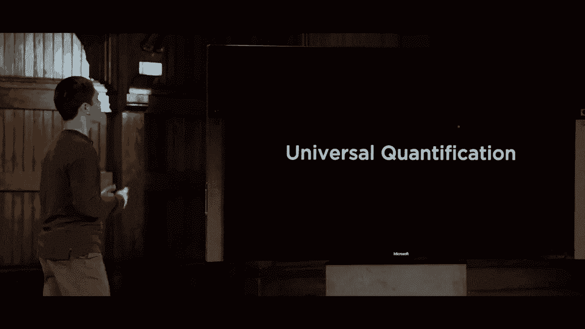
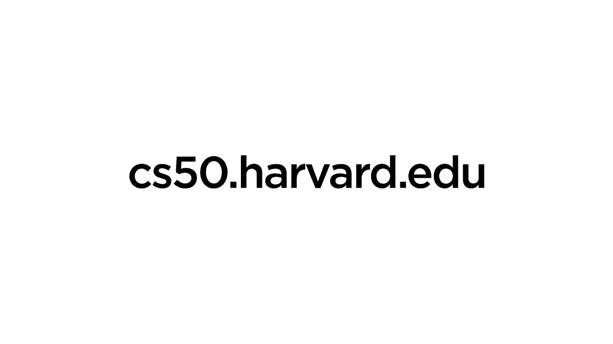

# 哈佛 CS50-AI 7：L1-知识系统知识 3 (推断规则，解析) 📚

在本节课中，我们将要学习知识系统中的核心推理方法。我们将从基础的**推断规则**开始，了解如何从已有知识推导出新知识。接着，我们将探索一种强大的推理算法——**归结**，并学习如何将逻辑语句转换为标准形式以应用该算法。最后，我们会简要介绍比命题逻辑更强大的**一阶逻辑**，它如何帮助我们更简洁地表达复杂关系。

## 推断规则 🔍

推断规则是一种可以应用的逻辑规则，它能将已有的知识转化为新的知识形式。其通用结构是：一条水平线上方是已知为真的**前提**，下方则是应用逻辑后能够得出的**结论**。

上一节我们介绍了知识表示的基础，本节中我们来看看如何运用规则进行推理。我们将首先用英语展示这些规则，然后将其翻译到命题逻辑的世界中。

### 前件肯定 (Modus Ponens)

假设我们有两条信息：“如果下雨，那么哈利在里面”和“现在在下雨”。我们可以合理地得出结论：“哈利必须在里面”。

这条推断规则在逻辑中更正式的表述是：如果我们知道 **α → β**（如果 α 为真，那么 β 为真），并且我们也知道 **α** 为真，那么我们可以得出结论 **β** 也为真。

这与模型检查的方法完全不同。模型检查是查看所有可能的世界，而推断规则是基于已知的知识直接进行推导。

### 与消除 (And-Elimination)

例如，根据“哈利是罗恩和赫敏的朋友”这条信息，我们可以合理地得出“哈利是赫敏的朋友”。

这条规则的形式是：如果我们知道 **α ∧ β**（α 和 β 都为真），那么我们可以得出结论 **α** 为真，或者 **β** 为真。虽然这对人类来说显而易见，但计算机需要被告知这种规则才能应用。

### 双重否定消去 (Double Negation Elimination)

如果“哈利没有通过测试”这个说法是假的，那么合理的结论是“哈利通过了测试”。

其形式是：如果前提是 **¬(¬α)**，那么我们可以得出结论 **α** 为真。

### 蕴含消去 (Implication Elimination)

如果我知道“如果下雨，那么哈利在里面”，那么我可以得出结论：“要么没有下雨，要么哈利在里面”。

更正式地说，如果我有一个蕴含关系 **α → β**，那么我可以得出结论 **¬α ∨ β**。这是一种将“如果-那么”语句转换为“或”语句的方法。

### 双条件消去 (Biconditional Elimination)

“当且仅当哈利在里面，那么下雨”意味着两个方向的蕴含：如果下雨则哈利在里面，并且如果哈利在里面则下雨。

我可以将双条件 **A ↔ B** 翻译成 **(A → B) ∧ (B → A)**。

### 德摩根定律 (De Morgan‘s Laws)

以下是德摩根定律的应用示例：

*   **与转或**：如果说“并非（哈利和罗恩都通过了测试）”，那么结论是“要么哈利没有通过，要么罗恩没有通过”。形式为：**¬(α ∧ β)** 等价于 **¬α ∨ ¬β**。
*   **或转与**：如果说“并非（哈利或罗恩通过了测试）”，那么结论是“哈利没有通过测试，并且罗恩也没有通过测试”。形式为：**¬(α ∨ β)** 等价于 **¬α ∧ ¬β**。

### 分配律 (Distributive Laws)

分配律允许我们在逻辑表达式中重新分配操作符。

*   **与分配到或**：**α ∧ (β ∨ γ)** 等价于 **(α ∧ β) ∨ (α ∧ γ)**。
*   **或分配到与**：**α ∨ (β ∧ γ)** 等价于 **(α ∨ β) ∧ (α ∨ γ)**。

## 将推理视为搜索问题 🧩

现在的问题是，我们如何使用这些推理规则来证明某些结论？我们可以将定理证明视为一种**搜索问题**。

*   **初始状态**：我们开始时的知识库，即所有已知句子的集合。
*   **行动**：在任何时候可以应用的推理规则。
*   **转移模型**：应用推理规则后，得到的新知识集合（旧知识加上新推导出的结论）。
*   **目标测试**：检查我们想要证明的陈述是否已出现在知识库中。
*   **路径成本**：试图最小化证明中所用推理规则的步骤数量。

这样，我们就能运用解决迷宫或路径规划等搜索问题的思路，来证明关于知识的定理。

## 归结推理 ⚙️

除了上述规则，还有一种更强大、更常见的推理方法，称为**归结**。它基于一条核心的推理规则。

### 单元归结 (Unit Resolution)

假设我知道“要么罗恩在大礼堂，要么赫敏在图书馆”，并且我还知道“罗恩不在大礼堂”。那么我可以得出结论“赫敏必须在图书馆”。

规则形式是：如果我们有 **P ∨ Q** 并且有 **¬P**，那么我们可以得出结论 **Q**。

### 完全归结 (Full Resolution)

这是单元归结的推广。假设我知道“要么罗恩在大礼堂，要么赫敏在图书馆”，并且我还知道“要么罗恩不在大礼堂，要么哈利在睡觉”。那么我可以得出结论“要么赫敏在图书馆，要么哈利在睡觉”。

规则形式是：如果我们有 **P ∨ Q** 并且有 **¬P ∨ R**，那么我们可以解决它们得到新的子句 **Q ∨ R**。

更一般地，如果我们有子句 **(P ∨ q1 ∨ q2 ∨ … ∨ qn)** 和 **(¬P ∨ r1 ∨ r2 ∨ … ∨ rm)**，我们可以归结得到 **(q1 ∨ q2 ∨ … ∨ qn ∨ r1 ∨ r2 ∨ … ∨ rm)**。

**定义**：
*   **文字**：一个命题符号或其否定（如 P, ¬Q）。
*   **子句**：多个文字的析取（通过“或”连接），例如 **P ∨ Q ∨ ¬R**。
*   **合取范式**：多个子句的合取（通过“和”连接）。例如：**(A ∨ B ∨ C) ∧ (D ∨ ¬E) ∧ (F ∨ G)**。

任何逻辑句子都可以转换为合取范式（CNF），这使得应用归结规则变得容易。

### 转换为合取范式 (CNF) 的步骤

将逻辑公式转换为 CNF 的过程如下：

1.  **消除条件句和双条件句**：使用推理规则将 **→** 和 **↔** 转换为只包含 **∧, ∨, ¬** 的表达式。
    *   **α → β** 变为 **¬α ∨ β**
    *   **α ↔ β** 变为 **(¬α ∨ β) ∧ (¬β ∨ α)**
2.  **将否定移入**：使用德摩根定律，确保 **¬** 只直接出现在文字前。
    *   **¬(α ∧ β)** 变为 **¬α ∨ ¬β**
    *   **¬(α ∨ β)** 变为 **¬α ∧ ¬β**
3.  **使用分配律**：分配 **∨** 到 **∧** 上，确保最终形式是子句的合取。
    *   **α ∨ (β ∧ γ)** 变为 **(α ∨ β) ∧ (α ∨ γ)**

**示例**：将 **(P ∨ Q) → R** 转换为 CNF。
1.  消除蕴含：**¬(P ∨ Q) ∨ R**
2.  德摩根定律：**(¬P ∧ ¬Q) ∨ R**
3.  分配律：**(¬P ∨ R) ∧ (¬Q ∨ R)** （这就是 CNF）

### 归结算法与反证法

我们如何用归结来证明知识库（KB）蕴含某个查询（α）？我们使用**反证法**。

1.  假设查询为假：将 **¬α** 加入知识库。
2.  将整个知识库（KB ∧ ¬α）转换为合取范式（CNF），得到一组子句。
3.  重复以下步骤，直到无法生成新的子句或出现矛盾：
    *   选择两个包含互补文字的子句（例如一个子句有 **P**，另一个有 **¬P**）。
    *   对它们应用归结规则，生成一个新的子句（即消去互补对，合并剩余文字）。
    *   如果新子句包含重复文字，进行**因式分解**去除重复。
    *   将新子句加入子句集。
4.  **如果生成了空子句**（即归结出 **P** 和 **¬P**，得到什么都没有），说明出现了矛盾。根据反证法，原假设 **¬α** 不成立，因此 **KB ⊨ α**（知识库蕴含α）。
5.  如果无法再生成新子句且未出现空子句，则知识库不蕴含该查询。

**空子句**代表**假**（False），因为它源于不可能同时成立的 **P** 和 **¬P**。

**示例**：证明知识库 `(A ∨ B), (¬B ∨ C), (¬C)` 蕴含 `A`。
1.  将 `¬A` 加入知识库，得到子句集：`{A ∨ B, ¬B ∨ C, ¬C, ¬A}`。
2.  归结 `¬B ∨ C` 和 `¬C`，得到新子句 `¬B`。
3.  归结 `A ∨ B` 和 `¬B`，得到新子句 `A`。
4.  归结 `A` 和 `¬A`，得到**空子句**。
5.  因此，出现矛盾，原知识库蕴含 `A`。

## 一阶逻辑简介 🌉

命题逻辑用符号表示原子事实，但在表达复杂关系时可能显得冗长。一阶逻辑提供了更强大的表达工具。

**核心组件**：
*   **常量符号**：代表特定对象（如 `Minerva`, `Gryffindor`）。
*   **谓词符号**：代表对象之间的关系或属性，其值为真或假（如 `Person(Minerva)`, `House(Gryffindor)`）。
*   **量词**：允许我们表达关于“某些”或“所有”对象的陈述。
    *   **全称量词 ∀**：“对于所有...”。例如：`∀x (BelongsTo(x, Gryffindor) → ¬BelongsTo(x, Hufflepuff))` 意为“所有属于格兰芬多的人都不属于赫奇帕奇”。
    *   **存在量词 ∃**：“存在...”。例如：`∃x (House(x) ∧ BelongsTo(Minerva, x))` 意为“存在一个学院，米涅瓦属于它”（即米涅瓦属于某个学院）。

通过结合常量、谓词和量词，一阶逻辑可以用更少的符号更自然地表达诸如“每个人都属于一个学院”这样的复杂思想：`∀x (Person(x) → ∃y (House(y) ∧ BelongsTo(x, y)))`。

## 总结 📝

本节课中我们一起学习了知识推理的核心方法。我们首先了解了多种基础的**推断规则**，如前件肯定、与消除等，它们是将已知知识转化为新知识的工具。接着，我们探讨了如何将逻辑证明视为**搜索问题**。

然后，我们深入学习了强大的**归结推理**算法，包括如何将逻辑语句转换为**合取范式**，以及如何通过**反证法**和归结规则来证明一个查询是否被知识库所蕴含。

最后，我们简要介绍了**一阶逻辑**，它通过引入常量、谓词和量词，克服了命题逻辑在表达复杂关系时的局限性，为知识表示提供了更丰富、更简洁的语言。

所有这些技术都旨在让AI智能体能够有效地表示知识，并进行逻辑推理，从而得出新的结论。在接下来的课程中，我们将探索当知识具有不确定性时，如何让AI进行推理。