# 哈佛 CS50-AI 8：L2- 不确定性 1 (概率模型，条件概率，随机变量，贝叶斯规则) 🎲

在本节课中，我们将要学习人工智能如何处理不确定性。我们将探讨概率论的基础概念，包括概率模型、条件概率、随机变量以及贝叶斯规则。这些工具将帮助我们的人工智能在信息不完整或不确定的情况下，依然能够进行推理和决策。

## 📊 概率模型与基础概念

上一节我们讨论了AI如何用逻辑句子表示知识。然而，现实世界充满了不确定性。我们的机器很少能完全确定某件事。概率论为我们提供了一种量化不确定性的数学框架。

概率最终归结为“可能世界”的观点。我们用希腊字母 **Ω** 表示所有可能世界的集合。每个可能世界都有一定的发生概率。

我们用大写字母 **P** 表示概率，后面括号中放入我们想要的事件。例如，**P(ω)** 表示可能世界 **ω** 发生的概率。

以下是概率论的两个基本公理：

1.  **概率值范围**：每个概率值必须在 **0** 到 **1** 之间（包含两端）。
    *   **0** 代表不可能发生的事件。例如，掷一个标准骰子，结果为 **7** 的概率是 **0**。
    *   **1** 代表必然发生的事件。例如，掷一个标准骰子，结果小于 **10** 的概率是 **1**。
2.  **概率总和**：所有可能世界的概率之和等于 **1**。用公式表示为：
    **∑_{ω∈Ω} P(ω) = 1**

例如，对于一个公平的六面骰子，每个面朝上的概率是 **1/6**。所有概率（1/6 + 1/6 + ... + 1/6）之和正好为 **1**。

## 🎯 条件概率

无条件概率是我们在没有任何额外证据的情况下，对某个命题的信念程度。但在现实中，我们通常拥有一些已知信息。**条件概率** 就是给定某些证据（已知信息）后，某个事件发生的概率。

条件概率的符号是 **P(A | B)**，读作“在 **B** 发生的条件下 **A** 发生的概率”。其中 **A** 是我们关心的事件，**B** 是我们的证据。

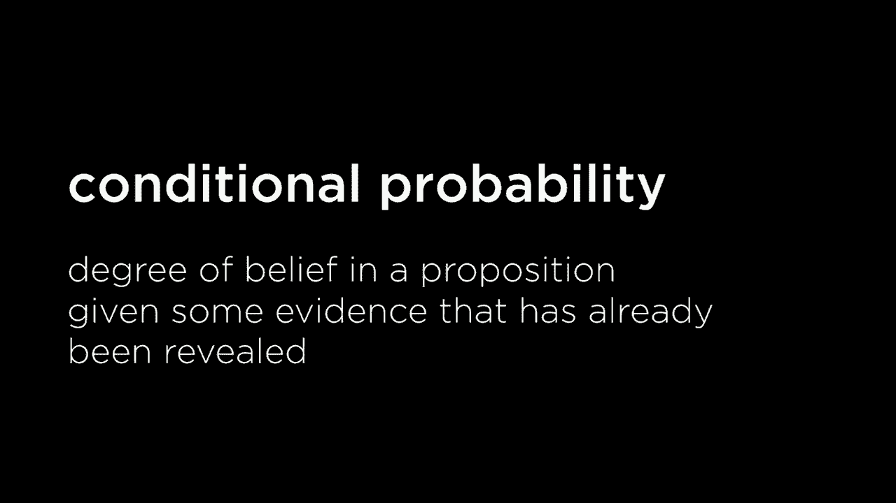

例如：
*   **P(今天下雨 | 昨天下雨)**：在已知昨天下雨的条件下，今天下雨的概率。
*   **P(患者患病 | 检测阳性)**：在已知检测结果为阳性的条件下，患者患病的概率。

条件概率的**计算公式**如下：
**P(A | B) = P(A ∧ B) / P(B)**

这个公式直观地理解为：在 **B** 已经发生的所有可能情况中，**A** 也发生的情况所占的比例。

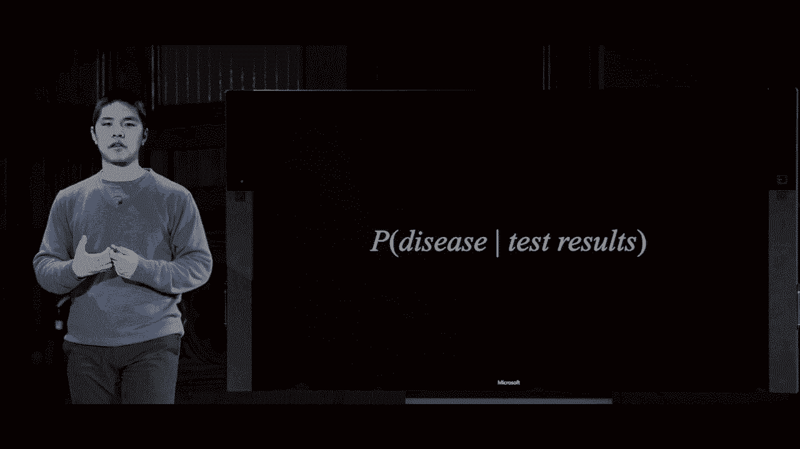

让我们看一个掷两个骰子的例子。假设我们想知道两个骰子点数之和为 **12** 的概率，已知红色骰子的点数是 **6**。
*   **P(红骰=6)** = 1/6
*   **P(和=12 ∧ 红骰=6)** = 1/36 （只有红6蓝6这一种情况）
*   因此，**P(和=12 | 红骰=6) = (1/36) / (1/6) = 1/6**

这个结果很直观：已知红骰是6，和要为12，蓝骰也必须为6，而蓝骰为6的概率正是1/6。

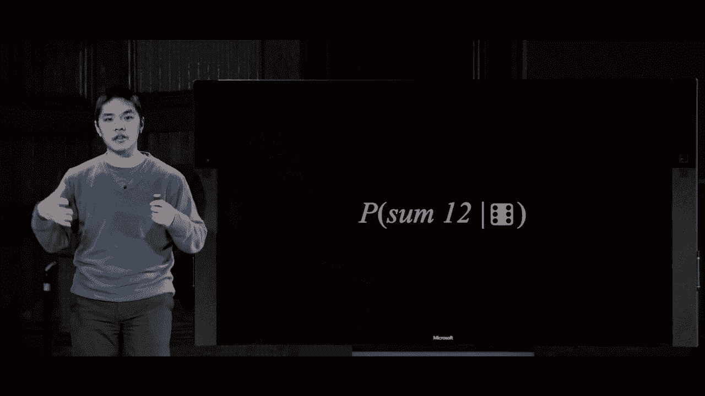

## 🔢 随机变量与概率分布

我们不仅关心事件是否发生，有时还需要表示具有多个可能取值的变量。在概率论中，这称为**随机变量**。

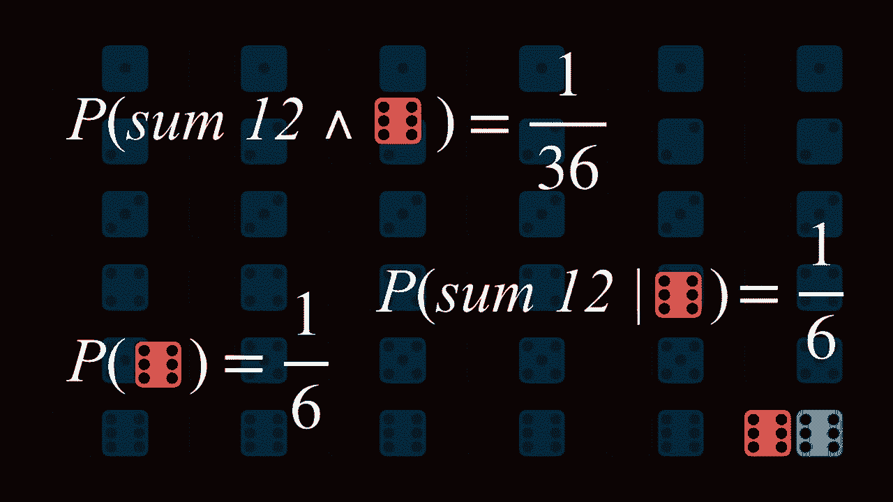

随机变量是一个变量，它有一定范围的**可能取值**。
*   例如，随机变量 **天气** 的可能取值是：{晴天， 阴天， 雨天， 刮风， 下雪}。
*   随机变量 **交通** 的可能取值是：{畅通， 缓行， 拥堵}。

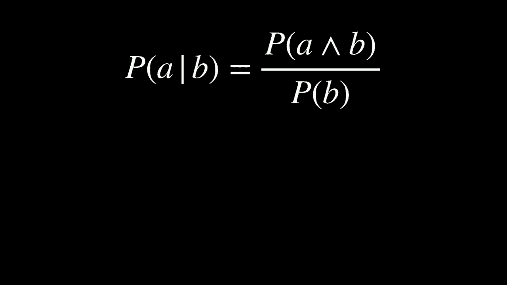

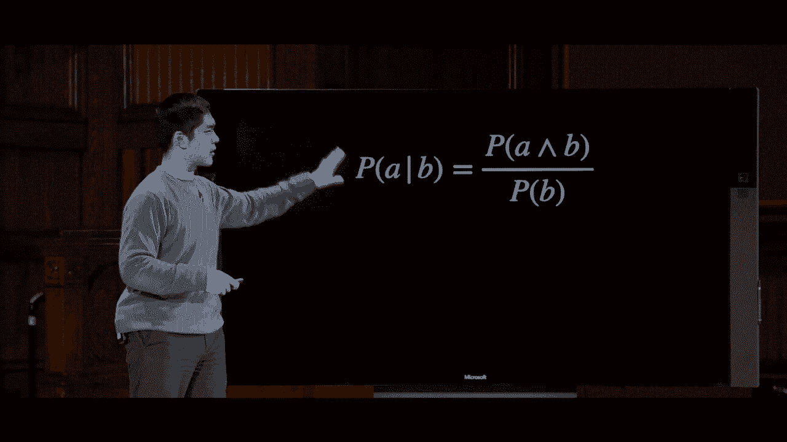

**概率分布** 将随机变量的每个可能取值与其发生的概率对应起来。

例如，对于随机变量 **航班状态**，其概率分布可能如下：
*   **P(航班状态 = 按时)** = 0.6
*   **P(航班状态 = 延误)** = 0.3
*   **P(航班状态 = 取消)** = 0.1

所有可能取值的概率之和为 **1** (0.6 + 0.3 + 0.1 = 1)。

有时我们会用更简洁的**向量符号**来表示概率分布：
**P(航班状态) = <0.6, 0.3, 0.1>**
这个向量按顺序表示了“按时”、“延误”、“取消”的概率。

## 🔗 独立性与贝叶斯规则

### 独立性
如果知道一个事件的发生**不会影响**另一个事件发生的概率，则称这两个事件**相互独立**。

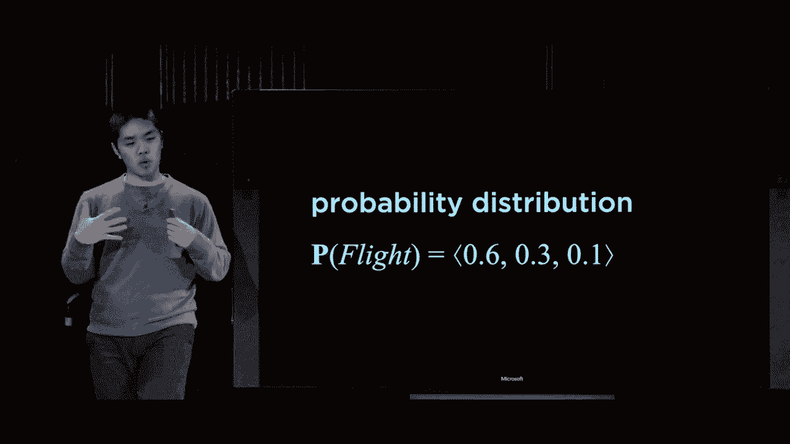

数学上，事件 **A** 和 **B** 独立当且仅当：
**P(A ∧ B) = P(A) * P(B)**

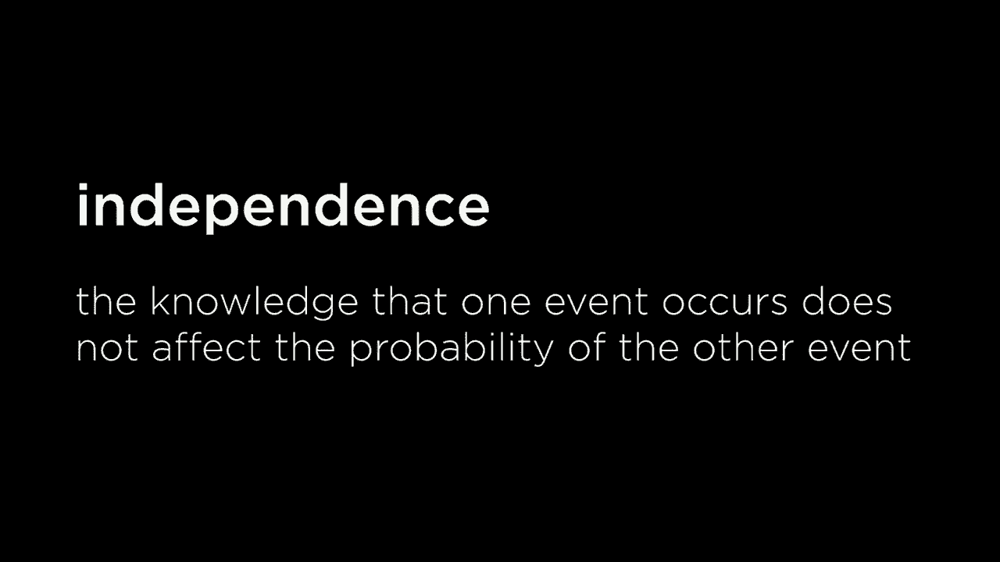

例如，掷一次红色骰子和掷一次蓝色骰子的结果是独立的。知道红骰的结果不会改变蓝骰结果的概率。
*   **P(红骰=6 ∧ 蓝骰=6) = P(红骰=6) * P(蓝骰=6) = (1/6)*(1/6) = 1/36**

不独立的例子：对于同一个红色骰子的一次投掷，“掷出6”和“掷出4”是互斥的，不独立。
*   **P(红骰=6 ∧ 红骰=4) = 0**，但 **P(红骰=6) * P(红骰=4) = 1/36**，两者不相等。

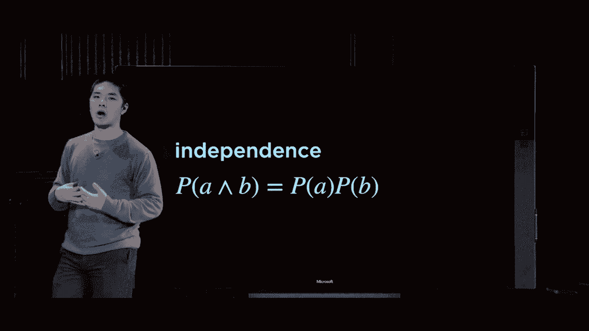

### 贝叶斯规则
贝叶斯规则是概率论中一个极其重要的定理，它描述了如何利用“反向”的条件概率来更新我们的信念。

我们可以从条件概率的定义推导出贝叶斯规则：
1.  由定义：**P(A ∧ B) = P(B) * P(A | B)**
2.  同样，交换A和B：**P(A ∧ B) = P(A) * P(B | A)**
3.  令两个等式右侧相等：**P(B) * P(A | B) = P(A) * P(B | A)**
4.  两边同时除以 **P(A)**，得到**贝叶斯规则**：
    **P(B | A) = [P(A | B) * P(B)] / P(A)**

**贝叶斯规则的意义**在于，它允许我们通过更容易获得或理解的概率 **P(A | B)**，来计算我们更关心的概率 **P(B | A)**。

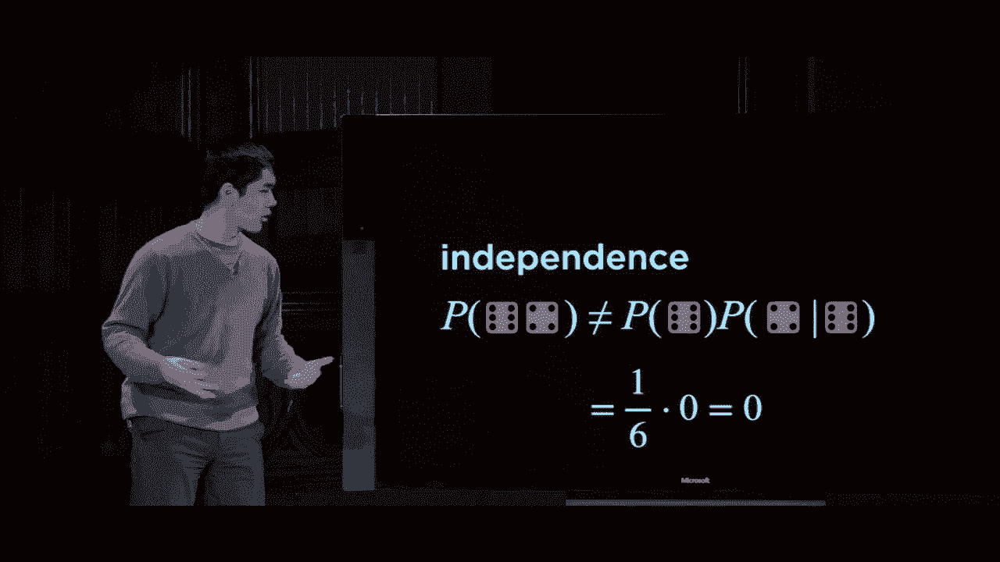

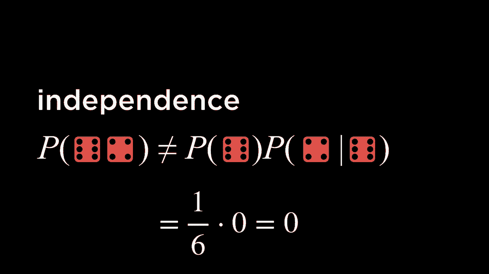

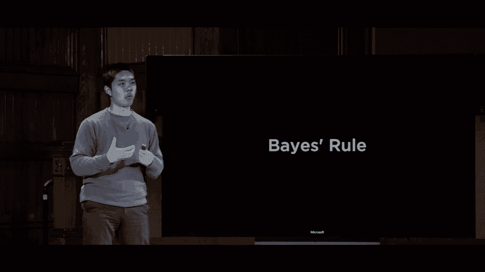

让我们看一个天气预测的例子：
*   已知信息：
    *   80%的雨天下午，其早晨是多云的：**P(早晨多云 | 下午下雨) = 0.8**
    *   40%的早晨是多云的：**P(早晨多云) = 0.4**
    *   10%的日子下午会下雨：**P(下午下雨) = 0.1**
*   问题：如果早晨多云，下午下雨的概率是多少？即求 **P(下午下雨 | 早晨多云)**。

应用贝叶斯规则：
**P(下雨 | 多云) = [P(多云 | 下雨) * P(下雨)] / P(多云)**
**= [0.8 * 0.1] / 0.4 = 0.08 / 0.4 = 0.2**

因此，在早晨多云的情况下，下午下雨的概率是 **20%**。

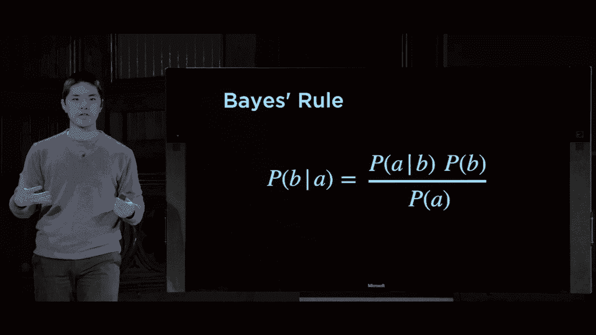

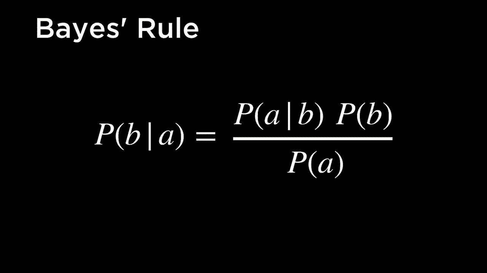

贝叶斯规则在医学诊断、垃圾邮件过滤、机器学习等众多领域都有广泛应用。它帮助我们在观察到结果（如检测报告、邮件特征）后，推断其原因（如是否患病、是否为垃圾邮件）的可能性。

## 📝 总结

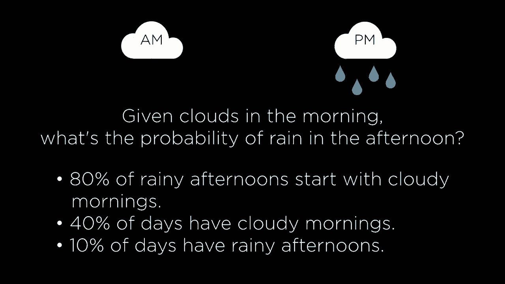

本节课中我们一起学习了处理不确定性的概率论基础。

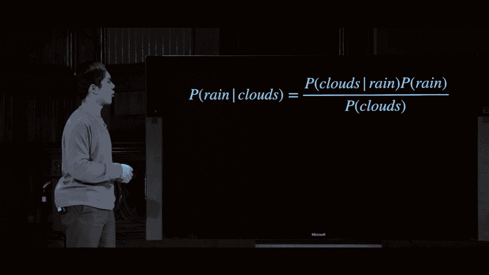

我们首先了解了**概率模型**，它用可能世界和概率公理来描述不确定性。接着，我们学习了**条件概率 P(A | B)**，它量化了在已知证据 **B** 的情况下，事件 **A** 发生的可能性。

为了更结构化地表示具有多种结果的不确定性，我们引入了**随机变量**和**概率分布**的概念。然后，我们探讨了事件间的**独立性**，即一个事件的发生是否影响另一个事件。

最后，我们推导并应用了强大的**贝叶斯规则**。这个规则使我们能够利用一种条件概率（如“假设原因，观察结果的概率”）来计算其反向的条件概率（如“观察到结果，推断原因的概率”），这是进行不确定性推理的核心工具。

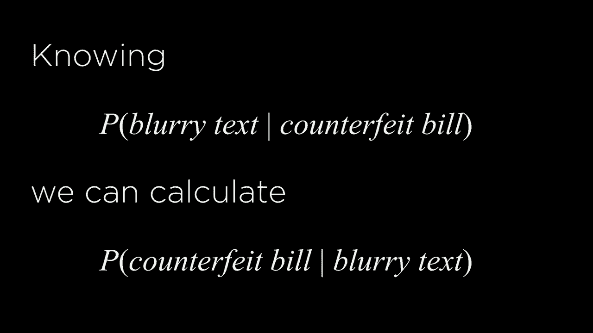

掌握这些概念是构建能够在不完美信息下进行智能推理的人工智能系统的第一步。在接下来的课程中，我们将看到如何将这些概率工具应用于更复杂的AI模型和算法中。