 # 哈佛CS50-AI 10：L2- 不确定性 3 (采样，马尔可夫，HMM) 🧠

## 📖 概述
在本节课中，我们将学习如何通过**采样**技术来近似计算复杂概率模型中的概率，并介绍两种重要的时序概率模型：**马尔可夫链**和**隐马尔可夫模型**。这些模型是处理随时间变化的不确定性问题的强大工具。

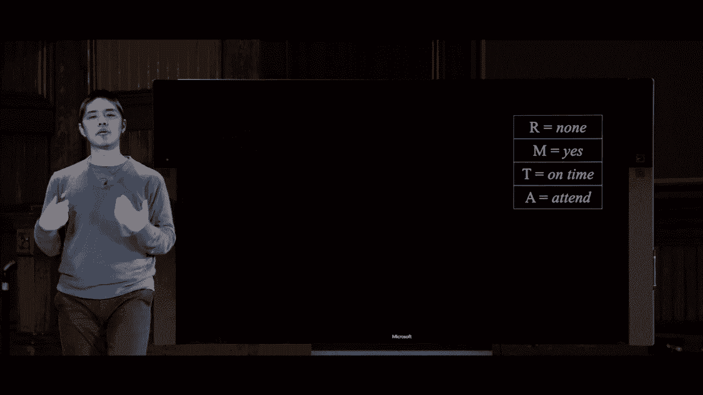

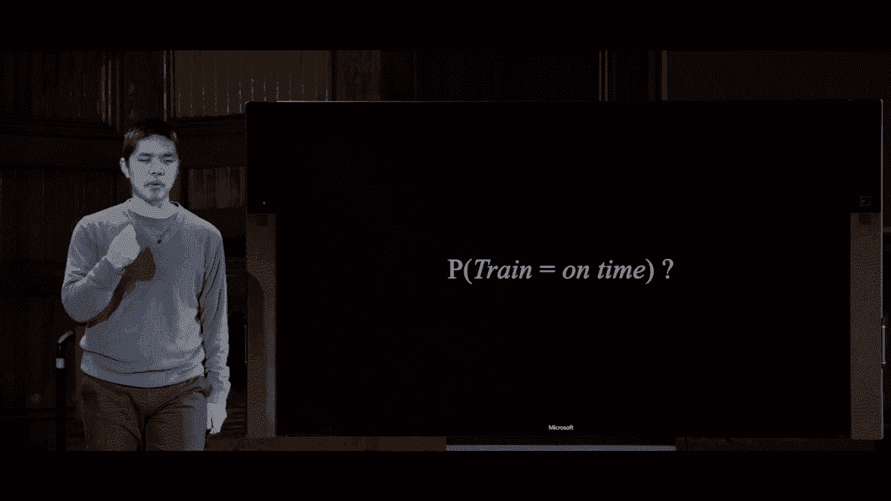

---

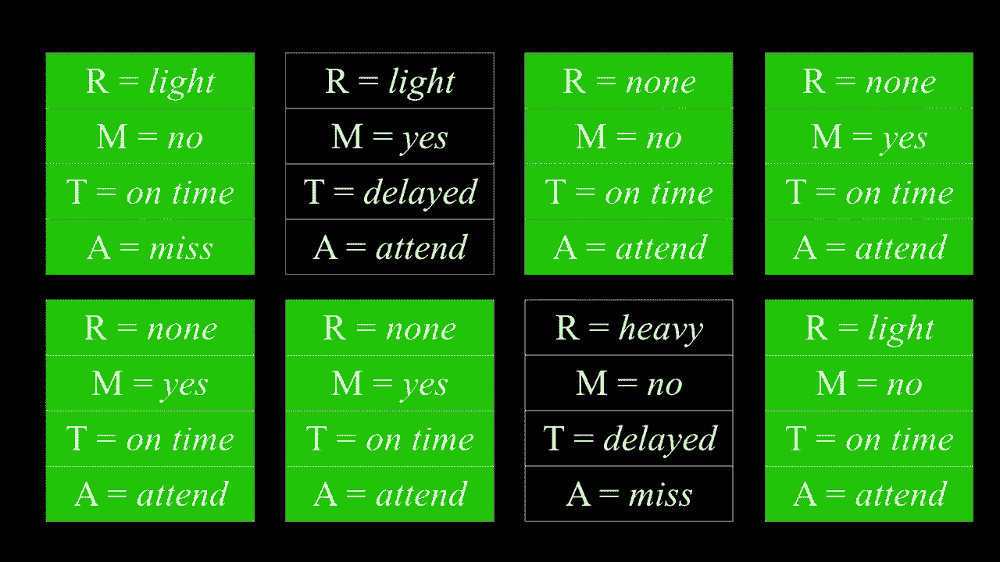

## 🔄 采样：一种近似推理方法
上一节我们介绍了贝叶斯网络和精确推理。然而，当网络复杂时，精确计算可能非常耗时。本节中，我们来看看如何通过**采样**来高效地近似概率。

采样是指按照概率分布，为网络中的每个变量随机生成一个值，从而得到一个可能世界的“样本”。通过生成大量样本，我们可以用样本中事件发生的频率来近似其概率。

以下是进行采样的基本步骤：

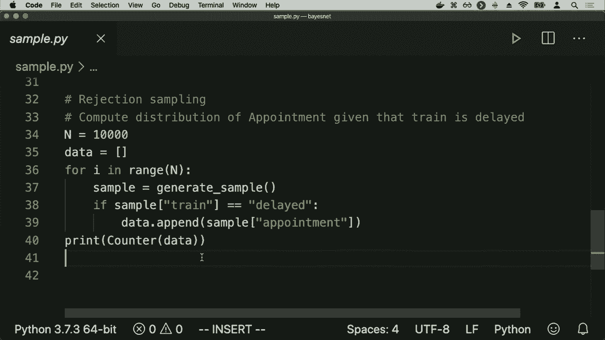

1.  **从根节点开始**：对于没有父节点的变量，根据其无条件概率分布进行抽样。
2.  **按拓扑顺序抽样**：对于有父节点的变量，根据其父节点的当前取值，从其条件概率分布中进行抽样。
3.  **重复生成**：重复以上过程成千上万次，生成大量样本。

例如，在一个关于天气和交通的贝叶斯网络中，我们可能先根据 `P(雨)` 抽样得到“无雨”，然后根据“无雨”这个条件从 `P(维护 | 无雨)` 中抽样得到“是”，以此类推，最终得到一个完整的样本 `{雨=无， 维护=是， 火车=准时， 约会=出席}`。

### 📊 通过样本进行概率推断
生成大量样本后，我们可以通过统计来回答概率查询。

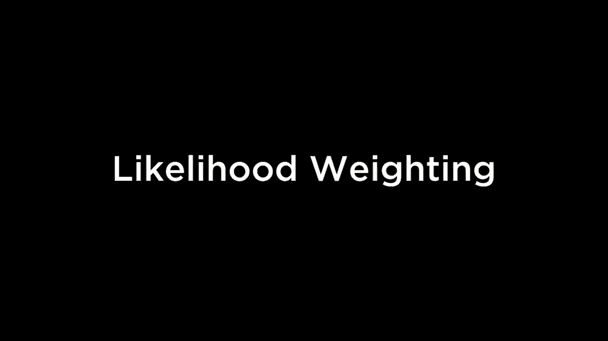

*   **无条件概率**：例如，要计算火车准时的概率 `P(火车=准时)`，只需统计所有样本中“火车=准时”出现的频率。
*   **条件概率**：例如，要计算在已知火车准时的条件下有小雨的概率 `P(雨=小雨 | 火车=准时)`，我们需要使用**拒绝采样**。

### 🚫 拒绝采样
拒绝采样是计算条件概率的一种方法。其核心思想是：只保留那些与已知**证据**（如“火车=准时”）相符的样本，忽略（拒绝）所有不符合证据的样本。然后，在剩下的样本中统计我们关心的事件（如“雨=小雨”）发生的频率。

**公式表示**：
`P(雨=小雨 | 火车=准时) ≈ (满足“雨=小雨”且“火车=准时”的样本数) / (所有满足“火车=准时”的样本数)`

### ⚠️ 拒绝采样的效率问题
如果证据事件本身发生的概率很低（例如 `P(火车=延误)=0.01`），那么绝大多数样本都会被拒绝，导致计算效率低下。为了解决这个问题，可以采用**似然加权**等其他更高效的采样方法。

---

## ⏳ 处理随时间变化的不确定性：马尔可夫模型
到目前为止，我们处理的都是静态变量的概率。但在现实中，很多变量（如天气、股价）的状态会随时间变化。我们需要新的模型来处理这种**时序不确定性**。

### 🔗 马尔可夫链
马尔可夫链是描述一系列随机变量（如每日天气）的模型。它基于一个关键假设——**马尔可夫假设**：当前状态的概率分布只依赖于前一个状态，而与更早的历史无关。

**公式表示**：
`P(X_t | X_{t-1}, X_{t-2}, ...) = P(X_t | X_{t-1})`

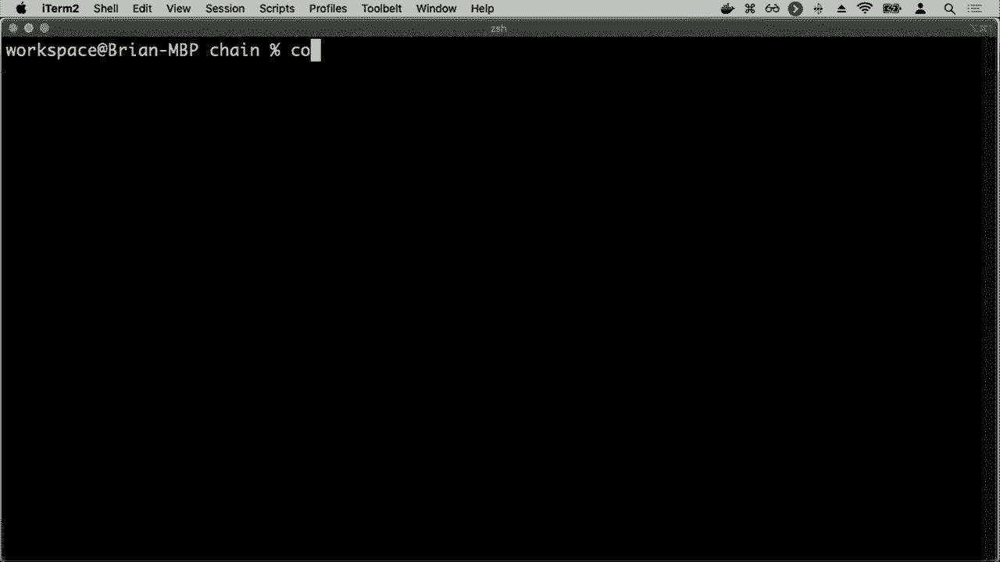

这个假设极大地简化了模型。我们只需要一个**转移矩阵**来描述从当前状态转移到下一个状态的概率。

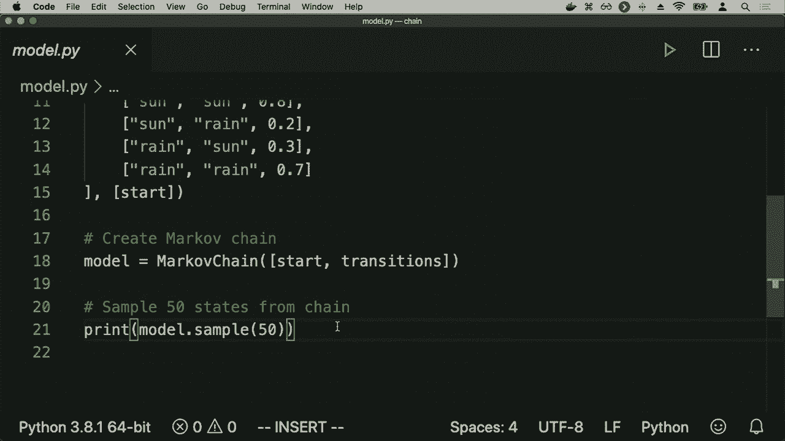

**转移矩阵示例（天气）**：

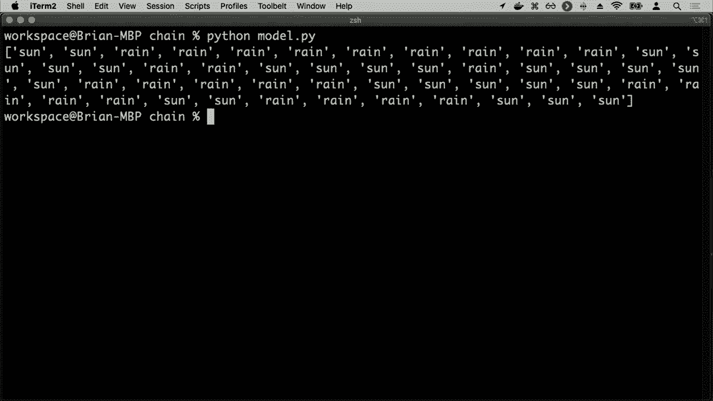

| 今天\明天 | 晴天 | 雨天 |
| :--- | :--- | :--- |
| **晴天** | 0.8 | 0.2 |
| **雨天** | 0.3 | 0.7 |

**代码描述**（使用伪代码）：
```python
# 转移矩阵
transition = {
    ‘晴天‘: {‘晴天‘: 0.8, ‘雨天‘: 0.2},
    ‘雨天‘: {‘晴天‘: 0.3, ‘雨天‘: 0.7}
}
# 给定今天是晴天，预测明天天气的分布
tomorrow_dist = transition[‘晴天‘] # {‘晴天‘: 0.8, ‘雨天‘: 0.2}
```

利用转移矩阵和初始状态分布，我们可以通过抽样来模拟一个状态序列（如：晴-晴-雨-雨-晴），这就是一个马尔可夫链。

---

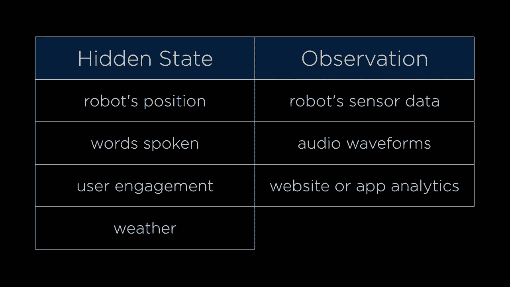

## 👁️ 当状态不可见时：隐马尔可夫模型
在马尔可夫链中，我们假设每个时间步的状态（如天气）是直接可知的。但现实中，我们往往只能观察到与隐藏状态相关的**证据**，而无法直接看到状态本身。

### 🕵️ 隐马尔可夫模型的核心思想
隐马尔可夫模型包含两层：
1.  **隐藏状态层**：我们真正关心但无法直接观测的变量序列（如真实的天气）。
2.  **观测层**：我们可以直接测量到的、由隐藏状态“发射”出来的证据序列（如人们是否带伞）。

HMM 由三部分组成：
*   **转移模型**：描述隐藏状态之间的转移概率（和马尔可夫链相同）。
*   **传感器模型（发射概率）**：描述在给定某个隐藏状态下，产生各个观测值的概率。
*   **初始状态分布**：起始时各个隐藏状态的概率。

**示例**：
*   **隐藏状态**：{晴天， 雨天}
*   **观测**：{带伞， 不带伞}
*   **传感器模型**：
    *   `P(带伞 | 晴天) = 0.2`
    *   `P(带伞 | 雨天) = 0.9`

### 🎯 HMM 能解决的任务
给定一系列观测值（如：伞， 伞， 无伞， 伞），HMM 可以帮助我们解决以下问题：

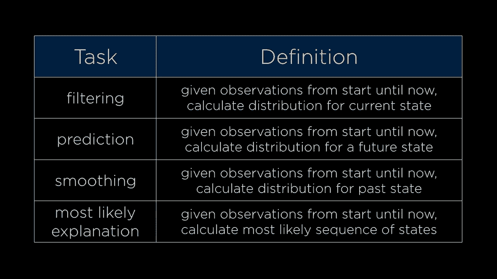

*   **滤波**：根据到目前为止的所有观测，估计当前隐藏状态的概率分布。
*   **预测**：根据到目前为止的所有观测，预测未来某个时刻的隐藏状态分布。
*   **平滑**：根据完整的观测序列，估计过去某个时刻的隐藏状态分布。
*   **最可能解释**：找出最有可能产生当前观测序列的隐藏状态序列。**这是语音识别等任务的核心**。

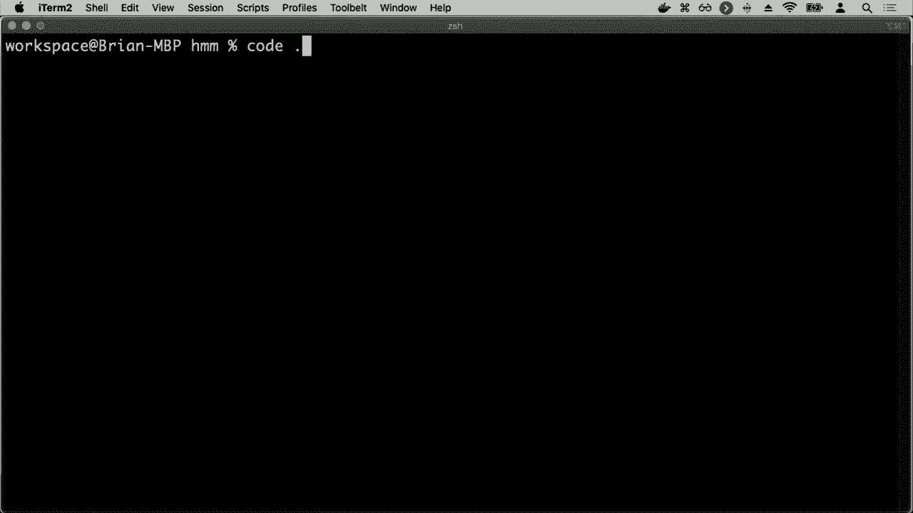

**最可能解释示例**：
观测序列：`[带伞， 带伞， 不带伞]`
最可能的状态序列可能是：`[雨天， 雨天， 晴天]`。HMM 算法（如维特比算法）可以高效地计算出这个序列。

---

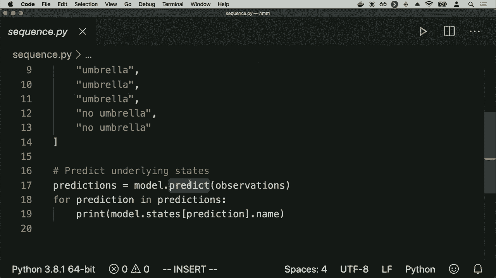

## 💎 总结
本节课中我们一起学习了处理不确定性的几种高级方法：

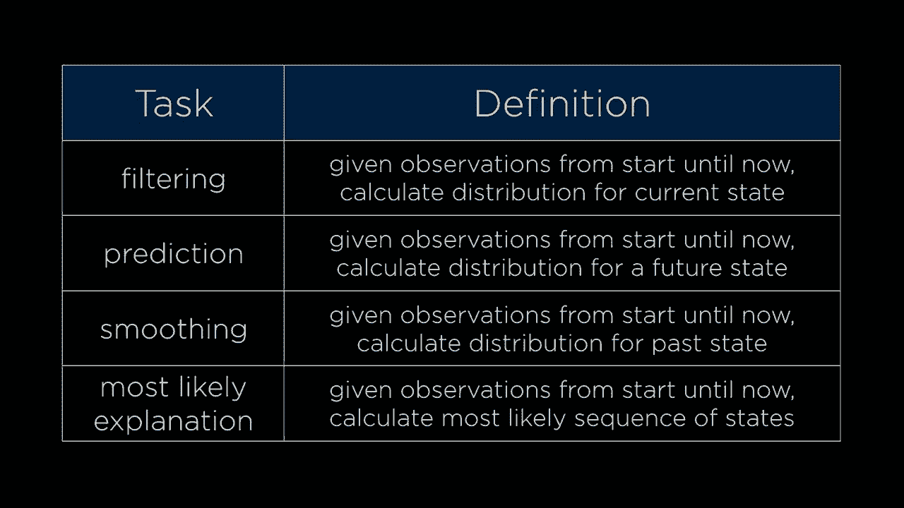

1.  **采样**：通过随机生成样本来近似计算概率，是解决复杂推理问题的有效且高效的方法，包括简单的抽样和用于条件概率的拒绝采样。
2.  **马尔可夫链**：基于“当前状态仅依赖于前一状态”的马尔可夫假设，用于建模随时间演变的随机过程。
3.  **隐马尔可夫模型**：在马尔可夫链的基础上，引入了不可见的隐藏状态和可见的观测证据。它是连接隐藏世界（如真实意图、单词）和可观测世界（如传感器数据、音频波形）的桥梁，是语音识别、生物信息学等领域的基石。

通过将这些现实问题表述为贝叶斯网络、马尔可夫链或 HMM，我们就可以利用现有的强大算法和 Python 库（如 `pomegranate`），让 AI 在信息不完整的情况下也能进行有效的推理和预测。