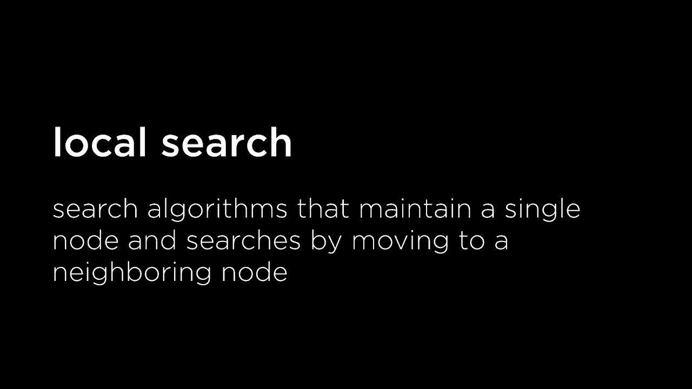
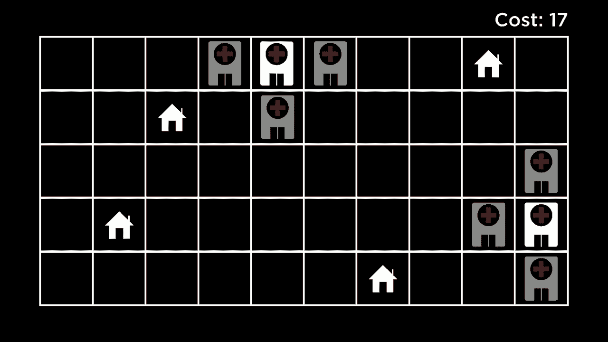
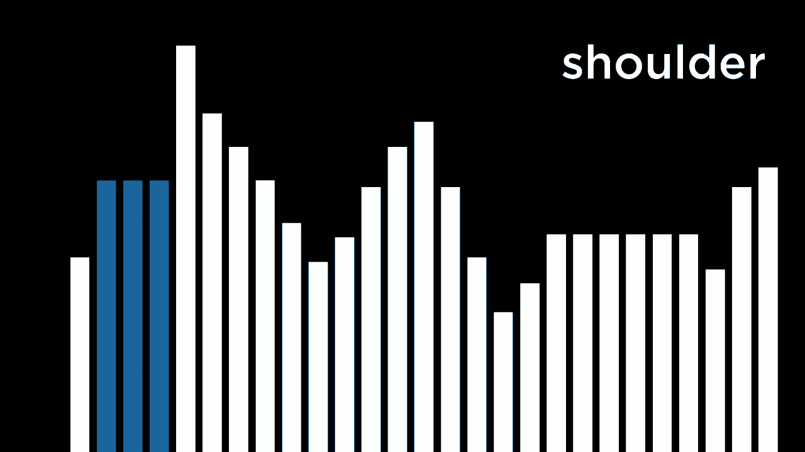
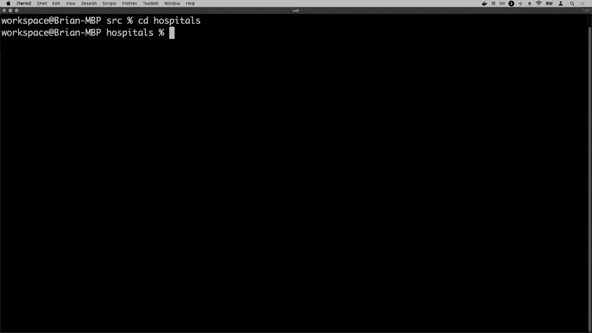
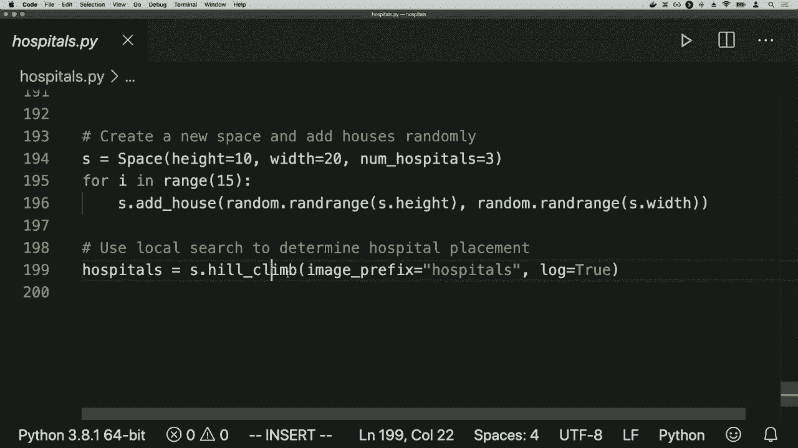
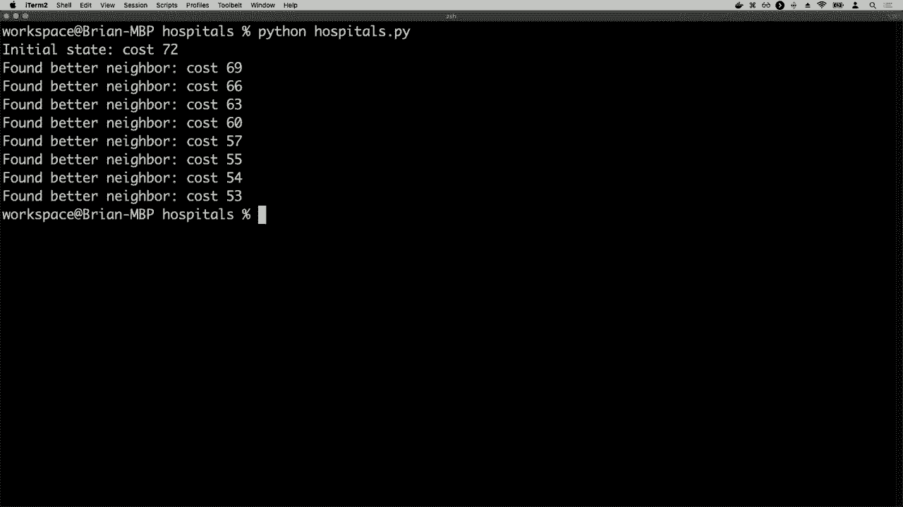
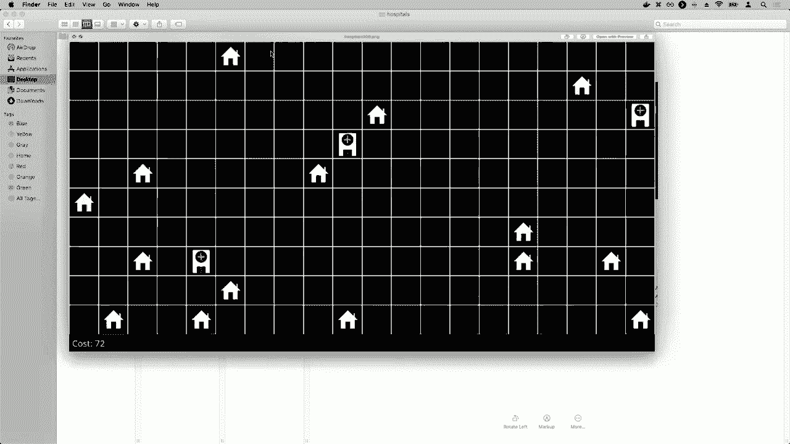
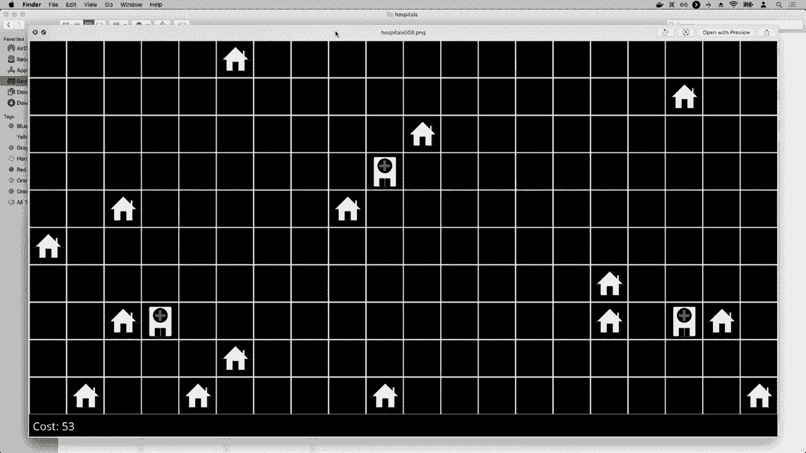
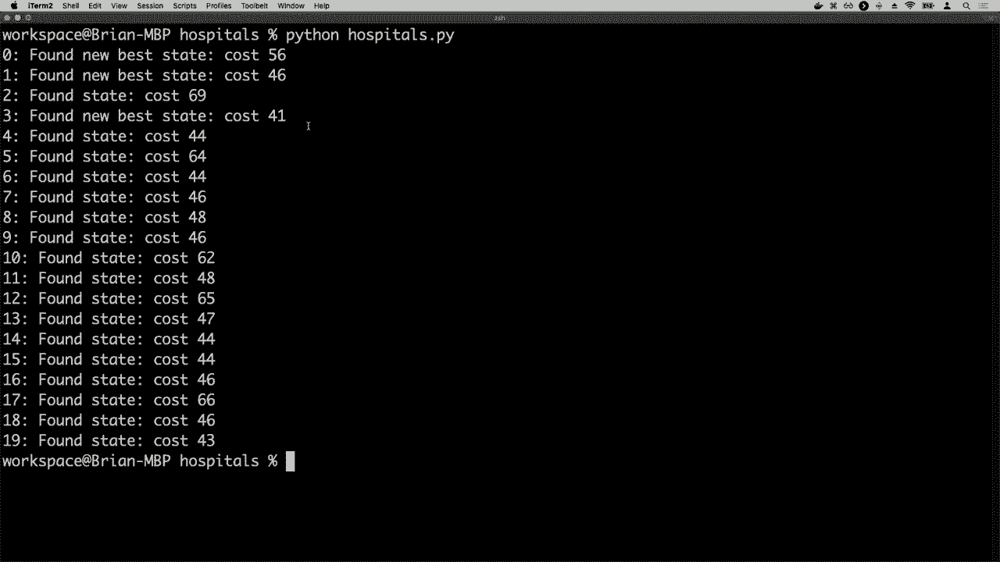
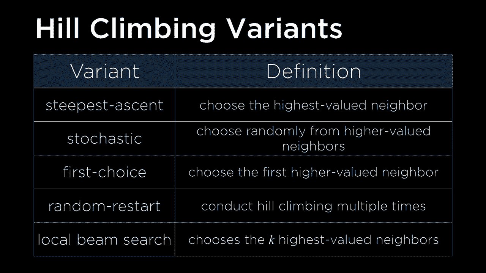

# 哈佛CS50-AI 11：L3- 优化算法 1 (优化，局部搜索，爬山算法) 🧗


在本节课中，我们将学习一类新的人工智能问题——**优化问题**。我们将了解什么是优化，并重点学习一种名为**局部搜索**的算法，特别是它的经典实现：**爬山算法**。我们会通过一个“医院选址”的例子来理解这些概念，并用Python代码进行实践。



## 概述：什么是优化问题？🎯

到目前为止，我们已经学习了几种不同类型的人工智能问题。我们看过经典的搜索问题，目标是找到从初始状态到目标状态的最佳路径。我们也学习了对抗性搜索，即游戏智能体试图做出最佳移动。此外，我们还接触了基于知识的推理和概率模型。

今天，我们将注意力转向**优化问题**。优化的核心是**从一组可能的选项中选出最佳选项**。我们已经在某些场景中见过优化的影子，比如在游戏中，AI需要从所有可能的移动中选出最佳的一步。但本节课，我们将系统地学习用于解决更广泛优化问题的算法。

我们将要学习的第一个算法是**局部搜索**。

## 局部搜索 vs. 传统搜索 🔄

局部搜索与我们之前学过的搜索算法（如广度优先搜索、A*搜索）有根本不同。

*   **传统搜索算法**：通常维护一个**路径集合**，同时探索多条路径以找到解决方案。它们关心的是**到达目标的路径**。
*   **局部搜索算法**：通常只维护**一个当前状态（节点）**，然后在整个搜索过程中将自己移动到**邻近的状态**。它**不关心路径**，只关心最终的**解决方案本身**。

局部搜索适用于那些“目标是什么”本身就是挑战核心的问题，而不仅仅是“如何到达目标”。例如，在迷宫问题中，目标（出口）是明确的，难点在于找路。但在优化问题中，难点在于找出那个“最佳”的目标状态。

## 示例：医院选址问题 🏥

为了理解局部搜索，我们来看一个具体问题：**医院选址**。

假设我们有一个网格世界，里面散布着一些房屋（例如下图中的H）。我们的目标是在这个地图上放置两家医院（例如下图中的1和2）。


我们的优化目标是：**最小化所有房屋到其最近医院的总距离**。我们可以使用**曼哈顿距离**（网格上的行列移动步数）来计算距离。

对于上图中的配置，我们可以计算每个房屋到最近医院的距离：
*   左上房屋 -> 医院1：距离3
*   左下房屋 -> 医院1：距离6
*   右上房屋 -> 医院2：距离4
*   右下房屋 -> 医院2：距离4

总成本 = 3 + 6 + 4 + 4 = **17**。

这个“总成本”就是我们衡量一个医院配置（即一个“状态”）好坏的指标。我们的任务就是搜索所有可能的医院摆放位置，找到总成本最低的那个配置。

## 状态空间与目标函数 📊

我们可以将这类问题抽象为在**状态空间**中搜索。

*   **状态**：一个可能的解决方案配置。例如，一种特定的医院摆放方式。
*   **状态空间**：所有可能状态的集合。
*   **成本函数 / 目标函数**：一个函数 `f(state)`，它给每个状态打分。在最小化问题中，我们称之为**成本函数**，值越低越好。在最大化问题中，我们称之为**目标函数**，值越高越好。

我们的目标就是：
*   **最小化问题**：找到**全局最小值**，即成本函数值最低的状态。
*   **最大化问题**：找到**全局最大值**，即目标函数值最高的状态。



局部搜索的策略是：从**一个当前状态**出发，查看它的**邻居状态**（即通过微小改动能得到的状态），然后决定移动到哪个邻居，如此反复，试图找到最优解。

## 爬山算法 🧗

**爬山算法**是实现局部搜索思想的最简单算法。它的思路非常直观：就像爬山一样，每次都往“更高”的方向走（对于最大化问题），或者往“更低”的方向走（对于最小化问题）。

### 算法思想

假设我们在解决一个**成本最小化**问题（寻找山谷的最低点）：
1.  从某个随机初始状态开始。
2.  查看当前状态的所有**邻居状态**。
3.  如果存在**成本更低**的邻居，则移动到**成本最低的那个邻居**（最陡下降）。
4.  重复步骤2-3。
5.  当**所有邻居的成本都不低于当前状态**时，算法停止。此时，我们认为找到了一个**局部最小值**。

对于**效益最大化**问题（寻找山峰的最高点），则每次移动到**效益最高的邻居**。

### 伪代码

以下是最大化问题的爬山算法伪代码：
```python
function hill_climb(problem):
    current = problem.initial_state  # 初始状态（可随机生成）
    while True:
        neighbors = get_neighbors(current)  # 获取所有邻居状态
        best_neighbor = max(neighbors, key=lambda state: value(state))  # 找出价值最高的邻居
        if value(best_neighbor) <= value(current):  # 如果没有更好的邻居
            return current  # 返回当前状态（局部最优）
        current = best_neighbor  # 否则，移动到更好的邻居
```

### 应用于医院问题

回到我们的医院问题，假设我们从一个随机配置开始（成本为17）。我们定义“邻居”为：**将任意一家医院向上、下、左、右移动一格**得到的新配置。

以下是算法可能采取的步骤：
1.  检查当前配置的所有邻居。
2.  发现将右侧医院向左移动一格，可以使总成本从17降低。
3.  移动到该邻居状态。
4.  继续检查新状态的邻居，可能发现将某家医院向下移动能进一步降低成本。
5.  重复此过程，直到某个状态的所有邻居都无法提供更低的成本（例如成本降至11）。算法在此停止。




## 爬山算法的局限性：局部最优 😰

然而，爬山算法有一个主要缺陷：它很容易陷入**局部最优解**，而错过**全局最优解**。

*   **局部最大值/最小值**：一个状态，其值比所有**直接邻居**都高/低，但在整个状态空间中并非最高/最低。
*   **全局最大值/最小值**：整个状态空间中值最高/最低的状态。

在上面的医院例子中，算法停在了成本为11的状态。但实际上，存在一个更好的配置（例如，将一家医院斜角移动），成本仅为9。为什么算法没找到它？因为要到达那个全局最优解，需要先经过一个成本可能高于11的中间状态，而爬山算法拒绝向上走（对于最小化问题，是拒绝暂时增加成本）。


此外，算法还可能困在“高原”（一片值相等的区域）或“山脊”上，导致无法进步。



## 爬山算法的变体 🔧

为了克服标准爬山算法的一些缺点，人们提出了多种变体：

以下是几种常见的爬山算法变体：

*   **最陡上升爬山**：标准版本，总是选择**价值最高/成本最低**的邻居。
*   **随机爬山**：从所有**更好的邻居**中**随机选择一个**进行移动。这有助于在遇到“高原”时摆脱停滞。
*   **首选爬山**：一旦找到一个**更好的邻居**就立即移动过去，而不是检查完所有邻居。这在大状态空间中更高效。
*   **随机重启爬山**：这是应对局部最优最有效的方法之一。它不依赖于单一起点，而是：
    1.  随机生成一个初始状态，运行爬山算法得到一个局部最优。
    2.  重复上述过程多次（例如100次）。
    3.  从所有找到的局部最优中，选择**最好的那个**。
    通过多次随机重启，找到全局最优的概率大大增加。
*   **局部束搜索**：同时跟踪`k`个状态（而不仅仅是一个）。在每一步，从所有当前状态的邻居中选出最好的`k`个作为新的当前状态集合。这相当于并行进行了多次搜索。

## 代码实践：用Python实现医院选址优化 💻

上一节我们讨论了爬山算法的原理与变体，本节我们来看看如何用Python代码实现它，以解决医院选址问题。



我们来看一下核心的爬山算法实现代码框架：



```python
# 伪代码框架
def hill_climb(space, houses, hospital_count, max_iterations=1000):
    # 1. 随机初始化医院位置
    hospitals = random_place_hospitals(space, hospital_count)

    for i in range(max_iterations):
        current_cost = total_cost(houses, hospitals)

        # 2. 生成所有可能的邻居（移动一家医院到相邻格子）
        best_neighbors = []
        best_neighbor_cost = current_cost

        for each hospital in hospitals:
            for each neighbor_position in get_adjacent_positions(hospital):
                new_hospitals = hospitals with hospital moved to neighbor_position
                new_cost = total_cost(houses, new_hospitals)

                if new_cost < best_neighbor_cost:  # 寻找成本更低的邻居
                    best_neighbor_cost = new_cost
                    best_neighbors = [new_hospitals]  # 重置最佳邻居列表
                elif new_cost == best_neighbor_cost:
                    best_neighbors.append(new_hospitals)  # 记录同等好的邻居

        # 3. 判断是否达到局部最优
        if best_neighbor_cost >= current_cost:
            break  # 没有更好的邻居，停止

        # 4. 移动到最佳邻居（随机选择一个，如果多个同等好）
        hospitals = random.choice(best_neighbors)

    return hospitals
```



运行这个算法，从一个随机配置（成本72）开始，通过不断移动到成本更低的邻居状态，最终可能收敛到一个成本为53的局部最优解。通过可视化，我们可以看到医院的位置随着迭代向房屋密集区移动。




为了获得更好的解，我们可以实现**随机重启爬山**：

```python
def random_restart_hill_climb(space, houses, hospital_count, restarts=20):
    best_hospitals = None
    best_cost = float('inf')

    for _ in range(restarts):
        # 每次重启都随机初始化并运行一次爬山
        hospitals = hill_climb(space, houses, hospital_count)
        cost = total_cost(houses, hospitals)

        if cost < best_cost:
            best_cost = cost
            best_hospitals = hospitals

    return best_hospitals, best_cost
```

通过运行随机重启爬山（例如重启20次），我们很可能找到比单次爬山更好的解。在示例中，最佳成本从单次爬山的56降低到了41。


## 总结 📝



本节课中，我们一起学习了优化问题和局部搜索算法。

*   我们首先明确了**优化问题**的目标是寻找最佳解决方案，而非路径。
*   我们学习了**局部搜索**的核心思想：维护当前状态，并通过移动到邻居状态来迭代改进。
*   **爬山算法**是局部搜索的经典代表，它简单高效，但容易陷入**局部最优解**。
*   我们探讨了爬山算法的多种**变体**，如随机爬山、首选爬山，特别是能有效缓解局部最优问题的**随机重启爬山**。
*   最后，我们通过**医院选址**的代码实例，实践了如何用Python实现最陡上升爬山和随机重启爬山，并观察了算法的运行过程与结果。



关键点在于：爬山算法**从不接受使情况变差的移动**，这既是其效率的来源，也是其可能错过全局最优的原因。随机重启通过增加探索的多样性，是提高找到全局最优概率的实用策略。

在接下来的课程中，我们将学习更强大的优化算法，如模拟退火和遗传算法，它们能够以一定的概率接受“坏”的移动，从而有望跳出局部最优，找到更好的解决方案。