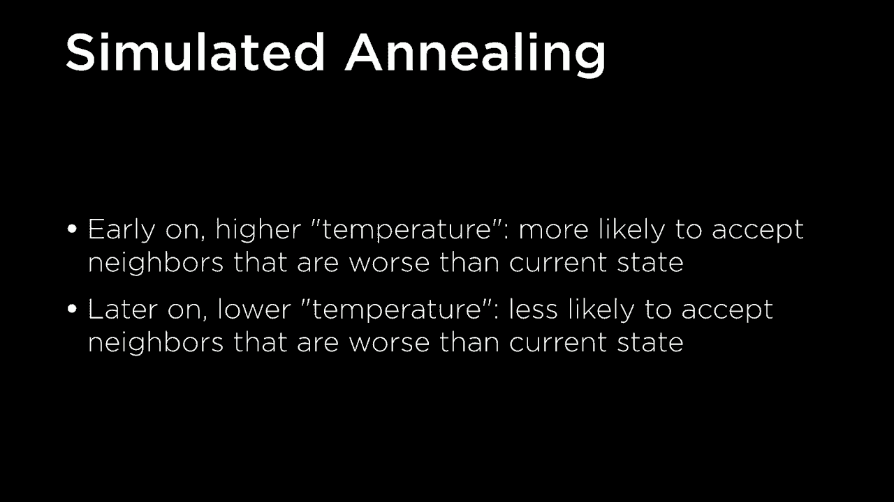
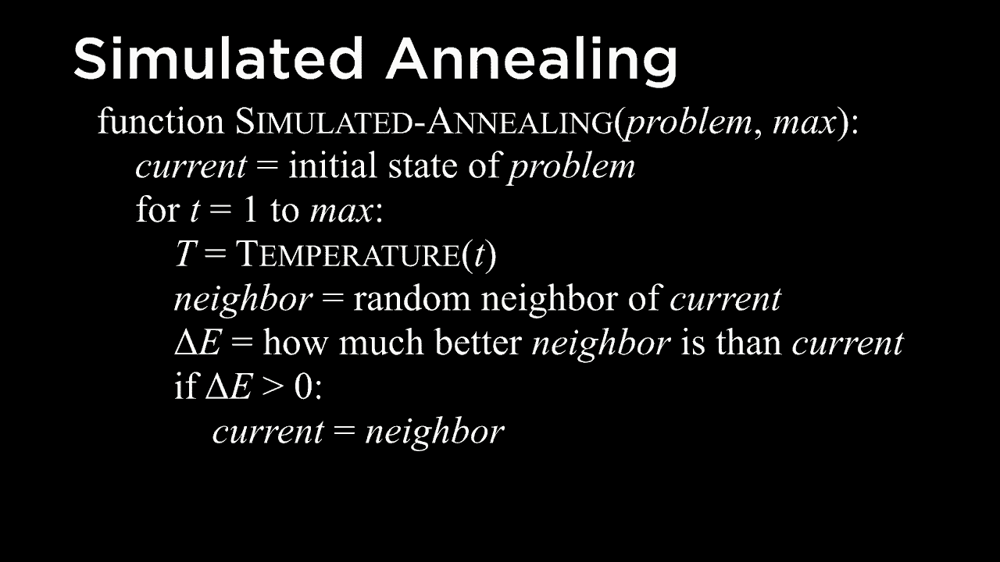
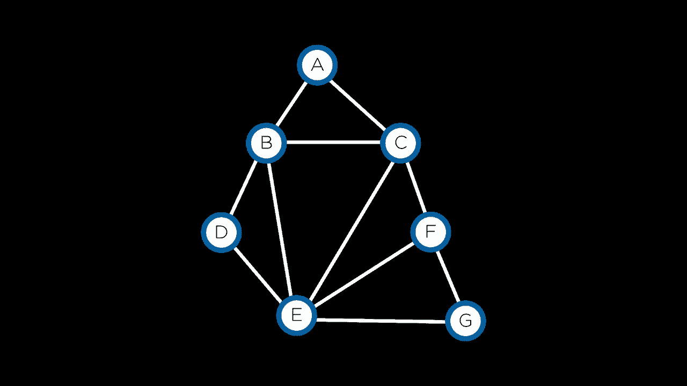
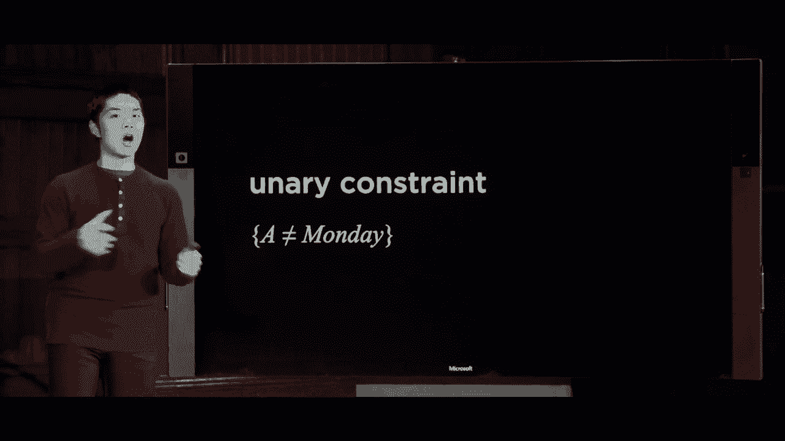
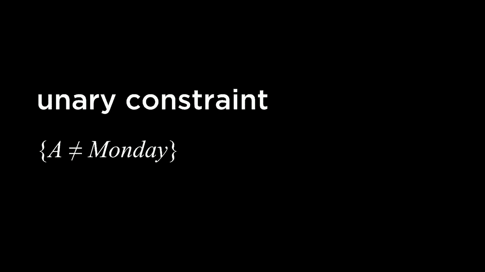
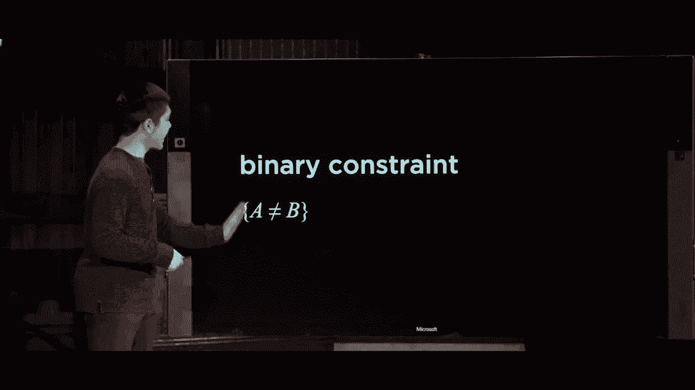
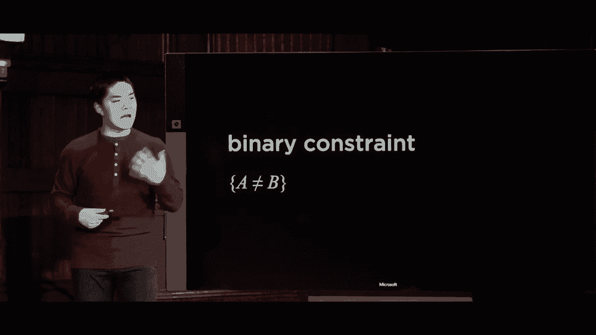

# 哈佛CS50-AI ｜ Python人工智能入门（2020·完整版）- P12：L3- 优化算法 2（线性搜索，节点一致性）🚀


## 概述
在本节课中，我们将学习两种重要的优化算法：**模拟退火**和**线性规划**。同时，我们也会初步了解**约束满足问题**及其核心概念——**节点一致性**。这些方法帮助我们解决那些不关心具体解决路径，只关心最终最优配置的问题。


---

## 模拟退火算法 🔥



上一节我们介绍了局部搜索和爬山算法，它们容易陷入局部最优解。本节中我们来看看**模拟退火**算法，它通过引入随机性来增加找到全局最优解的概率。

模拟退火算法模拟了物理中的退火过程。在高温下，粒子系统能量高，随机运动频繁；随着系统冷却，粒子最终会稳定在某个低能状态。算法的核心思想是：在搜索初期允许接受一些“坏”的移动（即使目标函数值变差），从而有机会跳出局部最优；随着“温度”降低，算法逐渐减少接受坏移动的概率，最终稳定在一个较好的解上。

### 算法伪代码
以下是模拟退火算法的基本伪代码：



```python
function SIMULATED-ANNEALING(problem, max):
    current = problem.INITIAL
    for t = 1 to max:
        T = TEMPERATURE(t) # 计算当前温度，随时间下降
        neighbor = random.choice(current.NEIGHBORS()) # 随机选择一个邻居状态
        delta_e = neighbor.VALUE - current.VALUE # 计算能量差
        if delta_e > 0: # 邻居状态更好
            current = neighbor
        else: # 邻居状态更差
            # 以一定概率接受更差的状态
            acceptance_probability = exp(delta_e / T)
            if random.random() < acceptance_probability:
                current = neighbor
    return current
```

**公式说明**：
*   `delta_e`：邻居状态与当前状态的目标函数值之差。`delta_e > 0` 表示邻居更好。
*   `T`：温度参数，随时间递减。
*   `exp(delta_e / T)`：接受更差状态的概率。当 `delta_e` 负得不多（状态稍差）或 `T` 较高（搜索初期）时，此概率较大。

### 算法应用：旅行商问题
旅行商问题是一个经典的NP难问题，目标是找到访问所有城市并回到起点、总距离最短的路线。我们可以用模拟退火来寻找近似最优解。

**定义邻居状态**：一种常见方法是随机选择路径中的两条边并进行交换。例如，如果原路径中边 `A-B` 和 `C-D` 交叉，交换后可能变为 `A-C` 和 `B-D`，从而可能得到一条更短的路径。

通过不断生成并评估这样的邻居状态，模拟退火算法能够有效地为旅行商问题找到一个高质量的近似解。

---

## 线性规划 📈

上一节我们介绍了模拟退火这类基于随机搜索的优化方法。本节中我们来看看另一类截然不同的优化技术——**线性规划**。它适用于目标函数和约束条件都是**决策变量线性组合**的问题。

线性规划的目标是在一组**线性不等式或等式约束**下，**最小化（或最大化）一个线性目标函数**。

### 问题形式化
一个标准的线性规划问题可以表述如下：

**最小化成本函数**：
`c₁x₁ + c₂x₂ + ... + cₙxₙ`

**满足约束条件**：
`a₁₁x₁ + a₁₂x₂ + ... + a₁ₙxₙ ≤ b₁`
`a₂₁x₁ + a₂₂x₂ + ... + a₂ₙxₙ ≤ b₂`
`...`
`xᵢ ≥ 0` (通常要求变量非负)

**其中**：
*   `x₁, x₂, ..., xₙ` 是决策变量。
*   `c₁, c₂, ..., cₙ` 是目标函数系数。
*   `aᵢⱼ` 是约束条件系数。
*   `bᵢ` 是约束条件的边界值。

### 实例：生产优化问题
假设一家工厂有两台机器：
*   机器X1：运行成本为 **50美元/小时**，需要 **5单位劳动/小时**，产出 **10单位产品/小时**。
*   机器X2：运行成本为 **80美元/小时**，需要 **2单位劳动/小时**，产出 **12单位产品/小时**。

工厂共有 **20单位劳动** 可用，且需要至少 **90单位产品**。问题是如何安排两台机器的运行时间以**最小化总成本**。

**建模**：
1.  **决策变量**：`x1` = 机器X1运行小时数， `x2` = 机器X2运行小时数。
2.  **目标函数（最小化成本）**：`minimize 50*x1 + 80*x2`
3.  **约束条件**：
    *   劳动约束：`5*x1 + 2*x2 ≤ 20`
    *   产出约束：`10*x1 + 12*x2 ≥ 90` （可转化为 `-10*x1 - 12*x2 ≤ -90`）
    *   非负约束：`x1 ≥ 0`, `x2 ≥ 0`

### Python求解示例
我们可以使用SciPy库中的线性规划求解器来解决这个问题。

```python
from scipy.optimize import linprog

# 目标函数系数 (最小化 50*x1 + 80*x2)
c = [50, 80]

# 不等式约束矩阵 A_ub * x <= b_ub
# 约束1: 5*x1 + 2*x2 <= 20
# 约束2: -10*x1 - 12*x2 <= -90 (由 10*x1 + 12*x2 >= 90 转换而来)
A_ub = [[5, 2], [-10, -12]]
b_ub = [20, -90]

# 变量边界 (x1 >= 0, x2 >= 0)
x_bounds = (0, None)
y_bounds = (0, None)

# 求解线性规划问题
result = linprog(c, A_ub=A_ub, b_ub=b_ub, bounds=[x_bounds, y_bounds], method='highs')

if result.success:
    print(f"最优解: x1 = {result.x[0]:.2f} 小时, x2 = {result.x[1]:.2f} 小时")
    print(f"最小总成本: ${result.fun:.2f}")
else:
    print("未找到可行解。")
```
**运行结果可能为**：`x1 = 1.5小时, x2 = 6.25小时`，最小成本为 `587.5美元`。

求解器内部可能使用**单纯形法**或**内点法**等经典算法。对于使用者而言，关键在于将实际问题正确建模为线性规划形式。

---

## 约束满足问题与节点一致性 🧩

前面我们探讨了优化连续值或离散配置的算法。现在，我们转向另一类常见问题——**约束满足问题**。这类问题的目标是为一组变量赋值，同时满足变量之间的所有约束。

### 问题定义
一个CSP由三部分组成：
1.  **变量集合** `X = {X₁, X₂, ..., Xₙ}`
2.  **值域集合** `D = {D₁, D₂, ..., Dₙ}`，其中 `Dᵢ` 是变量 `Xᵢ` 可以取值的集合。
3.  **约束集合** `C`，定义了变量取值之间必须满足的关系（例如 `X₁ ≠ X₂`）。

### 实例：考试安排问题
假设我们需要为课程安排考试时间（周一、周二、周三），约束是：任何学生不能在同一天参加两门考试。

**建模**：
*   **变量**：每门课程（A, B, C, ...）。
*   **值域**：每个变量的值域都是 `{周一, 周二, 周三}`。
*   **约束**：如果某学生同时选修了课程A和B，则需添加约束 `A ≠ B`。

我们可以用**约束图**来表示，节点是变量，边代表两个变量之间存在二元约束。

### 节点一致性
在深入解决CSP之前，我们可以先进行一种简单的预处理，称为**强制执行节点一致性**。

**节点一致性**：如果某个变量值域中的所有值都满足施加于该变量本身的**所有一元约束**，则称该变量是节点一致的。如果CSP中所有变量都是节点一致的，则称该CSP是节点一致的。

**一元约束**：只涉及单个变量的约束（例如，“课程A不能在周一考试”可表示为 `A ≠ 周一`）。



**执行节点一致性的方法**：遍历每个变量，检查其值域中的每个值。如果某个值违反了该变量的一元约束，则将其从值域中删除。



#### 节点一致性示例
假设有两个变量（课程）：
*   `A` 的值域：`{周一, 周二, 周三}`
*   `B` 的值域：`{周一, 周二, 周三}`





约束条件：
1.  `A ≠ 周一` （一元约束）
2.  `B ≠ 周二` （一元约束）
3.  `B ≠ 周一` （一元约束）
4.  `A ≠ B` （二元约束）



**执行节点一致性过程**：
1.  检查变量 `A`：其值域中的“周一”违反约束 `A ≠ 周一`，因此将“周一”从 `A` 的值域中删除。更新后 `A` 的值域为 `{周二, 周三}`。
2.  检查变量 `B`：其值域中的“周二”违反约束 `B ≠ 周二`，“周一”违反约束 `B ≠ 周一`。将这两个值删除。更新后 `B` 的值域为 `{周三}`。

执行完毕后，CSP达到了节点一致性。注意，我们尚未处理二元约束 `A ≠ B`，那是下一步（弧一致性等）要解决的问题。节点一致性作为一个简单的预处理步骤，可以缩小搜索空间。

---

## 总结
本节课我们一起学习了三种重要的优化与问题求解范式：

1.  **模拟退火**：一种受物理过程启发的随机优化算法，通过以一定概率接受“坏”的移动来逃离局部最优，随着“温度”降低逐渐收敛，常用于求解旅行商等组合优化问题。
2.  **线性规划**：用于解决目标函数和约束条件均为决策变量线性组合的优化问题。关键在于将实际问题建模成标准形式，然后可利用现有求解器（如SciPy中的`linprog`）高效求解。
3.  **约束满足问题与节点一致性**：CSP关注于为变量赋值以满足所有约束。**节点一致性**是一个基础概念，指通过移除违反一元约束的值来预处理变量值域，为后续更复杂的推理步骤简化问题。

这些工具为我们解决人工智能中广泛的优化和配置问题提供了强大的基础。