# 🧠 哈佛CS50-AI 13：L3- 优化算法 3 (回溯搜索等)

在本节课中，我们将要学习约束满足问题中的高级搜索与推理技术。我们将重点探讨如何通过**弧一致性**和**回溯搜索**等算法，更高效地找到满足所有约束的变量赋值方案。

---

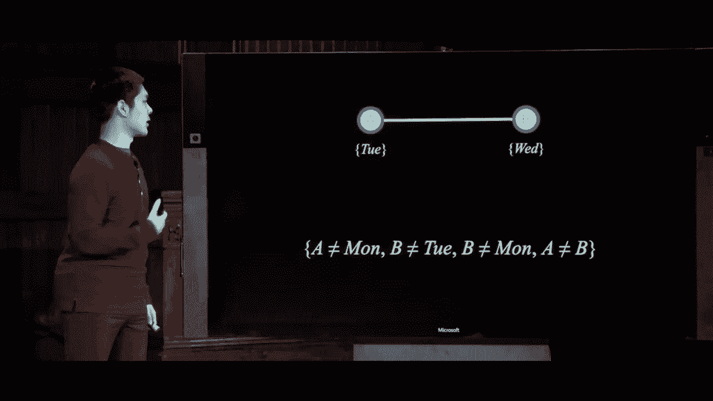

## 🔗 弧一致性

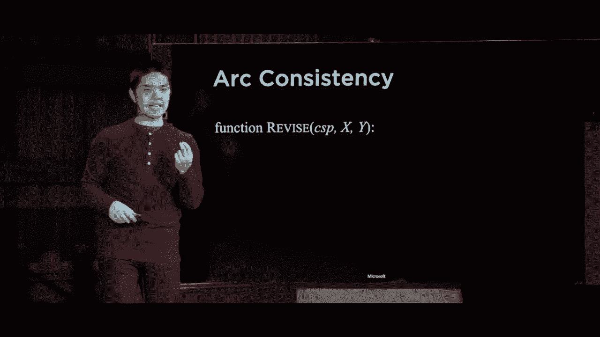

上一节我们介绍了约束满足问题的基本概念。本节中我们来看看一种更强的一致性概念：**弧一致性**。它关注的是两个变量之间的二元约束。

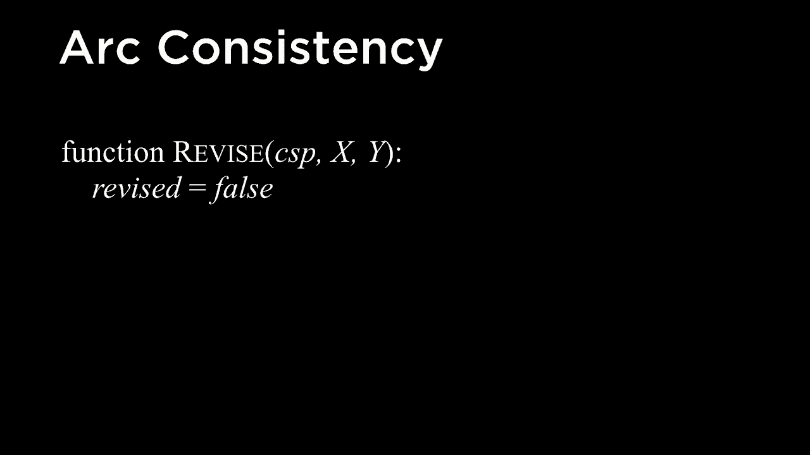

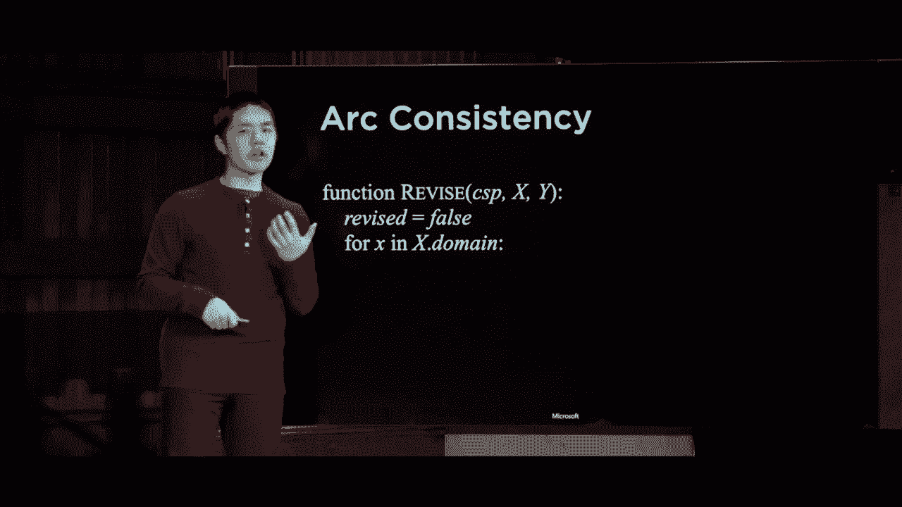

弧一致性指的是，对于约束图中的一条边（即两个变量），其中一个变量域中的**每一个值**，都能在另一个变量的域中找到至少一个值，使得它们之间的二元约束得到满足。

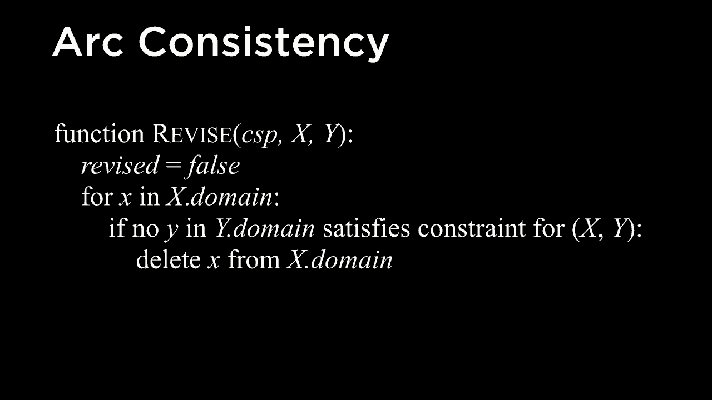

更正式地说，为了使变量 **X** 与变量 **Y** 保持弧一致，我们需要从 **X** 的域中移除所有这样的值：对于该值，在 **Y** 的域中**不存在**任何值能满足 **X** 与 **Y** 之间的约束。

让我们看一个例子。假设变量 **A** 的域是 `{星期二， 星期三}`，变量 **B** 的域是 `{星期三}`，且约束为 **A ≠ B**。

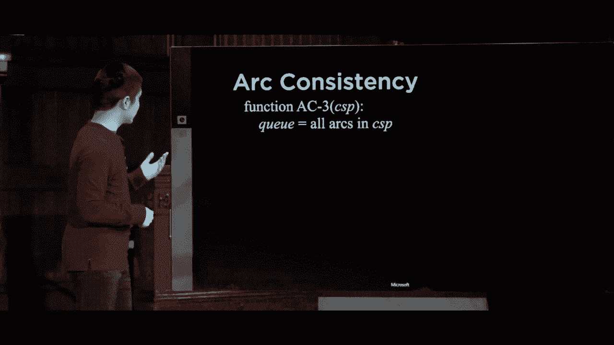

*   对于 **A** 的域中的值 `星期二`，**B** 的域中存在值 `星期三` 满足 `星期二 ≠ 星期三`。
*   对于 **A** 的域中的值 `星期三`，**B** 的域中**不存在**值能满足 `星期三 ≠ 星期三`。

因此，为了保持 **A** 对 **B** 的弧一致，我们需要将 `星期三` 从 **A** 的域中移除。执行此操作后，**A** 的域变为 `{星期二}`，**B** 的域为 `{星期三}`，整个问题便得以解决。

---

## ⚙️ 实现弧一致性：REVISE 与 AC-3 算法

为了实现弧一致性，我们首先定义一个名为 `REVISE` 的函数。它的作用是使变量 **X** 相对于变量 **Y** 保持弧一致。

以下是 `REVISE` 函数的伪代码描述：

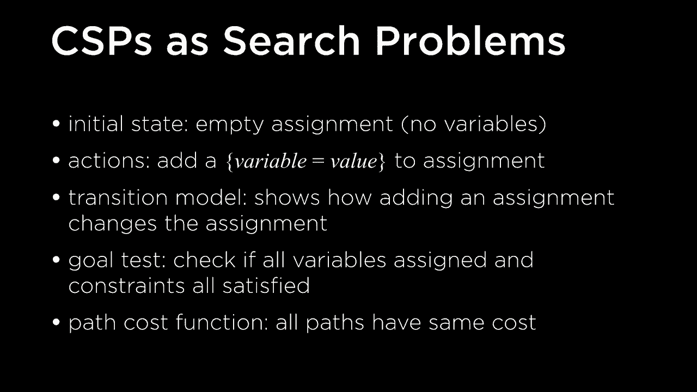

```python
function REVISE(csp, X, Y):
    revised = false
    for each x in domain(X):
        if no value y in domain(Y) allows (x, y) to satisfy constraint(X, Y):
            delete x from domain(X)
            revised = true
    return revised
```

`REVISE` 函数检查 **X** 域中的每个值。如果某个值 **x** 在 **Y** 的域中找不到任何匹配值 **y** 来满足约束，则将该值 **x** 从 **X** 的域中删除，并标记已修订。

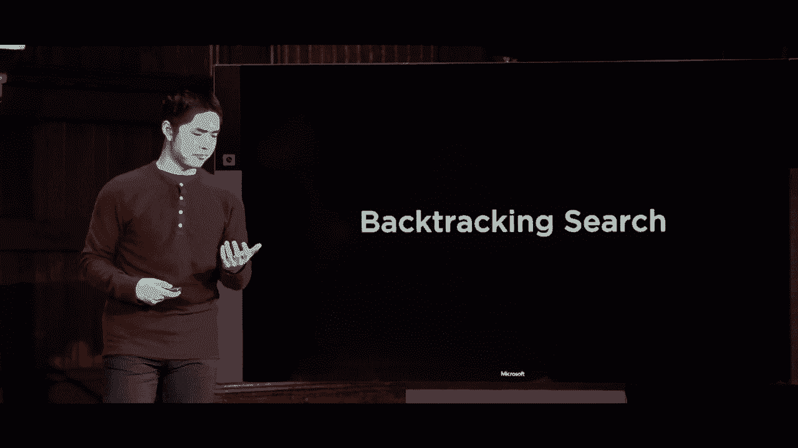

然而，我们通常希望对整个约束满足问题强制执行弧一致性，而不仅仅针对一对变量。**AC-3 算法** 实现了这一目标。

以下是 AC-3 算法的核心思想：

1.  初始化一个队列，包含约束图中所有的弧（即所有存在二元约束的变量对）。
2.  只要队列不为空，就从中取出一条弧 **(X, Y)**。
3.  调用 `REVISE(csp, X, Y)`。如果 **X** 的域被修改（`revised` 为真）：
    *   如果 **X** 的域变为空，则问题无解，算法终止。
    *   否则，对于 **X** 的所有邻居 **Z**（除了 **Y**），将弧 **(Z, X)** 加入队列，因为 **X** 域的缩小可能影响这些弧的一致性。
4.  重复步骤 2-3，直到队列为空或检测到无解。

AC-3 算法通过不断传播约束，可以有效缩小变量的值域，有时甚至能直接解决问题。

---

## 🔍 回溯搜索

尽管弧一致性可以简化问题，但并非总能直接找到解。我们通常还需要结合搜索算法。**回溯搜索** 是一种专门用于解决约束满足问题的经典搜索算法。

回溯搜索的核心理念是：我们逐步为变量赋值，如果当前赋值导致后续无法满足任何约束（即进入“死胡同”），则**撤销最近的部分赋值（回溯）**，并尝试其他可能的值。

以下是回溯搜索的基本框架：

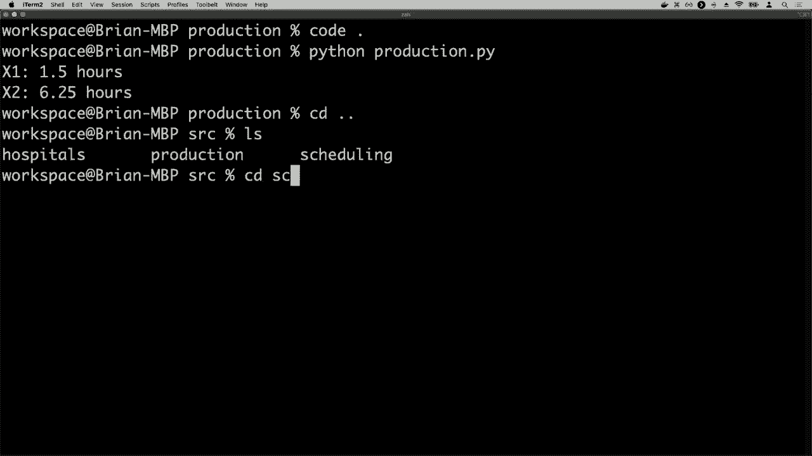

```python
function BACKTRACK(assignment, csp):
    if assignment is complete:
        return assignment
    var = SELECT-UNASSIGNED-VARIABLE(assignment, csp)
    for each value in ORDER-DOMAIN-VALUES(var, assignment, csp):
        if value is consistent with assignment:
            add {var = value} to assignment
            result = BACKTRACK(assignment, csp)
            if result != failure:
                return result
            remove {var = value} from assignment # 回溯
    return failure
```

算法从空赋值开始，递归地进行：
1.  **选择未分配变量**：使用启发式（如 MRV）选择一个变量。
2.  **遍历值域**：按某种顺序（如 LCV）尝试该变量的所有可能值。
3.  **一致性检查**：如果赋值与当前部分赋值一致（不违反任何约束），则将其加入。
4.  **递归搜索**：在新的赋值基础上，递归调用自身。
5.  **回溯**：如果递归调用返回失败，说明当前值的选择导致了死胡同，因此撤销该赋值，尝试下一个值。

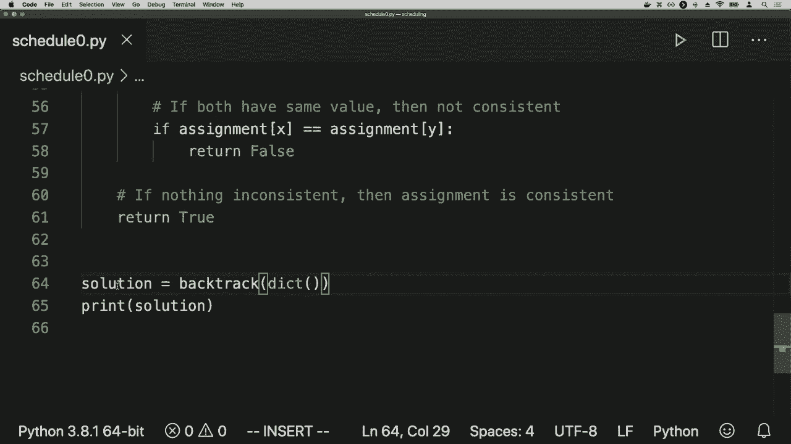

让我们通过课程考试安排的例子来可视化这个过程。假设我们依次为变量 **A**, **B**, **D**, **E**, **C** 赋值。当尝试为 **C** 赋值时，发现其域 `{星期一， 星期二， 星期三}` 中的所有值都与已赋值变量冲突，导致失败。算法将回溯到对 **E** 的赋值，尝试其他值，并最终找到一组满足所有约束的完整赋值。

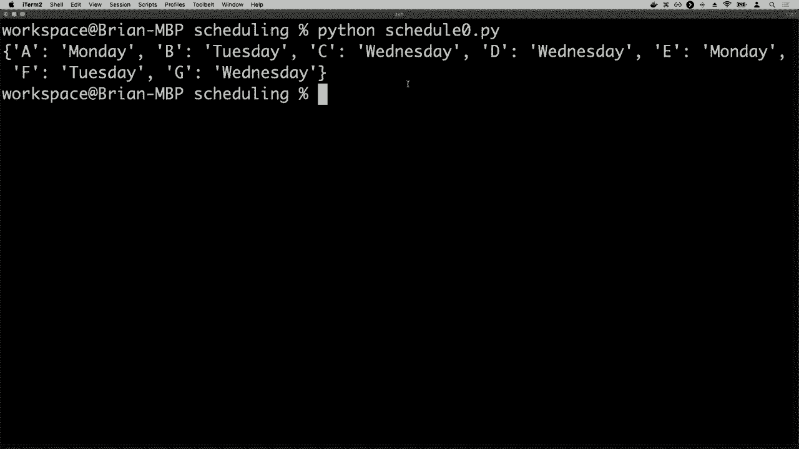

---

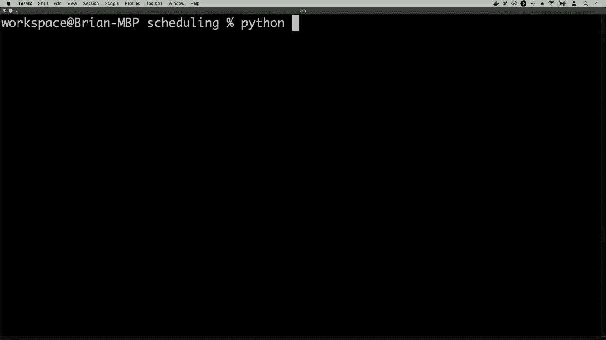

## 🚀 提升搜索效率：推理与启发式

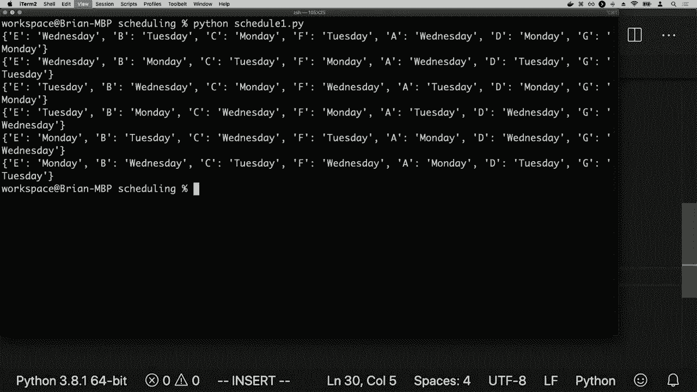

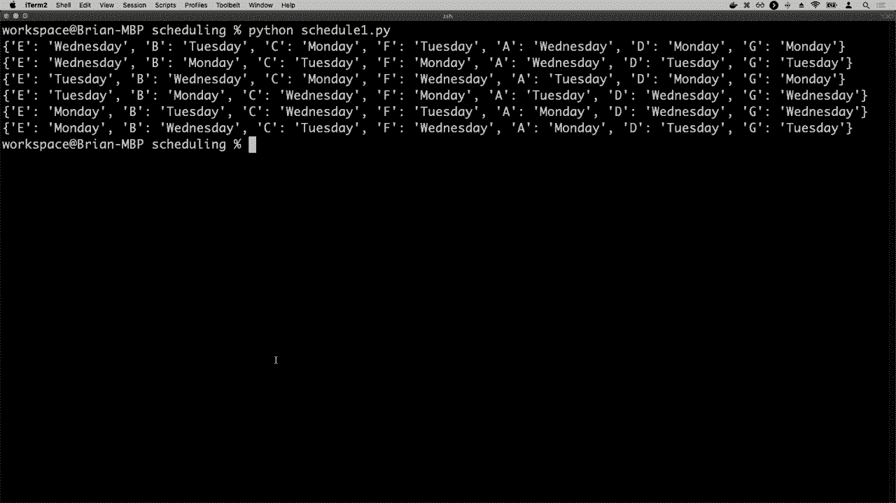

基本的回溯搜索可能效率不高。我们可以通过两种主要策略来大幅提升其性能：**在搜索中维护一致性** 和 **使用智能的变量/值选择启发式**。

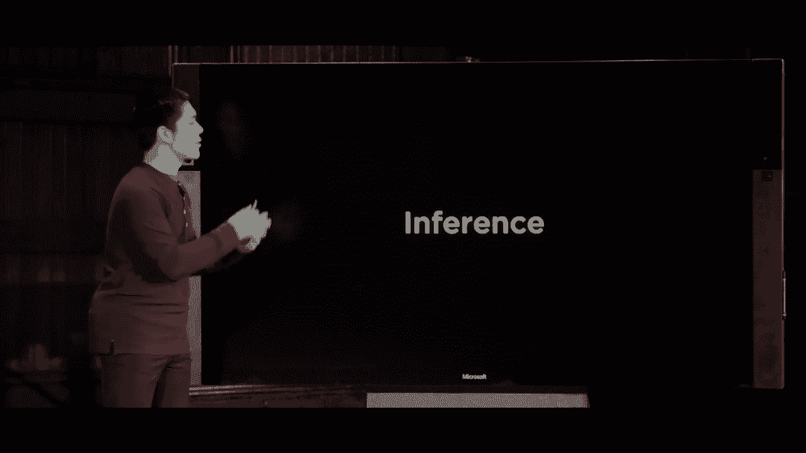

### 1. 前向检查与维护弧一致性

在搜索过程中，每当我们为一个变量 **X** 赋值后，可以立即运行推理（如前向检查或调用 AC-3 的变体），来检查这个新赋值对其未赋值邻居变量的值域所产生的影响。

例如，在为 **A** 赋值 `星期一` 后，我们可以推断出与 **A** 有约束的 **C** 不能是 `星期一`，从而将 `星期一` 从 **C** 的域中移除。这种即时的域缩减可以提前暴露矛盾，避免进入更深的无效搜索分支。

### 2. 变量选择启发式

以下是选择下一个赋值变量的有效启发式：

*   **最小剩余值（MRV）启发式**：选择**值域最小**的未赋值变量。这能最快地触达成功或失败，从而有效剪枝。
*   **度启发式**：作为 MRV 的补充，当多个变量值域大小相同时，选择**约束图中度最高**（即连接最多其他变量）的变量。先约束高度连接的变量能更大幅度地限制剩余搜索空间。

### 3. 值选择启发式

*   **最少约束值（LCV）启发式**：为选定的变量选择值时，优先选择那个**排除其他变量可选值最少**的值。这为后续的赋值保留了最大的灵活性，增加了找到解的可能性。

通过将**回溯搜索**、**约束传播（如AC-3）** 以及**智能的变量/值排序启发式**结合起来，我们得到了一个强大且高效的约束求解框架。许多现代的约束求解库都基于这些核心思想构建。

---

## 📝 总结

本节课中我们一起学习了解决约束满足问题的核心优化算法。

我们首先深入探讨了**弧一致性**这一比节点一致性更强的概念，并学习了通过 **`REVISE` 函数**和 **AC-3 算法** 在整个问题上强制执行弧一致性的方法。

接着，我们介绍了**回溯搜索**这一基础算法，它通过尝试赋值、遇到矛盾时回溯的机制来寻找解。

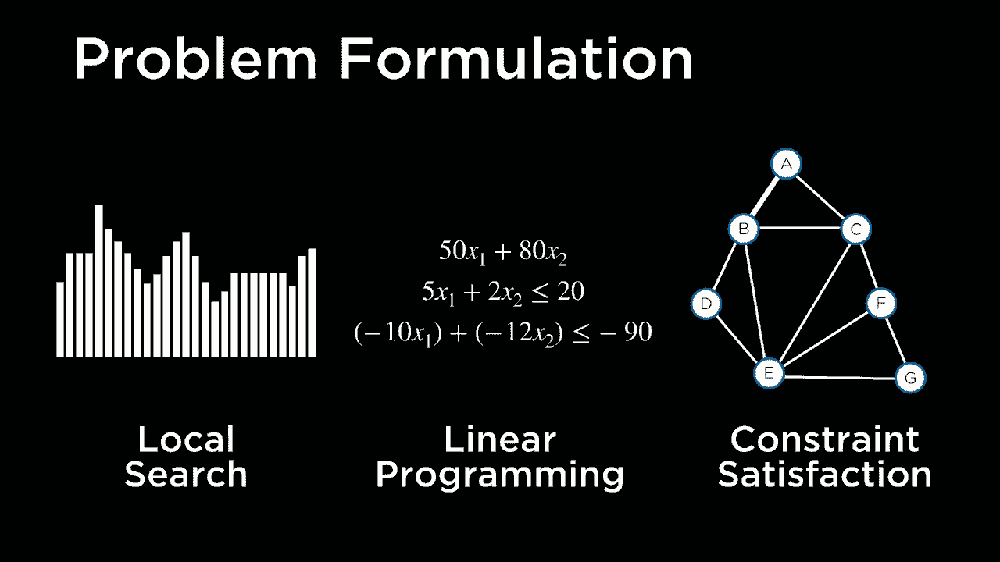

最后，我们探讨了如何大幅提升搜索效率：通过在搜索过程中**交错进行约束传播（推理）** 来提前缩减值域；以及使用**最小剩余值（MRV）**、**度启发式** 和 **最少约束值（LCV）** 等启发式方法来智能地决定下一个赋值的变量和值。

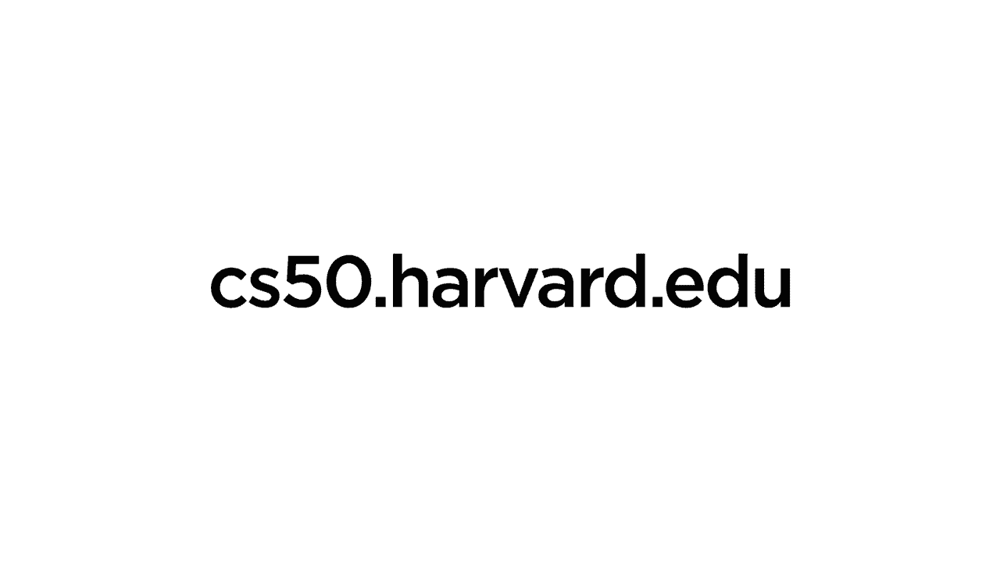

这些技术——将问题形式化为约束满足问题，并运用一致性检查、回溯搜索与启发式策略——构成了解决从数独、课程排班到资源分配等众多实际优化问题的强大工具箱。