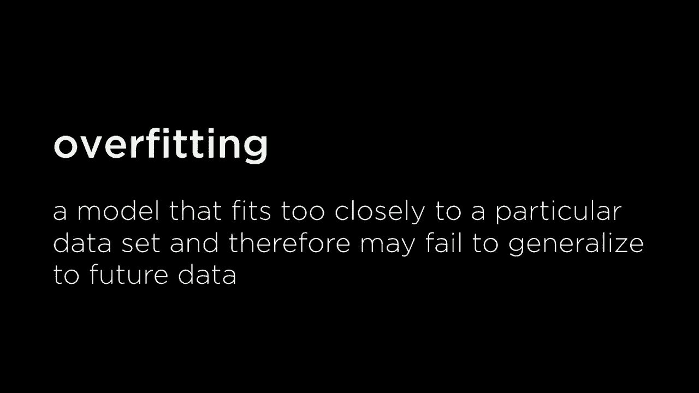
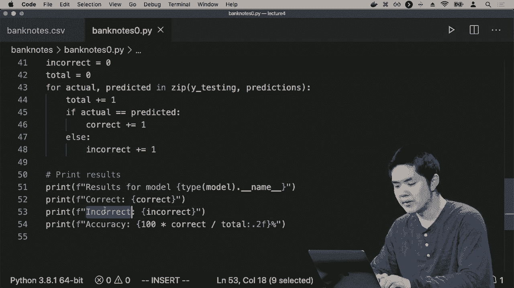
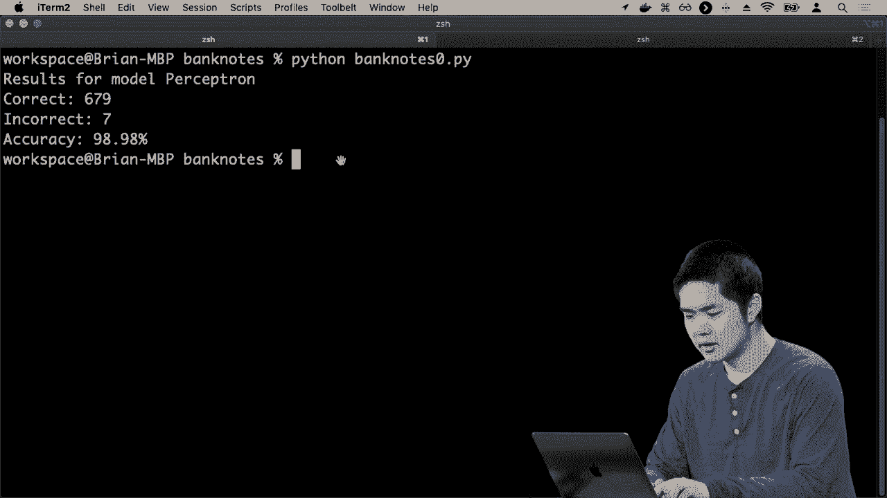
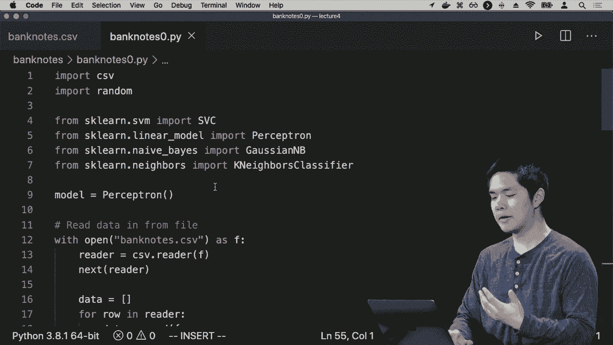
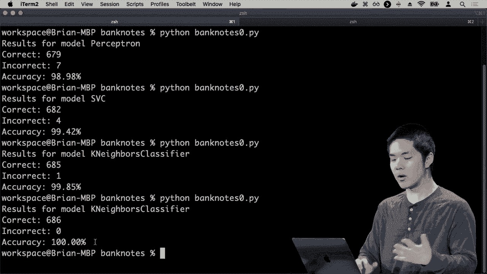

# 哈佛CS50-AI 15：L4- 模型学习 2 (回归，损失函数，过拟合，正则化，强化学习，sklearn) 📈

在本节课中，我们将要学习监督学习中的回归问题，以及如何评估和优化机器学习模型。我们将探讨损失函数、过拟合现象及其解决方案（如正则化），并简要介绍强化学习的概念。最后，我们将学习如何使用 `scikit-learn` 库来快速实现和测试这些模型。

## 回归问题 🔄

上一节我们介绍了分类问题，本节中我们来看看回归问题。回归同样是监督学习问题，目标是学习一个将输入映射到输出的函数。

与分类不同，回归问题的输出不再是离散的类别（如下雨/不下雨），而是连续的实数值。例如，公司可能希望根据广告支出的金额来预测产品的销售额。

我们试图学习一个函数，其输入是广告支出金额，输出是预测的销售额。我们可以根据过去的数据（广告支出与销售额）来绘制散点图，并尝试找出一条线来近似表示两者之间的关系。

这条线就是我们的假设函数。给定一个新的广告预算，我们可以通过这条线来查找对应的预测销售额。这种方法被称为**线性回归**。

## 评估假设：损失函数 ⚖️

问题在于，我们如何评估不同假设函数的好坏？我们可以将这个过程看作一个优化问题，目标是**最小化**一个称为**损失函数**的成本。

损失函数量化了我们的预测与真实值之间的差距。对于每一个数据点，根据实际输出和预测输出，我们可以计算一个损失值。将所有数据点的损失相加，就得到了**经验损失**。

以下是几种常见的损失函数：



*   **0-1损失函数**：适用于分类问题。如果预测正确，损失为0；如果预测错误，损失为1。
    *   **公式**：`L(y, ŷ) = 0 if y == ŷ else 1`
*   **L1损失函数**：适用于回归问题。计算实际值与预测值之差的绝对值。
    *   **公式**：`L(y, ŷ) = |y - ŷ|`
*   **L2损失函数**：同样适用于回归问题。计算实际值与预测值之差的平方，会对较大的误差给予更严厉的惩罚。
    *   **公式**：`L(y, ŷ) = (y - ŷ)²`

选择哪种损失函数取决于具体问题和我们对误差的容忍度。

## 过拟合与正则化 🚧

如果我们只专注于最小化训练数据上的损失，可能会遇到**过拟合**问题。过拟合是指模型过于复杂，以至于“记住”了训练数据中的噪声和细节，导致其在未见过的数据上表现很差。

我们希望模型能够**泛化**，即在新的、未知的数据上也能做出准确预测。为了避免过拟合，我们可以在优化时不仅考虑损失，还考虑模型的**复杂性**。

这个过程称为**正则化**。我们在成本函数中添加一个**正则化项**，用于惩罚复杂的模型，从而倾向于选择更简单、泛化能力更强的假设。

通常，正则化后的成本函数可以表示为：
**总成本 = 损失 + λ × 复杂性**
其中，**λ** 是一个超参数，用于控制对复杂性的惩罚力度。λ 值越大，对复杂模型的惩罚越重。

## 验证模型：交叉验证 🧪

确保模型不发生过拟合的另一种方法是通过实验验证其泛化能力。通常，我们会将数据集分为两部分：

1.  **训练集**：用于训练模型。
2.  **测试集**：用于评估训练好的模型在未知数据上的表现。

这种方法称为**留出法交叉验证**。如果模型在训练集上表现很好，但在测试集上表现很差，很可能就是过拟合了。

为了更充分地利用数据，可以使用 **k折交叉验证**。其步骤如下：
1.  将数据随机分为 k 个大小相似的子集。
2.  进行 k 次训练和测试。每次使用一个子集作为测试集，其余 k-1 个子集作为训练集。
3.  最终，计算 k 次测试结果的平均值，作为模型性能的估计。

## 实践：使用 scikit-learn 🛠️

在Python中，我们可以使用 `scikit-learn` 库来快速实现和测试各种机器学习算法，而无需从头编写。

以下是一个使用 `scikit-learn` 进行银行钞票真伪分类的简化示例流程：

```python
# 导入必要的库和模型
from sklearn.model_selection import train_test_split
from sklearn.linear_model import Perceptron
from sklearn.metrics import accuracy_score
import pandas as pd

# 1. 加载数据
data = pd.read_csv('bank_notes.csv')
X = data[['feature1', 'feature2', 'feature3', 'feature4']] # 输入特征
y = data['label'] # 输出标签 (0: 真钞, 1: 伪钞)

# 2. 划分训练集和测试集
X_train, X_test, y_train, y_test = train_test_split(X, y, test_size=0.5, random_state=42)

# 3. 选择并训练模型
model = Perceptron()
model.fit(X_train, y_train)

# 4. 在测试集上进行预测
y_pred = model.predict(X_test)



# 5. 评估模型性能
accuracy = accuracy_score(y_test, y_pred)
print(f"模型准确率: {accuracy:.2%}")
```





通过简单地替换 `model = Perceptron()` 为其他模型（如 `SVC()` 支持向量机 或 `KNeighborsClassifier(n_neighbors=3)` K近邻），我们可以轻松比较不同算法的性能。



## 其他学习范式：强化学习 🎮

除了监督学习，机器学习还有另一种重要范式——**强化学习**。

在强化学习中，智能体（Agent）通过与环境互动来学习。其核心思想是：
1.  智能体在**环境**的某个**状态**中。
2.  智能体选择一个**动作**执行。
3.  环境反馈给智能体一个新的状态和一个**奖励**（正数代表鼓励，负数代表惩罚）。
4.  智能体的目标是学习一个策略，通过选择一系列动作来最大化长期获得的总奖励。

例如，训练一个机器人走路，每当它平稳前进就给予正奖励，摔倒则给予负奖励。通过大量试错，机器人最终学会走路的策略。强化学习在游戏AI、机器人控制等领域有广泛应用。

## 总结 📝

本节课中我们一起学习了：
1.  **回归问题**：预测连续值的监督学习任务。
2.  **损失函数**：用于量化模型预测误差的函数，如0-1损失、L1损失和L2损失。
3.  **过拟合**：模型在训练数据上表现过好，但泛化能力差的问题。
4.  **正则化**：通过惩罚模型复杂性来防止过拟合的技术。
5.  **交叉验证**：将数据分为训练集和测试集，以评估模型泛化能力的方法。
6.  **scikit-learn**：一个强大的Python库，可以快速实现和测试多种机器学习算法。
7.  **强化学习**：一种通过奖励和惩罚机制，让智能体从环境中学习行为策略的机器学习范式。

理解这些核心概念，是构建有效、稳健的机器学习模型的基础。