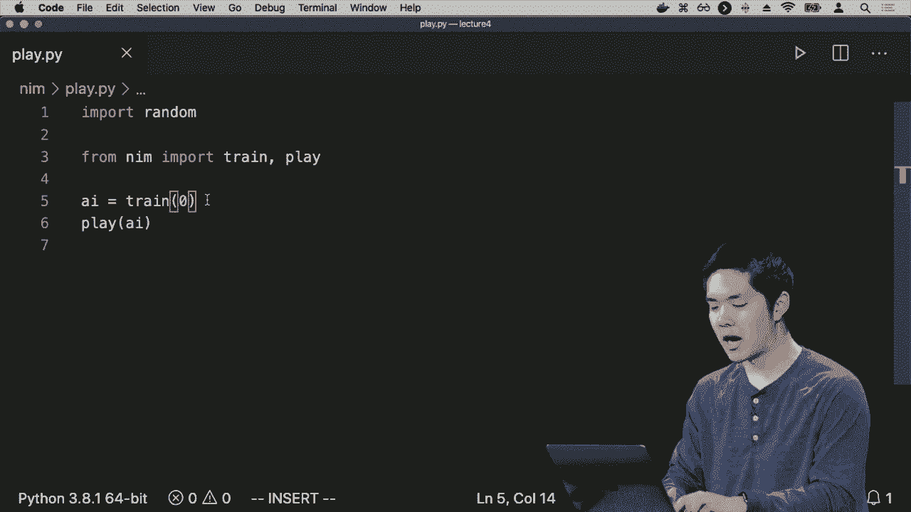
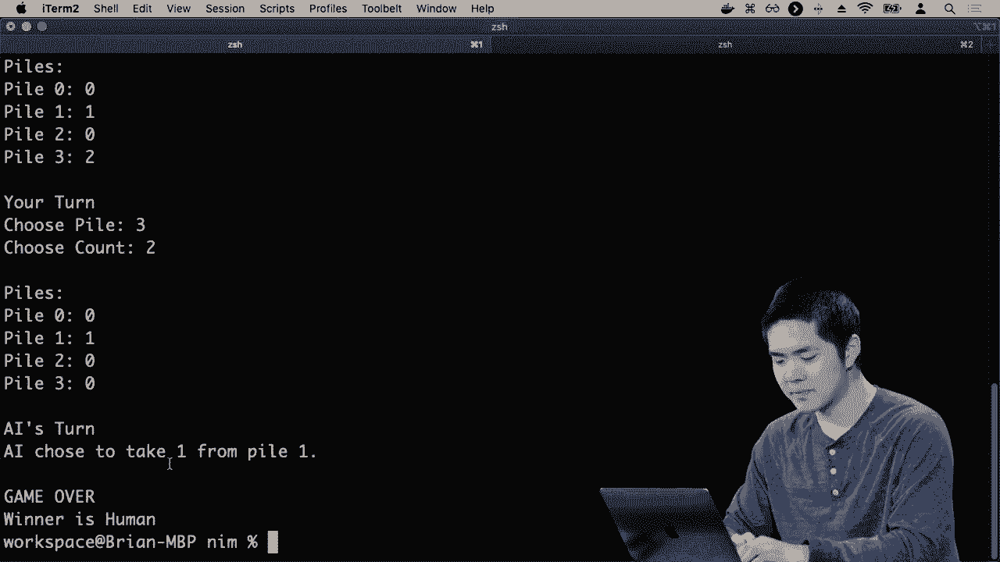
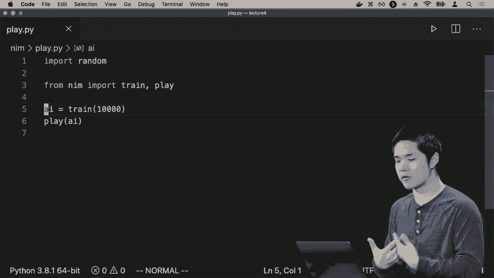
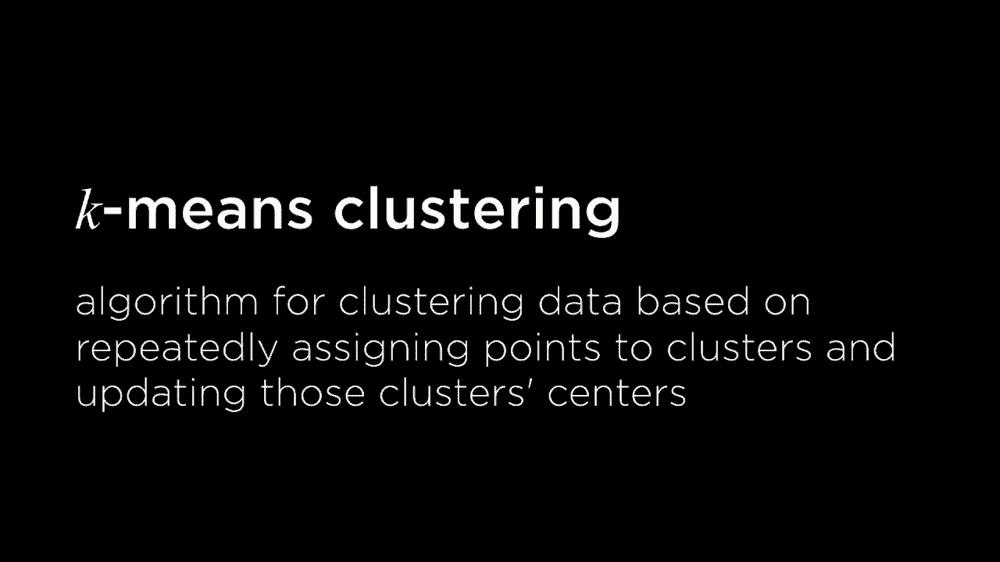
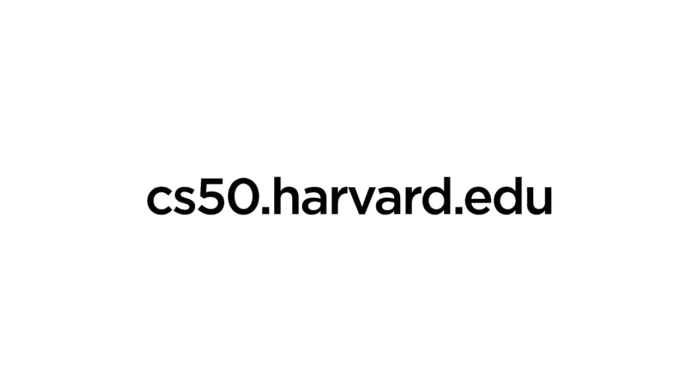

# 哈佛CS50-AI 16：L4- 模型学习 3 (马尔可夫决策过程，Q学习，无监督，聚类) 🧠🤖

在本节课中，我们将要学习机器学习中几个核心的高级概念。我们将从**强化学习**开始，了解智能体如何通过与环境互动来学习最优策略，具体会学习**马尔可夫决策过程**和**Q学习**算法。之后，我们将转向**无监督学习**，并介绍一种经典的无监督学习技术——**K均值聚类**。

## 强化学习与马尔可夫决策过程 🧭

上一节我们讨论了智能体如何从经验中学习。为了形式化这一点，我们首先需要形式化**状态**和**行动**的概念。

我们将这种世界形式化为一个被称为**马尔可夫决策过程**的模型。马尔可夫决策过程是一个我们可以用来为智能体在其环境中做决策的模型。这是一个允许我们表示智能体可以处于的各种不同状态、可以采取的行动以及采取一种行动与采取另一种行动的奖励的模型。

马尔可夫决策过程看起来是什么样子呢？如果你还记得之前的马尔可夫链，它看起来有点像这样：我们有一大堆个体状态，每个状态根据某些概率分布过渡到另一个状态。但在那个原始模型中，没有智能体可以控制这个过程，它完全是基于概率的。

在马尔可夫决策过程中，我们进行了扩展。智能体在某个状态下可以选择一组行动。每个行动可能与其自身的概率分布相关联，通向各种不同的状态。此外，每当你从一个状态采取行动进入另一个状态时，我们可以将**奖励**与这个结果相关联。正值奖励意味着某种正反馈，负值奖励意味着某种形式的惩罚。

马尔可夫决策过程包含几个组成部分：
*   **状态集合**：智能体可以处于的所有状态。
*   **行动集合**：在给定状态下，智能体可以采取的所有行动。
*   **转移模型**：给定当前状态和采取的行动，到达下一个状态的概率。
*   **奖励函数**：给定当前状态、采取的行动和到达的下一个状态，所获得的奖励。

智能体从与特定环境的交互中获得的总奖励，可以使用这个马尔可夫决策过程进行建模。

## Q学习算法：从经验中学习价值 📈

现在让我们尝试形式化智能体学习“在某个状态下采取某个行动是好是坏”的想法。强化学习有很多不同的模型，我们要看的方法称为 **Q学习**。

Q学习的核心在于学习一个函数 **Q(s, a)**。这个函数以状态 **s** 和行动 **a** 为输入，并输出一个价值估计，代表在该状态下采取该行动能获得多少奖励。

起初我们不知道这个Q函数应该是什么。但随着时间的推移，基于尝试和观察结果，我们想学习任意特定状态 **s** 和行动 **a** 的Q值。

以下是Q学习的基本步骤：

1.  **初始化**：对所有状态 **s** 和所有行动 **a**，将 **Q(s, a)** 设为零。在拥有任何经验之前，我们假设所有价值都是零。
2.  **与环境互动**：智能体在状态 **s** 下采取行动 **a**，观察到奖励 **r**，并进入新状态 **s‘**。
3.  **更新Q值**：基于这次经验，我们更新对 **Q(s, a)** 的估计。新的估计基于当前获得的奖励和进入新状态后预期的未来奖励。

我们使用以下公式来更新Q值：

`Q(s, a) <- Q(s, a) + α * [新价值估计 - Q(s, a)]`

其中：
*   **α** 是**学习率**，控制新信息的重要性（0到1之间）。α=1表示完全用新估计替换旧估计；α=0表示忽略新信息。
*   **新价值估计** 由两部分组成：立即获得的奖励 **r**，加上折现后的未来最大可能奖励 **γ * max(Q(s‘, a‘))**。**γ** 是**折扣因子**，表示未来奖励相对于当前奖励的价值。

更完整的更新公式是：

`Q(s, a) <- Q(s, a) + α * [ r + γ * max(Q(s‘, a‘)) - Q(s, a) ]`

通过反复经历和更新，Q函数会越来越准确地反映每个状态-行动对的实际价值。

## 探索与利用的平衡 ⚖️

一旦我们对每个状态和每个行动都有了较好的价值估计，我们可以实施一个**贪婪决策策略**：在状态 **s** 下，总是选择使 **Q(s, a)** 值最大的行动 **a**。

但这种方法有一个缺点：如果智能体总是采取它已知的最佳行动，它可能永远不会尝试未知的、但可能更好的行动。这被称为**探索与利用的困境**。

为了解决这个问题，我们使用 **ε-贪婪算法**：
*   以概率 **1 - ε**，选择当前估计的最佳行动（**利用**）。
*   以概率 **ε**，随机选择一个行动（**探索**）。

通过设置ε值（例如0.1），我们可以控制智能体探索新可能性的频率。通常，在训练初期使用较大的ε以鼓励探索，随后逐渐减小ε以更多地利用学到的知识。

## 无监督学习与聚类 🔍

机器学习的第三个主要类别是**无监督学习**。与有监督学习（数据有标签）和强化学习（通过奖励学习）不同，无监督学习发生在我们有数据但没有任何标签或额外反馈的情况下。

在无监督学习中，我们仍然希望从数据中发现一些潜在的模式或结构。一个常见的无监督学习任务是**聚类**。

聚类是指给定一组对象，将其组织成不同的**簇**，使得同一簇内的对象彼此相似，而不同簇的对象则相异。聚类应用广泛，例如基因分组、市场细分、图像分割等。

## K均值聚类算法 🎯

一种经典的聚类技术是 **K均值聚类** 算法。该算法的目标是将所有数据点划分为 **K** 个不同的簇。

以下是K均值聚类的工作步骤：

1.  **初始化**：随机选择K个点作为初始的**簇中心**（质心）。
2.  **分配点**：将每个数据点分配给离它最近的簇中心。
3.  **更新中心**：将所有点分配完毕后，重新计算每个簇的中心（即取该簇所有点的平均值）。
4.  **迭代**：重复步骤2和步骤3，直到簇的分配不再发生变化，或达到最大迭代次数。

这个过程通过不断调整簇中心和点的归属，最终将数据点划分为K个紧凑的簇。

## 总结 🎓

本节课中我们一起学习了机器学习中几个关键的高级主题。

我们首先深入探讨了**强化学习**，通过**马尔可夫决策过程**形式化了智能体与环境互动学习的过程。接着，我们学习了**Q学习**这一具体的强化学习算法，它通过更新一个Q函数来学习状态-行动对的价值。我们还讨论了**探索与利用**的平衡，并介绍了**ε-贪婪算法**来解决这一问题。

最后，我们转向了**无监督学习**，介绍了**聚类**任务，并详细讲解了**K均值聚类**算法如何将未标记的数据点分组到不同的簇中。

这些概念——监督学习、强化学习和无监督学习——构成了现代机器学习的基础，使我们能够构建可以从数据中学习并执行复杂任务的智能系统。