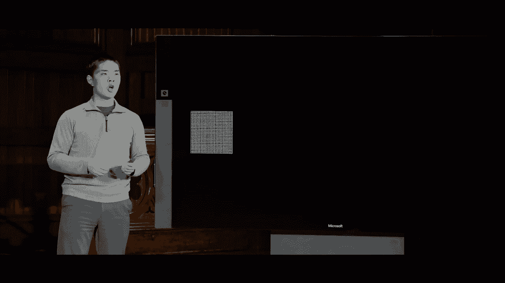
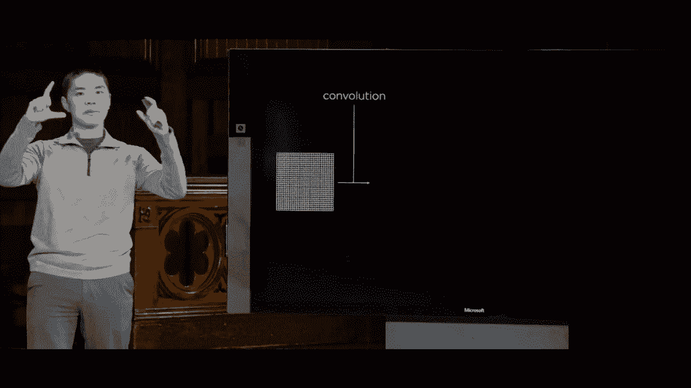
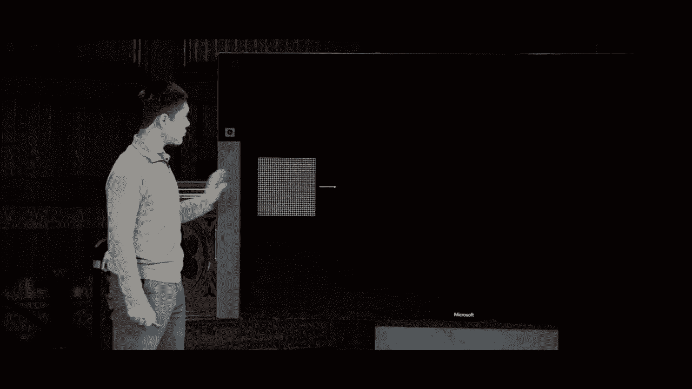
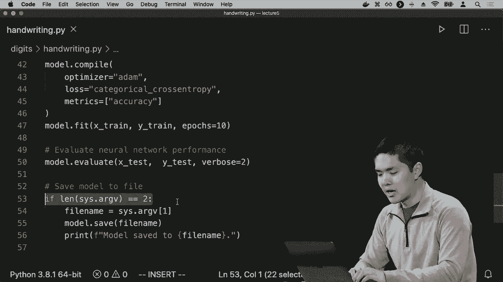
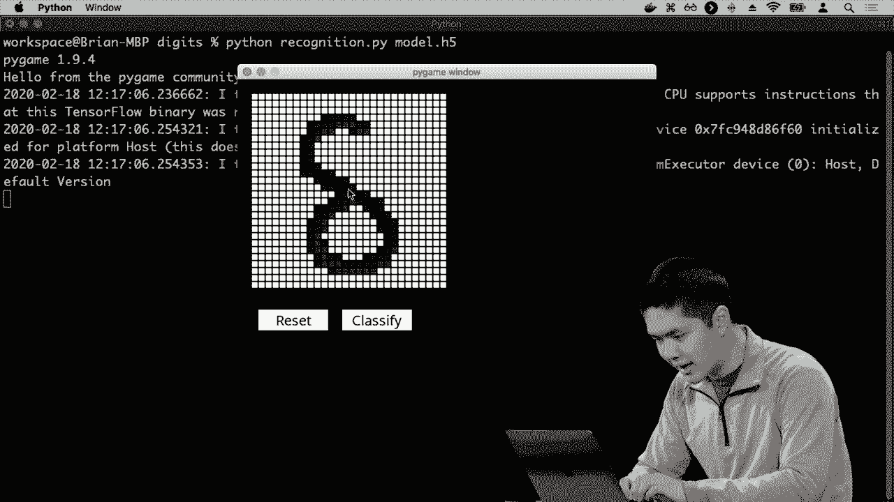
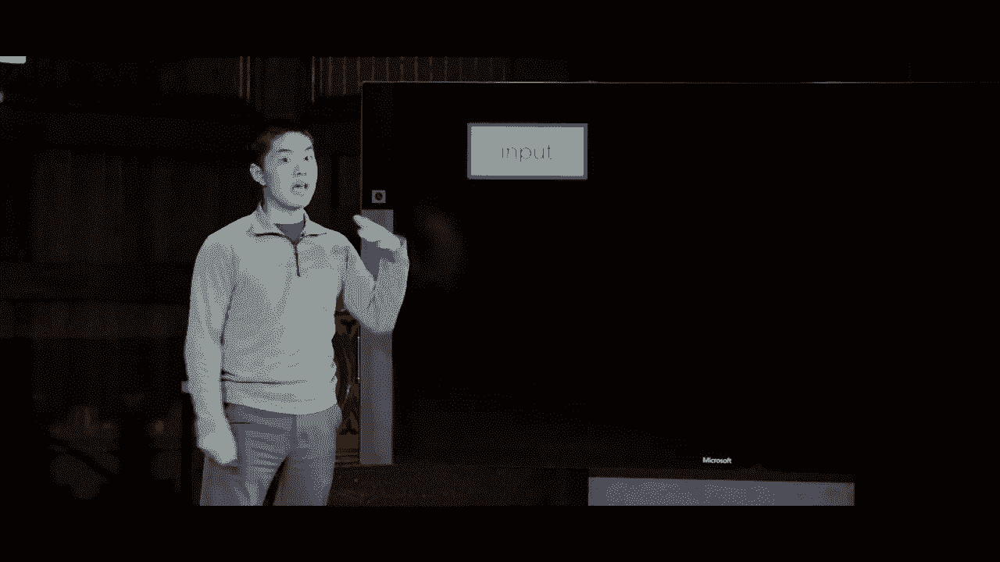
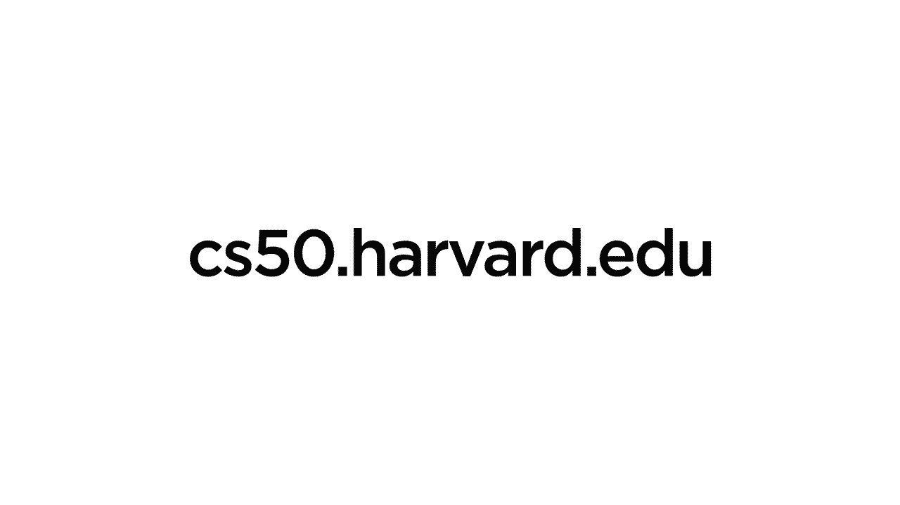

# 哈佛 CS50-AI 19：L5- 神经网络 3 (卷积神经网络，循环神经网络) 🧠





在本节课中，我们将要学习两种功能强大的神经网络结构：卷积神经网络（CNN）和循环神经网络（RNN）。我们将了解它们如何工作，以及它们为何在处理图像和序列数据时特别有效。

***

## 🖼️ 卷积神经网络（CNN）

上一节我们介绍了神经网络的基础概念，本节中我们来看看如何将神经网络应用于图像分析。卷积神经网络是一种专门用于处理具有网格状拓扑结构数据（如图像）的神经网络。

### 核心概念：卷积与池化



卷积神经网络的工作原理是，从输入图像（一个像素网格）开始，首先应用一个卷积步骤。

卷积步骤涉及将一些不同的图像滤波器（或称为核）应用于原始图像，以得到我们称之为特征图的结果。每个特征图可能从图像中提取出一些不同的相关特征。

我们可以训练神经网络学习这些滤波器的值，以便从原始图像中提取出最有用的信息。其目标是找出能最小化损失函数的滤波器值设置。

卷积后得到的特征图通常尺寸较大，包含很多像素值。因此，接下来的逻辑步骤是池化。

池化步骤通过使用最大池化等方法减少这些图像的大小。最大池化从特定区域提取最大值。也可以使用平均池化，取一个区域的平均值。

池化会降低特征图的维度，最终我们得到更小的网格。这使处理更容易，意味着输入更少，并且对像素值的微小变化更具鲁棒性。

### CNN的一般结构

在我们完成池化步骤后，我们拥有一堆值。然后我们可以将这些值展平，并放入一个更传统的神经网络中。

以下是卷积网络的一般结构：
1.  从图像开始。
2.  应用卷积。
3.  应用池化。
4.  展平结果。
5.  将其放入一个更传统的神经网络（可能包含隐藏层）。

这种结构帮助我们利用对图像结构的先验知识，以获得更好的结果，并能更快地训练网络，以更好地捕捉图像的特定部分。

### 深度卷积网络

在实践中，没有理由只使用这些步骤一次。你可以在多个不同的步骤中多次使用卷积和池化。

首先从图像开始，应用卷积以获得一堆特征图。然后应用池化。接着可以再次应用卷积来尝试提取更高级的特征，然后再对这些结果应用池化以降低维度，最后将其输入到一个神经网络中。



这种模型的目标是，在每个步骤中，你可以开始学习原始图像的不同类型特征。在第一步中你学习非常低级的特征，比如边缘、曲线和形状。一旦你有了表示这些低级特征的特征图，你可以再次应用相同的过程来开始寻找更高层次的特征，比如物体的部件或更复杂的形状。

### CNN的优势与应用

卷积神经网络在这类模型中非常强大且受欢迎，尤其在分析图像时。它们模拟了人类看图像的方式，不是同时查看每一个像素，而是查看图像的不同区域并提取相关信息和特征。

你可以想象将其应用于手写识别的情境。

***

## ✍️ 手写识别实例

现在我们就来看看一个手写识别的例子。我们将使用著名的MNIST数据集，它包含大量手写数字样本。



### 数据准备

首先需要将图像数据转换为可以输入到卷积神经网络中的格式。这包括将所有像素值（0-255之间）除以255，把它们转换为0到1的范围，这可能更容易训练。

### 构建CNN模型

以下是一个使用TensorFlow/Keras构建的简单CNN模型结构示例：

```python
model = tf.keras.models.Sequential([
  # 第一层：卷积层，学习32个3x3的滤波器
  tf.keras.layers.Conv2D(32, (3, 3), activation='relu', input_shape=(28, 28, 1)),
  # 第二层：最大池化层，使用2x2的池化大小
  tf.keras.layers.MaxPooling2D((2, 2)),
  # 将二维特征图展平为一维向量
  tf.keras.layers.Flatten(),
  # 添加一个具有128个单元的隐藏层
  tf.keras.layers.Dense(128, activation='relu'),
  # 添加Dropout层以防止过拟合，训练时随机丢弃一半节点
  tf.keras.layers.Dropout(0.5),
  # 输出层：10个单元，对应数字0-9，使用softmax激活函数
  tf.keras.layers.Dense(10, activation='softmax')
])
```

在这个模型中：
*   **输入形状**是`(28, 28, 1)`，因为MNIST图像是28x28像素的灰度图（单通道）。
*   卷积层学习多个滤波器来提取特征。
*   池化层减少数据维度。
*   Dropout层在训练期间随机“关闭”一部分神经元，有助于防止模型过拟合。
*   输出层使用**softmax**激活函数，将输出转换为概率分布，表示图像属于每个数字类别的概率。

### 训练与评估

编译模型后，可以在训练数据上进行拟合。训练过程涉及通过反向传播和梯度下降来调整网络权重和滤波器的值。

训练完成后，可以将模型保存到文件中，以便后续直接使用已学习好的模型进行预测，而无需重新训练。


***

## 🔁 循环神经网络（RNN）

上一节我们介绍了处理空间数据（如图像）的CNN，本节中我们来看看如何处理序列数据（如文本、时间序列）。循环神经网络是一种用于处理序列数据的神经网络。

### 前馈神经网络的限制



传统的前馈神经网络（Feedforward Neural Network）中，连接仅在一个方向上，从输入层经过隐藏层到输出层。这种结构有其限制，特别是输入和输出需要有固定的大小（固定数量的神经元）。

这对于处理可变长度的序列（如句子、视频帧）构成了挑战。

### RNN的核心思想

循环神经网络的关键思想是，网络生成的输出可以反馈到自身，作为下一次计算的输入的一部分。这使得网络能够维持一种“状态”，存储一些可以在未来使用的信息。

在处理数据序列时，这特别有用。网络不仅基于当前输入，还基于它从之前步骤中“记住”的信息来产生输出。

### RNN的结构类型

循环神经网络可以用于多种输入-输出关系：

1.  **一对一**：标准的前馈神经网络，单一输入，单一输出。
2.  **一对多**：单一输入，序列输出。例如，**图像描述生成**：输入一张图片，输出描述该图片的一句话。
    *   策略：网络接收图像输入，生成第一个词；然后将这个词作为输入反馈给网络，生成第二个词；如此循环，直到生成完整的句子。
3.  **多对一**：序列输入，单一输出。例如，**情感分析**：输入一个句子（单词序列），输出该句子的情感是正面还是负面。
4.  **多对多**：序列输入，序列输出。例如，**机器翻译**：输入一种语言的句子，输出另一种语言的句子。
    *   策略：网络先编码整个输入序列的信息，然后基于这个编码状态，逐步解码生成输出序列。

### RNN的应用

循环神经网络在处理序列时非常强大，特别是在自然语言处理领域：
*   **语音识别**：将音频波形序列转换为文本。
*   **机器翻译**：如Google Translate使用的技术。
*   **视频分析**：将视频帧序列分类或生成描述。

一种特别流行且强大的RNN变体是**长短期记忆网络（LSTM）**，它能够更好地学习长期依赖关系。

***

## 📝 总结

本节课中我们一起学习了两种高级的神经网络结构：
1.  **卷积神经网络（CNN）**：通过**卷积**和**池化**操作，高效处理图像等网格数据，自动学习层次化特征（从边缘到物体部件）。
2.  **循环神经网络（RNN）**：通过将输出反馈为输入，赋予网络“记忆”能力，非常适合处理文本、语音、时间序列等**序列数据**，实现了一对多、多对一和多对多的复杂映射。



这些工具是机器学习中非常强大的组成部分，能够基于输入数据学习复杂的函数映射，广泛应用于计算机视觉和自然语言处理等领域。在接下来的课程中，我们将更深入地探讨人工智能在自然语言理解方面的应用。