# 哈佛 CS50-AI 22：L6- 自然语言处理 3 (信息抽取，词网，word2vec) 🧠

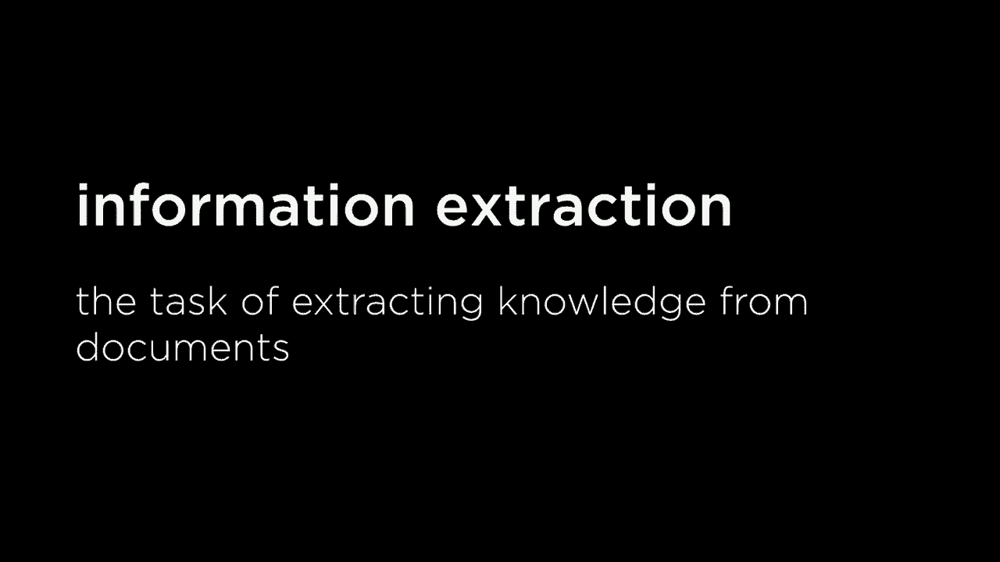

在本节课中，我们将要学习自然语言处理中更高级的主题。我们将探讨如何从文本中自动提取结构化信息，了解如何通过词网（WordNet）建立词语间的语义关系，并深入理解一种强大的词向量表示方法——word2vec。这些技术是让计算机真正“理解”语言含义的关键。

## 信息抽取 📊

上一节我们讨论了句法和语义分析，本节中我们来看看如何从非结构化的文本中自动提取有用的知识，这个过程称为信息抽取。

信息抽取就是从文档中提取知识，其目标是让AI能够自动化地查看大量文本，并找出其中有用的相关信息。

让我们看一个例子。以下是两篇新闻文章的片段，一篇关于Facebook，另一篇关于亚马逊。

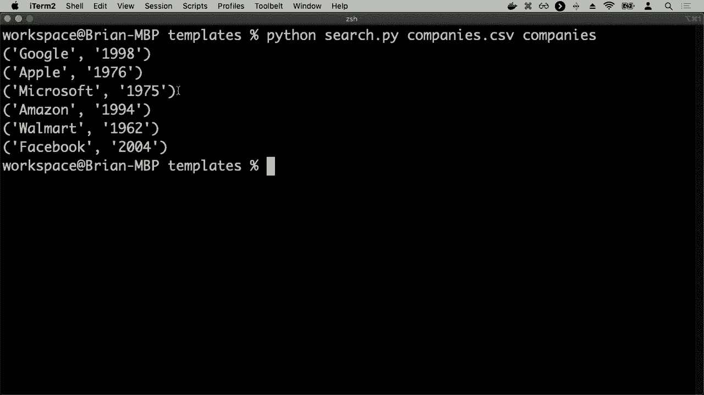

> Facebook was founded in 2004.
> Amazon was founded in 1994.

我们可能希望AI能够从这些文本中提取出“公司”和“成立年份”这样的信息。具体来说，我们想知道Facebook成立于2004年，亚马逊成立于1994年。

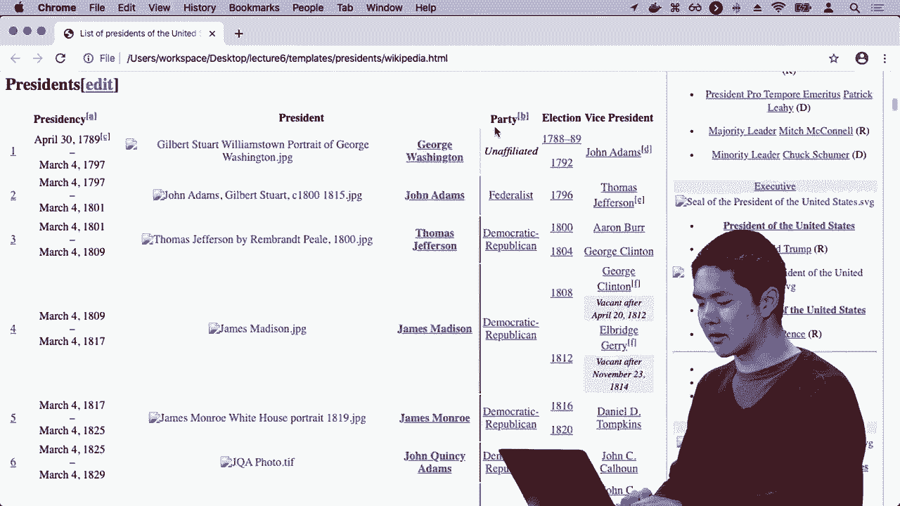

那么，如何从文本中自动提取这些信息呢？一种方法是寻找文本中反复出现的固定模式或模板。

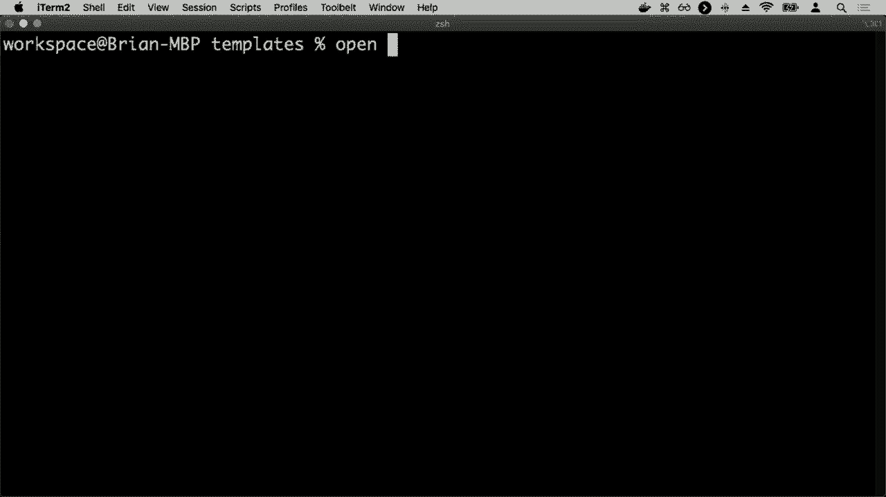

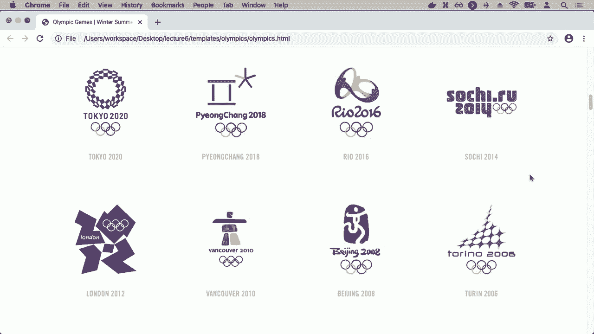

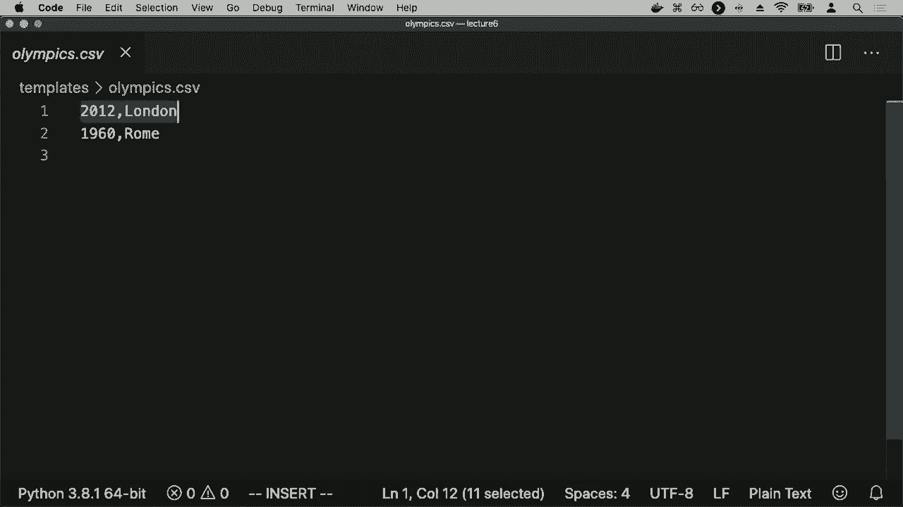

我们会注意到这两句话有一个共同的模式：“[公司名] was founded in [年份].”。这个模板为我们提供了一种提取信息的机制：当匹配到“____ was founded in ____”这种模式时，我们可以合理地推断，第一个空白处是公司名称，第二个空白处是该公司成立的年份。

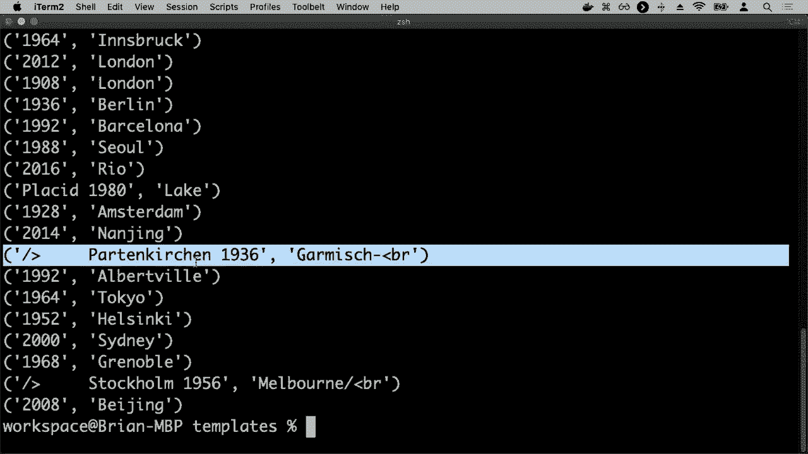

以下是实现信息抽取的基本思路：
1.  为AI提供一些预定义的模板。
2.  让AI在文档语料库中搜索匹配这些模板的句子。
3.  从匹配的句子中提取出模板中空白处对应的实体信息。

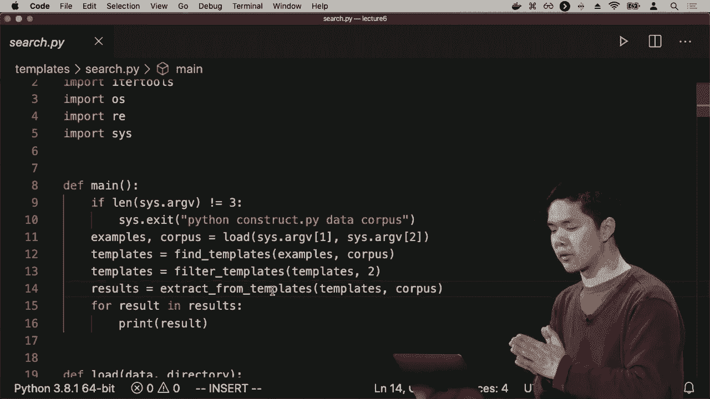

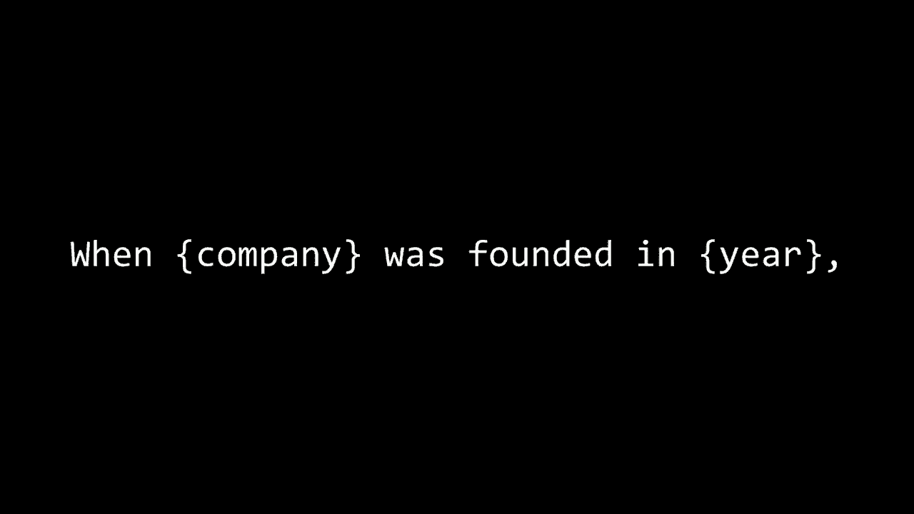

然而，这种方法需要我们手动编写模板，并且不同的网站表达同一信息的方式可能不同。如果词语顺序稍有变化，固定的模板就可能无法匹配。

我们可以采用一种更自动化的方法：不是给AI模板，而是给AI一些已知的实体关系对。

例如，我们给AI提供数据对：`(Amazon, 1994)` 和 `(Facebook, 2004)`。然后，AI会在海量文本中自行寻找同时包含这两个实体的句子，并从中发现连接它们的常见表达方式（如“was founded in”）。AI可以利用这些新发现的模式，去语料库中寻找并提取其他类似的`(公司, 成立年份)`关系对。

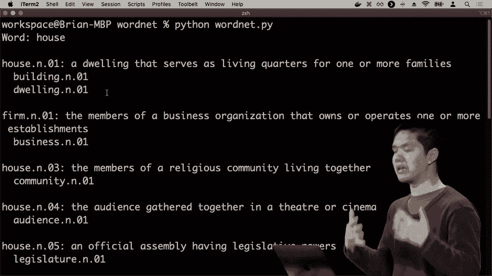

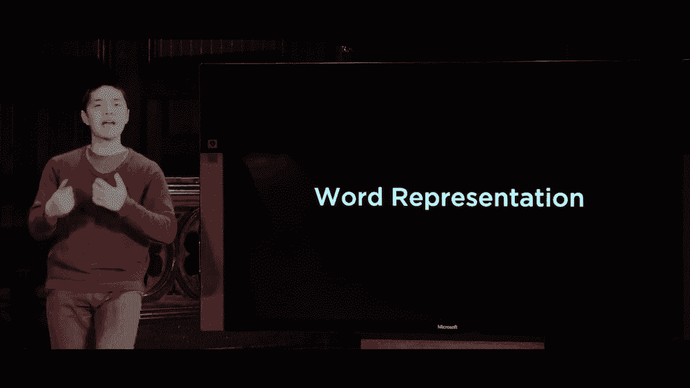

这种方法本质上是一种自动化的模板生成，在实践中非常强大。通过提供少量种子数据，AI可以学习到通用的信息抽取模式。

## 词网（WordNet）与语义关联 🔗

信息抽取依赖于具体的文本模式，但如果我们想更深入地理解词语本身的含义及其相互关系，就需要借助语义知识库。

一个著名的语义知识库是**词网（WordNet）**。词网是一个由研究人员共同编纂的大型词汇数据库，它定义了词语的各种含义（因为一个词可能有多个意思），并建立了词语之间的语义关系。

在词网中，词语根据其含义被组织成同义词集合（synsets）。例如，“城市”这个词可能关联到“市政区域”、“居住地”等不同的概念类别。通过词网，我们可以查询一个词的定义、同义词、上位词（如“房子”是一种“建筑”）和下位词等关系。

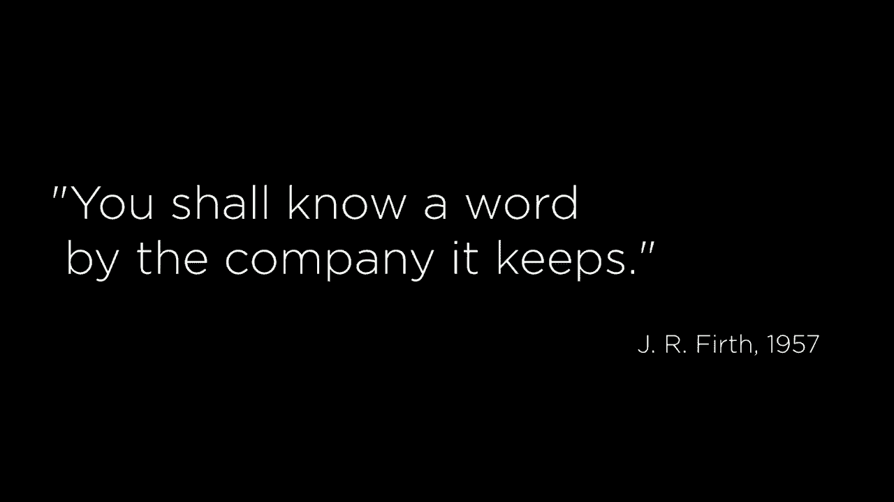

词网的优势在于它能将词语与其它相关词语系统地连接起来，为理解词义提供了结构化的知识。然而，它的构建和维护需要大量人工，难以覆盖语言的所有变化和新出现的词汇关系。

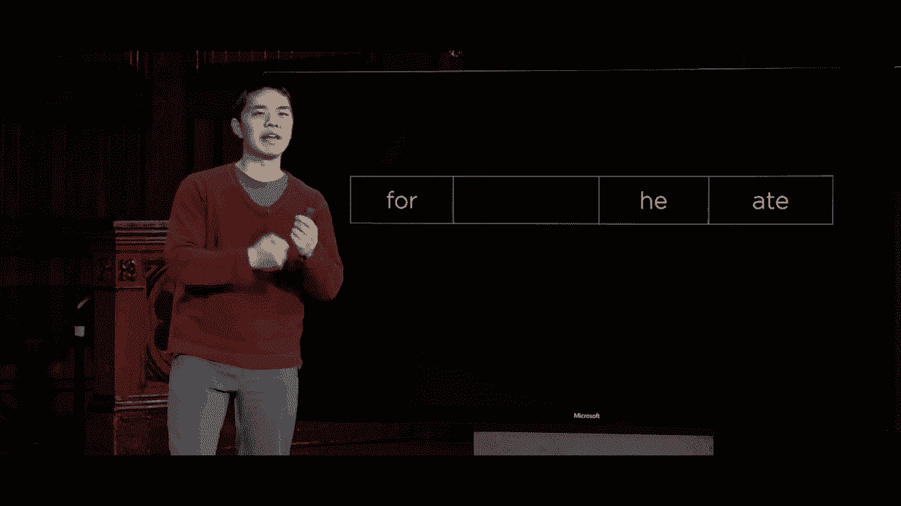

## 词的向量表示：从独热编码到Word2Vec 📐

为了能让计算机更好地处理词语的含义并将其用于机器学习模型（如神经网络），我们需要一种数值化的表示方法。

最初级的方法是**独热编码（One-Hot Encoding）**。假设我们的词典只有四个词：[他， 写， 一， 书]。那么：
*   “他”可以表示为 `[1, 0, 0, 0]`
*   “写”可以表示为 `[0, 1, 0, 0]`
*   “书”可以表示为 `[0, 0, 0, 1]`

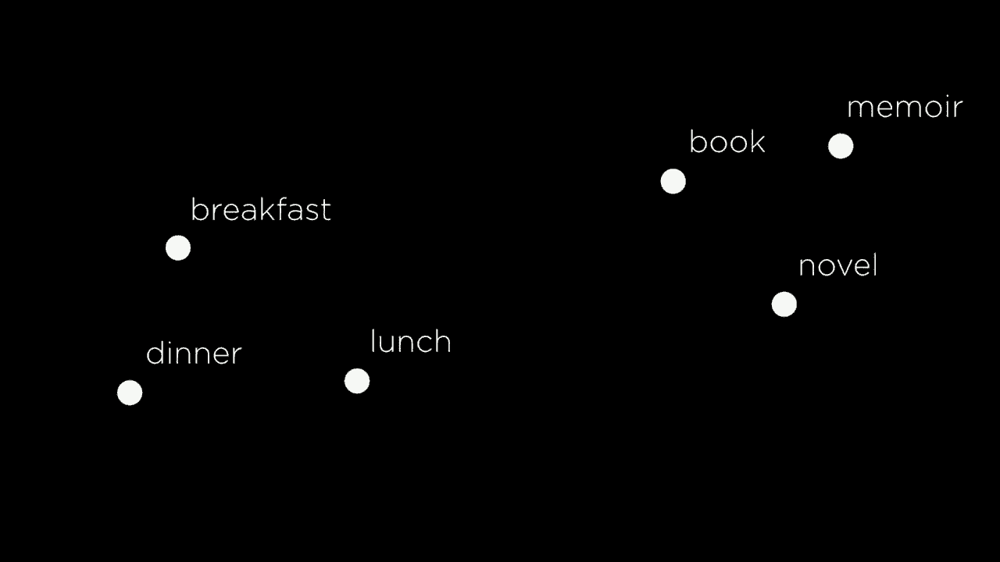

这种表示方法有两个主要缺点：
1.  **维度灾难**：如果词典有5万个词，每个词向量就是5万维，其中只有一个是1，其余全是0，非常稀疏且低效。
2.  **无法表达语义相似性**：在这种表示下，“写”和“创作”、“书”和“小说”的向量彼此正交，没有任何相似性，尽管它们的含义是相近的。

我们真正需要的是**分布式表示（Distributed Representation）**，即用一个相对较短（如50维或100维）、每个维度都有实数值的向量来表示一个词。理想情况下，语义相近的词，其向量在空间中的位置也应当接近。

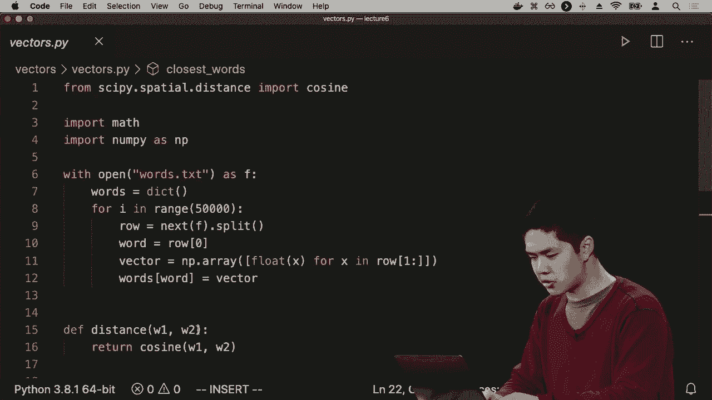

那么，如何得到这样的向量呢？一个核心思想来自语言学家J.R. Firth的名言：“**你可以通过一个词的结伴词来了解它**”。换言之，一个词的意义由其上下文（周围经常共同出现的词）决定。

**Word2Vec** 正是基于这一思想的著名算法。它通过训练一个神经网络模型来学习词向量。一种常见的Word2Vec模型架构是 **Skip-gram**。

Skip-gram模型的目标是：给定一个中心词（如“午餐”），预测它周围特定窗口内可能出现的上下文词（如“吃”、“早餐”、“丰盛的”）。在训练过程中，模型会调整每个词的向量表示，使得在相似上下文中出现的词（如“早餐”、“晚餐”）具有相似的向量。

训练完成后，每个词都被映射为一个固定长度的稠密向量。这些向量编码了丰富的语义信息。

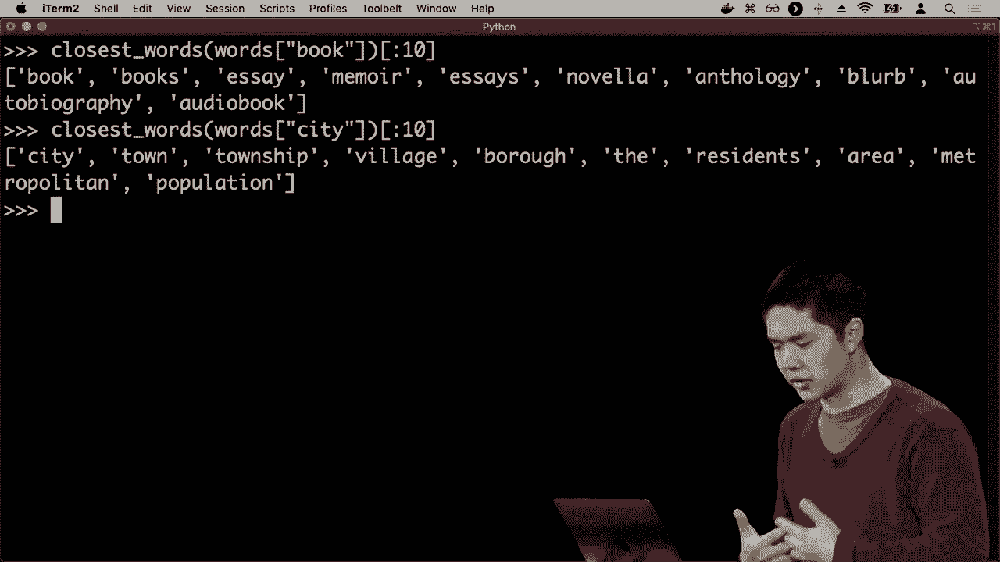

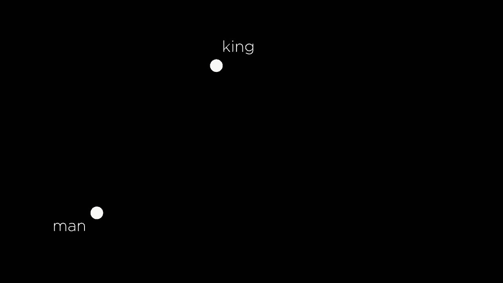

## Word2Vec向量的魔力 ✨

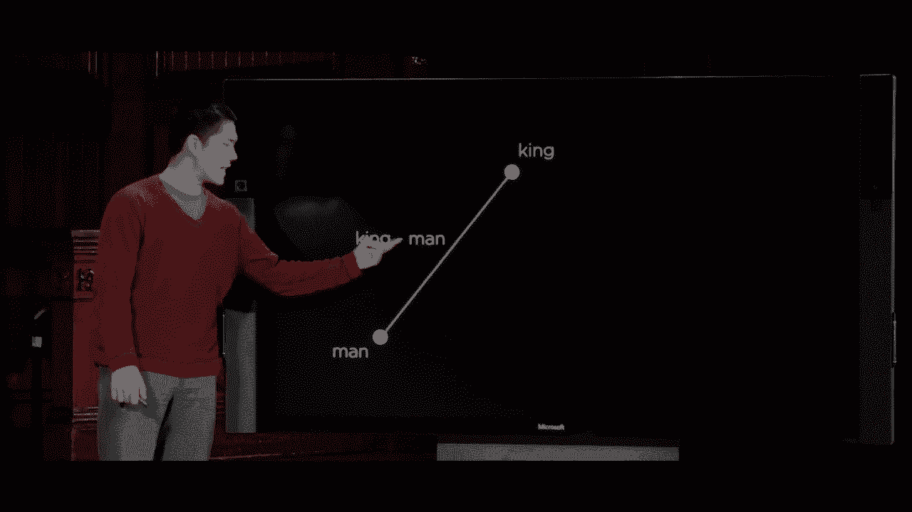

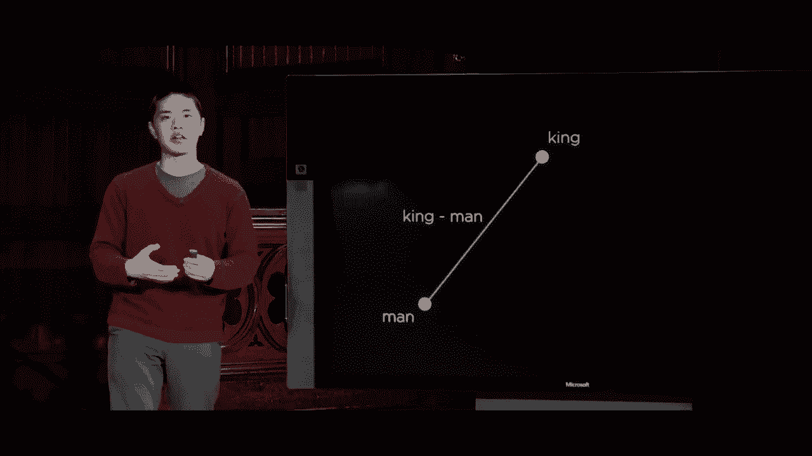

词向量的强大之处不仅在于它能找到语义相似的词（例如，“书”的相近词可能是“小说”、“回忆录”），更在于我们可以对这些向量进行**数学运算**，从而发现词之间的类比关系。

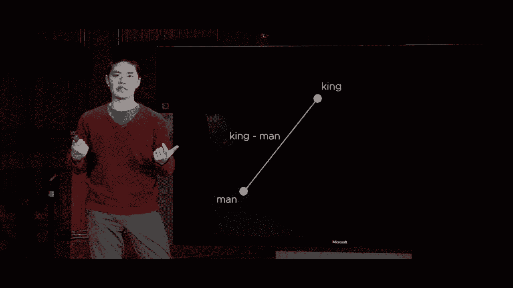

一个经典的例子是：`国王 - 男人 + 女人 ≈ 女王`
用向量运算表示就是：`vector(“国王”) - vector(“男人”) + vector(“女人”)` 的结果向量，最接近 `vector(“女王”)`。

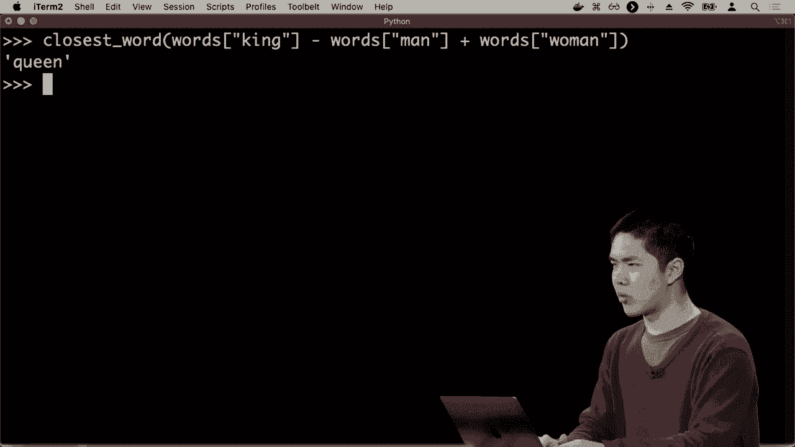

这说明了词向量空间中的方向可以编码词语间的特定关系（如“性别”关系）。我们可以进行更多类比推理：
*   `巴黎 - 法国 + 英格兰 ≈ 伦敦` （首都与国家的关系）
*   `教师 - 学校 + 医院 ≈ 护士` （职业与工作场所的关系）
*   `拉面 - 日本 + 美国 ≈ 卷饼` （特色食品与国家的关系）

这些类比能力并非预先编程，而是模型从海量文本数据中自动学习到的统计规律，展现了分布式词向量在捕捉复杂语义关系方面的巨大潜力。

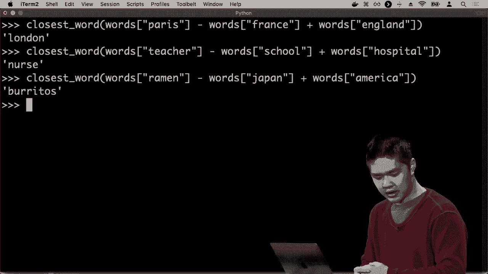

## 总结 📝

本节课中我们一起学习了自然语言处理中三个核心进阶主题。

首先，我们探讨了**信息抽取**，它使AI能够从非结构化文本中自动提取结构化知识，无论是通过预定义模板还是通过自动化模式学习。

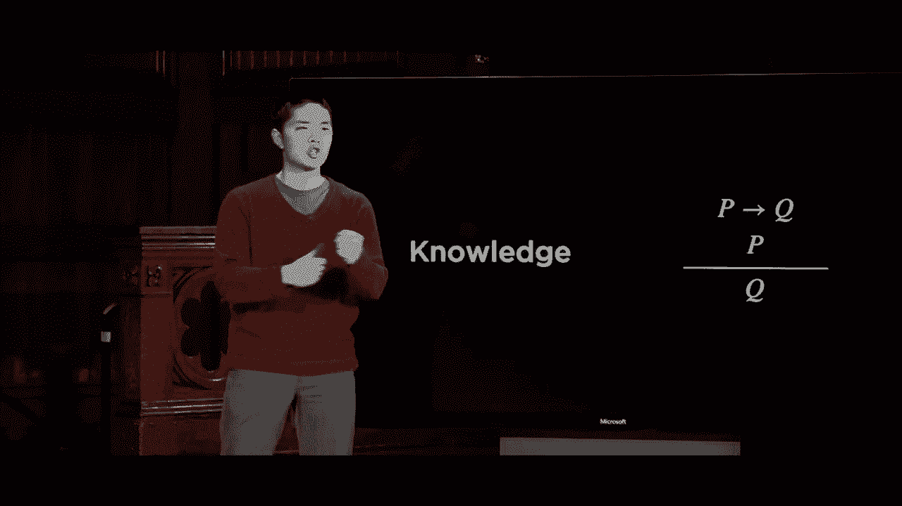

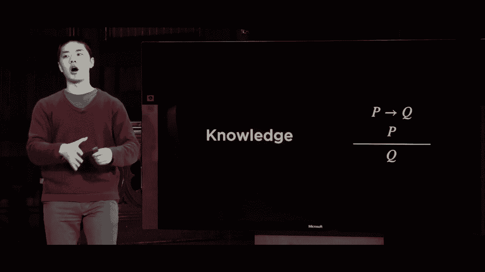

接着，我们介绍了**词网（WordNet）**，这是一个人工构建的语义知识库，帮助我们理解词语的定义和它们之间的层级关系。

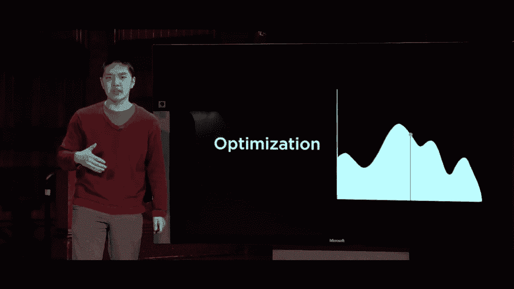

最后，我们深入学习了**词向量**，特别是**Word2Vec**模型。我们了解到，将词语表示为稠密的数值向量（而非稀疏的独热编码）是自然语言处理的关键突破。这些向量不仅紧凑高效，更能通过向量空间中的距离和方向来编码丰富的语义信息，甚至支持有趣的类比推理，为机器理解语言含义奠定了坚实基础。

从搜索、优化、不确定性处理，到神经网络和如今的语义理解，我们见证了AI如何一步步学习处理越来越复杂和抽象的任务。自然语言处理仍然是AI研究中充满活力与挑战的领域，希望本次课程为你打开了探索这扇大门。