# 哈佛CS50课程笔记 📝｜ 计算机科学导论(2020·完整版) - P6：L3- 算法（结构体、搜索与排序）1


## 概述

在本节课中，我们将要学习算法的核心概念，特别是搜索算法。我们将从回顾上周的工具开始，然后深入探讨线性搜索和二分搜索的实现与效率分析。此外，我们还将学习如何在C语言中创建自定义的数据结构（结构体），以便更有效地组织和管理数据。

---

## 回顾上周的工具

上一节我们讨论了解决问题的方法和调试工具。本节中，我们来看看这些工具如何帮助我们编写更好的代码。

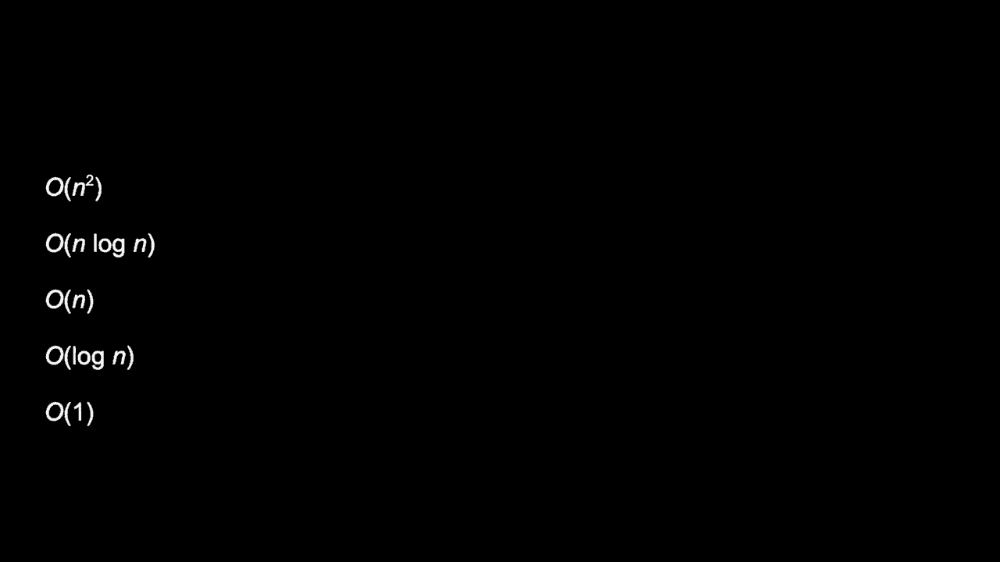

以下是上周介绍的一些关键工具：

*   **调试器 (debug 50)**：一个交互式调试器，允许你设置断点、查看变量状态和跟踪代码执行流程。
*   **代码风格检查工具**：提供关于代码格式和风格的反馈。
*   **正确性检查工具 (check 50)**：自动检查你的代码在给定问题上的正确性。
*   **打印输出 (printf)**：一种基本的调试方法，用于在屏幕上显示信息。
*   **“橡皮鸭”调试法**：通过向他人（或物体）解释你的代码来发现逻辑错误。

## 理解内存与数组


上一节我们回顾了内存和数组的概念。本节中，我们来看看数组如何成为实现搜索算法的基础。

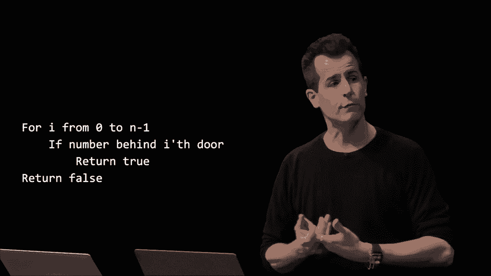


计算机的内存可以看作是一系列连续的字节。数组允许我们在内存中连续存储多个相同类型的值。例如，我们可以用一个数组`scores`来存储三个分数，而不是使用三个独立的变量`scores_one`、`scores_two`和`scores_three`。


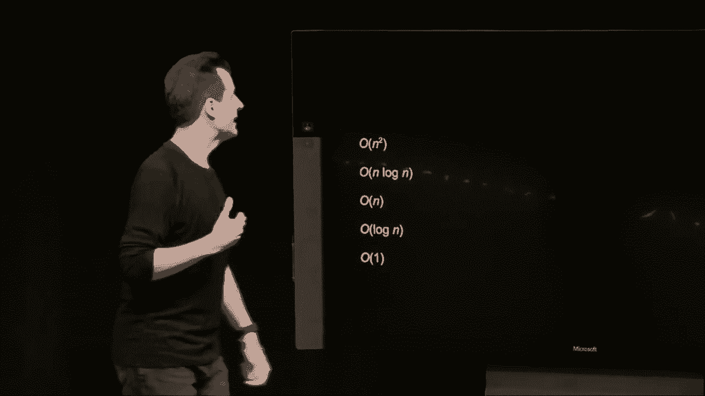

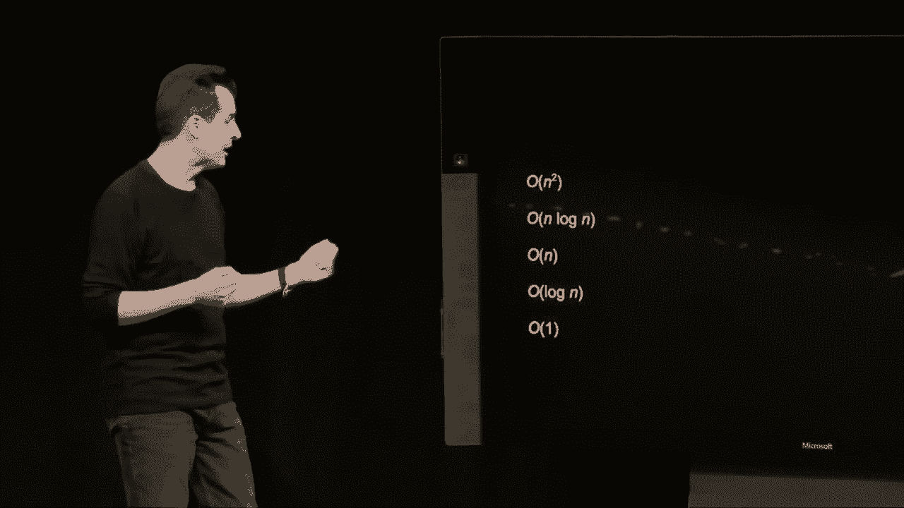

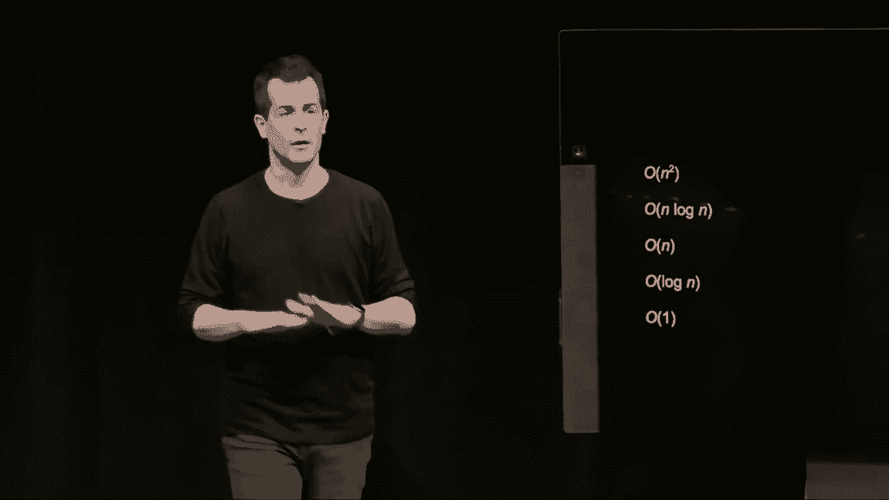

**代码示例：**
```c
int scores[3] = {95, 87, 92};
```


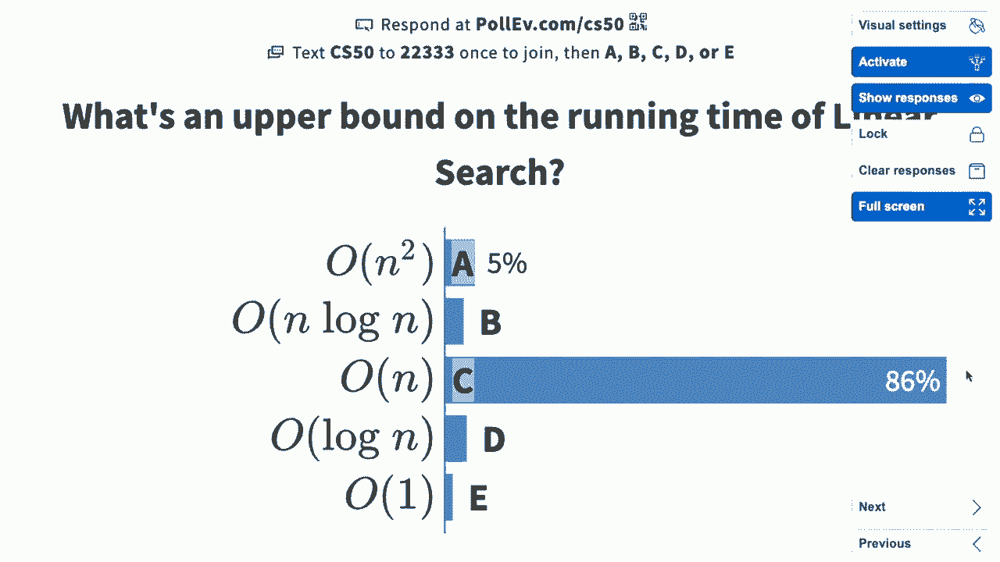

然而，计算机一次只能“查看”数组中的一个元素。这种特性决定了我们搜索数组的方式必须是循序渐进的，即通过算法来实现。

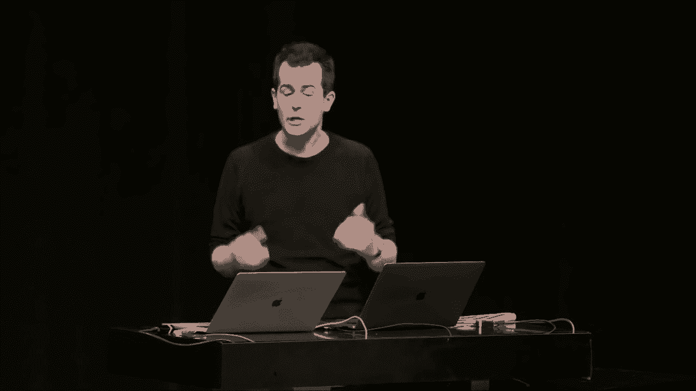

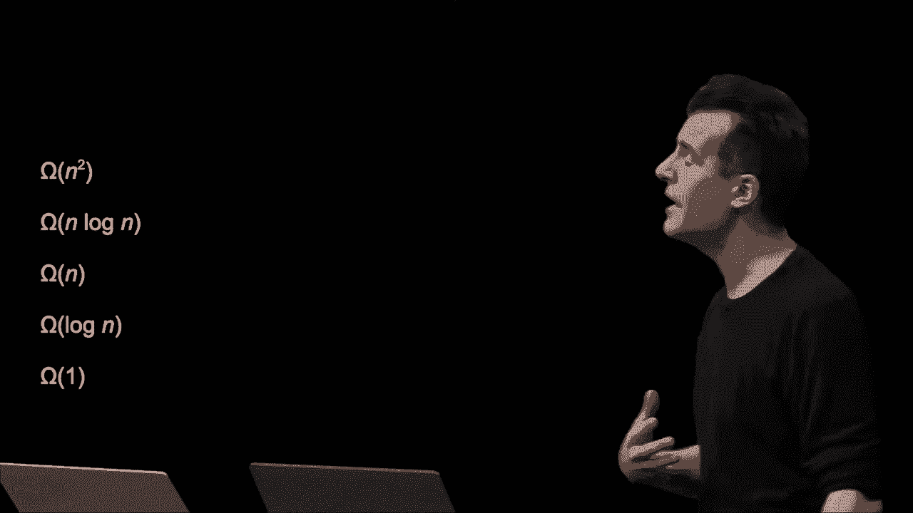


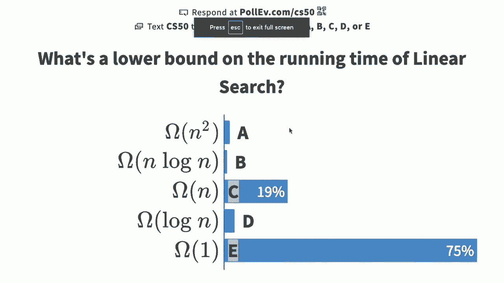


## 算法运行时间与大O表示法


在讨论具体搜索算法之前，我们需要一种方法来描述算法的效率。这就是运行时间分析和大O表示法。


**运行时间**指的是一个算法解决问题所需的时间或步骤数量。
**大O表示法 (Big O notation)** 是计算机科学家用来描述算法运行时间上限（最坏情况）的一种方式。它关注的是随着输入规模`n`（例如数组中的元素数量）增长，运行时间的增长趋势，并忽略常数因子和低阶项。

以下是几种常见的大O复杂度：

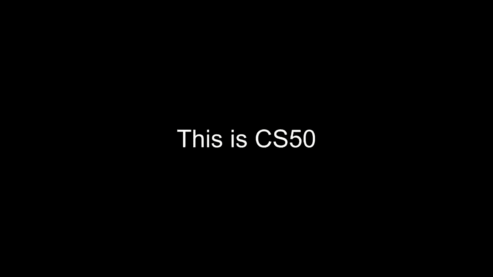

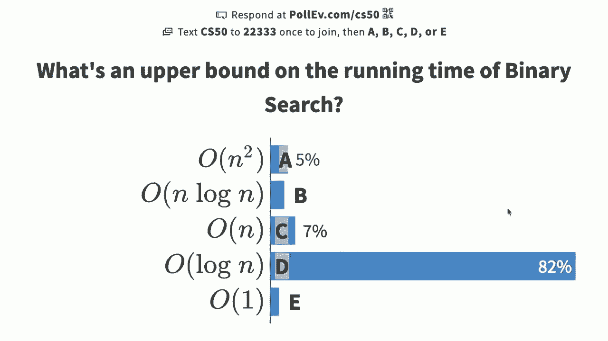

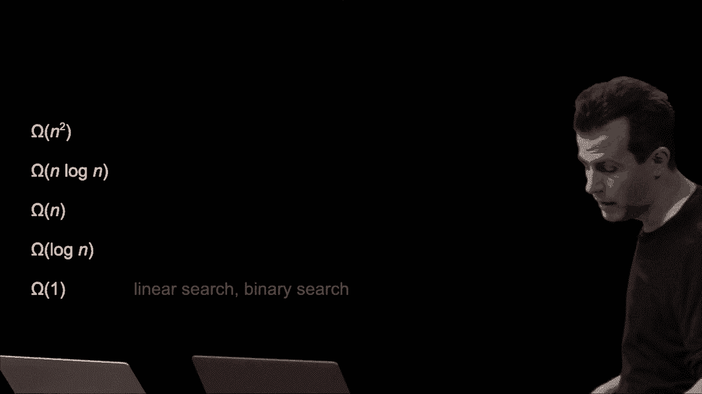

*   **O(1)**：常数时间。无论输入多大，运行时间都是固定的。
*   **O(log n)**：对数时间。运行时间随输入规模呈对数增长，非常高效。
*   **O(n)**：线性时间。运行时间与输入规模成正比。
*   **O(n²)**：平方时间。运行时间随输入规模呈平方增长，对于大规模输入可能较慢。

在之前的电话簿例子中，我们见过三种搜索方法：
1.  逐页搜索（线性搜索）：**O(n)**
2.  每次翻两页：**O(n/2)**，在大O表示法中简化为 **O(n)**
3.  不断对半分割（二分搜索）：**O(log n)**


## 实现线性搜索

上一节我们介绍了运行时间的概念。本节中，我们来看看如何实现最简单的搜索算法：线性搜索。

线性搜索的思路很简单：从数组的第一个元素开始，逐个检查每个元素，直到找到目标值或遍历完整个数组。

**伪代码实现：**
```
For i from 0 to n-1
    If number behind i-th door
        Return true
Return false
```

**C语言代码示例 (搜索数字)：**
```c
int numbers[] = {4, 6, 8, 2, 7, 5, 0};
int n = 7;

for (int i = 0; i < n; i++)
{
    if (numbers[i] == 0)
    {
        printf("Found\n");
        return 0; // 成功，返回0
    }
}
printf("Not found\n");
return 1; // 失败，返回1
```

**C语言代码示例 (搜索字符串 - 注意字符串比较)：**
```c
string names[] = {"Bill", "Charlie", "Fred", "George", "Ginny", "Percy", "Ron"};

for (int i = 0; i < 7; i++)
{
    // 使用 strcmp 比较字符串，相等时返回 0
    if (strcmp(names[i], "Ron") == 0)
    {
        printf("Found\n");
        return 0;
    }
}
printf("Not found\n");
return 1;
```
**注意**：在C语言中，不能使用`==`直接比较字符串，必须使用`strcmp`函数。

### 线性搜索的效率分析

*   **最坏情况运行时间 (上界)**：如果目标元素在数组末尾或不存在，我们需要检查所有`n`个元素。因此，上限是 **O(n)**。
*   **最好情况运行时间 (下界)**：如果目标元素恰好在数组开头，我们只需一步就能找到。因此，下限是 **Ω(1)**。

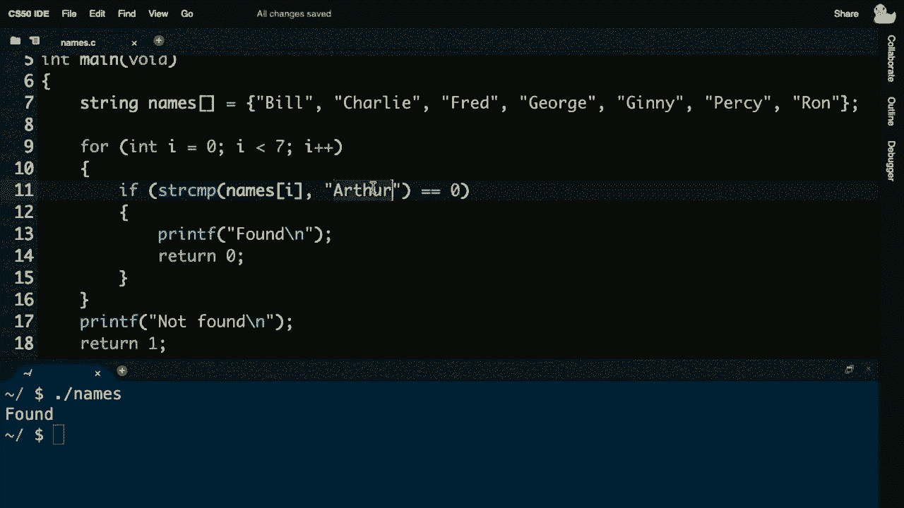


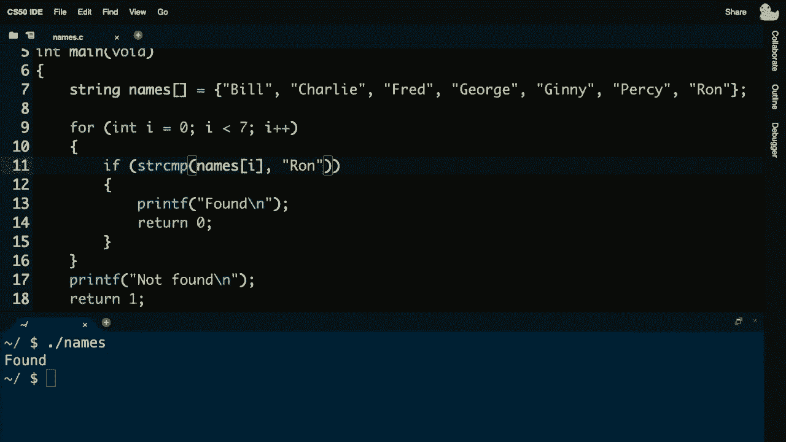


## 实现二分搜索


线性搜索在数组未排序时是唯一的选择。但如果数组已经排序，我们可以使用更高效的二分搜索算法。

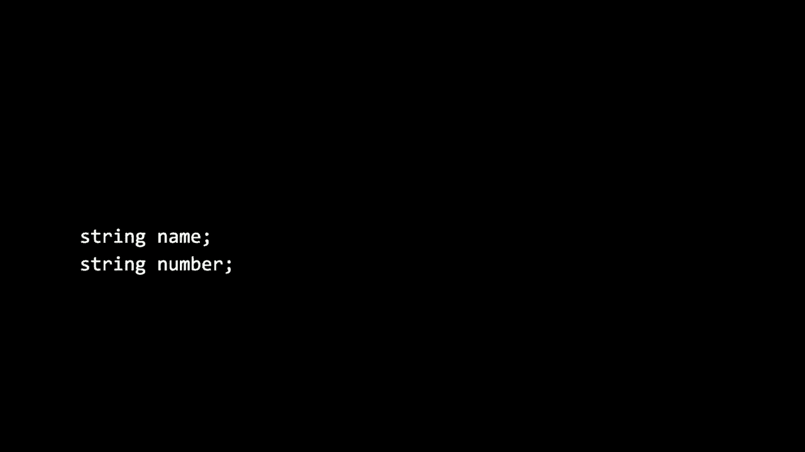

二分搜索利用了数组已排序的特性：
1.  查看数组中间的元素。
2.  如果中间元素正好是目标值，则搜索成功。
3.  如果目标值小于中间元素，则在数组的左半部分重复搜索。
4.  如果目标值大于中间元素，则在数组的右半部分重复搜索。
5.  如果搜索范围为空，则目标值不存在。


**伪代码实现：**
```
If no doors left
    Return false
If number behind middle door
    Return true
Else if number < middle door
    Search left half
Else if number > middle door
    Search right half
```

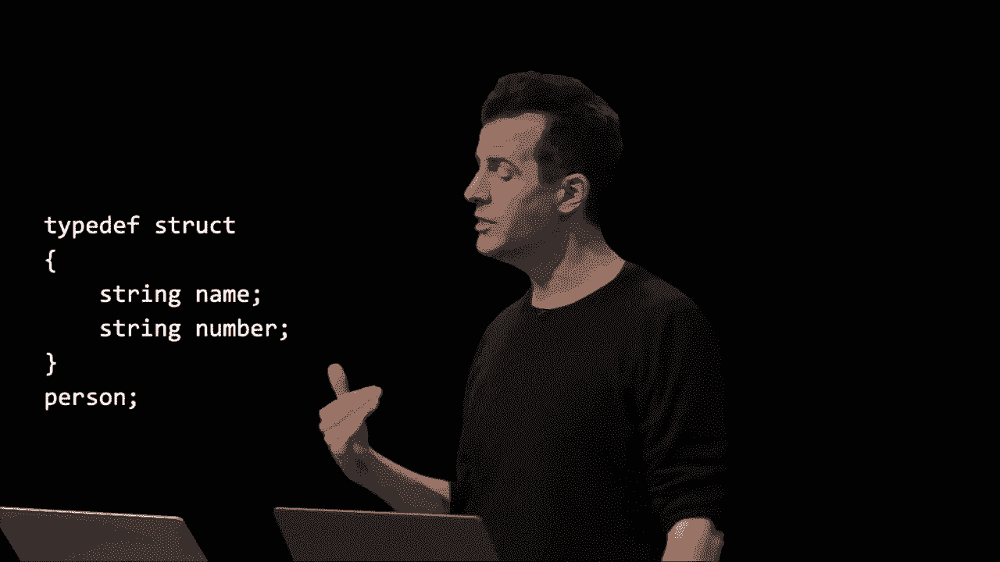

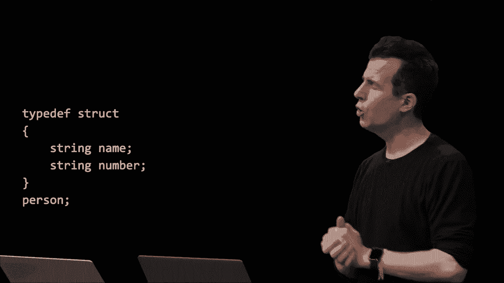

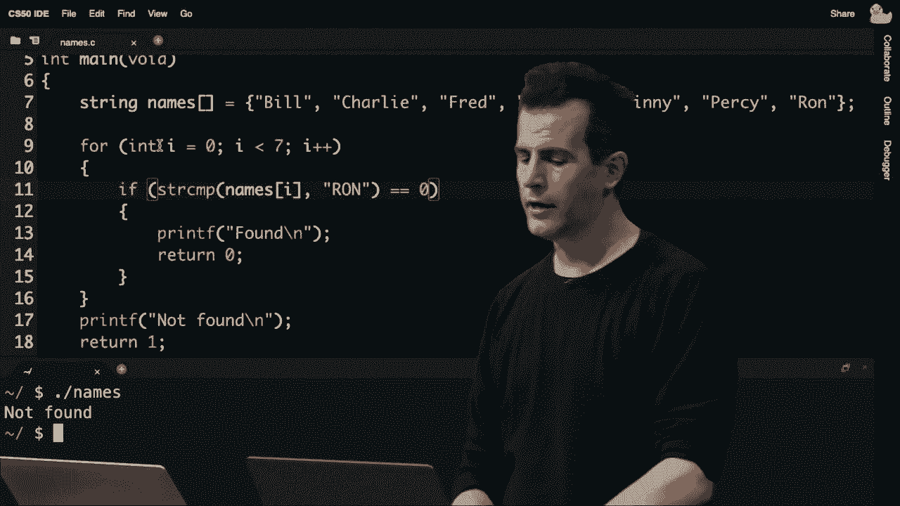


### 二分搜索的效率分析

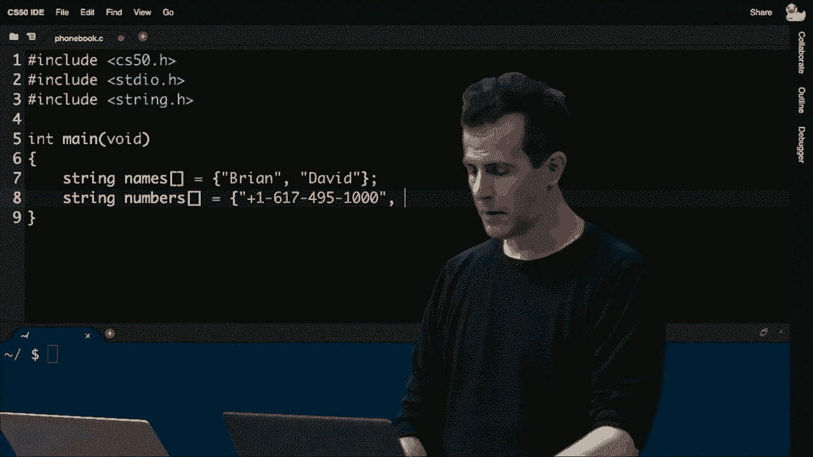

*   **最坏情况运行时间 (上界)**：每次都将问题规模减半，因此运行时间为 **O(log n)**。
*   **最好情况运行时间 (下界)**：如果目标值恰好位于第一次检查的中间位置，运行时间为 **Ω(1)**。

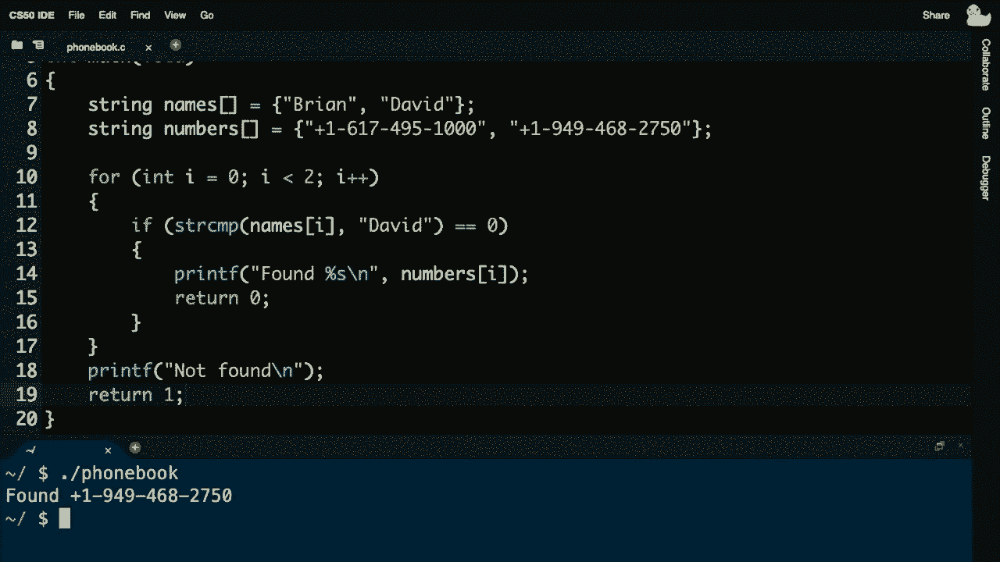


与线性搜索相比，当`n`很大时，**O(log n)** 比 **O(n)** 要快得多。例如，在64个元素中搜索，线性搜索最多需要64步，而二分搜索最多只需要6步（因为 log₂64 = 6）。

## 创建自定义数据结构：结构体

上一节我们实现了对简单数据的搜索。本节中，我们来看看如何将相关的数据捆绑在一起，形成更复杂的数据结构。

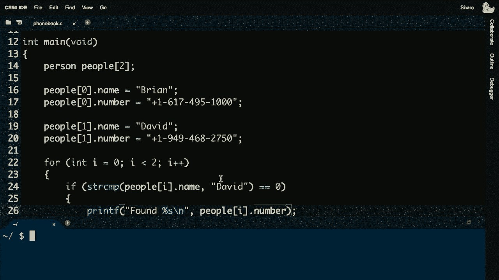


在实际应用中，数据项通常包含多个属性。例如，一个“联系人”可能包含“姓名”和“电话号码”。为了在代码中更好地组织这类数据，C语言允许我们创建自定义的数据类型，称为**结构体 (struct)**。


**不使用结构体的方式 (容易出错)：**
```c
string names[] = {"Brian", "David"};
string numbers[] = {"+1-617-495-1000", "+1-949-468-2750"};
// 需要手动确保 names[i] 和 numbers[i] 对应同一个人
```


**使用结构体的方式 (更清晰、更安全)：**
```c
// 定义一个新的数据类型 called ‘person‘
typedef struct
{
    string name;
    string number;
}
person;


int main(void)
{
    // 创建一个 person 类型的数组
    person people[2];

    // 为第一个 person 赋值
    people[0].name = "Brian";
    people[0].number = "+1-617-495-1000";

    // 为第二个 person 赋值
    people[1].name = "David";
    people[1].number = "+1-949-468-2750";

    // 搜索 David
    for (int i = 0; i < 2; i++)
    {
        // 使用点操作符 ‘.‘ 访问结构体内部的字段
        if (strcmp(people[i].name, "David") == 0)
        {
            printf("Found %s\n", people[i].number);
            return 0;
        }
    }
    printf("Not found\n");
    return 1;
}
```
通过使用`typedef struct`，我们将`name`和`number`这两个字段封装在一起，创建了一个名为`person`的新数据类型。这样，每个联系人的信息都被捆绑在一个变量中，代码更易于理解和维护，也避免了数据不同步的错误。


---


## 总结

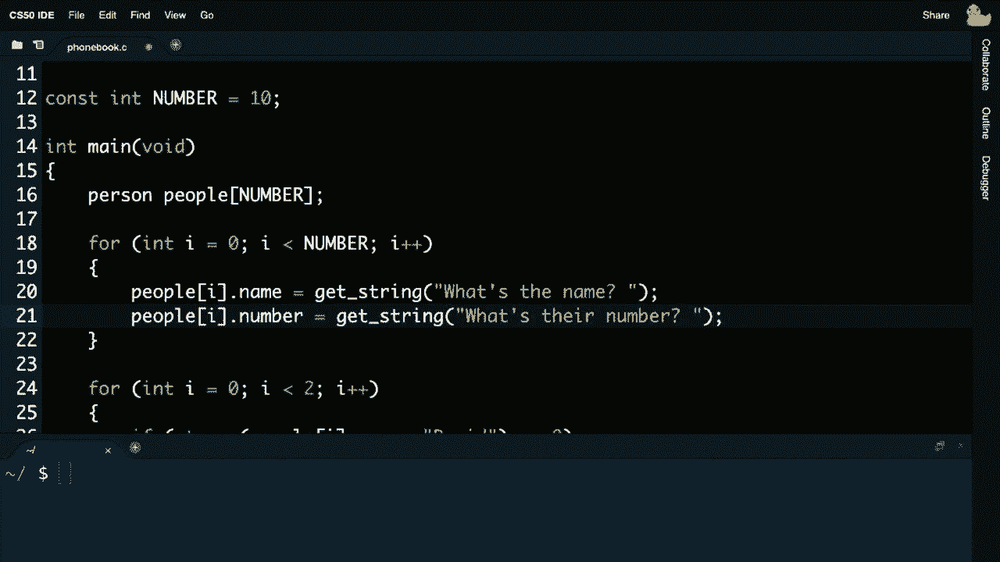

本节课中我们一起学习了算法的核心基础，重点是搜索。
*   我们回顾了用于分析和调试代码的工具。
*   我们学习了如何使用**大O表示法**来分析算法的运行时间效率。
*   我们实现了**线性搜索**算法，并分析了其**O(n)**的时间复杂度。
*   我们实现了更高效的**二分搜索**算法，它要求数据已排序，但其**O(log n)**的时间复杂度在处理大规模数据时优势显著。
*   最后，我们引入了**结构体**的概念，它允许我们将多个相关的数据项组合成一个自定义的数据类型，从而使程序的数据组织更加清晰和健壮。


理解这些搜索算法和数据结构是学习更复杂计算机科学概念的重要基石。在接下来的课程中，我们将探讨如何对数据进行排序，这是高效使用二分搜索的前提。