# 哈佛 CS50课程笔记 | 计算机科学导论 (2020·完整版) - P7：L3- 算法（结构体、搜索与排序）2


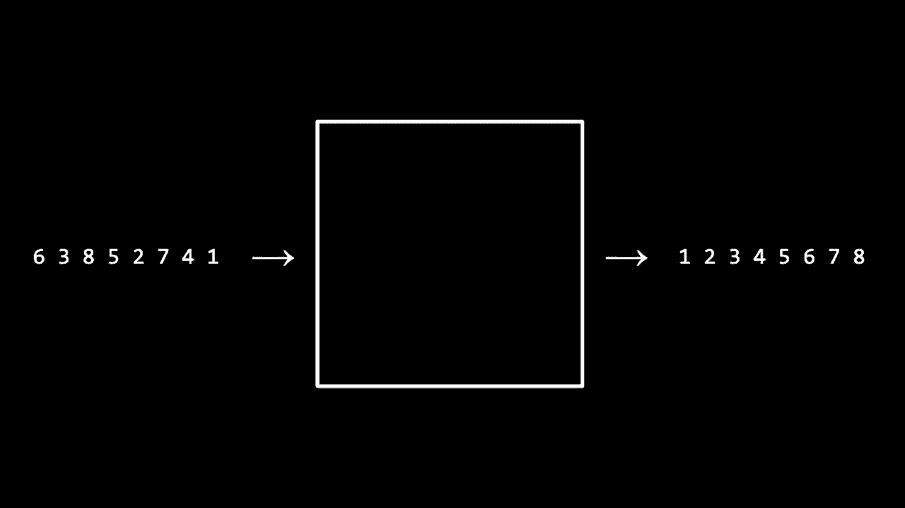


在本节课中，我们将要学习排序算法。我们将探讨两种基本的排序算法——选择排序和冒泡排序，并分析它们的效率。我们还将初步了解一种更高效的算法——归并排序，并理解递归在算法设计中的应用。


## 排序的必要性


上一节我们介绍了搜索算法，并了解到二分查找虽然高效，但要求数据必须预先排序。本节中我们来看看如何对数据进行排序。


排序的目标是将一个未排序的输入数组，转换成一个已排序的输出数组。例如，输入 `[6, 3, 8, 5, 2, 7, 4, 1]`，目标是得到输出 `[1, 2, 3, 4, 5, 6, 7, 8]`。

有人可能会问，既然线性查找简单直接，为什么还要费心去排序数据呢？以下是需要考虑的几点：

*   **效率权衡**：对于小型数据集，编写和运行一个简单的线性查找可能比先排序再使用二分查找更快。
*   **开发时间**：实现一个复杂但高效的算法（如二分查找）可能需要更多的时间和精力。
*   **应用场景**：对于需要**反复搜索**的大型数据集（如搜索引擎、社交网络），前期投入时间进行排序，后续就能持续享受高效搜索带来的收益。

## 选择排序

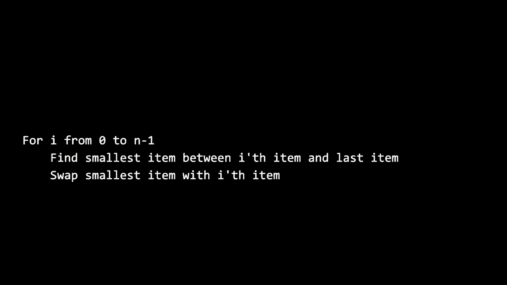

选择排序是一种直观的排序算法。其核心思想是：重复地在未排序部分中找到最小（或最大）元素，并将其放到已排序部分的末尾。

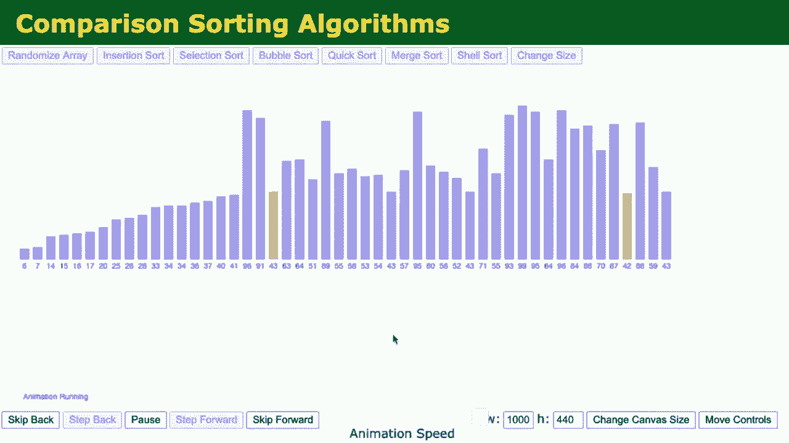

以下是选择排序的步骤描述：

1.  找到数组中最小的元素。
2.  将其与数组第一个位置的元素交换。
3.  接着在剩下的元素中找到最小的元素，将其与第二个位置的元素交换。
4.  重复此过程，直到整个数组排序完成。

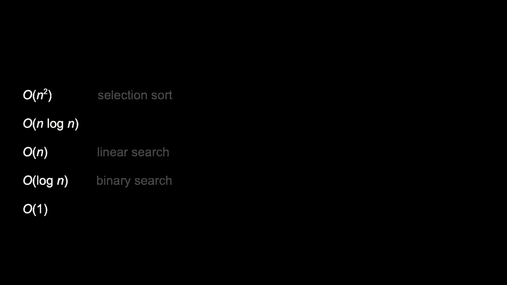

### 伪代码表示

选择排序的伪代码如下：
```
对于 i 从 0 到 n-2:
    找到从第 i 项到最后一项之间的最小项
    将最小项与第 i 项交换
```

### 效率分析

选择排序的运行时间可以近似用公式 **n² / 2 + n / 2** 来描述。当 n 很大时，起主导作用的是 **n²** 项。因此，在大 O 表示法中，选择排序的时间复杂度是 **O(n²)**。

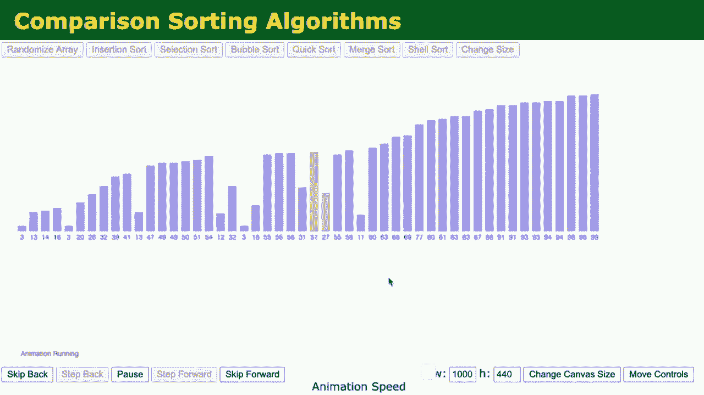

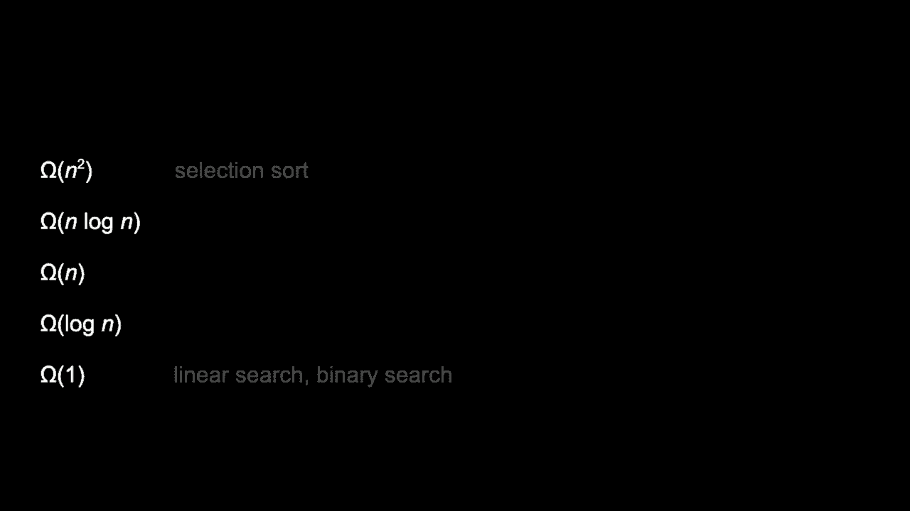

值得注意的是，即使输入数组已经是排序好的，选择排序仍然会进行全部的比较和交换操作，其最佳情况下的运行时间也是 **Ω(n²)**。所以我们可以更精确地说，选择排序的时间复杂度是 **Θ(n²)**。


## 冒泡排序

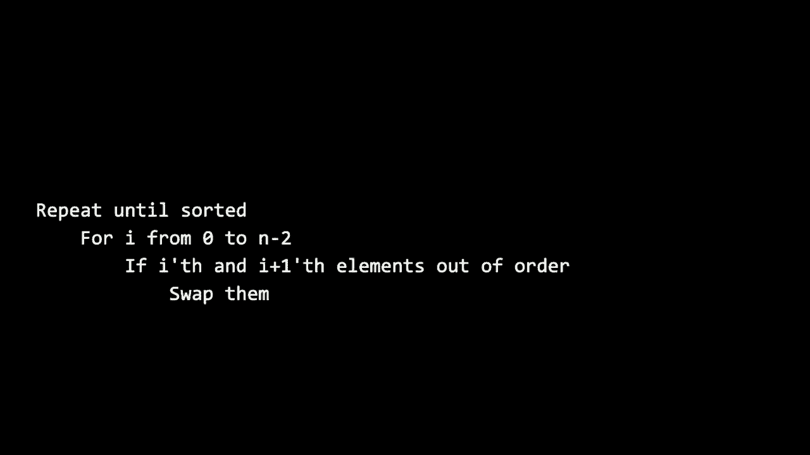


冒泡排序采用了一种不同的策略：它反复遍历列表，比较相邻的元素，如果它们的顺序错误就把它们交换过来。这个过程重复进行，直到列表排序完成。

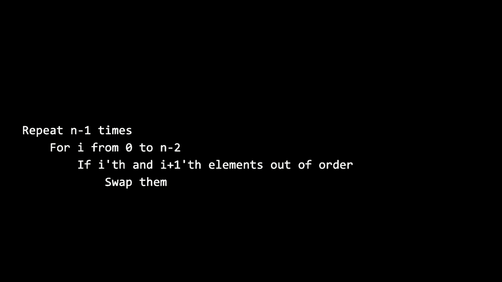

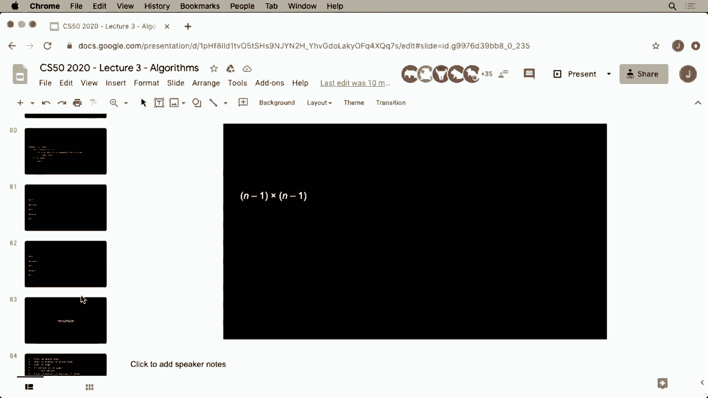

其名称来源于较大的元素会像气泡一样逐渐“浮”到列表的顶端（末尾）。

### 伪代码表示

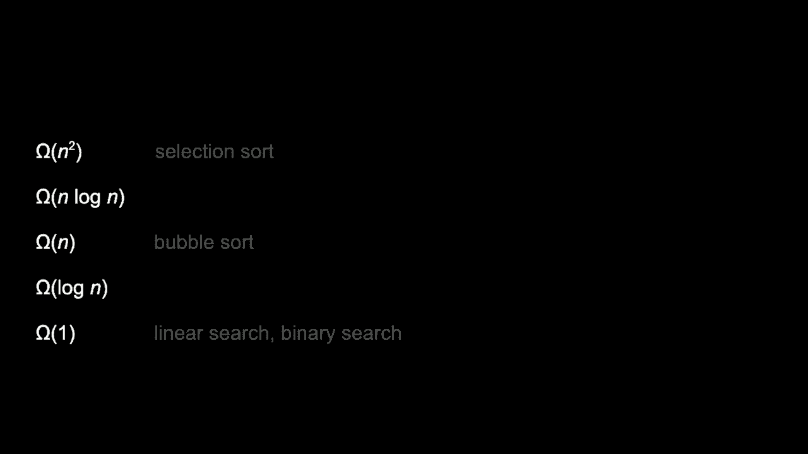


一个基础的冒泡排序伪代码如下：
```
重复 n-1 次：
    对于 i 从 0 到 n-2：
        如果 第 i 项 > 第 i+1 项：
            交换 第 i 项 和 第 i+1 项
```


我们可以对其进行优化，增加一个标志来记录本轮是否发生了交换。如果某一轮遍历没有发生任何交换，说明数组已经有序，可以提前终止算法。

优化后的伪代码：
```
重复执行：
    设置 已排序 标志为 真
    对于 i 从 0 到 n-2：
        如果 第 i 项 > 第 i+1 项：
            交换 第 i 项 和 第 i+1 项
            设置 已排序 标志为 假
    如果 已排序 标志为 真：
        退出循环
```

### 效率分析

在最坏情况下，冒泡排序需要进行大约 **n²** 次比较，所以其上界时间复杂度为 **O(n²)**。然而，在最佳情况下（输入已排序），优化后的冒泡排序只需进行 **n-1** 次比较就能提前结束，因此其下界时间复杂度为 **Ω(n)**。

## 递归与归并排序简介

我们能否做得比 **O(n²)** 更好呢？答案是肯定的。归并排序就是一种更高效的算法，其平均和最坏情况下的时间复杂度为 **O(n log n)**。

归并排序的核心思想是 **分治法**：
1.  **分**：递归地将数组分成两半。
2.  **治**：对每一半进行排序（递归调用自身）。
3.  **合**：将两个已排序的半部分合并成一个完整的已排序数组。

这里的关键操作是 **合并**：给定两个已排序的数组，我们可以通过不断比较两个数组前端的最小元素，将较小的那个放入新数组，从而高效地合并它们。

### 递归概念

归并排序的实现依赖于 **递归**，即函数调用自身的能力。递归需要定义一个 **基本情况**（例如，当数组只有一个元素时，它本身就是有序的），以及一个 **递归情况**（将问题分解为更小的子问题并调用自身解决）。

虽然归并排序的代码可能更复杂，并且通常需要额外的内存空间来辅助合并，但其 **O(n log n)** 的效率在处理大规模数据时远胜于 **O(n²)** 的算法。这体现了计算机科学中常见的 **权衡**：用更复杂的逻辑或更多的内存空间，来换取运行时间上的巨大提升。

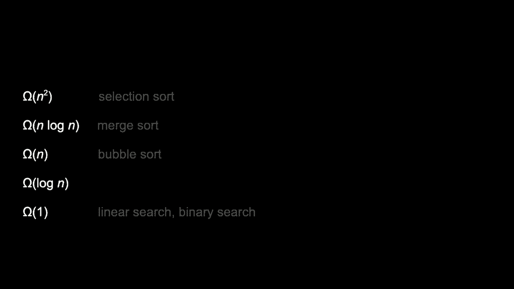

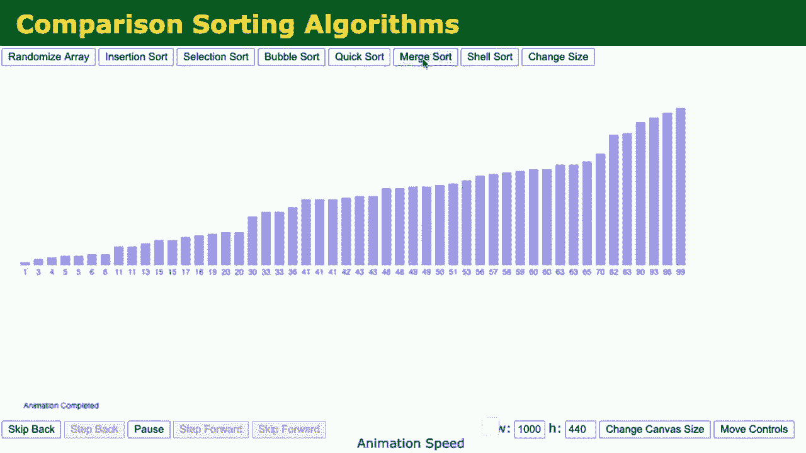

## 算法比较与总结

本节课中我们一起学习了三种排序算法：

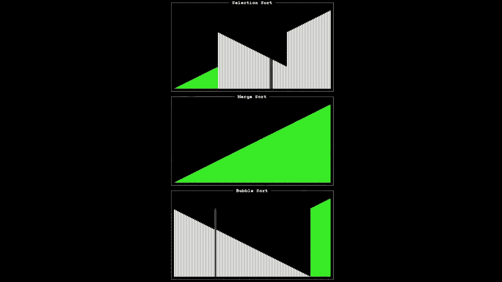

*   **选择排序**：简单直观，但效率较低，时间复杂度为 **Θ(n²)**。它不关心输入数据的初始状态。
*   **冒泡排序**：通过局部交换来排序，优化后对已排序数据友好（**Ω(n)**），但最坏情况仍是 **O(n²)**。
*   **归并排序**：利用分治法和递归，实现了 **Θ(n log n)** 的高效排序，但实现相对复杂，且需要额外空间。


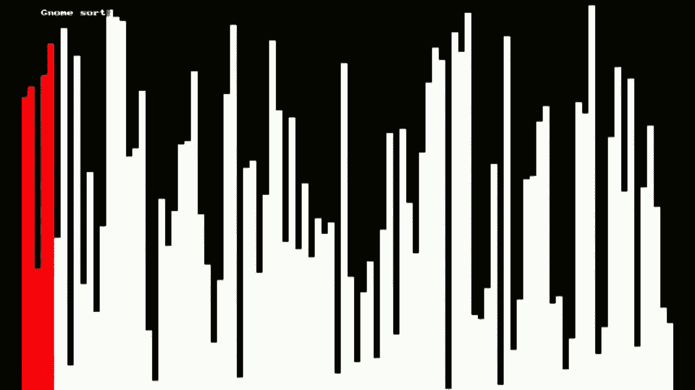

可视化对比清楚地表明，当数据量增长时，**O(n²)** 算法的耗时将急剧增加，而 **O(n log n)** 算法的增长则平缓得多。在实际编程中，我们通常会使用标准库中已经高度优化的排序函数，但理解这些底层原理对于成为优秀的程序员至关重要。它帮助我们做出明智的权衡，并理解算法效率对程序性能的巨大影响。